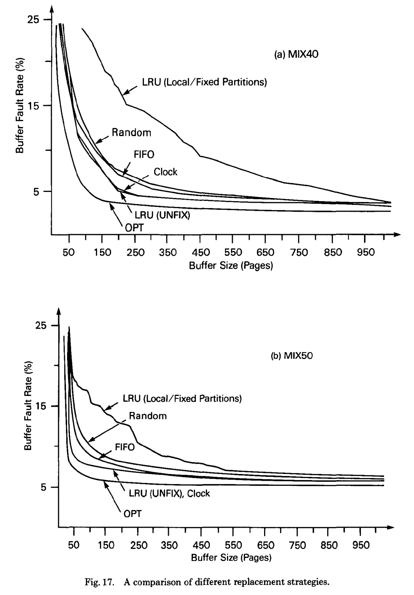
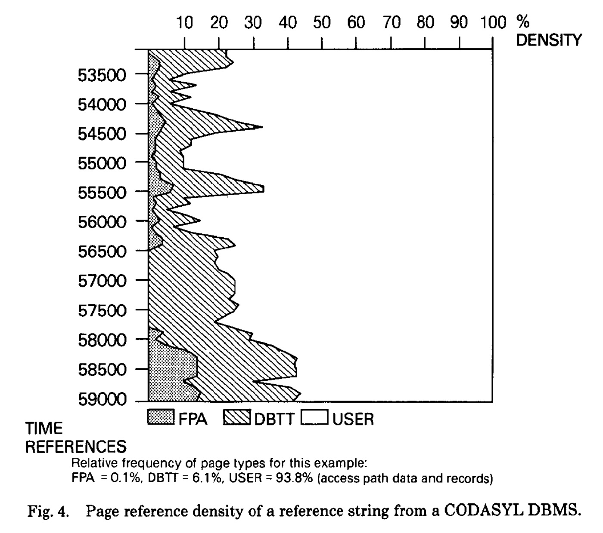
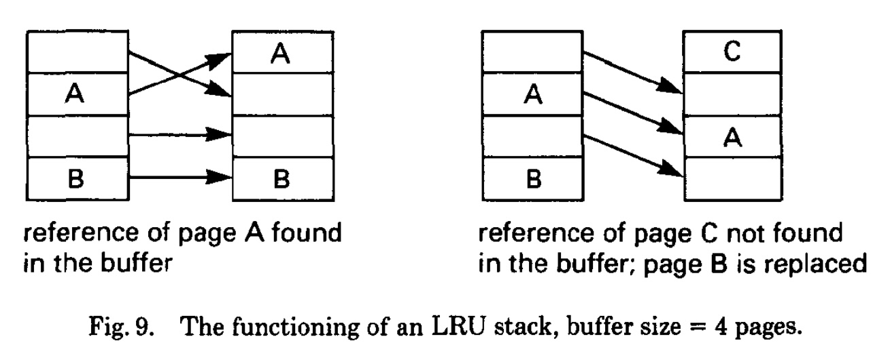
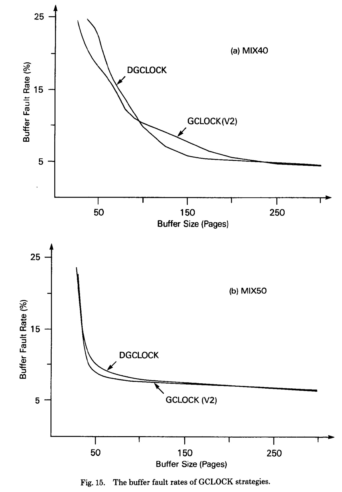
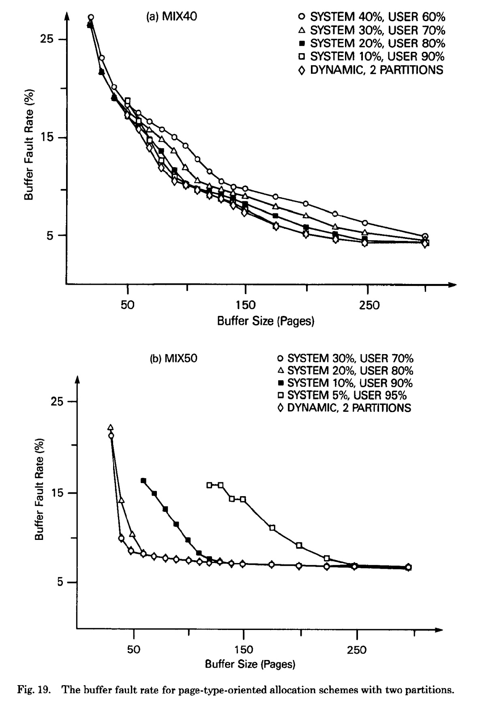
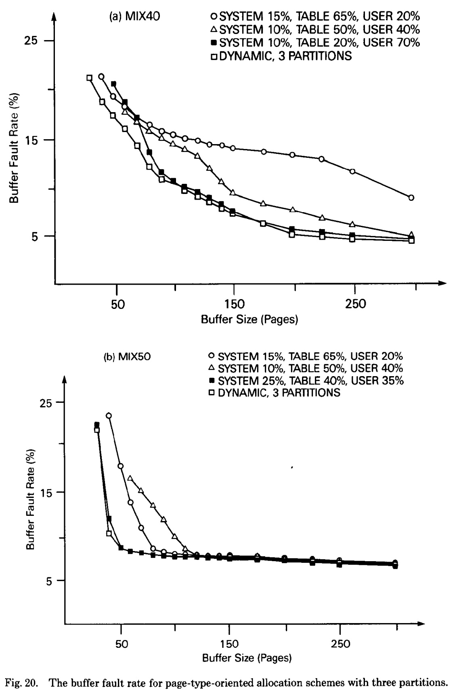

## AI论文解读 | Principles of Database Buffer Management
        
### 作者        
digoal        
        
### 日期        
2025-10-27        
        
### 标签        
PostgreSQL , PolarDB , DuckDB , AI , 论文解读        
        
----        
        
## 背景  
      
https://dl.acm.org/doi/pdf/10.1145/1994.2022        
  
提示:          
```          
读懂《Principles of Database Buffer Management》这篇论文需要提前掌握哪些基础知识, 请使用中文通熟易懂的讲解这些基础知识, 可以引用论文中的图、表或使用Markdown支持的图形(text,mermaid等)增加解释性. 
  
使用中文通熟易懂的解读《Principles of Database Buffer Management》这篇论文, 其中的关键内容请着重讲解, 可以引用论文中的图、表或使用Markdown支持的图形(text,mermaid等)增加解释性. 
  
提取《Principles of Database Buffer Management》这篇论文中的重要术语, 使用中文对这些术语进行通熟易懂的讲解, 可以引用论文中的图、表或使用Markdown支持的图形(text,mermaid等)增加解释性. 
```     
  
## 1 前置知识 
  
要透彻理解这篇经典的《数据库缓冲区管理原理》（Principles of Database Buffer Management），你需要掌握一些来自 **操作系统（OS）** 和 **数据库（DBMS）** 领域的基础知识。

这篇论文的核心是讨论数据库管理系统（DBMS）中一个关键组件—— **缓冲区管理器（Buffer Manager）** 的实现 。你可以把缓冲区管理器想象成一个“图书管理员”，他负责管理一块高速缓存区域（“阅览室”），以便让数据库的“用户”（即各种查询操作）能快速读写数据，而不需要每次都去访问缓慢的“档案库”（即磁盘）。

以下是阅读本文前需要掌握的核心基础知识：

### 1\. 核心前提：为什么需要缓冲区？(存储层次结构)

计算机的存储系统是分层的，速度、成本和容量各不相同。

  * **CPU（处理器）：** 速度最快，但只能直接操作内存中的数据。
  * **Main Memory（主存/内存）：** 速度快，但价格昂贵，且数据是**易失的**（断电即丢失）。
  * **Disk（磁盘）：** 速度慢（比内存慢几个数量级），但价格便宜，且数据是**非易失的**（可持久保存）。

数据库的“海量数据”存储在磁盘上 。但是，CPU 无法直接修改磁盘上的数据，必须先将数据加载到内存中才能进行比较、插入、修改等操作 。

**缓冲区（Buffer）就是在内存中开辟的一块区域，专门用于临时存放从磁盘读出、或准备写回磁盘的数据页 。这篇论文的最终目标**，就是探讨如何管理这个缓冲区，使得访问磁盘（称为“物理 I/O”）的次数最少 ，因为I/O操作是数据库系统中最昂贵的操作之一 。

### 2\. 操作系统（OS）基础：虚拟内存与分页

这篇论文一个很重要的点，是把“数据库缓冲区管理”与“操作系统虚拟内存（VM）分页”进行了对比 。你需要先了解OS的分页机制：

  * **分页（Paging）：** 操作系统为了让程序能使用比实际物理内存更大的地址空间，也会在内存和磁盘之间缓存数据。OS 将内存和程序都划分为固定大小的“页”（Page）。
  * **OS的角色：** OS 的分页对上层程序来说是“透明”的，程序不知道自己哪些数据在内存、哪些在磁盘。

**为什么数据库不直接用OS的分页？**
这是理解本文的关键。论文指出，大多数 DBMS 选择自己管理缓冲区，而不是使用 OS 的文件缓存 。因为：

1.  **DBMS 更“懂”数据：** OS 不知道哪些数据页是“索引页”（可能需要频繁访问），哪些是“数据页”。而 DBMS 知道。
2.  **DBMS 需要更强的控制力：** 论文引入了 **`FIX`（固定）** 的概念 。当 DBMS 正在修改某一页时，它必须“固定”这一页 ，防止 OS 或缓冲区管理器“不合时宜”地将其替换出去。当修改完成，DBMS 会调用 **`UNFIX`（释放）** 。OS 的分页机制通常不提供这种精细的控制。

### 3\. 数据库（DB）基础：事务与并发

  * **事务（Transaction）：** 数据库中的一个逻辑工作单元（例如“转账”操作）。
  * **并发（Concurrency）：** 数据库系统通常会同时运行**多个事务** 。

缓冲区是所有并发事务共享的资源 。因此，缓冲区管理器必须解决一个核心问题：**如何在这几十个并发运行的事务之间，分配有限的缓冲“帧”（Frame）？** 

这引出了论文中的 **分配策略（Allocation）** （如图 5 所示 ）：    

  * **Global（全局）分配：** 所有事务共享整个缓冲区。
  * **Local（局部）分配：** 为每个事务单独分配一部分缓冲区 。
  * **Page-Type Oriented（按页面类型）分配：** 按照页面类型（如系统页、数据页）来划分缓冲区 。


```mermaid
graph TD
    subgraph "缓冲区分配策略 (图 5) "
        A[Buffer Allocation] --> B["Local (按事务)"];
        A --> C["Global (全局)"];
        A --> D["Page-type oriented (按页面类型)"];
        B --> B1["Dynamic (动态)"];
        B --> B2["Static (静态)"];
    end
```

### 4\. 核心问题：替换算法（Replacement Algorithms）

这是论文的重中之重。当缓冲区满了，但一个事务请求的数据页（ Page $P_i$ ）不在缓冲区中（这称为“Buffer Fault”，缓冲区失效 ）时，缓冲区管理器必须：

1.  选择一个当前在缓冲区的页面（称为“Victim”，牺牲者）将其踢出去 。
2.  如果这个“牺牲者”页面被修改过（“脏页”），必须先把它写回磁盘 。
3.  把请求的 $P_i$ 读入空出来的缓冲帧中。

你需要了解以下**经典替换算法**，因为论文中的算法都是基于它们的改进：

  * **FIFO (First-In, First-Out)：** 先进先出 。最简单，但也最笨。它会替换掉“最早进入”缓冲区的页面，而不关心这个页面是否被频繁使用。
  * **LRU (Least Recently Used)：** 最近最少使用 。这个算法基于“局部性原理”（Locality），即假设最近被访问过的页面，将来也很可能被再次访问。因此，LRU 会替换掉“最长时间没有被访问过”的页面。
  * **LFU (Least Frequently Used)：** 最不经常使用 。替换掉“被访问次数最少”的页面。论文指出纯 LFU 有问题，一个早期被频繁访问但后续不再使用的页面，可能永远不会被替换 。

论文在图 11  中系统地总结了这些算法，并重点讨论了 **CLOCK** （LRU 的一种高效近似实现）、**GCLOCK**  和 **LRD**  等更适合数据库环境的改进算法。    

### 5\. 基础数据结构：如何快速查找？

当一个事务请求页面 $P_i$ 时，缓冲区管理器的第一个任务是 **“缓冲区搜索”（Buffer Search）** ：检查 $P_i$ 是否已在缓冲区中 。

这个搜索必须非常快 。你需要了解基本数据结构和它们的搜索效率。论文在图 1  中对比了几种搜索策略：    

  * **Direct Search (直接搜索)** ：即“顺序搜索”，遍历缓冲区中的每一个帧。如果缓冲区很大（比如有 N 帧），平均要查 N/2 次 。这太慢了。
  * **Indirect Search (间接搜索)** ：使用一个辅助的数据结构（如表）。
  * **Hash Table (哈希表)** ：这是论文推荐的策略。通过哈希函数，可以快速（接近 O(1) 复杂度）定位到页面 $P_i$ 对应的描述信息 。论文中的图 2  展示了如何使用哈希表来管理缓冲区。    

-----

### 知识脉络总结

你可以通过下面这个（非论文中的）示意图来理解这些基础知识是如何支撑起“缓冲区管理”这个主题的：

```mermaid
graph TD
    subgraph "前提知识"
        OS[OS: 虚拟内存 & 分页]
        DB[DB: 事务 & 并发]
        DS[DS: 哈希表 & 链表]
        Algo["Algo: 算法基础 (LRU, FIFO)"]
        HW["HW: 存储层次 (内存/磁盘)"]
    end
    
    subgraph "论文核心主题: 缓冲区管理 "
        BM(Buffer Manager)
        T1(任务1: 搜索 )
        T2(任务2: 分配 )
        T3(任务3: 替换 )
    end

    HW --> BM
    OS --> BM
    DB --> T2
    DS --> T1
    Algo --> T3
```

总之，如果你对**OS内存管理**、**数据库事务**以及**基础算法（特别是LRU）和数据结构（特别是哈希表）** 有了基本的了解，你就具备了读懂这篇论文的必要基础。
  
## 2 解读论文 
  
这是一篇数据库（DBMS）领域的奠基性论文 ，它系统性地定义了数据库缓冲区管理器（Buffer Manager）的设计原理和实现方法。

通俗地说，数据库的数据“仓库”是缓慢的磁盘，而 CPU 只能在“工作台”（内存）上处理数据 。 **缓冲区管理器（Buffer Manager）** 就扮演着“图书管理员”的角色，他负责在内存中开辟一块高速“阅览室”（即缓冲区），并决定：

1.  哪些“书”（数据页）应该从“仓库”（磁盘）搬到“阅览室”（缓冲区）。
2.  当“阅览室”满了，哪本“书”应该被送回“仓库”，以便腾出空间。

这篇论文的核心目标是：**设计一个高效的“图书管理员”，使得去“仓库”（磁盘）取书的次数（即物理 I/O）最少** 。

以下是这篇论文的关键内容解读：

-----

### 关键内容一：DBMS 缓冲区 vs. OS 虚拟内存（根本区别）

论文首先强调，数据库的缓冲区管理和操作系统的虚拟内存（VM）分页机制**完全不同** 。

最大的区别在于 **`FIX`（固定）** 和 **`UNFIX`（释放）** 机制 。

  * **OS 虚拟内存**：对上层程序是“透明的”，程序不知道哪一页在内存中。操作系统可能随时会把任意一页换出到磁盘。
  * **DBMS 缓冲区**：DBMS 的上层组件（如查询处理器）在访问一个页面之前，必须先调用 `FIX` 操作 。
      * **`FIX`**：告诉缓冲区管理器：“我要用 $P_i$ 页，请把它加载到缓冲区，并 **钉住（Fix）** ，在我（上层组件）说 `UNFIX` 之前，你*绝对不能*把它替换出去！” 。
      * **`UNFIX`**：告诉缓冲区管理器：“我用完 $P_i$ 页了，你现在可以解除它的‘钉住’状态，它变成了可被替换的‘候选人’” 。

这个 `FIX`/`UNFIX` 机制至关重要，它保证了 DBMS 在操作一个页面时（例如修改一条记录），这个页面不会在操作中途“消失”（被替换回磁盘） 。

-----

### 关键内容二：缓冲区管理器的三大核心任务

论文指出，缓冲区管理器必须高效地完成三项基本任务：**搜索、分配、替换** 。

#### 任务1：缓冲区搜索 (Buffer Search)

**问题：** 当 DBMS 请求页面 $P_i$ 时，如何快速判断它是否已经在缓冲区（“阅览室”）里了？

**方案：** 论文在图 1 中对比了多种搜索策略。    

```mermaid
graph TD
    A["搜索策略 (图 1)"] --> B(直接搜索);
    A --> C(间接搜索 - 使用辅助表);
    B --> B1(顺序搜索);
    C --> C1(翻译表);
    C --> C2(排序/未排序表);
    C --> C3(链表);
    C --> C4(哈希表);
```

  * **直接搜索**：就是遍历缓冲区的所有帧，检查页号。如果缓冲区有 N 帧，平均要查 N/2 次 。这太慢了。
  * **间接搜索**：使用一个额外的表来快速定位。
  * **结论（重点）** ：论文推荐使用**哈希表（Hash Table）** 。如图 2 所示，以“页号”为 Key，“在缓冲区中的地址”为 Value。这使得搜索效率极高，接近 $O(1)$ 。    

#### 任务2：缓冲区分配 (Buffer Allocation)

**问题：** 当多个事务（用户）同时运行时，有限的缓冲区“帧”如何分配给它们？

**方案：** 论文在图 5 中提出了三种分配策略。    

```mermaid
graph TD
    A["缓冲区分配 (图 5)"] --> B(Local 局部);
    A --> C(Global 全局);
    A --> D(Page-type oriented 按页面类型);
    B --> B1(Static 静态);
    B --> B2(Dynamic 动态);
    D --> D1(Static 静态);
    D --> D2(Dynamic 动态);
```

1.  **全局分配 (Global)：** 

      * 所有事务共享整个缓冲区。
      * 当发生缺页（Buffer Fault）时，替换算法会从*所有*未被 `FIX` 的页面中选择一个“牺牲者”。
      * 这是最简单也最常见的策略。

2.  **局部/事务导向 (Local)：** 

      * 为每个事务分配一个*私有*的缓冲区“分区”。
      * 当事务缺页时，只能替换自己分区内的页面。
      * **静态 (Static)** 分配（例如，每个事务固定 10 帧）非常僵化，论文在图 13 和图 17 的实验中证明，设计不当的静态分配性能极差，甚至不如随机替换 。       
      * **动态 (Dynamic)** 分配（如基于“工作集 (Working-Set)”模型 ）更为灵活。

3.  **按页面类型分配 (Page-type oriented)：** 

      * 这是论文提出的一个新思路。
      * 数据库的页面类型不同，访问模式也不同。例如，“索引页”和“数据页”的访问特性完全不同 。
      * 图 4 就显示了系统页面（DBTT）和用户页面（USER）的访问密度随时间剧烈变化 。    
      * 因此，可以为不同类型的页面设置不同的“分区”，并使用不同的替换策略 。

#### 任务3：页面替换 (Page Replacement)

**问题：** 当缓冲区满了且发生缺页时，到底该踢出（替换）哪一页？这是本文的**核心中的核心**。

论文系统地梳理了各种替换算法（见图 11 ），并基于 DBMS 的特性（如 `FIX` 机制和 locality ）进行了改进。    

**1. 经典算法及其问题：**

  * **FIFO (First-In, First-Out)**：替换最早进来的页 。非常愚蠢，可能会踢出刚刚被频繁访问的页。
  * **LRU (Least Recently Used)**：替换“最近最少使用”的页 。基于“局部性原理”（最近用过的将来也可能用），在很多场景下表现良好。
  * **LFU (Least Frequently Used)**：替换“访问频率最低”的页 。论文指出 LFU 有个大问题：一个页面在早期被高频访问，但后续不再使用，它的计数值很高，可能导致它永远“赖着不走” 。

**2. 针对 DBMS 的关键改进（重点）：**

  * **LRU (UNFIX) vs. LRU (Reference)：**

      * 标准 LRU 关心“最后一次**引用** (Reference)”的时间。
      * 但论文指出，在 DBMS 中，一个页面可能被 `FIX` 很长时间（例如，事务被阻塞了）。
      * 因此，DBMS 应该使用 **LRU (UNFIX)**：即替换“ **最近最少被释放 (UNFIX)** ”的页面 。这才是真正反映页面何时“空闲”的指标。

  * **CLOCK 算法 (LRU 的近似实现)：**

      * 实现真正的 LRU（如图 9 所示 ）需要维护一个复杂的链表，开销很大。    
      * CLOCK (如图 10b) 是一个高效的近似算法 。它使用一个“使用位 (Use-bit)”和一个循环指针。   
      * 指针巡视缓冲区：
          * 如果页面的 Use-bit 是 1（表示最近被用过），就把它设为 0，然后跳过（给它“第二次机会”）。
          * 如果 Use-bit 是 0（表示最近没被用过），就替换它 。
      * 论文的实验（图 14）证明，CLOCK 的性能与真 LRU 非常接近 。    

**3. 论文提出的高级算法（GCLOCK 和 LRD）：**

由于 DBMS 缓冲区是软件实现的（不像 OS Paging 有硬件支持），这提供了更多自由度，可以设计更复杂的算法 。

  * **GCLOCK (Generalized CLOCK)**：

      * 这是 CLOCK 的扩展版 (如图 10d)。   
      * 它不用简单的 0/1“使用位”，而是使用一个“**引用计数器 (RC)**” 。
      * 每次页面被访问，RC 增加 。
      * 指针巡视时，不再是检查 0/1，而是*递减* RC 的值。当某个页面的 RC 减到 0 时，就替换它 。
      * GCLOCK 还可以引入“权重”，例如，“索引页”的 RC 每次增加 5，“数据页”只增加 1，从而实现更精细的控制 。

  * **LRD (Least Reference Density，最小引用密度)**：

      * 这是论文提出的另一个高级算法 (如图 10e)。    
      * 它同时考虑了“**频率 (RC)**”和“**年龄 (Age)**”。
      * 它计算一个“**引用密度 (RD)**”： $RD(i) = RC(i) / (GRC - FC(i))$ 。
      * 其中， $RC(i)$ 是页面 $i$ 的引用次数， $FC(i)$ 是它被加载进来的时间， $GRC$ 是全局总引用次数。分母 $(GRC - FC(i))$ 就是这个页面的“年龄” 。
      * LRD 算法会替换掉 $RD$ 值最低的页面 。
      * 这解决了 LFU 的问题：一个“老”页面如果不再被访问，它的分母（年龄）会持续增大，导致其 $RD$ 值下降，最终被替换出去。

-----

### 关键内容三：性能评测与结论

论文通过实验（图 13 到 图 20）对比了这些算法，得出了一些重要结论：

1.  **静态分配很危险**：图 13 显示，糟糕的静态分区（Local/Fixed Partitions）性能是灾难性的，比随机替换还差 。   
2.  **LRU 和 CLOCK 是“性价比之王”** ：它们实现简单，性能稳定且良好。图 14 显示两者的性能曲线几乎重合 。   
3.  **GCLOCK 和 LRD 潜力巨大**：图 15 和 16 显示，通过精心调参，GCLOCK 和 LRD 在某些情况下可以超越 LRU 。       
4.  **按类型分配很复杂**：图 19 和 20 显示，“按页面类型”分配时，动态分区优于静态分区 。但论文也指出，这种策略非常复杂，需要精确的参数调整，不一定总比优秀的全局算法（如 GCLOCK）好 。     

### 总结

这篇论文为现代数据库缓冲区管理奠定了理论基础。它的核心贡献是：

1.  **定义了接口**：明确了 DBMS 缓冲区管理和 OS 虚拟内存的本质区别，提出了 `FIX`/`UNFIX` 机制 。
2.  **推荐了搜索方案**：通过对比（图 1），强烈推荐使用**哈希表**进行缓冲区搜索 。   
3.  **系统化了替换算法**：不仅梳理了 FIFO、LRU、CLOCK 等算法（图 11），还基于 DBMS 的软件实现特性，提出了更先进、更灵活的 **GCLOCK** 和 **LRD** 算法家族 。   

它最终给出的建议是：在简单和性能之间权衡。LRU/CLOCK 简单有效 ；而 LRD/GCLOCK 更复杂，但提供了通过参数调整来适应特定 DBMS 和应用负载的潜力 。
  
## 3 术语 
  
这篇论文系统性地定义了数据库缓冲区管理（Buffer Management）的原理和实现。以下是论文中一些最关键的术语及其通俗易懂的讲解：

-----

### 1\. 基础概念：缓冲区与引用

#### 缓冲区管理器 (Buffer Manager)

  * **讲解：** 这是 DBMS 内部的一个核心组件 。你可以把它想象成一个“图书管理员”。数据库的“书库”（磁盘）非常大但访问很慢，而“阅览室”（内存缓冲区）很小但访问快。这个管理员的工作就是决定何时、把哪些书（数据）从书库搬到阅览室，以及阅览室满了该踢掉哪些书 。
  * **目标：** 尽量减少去“书库”（磁盘）取书的次数，即最小化“物理 I/O” 。

#### 页面 (Page) 与 帧 (Frame)

  * **页面 (Page)：** 数据库在磁盘上存储数据的基本单位 。为了方便管理，数据被分成固定大小的块（例如 4KB）。
  * **帧 (Frame)：** 内存缓冲区中用来存放“页面”的“槽位”，大小与页面相同 。
  * **关系：** 当你需要一个“页面”时，缓冲区管理器会找一个空闲的“帧”，把页面从磁盘读入这个帧中。

#### 逻辑引用 (Logical Reference) vs. 物理引用 (Physical Reference)

  * **逻辑引用：** 指 DBMS 的上层组件（如查询处理器）对一个页面的**一次请求** 。
  * **物理引用 (Physical I/O)：** 指一次**真正的磁盘访问**（读或写操作）。
  * **关系：** 这是衡量缓冲区效率的核心。
      * 如果你请求的页面*已在*缓冲区中（即“命中”），那么这次“逻辑引用” **不会** 产生“物理引用”。
      * 如果页面*不在*缓冲区中（即“未命中”），这次“逻辑引用” **会** 触发一次“物理引用”，将页面读入 。
      * 缓冲区的目标就是用最小的代价（内存），让“逻辑引用”导致“物理引用”的次数最少。

#### 缓冲区失效 (Buffer Fault)

  * **讲解：** 这是论文中使用的术语，特指“逻辑引用”发生时，所请求的页面不在数据库缓冲区中 。这与操作系统的“缺页错误（Page Fault）”是不同的概念 。一次“缓冲区失效”通常会导致一次“物理引用”。

-----

### 2\. 核心机制：FIX 与 UNFIX

这是理解 DBMS 缓冲区管理 *区别于* 操作系统虚拟内存的关键。

#### FIX (固定)

  * **讲解：** 当 DBMS 的某个组件（比如查询器）需要开始读取或修改某个页面 $P_i$ 时，它必须先对该页面执行 `FIX` 操作 。
  * **作用：** `FIX` 会告诉缓冲区管理器：“我正在使用 $P_i$ 页，请把它‘钉在’缓冲区里，在我通知你之前（即调用 `UNFIX` 之前），你**绝对不能**把它替换出去！” 。

#### UNFIX (释放)

  * **讲解：** 当组件用完 $P_i$ 页后，它必须调用 `UNFIX` 操作 。
  * **作用：** `UNFIX` 告诉缓冲区管理器：“ $P_i$ 页我用完了，它现在‘自由’了，如果需要，你可以将它作为替换的‘牺牲者’ ” 。


```mermaid
graph TD
    A[上层组件请求页面 P_i] --> B(Buffer Manager: P_i 在缓冲区吗?);
    B -- 否 (Buffer Fault) --> C["1\. 执行替换算法 (选择牺牲者 P_j)"]
    C --> D[2\. 若 P_j 被修改, 写回磁盘]
    D --> E[3\. 从磁盘读取 P_i 到帧]
    B -- "是 (Hit)" --> E;
    E --> F(Buffer Manager: FIX P_i);
    F --> G[返回 P_i 的内存地址给上层组件];
    G --> H[...上层组件使用 P_i...];
    H --> I(上层组件: UNFIX P_i);
    I --> J[Buffer Manager: P_i 变为可替换状态];
```

-----

### 3\. 三大任务与相关算法

论文指出，缓冲区管理器有三项主要任务：搜索、分配和替换 。

#### 任务1：缓冲区搜索 (Buffer Search)

  * **讲解：** 即“如何快速判断页面是否在缓冲区？”。论文在图 1 中对比了多种策略 。   
  * **推荐策略：哈希表 (Hash Table)**。如图 2 所示，使用一个以“页号”为键（Key）的哈希表，可以近乎 $O(1)$ 的速度快速定位到页面在缓冲区中的位置 。   

#### 任务2：缓冲区分配 (Buffer Allocation)

  * **讲解：** 当有多个事务并发运行时，如何把有限的缓冲“帧”分配给它们 。论文在图 5 中做了分类 。   
  * **全局 (Global) 分配：** 所有事务共享一个大池子 。替换算法可以从所有未被 `FIX` 的页面中进行选择 。
  * **局部 (Local) 分配：** 为每个事务划分一个“私有”的缓冲区 。
  * **工作集 (Working-Set, WS)：** 一种著名的“局部动态分配”算法 。它认为一个事务在任何时候都只需要它“最近”访问过的页面集合（即工作集） 。

#### 任务3：页面替换 (Page Replacement)

这是论文的重点。当发生“缓冲区失效”且缓冲区已满时，必须选择一个“牺牲者”页面将其踢出 。

  * **局部性 (Locality)：** 大多数替换算法都基于“局部性原理” ，即假设“最近被访问过的页面，将来也很可能被再次访问” 。图 3 中的“LRU 堆栈深度分布”就是用来分析局部性特征的 。    

  * **LRU (Least Recently Used) (最近最少使用)：**

      * **原理：** 替换掉“最长时间没有被访问过”的页面 。
      * **DBMS 变体 (重点)：** 论文指出，DBMS 不应使用“最近最少被*引用*”的 LRU，而应使用“**最近最少被*释放* (UNFIX)**”的 LRU 。这能更好地处理事务因等待而长时间 `FIX` 页面的情况 。

  * **CLOCK (时钟算法)：**

      * **原理：** LRU 的一种高效近似实现 。如图 10b 所示，它使用一个循环指针和一个“使用位” (use-bit) 。当指针扫过一个页面时，如果“使用位”为 1，就给它“第二次机会” (Second Chance) 并将位清零；如果为 0，就替换它 。   

  * **GCLOCK (Generalized CLOCK) (广义时钟算法)：**

      * **原理：** 论文对 CLOCK 的扩展 。如图 10d 所示，它不用 0/1 的“使用位”，而是使用一个**引用计数器 (RC)** 。  
      * **机制：** 扫描时，递减计数器，当某个计数器减到 0 时，替换该页 。
      * **优势：** 非常灵活。例如，可以给“索引页”和“数据页”设置不同的引用权重 。

  * **LRD (Least Reference Density) (最小引用密度)：**

      * **原理：** 论文提出的另一类高级算法，旨在同时平衡“访问频率”和“页面年龄” 。
      * **机制：** 如图 10e 所示，它计算一个“引用密度” $RD = RC / Age$ 。 $RC$ 是引用次数， $Age$ 是页面在缓冲区中停留的时间 。LRD 替换 $RD$ 值最低的页面 。   
      * **优势：** 解决了 LFU（最不常用）算法的缺陷——即一个早期高频访问但后续不再使用的“老”页面，其 $Age$ 会持续增加，导致 $RD$ 下降，最终被淘汰 。

-----

### 4\. 复杂环境下的问题

#### 双重页面失效 (Double-page faults)

  * **讲解：** 描述了在“虚拟内存操作系统”（Virtual OS）上运行 DBMS 时可能发生的灾难 。
  * **场景：**
    1.  DBMS 发生“缓冲区失效”，需要替换页面 $P_{vic}$ 。
    2.  但 $P_{vic}$ 所在的内存“帧”，**又被 OS**（它不知道 DBMS 的存在）当作“不常用”内存给换出到 OS 自己的磁盘分页区了。
    3.  结果：DBMS 为了踢出 $P_{vic}$ ，OS 必须先把它从 OS 的分页区读回来；然后 DBMS 才能把 $P_{vic}$ 写回数据库磁盘；最后 DBMS 才能读入新页面 。一次操作引发了多次 I/O。

#### Thrashing (系统颠簸/抖动)

  * **讲解：** 指系统的一种崩溃状态，此时 CPU 几乎没在做有用的工作，大部分时间都花在了“换页”（页面替换）上 。
  * **原因：** 当并发事务太多，每个事务分到的缓冲帧太少 ，导致“缓冲区失效”频率激增，I/O 开销急剧增大 。
  * **控制：** 论文指出，必须通过负载控制（动态限制并发事务数）来防止这种情况 。
  
## 参考        
         
https://dl.acm.org/doi/pdf/10.1145/1994.2022    
        
<b> 以上内容基于DeepSeek、Qwen、Gemini及诸多AI生成, 轻微人工调整, 感谢杭州深度求索人工智能、阿里云、Google等公司. </b>        
        
<b> AI 生成的内容请自行辨别正确性, 当然也多了些许踩坑的乐趣, 毕竟冒险是每个男人的天性.  </b>        
    
#### [期望 PostgreSQL|开源PolarDB 增加什么功能?](https://github.com/digoal/blog/issues/76 "269ac3d1c492e938c0191101c7238216")
  
  
#### [PolarDB 开源数据库](https://openpolardb.com/home "57258f76c37864c6e6d23383d05714ea")
  
  
#### [PolarDB 学习图谱](https://www.aliyun.com/database/openpolardb/activity "8642f60e04ed0c814bf9cb9677976bd4")
  
  
#### [PostgreSQL 解决方案集合](../201706/20170601_02.md "40cff096e9ed7122c512b35d8561d9c8")
  
  
#### [德哥 / digoal's Github - 公益是一辈子的事.](https://github.com/digoal/blog/blob/master/README.md "22709685feb7cab07d30f30387f0a9ae")
  
  
#### [About 德哥](https://github.com/digoal/blog/blob/master/me/readme.md "a37735981e7704886ffd590565582dd0")
  
  

  
