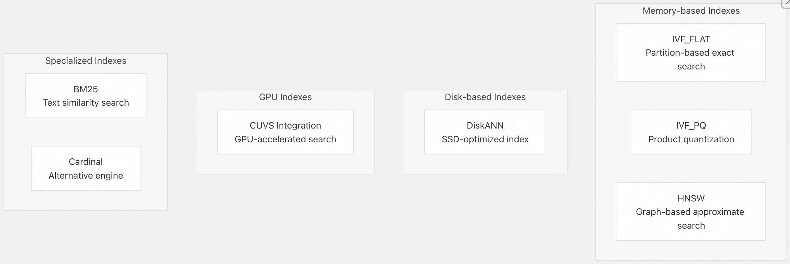
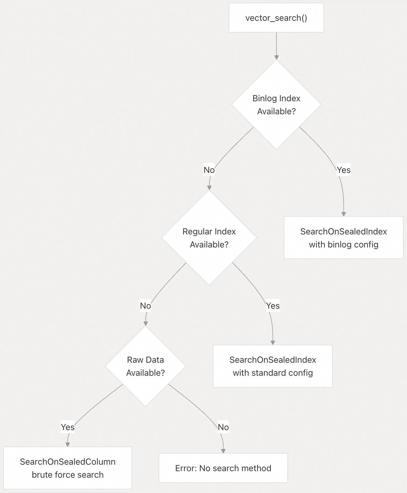
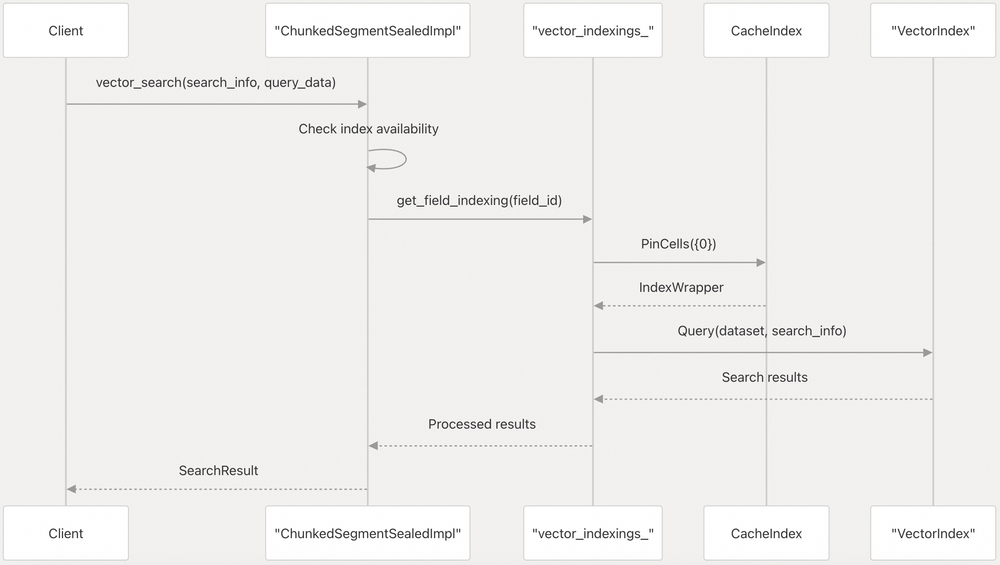
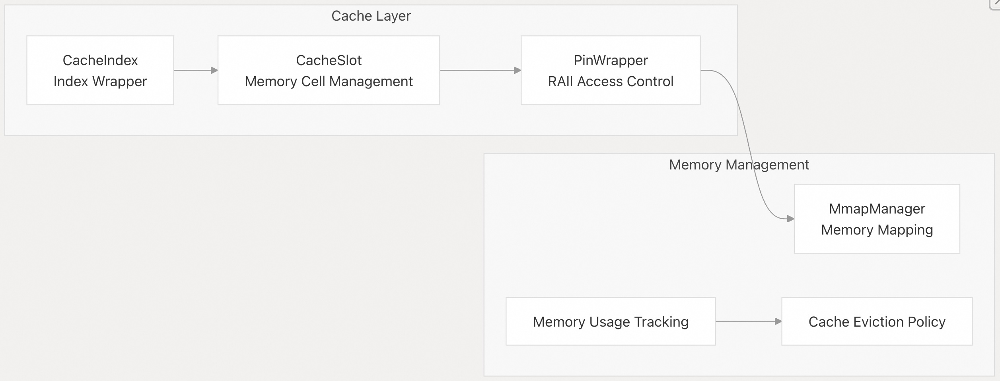
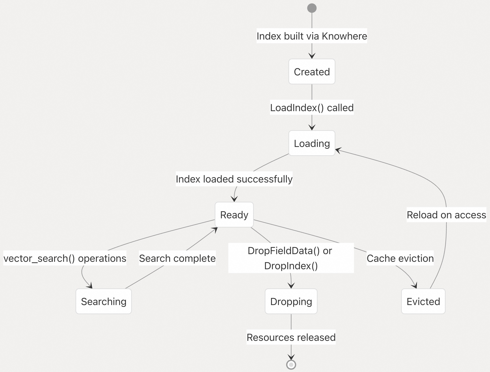
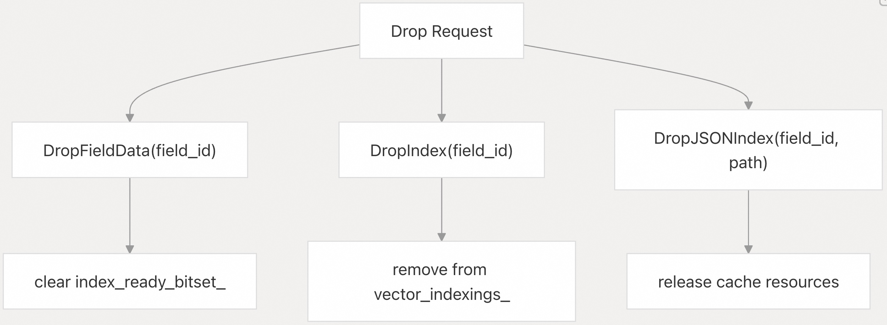

## Milvus 源码学习: 3.2 向量索引（Vector Indexing）   
                                        
### 作者                                       
digoal                                      
                                     
### 日期                                    
2025-10-28                                    
                                      
### 标签                                      
Milvus , 源码学习                                       
                                      
----                                      
                                      
## 背景                                   
本文介绍 Milvus 的向量索引系统，该系统为向量数据提供高效的相似性搜索能力。索引系统构建于 Knowhere 库之上，并与 Milvus 的段架构集成，以实现可扩展的向量搜索操作。  
  
## 概述  
Milvus 采用多层向量索引架构，将索引构建、加载和搜索执行分离。该系统以 Knowhere 库作为核心索引引擎，同时提供额外的缓存、内存管理和分布式操作层。  
  
### 索引架构  
    
  
来源：    
- [`internal/core/src/segcore/ChunkedSegmentSealedImpl.cpp` 第 91-150 行](https://github.com/milvus-io/milvus/blob/18371773/internal/core/src/segcore/ChunkedSegmentSealedImpl.cpp#L91-L150)    
- [`internal/core/thirdparty/knowhere/CMakeLists.txt` 第 1-66 行](https://github.com/milvus-io/milvus/blob/18371773/internal/core/thirdparty/knowhere/CMakeLists.txt#L1-L66)    
  
## Knowhere 集成  
  
Knowhere 作为底层向量索引库，提供了多种索引类型（如 IVF_FLAT、HNSW 等）的实现。Milvus 通过工厂模式(factory pattern)和配置系统与 Knowhere 集成。  
  
### Knowhere 配置  
  
Knowhere 库在 Milvus 初始化期间进行配置，并支持多种索引算法：  
  
    
  
来源：    
- [`internal/core/src/config/ConfigKnowhere.cpp` 第 31-52 行](https://github.com/milvus-io/milvus/blob/18371773/internal/core/src/config/ConfigKnowhere.cpp#L31-L52)    
- [`internal/core/thirdparty/knowhere/CMakeLists.txt` 第 26-40 行](https://github.com/milvus-io/milvus/blob/18371773/internal/core/thirdparty/knowhere/CMakeLists.txt#L26-L40)  
  
### 索引工厂模式(Index Factory Pattern)  
  
`IndexFactory` 提供了一种集中化的方式来创建和管理向量索引：  
  
    
  
来源：    
- [`internal/core/src/segcore/ChunkedSegmentSealedImpl.cpp` 第 123-132 行](https://github.com/milvus-io/milvus/blob/18371773/internal/core/src/segcore/ChunkedSegmentSealedImpl.cpp#L123-L132)    
- [`internal/core/unittest/test_sealed.cpp` 第 97-105 行](https://github.com/milvus-io/milvus/blob/18371773/internal/core/unittest/test_sealed.cpp#L97-L105)  
  
## 索引加载过程  
  
向量索引通过 `LoadIndexInfo` 结构体加载到段中，该结构体包含索引初始化所需的所有元数据和配置信息。  
  
### LoadIndexInfo 结构体  
  
加载过程涉及以下几个关键组件：  
  
| 组件 | 用途 | 关键字段 |  
|---|---|---|  
| `LoadIndexInfo` | 索引加载配置 | `field_id`、`index_params`、`cache_index` |  
| `LoadResourceRequest` | 资源需求 | `has_raw_data`、`memory_requirements` |  
| `CacheIndex` | 索引缓存层 | 内存管理、访问控制 |  
  
### 加载工作流  
  
    
  
来源：  
- [`internal/core/src/segcore/ChunkedSegmentSealedImpl.cpp` 第 105-150 行](https://github.com/milvus-io/milvus/blob/18371773/internal/core/src/segcore/ChunkedSegmentSealedImpl.cpp#L105-L150)  
  
## 索引类型与配置  
  
Milvus 通过 Knowhere 支持多种索引类型，每种类型针对不同的使用场景和数据特征进行了优化。  
  
### 支持的索引类型  
  
    
  
来源：    
- [`internal/core/thirdparty/knowhere/CMakeLists.txt` 第 26-40 行](https://github.com/milvus-io/milvus/blob/18371773/internal/core/thirdparty/knowhere/CMakeLists.txt#L26-L40)    
- [`internal/core/src/segcore/ChunkedSegmentSealedImpl.cpp` 第 797-800 行](https://github.com/milvus-io/milvus/blob/18371773/internal/core/src/segcore/ChunkedSegmentSealedImpl.cpp#L797-L800)  
  
## 搜索执行  
  
向量搜索过程采用分层方法，根据已加载的索引和配置，优先尝试使用最高效的方法。  
  
### 搜索优先级顺序  
  
    
  
来源：  
- [`internal/core/src/segcore/ChunkedSegmentSealedImpl.cpp` 第 752-814 行](https://github.com/milvus-io/milvus/blob/18371773/internal/core/src/segcore/ChunkedSegmentSealedImpl.cpp#L752-L814)  
  
### 基于索引的搜索流程  
  
    
  
来源：  
- [`internal/core/src/segcore/ChunkedSegmentSealedImpl.cpp` 第 828-834 行](https://github.com/milvus-io/milvus/blob/18371773/internal/core/src/segcore/ChunkedSegmentSealedImpl.cpp#L828-L834)  
  
## 索引内存管理  
  
Milvus 为向量索引实现了复杂的内存管理机制，包括缓存、内存映射和资源跟踪。  
  
### 内存管理组件  
  
| 组件 | 用途 | 实现方式 |  
|---|---|---|  
| `CacheIndex` | 索引缓存与访问控制 | 引用计数、内存跟踪 |  
| `mmap_field_ids_` | 内存映射字段跟踪 | 使用 mmap 的字段 ID 集合 |  
| `index_has_raw_data_` | 原始数据可用性跟踪 | 字段到布尔标志的映射 |  
  
### 缓存管理  
  
    
  
来源：  
- [`internal/core/src/segcore/ChunkedSegmentSealedImpl.cpp` 第 134-146 行](https://github.com/milvus-io/milvus/blob/18371773/internal/core/src/segcore/ChunkedSegmentSealedImpl.cpp#L134-L146)  
  
## 索引生命周期管理  
  
向量索引具有从创建到删除的明确定义的生命周期，并提供专门的加载、卸载和维护操作。  
  
### 生命周期操作  
  
   
  
来源：  
- [`internal/core/src/segcore/ChunkedSegmentSealedImpl.cpp` 第 860-890 行](https://github.com/milvus-io/milvus/blob/18371773/internal/core/src/segcore/ChunkedSegmentSealedImpl.cpp#L860-L890)  
  
### 索引删除与清理  
  
系统提供了删除索引并清理资源的机制：  
  
   
  
来源：  
- [`internal/core/src/segcore/ChunkedSegmentSealedImpl.cpp` 第 875-915 行](https://github.com/milvus-io/milvus/blob/18371773/internal/core/src/segcore/ChunkedSegmentSealedImpl.cpp#L875-L915)  
    
#### [期望 PostgreSQL|开源PolarDB 增加什么功能?](https://github.com/digoal/blog/issues/76 "269ac3d1c492e938c0191101c7238216")
  
  
#### [PolarDB 开源数据库](https://openpolardb.com/home "57258f76c37864c6e6d23383d05714ea")
  
  
#### [PolarDB 学习图谱](https://www.aliyun.com/database/openpolardb/activity "8642f60e04ed0c814bf9cb9677976bd4")
  
  
#### [PostgreSQL 解决方案集合](../201706/20170601_02.md "40cff096e9ed7122c512b35d8561d9c8")
  
  
#### [德哥 / digoal's Github - 公益是一辈子的事.](https://github.com/digoal/blog/blob/master/README.md "22709685feb7cab07d30f30387f0a9ae")
  
  
#### [About 德哥](https://github.com/digoal/blog/blob/master/me/readme.md "a37735981e7704886ffd590565582dd0")
  
  

  
