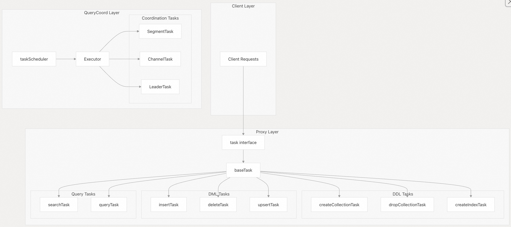
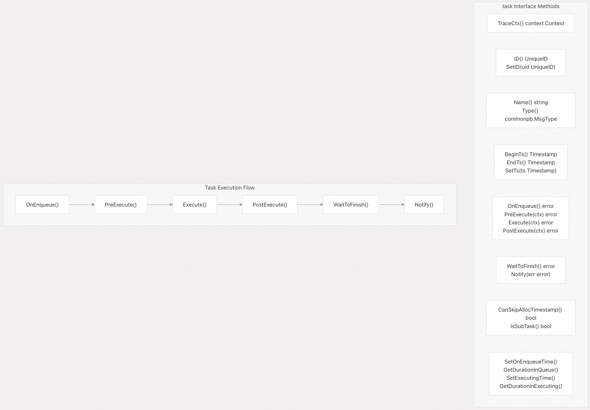
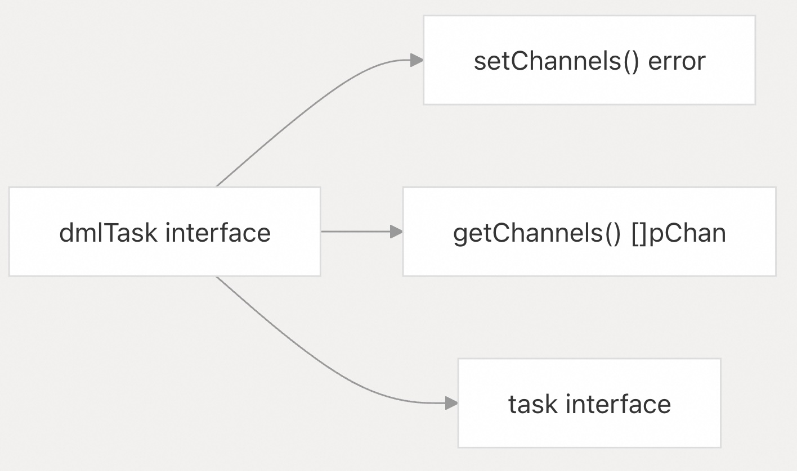
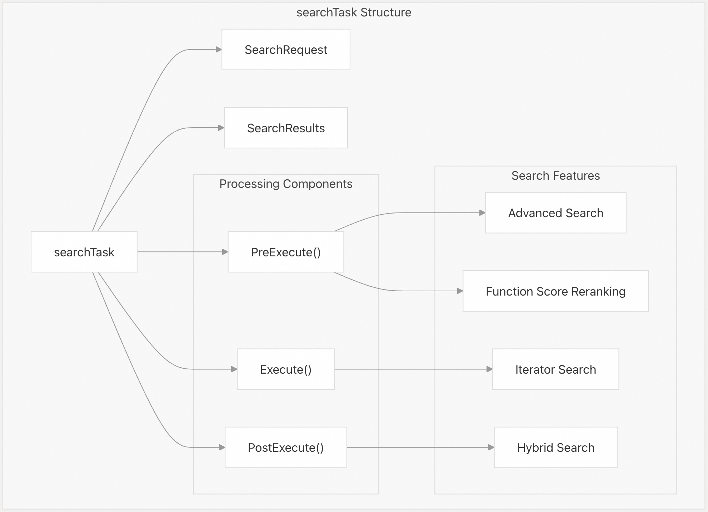
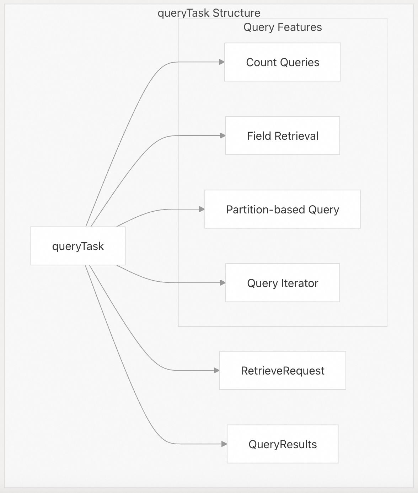
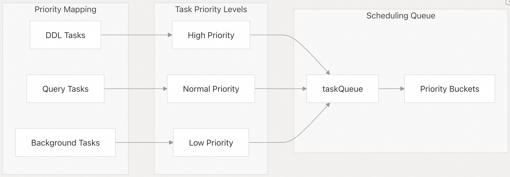
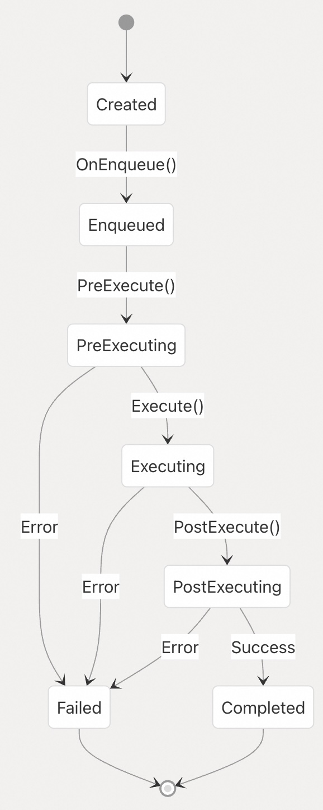

## Milvus 源码学习: 4.1 任务系统（Task System）   
                                            
### 作者                                           
digoal                                          
                                         
### 日期                                        
2025-10-28                                        
                                          
### 标签                                          
Milvus , 源码学习                                           
                                          
----                                          
                                          
## 背景     
任务系统是 Milvus 中用于处理所有操作的核心抽象，涵盖从面向客户端的请求到内部协调活动的各类任务。它为分布式系统中的请求处理、执行跟踪和错误处理提供了一个统一的框架。本文同时涵盖  
- 代理任务系统（Proxy Task System，用于处理客户端请求）  
- 查询协调器任务系统（QueryCoord Task System，用于管理内部协调任务）  
  
## 架构概览  
  
Milvus 中的任务系统在两个主要层级上运行：  
- 1、 **代理任务系统（Proxy Task System）**：处理面向客户端的操作（DDL、DML、搜索、查询）    
- 2、 **查询协调器任务系统（QueryCoord Task System）**：管理内部协调任务（段加载、通道管理）  
  
### 任务系统架构  
    
  
来源:    
- [`internal/proxy/task.go` 130–151](https://github.com/milvus-io/milvus/blob/18371773/internal/proxy/task.go#L130-L151)    
- [`internal/proxy/task.go` 79–119](https://github.com/milvus-io/milvus/blob/18371773/internal/proxy/task.go#L79-L119)    
- [`internal/querycoordv2/task/scheduler.go` 47–67](https://github.com/milvus-io/milvus/blob/18371773/internal/querycoordv2/task/scheduler.go#L47-L67)  
  
## 代理任务系统（Proxy Task System）  
  
代理任务系统通过统一的任务接口处理所有面向客户端的操作。每种操作类型都实现了核心任务接口，并包含特定的执行逻辑。  
  
### 任务接口与生命周期  
  
核心的 `task` 接口定义了 [`internal/proxy/task.go` 133–154](https://github.com/milvus-io/milvus/blob/18371773/internal/proxy/task.go#L133-L154) 中所有操作的契约：  
  
    
  
`baseTask` 结构体提供了通用的计时和队列管理功能实现。  
  
来源:    
- [`internal/proxy/task.go` 133–154](https://github.com/milvus-io/milvus/blob/18371773/internal/proxy/task.go#L133-L154)    
- [`internal/proxy/task.go` 156–183](https://github.com/milvus-io/milvus/blob/18371773/internal/proxy/task.go#L156-L183)  
  
### 任务类型与实现  
  
#### DDL 任务  
  
DDL（数据定义语言）任务用于处理模式（schema）相关操作。任务名称以常量形式定义：  
  
| 任务类型 | 任务名称常量 | 用途 | 关键特性 |  
|---|---|---|---|  
| `createCollectionTask` | `CreateCollectionTaskName` | 创建新集合 | 模式验证、分区键验证、支持聚簇键 |  
| `dropCollectionTask` | `DropCollectionTaskName` | 删除集合 | 元数据清理、通道管理 |  
| `addCollectionFieldTask` | `AddFieldTaskName` | 向集合中添加字段 | 字段验证、可空约束 |  
| `alterCollectionTask` | `AlterCollectionTaskName` | 修改集合属性 | Mmap/lazy 加载配置、分区键隔离 |  
| `hasCollectionTask` | `HasCollectionTaskName` | 检查集合是否存在 | 与 MetaCache 集成 |  
| `describeCollectionTask` | `DescribeCollectionTaskName` | 获取集合模式(collection schema) | 字段过滤、支持结构体数组 |  
| `showCollectionsTask` | `ShowCollectionTaskName` | 列出集合 | 内存视图 vs 持久化视图 |  
  
来源:    
- [`internal/proxy/task.go` 82–123](https://github.com/milvus-io/milvus/blob/18371773/internal/proxy/task.go#L82-L123)    
- [`internal/proxy/task.go` 193–468](https://github.com/milvus-io/milvus/blob/18371773/internal/proxy/task.go#L193-L468)    
- [`internal/proxy/task.go` 469–588](https://github.com/milvus-io/milvus/blob/18371773/internal/proxy/task.go#L469-L588)  
  
#### DML 任务  
  
DML（数据操作语言）任务通过消息流处理数据操作：  
  
| 任务类型 | 任务名称常量 | 用途 | 关键特性 |  
|---|---|---|---|  
| `insertTask` | `InsertTaskName` | 插入向量和数据 | 通道路由、批处理、自动生成 ID |  
| `deleteTask` | `DeleteTaskName` | 删除实体 | 基于主键或表达式的删除 |  
| `upsertTask` | `UpsertTaskName` | 插入或更新数据 | 合并插入/更新操作、支持函数处理 |  
  
所有 DML 任务均实现 `dmlTask` 接口，并包含通道(channel)管理方法：  
  
    
  
来源:    
- [`internal/proxy/task.go` 185–189](https://github.com/milvus-io/milvus/blob/18371773/internal/proxy/task.go#L185-L189)    
- [`internal/proxy/task_insert.go` 24–41](https://github.com/milvus-io/milvus/blob/18371773/internal/proxy/task_insert.go#L24-L41)    
- [`internal/proxy/task_delete.go` 1–50](https://github.com/milvus-io/milvus/blob/18371773/internal/proxy/task_delete.go#L1-L50)    
- [`internal/proxy/task_upsert.go` 1–50](https://github.com/milvus-io/milvus/blob/18371773/internal/proxy/task_upsert.go#L1-L50)  
  
#### 查询任务  
  
查询任务用于处理数据检索操作：  
  
**SearchTask 架构：**    
  
    
  
来源:    
- [`internal/proxy/task_search.go` 54–97](https://github.com/milvus-io/milvus/blob/18371773/internal/proxy/task_search.go#L54-L97)    
- [`internal/proxy/task_search.go` 127–287](https://github.com/milvus-io/milvus/blob/18371773/internal/proxy/task_search.go#L127-L287)  
  
**QueryTask 架构：**    
  
    
  
来源:    
- [`internal/proxy/task_query.go` 48–78](https://github.com/milvus-io/milvus/blob/18371773/internal/proxy/task_query.go#L48-L78)    
- [`internal/proxy/task_query.go` 267–300](https://github.com/milvus-io/milvus/blob/18371773/internal/proxy/task_query.go#L267-L300)  
  
## 查询协调器任务系统（QueryCoord Task System）  
  
查询协调器任务系统用于管理维护集群状态和数据分布的内部协调操作。  
  
### 任务调度器架构  
  
`taskScheduler` 负责在 QueryCoord 中管理任务执行，并具备复杂的跟踪和资源管理能力：  
  
    
  
来源:    
- [`internal/querycoordv2/task/scheduler.go` 283–343](https://github.com/milvus-io/milvus/blob/18371773/internal/querycoordv2/task/scheduler.go#L283-L343)    
- [`internal/querycoordv2/task/scheduler.go` 106–131](https://github.com/milvus-io/milvus/blob/18371773/internal/querycoordv2/task/scheduler.go#L106-L131)  
  
### QueryCoord 任务类型  
  
#### 任务类型分类  
  
QueryCoord 管理六种任务类型，定义于 [`internal/querycoordv2/task/scheduler.go` 47–62](https://github.com/milvus-io/milvus/blob/18371773/internal/querycoordv2/task/scheduler.go#L47-L62) ：  
  
    
  
`TaskTypeName` 映射表为日志记录和调试提供字符串表示。  
  
来源:    
- [`internal/querycoordv2/task/scheduler.go` 47–68](https://github.com/milvus-io/milvus/blob/18371773/internal/querycoordv2/task/scheduler.go#L47-L68)  
  
#### 任务执行流程  
  
任务执行流水线包含调度器（scheduler）和执行器（executor）两个组件：  
  
    
  
来源:    
- [`internal/querycoordv2/task/scheduler.go` 387–418](https://github.com/milvus-io/milvus/blob/18371773/internal/querycoordv2/task/scheduler.go#L387-L418)    
- [`internal/querycoordv2/task/executor.go` 118–152](https://github.com/milvus-io/milvus/blob/18371773/internal/querycoordv2/task/executor.go#L118-L152)  
  
## 任务优先级与调度  
  
### 优先级系统  
  
    
  
来源:    
- [`internal/querycoordv2/task/scheduler.go` 97–149](https://github.com/milvus-io/milvus/blob/18371773/internal/querycoordv2/task/scheduler.go#L97-L149)    
- [`internal/querycoordv2/task/scheduler.go` 138–149](https://github.com/milvus-io/milvus/blob/18371773/internal/querycoordv2/task/scheduler.go#L138-L149)  
  
### 任务增量管理（Task Delta Management）  
  
`ExecutingTaskDelta` 用于跟踪跨节点和集合的任务工作负载，以支持智能化调度：  
  
    
  
增量系统可防止重复任务跟踪，并为段（segment）任务和通道（channel）任务提供聚合的工作负载视图。  
  
来源:    
- [`internal/querycoordv2/task/scheduler.go` 160–264](https://github.com/milvus-io/milvus/blob/18371773/internal/querycoordv2/task/scheduler.go#L160-L264)  
  
## 任务状态管理  
  
### 任务生命周期状态  
  
    
  
来源:    
- [`internal/proxy/task.go` 130–151](https://github.com/milvus-io/milvus/blob/18371773/internal/proxy/task.go#L130-L151)    
- [`internal/proxy/task.go` 153–180](https://github.com/milvus-io/milvus/blob/18371773/internal/proxy/task.go#L153-L180)  
  
### 错误处理与恢复  
  
任务系统提供全面的错误处理机制：  
  
| 错误类型 | 处理策略 | 恢复动作 |  
|---|---|---|  
| 验证错误 | 在 PreExecute 阶段快速失败 | 向客户端返回错误 |  
| 执行错误 | 带退避机制(backoff)的重试 | 取消任务或重试 |  
| 超时错误 | 任务取消 | 清理资源 |  
| 资源错误 | 加入队列等待重试 | 等待资源释放 |  
  
来源:    
- [`internal/proxy/task.go` 130–151](https://github.com/milvus-io/milvus/blob/18371773/internal/proxy/task.go#L130-L151)    
- [`internal/querycoordv2/task/executor.go` 158–173](https://github.com/milvus-io/milvus/blob/18371773/internal/querycoordv2/task/executor.go#L158-L173)  
  
## 集成点  
  
### Proxy 与 QueryCoord 的集成  
  
    
  
来源:    
- [`internal/proxy/task_search.go` 82–86](https://github.com/milvus-io/milvus/blob/18371773/internal/proxy/task_search.go#L82-L86)    
- [`internal/querycoordv2/task/scheduler.go` 279–284](https://github.com/milvus-io/milvus/blob/18371773/internal/querycoordv2/task/scheduler.go#L279-L284)  
  
任务系统作为 Milvus 所有操作的骨干，为分布式架构中的各类操作提供了统一的执行模式、错误处理机制和资源管理能力。它在保持高性能和高可靠性的同时，抽象了分布式操作的复杂性。  
  