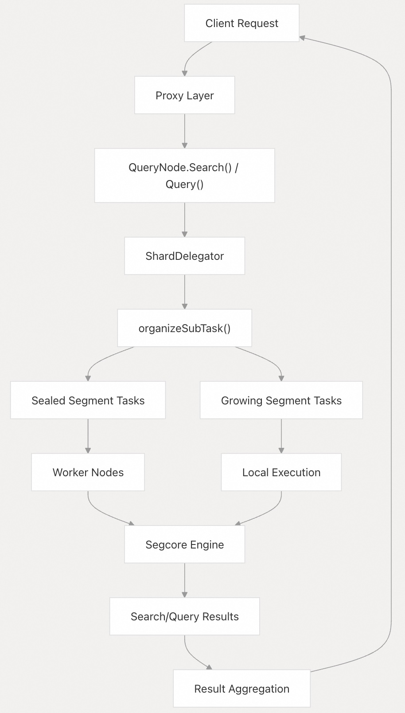
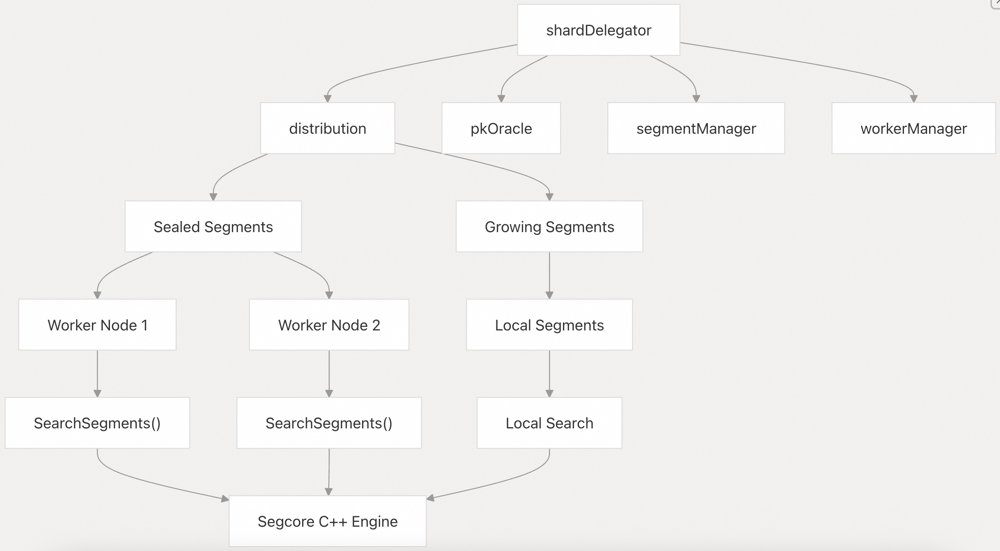
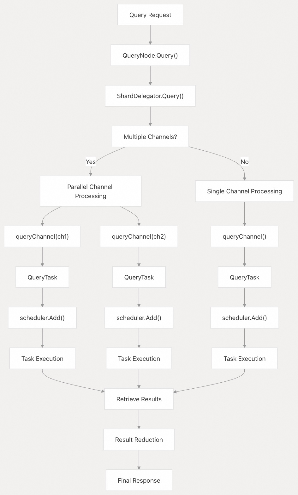
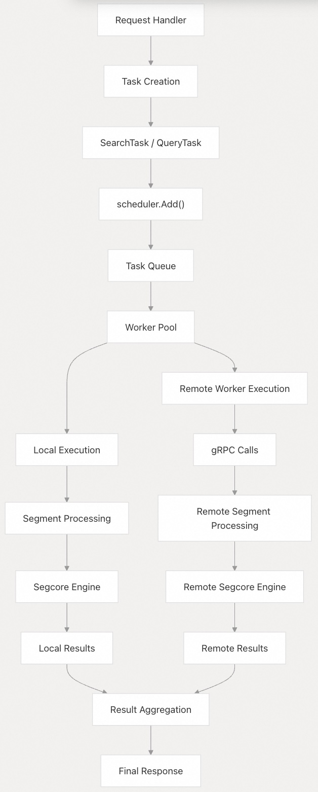
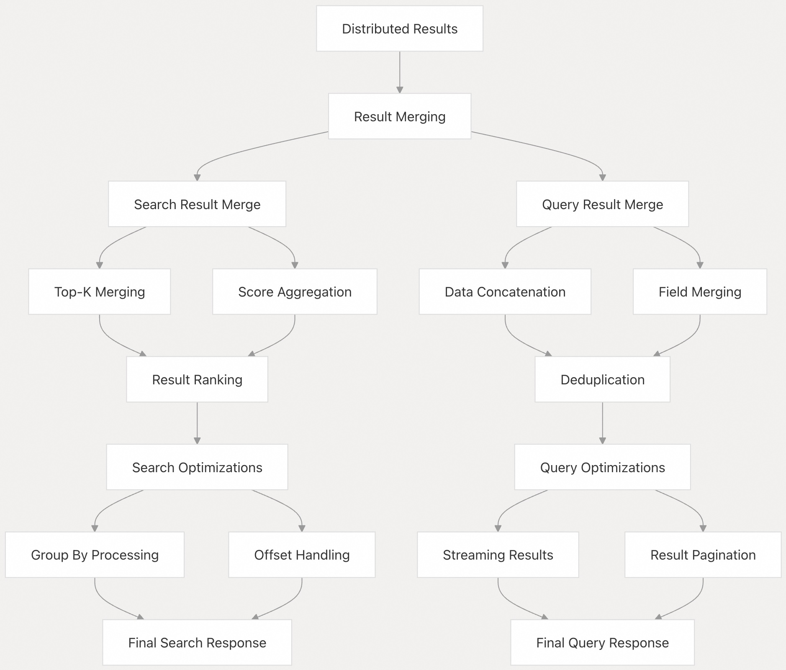

## Milvus 源码学习: 4.2 搜索与查询执行(Search and Query Execution)   
                                              
### 作者                                             
digoal                                            
                                           
### 日期                                          
2025-10-28                                          
                                            
### 标签                                            
Milvus , 源码学习                                             
                                            
----                                            
                                            
## 背景       
本文介绍 Milvus 中搜索(Search)和查询(Query)请求的执行流程，从初始请求处理，到在各段（segment）上进行分布式执行，再到最终结果聚合。其中包括用于分片（shard）管理的委托者（delegator）模式、任务调度，以及 Go 服务与 C++ 核心引擎之间的交互。  
  
## 请求处理架构  
  
Milvus 中的搜索与查询执行遵循一种分层委托模式：请求从 QueryNode 服务流入分片委托者（ShardDelegator），再分发至各个段（segment）。  
  
    
  
来源:  
- [`internal/querynodev2/services.go` 827-893](https://github.com/milvus-io/milvus/blob/18371773/internal/querynodev2/services.go#L827-L893)  
- [`internal/querynodev2/delegator/delegator.go` 374-395](https://github.com/milvus-io/milvus/blob/18371773/internal/querynodev2/delegator/delegator.go#L374-L395)  
  
执行过程包含以下关键阶段：  
- 1、 **请求接收(Request Reception)** ：`QueryNode.Search()` 或 `QueryNode.Query()` 接收请求    
- 2、 **委托分发(Delegation)** ：请求被转发至相应的 `ShardDelegator`    
- 3、 **任务组织** ：委托者为不同类型的段组织子任务    
- 4、 **分布式执行** ：任务在工作节点及本地并行执行    
- 5、 **结果聚合** ：来自所有段的结果被合并并返回  
  
## 分片委托者(Shard Delegator)架构  
  
`ShardDelegator` 是分片内搜索与查询操作的中央协调器。它负责管理段的分布、协调多个工作器（worker）之间的执行，并处理数据一致性。  
  
    
  
来源:  
- [`internal/querynodev2/delegator/delegator.go` 114-167](https://github.com/milvus-io/milvus/blob/18371773/internal/querynodev2/delegator/delegator.go#L114-L167)  
- [`internal/querynodev2/delegator/distribution.go` 1-50](https://github.com/milvus-io/milvus/blob/18371773/internal/querynodev2/delegator/distribution.go#L1-L50)  
  
### 委托者的关键组件：  
- **distribution**：管理段的放置和工作器分配    
- **pkOracle**：处理主键查找和布隆过滤器    
- **segmentManager**：管理本地段的生命周期    
- **workerManager**：协调远程工作节点  
  
## 搜索执行流程(Search Execution Flow)  
  
搜索执行流程展示了向量相似性搜索如何在分布式段上进行处理。  
  
    
  
来源:  
- [`internal/querynodev2/services.go` 827-893](https://github.com/milvus-io/milvus/blob/18371773/internal/querynodev2/services.go#L827-L893)  
- [`internal/querynodev2/delegator/delegator.go` 305-371](https://github.com/milvus-io/milvus/blob/18371773/internal/querynodev2/delegator/delegator.go#L305-L371)  
  
### 搜索处理步骤：   
- 1、 **TSafe 验证**：通过 `waitTSafe()` 确保数据一致性    
- 2、 **段发现**：从 `distribution` 获取可读段    
- 3、 **任务组织**：为已封存段（sealed segments）和增长段（growing segments）分别创建任务    
- 4、 **并行执行**：在工作节点和本地并行执行搜索    
- 5、 **结果聚合**：合并并排序来自所有段的结果  
  
## 查询执行流程(Query Execution Flow)  
  
查询（检索）操作遵循类似的模式，但侧重于精确匹配检索，而非相似性搜索。  
  
    
  
来源:  
- [`internal/querynodev2/services.go` 969-1047](https://github.com/milvus-io/milvus/blob/18371773/internal/querynodev2/services.go#L969-L1047)  
- [`internal/querynodev2/delegator/delegator.go` 500-600](https://github.com/milvus-io/milvus/blob/18371773/internal/querynodev2/delegator/delegator.go#L500-L600)  
  
### 查询处理特性：    
- **多通道支持**：支持跨多个 DML 通道处理查询    
- **任务调度**：通过调度器实现并发执行    
- **结果归并**：合并来自不同通道和段的结果    
- **流式支持**：通过 `QueryStream()` 支持流式查询结果  
  
## 段级执行(Segment-Level Execution)  
  
在段级别，搜索与查询操作均与 C++ 核心引擎（Segcore）交互，以实现高性能数据处理。  
  
    
  
来源:  
- [`internal/core/src/segcore/SegmentInterface.h` 59-188](https://github.com/milvus-io/milvus/blob/18371773/internal/core/src/segcore/SegmentInterface.h#L59-L188)  
- [`internal/core/src/segcore/ChunkedSegmentSealedImpl.cpp` 1-100](https://github.com/milvus-io/milvus/blob/18371773/internal/core/src/segcore/ChunkedSegmentSealedImpl.cpp#L1-L100)  
- [`internal/core/src/segcore/SegmentGrowingImpl.cpp` 1-100](https://github.com/milvus-io/milvus/blob/18371773/internal/core/src/segcore/SegmentGrowingImpl.cpp#L1-L100)  
  
### 段类型与处理：  
- **已封存段（Sealed Segments）** ：使用预构建的索引实现快速检索    
- **增长段（Growing Segments）** ：处理来自内存中并发向量的数据    
- **索引集成（Index Integration）** ：利用向量索引（Knowhere）和标量索引    
- **内存管理（Memory Management）** ：处理分块数据和内存映射文件  
  
## 任务调度与协调  
  
搜索与查询操作利用一套复杂的任务调度系统，以实现并发执行和资源管理。  
  
    
  
来源:  
- [`internal/querynodev2/services.go` 788-825](https://github.com/milvus-io/milvus/blob/18371773/internal/querynodev2/services.go#L788-L825)  
- [`internal/querynodev2/tasks/`](https://github.com/milvus-io/milvus/blob/18371773/internal/querynodev2/tasks/)  
- [`internal/querynodev2/delegator/delegator.go` 350-370](https://github.com/milvus-io/milvus/blob/18371773/internal/querynodev2/delegator/delegator.go#L350-L370)  
  
### 任务协调特性：  
- **并发执行**：多个段并行处理    
- **工作器管理(Worker Management)** ：协调本地与远程工作器    
- **负载均衡**：基于行数和段分布进行优化    
- **错误处理**：标记离线段并对失败操作进行重试    
- **资源管理**：跨任务管理内存和 CPU 使用  
  
## 结果聚合与优化  
  
最后一个阶段涉及聚合来自分布式执行的结果，并应用优化以提升性能。  
  
    
  
来源:  
- [`internal/querynodev2/services.go` 880-892](https://github.com/milvus-io/milvus/blob/18371773/internal/querynodev2/services.go#L880-L892)  
- [`internal/querynodev2/delegator/delegator.go` 355-370](https://github.com/milvus-io/milvus/blob/18371773/internal/querynodev2/delegator/delegator.go#L355-L370)  
- [`internal/util/reduce/`](https://github.com/milvus-io/milvus/blob/18371773/internal/util/reduce/)  
  
### 聚合优化：   
- **Top-K 合并**：高效合并来自多个段的 Top-K 结果    
- **去重处理**：跨段边界移除重复结果(例如 标量、向量、全文检索 OR 条件时, 过滤搜索到的重复结果)    
- **流式支持**：为查询操作启用大结果集的流式返回    
- **分组处理**：支持对搜索结果进行分组（Group By）    
- **内存优化**：在结果处理过程中尽量减少内存占用  
    