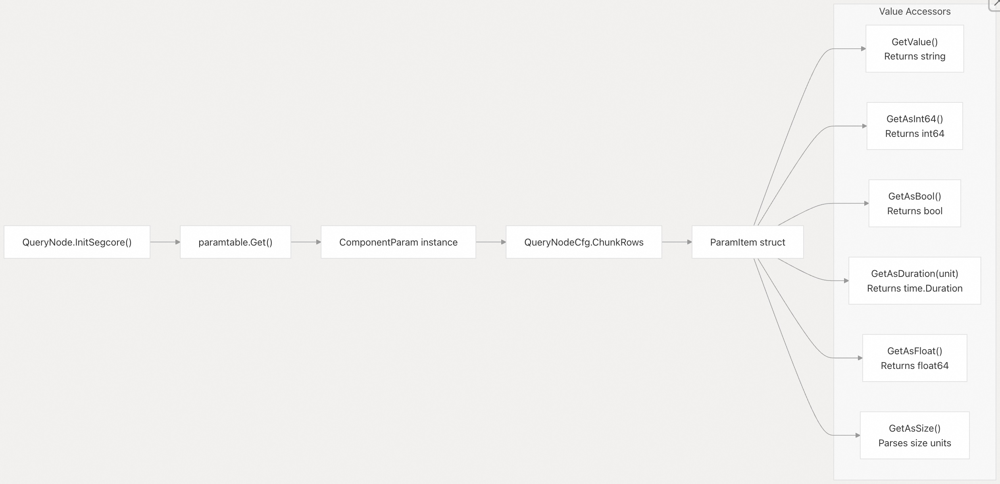
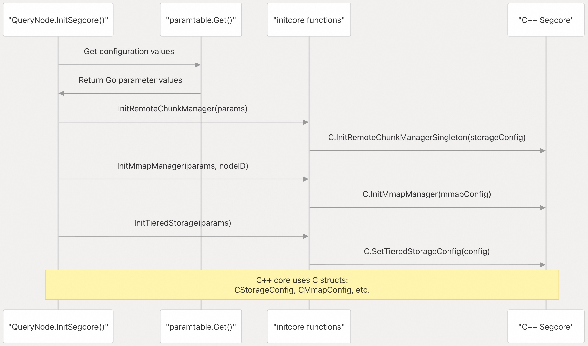
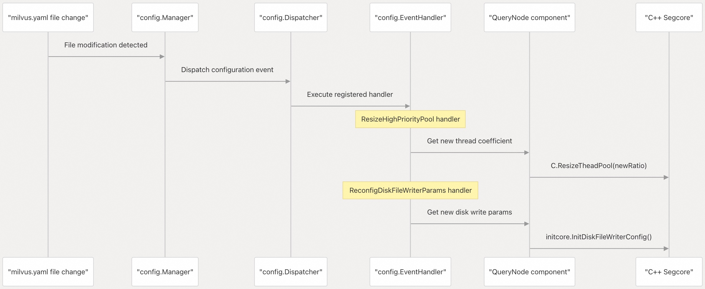
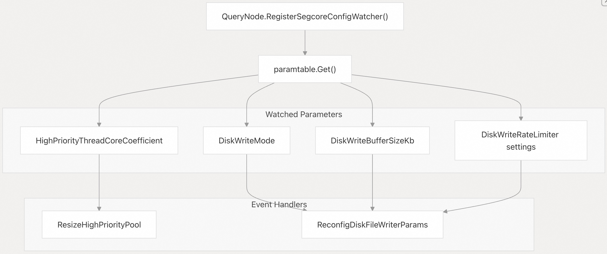
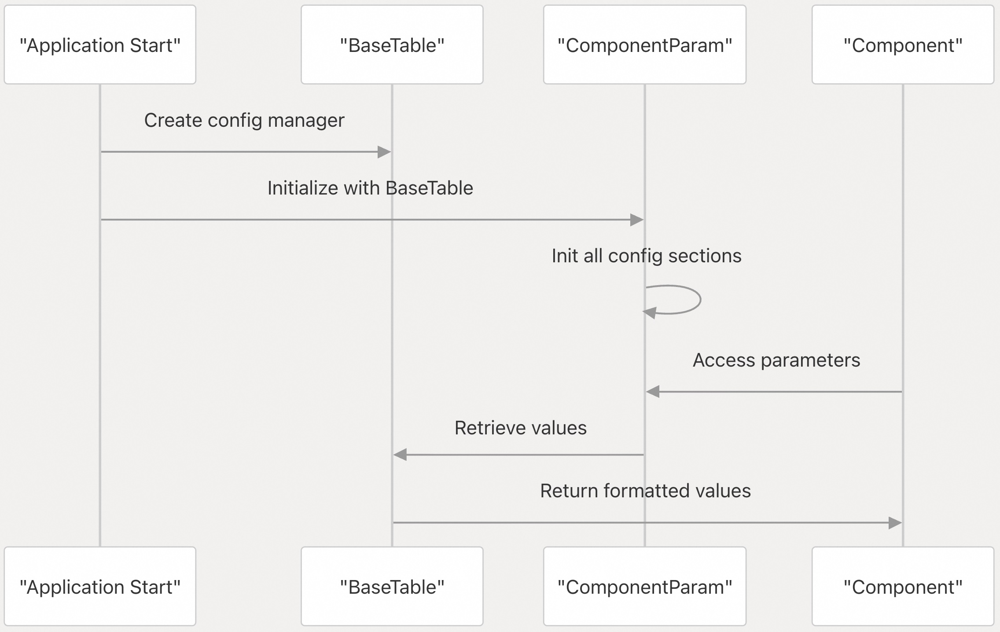

## Milvus 源码学习: 5.1 配置参数  
                                                  
### 作者                                                 
digoal                                                
                                               
### 日期                                              
2025-10-28                                              
                                                
### 标签                                                
Milvus , 源码学习                                                 
                                                
----                                                
                                                
## 背景       
本文介绍 Milvus 全面的配置参数系统，包括配置文件结构、参数管理基础设施，以及各组件如何访问配置值。  
  
## 概述    
Milvus 使用一个围绕 YAML 配置文件和 `paramtable` 包构建的集中式配置系统。该系统为所有 Milvus 组件提供类型安全的参数访问、运行时配置更新、环境变量覆盖以及参数验证。  
  
### 配置架构    
  
  
来源:    
- [`pkg/util/paramtable/component_param.go` 62-110](https://github.com/milvus-io/milvus/blob/18371773/pkg/util/paramtable/component_param.go#L62-L110)    
- [`pkg/util/paramtable/service_param.go` 42-69](https://github.com/milvus-io/milvus/blob/18371773/pkg/util/paramtable/service_param.go#L42-L69)    
- [`internal/querynodev2/server.go` 247-365](https://github.com/milvus-io/milvus/blob/18371773/internal/querynodev2/server.go#L247-L365)    
- [`internal/util/initcore/init_core.go` 206-252](https://github.com/milvus-io/milvus/blob/18371773/internal/util/initcore/init_core.go#L206-L252)    
  
### 参数项结构(Parameter Item Structure)    
Milvus 中的每个配置参数都表示为一个带有元数据的 `ParamItem`：    
  
  
  
来源:    
- [`pkg/util/paramtable/component_param.go` 314-327](https://github.com/milvus-io/milvus/blob/18371773/pkg/util/paramtable/component_param.go#L314-L327)    
  
## 配置文件结构    
主配置文件 `milvus.yaml` 按照不同系统组件和基础设施依赖项划分为逻辑章节。  
  
### 基础设施配置章节    
  
| 章节 | 用途 | 关键参数 |    
|---|---|---|    
| `etcd` | 元数据存储 | `endpoints`、`rootPath`、`ssl.enabled` |    
| `tikv` | 替代元数据存储 | `endpoints`、`rootPath`、`requestTimeout` |    
| `minio` | 对象存储 | `address`、`accessKeyID`、`bucketName` |    
| `mq` | 消息队列选择 | `type`、`enablePursuitMode` |    
| `pulsar` | Pulsar 消息队列 | `address`、`tenant`、`namespace` |    
| `kafka` | Kafka 消息队列 | `brokerList`、`saslUsername` |    
| `rocksmq` | 本地消息队列 | `path`、`retentionTimeInMinutes` |    
  
来源:    
- [`configs/milvus.yaml` 17-275](https://github.com/milvus-io/milvus/blob/18371773/configs/milvus.yaml#L17-L275)    
  
### 组件配置章节    
  
| 章节 | 用途 | 关键参数 |    
|---|---|---|    
| `rootCoord` | DDL 协调 | `dmlChannelNum`、`maxPartitionNum` |    
| `proxy` | 客户端请求处理 | `timeTickInterval`、`maxTaskNum` |    
| `queryCoord` | 查询节点管理 | `autoBalance`、`balanceIntervalSeconds` |    
| `queryNode` | 搜索执行 | `chunkRows`、`enableDisk` |    
| `dataCoord` | 数据协调 | `segment.maxSize`、`compaction.enable` |    
| `dataNode` | 数据持久化 | `flush.insertBufSize`、`compaction.levelzero.enable` |    
  
来源:    
- [`configs/milvus.yaml` 276-1050](https://github.com/milvus-io/milvus/blob/18371773/configs/milvus.yaml#L276-L1050)    
  
## 参数管理系统    
  
### ComponentParam 结构    
`ComponentParam` 结构体为所有组件配置提供集中式访问：    
  
  
  
来源:    
- [`pkg/util/paramtable/component_param.go` 68-110](https://github.com/milvus-io/milvus/blob/18371773/pkg/util/paramtable/component_param.go#L68-L110)    
- [`pkg/util/paramtable/component_param.go` 325-675](https://github.com/milvus-io/milvus/blob/18371773/pkg/util/paramtable/component_param.go#L325-L675)    
- [`pkg/util/paramtable/component_param.go` 1450-2000](https://github.com/milvus-io/milvus/blob/18371773/pkg/util/paramtable/component_param.go#L1450-L2000)    
  
### ServiceParam 结构(ServiceParam Structure)    
`ServiceParam` 结构体管理基础设施依赖项的配置：    
  
  
  
来源:    
- [`pkg/util/paramtable/service_param.go` 43-55](https://github.com/milvus-io/milvus/blob/18371773/pkg/util/paramtable/service_param.go#L43-L55)    
  
## 配置类别    
  
### 通用配置参数    
通用参数在所有组件之间共享，并影响系统范围的行为：  
  
#### 线程与性能    
  
| 参数 | 默认值 | 对系统的影响 |    
|---|---|---|    
| `common.threadCoreCoefficient.highPriority` | 10 | 控制高优先级线程池大小（CPU 核心数 × 系数） |    
| `common.threadCoreCoefficient.middlePriority` | 5 | 控制中优先级线程池大小，用于索引操作 |    
| `common.threadCoreCoefficient.lowPriority` | 1 | 控制低优先级线程池大小，用于后台任务 |    
| `common.simdType` | "auto" | CPU SIMD 指令集（auto、avx512、avx2、avx、sse4_2） |    
| `common.indexSliceSize` | 16 | 序列化时索引文件的切片大小（单位：MB） |    
  
#### 存储与内存    
  
| 参数 | 默认值 | 对系统的影响 |    
|---|---|---|    
| `common.storageType` | "remote" | 存储后端选择（local、remote、opendal） |    
| `common.gracefulTime` | 5000 | 为实现有界一致性而从请求时间戳中减去的时间间隔（单位：毫秒） |    
| `common.entityExpiration` | -1 | 实体的生存时间（TTL），单位为秒（-1 表示永不过期） |    
  
#### 安全与授权    
  
| 参数 | 默认值 | 对系统的影响 |    
|---|---|---|    
| `common.security.authorizationEnabled` | false | 启用基于角色的访问控制（RBAC）认证系统 |    
| `common.security.superUsers` | "" | 超级用户的逗号分隔列表 |    
| `common.security.defaultRootPassword` | "Milvus" | 默认 root 用户密码 |    
  
来源:    
- [`pkg/util/paramtable/component_param.go` 646-810](https://github.com/milvus-io/milvus/blob/18371773/pkg/util/paramtable/component_param.go#L646-L810)    
- [`pkg/util/paramtable/component_param.go` 525-644](https://github.com/milvus-io/milvus/blob/18371773/pkg/util/paramtable/component_param.go#L525-L644)    
  
### 组件特定参数    
  
#### QueryNode 配置    
QueryNode 参数控制搜索执行和内存管理：  
  
**Segcore 引擎设置**    
  
| 参数 | 默认值 | 对搜索性能的影响 |    
|---|---|---|    
| `queryNode.segcore.chunkRows` | 128 | 段处理中每个块的行数 |    
| `queryNode.segcore.knowhereThreadPoolNumRatio` | 4 | Knowhere 搜索线程池倍数 |    
| `queryNode.segcore.interimIndex.enableIndex` | true | 为增长中的段创建临时索引 |    
| `queryNode.segcore.interimIndex.nlist` | 128 | 临时索引的聚类参数 |    
  
**内存与磁盘管理**    
  
| 参数 | 默认值 | 对内存使用的影响 |    
|---|---|---|    
| `queryNode.loadMemoryUsageFactor` | 1 | 内存使用估算乘数 |    
| `queryNode.enableDisk` | false | 启用基于磁盘的索引加载 |    
| `queryNode.maxDiskUsagePercentage` | 95 | 最大磁盘使用阈值 |    
| `queryNode.cache.memoryLimit` | 2GB | 块缓存内存限制 |    
  
**内存映射（mmap）设置**    
  
| 参数 | 默认值 | 对内存效率的影响 |    
|---|---|---|    
| `queryNode.mmap.vectorField` | true | 为向量数据启用 mmap |    
| `queryNode.mmap.vectorIndex` | false | 为向量索引启用 mmap |    
| `queryNode.mmap.scalarField` | false | 为标量数据启用 mmap |    
| `queryNode.mmap.growingMmapEnabled` | false | 为增长中的段启用 mmap |    
  
#### Proxy 配置    
Proxy 参数控制客户端请求处理和负载均衡：  
  
**请求处理限制**    
  
| 参数 | 默认值 | 对请求处理的影响 |    
|---|---|---|    
| `proxy.maxTaskNum` | 1024 | 队列中最大并发任务数 |    
| `proxy.maxFieldNum` | 64 | 每个集合的最大字段数 |    
| `proxy.maxVectorFieldNum` | 4 | 每个集合的最大向量字段数 |    
| `proxy.maxDimension` | 32768 | 最大向量维度 |    
| `proxy.maxShardNum` | 16 | 每个集合的最大分片数 |    
  
**负载均衡与健康检查**    
  
| 参数 | 默认值 | 对查询分发的影响 |    
|---|---|---|    
| `proxy.replicaSelectionPolicy` | "look_aside" | 查询节点选择策略 |    
| `proxy.healthCheckTimeout` | 3000ms | 查询节点健康检查超时时间 |    
| `proxy.retryTimesOnReplica` | 5 | 每个副本的重试次数 |    
  
**访问控制**    
  
| 参数 | 默认值 | 对数据访问的影响 |    
|---|---|---|    
| `proxy.mustUsePartitionKey` | false | 要求请求中必须包含分区键 |    
| `proxy.accessLog.enable` | false | 启用 API 访问日志 |    
| `proxy.connectionCheckIntervalSeconds` | 120 | 客户端连接清理间隔（单位：秒） |    
  
#### DataCoord 配置    
DataCoord 参数控制段生命周期和压缩（compaction）：  
  
**段管理**    
  
| 参数 | 默认值 | 对数据组织的影响 |    
|---|---|---|    
| `dataCoord.segment.maxSize` | 512MB | 段在封存前的最大大小 |    
| `dataCoord.segment.sealProportion` | 0.12 | 触发封存的内存使用比例 |    
| `dataCoord.segment.maxLifetime` | 24h | 段在封存前的最长生命周期 |    
  
**压缩设置**    
  
| 参数 | 默认值 | 对存储效率的影响 |    
|---|---|---|    
| `dataCoord.compaction.levelzero.enable` | false | 启用 L0 压缩以优化删除操作 |    
| `dataCoord.compaction.clustering.enable` | false | 启用聚类压缩 |    
| `dataCoord.compaction.mix.enable` | true | 启用混合压缩策略 |    
  
来源:    
- [`pkg/util/paramtable/component_param.go` 1450-2000](https://github.com/milvus-io/milvus/blob/18371773/pkg/util/paramtable/component_param.go#L1450-L2000)    
- [`pkg/util/paramtable/component_param.go` 850-1200](https://github.com/milvus-io/milvus/blob/18371773/pkg/util/paramtable/component_param.go#L850-L1200)    
- [`pkg/util/paramtable/component_param.go` 2200-2800](https://github.com/milvus-io/milvus/blob/18371773/pkg/util/paramtable/component_param.go#L2200-L2800)    
  
## 运行时配置管理    
  
### 参数访问模式    
组件通过全局 `paramtable.Get()` 函数访问配置参数：  
  
  
  
### 配置流向 C++ 核心 (Configuration Flow to C++ Core)   
Milvus 通过初始化函数将 Go 配置桥接到 C++ 组件：    
  
  
  
来源:    
- [`internal/querynodev2/server.go` 247-365](https://github.com/milvus-io/milvus/blob/18371773/internal/querynodev2/server.go#L247-L365)    
- [`internal/util/initcore/init_core.go` 206-276](https://github.com/milvus-io/milvus/blob/18371773/internal/util/initcore/init_core.go#L206-L276)    
- [`pkg/util/paramtable/component_param.go` 180-186](https://github.com/milvus-io/milvus/blob/18371773/pkg/util/paramtable/component_param.go#L180-L186)    
  
### 配置监听与更新 (Configuration Watching and Updates)   
系统通过事件处理器支持运行时配置更新：  
  
  
  
### 参数注册与监听 (Parameter Registration and Watching)   
组件注册以接收配置变更通知：    
  
  
  
来源:    
- [`pkg/util/paramtable/component_param.go` 184-194](https://github.com/milvus-io/milvus/blob/18371773/pkg/util/paramtable/component_param.go#L184-L194)    
- [`internal/querynodev2/server.go` 222-244](https://github.com/milvus-io/milvus/blob/18371773/internal/querynodev2/server.go#L222-L244)    
- [`internal/querynodev2/server.go` 195-220](https://github.com/milvus-io/milvus/blob/18371773/internal/querynodev2/server.go#L195-L220)    
  
### 环境变量覆盖    
配置参数可通过具有特定命名约定的环境变量进行覆盖：  
  
| 参数 | 环境变量 | 示例 |    
|---|---|---|    
| `etcd.endpoints` | `ETCD_ENDPOINTS` | `localhost:2379,localhost:2380` |    
| `minio.address` | `MINIO_ADDRESS` | `localhost:9000` |    
| `minio.accessKeyID` | `MINIO_ACCESS_KEY_ID` | `minioadmin` |    
  
来源:    
- [`configs/milvus.yaml` 20-21](https://github.com/milvus-io/milvus/blob/18371773/configs/milvus.yaml#L20-L21)    
- [`configs/milvus.yaml` 97-107](https://github.com/milvus-io/milvus/blob/18371773/configs/milvus.yaml#L97-L107)    
  
## 配置初始化流程    
  
### 组件初始化过程    
  
  
  
来源:    
- [`pkg/util/paramtable/component_param.go` 113-169](https://github.com/milvus-io/milvus/blob/18371773/pkg/util/paramtable/component_param.go#L113-L169)    
  
### 参数项初始化    
每个参数遵循标准的初始化模式：  
  
| 步骤 | 操作 | 示例 |    
|---|---|---|    
| 1 | 定义 ParamItem | `Key: "queryNode.chunkRows"` |    
| 2 | 设置元数据 | `DefaultValue: "128", Version: "2.0.0"` |    
| 3 | 通过管理器初始化 | `p.ChunkRows.Init(base.mgr)` |    
| 4 | 应用格式化器 | 值转换与验证 |    
  
来源:    
- [`pkg/util/paramtable/component_param.go` 314-327](https://github.com/milvus-io/milvus/blob/18371773/pkg/util/paramtable/component_param.go#L314-L327)    
- [`internal/querynodev2/server.go` 238-239](https://github.com/milvus-io/milvus/blob/18371773/internal/querynodev2/server.go#L238-L239)    
     