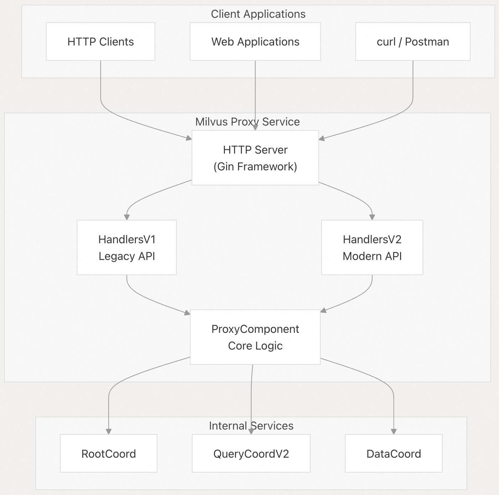

## Milvus 源码学习: 6.2 HTTP REST API   
                                                        
### 作者                                                       
digoal                                                      
                                                     
### 日期                                                    
2025-10-28                                                    
                                                      
### 标签                                                      
Milvus , 源码学习                                                       
                                                      
----                                                      
                                                      
## 背景    
HTTP REST API 提供了用于与 Milvus 向量数据库操作交互的 RESTful 接口。它作为 gRPC API 的替代方案，并通过提供基于标准 HTTP/JSON 的访问来补充 Python 客户端 SDK的功能。  
  
REST API 作为代理服务的一部分实现，并通过 HTTP 端点提供集合管理操作和向量数据操作。  
  
## 架构概览  
  
HTTP REST API 作为代理服务中的中间件实现，将 HTTP 请求转换为内部 gRPC 调用：  
  
    
  
来源:  
- [`internal/distributed/proxy/httpserver/handler_v1.go` 65-109](https://github.com/milvus-io/milvus/blob/18371773/internal/distributed/proxy/httpserver/handler_v1.go#L65-L109)  
- [`internal/distributed/proxy/httpserver/handler_v2.go` 58-68](https://github.com/milvus-io/milvus/blob/18371773/internal/distributed/proxy/httpserver/handler_v2.go#L58-L68)  
  
## API 版本  
  
Milvus 提供了两个具有不同设计理念的 REST API 版本：  
  
### API v1 (传统)  
  
v1 API 提供了简化的向量操作，重点在于易用性：  
  
| 端点类别 | 基础路径 | 目的 |  
| --- | --- | --- |  
| 集合 | `/v1/vector/collections` | 集合管理 |  
| 数据操作 | `/v1/vector/insert`、`/v1/vector/search` | 向量数据操作 |  
  
### API v2 (现代)  
  
v2 API 提供了全面的数据库功能，具有完整的功能对等性：  
  
| 端点类别 | 基础路径 | 目的 |  
| --- | --- | --- |  
| 数据库 | `/v2/vectordb/databases/` | 数据库管理 |  
| 集合 | `/v2/vectordb/collections/` | 集合生命周期 |  
| 实体 | `/v2/vectordb/entities/` | 向量和标量数据操作 |  
| 分区 | `/v2/vectordb/partitions/` | 分区管理 |  
| 索引 | `/v2/vectordb/indexes/` | 索引管理 |  
| 用户和角色 | `/v2/vectordb/users/`、`/v2/vectordb/roles/` | 访问控制 |  
| 导入作业 | `/v2/vectordb/jobs/import/` | 批量数据导入 |  
  
来源:  
- [`internal/distributed/proxy/httpserver/constant.go` 25-80](https://github.com/milvus-io/milvus/blob/18371773/internal/distributed/proxy/httpserver/constant.go#L25-L80)  
- [`internal/distributed/proxy/httpserver/handler_v1.go` 179-190](https://github.com/milvus-io/milvus/blob/18371773/internal/distributed/proxy/httpserver/handler_v1.go#L179-L190)  
- [`internal/distributed/proxy/httpserver/handler_v2.go` 70-212](https://github.com/milvus-io/milvus/blob/18371773/internal/distributed/proxy/httpserver/handler_v2.go#L70-L212)  
  
## 认证  
  
当启用授权时，REST API 支持 HTTP 基本认证：  
  
    
  
认证机制支持：  
  
* 通过 `Authorization` 头部进行 HTTP 基本认证 (HTTP Basic Auth)  
* 通过自定义 `Authorization` 头部进行基于令牌的认证 (Token-based authentication)  
* 从请求头部提取用户名/密码  
  
来源:  
- [`internal/distributed/proxy/httpserver/utils.go` 82-100](https://github.com/milvus-io/milvus/blob/18371773/internal/distributed/proxy/httpserver/utils.go#L82-L100)  
- [`internal/distributed/proxy/httpserver/handler_v2.go` 312-331](https://github.com/milvus-io/milvus/blob/18371773/internal/distributed/proxy/httpserver/handler_v2.go#L312-L331)  
  
## 请求处理流程  
  
REST API 通过标准化的管道处理请求：  
  
    
  
关键处理组件：  
  
* **请求绑定 (Request Binding)**：使用 Gin 的绑定框架进行 JSON 有效载荷解析和验证  
* **认证 (Authentication)**：用户凭证验证和权限检查  
* **超时处理 (Timeout Handling)**：通过 `Request-Timeout` 头部配置请求超时  
* **gRPC 转换 (gRPC Translation)**：HTTP 请求被转换为内部 gRPC 调用  
* **响应格式化 (Response Formatting)**：标准化的 JSON 响应结构  
  
来源:  
- [`internal/distributed/proxy/httpserver/handler_v2.go` 219-267](https://github.com/milvus-io/milvus/blob/18371773/internal/distributed/proxy/httpserver/handler_v2.go#L219-L267)  
* [`internal/distributed/proxy/httpserver/handler_v2.go` 333-381](https://github.com/milvus-io/milvus/blob/18371773/internal/distributed/proxy/httpserver/handler_v2.go#L333-L381)  
  
## 核心操作  
  
### 集合管理  
  
v2 API 提供了全面的集合操作：  
  
    
  
集合创建支持简单和高级 Schema 定义：  
  
* **简单创建 (Simple Creation)**：指定 `dimension`、`idType`、`metricType` 等基本参数  
* **高级创建 (Advanced Creation)**：带有自定义字段、函数和属性的完整 Schema 定义  
  
来源:  
- [`internal/distributed/proxy/httpserver/handler_v2.go` 77-87](https://github.com/milvus-io/milvus/blob/18371773/internal/distributed/proxy/httpserver/handler_v2.go#L77-L87)  
- [`internal/distributed/proxy/httpserver/request_v2.go` 577-625](https://github.com/milvus-io/milvus/blob/18371773/internal/distributed/proxy/httpserver/request_v2.go#L577-L625)  
  
### 向量操作  
  
对向量和标量的数据操作：  
  
    
  
API 支持多种向量类型：  
  
* `FloatVector`：32-bit 浮点向量  
* `BinaryVector`：二进制编码向量  
* `Float16Vector` 和 `BFloat16Vector`：半精度向量  
* `SparseFloatVector`：稀疏向量表示  
* `Int8Vector`：8-bit 整数向量  
  
来源:  
- [`internal/distributed/proxy/httpserver/handler_v2.go` 102-143](https://github.com/milvus-io/milvus/blob/18371773/internal/distributed/proxy/httpserver/handler_v2.go#L102-L143)  
- [`internal/distributed/proxy/httpserver/utils.go` 287-625](https://github.com/milvus-io/milvus/blob/18371773/internal/distributed/proxy/httpserver/utils.go#L287-L625)  
  
## 请求和响应格式  
  
### 标准请求结构  
  
所有 v2 API 请求都遵循一致的 JSON 结构：  
```  
{  
  "dbName": "string (optional)",  
  "collectionName": "string (required)",  
  "data": [...],  
  "additionalParams": {...}  
}  
```  
  
### 标准响应结构  
  
所有响应都包含标准化的元数据：  
```  
{  
  "code": 200,  
  "message": "success",  
  "data": {...},  
  "cost": "execution_time_ms"  
}  
```  
  
### 错误响应结构  
  
错误响应提供详细的错误信息：  
```  
{  
  "code": 1804,  
  "message": "parameter is incorrect: missing required field"  
}  
```  
  
来源:  
- [`internal/distributed/proxy/httpserver/utils.go` 55-80](https://github.com/milvus-io/milvus/blob/18371773/internal/distributed/proxy/httpserver/utils.go#L55-L80)  
- [`internal/distributed/proxy/httpserver/constant.go` 124-133](https://github.com/milvus-io/milvus/blob/18371773/internal/distributed/proxy/httpserver/constant.go#L124-L133)  
  
## 配置和头部  
  
REST API 通过 HTTP 头部支持多种配置选项：  
  
| 头部 | 目的 | 值 |  
| --- | --- | --- |  
| `Accept-Type-Allow-Int64` | 启用 64 位整数支持 | `true`/`false` |  
| `DB-Name` | 指定目标数据库 | 数据库名称 |  
| `Request-Timeout` | 设置请求超时 | 超时秒数 |  
| `Authorization` | 认证凭证 | Basic/Bearer 令牌 |  
  
来源:  
- [`internal/distributed/proxy/httpserver/constant.go` 121-123](https://github.com/milvus-io/milvus/blob/18371773/internal/distributed/proxy/httpserver/constant.go#L121-L123)  
- [`internal/distributed/proxy/httpserver/utils.go` 97-100](https://github.com/milvus-io/milvus/blob/18371773/internal/distributed/proxy/httpserver/utils.go#L97-L100)  
  
## 错误处理  
  
REST API 实现了全面的错误处理，并带有 Milvus 特定的错误代码：  
  
    
  
常见错误场景：  
  
* **缺少参数 (Missing Parameters)**：`ErrMissingRequiredParameters` (1802)  
* **格式无效 (Invalid Format)**：`ErrIncorrectParameterFormat` (1801)  
* **认证 (Authentication)**：`ErrNeedAuthenticate` (1800)  
* **集合未找到 (Collection Not Found)**：集合特定错误代码  
* **权限被拒绝 (Permission Denied)**：权限相关错误代码  
  
来源:  
- [`internal/distributed/proxy/httpserver/handler_v2.go` 226-241](https://github.com/milvus-io/milvus/blob/18371773/internal/distributed/proxy/httpserver/handler_v2.go#L226-L241)  
- [`internal/distributed/proxy/httpserver/handler_v2.go` 376-379](https://github.com/milvus-io/milvus/blob/18371773/internal/distributed/proxy/httpserver/handler_v2.go#L376-L379)  
    
#### [期望 PostgreSQL|开源PolarDB 增加什么功能?](https://github.com/digoal/blog/issues/76 "269ac3d1c492e938c0191101c7238216")
  
  
#### [PolarDB 开源数据库](https://openpolardb.com/home "57258f76c37864c6e6d23383d05714ea")
  
  
#### [PolarDB 学习图谱](https://www.aliyun.com/database/openpolardb/activity "8642f60e04ed0c814bf9cb9677976bd4")
  
  
#### [PostgreSQL 解决方案集合](../201706/20170601_02.md "40cff096e9ed7122c512b35d8561d9c8")
  
  
#### [德哥 / digoal's Github - 公益是一辈子的事.](https://github.com/digoal/blog/blob/master/README.md "22709685feb7cab07d30f30387f0a9ae")
  
  
#### [About 德哥](https://github.com/digoal/blog/blob/master/me/readme.md "a37735981e7704886ffd590565582dd0")
  
  

  
