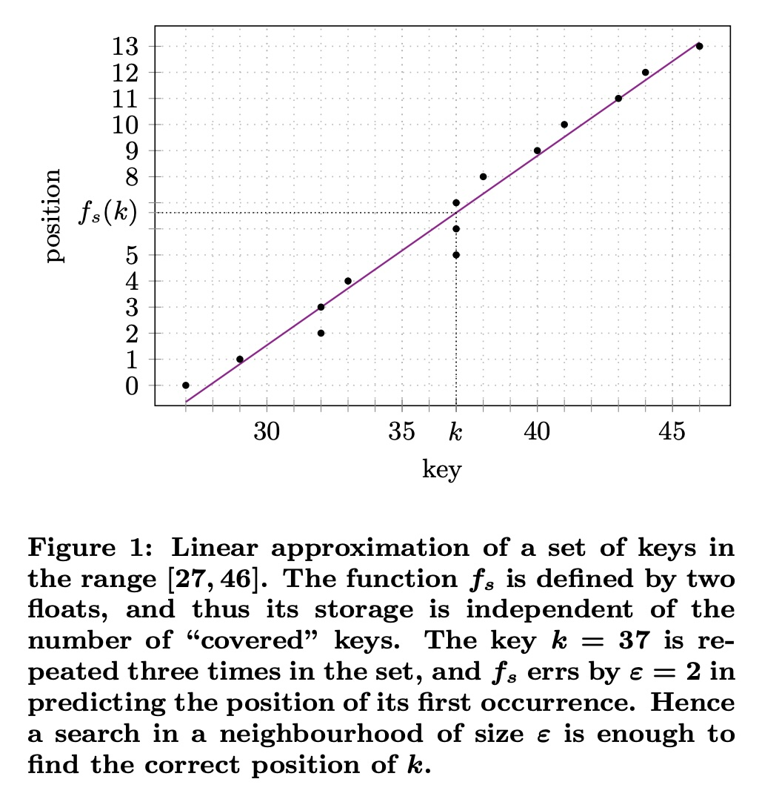
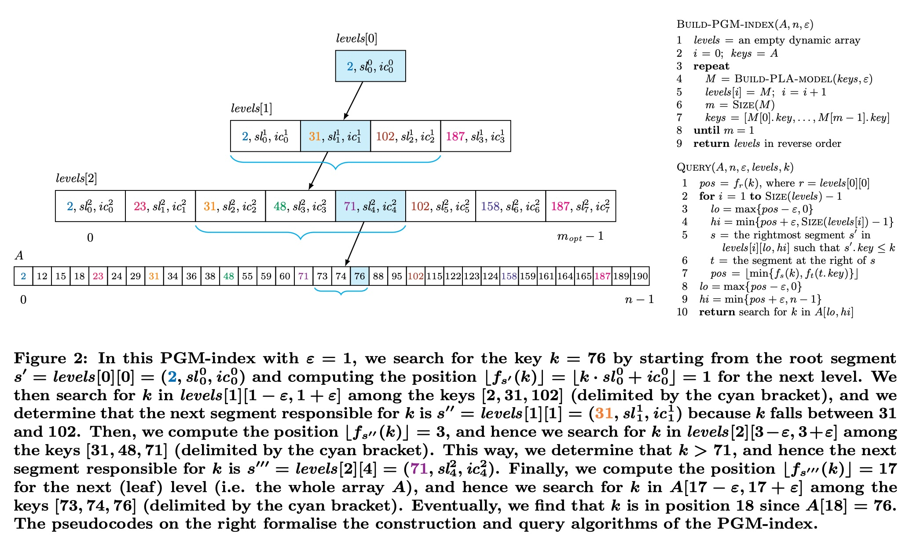

## AI论文解读 | The PGM-index: a fully-dynamic compressed learned index with provable worst-case bounds
        
### 作者        
digoal        
        
### 日期        
2025-10-30        
        
### 标签        
PostgreSQL , PolarDB , DuckDB , AI , 论文解读        
        
----        
        
## 背景  
      
https://dl.acm.org/doi/pdf/10.14778/3389133.3389135        
  
提示:          
```          
读懂《The PGM-index: a fully-dynamic compressed learned index with provable worst-case bounds》这篇论文需要提前掌握哪些基础知识, 请使用中文通熟易懂的讲解这些基础知识, 可以引用论文中的图、表或使用Markdown支持的图形(text,mermaid等)增加解释性. 
  
使用中文通熟易懂的解读《The PGM-index: a fully-dynamic compressed learned index with provable worst-case bounds》这篇论文, 其中的关键内容请着重讲解, 可以引用论文中的图、表或使用Markdown支持的图形(text,mermaid等)增加解释性. 
  
提取《The PGM-index: a fully-dynamic compressed learned index with provable worst-case bounds》这篇论文中的重要术语, 使用中文对这些术语进行通熟易懂的讲解, 可以引用论文中的图、表或使用Markdown支持的图形(text,mermaid等)增加解释性. 
```     
  
## 1 前置知识 
  
要完全读懂这篇关于 PGM-Index 的论文，你需要对数据结构、算法分析和数据库索引有一些基本了解。这篇论文介绍了一种新颖的索引结构，它结合了机器学习（"学习型"）和传统数据结构（"分段几何模型"）的优点。

以下是你需要提前掌握的核心基础知识，我会用通俗的语言为你讲解：

### 1\. 什么是 "索引" (Index)？

在计算机科学中，"索引" 就像一本书的目录。假设你有一本非常厚的、存有海量数据的"书"（比如一个数据库表），你想在里面快速找到某条数据（比如一个用户的记录）。

  * **没有索引**：你必须从第一页开始，一页一页地翻，直到找到你想要的数据。这非常慢。
  * **有了索引**：你可以先查目录（索引），目录会告诉你"你要找的东西在第 589 页"，你就可以直接翻到那一页。

这篇论文讨论的就是如何设计一个**既快又节省空间**的"目录"。

### 2\. "字典问题" (Dictionary Problem) 与 "动态" (Dynamic)

这篇论文要解决的核心问题叫做"完全动态索引字典问题" (fully-dynamic indexable dictionary problem) 。

这听起来很复杂，但其实就是要求"目录"支持以下几种操作 ：

  * **查询 (Query)**：
      * `member(x)`：检查数据 `x` 是否在"书"里？
      * `predecessor(x)`：找到"书"里比 `x` 小一点点的那个数据是什么？
      * `range(x, y)`：找出在 `x` 和 `y` 之间的所有数据。
  * **更新 (Update)**：
      * `insert(x)`：往"书"里加入一条新数据 `x`。
      * `delete(x)`：从"书"里删除数据 `x`。

**"完全动态" (Fully-Dynamic)**  指的就是这个"目录"必须能高效地支持所有这些操作，尤其是插入和删除。

### 3\. 经典方案： $B^{+}$ 树 ( $B^{+}$-TREE )

在 PGM-Index 出现之前，数据库领域最常用、最经典的"目录"结构叫做 **$B^{+}$ 树**。这篇论文会**反复**用 $B^{+}$ 树作为比较的基准 。

你可以把 $B^{+}$ 树想象成一个多层的"文件柜系统"：

  * **根节点（顶层文件柜）** ：告诉你"A-F 的数据在 1 号柜，G-M 的在 2 号柜..."
  * **中间节点（1 号文件柜）** ：告诉你"A-C 的在第 1 个抽屉，D-F 的在第 2 个抽屉..."
  * **叶子节点（抽屉）** ：存放着真正的数据（或指向数据的指针），并且所有数据都是有序排列的。


```mermaid
graph TD
    Root["根节点<br>(例如: 100, 500)"]
    Root --> L1_1["节点<br>(10, 50, 80)"]
    Root --> L1_2["节点<br>(120, 200, 300)"]
    Root --> L1_3["节点<br>(550, 700)"]

    L1_1 --> Leaf1["叶子<br>(<10)"]
    L1_1 --> Leaf2["叶子<br>(10-50)"]
    L1_1 --> Leaf3["叶子<br>(50-80)"]
    L1_1 --> Leaf4["叶子<br>(80-100)"]

    L1_2 --> Leaf5["..."]
    L1_3 --> Leaf6["..."]

    Leaf1 -- 链接 --> Leaf2
    Leaf2 -- 链接 --> Leaf3
    Leaf3 -- 链接 --> Leaf4
    Leaf4 -- 链接 --> Leaf5

    style Root fill:#f9d,stroke:#333,stroke-width:2px
    style L1_1 fill:#d9f,stroke:#333,stroke-width:2px
    style L1_2 fill:#d9f,stroke:#333,stroke-width:2px
    style L1_3 fill:#d9f,stroke:#333,stroke-width:2px
    style Leaf1 fill:#9fd,stroke:#333,stroke-width:2px
    style Leaf2 fill:#9fd,stroke:#333,stroke-width:2px
    style Leaf3 fill:#9fd,stroke:#333,stroke-width:2px
    style Leaf4 fill:#9fd,stroke:#333,stroke-width:2px
    style Leaf5 fill:#9fd,stroke:#333,stroke-width:2px
    style Leaf6 fill:#9fd,stroke:#333,stroke-width:2px
```

$B^{+}$ 树的优点是**可靠且性能稳定**（有"最坏情况保证" ），但缺点是它**很占空间** 。

### 4\. "学习型索引" (Learned Index) - 核心思想

这是理解这篇论文最关键的概念。

"学习型索引"  的核心观点是：**索引其实就是一个函数 (function)**。

这个函数 `f` 的输入是你的 **键 (key)**，输出是它在排好序的数组中的**位置 (position)** 。

  * **传统索引 (如 $B^{+}$ 树)**：用一套复杂的树形规则（"文件柜"）来*搭建*出这个函数。
  * **学习型索引**：使用**机器学习 (ML) 模型**（比如线性回归）来*学习*这个函数 。

**看一个例子：** 假设你的数据（key）是 `[10, 20, 30, 40, 50]`。
它们对应的位置（position）是 `[0, 1, 2, 3, 4]`。

一个简单的数学模型（一条直线）就能完美描述这个关系：`position = (key / 10) - 1`。

论文中的 **图 1 (Figure 1)**  展示了更真实的情况：   

  * X 轴是 "key" (键) 。
  * Y 轴是 "position" (位置) 。
  * 黑点是实际的数据。
  * 那条直线 $f_s(k)$ 就是一个"学习"到的**线性模型** 。

这个模型并不完美，它会有**误差 (error)**。比如图 1 中，对于键 $k=37$ ，模型预测的位置大约是 7，但它的真实位置是 5 。

**核心在于**：这个模型可以保证，它的预测位置和真实位置之间的**误差**不会超过一个**最大值 $\epsilon$** (epsilon) 。

因此，当你想查找 37 时：

1.  模型"预测"位置在 7。
2.  你知道误差 $\epsilon=2$ 。
3.  你只需要在预测位置 7 附近的一个很小的范围（比如 `[7-2, 7+2]` 也就是 `[5, 9]`）内进行搜索，就能**精确**找到 37 的位置 。

### 5\. PGM-Index 的设计：分段 (Piecewise) + 递归 (Recursive)

这篇论文的主角 PGM-Index (Piecewise Geometric Model index)  就是基于上述思想。

**1. "分段" (Piecewise)：**
一个模型（一条直线）通常不足以拟合所有数据 。所以 PGM-Index 会用**很多段**短的直线（称为 "segments" 或 "分段"）来拟合数据 。

**2. "递归" (Recursive)：**
当分段本身也变得很多时，你又需要一个"目录"来查找这些分段。PGM-Index 的做法是：**用一个 PGM-Index 来索引另一个 PGM-Index**。

这形成了论文中 **图 2 (Figure 2)**  所示的递归结构：    

`points to`levels[1]` , which points to  `levels[2]` , which finally points to the data array  `A\`.]

  * **顶层 (levels[0])** ：一个模型，它不直接预测数据在 `A` 中的位置，而是预测它在**下一层 (levels[1])**  中应该用哪个模型。
  * **中间层 (levels[1])**：一个模型列表，每个模型负责数据的一个区间，并预测数据在**再下一层 (levels[2])**  中的位置。
  * **底层 (levels[2])**：一个模型列表，它最终预测数据在**原始数据数组 A**  中的一个大致位置。

这个结构很像 $B^{+}$ 树，但它的"节点"不是存储键的列表，而是存储 **"模型" (segments)** 。由于模型（一条直线只需要几个数字来表示）比存储大量键要**节省空间得多**，这就是 PGM-Index 能实现惊人压缩率（比 $B^{+}$ 树小 1000 倍以上 ）的关键。

### 6\. 如何衡量"好坏"： $O$ 记号 (Big O Notation)

论文中充满了 $O(\log n)$ 、 $O(1)$  这样的符号。这是"大O记号"，用来衡量算法的**效率**。

  * **$n$**：代表你的数据总量（比如 10 亿条）。
  * **$O(n)$ (线性时间)**：很糟。数据量增大 10 倍，时间也慢 10 倍。（比如无索引的逐页查找）。
  * **$O(\log n)$ (对数时间)**：非常好。数据量从 10 亿增长到 100 亿，查找时间可能只增加一点点。（比如 $B^{+}$ 树 ）。
  * **$O(1)$ (常数时间)**：最理想。不管你有多少数据，时间都一样快。

这篇论文的一个重要贡献是证明了 PGM-Index 具有"可证明的最坏情况界限" (provable worst-case bounds) 。这意味着它的性能不仅仅是在某些数据上"碰巧"很好，而是像 $B^{+}$ 树一样，在任何情况下都有**可靠的性能保证** 。

-----

### 总结：你需要的基础知识

1.  **数据结构基础**：理解什么是"索引"，为什么需要它。
2.  **$B^{+}$ 树**：了解它是如何工作的，因为它是本文的主要"靶子"。
3.  **机器学习（基础）** ：只需要懂最简单的**线性回归**（用一条直线去拟合一堆点）。
4.  **算法分析（基础）** ：知道 **$O(\log n)$** 代表"非常快"，**$O(n)$** 代表"很慢"，并理解"空间"和"时间"是衡量算法好坏的两个维度。

掌握了这些，你就能明白这篇论文在说什么：它设计了一种新型索引 (PGM-Index)，它用**一层套一层的微型机器学习模型（分段直线）**  来替代传统的 $B^{+}$ 树结构，从而在**保持同样快（甚至更快）的查询和更新速度**的同时 ，**极大地压缩了索引占用的空间** 。

希望这份讲解对你有帮助！你是否想了解 PGM-Index 的"压缩" (Compressed) 或"分布感知" (Distribution-Aware) 变体是如何工作的？
  
## 2 解读论文 
  
这是一篇非常重要且具有影响力的论文。它介绍了一种名为 **PGM-Index (分段几何模型索引)** 的新型数据结构 。

简单来说，这篇论文做了一件革命性的事：它**结合了机器学习（"学习型"）和传统数据结构（如 $B^{+}$ 树）的优点**，创造出一种索引结构。它在占用空间上比传统索引**小几个数量级**（例如，节省 83 倍甚至 1140 倍的空间 ），同时还能提供**相同甚至更快**的查询和更新（插入/删除）速度 。

最关键的是，它解决了早期"学习型索引"的致命弱点：它提供了**可证明的最坏情况性能保证 (provable worst-case bounds)** 。这意味着它不像某些"黑盒"机器学习模型那样时快时慢，而是像 $B^{+}$ 树一样稳定可靠。

-----

### 1\. 核心思想：索引即模型 (Index as a Model)

要理解 PGM-Index，首先要明白"学习型索引" (Learned Index) 的基本思想 。

  * **传统索引 (如 $B^{+}$ 树)**：像一个"文件柜"，通过一层层的"抽屉"（节点）来帮你定位数据。它不关心数据本身长什么样，只关心它们的大小关系。
  * **学习型索引**：它把索引看作一个**函数（或模型）** 。这个函数的输入是你的**键 (key)**，输出是它在排好序的数组中的**位置 (position)**。

如果你的数据是完美的 `[100, 200, 300, 400]`，那么这个函数会非常简单：`position = (key / 100) - 1`。你不需要 $B^{+}$ 树，只需要这个公式，查询效率是 $O(1)$ （常数时间）。

当然，真实数据是混乱的。论文中的 **图 1 (Figure 1)** 就展示了这一点：    

> **图 1 解读**    
>  
>   * **X 轴** 是数据的值 (key)。  
>   * **Y 轴** 是数据在排序数组中的位置 (position)。  
>   * **黑点** 是实际的数据点。  
>   * **直线 $f_s(k)$** 是一个机器学习模型（最简单的线性回归）"学习"到的数据分布趋势。  
>  
> 这个模型并不完美，它有**误差 (error)**。例如，对于键 $k=37$ ，模型预测的位置大约是 7，但它的真实位置是 5 。  

### 2\. PGM-Index 的精妙设计

PGM-Index 的名字 "Piecewise Geometric Model index"（分段几何模型索引）已经揭示了它的构造 。

#### 关键特性 1：分段 (Piecewise) 和 $\epsilon$ 保证

一个模型（一条直线）无法拟合所有数据。PGM-Index 的做法是：**用很多条短的直线（称为 "segments"）来分段拟合数据** 。

这是 PGM-Index 的第一个核心：它引入了一个参数 $\epsilon$ (epsilon) 。它在构建这些"分段"时，**保证**模型预测的位置与真实位置之间的**绝对误差**永远不会超过 $\epsilon$ 。

例如，如果 $\epsilon=2$ ，模型预测位置是 7，那么真实位置一定在 `[7-2, 7+2]` 这个范围内，也就是 `[5, 9]` 。

> **为什么这很重要？**
> 因为你不再需要大海捞针。你只需要在 $\epsilon$ 这么大的一个小范围内进行精确查找（比如二分查找），这个查找的成本是 $O(\log \epsilon)$ ，非常快 。

#### 关键特性 2：递归 (Recursive) 的模型（索引的索引）

如果数据量很大，你可能需要成千上万个"分段" (segments)。那么，你又该如何快速找到"我应该用哪个分段"呢？

你可能需要一个索引来索引这些"分段"。PGM-Index 的回答是：**再用一个 PGM-Index 来索引这些分段！** 。

这就是论文中 **图 2 (Figure 2)** 展示的递归结构：    

```mermaid
graph TD
    subgraph "PGM-Index 结构 (类似图 2)"
        L0("levels[0]: 根模型")
        L1("levels[1]: 分段模型列表")
        L2("levels[2]: 分段模型列表")
        A(A: 真实数据数组)

        L0 -- 预测 --> L1
        L1 -- 预测 --> L2
        L2 -- 预测 --> A
    end
```

  * **底层 (levels[2])**：是一个包含很多"分段"的列表。每个分段模型负责预测一小段真实数据 `A` 中的位置 。
  * **中间层 (levels[1])**：也是一个"分段"列表。但它不索引 `A`，它索引的是 `levels[2]`。它的模型负责预测你的 key 应该由 `levels[2]` 中的**哪一个分段**来处理 。
  * **顶层 (levels[0])**：通常只有一个"分段"模型，它是根 。它索引 `levels[1]` 。

这种"索引的索引"的结构，使得 PGM-Index 成为一个"纯粹"的学习型索引，它不像其他方案那样需要混合使用 $B^{+}$ 树 。

### 3\. PGM-Index 如何查询 (图 2 示例)

我们用论文中 **图 2** 的例子来演示查找键 `k=76` 的过程 ：

1.  **在 levels[0] (根)**：

      * 用根模型 $s'$ 计算 `k=76` 的位置，得到预测值 $\lfloor f_{s'}(76) \rfloor = 1$ 。
      * $\epsilon=1$ 。我们在 `levels[1]` 的 `[1-\epsilon, 1+\epsilon]`（即 `[0, 2]`）范围内查找。
      * 通过查找，我们发现 `k=76` 应该由 `levels[1][1]` 这个分段（键为 31）来处理 。

2.  **在 levels[1]**：

      * 用 `levels[1][1]` 的模型 $s''$ 计算 `k=76` 的位置，得到预测值 $\lfloor f_{s''}(76) \rfloor = 3$ 。
      * $\epsilon=1$ 。我们在 `levels[2]` 的 `[3-\epsilon, 3+\epsilon]`（即 `[2, 4]`）范围内查找。
      * 通过查找，我们发现 `k=76` 应该由 `levels[2][4]` 这个分段（键为 71）来处理 。

3.  **在 levels[2]**：

      * 用 `levels[2][4]` 的模型 $s'''$ 计算 `k=76` 的位置，得到预测值 $\lfloor f_{s'''}(76) \rfloor = 17$ 。
      * $\epsilon=1$ 。我们在**最终的数据数组 A** 的 `[17-\epsilon, 17+\epsilon]`（即 `[16, 18]`）范围内查找 。
      * 在这个小范围 `A[16...18]`（包含 `[73, 74, 76]`）中进行搜索，最终在位置 18 找到了 `76` 。

这个"**预测 + 在小范围 ( $\epsilon$ ) 内搜索**"  的过程在每一层递归发生，查询成本是 $O(\text{层数} \times \log \epsilon)$ 。由于层数是对数级的 ( $O(\log m)$ ，其中 $m$ 是分段数 )，所以总时间非常快 。

### 4\. 关键贡献与实验结果

这篇论文的贡献是颠覆性的，其实验结果（见 **表 1**、**图 5**、**图 6**）充分证明了这一点。  

  

  

  

#### 贡献 1：惊人的空间压缩

PGM-Index 的空间占用只取决于它需要多少"分段" ( $m_{opt}$ ) ，而 $m_{opt}$ 通常远小于数据总数 $n$ 。

  * **实验结果 (图 5)**：在静态查询场景中，PGM-Index (图中的五边形) 位于图的**左下角**，代表**时间和空间双重占优** 。
  * 它能达到与 $B^{+}$ 树相同的查询性能，但空间占用**少了 4 个数量级**（例如，874 MiB 降到 87 KiB） 。
  * 它比另一种缓存优化的 $B^{+}$ 树 (CSS-tree) 空间**小 83 倍** 。

#### 贡献 2：首个 "完全动态" 的学习型索引

早期的学习型索引不支持或很难支持插入 (insert) 和删除 (delete)。PGM-Index 通过引入一种"对数方法" (logarithmic method)，有效地解决了这个问题 。

  * **实验结果 (图 6)**：在一个包含查询、插入和删除的混合动态负载下 ，PGM-Index（蓝线）在绝大多数情况下都比 $B^{+}$ 树（其他颜色的线） **快 13% 到 71%** 。
  * 同时，它的空间占用比 $B^{+}$ 树**小了 1140 倍到 3891 倍** 。

#### 贡献 3：可自动调优 (Multicriteria)

PGM-Index 的 $\epsilon$ 参数是一个非常灵活的"旋钮"。

  * **小 $\epsilon$**：误差小，查询快（ $\log \epsilon$ 小 ），但需要更多分段（空间大）。
  * **大 $\epsilon$**：误差大，查询慢（ $\log \epsilon$ 大 ），但需要的分段少（空间小）。

论文的第 6 节展示了一个"多标准"版本 ，你可以向 PGM-Index 提出这样的要求：

1.  "请给我一个**空间占用不超过 1 MiB** 的前提下，**查询最快**的索引" 。
2.  "请给我一个**查询延迟必须低于 800 纳秒** 的前提下，**空间占用最小**的索引" 。

PGM-Index 可以在几秒钟内自动找到最佳的 $\epsilon$ 值来满足这些不断变化的需求 。

-----

### 总结

PGM-Index 是一个里程碑式的工作。它成功地将机器学习的"数据感知"能力与传统数据结构的"性能保证"结合起来，创造了一种在空间、查询速度和更新速度上**全面超越**传统 $B^{+}$ 树的索引结构，并且是完全动态和可自动调优的。
  
## 3 术语 
  
以下是《The PGM-index》这篇论文中的核心术语及其通俗易懂的中文讲解。

-----

### 1\. 核心概念

#### 1.1 Learned index (学习型索引)

  * **通俗讲解**：
    这是一种全新的索引（“目录”）设计思路 。传统的索引（如 $B^+$ 树）像一个“文件柜系统”，它不关心数据长什么样，只通过一层层比较大小来找到数据 。
    而“学习型索引”的核心思想是：**索引本质上是一个模型** 。它试图“学习”你数据的分布规律。比如，它发现你的数据（键）和它们在排序后的位置（秩）之间，大致符合一条直线或曲线 。
  * **示例**：
    想象一下，你的数据是 `[100, 200, 301, 399, 502]`。
      * $B^+$ 树会建立一个树状结构来存储它们。
      * “学习型索引”会发现，`位置 ≈ 键 / 100`。当查找 301 时，它会*预测*位置在 `301/100 ≈ 3` 。虽然预测不完美（真实位置是 2），但已经非常接近了。它只需要在预测位置附近做一个小范围的修正搜索，就能找到正确答案 。

#### 1.2 PGM-INDEX (PGM 索引)

  * **通俗讲解**：
    这是论文作者提出的具体索引实现，全称是 **P**iecewise **G**eometric **M**odel **index**（分段几何模型索引） 。
      * **Piecewise (分段)**：它不指望用*一个*模型（一条线）拟合所有数据，而是用*很多段*短的、简单的线性模型来分段拟合 。
      * **Geometric (几何)**：它使用的模型是最简单的几何模型——直线（即线性模型） 。
  * **核心优势**：
    它解决了早期学习型索引的“不靠谱”问题。PGM 索引提供了**可证明的最坏情况界限 (provable worst-case bounds)** 。这意味着它能保证在任何情况下，查询和更新的速度都不会低于一个特定的阈值，使其像 $B^+$ 树一样稳定可靠 。

#### 1.3 Fully-dynamic (完全动态)

  * **通俗讲解**：
    这个词意味着索引不仅支持**查询**（查找、范围查询等），还高效地支持**更新**操作，即 `insert` (插入) 和 `delete` (删除) 。这使得 PGM 索引可以用于数据不断变化的真实业务场景，而不是只能用于静态数据 。

#### 1.4 $(k, \text{rank}(k))$ (键-秩对)

  * **通俗讲解**：
    这是学习型索引要“学习”的目标 。

      * $k$ 就是你的数据**键 (key)** 。
      * $\text{rank}(k)$ 是这个键 $k$ 在所有数据中排**第几位**（即它的位置或秩） 。
        学习型索引试图找到一个函数 $f$ ，使得 $f(k) \approx \text{rank}(k)$ 。

  * **图示 (源自论文图 1)**：    
    论文中的图 1 完美地展示了这个概念 。

      * **X 轴 (key)**：是数据的值 $k$ 。
      * **Y 轴 (position)**：是数据的位置 $\text{rank}(k)$ 。
      * **黑点**：是实际的 $(k, \text{rank}(k))$ 数据对 。
      * **直线 $f_s(k)$**：就是 PGM 索引“学习”到的模型（一个分段），它试图近似地穿过这些黑点 。

-----

### 2\. PGM-Index 的内部机制

#### 2.1 $\epsilon$ (Epsilon，误差参数)

  * **通俗讲解**：
    这是 PGM 索引中**最重要的一个“旋钮”** 。它代表了你允许模型预测的**最大误差** 。
      * **设置 $\epsilon=2$**：意味着你向 PGM 索引保证，它预测的位置与真实位置的差距**永远不会超过 2** 。
      * **查询时**：如果模型预测 $k$ 的位置在 100，你只需要在 `[100-2, 100+2]` 这个极小的范围内进行最终的精确搜索，就能保证找到 $k$ 。
  * **权衡 (Trade-off)**：
      * **小 $\epsilon$** ( 如 $\epsilon=2$ )：误差小，查询快（最后搜索范围小），但需要更多“分段”(Segments) 来拟合数据，因此**索引空间占用大**。
      * **大 $\epsilon$** ( 如 $\epsilon=128$ )：误差大，查询稍慢（最后搜索范围大），但需要的分段少，**索引空间占用小**。

#### 2.2 Segment (分段)

  * **通俗讲解**：
    一个 "Segment" 是 PGM 索引的**基本构造单元** 。它本质上就是一个**简单的线性模型**（一条直线） 。
    每个分段负责索引数据中的一小部分 ，并保证对它负责的所有键，预测误差都不超过 $\epsilon$ 。
    在存储上，一个分段只占用常数空间（例如，存储它的起始键、斜率 `slope` 和截距 `intercept`） 。

#### 2.3 Optimal PLA-model (最优分段线性近似模型)

  * **通俗讲解**：
    `PLA-model` (分段线性近似模型) 就是指由一堆 "Segments" 组成的集合 。
    `Optimal` (最优) 是指，在给定误差参数 $\epsilon$ 的前提下，PGM 索引能找到一种划分方案，使得拟合所有数据所需的 "Segments" **数量最少** 。
    这是 PGM 索引空间效率高的一个关键理论保证，论文证明了这个问题存在一个**线性时间 ( $O(n)$ ) 的最优解法** 。

#### 2.4 Recursive index structure (递归索引结构)

  * **通俗讲解**：
    这是一个精妙的设计，用来解决“如果分段 (Segments) 本身也很多怎么办？”的问题。
    PGM 索引的答案是：**用一个 PGM 索引去索引另一个 PGM 索引** 。

  * **图示 (源自论文图 2)**：    
    图 2 展示了一个三层的 PGM 索引 。

    ```mermaid
    graph TD
        subgraph PGM-Index
            L0("levels[0] : 根模型")
            L1("levels[1] : 包含 3 个 Segment")
            L2("levels[2] : 包含 8 个 Segment")
            Data(A : 原始数据数组)
        end
        
        L0 -- 预测 k 在 L1 中的位置 --> L1
        L1 -- 预测 k 在 L2 中的位置 --> L2
        L2 -- 预测 k 在 A 中的位置 --> Data

        style L0 fill:#f9d,stroke:#333
        style L1 fill:#d9f,stroke:#333
        style L2 fill:#9fd,stroke:#333
        style Data fill:#9ff,stroke:#333
    ```

      * `levels[2]` (底层) 的 Segments 负责索引**真实数据 A** 。
      * `levels[1]` (中间层) 的 Segments 负责索引 `levels[2]` 。
      * `levels[0]` (顶层/根) 的 Segment 负责索引 `levels[1]` 。

    当你查询时，你会从 `levels[0]` 开始，像“跳房子”一样，一层层地缩小预测范围，直到最后在数据数组 `A` 的一个 $\epsilon$ 大小的窗口内找到答案 。

-----

### 3\. PGM-Index 的高级变体

#### 3.1 Dynamic PGM-INDEX (动态 PGM 索引)

  * **通俗讲解**：
    这是指 PGM 索引处理任意插入和删除的能力 。它使用了一种叫做**对数方法 (Logarithmic method)** 的经典技巧 。
      * 它会维护**多个** PGM 索引，比如 $S_0, S_1, S_2, ...$ 。
      * $S_0$ 的大小为 $2^0=1$ ， $S_1$ 的大小为 $2^1=2$ ，以此类推 。
      * 当插入一个新数据时，它会像二进制加法一样，找到第一个空的 $S_i$ ，然后把 $S_0$ 到 $S_{i-1}$ 的所有数据合并起来，构建一个新的 $S_i$ 索引 。
      * 虽然听起来复杂，但这种方法平摊（amortised）到每次操作的成本很低 。

#### 3.2 Compressed PGM-INDEX (压缩 PGM 索引)

  * **通俗讲解**：
    这个变体是为了让 PGM 索引的**空间占用小到极致** 。它主要使用了一种巧妙的**斜率压缩 (Slope compression)** 技术 。
      * PGM 索引由很多分段 (Segments) 组成，每个分段都有自己的斜率 (slope) 。
      * 论文作者发现，很多不同分段的斜率其实**非常接近** 。
      * 他们设计了一种算法，能找到一个很小的“共享斜率表”（比如 $t$ 个斜率），让 $m$ 个分段都从这个表里选择一个斜率来用，同时还能保证 $\epsilon$ 误差 。
      * 这样，存储 $m$ 个斜率的空间就从 $O(m)$ 降低到了 $O(t + m \log t)$ ，当 $t \ll m$ 时，压缩效果非常显著 。

#### 3.3 Distribution-Aware PGM-INDEX (分布感知 PGM 索引)

  * **通俗讲解**：
    这是一个非常智能的变体。标准的 PGM 索引只关心“数据”的分布，而这个变体关心的是“**查询**”的分布 。
      * 在现实世界中，某些数据（比如热点新闻）被查询的频率远高于其他数据 。
      * 这个索引会针对那些**高频查询**的键，使用一个更小的、局部的 $\epsilon$ 值，让查询更快 。
      * 它的目标是让平均查询时间接近查询分布的**信息熵 ( $\mathcal{H}$ )** ，这是理论上的最优值 。

#### 3.4 Multicriteria PGM-INDEX (多标准 PGM 索引)

  * **通俗讲解**：
    这是一个**自动化调优 (auto-tuning)** 的 PGM 索引 。它解决了用户不知道 $\epsilon$ 该设多大的问题。
    你可以向它提出“多标准”的需求，例如 ：

    1.  **时间最小化模式**："我最多给你 1MB 内存空间，请帮我自动配置一个**查询最快**的 PGM 索引" 。
    2.  **空间最小化模式**："我要求查询延迟必须低于 500 纳秒，请帮我自动配置一个**占用空间最小**的 PGM 索引" 。

    论文表明，PGM 索引可以在几十秒内自动找到满足这些复杂约束的最佳 $\epsilon$ 值 。
  
## 参考        
         
https://dl.acm.org/doi/pdf/10.14778/3389133.3389135    
        
<b> 以上内容基于DeepSeek、Qwen、Gemini及诸多AI生成, 轻微人工调整, 感谢杭州深度求索人工智能、阿里云、Google等公司. </b>        
        
<b> AI 生成的内容请自行辨别正确性, 当然也多了些许踩坑的乐趣, 毕竟冒险是每个男人的天性.  </b>        
    
#### [期望 PostgreSQL|开源PolarDB 增加什么功能?](https://github.com/digoal/blog/issues/76 "269ac3d1c492e938c0191101c7238216")
  
  
#### [PolarDB 开源数据库](https://openpolardb.com/home "57258f76c37864c6e6d23383d05714ea")
  
  
#### [PolarDB 学习图谱](https://www.aliyun.com/database/openpolardb/activity "8642f60e04ed0c814bf9cb9677976bd4")
  
  
#### [PostgreSQL 解决方案集合](../201706/20170601_02.md "40cff096e9ed7122c512b35d8561d9c8")
  
  
#### [德哥 / digoal's Github - 公益是一辈子的事.](https://github.com/digoal/blog/blob/master/README.md "22709685feb7cab07d30f30387f0a9ae")
  
  
#### [About 德哥](https://github.com/digoal/blog/blob/master/me/readme.md "a37735981e7704886ffd590565582dd0")
  
  

  
