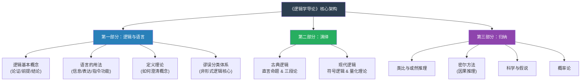

## 《逻辑学导论》读书笔记 
  
### 作者  
digoal  
  
### 日期  
2026-06-16  
  
### 标签  
读书笔记 , 逻辑学导论  
  
----  
  
## 背景 
  
  
---
书名: 《逻辑学导论》（第11版）  
作者: [美] 欧文·M·柯匹 / [美] 卡尔·科恩  
译者: 张建军 / 潘天群 等  
出版社: 中国人民大学出版社  
出版年份: 2007（原著2001）  
笔记日期: 2026-06-16  
豆瓣链接: https://book.douban.com/subject/2060491/  
标签: [逻辑学, 哲学, 批判性思维, 符号逻辑, 教科书]  
---
  
  
## ——柯匹与科恩 | 一本用了七十年的课本，凭什么经久不衰？

> **一句话**：这是一张"思维地图"，帮你看清楚论证在哪里走歪了，也帮你建构真正站得住脚的推理。
> **适合谁读**：哲学系学生 / 想训练批判性思维的任何人 / 对"为什么那个论证听起来有道理但就是感觉哪里不对"感到困惑的人
> **阅读难度**：⭐⭐⭐⭐☆（符号逻辑部分有陡坡，但第一部分非常友好）
> **推荐指数**：⭐⭐⭐⭐⭐

---

## 一、时代坐标：这本书从哪里来？

1953年，美国。

二战刚结束不久，冷战正在成型。彼时的知识分子在某种意义上比任何时代都更迫切地意识到一件事：**人是可以被荒谬的论证所说服的**。纳粹的宣传机器、麦卡锡主义的非理性猎巫……这些活生生的历史证明，人类集体理性的失守并非偶然，而是有其可识别、可解剖的认知机制。

在这样的背景下，一位曾师从罗素（Bertrand Russell）的年轻逻辑学家欧文·M·柯匹（Irving M. Copi，1917—2002）写下了《逻辑学导论》第一版。柯匹的名字原本叫"Copilovich"，是东欧移民后裔，在芝加哥大学读书时恰好能向罗素本人学习逻辑——这段师承关系并非小事：罗素与怀特海合著《数学原理》，奠定了现代数理逻辑的基础，而柯匹把这份严谨带进了面向大众的入门课堂。

柯匹想做的事，可以用他自己的话概括：**逻辑既是艺术，也是科学**。掌握它不是靠死记硬背规则，而是通过大量鲜活的、来自真实世界的论证练习，把推理能力内化为一种直觉。

这本书从1953年出版至今，历经十五次修订，先后被数百所大学采用，已然是英语世界逻辑学导论课的事实标准。它之所以能存活这么久，不是因为它做到了什么惊天动地的理论创新，而是因为它把一件极难的事做到了极致——**让初学者真正看懂、真正会用**。

---

## 二、核心命题：这本书在说什么？

全书14章，756页，分为三大部分。表面上是教科书，但它贯穿始终地在说三件事：

### 命题一：论证是可以被解剖的——先看结构，再看内容

柯匹从第一章就给出一个根本性的训练：**把任何一段话，先识别出"前提"和"结论"，再判断推理是否有效**。

这个动作看似简单，但实践中极难。我们日常的思维习惯是"这个人说的感觉有道理/没道理"，而不是"这个人的前提是什么，前提能推出结论吗"。柯匹逼着读者做一件事：先把情感和直觉搁置，先看骨架。

书里的区分尤其值得记住：
- **演绎有效性**：若前提为真，结论必然为真（不可能前提真而结论假）
- **归纳或然性**：若前提为真，结论可能为真（概率高低而已）
- **有效 ≠ 真实**：一个论证可以形式上完全有效，但前提是假的，结论也就没有意义

这个区分打开了一扇门：我们可以分开讨论"这个推理结构对不对"和"这些前提是否为真"，而不是把两者混在一起争吵。

### 命题二：谬误是有套路的——辨认它，才能免疫它

第四章是全书最有现实价值的一章，也是被引用最广的一章。柯匹把非形式谬误系统分类，分为四大族：

**相关性谬误（Fallacies of Relevance）**——前提与结论根本不相干，但听起来像相干：
- 诉诸人身（Ad Hominem）：攻击论者而非论证
- 诉诸权威（Appeal to Authority）：权威说的不一定对
- 诉诸民众（Appeal to Populace）：大多数人相信≠正确
- 稻草人谬误（Straw Man）：歪曲对方观点再反驳

**归纳缺陷谬误（Fallacies of Defective Induction）**——证据不足以支撑结论：
- 轻率概括：以偏概全
- 错误类比：两件事其实没那么像

**预设谬误（Fallacies of Presumption）**——悄悄把有争议的东西当成前提：
- 循环论证（Begging the Question）：用结论证明结论
- 复杂问语（Complex Question）："你什么时候停止打你老婆？"

**歧义谬误（Fallacies of Ambiguity）**——利用语言的模糊性耍花招：
- 偷换概念（Equivocation）
- 断章取义（Accent）

斯坦福哲学百科全书专门指出，柯匹对谬误的分类是20世纪最有影响力的谬误体系之一，11种谬误可追溯至亚里士多德传统，另外几种则来自洛克之后的"诉诸X"谬误传统。

### 命题三：推理的世界比日常语言大得多——符号逻辑让精确成为可能

第二部分的演绎章节，尤其是符号逻辑（第8章）和量化理论（第10章），是全书学习曲线最陡的地方。柯匹引入了命题逻辑（用∧、∨、→、¬等符号）和谓词逻辑（全称量词∀、存在量词∃），把日常语言翻译成形式语言进行精确推理。

这部分的核心洞见是：**自然语言充满歧义和情绪，形式语言虽然冷硬，但能暴露推理中真正发生了什么**。很多在汉语或英语中"听起来有道理"的论证，一旦翻译成符号，立刻就能看出它根本不是有效的形式。

---

## 三、论证地图：这本书的结构逻辑



全书的逻辑是一条从"日常语言"到"精确形式"再到"真实世界应用"的路径，并非单纯由易到难的线性排列，而是螺旋上升：先给你日常语言中的工具（谬误辨识），再给你精确的形式工具（符号逻辑），最后拉回到实际的科学推理（归纳逻辑）。

论证方式上，柯匹极少做纯粹的"哲学宣言"，他的每一个概念几乎都配有来自报纸社论、科学期刊、历史文献的真实例子。这既是教学策略，也是一种立场：逻辑不是象牙塔里的游戏，它存在于每一篇带有立场的文字里。

---

## 四、前提假设与边界：什么情况下柯匹不够用？

这本书有几个深层假设，在今天值得重新审视。

**假设一：推理的好坏可以通过形式结构来评判。**
这个假设在经典逻辑范围内是成立的，但在模糊逻辑、概率逻辑、对话逻辑等现代逻辑发展下，它变得更加复杂。现实中很多论证既不是"有效的"也不是"无效的"，而是"在某种语境下合理的"。柯匹对语境敏感性的处理相对有限。

**假设二：谬误的分类是相对固定的。**
柯匹的谬误分类体系很经典，但学界也一直有争议：很多谬误其实在某些语境下并不是谬误。"诉诸权威"在专业领域其实是合理的——普通人信任医生的诊断就是诉诸权威，但这是认知合理的行为。柯匹的分类过于强调"原则上无效"而低估了语境的作用。

**假设三：归纳部分对贝叶斯推理的覆盖有限。**
第14章"概率"章节只涉及古典概率论的基础，对贝叶斯推理（Bayesian inference）的讨论不够深入。而今天的科学哲学、认知科学和AI领域的推理几乎都建立在贝叶斯框架上，这是第11版明显的时代局限。

**这本书的最佳适用场景**：作为逻辑学入门课程的教材，或者作为想要系统梳理"好推理是什么样的"的自学路径。它不适合作为前沿逻辑研究的参考，也不能替代数理逻辑的专业训练。

---

## 五、思想谱系：这本书在哪个传统里？

柯匹属于英美分析哲学传统，这一传统极为重视语言的精确性和论证的结构性。他的直接老师罗素是分析哲学的奠基人之一，而整个分析传统又可以追溯到弗雷格（Frege）——正是弗雷格在1879年发明了现代数理逻辑的原型语言，奠定了今天我们所用的一阶谓词逻辑。

```
亚里士多德（三段论）
    ↓
中世纪经院哲学（三段论的精细化）
    ↓
弗雷格1879（现代数理逻辑奠基）
    ↓
罗素+怀特海《数学原理》1910-1913
    ↓
柯匹师从罗素 → 《逻辑学导论》1953
    ↓
（传统逻辑 + 现代符号逻辑 的综合导论范式）
```

书中对归纳逻辑的重视（密尔方法、科学假说、概率）反映了英国经验主义传统（休谟、培根、密尔）的影响。这与大陆哲学传统（黑格尔辩证法、现象学等）形成鲜明对比——后者几乎不关心形式化的推理检验。

柯匹的教科书在后续几十年深刻影响了英语世界逻辑教育，它所建立的"逻辑与语言 → 演绎 → 归纳"三部分框架，成为此后几乎所有同类教材的参照模板。

---

## 六、我学到了什么？

读这本书最大的冲击来自第四章，也就是谬误章节。

我之前对"谬误"的理解很模糊——知道有"诉诸权威"这类说法，但从没有系统地想过它们背后的分类逻辑。柯匹做了一件事：他不是给你一张谬误清单，而是**给你一个分类框架**——相关性、归纳缺陷、预设、歧义。有了这个框架，我意识到，很多时候争论之所以没有结果，不是因为双方立场不同，而是因为在用不同类型的谬误互相对打。

第二个冲击来自演绎逻辑部分——具体来说是"有效性"与"真实性"的分离。我以前潜意识里总觉得"有道理"是一个整体感受，现在我知道可以拆成两个独立问题：（1）这个推理结构是否有效？（2）前提是否为真？这两个问题可以完全独立地回答。这个认识改变了我参与讨论的方式：现在我会先想"好，姑且承认你的前提，你的结论能推出来吗"，而不是一开始就争前提是否为真。

第三个收获更微妙：**语言定义先于论证**。第三章专门讨论定义的方法（报告性定义、规定性定义、精确化定义等），这一章告诉我，很多看似实质性的争论，其实是双方在用不同的方式定义同一个词——"自由"、"公平"、"进步"——争了半天其实在争定义，不在争事实。这个洞察价值连城。

---

## 七、举一反三：这个框架能用在哪里？

**场景一：读新闻与识别操控**

每次刷到评论区激烈争论，先不要站队，试着问：这里有没有"诉诸民众"谬误（大家都这样觉得，所以一定对）？有没有"稻草人"（对方真的是这个意思吗）？有没有"循环论证"（用结论去支撑结论）？这个动作会让你从情绪参与者变成冷静观察者。

**场景二：写作与说服**

在写需要说服别人的文章或报告时，先列出你的前提，检查：前提是否真实可靠？前提是否足以推出结论？你是否用了任何"相关但不充分"的证据假装它是决定性证据？如果你自己过了这一关，别人也就更难攻破你。

**场景三：科学思维的底层**

第三部分的归纳逻辑——尤其是密尔方法（同法、差异法、共变法等）——是科学实验设计思维的哲学基础。控制变量法本质上就是密尔差异法。把这套语言搞清楚，理解各种科学研究的局限性会容易得多：相关性不等于因果性，正是归纳谬误在作祟。

---

## 八、批判与反思

我对这本书有几处不完全同意的地方。

**第一，谬误分类过于"黑白化"**。柯匹列出的谬误体系清晰，但现实推理往往是灰色的。"诉诸权威"在大多数日常决策中是理性的——我们不可能对每件事都亲自验证，信任可靠的专家是认知经济的必须。问题不在于"诉诸权威"本身，而在于在哪类权威上、在什么条件下这样做才是合理的。书里对这个语境敏感性讨论得不够。

**第二，形式逻辑与日常推理之间的鸿沟**。书中大量例子来自经过"净化"的文本，即已经被写成相对清晰的论证结构。但真实的日常对话乱得多：隐含前提、省略结论、夹带情绪。柯匹在第七章"日常语言中的论证"中触及了这个问题，但处理得还不够深。如何从混乱的日常语言中识别论证结构，是一个比符号逻辑更难的实践技能，本书给的训练有限。

**第三，归纳部分已经有点过时**。对贝叶斯推理的浅尝辄止，对"证伪主义"的简要介绍，在今天的科学哲学语境下显得单薄。波普尔（Popper）的证伪主义和拉卡托斯（Lakatos）的科学研究纲领，这些第11版时代的理论其实还可以再被整合进来。

但抱怨归抱怨，这是一本让我合上之后觉得"脑子被升了一个档次"的书。批判它的前提，是它首先给了你批判它的工具。

---

## 九、金句与记忆点

> **"谬误是这样一种论证形式：它表面上看起来是正确的，但经过检验后，其实并非如此。"**

——柯匹对谬误的经典定义。注意：不是"明显错误的论证"，而是"看起来对但其实不对的"，正是这个"看起来"让谬误有杀伤力。

---

> **"演绎论证宣称：其前提为其结论提供了确定性的支持；归纳论证宣称：其前提为其结论提供了或然性的支持。"**

——有效性与或然性的根本区别。演绎是全押，要么100%，要么0%；归纳是概率游戏，从不给你100%的保证。

---

> **"有效性与真实性毫不相干"**

——一个论证可以结构有效但前提是谎言，也可以前提全真但推理无效。把这两件事分开，是逻辑训练的第一步，也是最难内化的一步。

---

> **稻草人谬误（Straw Man）**：不反驳对方真正的立场，而是把它改造成更容易攻击的版本再反驳。这是网络讨论中出现频率最高的谬误，没有之一。

---

> **复杂问语（Complex Question）**："你什么时候停止打你老婆？"无论怎么回答，都已经接受了问题中隐含的前提。拒绝回答这种问题，不是回避，而是拒绝接受一个从未得到论证的预设。

---

> **密尔差异法**：若某事件出现时，某结果也出现；该事件不出现时，该结果也不出现；其他条件不变——则该事件是该结果的原因。这是控制变量实验的哲学基础。

---

> **逻辑既是艺术，也是科学，精通它需要练习。**

——柯匹整本书的教学哲学。他强调习题、强调真实案例，因为逻辑不是"看懂了就会"，而是"做多了才会"。

---

## 十、延伸阅读

如果这本书让你上瘾，以下几本是值得接着读的：

**① 《逻辑要义》——柯匹（本书精简版）**
如果756页让你望而却步，可以先读这本更精炼的版本，覆盖相同核心内容，但篇幅减半。入门绝佳选择。

**② 《非形式逻辑》——道格拉斯·沃尔顿（Douglas Walton）**
如果你对谬误章节情有独钟，沃尔顿是非形式逻辑领域的大家，他对"语境中的谬误"的处理比柯匹更深入、更现代。

**③ 《逻辑哲学论》——维特根斯坦（Ludwig Wittgenstein）**
读完柯匹后，如果对"语言与逻辑的边界"产生了好奇，这本薄薄的小书会让你重新开始思考"能被说出来的"和"只能被展示的"之间的区别。是柯匹那条路的终极挑战版。

**④ 《批判性思维》——理查德·保罗 & 琳达·埃尔德（Richard Paul & Linda Elder）**
把逻辑学工具和实际思维训练结合得更好，偏向批判性思维教育，适合想把逻辑用于日常决策而非学术研究的读者。

**⑤ 《思想与世界》（自然语言和逻辑）——W.V.O. 奎因（Willard Quine）相关作品**
柯匹所在的分析传统最终走向奎因——他质疑了分析命题和综合命题的界限，也质疑了逻辑的"先天性"。读奎因会让你对柯匹教给你的那些"逻辑真理"产生新的疑问，是真正的"思维升维"读物。

---

*笔记写于 2026-06-16 | 基于公开资料与深度分析整理*
*本笔记覆盖第11版（2001年英文原版 / 2007年中译版），部分内容参考了第13、14、15版的补充材料*
  
  
#### [PostgreSQL 解决方案集合](../201706/20170601_02.md "40cff096e9ed7122c512b35d8561d9c8")
  
  
#### [德哥 / digoal's Github - 公益是一辈子的事.](https://github.com/digoal/blog/blob/master/README.md "22709685feb7cab07d30f30387f0a9ae")
  
  
#### [About 德哥](https://github.com/digoal/blog/blob/master/me/readme.md "a37735981e7704886ffd590565582dd0")
  
  

  
