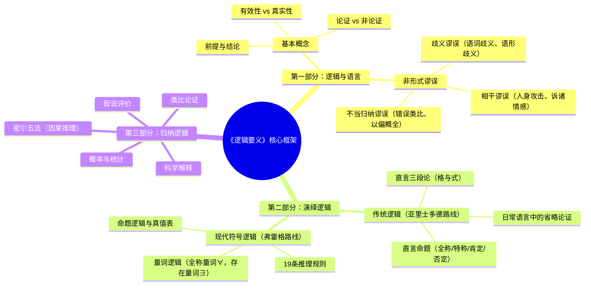

## 《逻辑要义》读书笔记 
  
### 作者  
digoal  
  
### 日期  
2026-06-16  
  
### 标签  
读书笔记 , 逻辑要义  
  
----  
  
## 背景 
  
  
  
---
书名: 《逻辑要义（第2版）》  
作者: 欧文·M·柯匹 / 卡尔·科恩 / 丹尼尔·E·弗莱格  
原作名: Essentials of Logic, 2e  
出版年份: 2018（中文第2版）  
笔记日期: 2026-06-16  
豆瓣链接: https://book.douban.com/subject/30141673/  
标签: [逻辑学, 哲学入门, 批判性思维, 分析哲学, 形式逻辑]  
---
  
用一本书，重建你的思维地基
  
> **一句话**：这是一把手术刀，专门用来解剖你每天听到的那些看似有道理、实则一地破绽的论证。  
> **适合谁读**：想系统训练逻辑思维的文科生；对"讲道理"感兴趣的任何人；法学、哲学、MBA备考者。  
> **阅读难度**：⭐⭐⭐☆☆（前半部分友好，后半部分符号逻辑需要认真刷题）  
> **推荐指数**：⭐⭐⭐⭐☆  
  
---

## 一、时代坐标：这本书从哪里来？

1953年，一位叫欧文·柯匹（Irving M. Copi）的美国逻辑学家在芝加哥大学师从伯特兰·罗素期间受到深刻影响，后来他把这份影响变成了一本书——《逻辑学导论》。那是战后美国，分析哲学正在席卷英美学院，符号逻辑逐渐取代传统修辞学，成为哲学系的核心课程。大学老师们迫切需要一本既严谨又能让普通学生读懂的逻辑教科书。

柯匹的《逻辑学导论》就是在这个需求下诞生的，一写就写了15个版本，成为"逻辑教材界的黄金标准"。《逻辑要义》则是它的精简版——"应众多教师在其课程中要求有一本简明的导论性教科书之需而写"，是从大部头里提炼出的精华读本。

**这本书要解决的核心问题只有一个**：人们不会推理。

这听起来是个严重的指控，但柯匹认为这是事实。我们每天制造和接收大量"论证"——新闻评论、广告宣传、政治演说、朋友劝说——其中充斥着各种隐蔽的错误。我们之所以被说服，往往不是因为对方讲道理，而是因为我们缺乏识别错误的工具。《逻辑要义》就是要把这套工具交到普通人手里。

```
时间轴：柯匹与西方逻辑学脉络

亚里士多德（公元前384）→ 创立三段论逻辑
        │
弗雷格（1879）→ 发明现代谓词演算（逻辑革命）
        │
罗素·怀特海（1910）→《数学原理》，符号逻辑奠基
        │
柯匹师从罗素（1940s）→ 承接分析哲学传统
        │
《逻辑学导论》（1953）→ 经典教科书，连出15版
        │
《逻辑要义》（简明版）→ 你手中这本，横跨经典与现代逻辑
```

---

## 二、核心命题：作者在说什么？

《逻辑要义》的结构非常清晰，九章内容勾勒出一幅完整的逻辑地图，但背后有三条贯穿始终的核心命题。

### 命题一：论证是可以被客观评价的

这听起来是废话，但其实很激进。我们日常文化里有一种根深蒂固的想法：观点是主观的，你有你的道理，我有我的道理，不存在谁对谁错。

柯匹不同意这个观点。他认为，一个论证是否有效、是否成立，是有客观标准的，和你喜不喜欢、感不感动无关。演绎论证的有效性取决于逻辑形式，而非内容的好坏：只要前提为真且推理形式正确，结论必然为真——没有任何情感或文化背景能改变这一点。

这条命题的深层含义是：**理性是公共的，谬误是可以被识别的**。

### 命题二：语言本身是最大的逻辑陷阱

全书第二章用大量篇幅讨论"非形式谬误"，其中许多谬误都藏在语言里。歧义、含混、诉诸情感、诉诸权威、人身攻击……这些谬误之所以能蒙骗人，不是因为它们的逻辑结构有多复杂，而是因为它们穿着正常语言的外衣，让你感觉"有道理"。

书中的区分很精准：**形式谬误**是推理形式本身的错误（例如肯定后件：如果p则q，q为真，因此p为真——这在逻辑上是错的）；**非形式谬误**则来自语言的模糊性，没有固定形式，更难识别，更具欺骗性。

所谓"巧言令色鲜矣仁"，说的大概就是非形式谬误的威力。

### 命题三：演绎与归纳是两套完全不同的思维体系

这是本书最重要、也最容易被忽视的区分。

- **演绎推理**：前提为真则结论必然为真，是"保真"的推理。三段论、命题逻辑都属于这类。
- **归纳推理**：前提为真只能使结论"或然为真"，永远不能保证。科学归纳、类比论证、统计推理都属于此类。

这个区分意味着什么？意味着我们不能用演绎的标准去评价归纳推理（"你举了10个例子就说所有X都是这样，这不够"——这是在用错标准），也不能把归纳推理的结论当成演绎那样确定的真理。

科学理论的本质是归纳的，永远面临被新证据推翻的可能性。这不是科学的弱点，而是它的诚实之处。

---

## 三、论证地图：全书逻辑结构可视化



**论证方式评价**：柯匹的论证策略是"大量例子+系统规则"。每一个抽象规则后面都跟着来自政治新闻、法庭辩论、科学史的真实案例。这让理论不至于悬空，但也带来一个问题——例子多是美国语境，中文读者有时需要自行翻译情境。

书中对**三段论"格"的分析**堪称教科书式的精致，维恩图与规则法并举，让这个亚里士多德两千年前发明的工具依然焕发活力。

---

## 四、前提假设与边界：什么情况下逻辑失效？

任何一套理论都依赖若干前提假设。《逻辑要义》也不例外：

**假设一：命题非真即假（排中律成立）**

经典逻辑建立在二值逻辑基础上，每个命题要么真要么假，没有中间地带。但现实中存在大量模糊命题——"李先生是个高个子"，高是多高？这类命题在经典逻辑里很难处理。模糊逻辑（Fuzzy Logic）的发展正是对这一假设的突破。

**假设二：语言可以被精确化**

书中大量时间花在把日常语言翻译成标准逻辑形式上，但这个翻译过程本身充满争议。"所有乌鸦都是黑的"和"没有乌鸦不是黑的"逻辑上等价，但日常意义上感觉不同——语言哲学告诉我们，意义不只是逻辑内容，还有语用层面的信息。

**假设三：理性说服是可能的**

全书隐含一个信念：只要论证有效、证据充分，理性的人就应该接受结论。但认知心理学的研究（如卡尼曼的《思考，快与慢》）表明，人类的实际推理过程充斥着各种认知偏差，有时即便人们"看懂"了一个逻辑谬误，也依然不会改变立场。

**这本书的适用边界**：

形式逻辑适合评价**结构清晰**的论证，比如法庭辩论、哲学论文、数学证明。对于**情感性争论**、**价值观分歧**、**模糊现实问题**，本书的工具箱需要配合其他框架（如论辩理论、修辞学）才能发挥全效。

---

## 五、思想谱系：这本书站在哪条线上？

```
西方逻辑学两大传统

【亚里士多德传统】                    【现代符号逻辑传统】
直言命题 + 三段论                    弗雷格谓词演算（1879）
以"类"（class）为核心               以"命题函数"为核心
2000年主导西方逻辑                  20世纪取得统治地位
         \                                /
          ↘                          ↙
           《逻辑要义》（两者并举，兼收并蓄）
```

柯匹的选择是**保守而务实的**：他没有抛弃传统三段论，因为它对于日常语言分析依然有效；同时引入了符号逻辑，因为它是现代科学推理的语言。这种"两手都要抓"的策略，使得这本书能够覆盖从文科生到理科生的广泛读者，但也让它在某种意义上站在两个阵营之间，没有深入任何一个方向的前沿。

在影响脉络上，柯匹是罗素的学生，而罗素与弗雷格共同奠定了分析哲学与现代逻辑的基础。可以说，《逻辑要义》是把这条高深的学术脉络转译成大学课堂语言的关键节点，它不是最深刻的那本书，但可能是传播面最广的那本。

**与同类书的比较**：

- 比《批判性思维》（诺曼·斯万）：更系统，有严格的形式逻辑训练
- 比《非形式逻辑》（约翰逊等）：范围更广，涵盖演绎与归纳
- 比国内逻辑教材：例子更生动，更贴近真实论证场景
- 比完整版《逻辑学导论》：更简洁，适合快速入门，但牺牲了深度

---

## 六、我学到了什么？

读完这本书，最大的改变不是"我现在能做三段论了"，而是一种**看论证的方式发生了变化**。

以前看到一段话，我感受到的是"这个人说得有道理"或"这个人说得不对"。现在，我开始有意识地问：这是一个论证吗？它的前提是什么？前提和结论之间的关系是什么？是演绎的还是归纳的？如果是演绎的，推理形式有没有问题？如果是归纳的，样本够不够代表性？

**三个最重要的收获**：

**第一，有效 ≠ 真实**。这是这本书教给我最基础也最容易被混淆的区分。"所有鱼都会游泳，鲸鱼会游泳，所以鲸鱼是鱼"——这个论证**无效**（结构有问题，肯定后件），但即便我们把它改成有效的形式，"所有鱼都会游泳"这个前提是假的，所以整个论证也不能得出真结论。有效性只保证推理结构合理，不保证结论是真的。真实有效的论证，才是真正"有道理"的论证。

**第二，诉诸权威不等于错误，但需要区分场合**。书中指出，诉诸专家意见（Argument from Authority）在以下情况是**可接受**的：被引用的人是真正的权威，且在其专业领域内发言。但当权威越过自己的专业边界发言时，这就变成了谬误。一个物理学家谈气候变化，和一个气候科学家谈气候变化，权重是不同的。这个区分在信息泛滥的今天格外重要。

**第三，归纳永远不能"证明"，只能"支持"**。这让我重新审视了很多"科学研究证明……"的表述。严格来说，科学归纳永远只能"支持"或"印证"某个假说，而不能逻辑上"证明"它——因为下一个反例随时可能出现。这不是软弱，这是科学诚实。

---

## 七、举一反三：逻辑工具箱的迁移应用

《逻辑要义》的核心方法论，在以下场景中可以直接迁移使用：

**场景一：读新闻**
每一篇社论或评论文章都是一个论证。试着找出：前提是什么？结论是什么？用了什么谬误？常见谬误比如"稻草人"（错误描述对方观点再批驳）、"诉诸大众"（大家都这么认为所以是对的）、"虚假二分"（非A即B，其实还有C）——一旦有了名字，识别就容易多了。

**场景二：职场辩论和会议**
"我们上次这么做失败了，所以这次不能这么做。"——这是不当归纳。"你之前也犯过错，所以你批评我不对。"——这是人身攻击（诉诸人格）。知道谬误的名字，可以让你在职场讨论中更有的放矢地回应，而不是凭本能争论。

**场景三：写文章和做决策**
要写出有说服力的文章，实质上是构造一个好的论证：前提要充分且真实，从前提到结论的推理要有效。在决策时，把"理由"显式化——我的前提是什么？这些前提可靠吗？——往往能帮助发现盲区。

---

## 八、批判与反思

我真正不满意这本书的地方，有以下几点：

**一、例子的文化局限性**
作为美国教材，书中大量例子来自美国政治、法律和科学语境。中文版虽有翻译，但文化隔阂依然存在，有时会让读者感到陌生甚至费解。

**二、符号逻辑部分难度落差明显**
前几章讲非形式谬误，语言清晰、读起来甚至有点有趣；但到第六章符号逻辑之后，难度陡然上升，大量符号和推理规则如果不做大量练习题，很难真正掌握。这对自学者来说是个挑战。

**三、对"实践中的推理"覆盖不足**
书中讲的是"理想情况下论证应该是什么样的"，但现实中人们的推理充满认知偏差、情感干扰和社会压力。认知科学（卡尼曼等）告诉我们，学会了逻辑不等于能在真实决策中运用逻辑。这本书没有触及这个"知行落差"。

**四、时代已经变了，但归纳那章还不够**
今天我们生活在一个数据驱动的世界，机器学习、统计推断、贝叶斯思维变得越来越重要。书中归纳那章的介绍较为基础，对于想进一步理解数据推理的读者，需要额外补充概率论和统计学知识。

---

## 九、金句与记忆点

**1. "论证是由命题组成的，其中一个命题（结论）被声称是由另一些命题（前提）推出来的。"**
→ 最基础的定义，但大多数日常"论证"其实不符合这个定义——它们是情绪表达、价值宣告，而非真正的论证。

**2. "有效性与真实性是完全不同的性质。"**
→ 有效论证可以有假前提；无效论证也可以碰巧得出真结论。混淆这两者是逻辑训练的第一关。

**3. "非形式谬误产生于语言内容的含混性……具欺骗性的是语言。"**
→ 我们以为我们在讨论事实，实际上我们在被语言的表层所迷惑。

**4. "演绎论证的有效性不依赖于其内容，而依赖于其形式。"**
→ 这是形式逻辑最核心的洞见，也是它最反直觉的地方：一个前提荒谬的论证在逻辑上可以是有效的。

**5. "在一个其公民为理性与说服而非暴力所引导的共和国里，推理的艺术变得最为重要。"——托马斯·杰弗逊**
→ 柯匹以这句话开篇，既是格言，也是政治立场：逻辑教育是民主社会的基础设施。

**6. 密尔五法（Mill's Methods）——求同法、求异法、共变法等**
→ 因果推理的经典工具，今天的"A/B测试"在方法论上正是密尔求异法的数字版本。

**7. 关于类比论证："类比实体相似方面越多、越相关，类比论证就越强；不相似处越多，论证就越弱。"**
→ 下次有人用类比说服你，先问：这两个东西的相似是核心相似还是表面相似？

---

## 十、延伸阅读

**1. 《逻辑学导论》（柯匹，第15版）**
本书的完整母体版本，适合想深入学习的读者，内容更全、习题更丰富，但也厚得多。

**2. 《思考，快与慢》（丹尼尔·卡尼曼）**
逻辑的另一面：为什么人类实际上不按逻辑推理？认知科学视角，和本书形成完美互补。

**3. 《批判性思维》（布鲁克·诺尔·摩尔 & 理查德·帕克）**
更侧重非形式逻辑和日常论证分析，比《逻辑要义》更轻量，可作入门前热身或配套阅读。

**4. 《哥德尔、艾舍尔、巴赫》（侯世达）**
如果你对形式系统的边界和悖论感兴趣，这本书是逻辑学在艺术与哲学中最迷人的展开。

**5. 《科学革命的结构》（托马斯·库恩）**
对本书归纳章节中"假说评价"部分的深度延伸：科学理论真的是靠归纳逻辑建立的吗？库恩会给你一个颠覆性的答案。

---

*笔记写于 2026-06-16 | 基于柯匹/科恩/弗莱格《逻辑要义（第2版）》及相关公开学术资料整理*
  
  
#### [PostgreSQL 解决方案集合](../201706/20170601_02.md "40cff096e9ed7122c512b35d8561d9c8")
  
  
#### [德哥 / digoal's Github - 公益是一辈子的事.](https://github.com/digoal/blog/blob/master/README.md "22709685feb7cab07d30f30387f0a9ae")
  
  
#### [About 德哥](https://github.com/digoal/blog/blob/master/me/readme.md "a37735981e7704886ffd590565582dd0")
  
  

  
