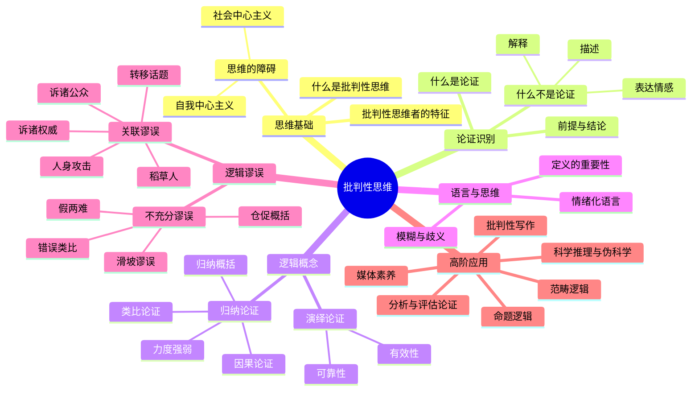

## 《批判性思维》读书笔记 
  
### 作者  
digoal  
  
### 日期  
2026-06-16  
  
### 标签  
读书笔记 , 批判性思维  
  
----  
  
## 背景 
  
  
  
  
---
书名: 《批判性思维（原书第5版）》  
作者: [美] 格雷戈里·巴沙姆 / 威廉·欧文 / 亨利·纳尔多内 / 詹姆斯·M.华莱士  
译者: 舒静  
出版年份: 2019（原书2012）  
出版社: 外语教学与研究出版社  
笔记日期: 2026-06-16  
豆瓣ISBN: 9787521306606  
标签: [批判性思维, 逻辑学, 通识教育, 论证, 谬误识别]  
---
  
你以为你在思考，其实你在感觉
  
> **一句话**：这是一本教你"思考思考本身"的工具书——不是告诉你该想什么，而是教你怎么想、怎么辨别自己在瞎想。  
> **适合谁读**：想提升理性思维的普通人；容易被情绪、舆论带走的读者；需要写论文、做决策、辩论的学生和职场人。  
> **阅读难度**：⭐⭐⭐☆☆（中等，概念不难，但需要做练习才能真正吸收）  
> **推荐指数**：⭐⭐⭐⭐☆  
  
---

## 一、时代坐标：这本书从哪里来？

这本书诞生于一个特定的历史焦虑之中。

1983年，美国政府发布了《国家危机中的国家》报告，痛批美国教育质量严重滑坡——学生不会推理、不会写作、不会分辨事实与观点。这份报告引发了美国教育界长达数十年的"批判性思维运动"。加州大学系统率先立法，要求所有学生必须修完批判性思维课程才能毕业。各大高校争相开设相关课程，教材市场随之爆发。

巴沙姆等四位哲学与英语教授，都来自宾夕法尼亚州国王学院，长期从事批判性思维课程的一线教学。这本书的第一版出现于2000年代初，此后历经五次修订，成为美国约190所大学的通用教材，包括加州大学伯克利分校、俄亥俄州立大学、佛罗里达大学等。

更深的时代背景是：20世纪下半叶，信息时代到来，广告、政治宣传、伪科学、社交媒体的噪音前所未有地包围着每一个人。人们越来越需要一套"思维防护盾"——不是某种意识形态，而是一种无论接收什么信息都能自主判断的能力。这本书试图做的，正是训练这种能力。

```
                     思想根源脉络
┌─────────────────────────────────────────────┐
│ 苏格拉底（公元前399年）                      │
│   ↓ "未经审视的人生不值得过"               │
│ 约翰·杜威（1910年）                         │
│   ↓ 《我们如何思考》，提出"反省性思维"    │
│ 美国进步教育运动（1920-1950s）              │
│   ↓ 将批判性思维纳入公民教育               │
│ 冷战教育危机（1983年）                      │
│   ↓ "国家危机"报告触发课程改革            │
│ 批判性思维教材时代（1990s-今）              │
│   ↓ Bassham等人的教材体系日趋成熟          │
│ 信息爆炸与AI时代（2020s）                   │
│   ↓ 批判性思维的紧迫性达到历史顶峰         │
└─────────────────────────────────────────────┘
```

---

## 二、核心命题：作者在说什么？

这本书的核心不是某个惊天大论断，而是一套**思维操作系统**的安装说明书。它由三个层层递进的命题构成：

### 命题一：你的大多数"思考"其实是感觉

人们以为自己在理性推断，实际上大多数时候是在用情绪、习惯、从众心理来下结论。书中列举了两大类破坏理性思维的障碍：一是**自我中心主义**（把自己的利益和立场当成标准），二是**社会中心主义**（把自己所在群体的观念当成普世真理）。这两种障碍不是智商问题，而是人类认知的默认配置——你必须主动对抗它们，才能真正开始思考。

### 命题二：论证是思维的基本单位，学会拆解论证就是学会思考

本书用超过一半的篇幅来训练读者识别和评估**论证（argument）**。论证不是吵架，而是由"前提"推出"结论"的结构。一个日常对话里充满了论证，但绝大多数人根本没注意到——更不用说去检验这些论证是否有效。

书中核心区分：
- **演绎论证**：前提为真，结论必然为真（数学式推理）
- **归纳论证**：前提为真，结论可能为真（科学式推理）

两者都有其判断标准，但不能混用。很多伪科学和谣言就是把归纳论证包装成演绎论证来欺骗人的。

### 命题三：谬误不是意外，是有迹可循的思维陷阱

本书系统梳理了数十种**逻辑谬误（fallacy）**，分为两大类：
- **关联谬误**：论证的前提与结论根本没有逻辑关联（比如"这人品德不好，所以他说的话是错的"——人身攻击谬误）
- **不充分谬误**：前提与结论有关联，但支持力度不够（比如"我认识的三个人都这么说，所以这是事实"——仓促概括）

识别谬误的意义不只是"打败别人的论证"，更重要的是识别自己脑子里每天都在运转的那些谬误。

---

## 三、论证地图：这本书的知识骨架



这本书的架构非常清晰：从"什么是思维"出发，逐步建立起识别论证、评估论证、识别谬误的能力，最后延伸到科学、媒体、写作等实际场景。这是一本真正"从零开始"的教材——前几章读起来几乎像常识，但越往后越会发现自己之前的盲区。

---

## 四、拆开来看：几个我觉得最有价值的工具

### 工具1：识别"这是不是论证"

日常对话中，大多数话语不是论证。"今天天气真好"是描述，"他生气是因为被骗了"是解释，"这太不公平了！"是情绪表达。只有当一个人用某些理由来支持某个结论的时候，才叫论证。

区分这些，会让你从嘈杂的信息流中快速筛选出真正需要评估的内容。

### 工具2：人身攻击谬误（Ad Hominem）

这是最常见、最具迷惑性的谬误之一。批评一个人的品格、动机、背景，并以此否定他的观点——这在逻辑上是无效的。一个道德败坏的人，仍然可能在某件事上说出了真话。

反例：某政客腐败，但他指出的某条政策漏洞可能是真实存在的。

### 工具3：仓促概括（Hasty Generalization）

"我见过的三个XX都这样，所以XX都是这样的。"这是归纳推理中最常见的错误——样本太小，就下了放之四海而皆准的结论。

日常中更隐蔽的形式：媒体报道了几个极端案例，就让我们对一个群体形成了刻板印象。

### 工具4：情绪化语言的识别

语言本身可以是一种操控工具。"他坚持己见"和"他固执己见"描述的是同一件事，但情绪色彩截然相反。书中专门有一章讲委婉语、修辞性定义和暗示——当你学会识别这些，就能看穿很多广告和新闻标题背后的心理操控。

---

## 五、前提假设与边界：什么情况下这不成立？

任何书都有它成立的前提，这本书也不例外。

**前提假设一：理性是思维的最高标准**

本书整体建立在西方分析哲学的传统上，默认理性推理优于情感直觉。但现代认知科学（尤其是卡尼曼的《思考，快与慢》）表明，直觉在某些领域（专家经验、快速决策）比慢速的逻辑推理更可靠。本书对直觉的作用讨论不足。

**前提假设二：文化背景是中性的**

书中大量例子来自美国文化语境——美国政治、美国广告、美国媒体生态。这些例子对中国读者来说可能理解成本较高。更深层的问题是：批判性思维的某些标准（比如直接挑战权威）在不同文化中被接受的程度大不相同，书中对此几乎没有讨论。

**前提假设三：人能够且愿意改变思维方式**

这是最难被满足的假设。研究显示，人们在面对与自身观点相悖的证据时，往往不会改变立场，而是寻找更多理由来维护原有信念（确认偏见）。书中对这种心理阻力的讨论还不够深入。

**这本书的适用边界**：作为思维工具书，它在**分析他人论证、识别谬误、评估信息**方面非常有效；但在**理解情感决策、文化差异中的沟通、高度不确定的复杂判断**上，需要补充其他视角。

---

## 六、思想谱系：这本书在哪个传统里？

```
苏格拉底"助产术" → 通过追问揭示无知
        ↓
亚里士多德《工具论》 → 形式逻辑的奠基
        ↓
笛卡尔"方法论怀疑" → 系统性怀疑作为认识起点
        ↓
约翰·杜威《我们如何思考》(1910) → "反省性思维"进入教育
        ↓
分析哲学传统（20世纪） → 论证分析、语言澄清
        ↓
批判性思维运动（1980s-） → Ennis、Paul等人建立教育框架
        ↓
Bassham等人的教材（2000s-今） → 将传统系统化、教材化、大众化
```

本书属于**分析哲学传统中的批判性思维教育流派**，与理查德·保罗（Paul）的"批判性思维工具"路线略有不同——保罗更强调思维元素和思维特质的培养，巴沙姆等人更侧重逻辑工具的掌握和谬误识别的训练。

在国内，这本书与《学会提问》（布朗、基利著）、《批判性思维》（摩尔、帕克著）是同类竞品中最常被推荐的几本。

---

## 七、我学到了什么？

读这本书之前，我以为批判性思维就是"多质疑"，或者"多说不"。读完才明白，这完全是一个误解。

**第一个真正的收获：质疑不是目的，论证才是核心。**

真正的批判性思维不是怀疑一切，而是能够说出"我基于什么理由，不相信这个结论"。没有论证支撑的质疑只是情绪。我意识到，我平时的很多"独立思考"，不过是用另一种偏见替代了原来的偏见。

**第二个真正的收获：语言是隐形的思维操控工具。**

书中关于情绪化语言的章节，让我重新审视自己每天接触的信息。一个词语的选择，可以完全改变一句话的含义走向。"增加投入"和"大肆挥霍"，"温和抗议"和"暴力冲突"——描述的可能是同一件事，但引发的判断截然不同。从此以后，我看新闻标题的方式彻底变了。

**第三个真正的收获：谬误是可以训练识别的，而且一旦学会，就关不上那扇门了。**

这本书有个副作用——读完以后，日常对话和社交媒体变得非常"嘈杂"，因为你开始在每一段话里识别谬误。这既让人觉得疲惫，又让人觉得清醒。我认为这种"认知升级的不适感"是值得付出的代价。

---

## 八、举一反三：这套框架能用在哪里？

批判性思维不只是学术课程，它是一套可以迁移的元技能。

**场景一：职场决策**
当老板或同事提出一个方案，习惯的反应是"听起来不错"或"感觉有风险"。批判性思维的介入是：找出这个方案背后的核心前提，判断它们是否真实成立。"这个策略基于竞争对手不会降价的假设，但这个假设可靠吗？"

**场景二：消费决策**
广告是谬误的集中地。"95%的用户满意"——这95%是谁？样本怎么选的？满意的定义是什么？只要把书中"评估统计论证"的工具拿出来用，大多数广告都会变得苍白。

**场景三：社交媒体信息筛选**
一条病毒性帖子，通常包含：情绪化语言 + 仓促概括 + 诉诸恐惧或愤怒。掌握这三个识别工具，你的信息消费质量可以立刻提升一个档次。

---

## 九、批判与反思：这本书的不足在哪里？

**不足一：太美国了**

这是一本为美国大学生写的教材，例子、文化背景、政治语境都是美国的。中国读者需要自己完成"例子的本地化转换"，否则很容易理解了概念但用不上。翻译版在这方面几乎没有做任何适配工作。

**不足二：训练效果高度依赖练习**

这本书不是"读一遍就受益"的书，它是教材。书中有大量练习题，但中文版的读者大多把它当成阅读书而不是教材来用——跳过练习直接看内容。这样读完，其实只获得了20%的价值。批判性思维是一种技能，不是知识，技能必须通过反复练习才能内化。

**不足三：没有正面回应情感与直觉的价值**

过度强调逻辑，会让人误以为情感和直觉在判断中是纯粹的干扰因素。但认知科学的大量研究表明，情感是判断不可或缺的一部分——马基奥尼斯·达马西奥的研究表明，损伤前额叶（负责情感整合）的患者，会在逻辑上无懈可击但生活决策上一塌糊涂。这本书对情感认知的这一面，基本是回避的。

**不足四：在AI时代需要更新**

第5版（2012年）面世时，还没有大语言模型。如今，批判性思维最紧迫的挑战之一是：如何判断AI生成内容的可靠性？如何在"内容泛滥"的环境下保持判断力？第15章"科学与伪科学"虽然触及了部分，但远远不够。

---

## 十、金句与记忆点

1. **"批判性思维是审慎地运用推理去断定一个断言是否为真。"**
   → 注意两个词：审慎（不是冲动），推理（不是感觉）。这是全书最精准的定义，也是最难真正践行的要求。

2. **"谬误是推理中的欺骗手段。"**
   → 谬误不是错误，错误可能是无心的；谬误的结构天然具有迷惑性，让你以为它是有效推理。

3. **"论证的力量来自前提的真实性和推理的有效性——两者缺一不可。"**
   → 前提为真但推理无效，结论不可靠；推理有效但前提为假，结论同样不可靠。这是最基础也最容易被忽视的逻辑常识。

4. **"情绪化语言通过心理手段说服人，而不是通过逻辑。"**
   → 这不是说情绪化语言一定是错的，而是说你需要识别它——在被情绪打动之前，先问一句：这里有实质性的论证吗？

5. **"人身攻击谬误：通过批评其来源来反驳一个论点，而非反驳论点本身。"**
   → 即使提出论点的人动机不纯，论点本身也可能是真实的。来源和内容是两件事，不能混淆。

6. **"仓促概括：基于不具代表性的样本，得出关于整体的结论。"**
   → 这是新闻报道和社交媒体最常制造的认知扭曲。一个极端案例，无法代表整体。

7. **"科学的特征之一，是其结论是可被证伪的。"**
   → 一个无论发生什么都能"自洽"的理论，不是科学，是信仰。

8. **"媒体真正的动机是吸引注意力，而不是告知真相。"**
   → 这句话写于社交媒体爆发之前，在今天比当时更为准确。

---

## 十一、延伸阅读

**1. 《学会提问》（布朗、基利著）**
同类书中最好读的版本，专注于"如何提出好问题来质疑论证"，和巴沙姆这本形成互补。适合批判性思维入门的第二本书。

**2. 《思考，快与慢》（丹尼尔·卡尼曼著）**
从认知科学角度补充批判性思维的基础——告诉你人类思维系统1（直觉）和系统2（理性）各自的特点和局限。与本书的哲学-逻辑视角形成互补。

**3. 《影响力》（罗伯特·西奥迪尼著）**
从心理学角度研究"人是如何被说服的"——这是批判性思维的应用场景，读完会让你对社会影响手段有更直观的认识。

**4. 《逻辑哲学论》（维特根斯坦著）**
如果你对本书第四章"语言与思维"深感兴趣，想进一步探究语言与逻辑的关系，这本书是更深的进阶方向——但难度提升不止一个级别。

**5. 《伪科学的把戏》（西蒙·辛格著）**
本书第15章的延伸读物，专门拆解各种伪科学的论证方式，例子生动，是批判性思维在科学传播领域的绝佳应用示范。

---

## 最后想说的话

这本书有一个潜藏的雄心：它不只是想教你分辨谁对谁错，它想帮你成为一个**对自己诚实的人**。

书中有一节讲到批判性思维者最重要的特质，其中之一是"公正性"——不只对别人的观点严格，也对自己的观点同样严格。这一点说起来容易，做起来极难。我们几乎天生就会用双重标准：对支持自己观点的证据宽容，对反对自己的证据苛刻。

这本书最大的价值，不是让你"赢得辩论"，而是让你有机会真正改变自己的想法。

那才是思考。

---

*笔记写于 2026-06-16 | 基于书籍内容、公开书评与深度思考整理*
  
  
#### [PostgreSQL 解决方案集合](../201706/20170601_02.md "40cff096e9ed7122c512b35d8561d9c8")
  
  
#### [德哥 / digoal's Github - 公益是一辈子的事.](https://github.com/digoal/blog/blob/master/README.md "22709685feb7cab07d30f30387f0a9ae")
  
  
#### [About 德哥](https://github.com/digoal/blog/blob/master/me/readme.md "a37735981e7704886ffd590565582dd0")
  
  

  
