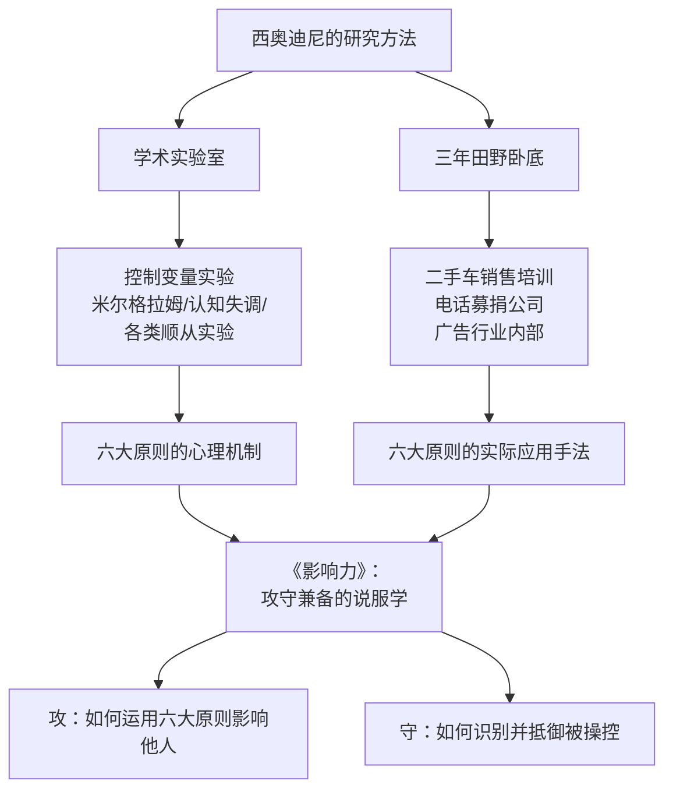

## 《影响力》读书笔记 
  
### 作者  
digoal  
  
### 日期  
2026-06-16  
  
### 标签  
读书笔记 , 影响力  
  
----  
  
## 背景 
  
  
  

---
书名: 《影响力》Influence: The Psychology of Persuasion  
作者: [美] 罗伯特·西奥迪尼（Robert B. Cialdini）  
译者: 陈叙  
出版年份: 1984（原著）/ 2006（中文版）  
出版社: 中国人民大学出版社 · 湛庐文化  
笔记日期: 2025-06-16  
豆瓣链接: https://book.douban.com/subject/1629901/  
豆瓣评分: 8.8  
标签: [心理学, 社会心理学, 说服, 商业, 自我成长]  
---

  
  
> **一句话**：我们以为自己在独立思考，其实早就被六把隐形钥匙开了锁。  
> **适合谁读**：想搞懂"为什么我答应了"的人；从事销售、谈判、运营、管理的人；想在信息洪流里保持清醒的人  
> **阅读难度**：⭐⭐☆☆☆（案例丰富，读来轻松）  
> **推荐指数**：⭐⭐⭐⭐⭐  
  
---
  
## 一、时代坐标：一个社会心理学家为什么要去卧底

1970年代的美国，消费社会正在加速运转。电视广告铺天盖地，门对门推销员挨家挨户，电话营销公司如雨后春笋。人们开始频繁遭遇一个怪象：明明没有计划购买，却莫名其妙刷了卡；明明对那个人毫无印象，却在慈善机构的募捐表上签了名；明明已经拒绝了大要求，却对随后的小要求无力说不。

罗伯特·西奥迪尼（Robert B. Cialdini），时任亚利桑那州立大学心理学教授，决定不坐在实验室里研究这个问题。他做了一件同行少有人做的事：**潜入"顺从专业人士"的世界**——混入二手车销售培训、加入电话募捐公司、参与广告公司的内部培训，用三年时间从内部观察说服高手如何工作。

这本书，正是这三年卧底观察加上数十年学术实验的总结。1984年首次出版，此后畅销超过五百万册，被译成41种语言，成为《财富》杂志推荐的75本商业必读书之一。查理·芒格称："西奥迪尼在影响力方面对我的影响，其他任何科学家都比不上。"

西奥迪尼的核心问题意识只有一个：**人类的顺从行为，有没有可重复、可预测的底层模式？**

答案是：有，而且只有六个（后来加了第七个）。

```
时间轴：影响力的诞生

1960s-70s  消费社会爆发，顺从行业兴起
    ↓
1974-1977  西奥迪尼三年卧底田野调查
    ↓
1978-1983  实验室验证 + 学术发表
    ↓
1984       《影响力》出版，引发营销革命
    ↓
2001-2009  修订版，加入大量新案例
    ↓
2016       新版增加第七原则：联盟（Unity）
    ↓
今天       被誉为"所有电商的指导手册"
```

---

## 二、核心命题：六把钥匙，开了人类的锁

西奥迪尼的论点，有一个精妙的起点：**人类的行为越来越像昆虫的固定行为模式**。

火鸡妈妈根据"叽叽"叫声来辨认幼崽——凡是发出这种声音的，就会被接纳；即使是天敌，只要发出叽叽声，也会被抱入怀中哺育。鸟类学家把这种由单一刺激触发的自动反应叫做"固定行为模式"。

西奥迪尼说：人类在越来越复杂的世界里，也在做同样的事情。我们没有精力对每一个决策都进行深度分析，所以进化出了一套**心理捷径（heuristics）**：看到某类触发特征，就自动启动对应的反应程序。

这些触发特征，就是六大原则。

---

### 原则一：互惠（Reciprocity）——"他给了我，我欠了他"

人类社会能够运转，部分原因在于互惠系统：你帮了我，我要还你。这是文明的基石，也是被操控的温床。

推销员给你一瓶免费香水，你就莫名觉得不好意思空手离开。Hare Krishna的僧侣在机场送你一朵花，随后的募捐成功率大幅提升——即便你知道这是策略，也很难抗拒那种"我该还礼"的感觉。

更厉害的变体是"**拒绝-退让术**"（Door-in-the-face）：先提一个你一定会拒绝的大要求，被拒绝后退让为一个小要求。对方会觉得"你退让了，我也该让一步"，顺从概率因此大增。西奥迪尼的实验显示，这个技巧能把人们带着少年犯参观动物园的同意率从17%提高到50%。

---

### 原则二：承诺与一致（Commitment & Consistency）——"我说过，就要做到"

一旦人们对某件事做出承诺，就会产生强烈的内驱力，让自己的后续行为与承诺保持一致。这是认知一致性理论的现实体现。

这就是为什么房产中介要你先填一份"意向书"——即使它没有法律效力，一旦你写下来，就开始把自己当成"打算买这套房的人"来思考。赌场的"免费筹码"也是同理：一旦你开始赌，你就把自己定义成了"在赌博的人"。

书面承诺的效力尤其强大。二战时期，中国人民志愿军要求美国战俘写下"美国并不完美"，看似无害，却让不少人在心理上滑入了对共产主义的同情。

---

### 原则三：社会认同（Social Proof）——"别人都这么做，所以是对的"

面对不确定性，我们把"其他人怎么做"当作判断"正确行为"的依据。这是一种高效的认知节能，但也是一个巨大的漏洞。

酒吧里预先放了几张钞票的小费盘——暗示"大家都给小费"，实际收入更高。电视笑声轨道（罐头笑声）哪怕质量低劣，也会让观众觉得更好笑。"本书销量已突破300万册"这句话，本身就是一个说服武器。

在真实危险中，社会认同还会制造"旁观者效应"：路边有人昏倒，越是人多，越是没人施救——因为每个人都在看别人怎么做，以此判断局势的严重性。

---

### 原则四：喜好（Liking）——"我喜欢他，所以我答应他"

我们更容易被自己喜欢的人说服。触发喜好的因素包括：外貌吸引力、相似性、熟悉感、关联（与好事关联的人让我们喜欢）、赞美。

这就是为什么直销公司喜欢让你的朋友来卖东西给你——不是朋友在卖，而是你在为朋友买。"好警察/坏警察"审讯技术，核心也是先制造"这个人喜欢我、理解我"的感觉。

---

### 原则五：权威（Authority）——"他是专家，他说对就是对"

人类对权威有深度的服从倾向。米尔格拉姆的实验已经证明，普通人在白大褂研究员的指令下，会对陌生人施以（他们以为是）强烈电击。

西奥迪尼指出，权威往往是通过符号来传递的：头衔、制服、配件（豪华轿车）。一个人穿着西装比穿休闲服更容易让陌生人服从——即便什么都没说，权威的外壳本身就在发言。

---

### 原则六：稀缺（Scarcity）——"快没了，所以更想要"

"最后三件！""仅剩24小时！"——这些字眼之所以有效，是因为人类对失去的恐惧远大于对获得的渴望。心理学称之为"损失厌恶"。

稀缺原则甚至能让人感知到质量上升：被告知饼干"限量供应"的实验组，比拿到同款饼干的普通组，觉得饼干更好吃。

---

## 三、论证地图：学者+卧底，双轨验证



书的结构很清晰：每一章介绍一个原则，先给出心理机制的理论依据（引用实验数据），再给出现实中被"顺从专业人士"运用的具体手法，最后提供防御建议。

**论证的优点**：可读性极强，每个原则都有多个生动案例，科学实验与生活场景互相印证，让读者不断产生"对对对，我遇到过这种！"的共鸣。

**论证的局限**：后文会细说。

---

## 四、前提假设与边界：什么情况下这不成立？

西奥迪尼的理论成立，有几个隐含前提：

**假设一：人在信息过载下会依赖捷径**
这在消费社会高度成立。但在熟人之间、或决策代价极高时（比如买房、选择手术方案），人们会放慢节奏，进行深度分析，此时六大原则的效力会减弱。

**假设二：六大原则有跨文化普遍性**
这个假设有一定支撑，但并非铁律。比如"社会认同"在集体主义文化（如中国、日本）中效力更强；"权威服从"在高权力距离文化中更显著。西奥迪尼的案例以北美白人中产为主，跨文化适用性需要谨慎。

**假设三：觉察到策略就能抵抗**
书中建议的防御手段多是"觉察到后就做相反的事"。但心理学研究表明，知道对方在用"互惠"策略，并不一定能消除负债感。认知知道和情感抵抗是两回事。

**边界**：这套原则在陌生人之间、商业场景中效力最强；对强权力关系（上下级、政府与公民）的影响有限；对紧密的长期关系中也会被信任机制所覆盖。

---

## 五、思想谱系：这本书站在谁的肩膀上

西奥迪尼的工作不是凭空而来，它是一个宏大学术传统的综合与普及。

```
认知失调理论（费斯廷格 1957）
        ↓ 承诺与一致原则的理论基础
权威服从实验（米尔格拉姆 1961-1963）
        ↓ 权威原则的戏剧性证明
"登门槛"技术 Freedman & Fraser（1966）
        ↓ 承诺升级的实验证明
社会影响研究 Deutsch & Gerard（1955）
        ↓ 社会认同的理论来源
        ↓
西奥迪尼《影响力》（1984）：综合·普及·应用
        ↓
行为经济学（卡尼曼·塞勒）——接力发展"损失厌恶""认知捷径"
        ↓
《助推》（Nudge）——将影响力原则引入公共政策
        ↓
《预先说服》（Pre-suasion, 2016, 西奥迪尼）——前置框架的影响
```

西奥迪尼的最大贡献，不是发现了六个原则（每个原则都有前人铺垫），而是**把散落在学术期刊里的实验发现，系统整合成一套可以被普通人阅读和使用的框架**，并用田野研究补充了实验室所缺失的"现实感"。

---

## 六、我学到了什么？

读完这本书，我最大的收获不是"我学会了六种招数"，而是意识到一件令人有些不安的事：**我们以为的自由意志，很多时候不过是一套反射弧的输出结果。**

**收获一：看见无处不在的触发器**
从此以后，走进任何商业场景，我都会下意识地扫描：这里在用哪一把钥匙？Costco的免费试吃（互惠）、天猫双十一的"限时折扣"（稀缺）、网页上的"已有10000人购买"（社会认同）……这种觉察感，让我在消费中多了一道"等一下，这是触发了我的什么"的缓冲。

**收获二：区分"好的顺从"和"被操控的顺从"**
西奥迪尼有一个重要区分：这六大原则本身不是坏的，它们在绝大多数情况下帮助我们做出了正确决策。问题出在"顺从专业人士"用虚假信号去触发它们——比如制造假稀缺、假社会证明、假权威。防御的关键不是拒绝所有触发，而是辨别触发信号是否真实。

**收获三：说服是可以学习的道德技艺**
这本书同样是一本"攻略手册"。在我们自己需要说服别人的时候（说服老板、争取支持、推广好的观点），了解这些原则可以帮助我们更有效地传递真实价值，而不只是靠关系或运气。

---

## 七、举一反三：这套框架还能用在哪

六大原则不只是卖货的工具，其背后的底层逻辑——**人类的认知捷径在特定刺激下会自动启动**——在很多领域都有映射。

**产品设计**：为什么用户不愿放弃已经投入时间的不好用的软件？承诺与一致+沉没成本。为什么"7天免费试用"很难取消？互惠感+承诺启动。

**公共政策**：英国"行为洞察团队"（Nudge Unit）直接引用西奥迪尼的研究，将"社会认同"（"你的邻居中90%已按时缴税"）用于税务催缴，效果显著优于法律威胁。

**教育与亲子**：为什么公开场合当众表扬孩子"你是个爱读书的孩子"比单纯奖励书更有效？因为承诺与一致——孩子会开始把"爱读书"当成自我身份认同来维护。

**谈判与职场**：拒绝-退让术可以合法地用于谈判中。先提一个合理但偏高的方案，被拒绝后退让到真正期望值，对方更容易接受——因为他参与了"逼你让步"的过程，有了满意感和责任感。

---

## 八、批判与反思：这本书哪里让我存疑

**批评一：文化局限性被低估**
全书案例高度集中于1970-1980年代北美，尤其是白人中产消费者群体。直接应用到其他文化语境时需要谨慎校正。比如在部分东亚文化中，"喜好"原则的运作方式差异很大——"关系"（guanxi）本身是一个复杂系统，不能简单等同于"liking"。

**批评二：防御建议有点过于简单**
书中每章末尾的"如何防御"板块，基本思路都是"发现被操控了，就做相反的事"。但心理学研究早已证明，知道策略的存在和真正能抵抗之间，存在相当大的鸿沟。我们的情感系统和理性系统是分开运行的，"知道"不等于"免疫"。

**批评三：有些案例的方法论存疑**
一位批评者指出，书中某个实验数据——从38%降到10%——被呈现为显著效果，但如果考虑基础概率，这个降幅可能在误差范围之内。西奥迪尼的实验设计质量参差不齐，不同于他的同行卡尼曼（诺贝尔奖级别的严格方法论），这本书的某些论证更接近"好的科普"而非"严谨的科学"。

**批评四：AI时代的新挑战**
这本书写于互联网普及前。今天，"社会认同"可以被算法批量制造（刷评论、刷单），"权威"可以被AI伪造（深度伪造视频），"稀缺"可以用服务器轻松控制（库存显示"仅剩2件"）。六大原则依然有效，但被滥用的规模和精准度，已经远超西奥迪尼写书时的想象。

---

## 九、金句与记忆点

> 1. **"我们的自动行为模式使我们极易受到操控，而操控我们的，恰恰是那些懂得这些模式如何运作的人。"**
> ——这是全书最核心的警告。知识本身就是护甲。

> 2. **"互惠原则是人类文明的基础，同时也是顺从专业人士最常用的武器。"**
> ——善与恶，共用同一套系统。

> 3. **"人们总是更相信有理由的请求，即使那个理由毫无意义。"**
> ——著名的"因为……"实验：只要句子里有"因为"，通过率就会上升，哪怕理由是"因为我需要复印"。

> 4. **"稀缺的东西并不因为难以弄到手，就变得更好吃、更好看、更好用了。"**
> ——然而我们偏偏觉得它变好了。这就是稀缺原则的荒诞之处。

> 5. **"头衔比当事人的本质更能影响他人的行为。"**
> ——在权威面前，我们看的是标签，不是内容。

> 6. **"社会认同原则在不确定情境下效力最强。"**
> ——越是搞不清楚该怎么办，我们越是转向他人寻找答案。

> 7. **"公开的承诺比私下的承诺更有约束力。"**
> ——这就是为什么公开宣誓、签名背书能产生额外的心理压力。

---

## 十、延伸阅读

**1. 《思考，快与慢》——丹尼尔·卡尼曼**
六大原则的理论根基在于"系统一（快思考）"的运作方式。卡尼曼从认知心理学层面给出了更严谨的底层解释，与《影响力》形成完美互补。

**2. 《助推》——理查德·塞勒 & 卡斯·桑斯坦**
将影响力原则引入公共政策，探讨如何用"轻推"（不强制）改变人们的行为。西奥迪尼的研究是助推理论的重要支柱。

**3. 《预先说服》（Pre-suasion）——罗伯特·西奥迪尼**
西奥迪尼本人的进阶之作，探讨"说服之前的那一刻"——如何通过控制注意力焦点，在对方开口之前就设好了接受的框架。

**4. 《怪诞行为学》——丹·艾瑞里**
从行为经济学角度呈现人类非理性决策的大量有趣实验，与《影响力》同频，但更聚焦于"为什么我们总做出糟糕的经济决策"。

**5. 《乌合之众》——古斯塔夫·勒庞**
早于西奥迪尼一百年的社会心理学经典，探讨群体心理如何让理性个体做出非理性决策。放在一起读，能感受到"社会认同"问题的历史纵深。

---

*笔记写于 2025-06-16 | 基于公开书评、学术资料与深度思考整理*
*本笔记力求呈现书籍核心思想，并融入批判性反思，不构成对作者观点的完全背书*
  
  
#### [PostgreSQL 解决方案集合](../201706/20170601_02.md "40cff096e9ed7122c512b35d8561d9c8")
  
  
#### [德哥 / digoal's Github - 公益是一辈子的事.](https://github.com/digoal/blog/blob/master/README.md "22709685feb7cab07d30f30387f0a9ae")
  
  
#### [About 德哥](https://github.com/digoal/blog/blob/master/me/readme.md "a37735981e7704886ffd590565582dd0")
  
  

  
