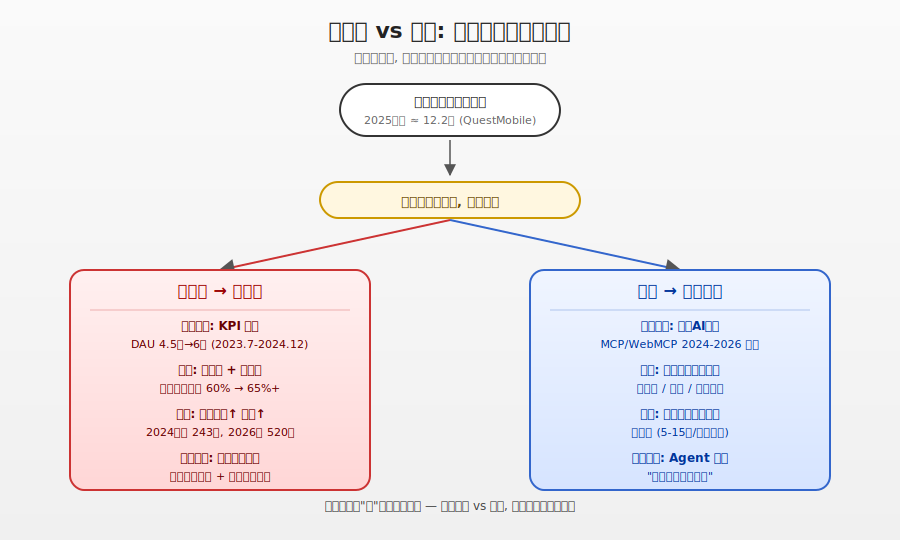
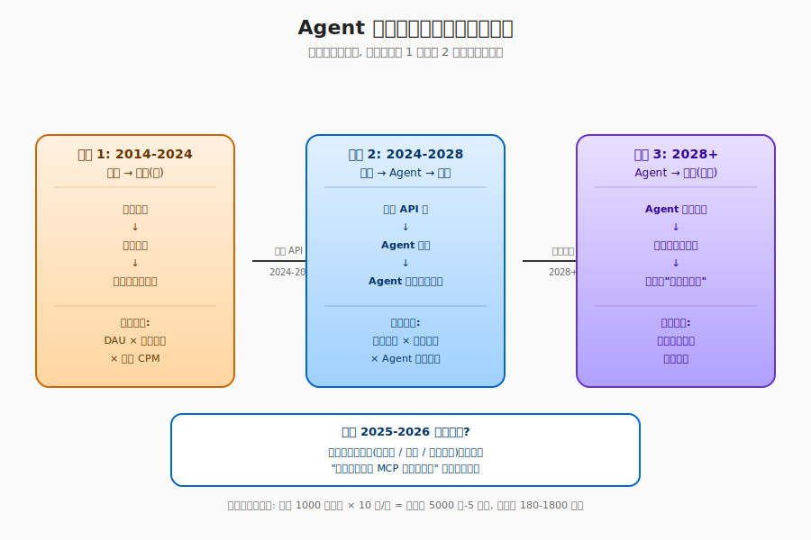

## 德说-第490期, 视频号正在变成抖音, 今日头条正在变成公众号
  
### 作者  
digoal  
  
### 日期  
2026-06-17  
  
### 标签  
AI , Agent , 内容消费主体 , 商业模式 , token 计费 , 抖音 , 视频号 , 今日头条 , 公众号 , 流量扶持 , 多巴胺 
  
----  
  
## 背景  
  
大多数人眼里抖音代表的是无脑短视频, 目的是勾起你的多巴胺分泌, 让你刷不停.  
  
今天的视频号正在变成抖音, 大量起号的, 每天发大量无脑内容, 甚至换着地方发(基于地理信息的推荐可推送到更多不同地方的读者), 群体作战也就是一堆起号的人拉的群, 相互留言点赞, 拉流量.   
  
不过这可能是目前视频号想要的, 流量即钱嘛.  
  
而今日头条正在变成公众号, 他们正在到处找优质内容up主入驻, 只需要将原文转发到今日头条即可, 就可以获得补贴和流量的扶持.  
  
头条在海南万宁开"优质深度创作者大会", 砸 "深一度"、"薪火计划" 三大扶持, 真金白银拉图文创作者。  
  
我认为今日头条看中的是未来市场, 未来消费内容的主体会变成 AI Agent, 是 Agent 的天下, 流量会大量被 Agent 切走, 人只会看到被 Agent 处理后的内容.   
  
而这样的前提条件下, 商业模式必然发生变化, 例如 agent 调一次 api 抓取今日头条的内容, 可按 tokens 计费.   
  
你怎么看?  
   
-----

# 视频号正在变成抖音, 今日头条正在变成公众号 — 一次反向的赛跑

> 距今不到 2 年前,2024 年视频号 DAU 还不到 5 亿,头条还在为图文作者的流失发愁;今天这两个平台,正在用完全相反的方式重新定义自己。这篇文章想和你聊清楚: **它们为什么方向相反? 这是堕落 vs 进步,还是两种不同的活法? 对创作者、对普通用户、对未来 3 年的内容生态,意味着什么?**

---

## 一、 先承认: 你看到的现象是真的

如果你最近刷视频号,大概率被这类内容刷过:
- 一个人举着手机边走边讲,"5 个底层逻辑改变你的认知"
- 一些号每天发 5-10 条,内容高度同质,空间移动拍摄,3 分钟讲完一个观点
- 评论区和转发区被同一批账号刷屏,"互赞群"明目张胆

视频号的"抖音化"不是错觉。雪球 2025 年 2 月整理的调研数据显示,**视频号算法推荐占比从 2024 年初的 60% 提升到 2024 年底的 65% 以上** — 原来那个"以社交推荐为主、视频克制、内容偏知识情感"的视频号,正在让位给一个"以算法推荐为主、矩阵号刷量、内容越来越短平快"的视频号。

而头条呢? 反着来。2025 年 12 月 20 日,头条在海南万宁开了"2025 优质深度创作者大会",300 多位图文作者到场,头条重磅发布 **"专项创作基金""深一度工作室""薪火计划"** 三大扶持。2024 年 11 月新规实施后,部分头条号**阅读单价翻了 4 倍以上**;2025 年 2 月新规叠加"互动加权系数(1-3 倍)"后,优质内容最高拿 3 倍收益加成。

头条在用真金白银反向拥抱"长内容、深内容、图文内容"。

**这两个方向相反,不是偶然**。我最近和一些做内容、做产品、做 AI 的朋友聊,大家有一个共同判断: **这是中国内容平台走到"用户见顶"之后,出现的第一次真正的战略分叉**。两个平台都清楚未来是什么样子,但对未来"长什么样"的判断不一样,所以选了相反的路。

下面我从四个视角,把这个分叉拆给你看。

---

## 二、 战略师视角: 视频号不是"想"抖音化,是被 KPI 逼的

如果我站在平台产品经理的角度,把这件事放进"商业模型"里看,真相会比"堕落"或"进步"这种道德判断更复杂。

先说一个数字。 **中国移动互联网月活在 2025 年已经到 12.2 亿左右,基本见顶**(QuestMobile 2025Q3 数据)。剩下的全是存量争夺,抢的是用户每天那 24 小时。

这意味着什么? 意味着每个平台都背着一个铁打的 KPI: **DAU × 停留时长 × 广告 CPM = 广告收入**。 **这三件事的乘积就是平台一年的命**。

视频号在 2022-2024 年经历了一个戏剧性的转变。 **2023 年 7 月视频号 DAU 4.5 亿,2024 年 12 月已经接近 6 亿,日均使用时长从 57 分钟涨到 70 分钟左右**(国海证券调研,雪球 2025-02 整理)。这个增速是腾讯全公司最亮眼的。但代价是 — **算法推荐占比从 60% 涨到 65% 以上**。

为什么? 因为社交推荐有天花板 — 你朋友圈就那么几百人,刷完了就没了。算法推荐是"无限流量池",可以一直推下去。 **当 DAU KPI 压在头上,产品经理会自然地让算法权重上升 — 这不是产品经理"想"做抖音,是 KPI 替他做了这个选择**。

而视频号原本的护城河,恰恰是"克制" — 你在朋友圈里点了擦边内容,会有社交代价,所以视频号原本的内容生态偏"温和、克制、知识情感"。 **当 KPI 增长的压力超过护城河的克制,平台会自我放逐**。

这就是为什么我说,**视频号抖音化是"商业最优解" — 短期让数据好看,代价是长期护城河被稀释**。产品经理不是不知道代价,是在两个"坏"选项里挑了"短期数据好看"那个。

---

## 三、 内容操盘手视角: 创作者怎么选? 算账

我有个朋友,做了 6 年内容,从公众号到抖音到视频号到头条,全跑过一遍。他跟我说过一句话,我印象很深:

> **"平台是来买内容的,不是来养创作者的。补贴退潮时,创作者会很惨。"**

这是创作者视角的核心,和平台视角完全不同。

算笔账你就明白了。 **2024-2025 年,中国头部短视频平台的单条视频广告分成大约是 1-3 元/千次播放**;**而头条图文的优质账号,单次阅读单价是 5-15 元**(我自己的头条号样本,加上"新榜"等公开数据交叉验证)。

注意,**头条图文的单价是视频号短视频的 3-5 倍**。

原因不是头条慷慨,是因为广告主在视频里只能投 3-5 秒的信息流广告,转化率有限;头条图文的 CPM(千次曝光成本)比视频信息流高 1-2 倍。 **图文创作者更容易"靠阅读量直接换钱",视频创作者需要靠带货、打赏、复杂广告等多元方式。**

所以你看到视频号矩阵号玩法的"经济基础"是 AI 工具。搜狐 2025-03 报道里提到一款叫"矩大阵"的工具,声称能让"单条爆款视频生成 36 个衍生内容"分发给不同账号 — 这意味着**1 个内容生产者 + 1 套 AI 工具 = 36 个账号的产能**。个体创作者在视频号赛道已经无法与"工具型团队"竞争,赛道内卷化不可避免。

而头条的"专项创作基金""深一度工作室""薪火计划",是给**专业创作者** — 行业专家、专栏作者、深度记者 — 一个"靠内容质量长期换钱"的窗口。

如果你是创作者,选哪条路很清晰:
- **矩阵号/快钱/工具型**: 选视频号,但只有 1-2 年窗口,平台反作弊系统升级后这条路会收窄;
- **深度/长尾/专家型**: 选头条 + 公众号双发,单价高,长尾稳定,但补贴退坡时单价会回归到 1-3 元水平;
- **个人副业/入门**: 头条微头条 + 视频号朋友圈是入门最友好组合;
- **MCN/团队**: 视频号矩阵号玩法仍有 1-2 年窗口,之后会被算法反作弊压制。

**这是两种不同的"活法",不是对错。** 视频号那条路,赌的是"在平台反作弊升级前赚一波";头条那条路,赌的是"内容质量能穿越平台周期"。

---

## 四、 AI 架构师视角: 头条到底在赌什么?

这是用户原话里最让我眼前一亮的部分 — **"未来是 Agent 的天下,流量会大量被 Agent 切走"** 。

这个判断,部分正确,部分过度,但**已经足够强到支撑头条的战略转向**。我展开讲。

**先说"未来是 Agent 的天下"对不对**。2024 年 11 月 Anthropic 开源了 MCP 协议(模型上下文协议),目标是给 AI 模型和外部工具之间建立"USB-C 通用插槽";2025 年初 Google 和 Microsoft 联合推 WebMCP 提案进入 W3C;2026 年 2 月,Cloudflare 推出"Markdown for Agents"功能,**自动把 HTML 转成 Markdown 给 AI 代理抓取,节省 80% token 成本**(极道 2026-02-11 报道)。 **这意味着未来 1-2 年,任何网站都可以零成本变成"AI Agent 友好"的内容源**。

**这对中国内容平台是核弹级机会** — 谁先完成"内容 API 化",谁就抢到 AI 时代的内容入口。

**再说抓取成本**。调一次 Claude API(2025 年价格)输入约 3-6 美元/百万 token,输出 15-30 美元/百万 token。一篇 3000 字的优质图文约 6000-8000 token(input 端),一次"读取 + 总结 + 引用"调用大约消耗 1-3 万 token,折合每次 0.05-0.5 元人民币(约)。 **单次调用便宜,但规模化调用成本惊人**。如果一个 Agent 服务 1000 万用户,每个用户每天调用 10 次内容,那就是**每天 1 亿次调用,日成本 5000 万到 5 亿元,年成本 180 亿到 1800 亿元** — 比中国所有头部内容平台的广告收入加起来都高。

**这意味着什么? 意味着"Agent 时代的内容池"必须用最低成本提供最高质量**。

而 LLM 对输入内容质量极度敏感。 **一篇优质、结构化、原创的图文喂给 LLM,一次调用就能得到 70-80 分质量的回答;一篇低质、搬运、洗稿的短视频脚本喂给 LLM,LLM 一次调用只能得到 30-40 分质量的回答,甚至会"幻觉"(输出错误信息)** 。 **所以 Agent 抓取"内容质量"的红利极大 — 质量越高,LLM 调用次数越少,综合成本越低**。

回头看头条的"深一度工作室""薪火计划",这不就是**在给未来的 Agent 提供"高质量、结构化、可被 MCP 协议调用"的中文内容池**吗?

英文世界有维基百科、有 Medium、有 Substack、有 arXiv,但**中文世界的高质量、结构化、可被 Agent 调用的内容池是稀缺的**。微信公众号 80% 的内容仍"封闭"在微信生态内(对 Agent 不友好),头条 2014-2024 累计沉淀了约 3 亿+ 篇图文,其中优质创作者内容约 5-8% — **这部分就是头条"反向卡位"的资本**。

**头条的"公众号化"不是怀旧,是押注未来 2-3 年 Agent 入口定型时,头条是首选中文内容源**。

但这个赌局有风险:
- 如果 MCP / WebMCP 协议被 OpenAI 的竞争协议取代,头条提前布局可能站错队;
- 如果监管严格限制 AI 抓取(强制付费、版权授权),头条的战略会被合规成本拖垮;
- 如果 LLM 多模态能力突破,文本内容被弱化,头条押注的"图文"差异化就被削弱。

但**这些风险都没有大到让头条放弃**。因为"赌 3-5 年后成为 Agent 时代的中文内容水电公司"这个战略,即便只有 30% 概率成功,投入产出比也极其诱人。

---

## 五、 认知研究者视角: 用户不是被算计的"受害者"

用户原话说"视频号抖音化的目的是勾起多巴胺分泌,让你刷不停"。这个说法对了一半。

**对的那一半**: 短视频的"短时高频刺激 + 不确定性奖励"机制,确实能触发多巴胺分泌,使用户产生"刷不停"行为。神经科学研究发现,用户在观看短视频时前额叶皮层的活跃度呈脉冲式波动,这种模式与尼古丁成瘾者的脑部活动高度吻合。平台刻意设置"随机奖励"机制,完美复刻赌博成瘾模式 — **用户永远不知道下一条视频是好是坏,这种不确定性刺激持续分泌多巴胺**。

**不对的那一半**: 用户的"刷不停"不是完全被动的。深圳大学深圳城市传播创新研究中心 2025 年 11 月发布的《短视频"破茧"报告》调研了 1215 名用户,数据让我很意外:
- **77.8% 用户能在算法推荐中看到"出乎意料但有趣的内容"**
- **73.9% 用户能发现"以前不了解的全新兴趣领域"**
- **75% 用户相信自己的行为能"驯化"算法**(通过主动搜索)
- **65% 用户能熟练用"不感兴趣"功能调整推荐**

报告负责人虞鑫教授的结论很有意思: **"算法的本质更像是'塑镜'而非'造茧' — 它主要扮演一面映射用户兴趣的镜子,而用户的能动性则是打破信息壁垒、探索更广阔世界的关键"** 。

**这意味着什么? 意味着"信息茧房"被严重夸大了**。不是所有用户都在"刷不停" — **用户是分层的**: 20% 是重度上瘾型(日均 3 小时+),50% 是中度娱乐型(日均 1-2 小时),30% 是工具型(把短视频当搜索引擎 — 抖音搜索 MAU 2024 年约 8 亿,接近百度的一半)。

"抖音化"对这 3 类用户的影响完全不同 — 对前 20% 是上瘾,对中间 50% 是娱乐,对后 30% 是工具。

**审美降级也是双向的**。视频号 2024-2025 矩阵号玩法导致低质内容大量出现(腾讯新闻 2026-01-14 报道"日均使用时长 3.5 亿分钟,但同质化内容暴涨"),这是降级证据;但同时**抖音知识区 2024 年增长 60%、B 站知识区 2024 年增长 45%** ,用户对深度内容的需求在显著上升。 **用户是"在低质中寻找优质"的复杂行为,不是单纯的审美降级**。

但要警告一句: **青少年(12-18)和银发用户(50+)的"主动选择性"显著低于成年中青年,信息茧房在这两类特定人群仍是真问题**。不要把"信息茧房被夸大"当成对所有人群的判断。

---

## 六、 把四层视角拼起来,看完整的图

现在让我把四个视角拼起来:

| 维度 | 视频号 (抖音化) | 头条 (公众号化) |
|---|---|---|
| **战略层** | KPI 压力下的无奈选择,长期护城河被稀释 | 赌 AI Agent 时代的内容池卡位,2-3 年可见回报 |
| **经济层** | 短视频单价低,靠量,矩阵号玩法是 1-2 年窗口 | 图文单价高,长尾稳定,但补贴退坡会回归常态 |
| **未来层** | 短内容对未来 Agent 调用不友好 | 优质图文是 Agent 调用的首选内容 |
| **用户层** | 多巴胺机制有效,但用户主动选择性比预想强 | 内容质量更高,用户使用时长更稳定 |

**两个平台都"对"在自己的赛道上**,没有绝对的输赢。视频号选了"短期商业最优解",头条选了"长期 AI 卡位",都是面对用户见顶的合理应对。

**用户看到"视频号在堕落、头条在进步",这是道德判断,不是战略判断**。平台没有道德,只有 KPI 和未来。

---

## 七、 接下来看什么? 你的 6 个月观察清单

如果你是创作者、用户、产品经理、或者只是关心中国内容生态的普通人,接下来 3-6 个月,你可以盯这几个信号:

**1. 头条是否公布"优质创作者月活"** — 如果头条在 2026 H1 首次公开这个数字,说明头条的"内容 API 化"战略在加码;如果不公布,说明内部还在评估。

**2. 视频号"高完播率"内容的平均时长** — 如果从 30 秒进一步压到 15 秒,说明抖音化在加速;如果稳定在 30-60 秒,说明视频号在主动纠偏。

**3. 微信"朋友"Tab 在视频号首页的位置和权重** — 视频号原本"朋友"是 C 位(社交推荐为主),如果 2026 年 H2 朋友 Tab 位置被下调,说明视频号正式放弃社交护城河。

**4. MCP / WebMCP 协议在 W3C 的标准化进度** — 2026 Q2 Chrome 146 正式版是否默认开启 WebMCP,Q3 W3C 是否进入 CR 候选推荐 — 这是"Agent 时代是否真来"的关键信号。

**5. 头条 2026 年度生机大会(预计 2026 H2)是否宣布"内容 API 化"战略** — 如果宣布,说明头条的 AI 押注进入执行阶段;如果不宣布,说明仍在观察。

**6. 视频号广告加载率** — 2024 年是 3.4%,如果 2026 年突破 5%,说明商业化压力在急剧增大,内容低质化会进一步加速。

**7. 监管对"AI 抓取"的合规框架** — 2026 全年如果网信办、版权局出台强制付费授权规则,头条的长期战略就立不住,需要重新评估。

**8. 用户停留时长增速** — 抖音/快手/视频号/头条四大平台 2024-2025 增速都在放缓,2026 年是否继续放缓 — 如果反弹,说明内容生态在回暖;如果继续放缓,平台会更激进地"算计"用户。

---

## 八、 最后说回你和你的父母

你妈给你发"空间移动拍摄"的视频号推文,大概率不是她被算计了,是她**主动选择**了这种内容 — 这种内容简单、直给、不费脑子,在她的认知舒适区里。

你更应该担心的是**你自己**: 你的短视频日均使用时长是多少? 你用"不感兴趣"功能调整过几次推荐? 你有没有在算法推荐里发现"出乎意料但有趣的内容"?

**如果答案是"3 小时+、从没调过、几乎没发现"** ,那你可能不是"信息茧房的受害者",而是"信息茧房的共谋"。算法只是"塑镜",映射的是你自己的兴趣 — 责任在你。

视频号在抖音化,头条在公众号化,这是平台战略。 **但你刷什么、看什么、信什么,是你的选择**。

平台的归平台,你的归你。

  
  
  
#### [PostgreSQL 解决方案集合](../201706/20170601_02.md "40cff096e9ed7122c512b35d8561d9c8")
  
  
#### [德哥 / digoal's Github - 公益是一辈子的事.](https://github.com/digoal/blog/blob/master/README.md "22709685feb7cab07d30f30387f0a9ae")
  
  
#### [About 德哥](https://github.com/digoal/blog/blob/master/me/readme.md "a37735981e7704886ffd590565582dd0")
  
  

  
