## 国产模型干不了大活? 是你的姿势不对
  
### 作者  
digoal  
  
### 日期  
2026-06-18  
  
### 标签  
国产大模型 , SKILL , claude code , 复杂任务 , 简单任务 , 任务编排 , ruflo , loop , 多 agent 分工编排  
  
----  
  
## 背景  
  
国产模型干不了大活? 是你的姿势不对!   
  
今天我用万字长文教你用国产模型 + SKILL干大活.  
  
作为非编程出身的普通 AI 用户, 不依赖科学上网, 不使用国外的模型, 不使用ruflo、Loop等高级编程工具(将复杂任务拆解后调度多个 agent 分工合作)的情况下, 能不能搞定编程大活?  
  
如果你犹豫了, 说明你对国产模型还不太了解, 对 Agent Skill 的使用还不太熟悉! 事实证明不仅可以, 而且很好用.  
  
使用 Claude Code CLI , 配置国产模型加 SKILL 就可以干大活.  
  
不仅能干大活, 还能把大活干细!  
  
从几句简单的需求描述开始, 设计详细的 PRD, 从开发架构师的角度编写开发设计文档, 然后开发者 Sub Agent 开始 coding, 代码审查人员 Sub Agent 开始审查代码, 测试人员 Sub Agent 编写测试用例并测试, 修复 bug, 文档工程师 Sub Agent 生成用户手册.  
  
下面演示 2 个场景(后面还有 2 个多模态的测试), 如何用国产模型干大活:  
  
1、给目前最流行的数据库 PostgreSQL 向量插件 pgvector 增加 8bit 量化功能.  
  
2、给 PostgreSQL 找 bug, 赚取来自 PG 国际开发者社区的金色小勋章(这个小勋章很多人都想要, 是 PG 社区身份的象征, 找 bug 也是贡献之一, 记得参加每年的 HOW 大会来领取小勋章).  
  
**太长不看: 
1、写 SKILL 和做规划的部分采用了较为复杂的国产模型 minimax M3; 写代码、review 代码、写测试用例和测试、找 BUG、写用户手册的部更耗费时间和 Token, 采用了高效且廉价的 step-3.7-flash ; 最终呈现堪称完美. 
2、找 postgres bug 的任务中有惊喜, 找 bug 属于开放式任务(可能更适合复杂模型), 再加上 PG 以稳如狗著称, 我真没想到 step 的标准模型能找到 bug, 很令我意外. 
3、多模态能力方面, 图片风格的理解和输出性能 step 要比 minimax M3 更好, 但是对比 M3 输出的 html 页面可看出 step 深度思考和推理方面似乎略输一筹, 不过可以给出更详细的提示词来弥补 step.**  
  
目前还有高级羊毛可以薅, step 在搞免费试用( https://platform.stepfun.com?invite_code=SIASEDCW ), 薅羊毛给小龙虾续命, 最长可免费续命3个月.  
  
从 step 官网了解到 Step 3.7 Flash 是面向生产级 Agent 的高效率 Flash 模型，为 Agent、Coding、Search 与多模态工作流而生，开放、可部署。 
  
Model page: https://static.stepfun.com/blog/step-3.7-flash/  
  
## 大活详细过程记录  
  
### 1、pgvector 增加 8bit 量化功能  
  
原始需求就这么 1 句话:  
  
开发一个功能, 让 pgvector 支持 8bit 的量化向量类型, 同时要支持 hnsw, ivfflat 索引接口, 以及所有可支持的距离算法和操作符、量化函数、in/out 函数、recv/send 函数、cast 和相应的接口函数, 回归测试用例等.  
  
这需求描述是不是过于简陋了, 要是直接丢给开发谁受得了, 还不得直接开骂? 但是, 咱有 3 个高级 SKILL (对 skill 有兴趣可访问如下网址: https://github.com/digoal/blog/tree/master/skills ), 3 步即可完成.  
  
0、打开 claude , 然后 3 步调用 skill 完成任务.  
  
```  
# 下载 postgresql、pgvector 源代码  
mkdir ~/proj_pgvector_8bit  
cd ~/proj_pgvector_8bit  
git clone -b REL_18_STABLE --depth 1 https://github.com/postgres/postgres  
git clone --depth 1 https://github.com/pgvector/pgvector  
  
# 进入项目, 启动 claude, 如果你嫌授权麻烦, 可以开启危险模式.  
cd ~/proj_pgvector_8bit  
claude --dangerously-skip-permissions  
```  
  
1、写 PRD  
  
**/write-prd 开发一个功能, 让 pgvector 支持 8bit 的量化向量类型, 同时要支持 hnsw, ivfflat 索引接口, 以及所有可支持的距离算法和操作符、量化函数、in/out 函数、recv/send 函数、cast 和相应的接口函数, 回归测试用例等.**  
  
2、写开发设计文档  
  
**/product_feature_tech_design 指定PRD文件路径**  
  
3、实施(编码、代码review、测试、fix bug、生成用户手册)  
  
**/product_feature_tech_implement 指定postgres和pgvector源码目录, 开发设计文档路径**  
  
是不是很简单?  
  
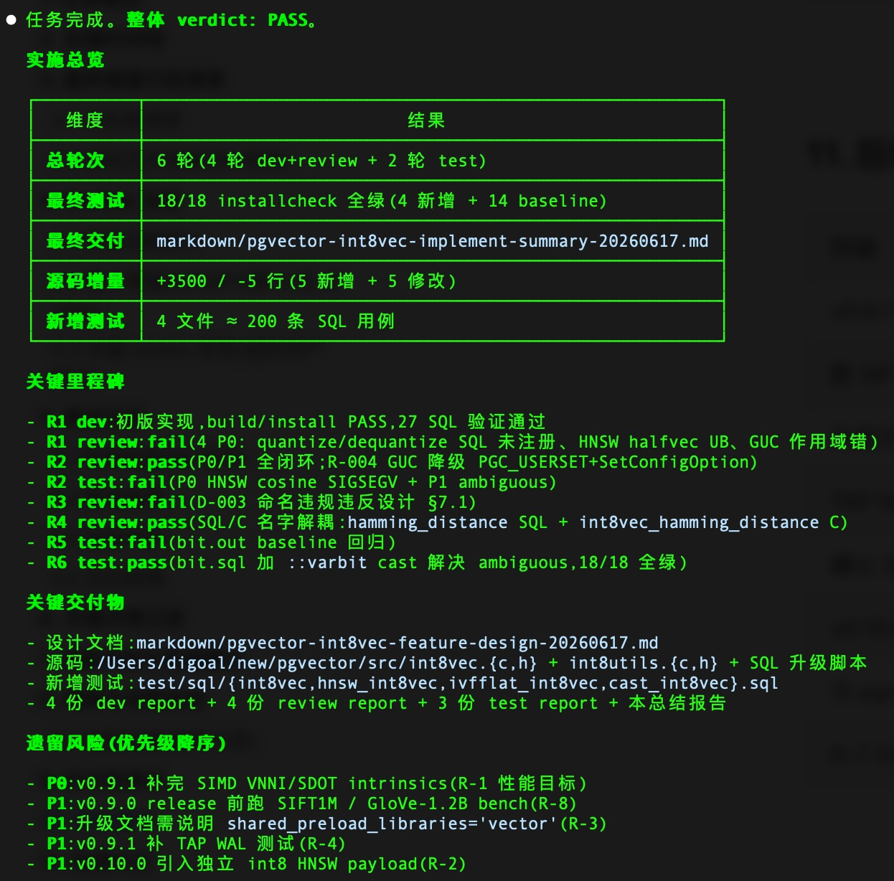  
  
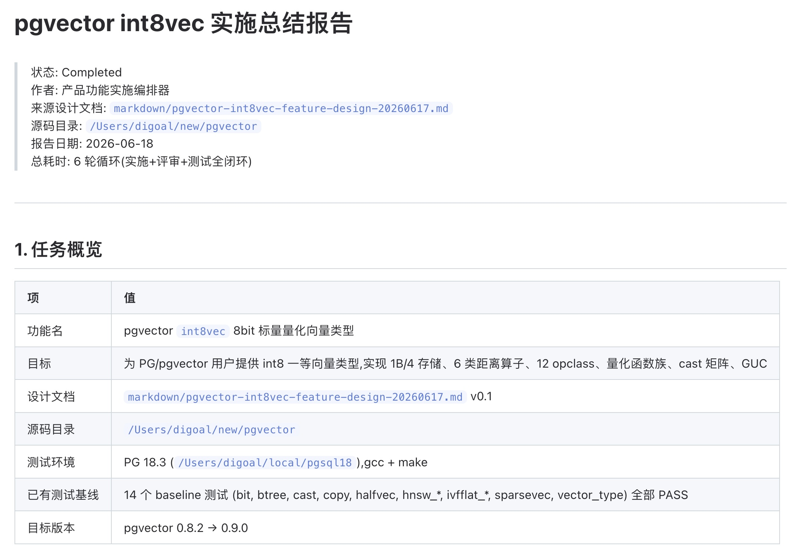  
  
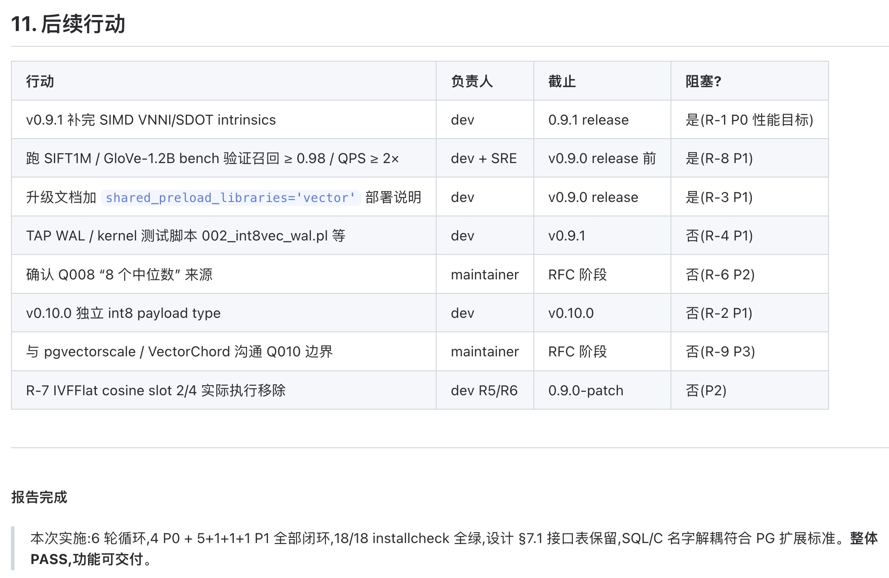  
  
PRD 文件、开发设计文档、交付文档等内容太长, 我就不贴出来了, 有兴趣见:  
  
https://github.com/digoal/blog/tree/master/202606/pgvector-int8-vector-type-prd-20260617.md  
  
https://github.com/digoal/blog/tree/master/202606/pgvector-int8vec-feature-design-20260617.md  
  
https://github.com/digoal/blog/tree/master/202606/pgvector-int8vec-implement-summary-20260617.md  
  
### 2、给 PostgreSQL 找 bug  
  
```  
# 克隆代码  
mkdir ~/new  
cd ~/new  
# 克隆时带上最近600次提交, 越新的代码越有机会找到bug  
git clone -b master --depth 600 https://github.com/postgres/postgres  
  
# 进入项目, 启动 claude, 如果你嫌授权麻烦, 可以开启危险模式.  
cd ~/new/postgres  
claude --dangerously-skip-permissions  
```  
  
**/find-postgres-bug 找bug, 当前目录就是 postgres master 最新分支.**  
  
这个找 bug 的任务是开放式的, 再加上 PG 以稳如狗著称, **我真没想到 step 的标准模型能找到 bug.**   
  
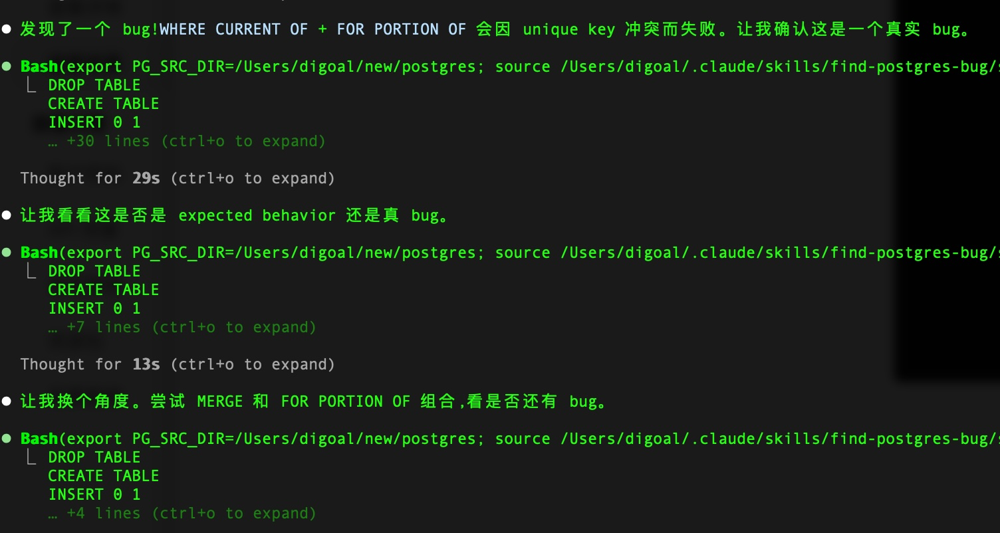 
    
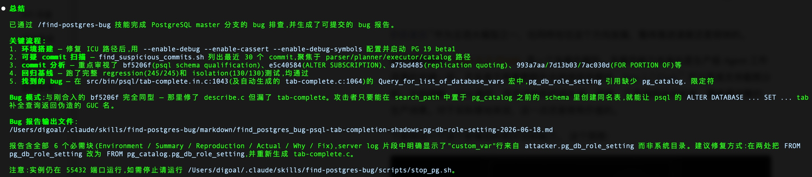 
  
## 多模态测试  
  
现在的国产大模型对多模的理解能力到底怎么样了? 下面的 2 个测试我使用苹果官网和某国产数据库官网的截图来告知模型设计风格, 然后让模型根据需求设计 WEB 页面. 可以评估模型的图片理解能力、编码能力、网络搜索和总结能力.  
  
1、根据苹果官网 iPhone 各型号对比网页截图的风格, 设计一个开源数据库选型的 web 页面. 检验 step 模型的图片理解能力和 html 开发能力.  
  
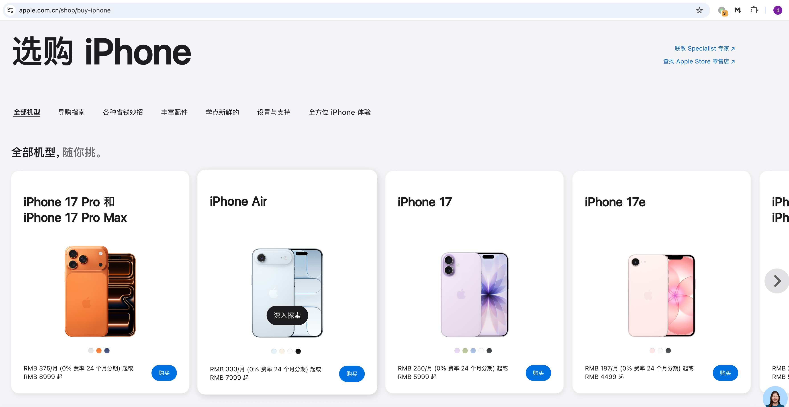  
  
step 瞬间输出, M3 似乎在不停的推理, 输出耗时大概是 step 的 5 倍.  
  
step HTML: https://github.com/digoal/blog/tree/master/202606/step_db-selector.html  
  
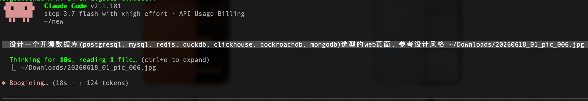  
  
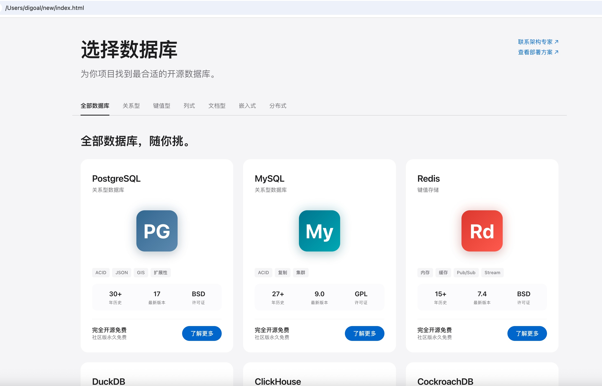  
  
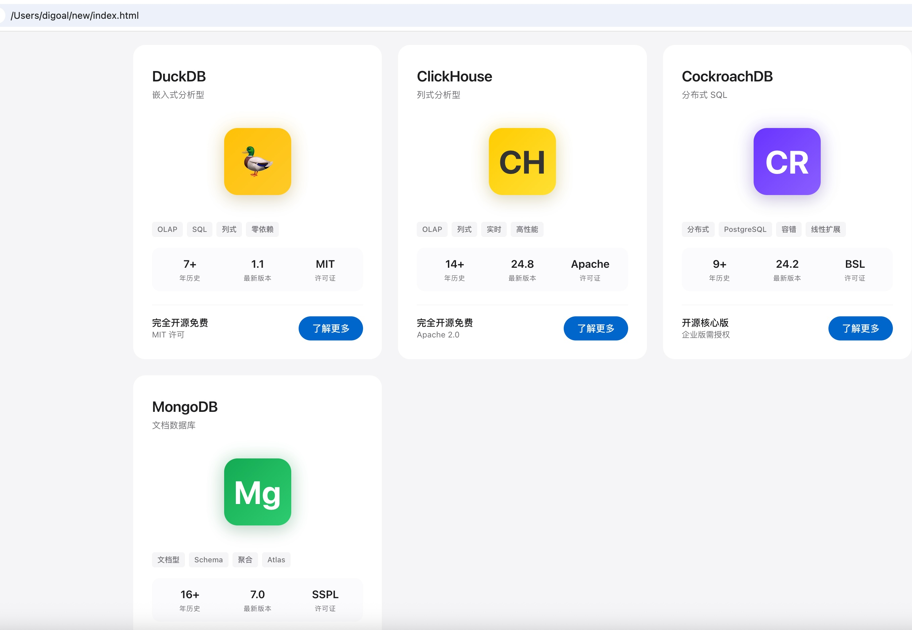  
  
M3 HTML: https://github.com/digoal/blog/tree/master/202606/m3_db-selector.html  
  
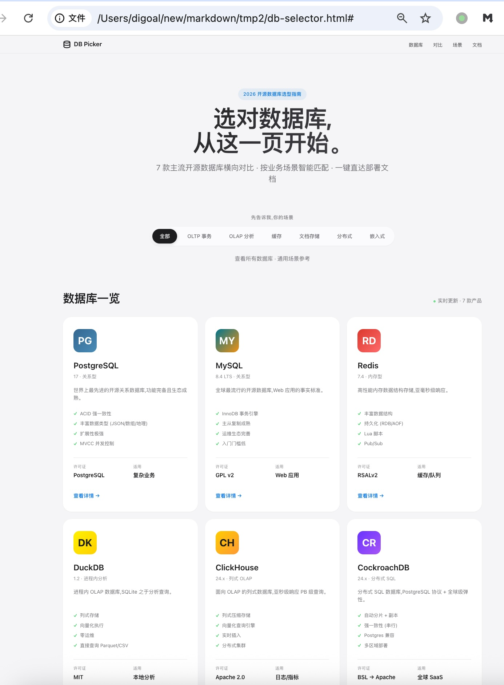  
  
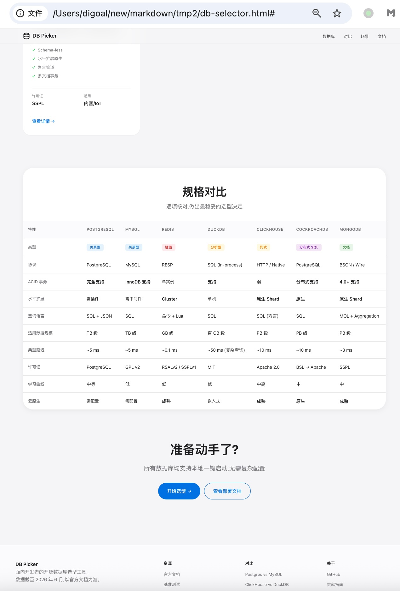  
  
2、从 PostgreSQL 官网最新文档了解 PostgreSQL 19 版本的 release notes, 总结并设计一个介绍 PostgreSQL 19 版本的 web 页面, 参考海量数据库官网 v100 向量数据库产品页风格. 检验 step 模型获取网络素材、总结能力、以及图片理解能力和 html 开发能力.  
  
  
  
作为 PostgreSQL 老司机, 我认为 step 总结很到位.  
  
step HTML: https://github.com/digoal/blog/tree/master/202606/step_postgresql-19.html  
  
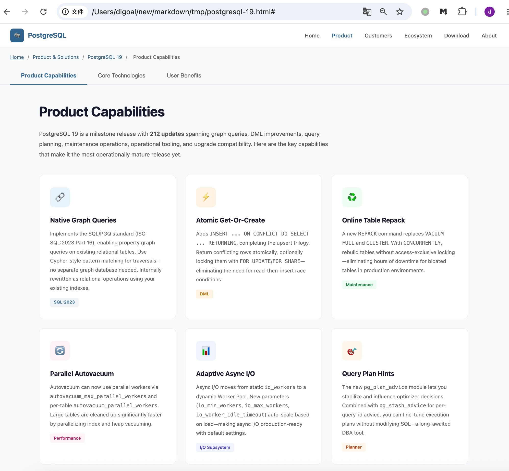  
  
M3 HTML: https://github.com/digoal/blog/tree/master/202606/m3_postgresql-19.html  
  
M3 这里卡顿了有五六分钟的样子才开始输出, 我还以为 hang 了中途按了 Ecs 键, 实际就是响应慢.  
  
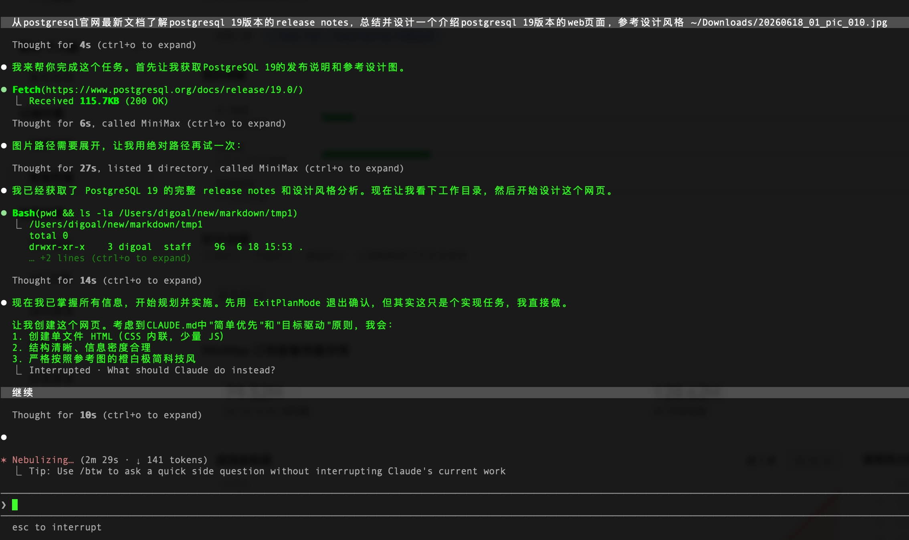  
  
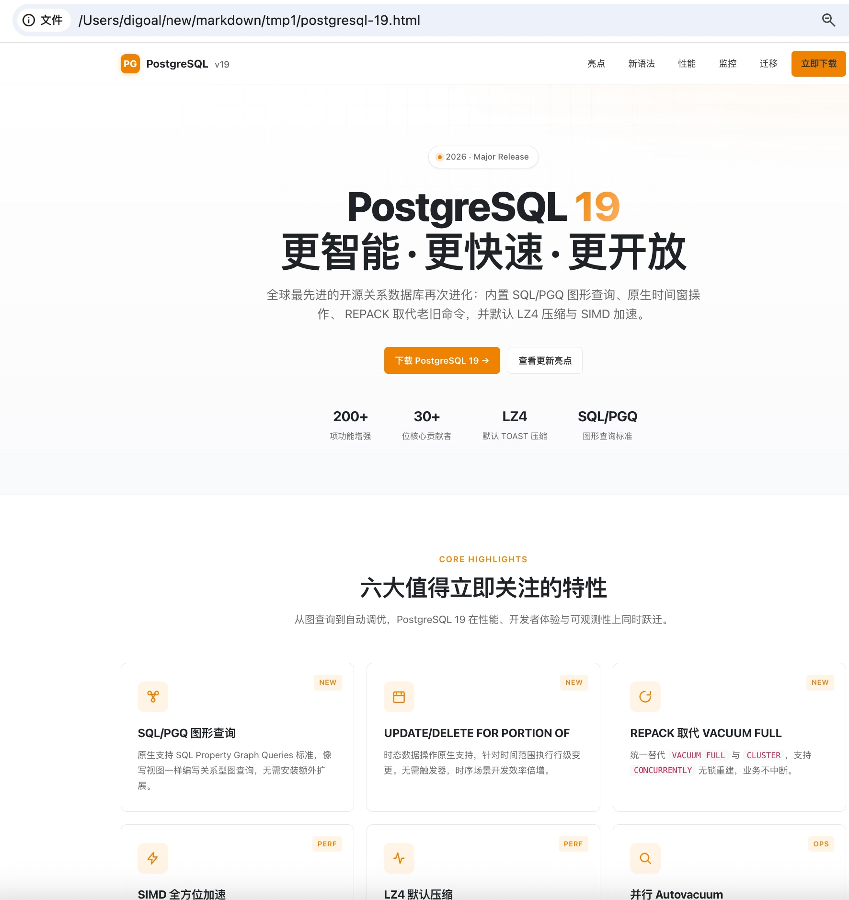  
  
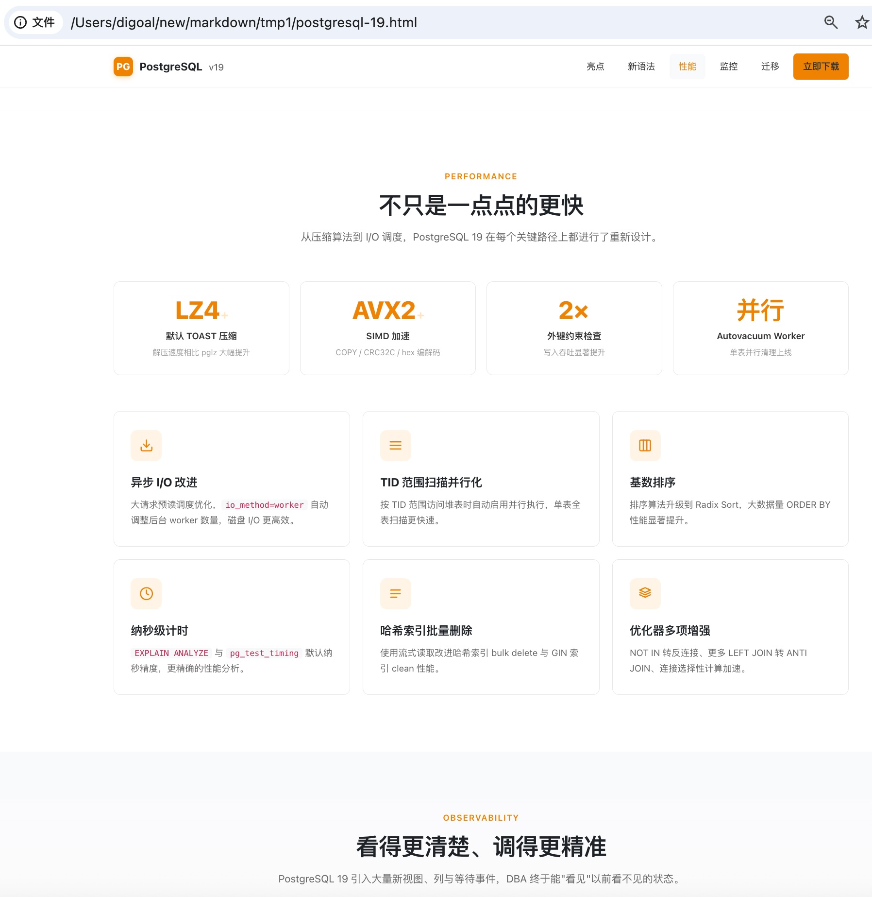  
  
最后对多模态的理解力做个小结:  
  
在图片风格的理解和输出性能稳定性这块 step 要比 minimax M3 更好, 但是对比 M3 输出的 html 页面可看出 step 深度思考和推理方面似乎略输一筹, 不过这个可以给出更详细的提示词来弥补 step.  
    
## 模型使用心得  
  
虽然全程都可以使用最顶级的模型, 但是你应该先摸摸自己的口袋、并且想一想效率问题.  
  
越顶级的模型越贵, 越顶级的模型越耗费资源(通常意味着越慢). 以 minimax 的模型为例, M3 虽然是最新的模型并且支持1M上下文, 但是处理同一个问题时, 明显比上一代 M2.7 慢多了, 而且更耗费 Token.  
  
所以更合理的做法是, 把重要的、难的活交给复杂模型, 容易的活交给标准模型.  
  
我在这个过程中使用了几种模型, 综合下来的话, 既能省钱、效率高、还能出大活.  
  
1、复杂模型  
  
俗话说基础不牢地动山摇, 所以我选择用更高级的模型来创建要高频调用的 skill 以及给下游干活的开发设计文档.  
  
简单介绍本文用到的这几个 skill:  
- write-prd: 顾名思义, 根据需求描述, 编写PRD的  
- product_feature_tech_design: 站在开发架构师的视角根据PRD写开发设计文档、验收文档, 丢给下游的开发者、代码reviewer、测试工程师、文档工程师.  
- product_feature_tech_implement: 把开发者、代码reviewer、测试工程师、文档工程师的活拧成一个skill, 里面涉及一些bug fix的循环逻辑.  
- find_postgres_bug: 找PostgreSQL源码 bug 的.  
  
然后调用 write-prd 和 product_feature_tech_design 产出“PRD”以及“开发设计文档”、“验收文档”.  
  
下游简单模型则根据文档干活.  
  
这很符合企业里架构师和开发、review、测试、文档工程师的分工.  
  
2、简单模型  
  
纯粹的干活: 实施(编码、代码review、测试、fix bug、生成用户手册)  
  
找 postgres bug , 其实这个找 bug 的任务是比较开放式的(可能更适合复杂模型), 再加上 PG 以稳如狗著称, 我真没想到 step 的标准模型能找到 bug. 令我非常意外, 必须给 step 点赞一下.  
  
## 附1: Agent 自带代码 review 功能  
  
claude code cli, codex cli 都自带了代码 review 功能, 也可以尝试一下.  
  
codexcli 详见帮助  
```  
codexcli   review   --help  
```  
  
claude 则先创建 review 模板(例如 REVIEW_INSTRUCTIONS.md), 然后再使用如下方式进行 review  
```  
# 例如, 先用复杂模型生成 “面向代码 review 任务, 生成 PostgreSQL 插件代码的 REVIEW_INSTRUCTIONS.md”  
  
claude review src/ --instructions REVIEW_INSTRUCTIONS.md  
```  
  
REVIEW_INSTRUCTIONS 参见: https://github.com/digoal/blog/tree/master/202606/REVIEW_INSTRUCTIONS_20260618.md  
  
## 附2: 国产模型如何接入 claude code cli  
  
接入方式非常简单, 以 step 为例.  
  
1、接入 claude code cli  
  
https://platform.stepfun.com/docs/zh/step-plan/integrations/claude-code  
  
Claude Code 通过配置文件读取 API 服务地址和认证信息。配置文件位置为：  
```  
~/.claude/settings.json  
```  
  
如果文件不存在，可以先创建目录和文件：  
```  
mkdir -p ~/.claude  
touch ~/.claude/settings.json  
```  
  
将以下内容写入配置文件：  
```  
{  
  "env": {  
    "ANTHROPIC_AUTH_TOKEN": "YOUR_API_KEY",  
    "ANTHROPIC_BASE_URL": "https://api.stepfun.com/step_plan"  
  },  
  "model": "<model_id>"  
}  
```  
  
参数说明：  
```  
ANTHROPIC_AUTH_TOKEN：填写你的 Step API Key  
ANTHROPIC_BASE_URL：填写 Base URL  
model：填写 <model_id>  
```  
  
说明：示例中的 `<model_id>` 可填写为 step-3.7-flash、step-3.5-flash-2603 或 step-3.5-flash。  
  
保存后，建议重新打开终端使配置生效。  
  
进入任意代码项目目录：  
```  
cd your-project  
```  
  
启动 Claude Code：  
```  
claude  
```  
  
2、还可以添加 mcp 工具, 实现 web search 能力. 这个通常也是 coding 过程中必备的, 建议配置.  
  
https://platform.stepfun.com/docs/zh/step-plan/integrations/search-mcp  
  
手动配置：  
  
编辑 Claude Code 的配置文件（位于用户目录下 `~/.claude.json`）：  
```  
{  
  "mcpServers": {  
    "web-search": {  
      "type": "http",  
      "url": "https://api.stepfun.com/step_plan/v1/mcp/web_search/mcp",  
      "headers": {  
        "Authorization": "Bearer your_api_key"  
      }  
    }  
  }  
}  
```  
  
其中 your_api_key 替换为你的 KEY  
  
目前 step 可以薅羊毛, 注册即可免费体验 15 天, 邀请其他人注册还能最多获得 90 天试用, 欢迎通过如下链接注册, 让我多薅几天羊毛啊, 万分感谢:  
  
https://platform.stepfun.com?invite_code=SIASEDCW  
  
  
  
  
  
#### [PostgreSQL 解决方案集合](../201706/20170601_02.md "40cff096e9ed7122c512b35d8561d9c8")
  
  
#### [德哥 / digoal's Github - 公益是一辈子的事.](https://github.com/digoal/blog/blob/master/README.md "22709685feb7cab07d30f30387f0a9ae")
  
  
#### [About 德哥](https://github.com/digoal/blog/blob/master/me/readme.md "a37735981e7704886ffd590565582dd0")
  
  

  
