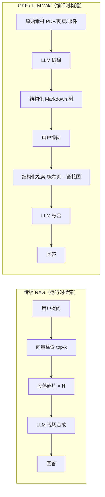
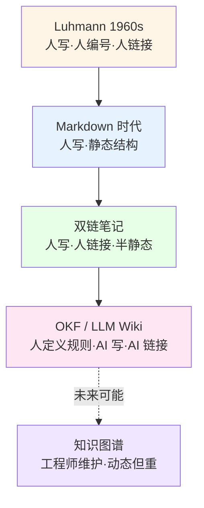

## AI 时代的文档新标准: OKF(开放知识格式) 
  
### 作者  
digoal  
  
### 日期  
2026-06-18  
  
### 标签  
AI , 知识库 , markdown , 双链接 , RAG , 图 , 碎片 , 召回 , 知识碎片 , 效率低 , OKF , 开放知识格式
  
----  
  
## 背景  
这么说吧, OKF 就是我想要的, 知识的整理, Agent 在使用过程中信息的整理. 也就是我在这篇文档中提到的: [《德说-第488期, 不会自我进化的数据库都将被淘汰》](../202606/20260616_01.md)  
  
OKF 这个格式的诞生，直接受到了 Andrej Karpathy 提出的 “LLM Wiki”（大语言模型维基） 概念的启发. 

Karpathy的理念：他在2026年4月提出，可以让AI大模型（LLM）在完成任务的过程中，自动维护一个结构化的、由Markdown文件构成的“维基百科”作为“草稿本”。这个知识库可以不断更新和积累，供模型自己或其它模型在未来的任务中直接调用，从而避免每次都要重新检索和推理，大大提高效.  

OKF v0.1 的核心规则其实很短：把你所有的知识（指标、表格、API、剧本、流程、系统、想法） **每个东西写一个 Markdown 文件**，文件开头用 YAML 写明它是什么（`type: Metric` 之类），文件之间用相对路径互相链接，引用要用编号格式指向原始来源。

翻译成人话就是： **把企业里散落的知识，从"Word 在共享盘 / Confluence 在 wiki / 表在 Excel"统统换成"一堆互相链接的 Markdown 文件，托管在 Git 仓库里"** 。

这件事的本质不是"格式升级"，而是**让 AI Agent 能像 GitHub 读代码一样读你公司的知识**。每一份 Markdown 都有结构化元数据、有明确的链接关系、有引用来源，AI 拿过去就能直接用，不用再做一堆"清洗、切片、嵌入、检索"的体力活。

我看到这里的时候，第一反应是： **这不就是把 1995 年"Linus 用文本文件和链接管理整个 Linux 内核源码"的思路，平移到企业知识上吗？** 是的，你没听错，就是回到"一切都是文本文件 + 链接"的朴素年代。但这一次让 AI 当工人，替人类维护这些链接。

  

## 从一个被 RAG 坑过的工程师说起

我有个朋友，过去两年给 5 家中型企业部署过 RAG 系统，踩过的最大一次坑是某律所 200GB 法律文档上线后准确率从 70% 跌到 35%。最后查出来是合同段落切碎后，术语链断裂了——合同里"见 §3.2"这种互引关系被向量检索全切散了。

他看到 OKF 的反应是：" **这不就是把运行时检索的活儿，前移到维护期干吗？** "

传统 RAG 的流程是：你问问题时，系统把文档切片、嵌入向量库、检索 top-k 段落、塞给大模型合成回答。每次都要重跑一遍，而且喂给模型的永远是碎片。

OKF 的思路反过来：原始素材入库的时候就让大模型消化、重写、合并成一个互相链接的 Markdown 树，运行时只剩"导航 + 摘录"。

关键差异在中间的"编译步骤"从运行时挪到了维护期。这位工程师的判断是：RAG 优化派相信"运行时能算清楚"，OKF 派认为"运行时算不清楚，必须预先消化"。 **这两派对未来的赌注完全不同**。

但他同时提醒我三个前提条件 —— 
  
第一，LLM 维护 Markdown 树的质量必须稳定可靠。Karpathy 那个 Gist 是 5000 个 Star 的个人级方案，企业是几百万份文档，量级差太多。
  
第二，企业愿意把知识资产放回 Git 仓库，这涉及权限、审计、合规、备份、离职交接的全套治理重写，对习惯了"上传到 Confluence 完事"的组织是巨大迁移成本。
  
第三，超大规模（>10 万文档）的可扩展性，Karpathy 没给企业级的证据。

如果这三个条件都不成立，OKF 在企业内部会崩。但反过来说——他经手过的那 5 家企业里，至少有 2 家（产品手册密集、政策更新频繁的制造业）的痛点，确实就是 RAG 跑不准。OKF 思路在那两家是值得试的。

 

## 从一个卡片盒老玩家的哲学视角看 OKF

另一个朋友用 Niklas Luhmann 的卡片盒笔记法管了 1.2 万张卡片 8 年。他读完 Karpathy 那个 Gist 后沉默了很久，跟我说了一句挺重的话：" **Luhmann 一辈子写了 9 万张卡片，最后 30 年的 70 多本书几乎都能在卡片盒里找到种子——他每写一张新卡片，必须先重读相邻卡片，再决定编号。'手动编号'这个动作本身就是思考过程。OKF 把'写卡片'和'决定关系'全部外包给 AI，到底是解放了我们，还是剥夺了我们思考时那种把思想压进卡片的认知动作？** "

这是更深一层的问题。Markdown 适合装"陈述性知识"（事实、定义、流程），但装不下"过程性知识"（经验、直觉、判断）——后者天然是模糊的、矛盾的、依赖语境的。如果 OKF 只能装前者，它就只是 Confluence 的 Markdown 替代品，不是革命。

但他也承认一个事实：双链笔记（Roam、Obsidian）用户平均坚持 6 个月后就放弃了"主动维护链接"的行为，转为纯 Markdown 笔记。这说明**手动维护链接在规模化后真的不可持续**。OKF 让 AI 工人接管这件事，至少在"链接维护"这个痛点上是对的。

他的结论是——**对独立知识工作者最值得**（你终于可以把时间花在"决定卡片之间的关系策略"上，而不是机械维护），**对纯哲学/人文研究者警惕**（可能让你丧失"边写边想"的深度认知训练）。OKF 解放的，是那些**写作时不需要"写卡片"这个认知动作**的人。

OKF 不是"新的革命"，而是 **"LLM 工人接管链接维护后的双链笔记"** —— 这件事 Karpathy 4 月份那个 Gist 已经说清楚了，OKF v0.1 是把它工程化、规范化。 
  
  
#### [PostgreSQL 解决方案集合](../201706/20170601_02.md "40cff096e9ed7122c512b35d8561d9c8")
  
  
#### [德哥 / digoal's Github - 公益是一辈子的事.](https://github.com/digoal/blog/blob/master/README.md "22709685feb7cab07d30f30387f0a9ae")
  
  
#### [About 德哥](https://github.com/digoal/blog/blob/master/me/readme.md "a37735981e7704886ffd590565582dd0")
  
  

  
