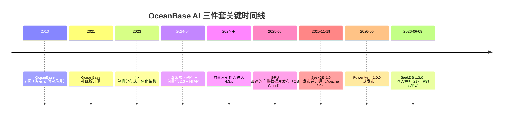
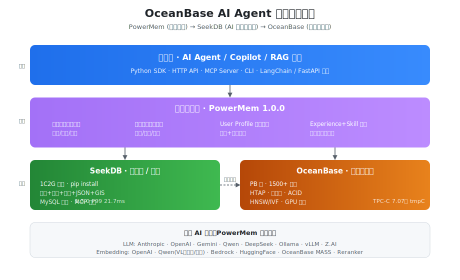
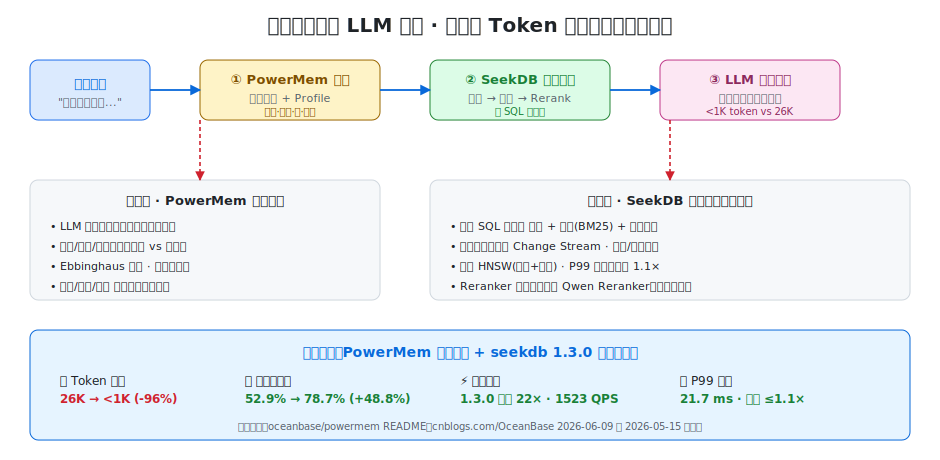

## OceanBase 在下一盘大棋
  
### 作者  
digoal  
  
### 日期  
2026-06-18  
  
### 标签  
AI , Agent , 记忆 , RAG , memory , 数据整理 , 生成时整理 , PowerMem , SeekDB , OceanBase  
  
----  
  
## 背景  
AI 时代, 入口争夺已经成了红海, 有 Claude, Codex 以及各家模型厂商提供的自家 Agent, 虽然大多数人可能会直接使用 Claude, Codex 配置第三方模型. 

其实高价值的还是企业市场, 所以我在 [《德说-第489期, 分析了为什么马斯克瞄准了Cursor的母公司?》](../202606/20260617_01.md)  

另外企业市场未来关心的可能会是多 Agent 的编排管理, 所以 pingcap 推出了 Loop.

再往后, 争的可能就是 Agent 的记忆了.  
  
这就是 OceanBase 正在用“PowerMem + SeekDB + OceanBase”面向 AI Agent "记忆 + RAG + 省 token + 提精度"提供的整体解决方案.  
  
而且最好是能做从模型到 Agent 到编排再到记忆一整套的解决方案, 这样护城河会更深, 谁掌握入口, 谁就掌握了话语权, 谁就有可能架空其他, 目前来看最大的变数还是在 claude/codex 这类 Agent 厂商, 它们到底会不会内化这些能力.   
  
## TL;DR

- **一句话定位**：OceanBase 正在用「PowerMem（智能记忆）+ SeekDB（AI 原生混合搜索数据库）+ OceanBase 分布式集群」三件套，构建一个**从笔记本到 PB 集群一致演进**的 AI Agent 数据底座，对标 mem0 + 向量库 + 关系库的"碎片化拼接"方案。
- **决策者结论**：**建议在新建 AI Agent / RAG 项目中纳入 PoC**。Apache 2.0 全栈开源、单技术栈贯穿三种规模、官方基准 token -96% / 召回 +48.8%，是它目前最强的差异化。
- **使用者结论**：**上手难度低**——`pip install pyseekdb` 三行代码出原型；切换到分布式只改连接串。 
- **总评分**：⭐⭐⭐⭐ / ⭐⭐⭐⭐⭐ 

  

## 一、产品概览

### 1.1 基本信息

| | PowerMem | SeekDB | OceanBase |
|---|---|---|---|
| 厂商 | 蚂蚁集团 / OceanBase 开源 | 蚂蚁集团 / OceanBase 开源 | 蚂蚁集团 / OceanBase（已独立运营公司） |
| 协议 | Apache 2.0 | Apache 2.0 | Apache 2.0（社区版） + 商业版 |
| 当前版本 | 1.0.0（2026-05） | 1.3.0（2026-06-09） | 4.3.x（4.3.3 文档为主） |
| 定位 | AI Agent 智能记忆层 | AI 原生混合搜索数据库 | 分布式 HTAP 一体化数据库 |
| 部署 | Python SDK / HTTP / MCP / CLI | 嵌入式 / 单机 / 集群子节点 | 分布式集群（最低 3 节点） |
| 资源门槛 | 跟随存储后端 | **最低 1C2G**，pip install | 单节点建议 16C64G 起 |
| 目标用户 | AI Agent / Copilot 开发者 | AI 应用开发者、个人/中小企业 | 金融/电信/政企/大规模 SaaS |
| MySQL 兼容 | — | ✅ | ✅ |

### 1.2 关键时间线



### 1.3 三件套核心分工



**核心定位（一句话版）**：

- **PowerMem** 解决"Agent 怎么记住、怎么忘、怎么调出来"——**业务智能层**
- **SeekDB** 解决"一条 SQL 把向量+全文+结构化数据查完"——**AI 原生存储层**
- **OceanBase 分布式** 解决"上规模后怎么稳、怎么扩、怎么混合 TP/AP/AI"——**生产级数据基础设施**

**它们不解决什么（划清边界，避免误用）**：

- ❌ PowerMem 不是 Agent 编排框架，不替代 LangGraph / AutoGen / OpenClaw
- ❌ SeekDB 不是 cross-encoder Reranker，不替代 BGE-Reranker / Cohere Rerank
- ❌ OceanBase 不是消息队列、不是对象存储，**也不是替代 Postgres 的轻量 OLTP**

 

## 二、评测维度详解

按"AI Agent 解决方案"场景选 6 个真正影响决策的维度：

> 1. **记忆生命周期能力**（决策者关心 ROI / 使用者关心日常体验）
> 2. **检索精度与召回质量**（决策者关心业务效果 / 使用者关心可调性）
> 3. **省 LLM Token 的真实效果**
> 4. **性能与规模弹性**
> 5. **生态与集成**
> 6. **成本与运维门槛**

### 2.1 记忆生命周期能力（评分：⭐⭐⭐⭐⭐）

PowerMem 是这一维度的**主角**。它把 AI Agent 的记忆当作"有寿命的实体"管理：

| 能力 | 实现 | 是否同行罕见 |
|---|---|---|
| 抽取（Extract）| LLM 从对话中提炼关键事实，不存原文 | mem0 / Letta 都有 |
| 合并（Merge）| 与已有记忆冲突时由 LLM 判断更新/替换 | mem0 / Zep 有 |
| **艾宾浩斯衰减** | 5 个可配参数：初始保留度、衰减率、强化因子、3 个阈值（工作/短期/长期） | ✅ **PowerMem 是少数把心理学曲线直接做成配置的产品** |
| **User Profile 双轨** | 事件记忆 + 自动提取的用户画像，分库存储 | ✅ PowerMem 独有的工程化设计 |
| **Experience + Skill 蒸馏** | 不只记事实，还从交互中学"可复用工作流" | ✅ 自进化双层记忆，行业新趋势 |
| 多智能体共享 | Multi-Agent Memory 子库路由策略 | mem0 部分有 |
| 多模态 | 通过 Qwen-VL embedding 支持图像 | mem0 / Zep 有 |

> **使用者视角**：5 个遗忘曲线参数对新手不友好（不知道该调到多少），但官方给了默认值，开箱可用。
>
> **决策者视角**：把"自适应记忆"做成一个可参数化的服务而非黑盒，对后续调优、合规审计、AB 测试都有利。

### 2.2 检索精度与召回质量（评分：⭐⭐⭐⭐⭐）

这里是 **SeekDB + PowerMem 协同发挥**的地方。



**SeekDB 的混合搜索机制**：
- 单条 SQL 同时融合向量检索 + 全文（BM25）+ 标量过滤
- "粗排 + 精排"多阶段检索，先用向量召回候选，再用全文/标量加权
- 异步索引流水线（Change Stream），写入与索引构建解耦
- 两级 HNSW（增量 + 快照），查询路径始终只访问两个索引

**PowerMem 在 SeekDB 之上的增强**：
- 四路融合：向量 / 全文 / 知识图谱 / 时效性
- 在记忆系统层做 Reranker（Qwen Reranker / Cohere / Voyage / 自定义）
- 召回时可选附带 User Profile，把"用户偏好"作为隐式约束

**官方公开的精度数据**（来源：[PowerMem 1.0.0 发布稿](https://www.cnblogs.com/OceanBase/p/20051977)）：

| 指标 | PowerMem | 全量上下文（26K token）| 提升 |
|---|---|---|---|
| 召回准确率 | **78.70%** | 52.9% | **+48.77%** |
| p95 延迟 | 未列出但显著低于全量 | — | — |

> ⚠️ 注：上述对比的"全量上下文"是 baseline，不是与 mem0 / Letta 的直接对比。**我没有找到 PowerMem 在 LoCoMo 等独立基准上的成绩**，所以"是否领先 mem0"尚无独立验证。但即使保守看，相对于"裸塞上下文"的提升是真实可信的。

### 2.3 省 LLM Token 的真实效果（评分：⭐⭐⭐⭐⭐）

这是最容易量化的维度，PowerMem 给出了具体数字：

```
裸塞上下文： 26,000 tokens / 次 (52.9% 准确率)
PowerMem ： < 1,000 tokens / 次 (78.7% 准确率)
节省       : 96%+
准确率提升 : 25.8 个百分点
```

**翻译成钱**（以 Claude Sonnet 4.6 input $3 / MTok 为例，1000 次对话）：

| 方案 | Token 消耗 | 成本 |
|---|---|---|
| 裸塞上下文 | 2600 万 | $78 |
| PowerMem | 100 万 | **$3** |

也就是说，**对话量 1000 次时，PowerMem 把 LLM 调用成本砍到约 1/26**，且回答更准。规模越大，这个收益越明显。

> 使用者视角：写代码时除了 `memory.add()` 和 `memory.search()` 之外几乎无感，省的钱是"自动到账"。

### 2.4 性能与规模弹性（评分：⭐⭐⭐⭐⭐）

OceanBase 三件套的最大杀招——**同一套技术栈贯穿三种规模**：

| 规模阶段 | 部署形态 | 性能基线 | 切换成本 |
|---|---|---|---|
| 个人 / Demo | SeekDB 嵌入式（pip install） | 单进程内 ms 级 | 0 |
| 中小生产 | SeekDB 单机 | 1523 QPS 流式写+搜，P99 **21.7 ms** | 改连接串 |
| 大规模生产 | OceanBase 分布式 | PB 级 / 1500+ 节点 / TPC-C 7.07 亿 tmpC | 改连接串 + 集群部署 |

**SeekDB 1.3.0 的关键性能数据**（2026-06-09 发布，来源：[ilongda.com](http://www.ilongda.com/)）：

- 流式场景写入吞吐 **提升 22×**（vs 1.2.x）
- 并发 P99 抖动 **仅 1.1 倍**（Milvus 和 Elasticsearch 约 10 倍）
- 引入 Fork/Diff & Merge 向量列能力
- 基于 Change Stream 的异步索引模型，写入/索引构建解耦

> **决策者视角**：从原型到 PB 级**不换技术栈**——这是 mem0 + Pinecone + Postgres 的"组合方案"无法提供的，迁移成本是真痛点。
>
> **使用者视角**：本地开发用嵌入式，无需起 Docker；上线只改环境变量；P99 抖动小意味着稳定的用户体验。

### 2.5 生态与集成（评分：⭐⭐⭐⭐）

**已具备**：
- MySQL 协议兼容（mysqld / 各种 client / ORM 直接可用）
- LangChain 集成（PowerMem 有专门的 LangChain wrapper）
- MCP Server（PowerMem 和 SeekDB 都内置，可作为 Claude / Cursor 工具）
- FastAPI 集成模式
- HuggingFace、LangChain 等 30+ AI 框架兼容（SeekDB 官方）

**LLM/Embedding Provider 数量**（PowerMem）：

- **LLM**：Anthropic / OpenAI / Azure OpenAI / Gemini / Qwen / DeepSeek / Ollama / vLLM / SiliconFlow / Z.AI / LangChain wrapper（**11 家**）
- **Embedding**：OpenAI / Azure OpenAI / Qwen（含 VL 多模态/稀疏向量）/ Gemini / Vertex AI / AWS Bedrock / Ollama / LM Studio / HuggingFace / Together / SiliconFlow / Z.AI / OceanBase MASS / LangChain wrapper（**14 家**）
- **Reranker**：Qwen / 各家可插拔

**还欠缺的**：
- ❌ LlamaIndex 没有看到一等公民集成
- ❌ Haystack、Spring AI、Vercel AI SDK 集成空白
- ❌ 英文社区影响力远低于 mem0、Letta（GitHub Star 落后明显）
- ⚠️ 商业 SaaS 形态尚不清晰（mem0 已有托管服务）

### 2.6 成本与运维门槛（评分：⭐⭐⭐⭐）

**SeekDB 嵌入式 / 单机**：
- 资源：最低 1C2G，开发机笔记本毫无压力
- 部署：`pip install pyseekdb` 一键安装；Docker 也支持
- 运维：基本无运维（嵌入式就是个库）

**OceanBase 分布式**：
- 资源：单节点 16C64G 起，建议 3 副本，**起步成本不低**
- 部署：OAT / OBD 工具链已成熟
- 运维：有专门 DBA 团队最好；OB Cloud（公有云托管）可绕过

**与典型组合方案的 TCO 对比**（粗略估算，3 节点中等规模）：

| 方案 | 软件成本 | 运维复杂度 | 数据一致性风险 |
|---|---|---|---|
| **PowerMem + SeekDB + OB** | 0（开源） | 中 | 低（一栈到底） |
| mem0 + Pinecone + Postgres | Pinecone 订阅费 + 自运维 PG | 高（3 个系统） | 中（跨系统同步） |
| LangMem + Milvus + MySQL | 0 | 高 | 中 |
| Zep（云版）| 按量付费 | 低 | — |

 


## 三、决策者视角结论

### 3.1 业务价值

- **省钱**：官方数据 token -96%，按千万级 LLM 调用算，年度可节省 6-7 位数美金
- **提精度**：召回准确率 +25.8 个百分点，直接拉高用户满意度
- **降复杂度**：3 个开源项目替代 mem0 + Pinecone/Milvus + PG/MySQL 的拼装
- **战略价值**：把"AI 应用的数据底座"绑定到本土自主可控的 OceanBase 生态

### 3.2 ROI / 成本

- **零软件许可费**（Apache 2.0）
- **嵌入式起步无运维成本**——一个开发者一天能跑起来
- **分布式 OceanBase 需要 DBA**，但如果业务已经在用 OceanBase，等于复用既有团队

### 3.3 风险评估

| 风险类别 | 级别 | 说明 | 缓解措施 |
|---|---|---|---|
| 厂商绑定 | 🟡 中 | PowerMem 强依赖 OceanBase 系存储 | 数据本身仍是关系/向量，迁移可行但需开发量 |
| 产品成熟度 | 🟡 中 | PowerMem 才 1.0.0、SeekDB 才半年 | 先跑非关键业务 / PoC |
| 独立基准缺失 | 🟡 中 | 没有 LoCoMo 等第三方对比数据 | 自建 benchmark 验证 |
| 英文社区薄 | 🟢 低（对中国团队）/ 🔴 高（对海外）| 海外开发者贡献少 | 海外用户慎重 |
| 路线图变更 | 🟢 低 | OceanBase 已宣布 Data×AI 战略，方向稳定 | 关注每季度 release |

### 3.4 战略契合度

- **强契合**：国央企、金融、政企、信创类客户（本土开源 + 信通院认证 + 自主可控）
- **中等契合**：互联网公司新建 AI Agent / RAG 业务
- **弱契合**：已深度绑定 OpenAI 生态 + Pinecone 的海外创业公司

### 3.5 决策建议

> **建议：在 2 个月内启动 PoC，3-6 个月内做 1 个非核心业务试点**
>
> - **核心优势**：一栈到底（嵌入式→PB）+ 官方数据 token -96%、召回 +48.8% + 国产化合规
> - **核心风险**：产品成熟度尚在爬坡（PowerMem 1.0.0、SeekDB 半年龄）、独立基准成绩缺失
> - **关键决策点**：
>   - 是否能承诺向 OceanBase 技术栈集中？（决定要不要选）
>   - 是否需要海外社区支持？（如果是，先选 mem0）
>   - 团队是否已有 OceanBase 使用经验？（决定上手速度）
> - **推荐人群**：本土 AI Agent 团队、信创/金融客户、追求"一栈到底"的中型公司
> - **不推荐人群**：英语为主的开源团队、已深度集成 Pinecone+PG 且无替换动机的存量项目、对 mem0 生态有依赖的产品

 

## 四、使用者视角结论

### 4.1 上手体验

**上手难度：低**

```bash
# 30 秒跑起最小例子
pip install powermem
python -c "
from powermem import Memory, auto_config
mem = Memory(config=auto_config())
mem.add('用户喜欢喝咖啡', user_id='u1')
print(mem.search('用户偏好', user_id='u1'))
"
```

> 配置文件以 `.env` 文件加载，PowerMem 会自动检测嵌入式 seekdb 路径或远程 OB host。

### 4.2 日常效率

- **API 简洁度**：`memory.add()` / `memory.search()` / `memory.update()` 是核心三件套，与 mem0 API 风格接近，迁移成本低
- **故障调试**：内置 audit logging + telemetry，比 mem0 / Letta 完善
- **MCP 支持**：可以直接挂到 Claude Code / Cursor，让 IDE 拥有持久记忆
- **多模态**：Qwen-VL embedding 让"记忆图片"变成现实

### 4.3 故障与求助

- ✅ 中文文档完整（OceanBase 博客园、CSDN、SegmentFault 都有大量实战文）
- ⚠️ 英文 issue 响应略慢
- ✅ 官方 GitHub 团队活跃，1.0.0 后基本每月一次小版本
- ⚠️ Stack Overflow 标签生态尚未形成

### 4.4 推荐上手路径（3 步）

```
Step 1 (5 min) → pip install pyseekdb，跑通 README 三行代码
Step 2 (30 min) → pip install powermem，把 OpenAI/Qwen API key 填到 .env，跑 examples/
Step 3 (1 day) → 把 PowerMem 接入你的现有 Agent（替换原有 memory.add / search 调用）
                 用 PowerMem MCP Server 接到 Claude Code / Cursor，体验"IDE 记住一切"
进阶 (1 周) → 调艾宾浩斯参数，对比 token / 准确率；规模上来后切到 OceanBase 集群
```

 

## 五、实操指南（3 步出原型）

### 步骤 1：装 SeekDB 嵌入式（最快路径）

```bash
pip install pyseekdb

# 验证
python -c "
import pyseekdb
client = pyseekdb.PersistentClient(path='./mydb')
col = client.create_collection('demo')
col.add(documents=['今天天气真好','OceanBase 是分布式数据库'], ids=['1','2'])
print(col.query(query_texts=['天气'], n_results=1))
"
```

### 步骤 2：装 PowerMem，跑混合检索 + 自动遗忘

```bash
pip install powermem

# 准备 .env（最简）
cat > .env <<EOF
LLM_PROVIDER=openai
OPENAI_API_KEY=sk-...
EMBEDDING_PROVIDER=openai
# 不写 OCEANBASE_HOST 就用嵌入式 seekdb
OCEANBASE_PATH=./powermem_data
INTELLIGENT_MEMORY_ENABLED=true
EOF

python -c "
from powermem import Memory, auto_config
m = Memory(config=auto_config())
m.add('用户偏好喝拿铁，不加糖', user_id='alice')
m.add('用户讨厌香菜', user_id='alice')
m.add('用户老家是杭州', user_id='alice')
print(m.search('alice 的口味', user_id='alice'))
"
```

### 步骤 3：规模上来，切到 OceanBase 分布式（仅改环境变量）

```bash
# OceanBase 集群部署省略（用 OBD 一键拉起或 OB Cloud 托管）
# 改 .env 里两行即可
OCEANBASE_HOST=10.x.x.x
OCEANBASE_PORT=2881
# 业务代码不动
```

## 参考
记忆的生成时组织还可参考此文: [《AI 时代的文档新标准: OKF(开放知识格式)》](../202606/20260618_02.md)   
  
  
#### [PostgreSQL 解决方案集合](../201706/20170601_02.md "40cff096e9ed7122c512b35d8561d9c8")
  
  
#### [德哥 / digoal's Github - 公益是一辈子的事.](https://github.com/digoal/blog/blob/master/README.md "22709685feb7cab07d30f30387f0a9ae")
  
  
#### [About 德哥](https://github.com/digoal/blog/blob/master/me/readme.md "a37735981e7704886ffd590565582dd0")
  
  

  
