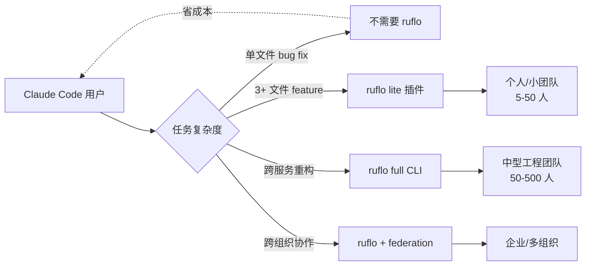
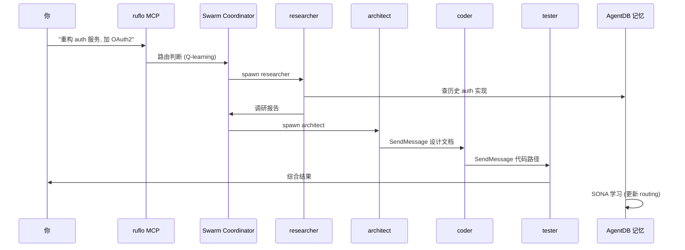

## Ruflo 深度拆解: 一份给 Claude Code 老用户的多视角分析

### 作者
digoal

### 日期
2026-06-18

### 标签
AI , Agent , Claude , 内化功能 , 多 Agent 上下文隔离 , 调度 , 架构师 , 开发者 , reviewer , 测试 , 文档工程师 , 分工合作 

----

## 背景

如果你以为 ruflo 是「又一个 AI 编程助手」, 那你一开局就理解错了。

ruflo 不写代码。它是给 Claude Code 这个「写代码的家伙」配的**调度中心**。你可以把它想象成: Claude Code 是一台高性能的独立显卡, 而 ruflo 是给这块显卡装上的「集群调度器 + 长期记忆 + 同事通讯」。显卡本身没变, 但你能用它干 10 倍规模的事情。

这种定位决定了 ruflo 不是和 Cursor、Aider、Cline 抢饭碗, 它是**寄生在 Claude Code 之上**, 用 MCP 协议把多个 Claude Code agent 串成流水线, 让它们像一支团队一样协作。

一旦接受这个前提, 后面所有问题都顺了: 它为什么有 314 个 MCP 工具 (因为它要在多个 agent 之间调度), 为什么强调 HNSW 向量记忆 (因为单 agent 上下文窗口是有限的), 为什么把 federation (联邦) 当成「Slack for agents」 (因为它要让跨机器的 agent 互相通信)。

如果某天 Anthropic 把这种调度能力内化到 Claude Code 主线, ruflo 的核心价值就会被掏空 — 这是它最大的、也是现在没法回避的风险。我把这事放在最后说, 因为先把产品本身讲清楚, 你才能判断「被掏空」之后还剩什么。

 

## 第一层: 它到底解决谁的什么问题

**如果你是 Claude Code 老用户, 一定撞过这堵墙**: 一个跨服务的功能改动, 你要让 Claude 先调研 a 服务的现状, 再看 b 服务的依赖, 再设计接口, 再写代码, 再写测试, 再 review。**单会话撑不住 20 万 token, 上下文到一半就开始丢东西**, 你不得不手工分段、复制粘贴、手动维护背景信息。干过这种事的人都知道, 这比不用 AI 还累。

ruflo 的第一刀, 切的就是这件事: 把一个超长的任务**拆成流水线**, 派给多个子 agent 各自处理一截, 它们之间用 SendMessage 互相传话, 用共享的 AgentDB 记忆库「记下来昨天说过什么」。听起来像微服务架构? 嗯, 思路确实像 — 你看架构图会发现, 它就是经典的「入口 → 路由 → 协调 → 执行 → 记忆 → 学习」六层, 跟互联网公司后端架构基本同构, 只不过这次每个节点是 LLM。

**它适合谁, 我画一张图给你看**:



换句话说, 你是个人学习者、单文件改几行的, 装 ruflo 是杀鸡用牛刀。你是 5 人以上团队、项目结构复杂、需要长期记忆的, ruflo 才是它的主战场。

 

## 第二层: 它有哪些真正的功能, 哪些是营销话术

ruflo 自己列了一长串「100+ agents、314 MCP tools、26 CLI commands」, 这种数字对新手来说**有误导性**: 装上之后你真的能用到的核心功能大概只有 5 个, 剩下 300 个是「namespace 下的子命令总和」, 不必一次学完。

我把它真正能用的功能, 按「价值高低」排个序:

**第一档 (用了回不去)**:
- **3-Tier Model Routing** — 这个是它真正省钱的机制, 也是和裸用 Claude Code 拉开差距的硬功夫。任务进来先扫一遍, 如果是纯结构变换 (var 改 const、加日志) 直接走 TypeScript 编译器, **$0 成本 + 1ms 响应**, 不碰 LLM。稍微复杂一点的扔给 Haiku (500ms, $0.0002), 再复杂的才上 Sonnet/Opus (2-5s, $0.003-0.015)。我看了下它的判断逻辑, 命中率并不高, **但凡是命中的就真省钱**, 这是它「Token 成本直降 75%」宣传的真正来源 — 注意, 前提是**你的任务里有大量 Tier 1 简单变换**, 全是 Tier 3 复杂任务的话, 节省主要来自「不重复读仓库」(HNSW 复用), 而非 codemod。

- **多 agent 流水线** — 这是产品定位本身。**真要用对, 你需要把单 agent 解决不了的任务拆成 architect → coder → tester → reviewer 这样的串行流水线**, 关键技巧是「在 spawn agent 的 prompt 里告诉它下一步要把结果发给谁」。这是整套机制的核心, 用错了 (比如让所有 agent 并行乱跑) 反而比单 agent 慢 3-5 倍。

**第二档 (锦上添花)**:
- **AgentDB + HNSW 向量记忆** — 让 agent 跨会话记住项目风格、过往 bug、术语表。**真正的杀手锏是「我不再需要在 prompt 里告诉 Claude 项目背景了」**。项目自测 N=20k 加速 ~1.9×, N=5k 加速 ~3.2-4.7×, 召回率 ~0.99。**注意**: 小数据集上 HNSW 会输给暴力检索, 这是 ANN 通病, 不是 bug。
- **12 个后台 worker** — audit、optimize、testgaps 之类的后台任务, 不占主对话 token, 自动触发。我自己观察是「少数场景惊艳, 多数场景噪音」, 建议先关掉大部分, 按需开启。

**第三档 (长期赌注, 短期不成熟)**:
- **Agent Federation (跨组织协作)** — 这是 ruflo 真正想做差异化的东西, 用 mTLS + ed25519 验身份, PII 脱敏 14 种类型, 给不同信任等级的 agent 配不同权限。**理论上很美, 实际公开案例还很少**。如果你的公司有跨组织合规需求 (HIPAA / SOC2), 这是真正能讲故事的卖点; 如果只是团队内部, 现阶段价值有限。

**营销话术需要打折看**:
- 「Claude 能力上限提升 2.5×」 — 没有第三方独立复现, 是项目方自述。
- 「21.6k stars」 — 真实数据 (HTML5 QQ 2026-03-19 + CSDN 2026-05-07 两源交叉), 但 stars 不等于活跃度, 关键看 commit 频率和 issue 关闭率。
- 「100+ specialized agents」 — 实际 60+ 是工程实用的, 剩下的是 demo 级别的。

 

## 第三层: 在 Claude Code CLI 里的详细实操

这一节是给真想动手的人。**先记一个原则**: 不要直接装 full 模式, 先用 lite 试水 5 分钟, 再升级。ruflo 是个「重配置」系统, 一上来就 `init` 容易劝退。

### Step 1: 试水 (5 分钟, 无副作用)

```bash
# 在 Claude Code 会话里
/plugin marketplace add ruvnet/ruflo
/plugin install ruflo-core@ruflo
/plugin install ruflo-swarm@ruflo
/plugin install ruflo-rag-memory@ruflo
```

装完你会发现多了几个 slash command: `/swarm:status`、`/memory:search` 之类。**先跑 `/swarm:status` 感受一下**。这个模式下 MCP 没注册, 工具调用不了, 但你能看到「swarm」是个什么概念。

### Step 2: 升级 (5-10 分钟, 需要 daemon + MCP)

```bash
# 在终端 (PowerShell / Git-Bash / 任何 shell)
npx ruflo@latest init wizard
# 按提示走完, 它会问你装哪些插件、要不要 daemon 等

# 启动后台服务 - 这是所有命令的前置条件
npx ruflo@latest daemon start
npx ruflo@latest doctor    # 健康检查, 出问题先看这里

# 把 MCP server 注册到 Claude Code (一次性)
claude mcp add ruflo -- npx ruflo@latest mcp start
```

**关键坑点**: MCP 注册后**必须重启 Claude Code 会话**, MCP 工具是会话启动时加载的, 不会热加载。这是 80% 新手踩的第一个坑。

### Step 3: 跑一次多 agent 任务

```bash
# 复杂任务前初始化 swarm
npx ruflo@latest swarm init --v3-mode

# 然后在 Claude Code 会话里, 直接用自然语言说:
# "重构 auth 服务, 加 OAuth2"
# ruflo 会自动:
#   1. 路由判断: 这是 Tier 3 任务, 派给 Sonnet
#   2. 拆解: researcher → architect → coder → tester
#   3. 流水线执行, 各自发 SendMessage
#   4. 完成后 SONA 学习, 更新 routing 权重
```

### 时序图: 一次跨服务重构长这样



### 三个新手必踩的坑 (提前避)

1. **daemon 没起就跑命令** — 表现是 `ECONNREFUSED 127.0.0.1:3000`。**修**: `npx ruflo@latest daemon start`, 然后 `daemon status` 确认。
2. **MCP 注册了但 Claude 看不到工具** — `mcp__ruflo__memory_store` 工具列表里没出现。**修**: **重启 Claude Code 会话** (这点没法绕过)。
3. **memory 路径权限错误** — 默认 `~/.claude/...`, Docker 容器里要手动设 `CLAUDE_FLOW_MEMORY_PATH`, 加到 `.env` 而不是 shell rc。

### 高频命令 (收藏备用)

```bash
# 健康检查 - 出问题第一件事
npx ruflo@latest doctor --fix

# 查 memory (HNSW 索引)
npx ruflo@latest memory search -q "authentication patterns"

# 安全扫描
npx ruflo@latest security scan --depth full

# 性能基准
npx ruflo@latest performance benchmark --suite all

# 后台 worker 状态
npx ruflo@latest hooks worker list

# 跨 agent 联邦 (企业级)
npx ruflo@latest federation init
npx ruflo@latest federation join wss://partner.example.com:8443
```

 

## 第四层: 它未来 12-24 个月可能怎么走

预测开源项目的演进方向, 难度不亚于预测一家初创公司。我用三个变量交叉看: **护城河深度** (它比官方 SDK 多出来什么) × **社区粘性** (贡献者多样性) × **商业模式** (开源 + 商业化能不能双轮)。

站在 2026 年中这个时点, 我看到三条可能的路径, 并给每条估一个主观概率:

| 路径 | 概率 | 关键观察信号 |
|---|---|---|
| **A: 跨平台 Agent OS** (Claude + Codex + GPT + Gemini 都支持, 自己变成「跨 LLM 的 agent 运行时」) | 35% | Codex 双模式已落地, federation 1.0 在 Q3 GA |
| **B: 企业 AI 中间件** (federation + 合规 + SLA, 卖给大企业) | 40% | Ruv.io 商业实体在跑, ruFlo Summit 2026-06 布达佩斯是重投入信号 |
| **C: 被官方 SDK 边缘化** (Anthropic 推出 SubAgent, ruflo 沦为小众工具) | 25% | Anthropic 官方 SDK 覆盖 80% 用例, 月活 npm < 50k |

**我最看好的方向是「A+B 的交集」**: 跨平台化让 ruflo 不再绑死 Claude Code, 企业级特性 (federation、AIDefence、HIPAA/SOC2) 让它有商业故事可讲。如果非要押, 我会押 40% 在 B, 35% 在 A, 25% 在 C。

具体到产品形态, 我预期未来 12-24 个月会看到:

1. **跨平台加速** — Codex 已支持, Gemini/Grok 在路上。如果「多 LLM 混用」成为常态, 跨平台 agent OS 的定位就立住了。
2. **企业级特性强化** — federation、AIDefence、wireguard mesh 这些「重资产」功能继续深耕, 不再追求「DevTool 友好」, 转而追求「CTO 愿意采购」。
3. **平台层上移** — Web UI (flo.ruv.io)、GOAP 规划器 (goal.ruv.io) 已经在布局, ruflo 从「Claude Code 工具」变成「AI Agent 运行时」。
4. **记忆与学习商品化** — ReasoningBank + SONA + AgentDB 可能拆出来独立卖, 像 LangChain 把 LangSmith 拆出来那样。
5. **垂直插件生态** — healthcare-clinical、financial-risk、legal-contracts 三个垂直插件已经在路线图, 这是「应用层赚钱」的路子。

**但有一个观察信号是负面的**: 314 个 MCP 工具这个数字太大, 文档自己都承认了「tool selection cost」是个权衡。如果 v4.x 把这个数字精简到 100 以下, 反过来是健康信号 — 说明作者自己也觉得多了。


## 总结

ruflo 的本质是「Claude Code 的神经系统」: 解决单 agent 装不下、记不住、管不好的根本问题。短期价值在多 agent 流水线 + 3-Tier Routing 省钱, 中期赌注在企业联邦, 长期风险在 Anthropic 内化。

**如果你想试**:
- 新手: 先 `/plugin install` 三个核心插件, 跑通 `/swarm:status` 再决定要不要升级。
- 老手: 直接 `npx ruflo@latest init wizard` + 配 `claude-flow.config.json`, 第 1 个月重点观察「我是否还需要在 prompt 里告诉 Claude 项目背景」。
- 团队 lead: 直接看 federation 文档, 评估 PII 脱敏的 14 种类型是否覆盖自家业务, 这是真正能讲故事的差异化。
   
  
#### [PostgreSQL 解决方案集合](../201706/20170601_02.md "40cff096e9ed7122c512b35d8561d9c8")
  
  
#### [德哥 / digoal's Github - 公益是一辈子的事.](https://github.com/digoal/blog/blob/master/README.md "22709685feb7cab07d30f30387f0a9ae")
  
  
#### [About 德哥](https://github.com/digoal/blog/blob/master/me/readme.md "a37735981e7704886ffd590565582dd0")
  
  

  
