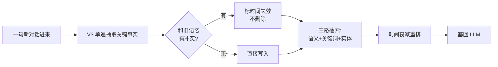
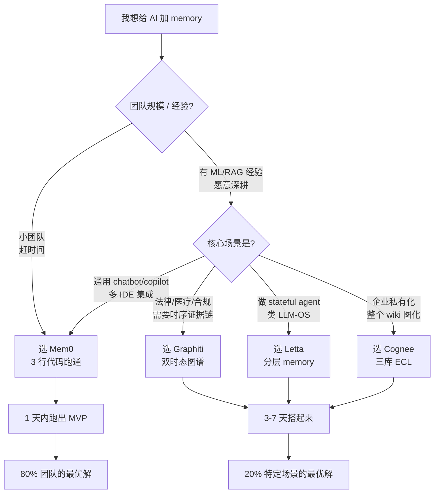

## 多数情况下 Mem0 还是 AI memory 开源方案最佳选择

### 作者
digoal

### 日期
2026-06-18

### 标签
AI , Agent , memory , 图 , 记忆 , RAG 

----

## 背景
你与Agent交互的记忆应该归谁所有? 记忆模块应该单独存在还是由Agent厂商完全提供? 记忆应该由用户主动下发指令执行还是由Agent自动完成? 记忆应不应该有遗忘曲线? 记忆要不要整理? Agent厂商应不应该提供记忆迁移导出功能?    
  
关于 AI memory 我非常不赞同使用时必须要主动告知 Agent 来进行记忆, 难道就不能向数据库配置日志输出一样, 随意配置到日志流服务中吗? 比如stdout,csv,或其他日志接收服务, 记忆也可以啊, 配置好目标, 丢过去就行了.  
  
补充: 记忆管道似乎有项目在搞, https://github.com/Qizhan7/imprint-memory 自动捕获每一个对话轮次，存储到本地（如 `~/.imprint/`）。Agent 可选的 `memory_remember` 调用只起到"加权重"的辅助作用。  
  
但是我觉得从信息到记忆中间应该还需要一个hook, 把信息组织一下再入库, 类似OKF: [《AI 时代的文档新标准: OKF(开放知识格式)》](../202606/20260618_02.md)  
  
这个事情最应该让claude或codex这种agent来做, 做成流水线, 通过HOOK外挂旁路, 把生态做活, 而不是Agent供应商内部持有用户记忆.  
  
  
## 先从一个尴尬场景说起

我有个朋友是后端工程师, 上个月跟我吐槽: "用 Claude Code 写项目, 第一天好不容易讲清楚我们用的是 JWT 鉴权、Redis 限流、Postgres 16, 第二天换个对话窗口, 它问我'你们鉴权方案是什么?', 我当场气笑。"

这不是 Claude 笨, 是 LLM 的物理本质 — **它是个失忆症患者**。

每一次你跟 AI 对话, 在它眼里都是第一次见。你嫌它金鱼脑, 它其实连金鱼都不如 — 金鱼好歹有 3 秒记忆, LLM 是 0 秒。每次调用 API 都是一锤子买卖, 上一句说过的话, 下一句就消失了。能"记住"什么, 全靠你把历史对话再喂一遍进去 — 这就是为什么大家用 ChatGPT 用久了, 都会觉得"它怎么又问我同一个问题"。

要让 AI 真的记住事, 物理上只有一条路: **在 LLM 外面建一个'外部记忆系统', 每次说话前自动把相关记忆塞回它眼皮底下。** 这个"外部记忆系统", 就是今天市面上一堆叫 "AI memory" 的开源项目想解决的事。

那么问题来了 — 这么多项目, 哪个最好?

## 我的结论先放在这里

**截至 2026 年 6 月, 综合最好的是 Mem0** (GitHub: mem0ai/mem0)。

但"最好"这个词需要拆开讲, 因为它不是绝对的 — 在某些特定场景, 你应该选别的项目。我后面会一个一个说清楚。

先说为什么我把 Mem0 排在第一。

## 站在工程师角度看: 它在 benchmark 上甩开了同行

如果我是个 Agent 系统工程师, 评一个 memory 库的"硬实力", 看的不是 GitHub stars 多少 — 那是滞后信号 — 看的是它在公开评测集上的表现。

AI memory 圈里有两个公认的"高考":

- **LoCoMo** (Long-term Conversational Memory): 2024 年 2 月由北卡罗来纳大学、南加州大学、Snap 联合发布。它模拟你和一个朋友连续聊几个月的对话, 平均 305 轮、9000 个 token, 然后考你能不能记得几个月前的细节
- **LongMemEval** (arxiv 2410.10813): 2024 年 10 月由 Salesforce + 加州大学发布, 评聊天助手的长期交互记忆

Mem0 在 2026 年 4 月发布的 V3 算法, 这两项分数是这样的:

- LoCoMo: 71.4 → **91.6** (一年涨了 20 分)
- LongMemEval: 67.8 → **93.4** (涨了 25 分)
- 而且, 跟"把所有历史都塞进 prompt"的暴力方案相比, **token 消耗低了 90%, 响应快了 91%, 准确率比 OpenAI 自己的 Memory 高 26%**

这些数据 Mem0 自己开了个 benchmark 仓库 (`mem0ai/memory-benchmarks`) 让别人复现, 这是个很关键的信号 — 同期其他几家要么没跑公开 benchmark, 要么跑了不放代码。

为什么 V3 这么猛? 拆开看, 是它在四件事上都做了升级:



换句话说, Mem0 没有简单把对话存成向量, 而是用 LLM 先抽取出"事实", 然后用三种不同的方式去检索 — 这样无论你下次问的是"用户最爱喝什么"(语义)、"用户上周买的那本书叫什么"(关键词)、还是"用户和小李是什么关系"(实体), 它都能找到。

## 站在开源生态分析师角度看: 它活得下来

工程上再强, 如果母公司明年倒了, 这个项目也没用。我特别在意一个 OSS 项目"未来 3 年还在不在", 因为我见过太多团队栽在这上面 — 选了一个看起来很火的开源项目, 一年后母公司宣布改 license、把核心功能挪到企业版, 之前投入全部沉没。

Elastic 在 2021 年从 Apache-2.0 改 SSPL、HashiCorp 2023 年改 BUSL、Redis 2024 年也改了, 这些都是血淋淋的教训。

Mem0 在生态上的几个信号让我比较放心:

它用的是 **Apache-2.0 协议** — 这是宽松型开源协议里最稳的一种, 比 MIT 多了显式的专利授权条款, 企业用更不会被告。仓库的 license 文件最后一次修改是几年前, 没有任何漂移迹象。

它母公司 2025 年 11 月拿了 **$24M 融资**, 投资方是 YC + Peak XV (前红杉印度), 按 SaaS 创业公司年烧钱 $4-6M 推算, 至少能撑 4 年。这期间它不需要为了活命而动 OSS 的 license。

它的贡献者有 **114 个**, 远超 Letta、Graphiti、Cognee。这个数字关键在于: 项目不是只有母公司员工在写, 出现了"非雇员的核心贡献者", 这意味着即使母公司出事, 社区还能续命。这就是开源圈说的"低 bus factor"。

更微妙的一个细节: Mem0 旗下的 `mem0-mcp` 仓库在 2025 年 12 月把 license 从 MIT **改成了 Apache-2.0**。注意, 这是从更宽松改到稍严的方向, 而不是反过来 — 这恰恰是健康的开源信号, 说明团队在主动加强专利保护, 而不是为商业化收紧。

## 站在产品负责人角度看: 它最容易塞进现有项目

如果我是个产品 PM, 我不关心 LoCoMo 分数, 我关心: 我那 3 个人的小团队, 能不能在 1 周内把 demo 跑出来?

Mem0 的最小可用代码就这么几行:

```python
from mem0 import Memory

m = Memory()
m.add("用户喜欢喝燕麦拿铁不加糖", user_id="alice")
results = m.search("用户的咖啡偏好", user_id="alice")
```

三行, 真的就是三行。

作为对比, 我把同样的功能在 Letta 上写一遍, 需要先理解 agent、memory_block、tools、archival、recall 等十几个概念, 还要配 PostgreSQL。Graphiti 则要求你先有个 Neo4j 实例, 这就把"git clone → 跑通"的时间从分钟级拉到了天级。Cognee 写法接近 Mem0, 但它的 `cognify()` 是批处理模式, 不适合流式对话。

更要命的是**集成生态** — 这是产品 PM 真正在意的:

| 集成对象 | Mem0 | Letta | Graphiti | Cognee |
|---------|------|-------|----------|--------|
| LangChain / LlamaIndex / CrewAI | ✅ 全部官方 | 多数社区 | 部分官方 | ✅ 全部官方 |
| Vercel AI SDK | ✅ 官方 | ❌ | ❌ | ❌ |
| Cursor / Claude Code / Codex / OpenCode | ✅ 官方 plugin | ❌ | ❌ | 仅 Claude Code |
| MCP (Model Context Protocol) | ✅ mem0-mcp | ✅ | ✅ | ✅ |

Mem0 在 IDE 编程工具的集成上, **领先一个身位**。如果你今天用 Cursor 写代码, 装个 Mem0 plugin, 它就能跨会话记住你的技术栈、风格偏好、之前踩过的坑 — 第二天再打开新对话, 不用再啰嗦"我们用 JWT 鉴权"。

## 但站在认知科学学者角度看: Mem0 并不是理论最完备的那个

到这里, 听起来 Mem0 包打天下。但我得诚实地告诉你, 如果换个视角 — 从"人脑记忆的科学性"来评 — Mem0 不是第一名。

人脑用 50 万年进化出来的记忆架构, 不是无脑塞数据。心理学界 (从 1968 年 Atkinson & Shiffrin、1972 年 Tulving 到 1992 年 Baddeley) 的共识是: 记忆分情景记忆 (上周三我和小李吃了火锅)、语义记忆 (火锅是中国菜)、程序记忆 (我会用筷子) 三层, 还要有遗忘、重新巩固、元记忆这些机制。

按这个标尺去看, **Graphiti 的"双时态知识图谱"是离人脑记忆最近的设计**。它给每条事实记四个时间戳: 什么时候录入的、什么时候开始为真、什么时候不再为真、什么时候作废。这意味着如果你上周说"我喜欢喝咖啡", 这周改喝茶, Graphiti 不会简单覆盖 — 它会把旧记忆标记"已失效", 但保留下来, 既能查"用户现在喜欢什么"也能查"用户半年前喜欢什么"。

这种设计在法律、医疗、合规这些需要"证据链"的场景, 不可替代。

Letta (前身 MemGPT) 的强项在另一个方向: 它把 LLM 当作 CPU、把上下文当作 RAM、把外部存储当作硬盘, 构建了一套"LLM 操作系统"。它的核心记忆 (Core Memory) 是工作记忆的最佳模拟。这套架构理论扎实, 学术传承清晰 (UC Berkeley 的论文), 但代价是上手门槛高、API 概念多, 对赶进度的产品团队不友好。

Cognee 走的是企业知识库路线 — 三库架构 (关系数据库 + 向量库 + 图数据库) + ECL pipeline (Extract / Cognify / Load), 适合把整个公司的 wiki/邮件/会议纪要变成可推理的 memory 层, 在中文社区实测能跑到 92.5% 的回答相关性。

## 所以"最好"到底怎么选

我把这件事画成一张决策图, 你可以根据自己的实际场景对号入座:



按我的经验, **80% 的团队最后会落在 Mem0 上**, 不是因为它技术最深, 是因为它在"够用、好集成、活得下来"这三件事上同时拿了高分。剩下的 20%, 才需要根据具体场景选 Graphiti / Letta / Cognee。

如果你只能记住一句话: **当前 (2026 年 6 月) 没头脑选 Mem0, 在它够不到的特殊场景再换。**

顺便说一下, 我前段时间[《给 mem0 增加了 PostgreSQL AGE 图存储记忆功能》](../202606/20260608_73.md)  

再顺便说一下, 如果你是有国产化AI memory需求的用户, 可以看看 [《PowerMem 未来可能成为 OB 的杀手锏》](../202606/20260605_08.md)     [《OceanBase 在下一盘大棋》](../202606/20260618_03.md)  
  
#### [PostgreSQL 解决方案集合](../201706/20170601_02.md "40cff096e9ed7122c512b35d8561d9c8")
  
  
#### [德哥 / digoal's Github - 公益是一辈子的事.](https://github.com/digoal/blog/blob/master/README.md "22709685feb7cab07d30f30387f0a9ae")
  
  
#### [About 德哥](https://github.com/digoal/blog/blob/master/me/readme.md "a37735981e7704886ffd590565582dd0")
  
  

  
