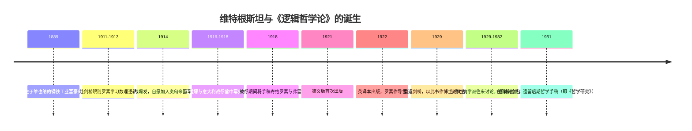
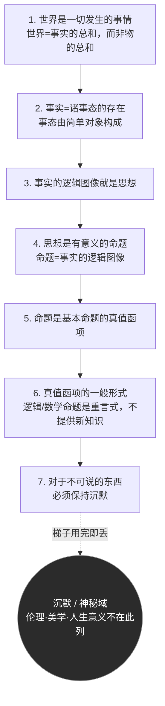

## 《逻辑哲学论》读书笔记 
  
### 作者  
digoal  
  
### 日期  
2026-06-19  
  
### 标签  
读书笔记 , 逻辑哲学论  
  
----  
  
## 背景 
  
  
  

---
书名: 《逻辑哲学论》  
作者: [奥] 路德维希·维特根斯坦  
译者: 贺绍甲  
出版社: 商务印书馆  
出版年份: 1996-12（中译本；原著德文版首版于1921年）  
笔记日期: 2026-06-19  
豆瓣链接: https://book.douban.com/subject/1005354/  
豆瓣评分: 9.2（评价人数持续增长，已超过4500人）  
标签: [哲学, 逻辑学, 西方哲学, 分析哲学, 汉译名著, 维特根斯坦]  
---

  
  
> **一句话**：维特根斯坦想用一本不到八十页的小书终结全部哲学问题，写到最后却告诉你——真正重要的事，恰恰说不出来。  
> **适合谁读**：对语言、逻辑、思维和世界的关系感兴趣的人；想搞清楚"分析哲学"从哪儿冒出来的人；以及任何愿意被一本书逼着重新想一遍"什么叫有意义"的人。  
> **阅读难度**：⭐⭐⭐⭐⭐（5/5，公认20世纪最难啃的哲学经典之一）  
> **推荐指数**：⭐⭐⭐⭐☆（4/5，思想冲击力极大，但建议配合导读本一起读）  
  
---

## 一、时代坐标：这本书从哪里来？

这本书的写作现场，不是书房，是战壕。

1911年，22岁的维特根斯坦跑到剑桥找罗素学数理逻辑，很快就让罗素这种级别的人物感到惊讶——他觉得自己面前坐着一个能接过逻辑学火炬的人。可1914年一战爆发，他做了一个所有人都没想到的选择：以一个富裕工业家族继承人的身份，自愿报名加入奥匈帝国军队，跑去前线当炮兵。

接下来几年，他在炮火、堑壕和后来意大利战俘营里，断断续续把一本笔记本写满了。1918年，他被俘期间把手稿寄给了罗素和弗雷格——这两个人，恰恰是他整本书要回应、要超越的对象。罗素当时正用"逻辑原子论"重建数学和逻辑的基础，弗雷格则在思考语言意义最根本的来源。维特根斯坦读懂了他们的工具，又觉得他们都没把话说到底：罗素和怀特海合写的《数学原理》想为数学找一个绝对牢靠的逻辑地基，弗雷格想搞清楚一个句子"意谓"什么——而维特根斯坦想做的事更激进：用逻辑把"语言能说什么、不能说什么"这条线一次性画清楚，然后宣布——哲学史上吵了两千年的大部分问题，根本不是问题，是语言用错了地方产生的幻觉。

1921年，德文版终于出版（书名其实是摩尔提议借用斯宾诺莎《神学政治论》的拉丁文体例定的）；1922年英译本问世，罗素亲自作导言推荐。维特根斯坦自己当时的态度很决绝：他认为自己已经解决了所有哲学问题，于是转身去奥地利乡下当了一名小学教师，不再过问哲学。直到后来又被一场数学讲座重新勾起兴趣，1929年重返剑桥，干脆把这本书直接拿去当博士论文答辩——主考官就是他的老朋友罗素和摩尔，答辩现场据说气氛颇为滑稽，维特根斯坦甚至拍着两位考官的肩膀说"别担心，你们是不会懂的"。



也正因为这样的诞生背景，这本书带着一种近乎决绝的气质：它不是写给同行慢慢讨论的论文，更像是一个在生死边缘想清楚了一件事、急着说完就转身离开的人留下的遗书。

---

## 二、核心命题：作者在说什么？

整本书用一套独特的编号系统写成——命题1、1.1、1.11……一路编到命题7。数字越长，表示这是对上一级命题的注释或细化。这种写法本身就是一种态度：维特根斯坦不打算"论证"，他打算"陈述"，像数学公理一样，一句压一句地把结论钉死。

### 命题一：语言是世界的图像

全书开篇就把"世界"重新定义了一遍：世界不是物的总和，而是**事实**的总和——"世界是一切发生的事情"。事实由更基本的"事态"构成，事态再往下拆，最终拆到不能再拆的"简单对象"。

这套结构有什么用？因为维特根斯坦认为，语言和世界拥有**同一种逻辑结构**：名称对应对象，基本命题对应事态，命题的总和对应世界本身。一个命题之所以能够描述一个事实，是因为它和那个事实共享同样的"逻辑形式"——就像一张地图能描绘一座城市，不是因为纸和城市长得像，而是因为地图上点和线的关系，映射了城市里建筑和街道的关系。这就是著名的"图像论"。

```
世界（World）                      语言（Language）
对象（简单、不可再分）   <—— 镜像 ——>   名称（Name）
事态 / 原子事实          <—— 镜像 ——>   基本命题（Elementary Proposition）
事实的总和 = 世界        <—— 镜像 ——>   命题的总和 = 语言
```

### 命题二：能说的，与只能显示的

如果语言的结构镜像了世界的结构，那么这个"结构本身"能不能被语言说出来？维特根斯坦的答案是：不能。逻辑形式只能**显示**自己，不能被命题**说出**。比如两个命题用了同一个名称，这件事本身"显示"出它们谈论的是同一个对象——但你没办法另写一个命题去"陈述"这个对应关系，因为任何企图描述逻辑形式的语言，都已经预先依赖了它想描述的那个形式。

这个"说出 / 显示"的区分，是整本书最关键的暗线。它直接导向了那句最广为流传的结论——对于不能谈论的东西，必须保持沉默（命题7）。

### 命题三：哲学不提供新知识，只负责划界

把前两个命题接起来，结论就很自然了：传统哲学讨论的形而上学、伦理学、美学、宗教问题，看起来像在"陈述"什么，但按照上面的标准，它们大多没有真值条件，根本不构成有意义的命题。维特根斯坦认为，哲学真正该做的事，不是再造一套学说去回答"人生的意义是什么"，而是清理语言、划定"可说"的边界，把那些因为语言误用而产生的伪问题暴露出来。

最妙（也最危险）的一点是：他自己也承认，这本书里说的很多话，按它自己的标准，本身就是"不可说"的。他给出的化解方式是一个著名的比喻——这些命题就像一架梯子，你借助它爬上去看清楚之后，就该把梯子扔掉（命题6.54）。

---

## 三、论证地图：作者怎么说服你的？

维特根斯坦没有用案例、没有用数据，他用的是一套近乎几何证明式的命题级联——从"世界是什么"一路推到"哲学该做什么"，七步走完，逻辑链条紧到几乎无法从中间打断。



这套架构的说服力，很大一部分来自它的"自带注释"形式：1.1、1.11、1.12 这种编号本身就是在告诉读者，每一句话都不是孤立的断言，而是上一句话的细化说明，逼着你按顺序一句句啃下去，几乎没有可以跳读的缝隙。

但这套架构也有一个广为人知的内部张力。罗素在英译本导言里就委婉地指出：维特根斯坦一边宣称逻辑形式"不可说、只能显示"，一边却用大量篇幅去**谈论**逻辑形式、谈论唯我论、谈论"神秘的东西"——这些谈论本身，按他自己的标准，恰恰应该是说不出来的。这不是一个无关紧要的小漏洞，而是这本书结构性的悖论：它试图用语言去指明语言的边界，而"指明边界"这件事本身，似乎就站在了它划定的边界之外。维特根斯坦的"梯子"比喻，某种程度上正是对这个悖论的正面回应，但这个回应能不能真正自洽，至今仍是学界争论的焦点。

---

## 四、前提假设与边界：什么情况下这不成立？

这本书的全部说服力，建立在三个关键假设之上，而这三个假设，恰恰是后来哲学界（包括维特根斯坦本人）攻击最多的地方。

**假设一：世界存在不可再分的"简单对象"。** 整套图像论需要一个最底层的逻辑终点——对象必须是简单的、不可再分的，否则镜像结构就建立不起来。但维特根斯坦自己从未在书中给出任何一个"简单对象"的具体例子，这个概念更像是逻辑系统自洽所必需的逻辑要求，而不是一个能被经验证实的发现。后来的分析哲学家普遍质疑：这种"逻辑原子"到底存在不存在，还是只是一套理论自圆其说的产物？

**假设二：意义＝真值条件。** 一个命题"有意义"，前提是它能被判断为真或假。这个标准把伦理学、美学、宗教、人生意义全部划出了"可说"的范围——因为"杀人是不道德的""这幅画是美的"无法被还原成可验证真假的事实陈述。这是一把锋利却也极其严苛的刀。今天看，这个标准明显排除了大量日常语言中真实发挥作用的表达——命令、感叹、安慰、承诺、诗歌——它们显然"有意义"，却从不依赖真值条件。

**假设三：一种语言只对应一种逻辑结构。** 全书假设语言和世界之间存在单一、固定的镜像关系。可维特根斯坦本人后来在《哲学研究》序言里直接承认，自己"第一本著作中有严重错误"——他后期提出"语言游戏"理论，认为语言其实有无数种用法（下命令、讲笑话、祈祷、做实验报告……），意义产生于具体的"使用"，而不是某种固定的镜像对应。这等于是作者本人亲手拆掉了自己年轻时搭建的整套大厦的地基。

---

## 五、思想谱系：这本书在哪个传统里？

维特根斯坦从来不是凭空冒出来的天才。弗雷格给了他逻辑分析的基本方法和"语境原则"的思路；罗素的逻辑原子论和类型论，是他直接对话、也直接想要超越的起点；叔本华关于"世界作为表象"、伦理与意义不属于经验世界的观点，悄悄塑造了他把价值"推出"世界之外的姿态；物理学家赫兹和玻尔兹曼用"模型"描述力学系统的方法论，也被认为启发了他用"图像"来理解命题和事实关系的核心比喻。

这本书出版后产生的影响，比维特根斯坦本人预想的要复杂得多。维也纳的一批科学家和哲学家——石里克、卡尔纳普等人——把它当作圣经一样逐字逐句研读，由此孕育出了20世纪最重要的哲学运动之一：逻辑实证主义（维也纳学派）。但耐人寻味的是，维特根斯坦本人从未真正认同这群追随者：他们把"拒斥形而上学"理解成一套实证主义纲领，维特根斯坦却认为，那些不可说的东西恰恰是人类生活中最重要的东西，只能保持沉默，不该被一笔勾销。据记载，他在与学派成员的讨论会上，曾因为不满对方的解读方式，转身背对大家朗读诗歌——这个细节比任何评论都更说明问题：一本书的"实际影响"，和作者的"本意"，可能差着十万八千里。

```
弗雷格（逻辑分析、语境原则）
罗素（逻辑原子论、类型论）        ─┐
叔本华（神秘主义、价值在世界之外）  ├─→ 《逻辑哲学论》(1921)
赫兹/玻尔兹曼（科学模型方法论）   ─┘         │
                                            ├─→ 维也纳学派 / 逻辑实证主义（带误读的影响）
                                            └─→ 维特根斯坦自我批判 →《哲学研究》(语言游戏论)
```

---

## 六、我学到了什么？

**第一，"可说"与"不可说"的区分，是一把好用的争论分类器。** 很多争论之所以吵不出结果，不是因为立场不同，而是因为双方在讨论一个根本无法被"说清楚"的东西，却以为自己在讨论一个事实问题。读完这本书，我会更习惯先问一句：这是个能验证真假的争议，还是一个本质上属于体验、价值、姿态的领域——它不该被塞进"谁对谁错"的框架里。

**第二，极致的严谨，反而暴露出语言本身的有限性。** 这本书最打动我的地方不是它的具体结论，而是它愿意把自己的工具用到极限——用到最后发现，工具本身解释不了为什么自己有效。这种"自我消解"的姿态，比任何一个斩钉截铁的论断都更诚实。

**第三，重要的东西，常常活在沉默和姿态里，而不是陈述里。** 维特根斯坦没有说"人生没有意义"，他说的是"人生的意义说不出来，只能显示"。这提醒我，有些最重要的理解——对一个人的信任、对一件事的笃定——本来就不是靠论证传递的，逼着自己把所有重要的东西都"说清楚"，反而可能是一种误解。

---

## 七、举一反三：这个框架还能用在哪？

**团队沟通**：很多团队争论的根源，其实是双方对同一个词（比如"完成""优先级""质量"）有不同的隐含定义，而不是真正的分歧。先把"这是事实争议还是定义争议"分开，往往能省下大半的争吵时间。

**产品 / 系统设计**：一份产品文档该诚实地划出"这个系统能验证、能保证的边界"，而不是把无法验证的承诺也写成确定性陈述——这其实就是"可说"与"不可说"的工程版本。

**个人决策**：面对"我该不该辞职""这段关系值不值得"这类问题，与其追求一个像数学题一样精确的答案，不如承认它们更接近维特根斯坦说的"神秘域"——答案不会以一句"陈述"的形式出现，而是要在体验和实践中慢慢"显示"出来。

---

## 八、批判与反思

**自我指称的悖论从未被真正解决。** 罗素的导言提出的质疑至今没有标准答案：一本宣称"逻辑形式不可说"的书，自己却花了大量篇幅去谈论逻辑形式、唯我论和神秘体验。"梯子"比喻是个聪明的退路，但聪明的退路不等于严密的解答——这更像是一种姿态上的优雅脱身，而不是逻辑上的完满闭环。

**这本书最有力的反驳者，是作者自己。** 维特根斯坦晚年在《哲学研究》序言里坦言，自己"重新开始研究哲学"之后，认识到第一本书里有严重错误。他后来提出"语言游戏"和"家族相似"，正面推翻了图像论里那种单一、固定的镜像假设。一本被无数人捧为20世纪最重要哲学著作的书，最尖锐的批评却来自这本书的亲生父亲——这件事本身值得每一个读者多想一层：经典不等于终点。

**被误读、却也因误读而扩大了影响。** 维也纳学派把这本书读成了一套实证主义宣言，这并不完全符合维特根斯坦的本意，但恰恰是这种"创造性误读"，把这本书的影响力从一小群剑桥逻辑学家，扩散到了整个20世纪科学哲学的版图。这提醒我们对"作者已死"这个老话题保持一点警惕：误读有时候比正确理解传播得更远。

**把"意义"等同于"真值条件"，今天看代价不小。** 这个标准固然清晰锋利，却也武断地把伦理、审美、宗教体验排除在"有意义的语言"之外。日常语言哲学（包括维特根斯坦后期自己）后来都在反驳这一点：一句感叹、一句祈祷、一句安慰，没有真假可言，却显然在发挥意义功能。这是这本书最大的代价，也是它最终被作者自己放弃的根本原因。

---

## 九、金句与记忆点

1. **"凡是能够说的东西，都能够说得清楚；对于不能谈论的东西，必须保持沉默。"**（命题7）——全书的最终结论，也是被引用最多的一句。它同时是一句哲学结论，也是一种生活态度的宣告。

2. **"我的语言的界限意味着我的世界的界限。"**（5.6）——把语言的边界和存在的边界划上等号，是全书"唯我论"线索的核心，也是后来无数关于"语言决定思维"讨论的起点。

3. **世界是一切发生的事情**（命题1的大意）——开篇第一句就重新定义了"世界"：不是物的堆积，而是事实的总和。这个起手式直接决定了全书的本体论方向。

4. **梯子比喻**（命题6.54大意）——维特根斯坦把自己的整本书比作一架梯子：理解了它，就该把它扔掉，而不是站在上面不肯下来。这是少见的"用完即弃"式的哲学写作姿态。

5. **"哲学不是一种学说，而是一种活动。"**（命题4.112附近大意）——这句话几乎预告了20世纪后半叶哲学的一大转向：从"建立体系"转向"治疗语言混乱"。

6. **"把世界看作一个有限整体的感觉，是神秘的。"**（6.45大意）——这是全书少数直接触碰"神秘体验"的地方，提示读者：这本书的逻辑外壳之下，藏着一种近乎宗教性的情感内核。

---

## 十、延伸阅读

1. **《哲学研究》（维特根斯坦）**——同一个人的后期哲学，与本书形成最强烈的自我对照，理解"语言游戏"如何取代"图像论"是绕不开的下一站。

2. **《维特根斯坦传：天才之为责任》（瑞·蒙克）**——了解这位作者本人充满戏剧性的一生，理解一本如此冷峻的逻辑著作，背后其实是一段极度炽热的生命。

3. **《维特根斯坦与〈逻辑哲学论〉》（迈克尔·莫里斯，劳特利奇哲学经典导读丛书）**——按原书七大命题逐段串讲，适合配合原著对照阅读，扫清初读时的大部分障碍。

4. **罗素《数学原理》导论部分及相关逻辑原子论著作**——理解维特根斯坦真正在对话、也在试图超越的那套逻辑学背景。

5. **卡尔纳普《世界的逻辑构造》**——看维也纳学派如何接过《逻辑哲学论》的工具，却走向了一条维特根斯坦本人并不完全认同的道路。

---

*笔记写于 2026-06-19 | 基于公开资料与深度思考整理*
  
  
#### [PostgreSQL 解决方案集合](../201706/20170601_02.md "40cff096e9ed7122c512b35d8561d9c8")
  
  
#### [德哥 / digoal's Github - 公益是一辈子的事.](https://github.com/digoal/blog/blob/master/README.md "22709685feb7cab07d30f30387f0a9ae")
  
  
#### [About 德哥](https://github.com/digoal/blog/blob/master/me/readme.md "a37735981e7704886ffd590565582dd0")
  
  

  
