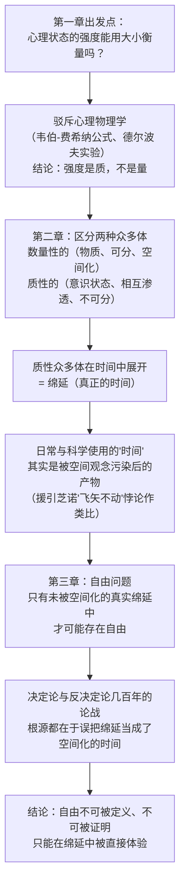

## 《时间与自由意志》读书笔记 
  
### 作者  
digoal  
  
### 日期  
2026-06-19  
  
### 标签  
读书笔记 , 时间与自由意志  
  
----  
  
## 背景 
  
  
  

---
书名: 《时间与自由意志》  
作者: [法] 亨利·柏格森  
出版年份: 1958-8（吴士栋译本，商务印书馆；法文原书初版于1889年）  
笔记日期: 2026-06-19  
豆瓣链接: https://book.douban.com/subject/1255584/  
豆瓣评分: 8.5（1544人评价）  
标签: [哲学, 柏格森, 西方哲学, 法国, 时间, 生命哲学, 心理学, 自由]  
---

  

> **一句话**：你以为的"时间"只是空间的伪装，你以为无解的"自由意志"之争，其实是问错了问题。  
> **适合谁读**：对"自由意志""时间体验""意识流"感兴趣的人，尤其是被科学决定论困扰过的人  
> **阅读难度**：⭐⭐⭐⭐☆（4/5星，概念抽象但篇幅不长）  
> **推荐指数**：⭐⭐⭐⭐☆  
  
---

## 一、时代坐标：这本书从哪里来？

1889年的欧洲，机械论与决定论是科学的常识，也是哲学的主流空气。在法国有孔德的实证主义，在英国有穆勒和斯宾塞的实证主义与机械进化论。年轻的柏格森一度对斯宾塞抱有好感，但恰恰是斯宾塞处理"时间"的方式——把时间当成一条可以像空间一样切割、排列的线——让他最终掉头而去，走上了自己的路。

更直接的论敌，是当时方兴未艾的"心理物理学"：韦伯和费希纳试图用数学公式把感觉的强度和外部刺激的大小挂钩，仿佛"快乐"和"温度"一样可以被量化、被乘除。柏格森的博士论文，正是从拆穿这个野心开始的。

这本书写于1883—1887年间，1889年以《论意识的直接材料》之名出版，柏格森借此拿到了文学博士学位。1913年他本人将其译为英文时改名《时间与自由意志》——这个英文书名后来反而比法文原名更广为人知。它要解决的问题很古老：人到底有没有自由意志？但柏格森给出的答案路径很新——他认为，几百年来这场决定论与反决定论的拉锯战根本没有真正交过手，因为双方吵架时用的"时间"概念本身就是错的。

值得一提的是，这本书的中文之旅本身也是一段历史。1958年，刚恢复独立建制的商务印书馆被中央确定为"以翻译外国哲学社会科学学术著作为主"，吴士栋的这个译本，正是新中国系统引入西方现代哲学经典最早的一批成果之一——它后来被收入"汉译世界学术名著丛书"，成为几代中国读者认识柏格森、认识"绵延"这个词的起点。

---

## 二、核心命题：作者在说什么？

### 命题一：心理状态的强度是"质"，不是"量"

我们习惯说"我开心了三分""他生气程度有八分"，仿佛情绪可以像身高体重一样被刻度衡量。柏格森第一章就专门拆这个习惯：大小、数量这些概念，本质上属于空间——只有占据空间的东西才谈得上"容者"和"被容者"的关系。而心理状态的强度根本不占据空间，它是纯粹质性的。我们之所以觉得情绪"有大小"，是因为我们偷偷把伴随情绪而来的肌肉紧张、身体反应这些空间性的东西，当成了情绪本身。

### 命题二：两种"众多体"——可分的与不可分的

接下来柏格森提出了全书最关键的区分：世界上存在两种"众多性"。一种是物质性的、数量性的——比如一群羊、一排数字，它们彼此外在、互不渗透，可以被清晰计数和分割。另一种是意识状态构成的——比如你脑子里同时翻涌的好几种情绪，它们彼此渗透、彼此牵连，没有清晰的边界，无法真正分割计数。这后一种展开在时间中的样子，柏格森给了它一个专门的名字：**绵延（durée）**。

### 命题三：自由只存在于真正的绵延之中

钟表上的时间、日历上的时间，其实是被"空间化"过的时间——我们把它想象成一条从过去延伸到未来的线，线上的每一点彼此独立、可以排列、可以计算。这种时间里，因果律统治一切：同样的前提必然导致同样的结果，自由无处藏身。但柏格森说，这并不是真正的时间，只是我们为了生活和科学的方便，借用空间的直觉伪造出来的一个符号系统。真正的绵延是异质的、不可分割的、永远是新的——昨天12点的心情，绝不可能与今天12点完全相同。只有在这种真实的绵延中，自由才有立足之地：因为这里没有什么是被预先决定的。

---

## 三、论证地图：作者怎么说服你的？

柏格森的论证几乎是一条单线推进的逻辑链——从感觉强度，一路推到自由意志：



**论证方式的评价**：柏格森几乎不依赖外部数据，而是大量调用日常的内省式描述——肌肉努力、审美感、愤怒、注意力——把读者拉回自己的身体和情绪现场。他引用并批评了同时代的心理物理学实验，目的是拆台而非借力。这种"以内省对抗实证"的写法，优点是极其细腻、贴近真实体验；代价是几乎没有给出可被外部检验的标准——这也正是后来罗素攻击他的地方（详见第四节）。

---

## 四、前提假设与边界：什么情况下这不成立？

这套理论能站得住，需要至少三个隐含假设，而每一个今天看都不再是不言自明的：

**假设一：理智注定会扭曲实在，只有直觉才能把握真实**。柏格森认为，一旦用概念去分析绵延，绵延就被"空间化"、僵死了。这预设了理智与直觉之间存在近乎不可调和的鸿沟。但今天的认知科学和心理学更倾向于认为理性与直觉是协同工作的两套系统，而非天生对立——这个假设的吸引力比一百年前弱了不少。

**假设二：自由只栖身于纯粹内在、未外化的"基本自我"**。一旦你把内心状态说出来、做成选择、付诸行动，它就已经被"空间化""社会化"了。这意味着柏格森式的自由几乎是一种私人的、转瞬即逝的体验，很难落地成可观察、可负责的行动伦理学。

**假设三：绵延不可分析，分析行为本身就会破坏它**。这让整套理论在方法论上几乎拒绝被检验——这也正是它最容易招致"不可证伪"指控的地方。

**适用边界**：这本书提供的"自由"，更接近一种现象学意义上的体验之自由，而不是法律或伦理意义上"该不该为行为负责"的那种自由。如果你想拿它去讨论刑事责任归属，会发现它几乎无法操作化——这不是这本书的失败，而是它本来就没打算回答那个问题。

---

## 五、思想谱系：这本书在哪个传统里？

```mermaid
graph LR
    subgraph 上游：被对抗的思潮
    S1["孔德实证主义"]
    S2["斯宾塞机械论/进化论"]
    S3["韦伯-费希纳心理物理学"]
    end
    subgraph 本书_1889
    M["《时间与自由意志》<br/>绵延 · 质性众多体 · 自由不可定义"]
    end
    subgraph 同时代论敌
    R["罗素：反理智 · 诗意想象<br/>不可证伪的指控"]
    end
    subgraph 下游：被继承与改造
    D1["威廉·詹姆斯：意识流"]
    D2["普鲁斯特：追忆似水年华"]
    D3["德勒兹：柏格森主义/电影哲学"]
    D4["梅洛-庞蒂：身体现象学"]
    end
    S1 --> M
    S2 --> M
    S3 --> M
    M -.交锋.- R
    M --> D1
    M --> D2
    M --> D3
    M --> D4
```

柏格森的论敌中分量最重的是罗素。在《西方哲学史》里，罗素直接称柏格森哲学"反理智"，认为它靠理智的混乱发展壮大，他甚至说柏格森的整套绵延理论从头到尾建立在"回忆当下发生的行为"与"被回忆的过去事件本身"之间的混淆上——一种富有想象力的世界图景，既不能被证明，也不能被反驳。这场论战，某种意义上也是后来"分析哲学"与"大陆哲学"两大传统分道扬镳的一个缩影。

而在下游，这本书的影响远远溢出了哲学系。普鲁斯特中学时就研读过柏格森，《追忆似水年华》里那种没有清晰时间界限、记忆彼此渗透涌现的叙事结构，几乎可以看作绵延概念的文学实现；威廉·詹姆斯几乎同期独立提出了"意识流"概念，又间接影响了乔伊斯、伍尔芙这些意识流小说家。哲学内部，德勒兹则系统重构了绵延概念，写出《柏格森主义》，并把它延伸进了电影哲学；梅洛-庞蒂的身体现象学也部分继承了柏格森对机械身体观的批判。

---

## 六、我学到了什么？

**第一，时间不是一把尺子，而是一种"渗透"。** 我们太习惯把时间想成日历格子——昨天、今天、明天，互不相干，可以编号。柏格森提醒我，至少在内在体验的层面，这个模型本身是借来的：是空间的隐喻冒充了时间。情绪、记忆、念头之间从来没有清晰界限，它们彼此渗透、彼此牵连——这跟我们真正"活"在时间里的感觉，其实更贴近。

**第二，"自由不可定义"第一次读到时让我觉得这是在回避问题，后来才意识到它指向了一个更深的麻烦。** 一旦你用概念去框定"自由"，你就已经把它变成了一个静止的、可分析的对象——而自由恰恰只发生在那个"正在选择、尚未凝固"的瞬间。这跟后来我了解到的一些关于专注投入状态、关于即兴创作的描述，有种奇妙的呼应。

**第三，很多看似几百年都吵不出结果的争论，问题可能不在论证不够，而在框架本身被设错了。** 决定论与自由意志的争论之所以僵持不下，某种程度上是因为双方在用同一套"空间化时间"的语言玩游戏——一旦把意识状态摆进像台球一样彼此外在、可排列的因果链条里，自由当然会消失。这给我的最大启发不是关于时间，而是关于争论本身：先检查问题是不是被问错了，往往比急着论证更重要。

---

## 七、举一反三：这个框架还能用在哪？

"数量性众多体 vs 质性众多体"这个工具，远不止能用来谈时间：

**团队管理**：把团队效率压缩成几个KPI数字，是一种"空间化"的简化——好测量，但容易失真；团队真正的状态，比如信任感、默契、士气，更接近彼此渗透、难以拆分的"质性众多体"，难测量，却更接近真相。

**自我认知**：当我们用星座、人格测试标签来描述自己时，本质上是把流动的"基本自我"切割、打包成了可以发朋友圈、可以社交的"表层自我"标签——方便沟通，但也是一种简化甚至失真。

**创造性工作**：写作、设计、即兴演奏里那种"进入状态"的体验，很难被流程化、模板化拆解——这恰好呼应了柏格森那句"绵延一分析就死"。有些工作流程，本来就不该被切成KPI看板上的格子。

---

## 八、批判与反思

**罗素的批评依然成立**：这套理论高度依赖内省式描述和文学化的隐喻（渗透、洪流、相互交融），却拒绝任何形式的概念化检验，这让它几乎无法被证伪，也很难和后续的经验科学真正对话。

**它回避了自由意志问题里最棘手的部分**：我们关心自由意志，很多时候是因为想知道"一个人该不该为自己的行为负责"，而柏格森式的、收缩在私人内在体验里的自由，在这个问题面前几乎插不上手。

**时代局限**：上世纪80年代以来的神经科学实验（利贝特的"准备电位"研究及其后续）提出了柏格森完全没有预见到的新挑战——大脑活动在人"意识到"自己做了决定之前几百毫秒甚至几秒就已经启动。这些实验本身仍存在解读争议，自由意志问题至今没有定论，但它提醒我们：柏格森那套"理智永远触不到绵延"的论证策略，面对新的实证工具时，恐怕不能只靠一句"那是被空间化的误解"就轻松打发过去。

---

## 九、记忆点（核心概念解析）

1. **绵延（durée）**——柏格森给真正的时间起的专名：异质的、不可分割的、不断渗透更新，区别于被空间化、可计算的钟表时间。
2. **质性众多体 vs 数量性众多体**——意识状态彼此渗透、不可分割；物质事物彼此外在、可以计数排列。区分这两者，是全书的方法论基石。
3. **空间化（spatialization）**——柏格森用来批评一切把流动的实在切成静止片段的思维方式，钟表时间、自由的"定义"，都是空间化的产物。
4. **基本自我 vs 表层自我**——只有未经社会化、未被语言概念固定的"基本自我"，才真正栖身于绵延之中，也才可能是自由的。
5. **芝诺"飞矢不动"悖论**——柏格森借这个古希腊悖论说明：把运动切成一个个静止的空间点，本身就已经偷换了运动和时间。
6. **自由不可定义**——并非搪塞，而是柏格森理论的必然推论：定义即空间化，而自由只存在于尚未被空间化的当下。

---

## 十、延伸阅读

1. **柏格森《创造进化论》**——同一作者的代表作，把绵延概念扩展到整个生命进化史，提出"生命冲动"，是看懂柏格森哲学全貌的下一步。
2. **柏格森《物质与记忆》**——处理意识与身体、记忆与知觉的关系，是连接本书（内在自我）与《创造进化论》（宇宙生命）之间的桥梁。
3. **吉尔·德勒兹《柏格森主义》**——20世纪最重要的柏格森研究之一，展示了绵延概念如何被后结构主义重新激活。
4. **普鲁斯特《追忆似水年华》**——如果想直观感受"绵延"在文学里的样子，这几乎是柏格森哲学的文学版本。
5. **关于自由意志与神经科学的当代讨论**（如利贝特实验相关综述）——可以和本书对照阅读，看一百多年后这场争论被推进到了哪里，又留下了哪些新的麻烦。

---

*笔记写于 2026-06-19 | 基于公开资料与深度思考整理*
  
  
#### [PostgreSQL 解决方案集合](../201706/20170601_02.md "40cff096e9ed7122c512b35d8561d9c8")
  
  
#### [德哥 / digoal's Github - 公益是一辈子的事.](https://github.com/digoal/blog/blob/master/README.md "22709685feb7cab07d30f30387f0a9ae")
  
  
#### [About 德哥](https://github.com/digoal/blog/blob/master/me/readme.md "a37735981e7704886ffd590565582dd0")
  
  

  
