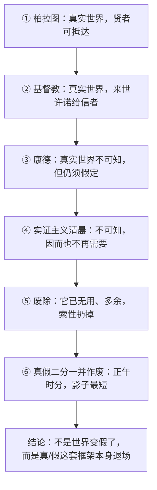

## 《偶像的黄昏》读书笔记 
  
### 作者  
digoal  
  
### 日期  
2026-06-19  
  
### 标签  
读书笔记 , 偶像的黄昏  
  
----  
  
## 背景 
  
  
  

---
书名: 《偶像的黄昏》  
作者: [德]弗里德里希·尼采  
译者: 李超杰  
出版社: 商务印书馆  
出版年份: 2013-11（丛书：汉译世界学术名著丛书·哲学）  
笔记日期: 2026-06-19  
豆瓣链接: https://book.douban.com/subject/25784280/  
豆瓣评分: 9.1（3501人读过）  
标签: [哲学, 尼采, 德国哲学, 西方哲学经典, 重估一切价值]  
---

  

> **一句话**：尼采用一个星期的假期，给两千年的西方理性与道德写了一份诊断书，结论只有一句——能杀死你的从来不是真相，而是你拒绝承认那是一具僵尸。  
> **适合谁读**：不想啃《查拉图斯特拉如是说》全本，却想用最短篇幅摸到尼采思想核心的人；对"理性""真理""道德"这些词总觉得哪里不对、却说不清哪里不对的人。  
> **阅读难度**：⭐⭐⭐⭐☆  
> **推荐指数**：⭐⭐⭐⭐⭐  
  
---

## 一、时代坐标：这本书从哪里来？

1888年8月26日到9月3日，尼采在瑞士锡尔斯-玛利亚度假，只用了一周时间写出这本小册子。彼时他已出版《善恶的彼岸》《论道德的谱系》等重要著作，却仍未获得广泛认可，于是想写一本短小的"思想自我介绍"，最初定名《一个心理学家的闲逛》。后来他把书名改成《偶像的黄昏》，故意呼应瓦格纳歌剧《尼伯龙根的指环》终章《诸神的黄昏》——但"神"换成了"偶像"（Götze，含贬义的假神、虚像），暗示他要砸碎的不是神明，而是人们不假思索供奉的一切：理性、道德、"改善人类"的善意、苏格拉底式的智慧。

这一年，是尼采精神彻底崩溃前的最后一年。他在几个月内连续写出《偶像的黄昏》《瓦格纳事件》《敌基督者》《瞧，这个人》《尼采反瓦格纳》五部小书，像一颗超新星在熄灭前的最后爆发。1889年1月3日，他在都灵街头精神失常，此后再未恢复清醒写作。也就是说，这本书是一个思想者在悬崖边上，用最清醒的姿态写下的总清算——这赋予了它一种格外尖锐、几乎不留余地的语气。

---

## 二、核心命题：作者在说什么？

### 观点一：理性本身可能是一种病症
尼采重提"苏格拉底问题"：苏格拉底出身卑微、相貌丑陋，他发明的辩证法与"理性至上"，在尼采看来不是健康心智的产物，而是本能衰退后寻找的代偿工具——一个人本能不再可靠时，才需要用逻辑一步步替自己做决定。由此他列出"四大谬误"：把效果当原因（比如以为"有道德"导致"幸福"，其实顺序可能恰好相反）；虚构"自由意志"与"自我"（行为发生之后，意识才编出一套"我决定要做"的叙事，给既成事实找一个体面的发起者）；把心理上的想象当成事实的原因；以及把"驯化、弱化"包装成"改善"——道德的"驯兽员"把猛兽变成病猫，却称之为教化的成功。

### 观点二："真实的世界"是一个被发明、又被自己废除的概念
本书最著名的一节，用极简的六个历史片段，讲完了整部西方形而上学史：从柏拉图的"真实世界，贤者可达"，到基督教的"真实世界，来世许诺给信者"，到康德的"真实世界不可知、但仍应假定它存在"，到实证主义清晨"不可知、所以也不再需要"，最后干脆"废除它，因为它已经无用而多余"。而尼采的收尾更狠：一旦"真实的世界"被废除，"虚假的世界"这个说法也失去了对应物——于是连"真/假"这套二元对立本身，也该一起退场。

### 观点三：道德不是天上掉下来的标尺，而是生命状态的自我表达
尼采反复强调"没有道德事实"，有的只是某种生命力（旺盛或衰颓）借助道德语言为自己辩护或定罪。"违反自然的道德"一章专门攻击那种要求人压制、阉割本能（而非疏导、升华本能）的道德——基督教对待性欲、骄傲、报复欲的方式，是切除而不是驯服。"重估一切价值"，就是要把评判标准从"是否符合某条外在律令"换成"是否有利于生命的强健与丰盈"。

---

## 三、论证地图：作者怎么说服你的？



这段"历史"几乎没有引用一条经验数据，也没有逐条反驳康德或柏拉图的具体论证——尼采用的是**诊断式写作**：像医生看病人一样，把"真理""理性""道德"这些抽象概念,还原成某种生理-心理状态的症状。他点名的案例集中在苏格拉底、柏拉图、基督教教士、康德、瓦格纳，以及收尾时登场的查拉图斯特拉。这种写法极具冲击力，也是后来福柯"系谱学"方法的直接源头；但它的代价是几乎不留反驳空间——任何反对意见都可以被他反手说成"衰颓本能的自我辩护"，这是一种修辞上近乎无法被正面击败的策略，也正因此值得警惕。

---

## 四、前提假设与边界：什么情况下这不成立？

尼采的整套论证依赖几个未被言明的前提。其一，他把"生命""本能""强健/衰颓"当作评判一切思想与道德的终极标尺，但"强健"究竟如何界定、由谁界定，他从未给出可操作的标准，容易滑向"我喜欢的就是强健，我不喜欢的就是衰颓"的同义重复。其二，他把理性、逻辑设定为与"生命"天然对立的东西，但这预设了二者必然冲突；从演化论的视角看（尼采本人对达尔文式思路并不陌生），理性恰恰可能是生命为了更好存续而演化出的工具，并非外部强加的枷锁。其三，他把整部西方哲学史压缩成"苏格拉底—柏拉图—基督教"一条衰颓主线，这种宏大叙事式的诊断本身带有高度选择性，忽略了怀疑论、伊壁鸠鲁主义等大量不服从这条叙事的思想资源。这本书更适合当作一剂猛药——逼你去质疑那些从未被质疑过的预设，而不太适合被当成可以直接套用的行动指南：尼采本人随后急速崩溃的精神状态，也是这种极端思维方式所付出代价的一个提醒。

---

## 五、思想谱系：这本书在哪个传统里？

叔本华的悲观主义意志哲学是尼采的早期出发点，他后来把"否定意志"反转为"肯定意志"（命运之爱）。瓦格纳曾是他的精神同盟，而就在写作本书的同一年，尼采写下《瓦格纳事件》与他公开决裂。这本书延续了《悲剧的诞生》对苏格拉底的攻击，承接了《善恶的彼岸》《论道德的谱系》对道德起源的系谱学分析，是他晚期一系列"小册子"中承担"哲学总纲"角色的一部。

```
叔本华（悲观意志论）──┐
                       ├─→ 尼采：《悲剧的诞生》→《善恶的彼岸》/《道德的谱系》→《偶像的黄昏》(1888)
瓦格纳（早期同盟→1888决裂）─┘                         │
                                                       ▼
                            20世纪回响：海德格尔（尼采=最后的形而上学家）
                                       福柯（系谱学方法→疯癫、监狱、性史研究）
                                       德里达 / 后结构主义（"没有真理，只有诠释"）
```

20世纪后半叶大半个"怀疑一切宏大叙事"的思想潮流，源头都能在这本薄薄的小书里找到痕迹。

---

## 六、我学到了什么？

第一，学到一种"诊断式思考"：遇到一个看似天经地义的观念——比如"应该追求内心平静""应该理性客观"——可以先不急着判断对错，而是问"是谁在什么状态下需要这个观念"，这能让人跳出观念本身去看它背后的功能。第二，"倒果为因"的提醒对我自己很扎心：很多时候我们把"做了正确的事所以才成功"这套因果，套在自己身上来自我安慰或自我惩罚，而真实情况可能是先有了某种状态（精力、运气、资源），后来才编出一套体面的道德叙事来解释它。第三，尼采让我重新审视"心理健康"这件事——他笔下的"灵魂的宁静"，常常不是力量的标志，反而是疲惫、消化良好或某种自我麻醉的副产品。这跟今天流行的"情绪稳定""佛系""躺平"式自我修养话语形成了一个有趣的对照，值得多想一层：真正的平静和疲惫的平静，外表很像，内里完全不是一回事。

---

## 七、举一反三：这个框架还能用在哪？

**审视组织文化**：当一家公司反复强调"我们重视谦逊""我们倡导奉献"，可以用尼采式提问——这套价值观真正服务于谁的利益？它是组织确实强健的表现，还是在为某种结构性问题（比如低薪、超负荷）做修辞上的遮蔽？

**自我归因的复查**：把"我现在过得不好"简单归因为"我不够自律、不够道德"，往往忽略了更直接的生理、环境、资源因素。学会先问一句"这是真实的因果，还是我事后编的故事"，是四大谬误这一章最容易迁移到日常生活的部分。

**评估任何"万能解释框架"**：无论是成功学、历史决定论，还是某种心理学流派的包打天下式叙事，都可以追问一句——这个叙事简化掉了哪些不服从它的事实？不必接受尼采的具体结论，但完全可以借用他这种怀疑式提问的姿态。

---

## 八、批判与反思

我不同意的地方：尼采把"强者/弱者""健康/衰颓"这套二元用得太松，几乎成了一个万能解释器——任何他不喜欢的东西都可以扣上"衰颓"的帽子，这种修辞策略本身缺乏可证伪性，某种意义上是一种哲学上的"作弊"。

时代已经变了的地方：尼采著作中（包括本书之外的其他文本）流露出的对女性、病弱者等群体的论断，带有强烈的19世纪精英主义与生理决定论色彩，放在今天的平等伦理框架下难以立足。值得一提的是，学界对尼采本人是否真的"厌女"也存在争议——不少传记作者指出，他生前痛恨排犹主义，身后形象很大程度上被妹妹伊丽莎白·福斯特-尼采为迎合纳粹而扭曲、挪用过；但这并不能完全洗白他著作里对"女性气质"刻板化处理的事实，读者应当把这些内容当作时代局限的产物来看待，而不是直接搬用的结论。

局限性：格言体写作让这本书极具传播力和金句感，几乎句句可以截图发朋友圈，但代价是它几乎不给反对意见留对话空间——它更适合当作刺激思考的引信，而不适合当作严密的伦理学论证来逐条评估。

---

## 九、金句与记忆点

1. **"凡是杀不死我的，都使我更强大。"**（格言与箭）——尼采式生命力哲学的浓缩版，常被剥离原本残酷的语境，简化成励志鸡汤，其实它谈的是危机本身可能转化为力量，而非危机理所当然值得追求。
2. **"求体系的意志意味着缺乏诚实。"**（格言与箭）——对一切想把世界装进封闭逻辑框架的哲学家的嘲讽，提醒人警惕过分整齐的解释。
3. 混淆因果，被他称为**理性的真正堕落**（四大谬误）——检查自己叙事里的因果箭头到底指向哪边，是这本书最实用的思维工具。
4. 哲学家处理过的一切，最终都变成了**僵死的概念标本**（哲学中的"理性"）——批评传统哲学把活生生的经验抽成了干瘪范畴。
5. 废除真实世界的同时，**虚假世界这个说法也一并失效**（"真实的世界"如何变成了寓言）——形而上学总清算的最后一击：不是世界变假了，而是真假二分这套框架本身该退场。
6. 艺术家眼中的假象，**是经过强化与修正的现实**，而不是与现实对立的东西（哲学中的"理性"）——尼采美学观的核心。

---

## 十、延伸阅读

1. **《善恶的彼岸》（尼采）**——系统展开本书提到的"重估道德"主题，论证形态更接近正式哲学著作。
2. **《论道德的谱系》（尼采）**——"系谱学"方法的完整演练，是理解"违反自然的道德"一章最佳的配套读物。
3. **《悲剧的诞生》（尼采）**——尼采的早期作品，理解"苏格拉底问题"为何贯穿他一生的起点。
4. **尼采传记类作品（如苏·普里多关于尼采生平的研究）**——了解1888年那个夏天，写下这本书的尼采到底处在怎样的生理与精神状态。
5. **《疯癫与文明》（米歇尔·福柯）**——想看尼采的"系谱学"诊断方式在20世纪如何被继承、改造，这是绝佳的下一站。

---

*笔记写于 2026-06-19 | 基于公开资料与深度思考整理*
  
  
#### [PostgreSQL 解决方案集合](../201706/20170601_02.md "40cff096e9ed7122c512b35d8561d9c8")
  
  
#### [德哥 / digoal's Github - 公益是一辈子的事.](https://github.com/digoal/blog/blob/master/README.md "22709685feb7cab07d30f30387f0a9ae")
  
  
#### [About 德哥](https://github.com/digoal/blog/blob/master/me/readme.md "a37735981e7704886ffd590565582dd0")
  
  

  
