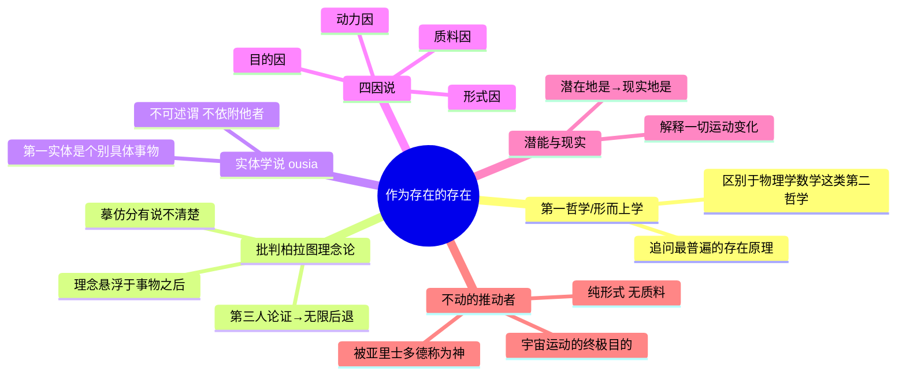
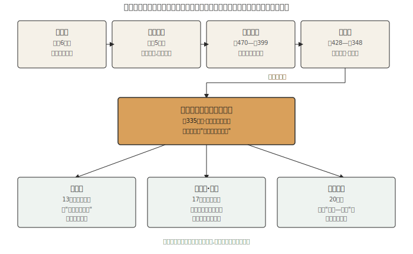

## 《形而上学》读书笔记 
  
### 作者  
digoal  
  
### 日期  
2026-06-19  
  
### 标签  
读书笔记 , 形而上学  
  
----  
  
## 背景 
  
  

---
书名: 《形而上学》  
作者: [古希腊] 亚里士多德  
译者: 吴寿彭  
出版社: 商务印书馆  
出版年份: 1997  
笔记日期: 2026-06-19  
豆瓣链接: https://book.douban.com/subject/1077833/  
豆瓣评分: 8.8（2447人评价）  
标签: [哲学, 西方哲学, 古希腊哲学, 亚里士多德, 形而上学]  
---

  
  
> **一句话**：在"《物理学》讲完之后"，亚里士多德写下了一批追问"存在本身"是什么的讲稿，西方哲学因此第一次有了"形而上学"这个词，也第一次有了"实体""本质""潜能与现实"这套理解世界的语言。  
> **适合谁读**：想搞清楚"形而上学""本体论""本质"这些大词到底从哪来的人；对"我们为什么要追问存在本身"这种终极问题有好奇心的人；哲学专业学生与所有想绕不开却又一直没敢碰这本书的人。  
> **阅读难度**：⭐⭐⭐⭐☆（4/5）  
> **推荐指数**：⭐⭐⭐⭐⭐（5/5）  
  
---

## 一、时代坐标：这本书从哪里来？

公元前384年，亚里士多德生于马其顿附近的斯塔基拉，父亲是宫廷御医。17岁那年他赴雅典，进入柏拉图学园，一待就是二十年，直到柏拉图去世才离开。这二十年决定了他一生的底色：一方面，他在柏拉图门下接受了最严格的理性思辨训练；另一方面,可能是受父亲职业的影响，他对动植物、对可观察的具体世界始终保持着浓厚的好奇心。这两种气质——仰望理念的思辨与俯身观察的经验——终其一生都在他身上拉扯，《形而上学》正是这场拉扯留下的最重要的思想成果。

柏拉图去世后，亚里士多德游历小亚细亚、做过亚历山大大帝的老师，公元前335年返回雅典，创办了吕克昂学园，后世称这一学派为"逍遥学派"（因他喜欢边走边讲课）。《形而上学》中的大部分篇章，很可能就是这一时期的课堂讲稿。

它要解决的问题是什么？亚里士多德把当时的学问分了类：技术和经验只是"个别知识"；物理学、数学这类"第二哲学"研究的是"特殊的存在物"——运动中的物体、抽象的数量关系。但他认为，在这些具体学科之上，应该还有一门更根本的学问：不管研究对象是石头、是人、还是数字，只要它们"存在"，就必定共享着某种最普遍的性质——这门追问"存在本身"的学问，他称之为"第一哲学"。

有一个常被忽略却很有意思的事实：这本书的名字根本不是亚里士多德自己起的。公元前1世纪，逍遥学派的整理者安德罗尼柯在编订他的遗稿时，把这些讨论"存在本身"的篇章，随手排在了《物理学》之后，称之为"τὰ μετὰ τὰ φυσικά"——直译就是"物理学之后的那些篇章"。这个纯粹出于编排方便的标题，却阴差阳错地为西方哲学留下了最重要的术语之一。而中文"形而上学"这个译名，则是借用了《易经·系辞》"形而上者谓之道，形而下者谓之器"——用东方典籍为一个西方概念找到了意外贴切的对应。

---

## 二、核心命题：作者在说什么？

### 观点一：真正的知识，要追问"存在本身"

物理学研究处于运动变化中的事物，数学研究抽离出来的数量关系，但亚里士多德认为，在它们背后还有一个更根本的问题没人问过：不论一件东西是石头、是动物、是数字，只要它"存在"，就必定满足某些最普遍的、不依赖于具体学科的原理（比如矛盾律）。研究这种"作为存在的存在"，才是真正意义上的第一哲学——后人称之为形而上学，也称之为本体论。

### 观点二：柏拉图错了——理念不在"事物之后"，而在"事物之中"

《形而上学》开篇第一卷，亚里士多德做了一次古希腊哲学史的回顾，从泰勒斯一路梳理到自己的老师柏拉图，矛头最终落在理念论上。他认为，如果"理念"真的像柏拉图所说，独立悬浮在一个高于现实世界的"理念世界"里，那么理念和具体事物之间的关系——所谓"摹仿"、"分有"——永远说不清楚。他提出了一个堪称古希腊哲学最漂亮的逻辑杀招：如果一个个别的人之所以"是人"，是因为分有了"人"的理念，并因此与这个理念相似，那么这种相似性本身又该靠什么来解释？按同样的逻辑，就需要一个更高的"第三者"理念来说明这种相似——如此一来便会无限后退下去。这就是后来罗素称之为对柏拉图主义"致命一击"的"第三人论证"。

### 观点三：真正的存在，是"实体"；理解实体，要靠"四因"与"潜能—现实"

否定了理念论之后，亚里士多德给出自己的答案：最根本意义上的"存在"，不在天上,就在眼前——是"实体"（ousia），是这一个具体的、个别的东西（这一个苏格拉底、这一棵树），它不依附于任何别的东西而独立存在。要理解一个实体为什么是它现在的样子，需要追问"四因"：它的材料是什么（质料因）、它的结构是什么（形式因）、是什么使它产生（动力因）、它是为了什么（目的因）。而万物从"潜在地是"走向"现实地是"的过程——大理石潜在地是一座雕像，雕刻家的劳作把这种潜能变成了现实——则是理解一切运动和变化的钥匙。这条链条最终通向一个最高的、纯形式、不含任何质料的存在："不动的推动者"，亚里士多德称之为"神"，它本身不动，却是宇宙间一切运动最终追求和效仿的目的。

---

## 三、论证地图：作者怎么说服你的？

亚里士多德的论证方式很有特点：他几乎不用孤立的"数据"或"故事"，而是用对前人观点的逐一检讨来推进自己的立场——第一卷整整一卷都是哲学史，他像开一场学术研讨会一样，把泰勒斯到柏拉图的观点一一摆出来，指出各自的不足，最后才亮出自己的方案。这种"站在巨人肩膀上挑刺"的写法，优点是论证扎实、逻辑链条清楚；缺点是，由于全书是后人编纂的十四卷讲稿合集而非一气写成的专著，不同卷次之间存在重复、用词不统一甚至前后矛盾的地方——这也是后世学者争论"亚里士多德的形而上学究竟是一种体系还是多种体系"长达上百年的原因之一。

---

## 四、前提假设与边界：什么情况下这不成立？

**假设一：世界存在一种固定、可被语言精确把握的"本质"结构。** 这套"本质主义"思维，在面对进化论揭示的物种连续性演变、量子力学揭示的概率性世界时显得相当僵硬——很多我们以为天经地义的"种属"边界，可能更多是人为划定的方便范畴，而非世界本身固有的硬边界。

**假设二：自然界的运动变化最终都指向某种"目的"。** 伽利略、牛顿建立的力学体系用机械因果取代了目的因——石头落地不是"为了"回到自然位置，而只是受力。这是亚里士多德自然哲学中被现代科学最彻底推翻的部分,尽管"目的"式的解释在生物学、心理学、社会科学中至今仍有一定生命力。

**假设三："存在"本身可以被一套统一的逻辑和范畴体系穷尽把握。** 这正是二十世纪海德格尔批评的方向：把"存在"等同于某个最高的、在场的实体（神/不动的推动者），看似回答了问题，实际上可能恰恰遮蔽了"存在"更原初的意义。

这本书真正经得起时间考验的，是它提出问题、拆解问题的**方式**——实体、本质、原因、潜能/现实这套概念工具至今仍活在我们的日常语言和科学解释里；但它对自然界具体如何运作给出的**结论**（重物比轻物下落得快、天体由不朽的"以太"构成）几乎都被后来的科学实验证伪了。读这本书最重要的，就是分清这两层,不要把"提问方式"和"具体答案"混为一谈。

---

## 五、思想谱系：这本书在哪个传统里？

亚里士多德综合了爱奥尼亚自然哲学（追问"世界的本原是什么"）与巴门尼德、柏拉图一路发展出的存在论/理念论传统，但又反对柏拉图把世界一分为二的做法，坚持把"形式"拉回到具体事物内部，而不是悬置在另一个世界里。中世纪经院哲学，尤其是阿奎那，把"不动的推动者"发展成对上帝存在的理性论证，让亚里士多德的形而上学和基督教神学合体，统治欧洲思想近千年。文艺复兴之后的科学革命，本质上是从内部一点点拆掉亚里士多德的具体物理学结论；而到了二十世纪，海德格尔则更彻底地反思了整个传统：他认为正是从亚里士多德这里开始，西方哲学把"存在"等同于某种最高、在场的"实体"，这条路走下去，反而可能让我们遗忘了"存在"本身更原初的意义。

---

## 六、我学到了什么？

读完最大的感受是，"形而上学"这个听起来高高在上的词，出身其实很偶然——不过是后人编书时随手贴的一张标签。这提醒我，很多我们觉得神圣不可侵犯的"大词"，剥开历史叠加的光环之后，源头往往朴素得多。理解一个概念，最好先问一句："这个名字是谁起的，为什么这么起？"

第二个收获来自"第三人论证"。亚里士多德仅凭一步步的逻辑追问，就瓦解了老师柏拉图苦心建立的一整套世界观——这让我意识到，古希腊哲学真正留给后人的遗产，未必是某个具体的结论，而是一种"较真到底"的思维习惯：任何宏大解释，都该经得起"那再往下追问一层会怎样"的拷问。如果一个理论需要借助一个更高层的概念来自我解释，而那个更高层概念同样需要被解释，就要警惕陷入无限后退的陷阱——这套警觉,放在今天看任何"用一个更神秘的东西去解释一个神秘的东西"的论证上，依然管用。

第三个收获是"潜能与现实"这对概念。它看起来很抽象，却出乎意料地好用：任何成长、学习、创业的过程，都可以用"潜在地是什么，正在朝现实地是什么推进"来描述。这给了我一个看待"变化"的新框架，不再是简单粗暴的"有"或"没有"，而是一条连续的、有方向的展开过程。

---

## 七、举一反三：这个框架还能用在哪？

**拆解一个项目或产品**：用"四因说"问四个问题——它用什么资源做成（质料因）、设计成了什么结构（形式因）、是谁/什么驱动它被造出来（动力因）、它存在是为了什么（目的因）。四个问题问完，一个复杂系统"为什么是现在这个样子"基本就被拆透了。

**看待个人成长**：与其反复追问"我是谁"，不如换成亚里士多德式的提问——"我潜在地能成为什么，现在正处在从潜能走向现实的哪一步？"这个框架自带方向感，比静态的自我定义更有行动力。

**检验一个理论或一套解释**：套用"第三人论证"的思路自问——这个解释是不是靠引入一个更高层、更抽象的概念来"压住"问题？如果是，那个更高层概念是否同样需要被解释？如果答案是"是"，说明这套理论可能存在无限后退的风险，值得进一步推敲。

---

## 八、批判与反思

我不太能接受的地方，是亚里士多德把"目的"塞进了整个自然界——石头落地是"为了"回到它的自然位置，天体运动是"为了"效仿那个不动的推动者。这种把人类行为的"动机"逻辑套用到无生命物理世界的拟人化想象，在牛顿力学建立之后基本站不住脚：没有"目的"，只有"力"。

时代已经变了的地方，是他那种泾渭分明的"本质—种属"思维。在进化论揭示物种连续演变、量子力学揭示概率性世界的今天，很多曾被当作"事物固有本质"的边界，看起来更像是人类为了方便认知而划定的范畴，而非世界本身的硬性结构。

这本书本身的局限性也值得一提：现存的十四卷并不是亚里士多德主动写成的一部专著，而是后人从他多年讲稿中编纂而成,内部存在重复、修正甚至前后矛盾之处——这也是为什么"亚里士多德的形而上学到底是一种体系还是多种体系"这个问题，学界吵了上百年都没有定论。读这本书,不必把它当成一座精雕细刻、滴水不漏的思想宫殿,更应该把它看作一位思想家持续十几年反复琢磨同一个根本问题留下的思考痕迹。

---

## 九、金句与记忆点

1. **"求知是人类的本性"**（全书开篇精神）——这是整部书的起手式，也是西方"为知而知"这一治学传统最早的宣言：求知不是为了别的用处，而是人之所以为人的本性。

2. **"吾爱吾师，吾更爱真理"**（后世对亚氏治学态度的经典概括，并非书中逐字原文）——精准概括了他对柏拉图既继承又批判的关系，是整本书的精神底色。

3. **"作为存在的存在"**——全书最核心的提问方式：把研究对象从"某一类事物"提升到了"存在本身"这个最高层级。

4. **"第三人论证"**——一个纯靠逻辑推演就瓦解一整套世界观的范例，提醒我们警惕无限后退式的解释。

5. **"潜能与现实"**——描述一切变化过程的根本框架：大理石潜在地是雕像，雕刻让这种潜能变成现实。

6. **"实体是变中之不变"**——之所以"变化"这个词有意义，正是因为有一个保持自身同一的底层主体在承受变化。

7. **"不动的推动者"**——宇宙运动的终极目的因，本身静止不动，却是万物追求和效仿的最高存在；亚里士多德称之为"神"，但这个"神"不创造世界，只是被仰望的终极目的。

---

## 十、延伸阅读

1. **柏拉图《巴门尼德篇》/《理想国》**——理解亚里士多德批判的对象，理念论的原始版本，建议先读这个再回头看《形而上学》第一卷。
2. **亚里士多德《范畴篇》**（方书春译，商务印书馆）——形而上学中"实体"理论的逻辑学前传，篇幅短小,适合作为热身。
3. **苗力田译《形而上学》**（中国人民大学出版社）——比吴寿彭译本更通俗的现代汉语译本，适合先读这版打基础，再回头啃吴译本的学术细节。
4. **海德格尔《形而上学导论》**——二十世纪对亚里士多德开启的整个形而上学传统最深刻的反思与批判，读完这本会对"为什么要追问存在"有全新理解。
5. **邓晓芒《西方哲学史》或其相关讲稿**——补充古希腊哲学的整体脉络，帮助把《形而上学》放回到它本来的历史坐标里。

---

*笔记写于 2026-06-19 | 基于公开资料与深度思考整理*
  
  
#### [PostgreSQL 解决方案集合](../201706/20170601_02.md "40cff096e9ed7122c512b35d8561d9c8")
  
  
#### [德哥 / digoal's Github - 公益是一辈子的事.](https://github.com/digoal/blog/blob/master/README.md "22709685feb7cab07d30f30387f0a9ae")
  
  
#### [About 德哥](https://github.com/digoal/blog/blob/master/me/readme.md "a37735981e7704886ffd590565582dd0")
  
  

  
