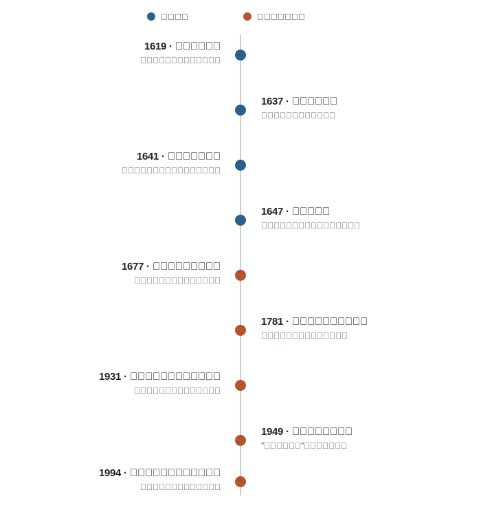
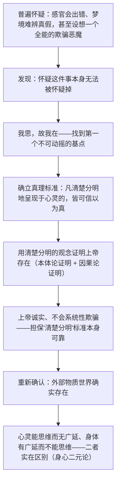

## 《第一哲学沉思集》读书笔记 
  
### 作者  
digoal  
  
### 日期  
2026-06-19  
  
### 标签  
读书笔记 , 第一哲学沉思集  
  
----  
  
## 背景 
  
  

---
书名: 《第一哲学沉思集》（附：反驳和答辩）  
作者: [法] 笛卡尔  
译者: 庞景仁  
出版社: 商务印书馆  
出版年份: 1986-6  
笔记日期: 2026-06-19  
豆瓣链接: https://book.douban.com/subject/1076280/  
豆瓣评分: 8.8 (2342人评价)  
标签: [哲学, 笛卡尔, 西方哲学, 近代哲学, 形而上学, 汉译世界学术名著丛书]  
---

  

> **一句话**：一个人把自己能怀疑的一切都怀疑光了，结果在怀疑本身里摸到了一块石头，然后靠这块石头和"上帝"两样东西，把整个世界重新盖了一遍。  
> **适合谁读**：好奇"我们到底能确定知道什么"的人；想搞懂西方哲学"主客二分"源头在哪的人；不满足于哲学史课本里干巴巴的"我思故我在"四个字，想亲眼看笛卡尔怎么一步步把自己逼到这个结论、又被同行怎么追着打的人。  
> **阅读难度**：⭐⭐⭐⭐☆（正文不长但极度浓缩，后面的反驳与答辩需要一点耐心）  
> **推荐指数**：⭐⭐⭐⭐⭐  
  
---

## 一、时代坐标：这本书从哪里来？

笛卡尔写这本书的时候，欧洲的知识世界还压在经院哲学和教会权威的壳子下面，但裂缝已经很明显了：伽利略因为支持日心说被教会审判，新的数学和力学正在改写人们对自然的理解，可形而上学——关于上帝、灵魂、世界本质的那套学问——还停留在亚里士多德加教父神学的老框架里。笛卡尔很早就意识到，新科学需要一个新的、不依赖经院术语的地基，而不是修修补补旧房子。

据他自述，1619年冬天在多瑙河畔的几个梦之后，他下定决心要靠自己一个人重新搭建知识体系，不再继承任何"别人告诉我"的东西。1637年的《谈谈方法》第一次把"普遍怀疑"的方法论亮相给公众，但写得比较通俗、自传式；1641年，他把这套方法用到极致，写出了拉丁文的《第一哲学沉思集》，正式向巴黎神学院的院长和神师们呈献——这个献辞本身就很有意思：他要争取教会的认可，而不是站到教会的对立面去。

更值得注意的是笛卡尔的操作方式：他没有直接出版，而是先把手稿分送给当时欧洲最重要的一批学者和神学家征求意见，收到反驳后逐条作答，再把这些"反驳和答辩"作为附录一起印出来。这在哲学史上极为罕见——相当于把一次原本只发生在书信来往里的同行评审过程，原样公开给所有读者看。我们今天读到的，其实是一份"半成品被公开拆解"的实录。
  
  

---

## 二、核心命题：作者在说什么？

整本书围绕三个互相咬合的命题展开，缺一个，后面两个都立不住。

### 命题一：怀疑要做到底，才能找到真正靠得住的东西

笛卡尔的怀疑不是怀疑论者那种"反正什么都不能确定，不如躺平"的怀疑，而是一种**方法论怀疑**：先把所有可能有一丝可疑之处的信念统统悬置，看看清空之后还剩下什么。他用梦境难辨真假来怀疑感官经验，又设想一个全能却存心欺骗的"恶魔"，让连数学这种最确定的知识都暂时变得可疑——把怀疑推到能想到的最极端处，才算彻底。

### 命题二：我思，故我在

清空一切之后，唯一剩下的、怎么怀疑都怀疑不掉的，是"怀疑"这个动作本身正在发生——而一个动作在发生，就必然有一个在做这个动作的主体。这就是"我思故我在"。要注意，笛卡尔这里证明的"我"，最初只是一个"在思维的东西"，并不是日常意义上有手有脚有记忆的那个"我"；后面几个沉思要做的，正是从这个极薄的起点，重新把身体、外部世界、他人都挣回来。

### 命题三：靠"清楚分明"和上帝，把整个世界找回来

笛卡尔提出一个真理标准：凡是在心灵中呈现得足够清楚、彼此区分得足够分明的观念，都可以当作真的来接受。但这个标准要可靠，还需要一个保证人——于是他证明了一个不会欺骗人的、完满的上帝存在，由上帝来担保"清楚分明"不会系统性地把人导向错误。有了这层担保，外部物质世界的存在、心灵与身体的实在区别，才能重新一一站住脚。

---

## 三、论证地图：作者怎么说服你的？

支撑这条链条的，是两个非常出名的"演示实验"：

- **蜡块论证**：一块蜡受热后颜色、气味、形状、硬度全变了，可我们仍然认定它是"同一块蜡"。笛卡尔借此说明，把握"它还是这块蜡"靠的不是感官印象（感官印象全变了），而是理智的判断——这是为了证明心灵比物体更容易、更确定地被认识。
- **上帝存在的双重证明**：一是本体论证明，认为"完满的存在"这个概念本身就包含"存在"这个属性，否定上帝存在等于自相矛盾；二是因果论证明，认为我心中那个"无限完满"的观念，其内容的完满程度超出了有限、不完满的我所能凭空制造的，必须有一个真正无限完满的存在作为这个观念的原因。

把这条链条整体打量一下，会发现一个著名的破绽——后来被称为"**笛卡尔循环**"：他先用"清楚分明"证明了上帝存在，又转头用上帝的存在去担保"清楚分明"这个标准本身可靠。这个循环，第四组反驳的作者阿尔诺当时就当面指出来了，笛卡尔的答辩（大意是：清楚分明的当下判断不需要上帝担保，只有对"过去判断过的事"的回忆式确信才需要上帝担保）说服了一部分人，但争论一直延续到今天，仍是笛卡尔研究里绕不开的一个硬节点。

---

## 四、前提假设与边界：什么情况下这不成立？

这套体系能立得住，至少依赖三个不那么显眼的前提：

1. **"清楚分明的观念必然为真"本身是可靠的真理标准。** 一旦放进循环论证的质疑里看，这条标准缺一个独立于体系之外的验证方式，更像是笛卡尔自己设定的游标卡尺，拿它去量自己制造出来的尺子。
2. **心灵可以是一个独立于身体的、能思维而无广延的实体。** 这是整套身心二元论的根基。20世纪以来，无论是分析哲学里赖尔对"范畴错误"的批评，还是神经科学对情绪、决策与身体生理状态深度纠缠的实证发现，都从不同方向动摇了"心灵可以干净地脱离身体存在"这个假设。
3. **存在一个诚实、全能、不会系统性欺骗人的上帝，可以充当真理的最终保证人。** 在17世纪的欧洲，这几乎是论辩双方都默认接受的公共前提；但放到今天这个世俗化、多元信仰的语境里，这一前提已经不再是"无需辩护的起点"，反而成了需要单独论证的一环——这也是这本书对今天的非信仰读者而言，读起来会觉得"地基悬空"的根本原因。

换句话说，这本书的有效边界大致是：**承认存在一个值得信赖的最终担保者、并接受"内省的清楚分明"可以作为真理判据**的思想环境里，整套论证才能顺畅运转；一旦抽掉这两块地板，剩下的"我思故我在"依然是个漂亮的逻辑起点，但从这个起点通往外部世界和身体的那条路，就需要后人重新铺设了——这恰恰是经验论者和康德要去做的工作。

---

## 五、思想谱系：这本书在哪个传统里？

往前看，笛卡尔的内省式怀疑能在奥古斯丁那里找到先声（"我即使错了，犯错这件事也证明了我在"这类论证早已出现），但把怀疑系统化为一整套可操作的方法、并以此重建形而上学，是笛卡尔的真正创造，这也是他常被概括为"近代哲学之父"的原因。

往旁边看，书末收录的几组反驳本身就是一次思想谱系的现场展示：从荷兰神学家高特鲁斯（Caterus）的神学诘问，到英国哲学家霍布斯站在唯物论立场上的正面拆台，再到法国神学家阿尔诺指出循环论证、哲学家伽森狄从经验论角度质疑天赋观念——经院神学、唯物论、经验论几条后来分道扬镳的路线，在这本书里曾经同台辩论过。

往后看，影响脉络分成两支：一支是**继承式的**——斯宾诺莎用几何学方式把笛卡尔式形而上学推到一元论的极致，莱布尼茨的单子论某种程度上是在回应笛卡尔身心二元论留下的"交互难题"；另一支是**批判式的**——休谟和康德分别从经验论和先验哲学的角度，质疑笛卡尔能否真的凭内省就跳到外部世界和上帝；到了20世纪，胡塞尔在《笛卡尔式的沉思》里直接向笛卡尔"致敬并清算"，赖尔的"机器中的幽灵"和达马西奥的"笛卡尔的错误"，则分别从语言哲学和神经科学两个方向，正面拆解身心二元论。一本书能在近四百年里持续被继承、被攻击、被重新发明，本身就是它分量的证明。

---

## 六、我学到了什么？

第一，怀疑原来可以被设计成一种**工具**，而不是一种姿态。笛卡尔的怀疑有明确的终点和建设性目标——清场之后要往上重新盖房子，这和今天常说的"第一性原理思考"几乎是同一个动作：先把所有想当然的假设悬置，找到真正立得住的最小基石，再一步步往回搭建。

第二，"我思故我在"远比哲学史课本里那四个字精巧，也远没有那么"厚重"。它证明的只是一个极薄的逻辑要点——只要"思考/怀疑"这件事在发生，发生这件事的主体就不可能不存在。理解了这个最小化版本之后，才看明白后人对笛卡尔的很多质疑（比如能不能从"我思"推出一个持续存在的、有记忆有人格的"自我"），其实是在追问这个论证本身没有承诺过的东西——这提醒我，评价一个论证之前，先要弄清楚它到底证明了什么，而不是它"听起来"证明了什么。

第三，这本书最打动我的部分，反而不是六个沉思，而是后面的反驳与答辩。看着霍布斯、阿尔诺这些人毫不客气地追问"你凭什么从这一步跳到下一步"，再看笛卡尔如何招架、有时招架得漂亮、有时明显含糊过去，比单读一个论证的最终结论，更能体会哲学论证真正的脆弱与坚韧分别在哪里。

---

## 七、举一反三：这个框架还能用在哪？

1. **做研究或做重大决策前先"清场"。** 把所有依赖的隐含假设一一列出，逐条用最严苛的标准检验，只留下经得起怀疑的部分作为地基——这套动作不限于哲学，写一份商业计划书、设计一个实验、甚至做一次重大的人生选择之前，都值得先做一次"沉思式清场"。
2. **区分"方法论怀疑"和"为怀疑而怀疑"。** 笛卡尔的怀疑有明确终点，不是停留在怀疑本身、什么都不肯相信。这提醒我们，批判性思维的目标不是"全盘不信"，而是"找到值得信的最小基石"——团队讨论里遇到那种永远在挑刺却给不出建设性结论的人，往往就是停在了"怀疑论"而没有走到"方法论怀疑"那一步。
3. **把"最强反对意见"制度化，而不是等它自己找上门。** 笛卡尔主动把手稿分发给可能持不同立场的学者征求反驳，并公开收录答辩——这相当于一种早期的同行评审机制。放到今天，无论写论文、做产品决策还是做投资判断，主动去找最尖锐的反对声音并正面回应，远比关起门来自我说服可靠。

---

## 八、批判与反思

我不完全同意，或者觉得已经被时代甩在后面的地方，主要有三处：

**循环论证没有被真正解开。** 用"清楚分明"证明上帝、再用上帝担保"清楚分明"，这个结构性循环，笛卡尔本人的答辩更像是技术性补丁（区分"当下的清楚分明"和"对过去判断的记忆式确信"），而不是釜底抽薪的解决——这也是这本书留给后世哲学家的最大一块作业。

**身心二元论的"交互问题"几乎没有正面解决。** 如果心灵无广延、身体有广延，二者性质完全异质，它们如何能够互相产生因果作用？笛卡尔在第六个沉思里诉诸生理学上的解释（后人常提到他对脑中某个腺体的猜测），更像是一个权宜的补丁，而非理论上的真正解答，这也直接促使斯宾诺莎和莱布尼茨各自设计出完全不同的形而上学体系来绕开这个难题。

**时代变了的地方很明确：上帝作为"无需辩护的公共前提"已经不存在了。** 在17世纪，论辩双方——不管多激烈——都共享"存在一个诚实的上帝"这个底层假设；今天这个假设本身已经需要单独辩护，于是整套体系对世俗读者而言，第一步要做的反而是替它补上一段它当年不需要写的论证。此外，笛卡尔由二元论推出的"动物只是没有心灵的精巧机器"这一结论，放在今天的动物认知科学面前，明显是一个站不住脚、也付出了真实代价的历史局限。

---

## 九、金句与记忆点

1. **"我思，故我在"**——不是说"我"是一个厚重的灵魂实体，而是说：怀疑这件事正在发生，发生这件事的主体就不可能不存在。这是整本书最薄、也最硬的那个支点。
2. **蜡块论证**——一块蜡受热融化后颜色、气味、形状全变了，我们仍认定它是"同一块蜡"；笛卡尔借此说明，认出"还是这块蜡"靠的是理智判断，而不是感官印象。
3. **全能恶魔假设**——设想一个和上帝一样有力量、却存心欺骗的恶魔，让一切外部世界的印象都可能是幻觉，借此把怀疑推到能想到的最极端处。这是整本书"清场力度"的极限演示。
4. **"清楚分明"（clare et distincte）**——笛卡尔为真理设下的标准：一个观念只要在心灵中呈现得足够清楚、彼此区分得足够分明，就可以当真接受。这把刻度尺后来成了整个理性主义认识论的核心量具。
5. **上帝是"过河的桥"**——上帝存在的证明，在体系里更像一座连接"我思"孤岛与外部世界的桥；一旦心物两个世界各自的真实性被重新确立，这座桥在体系运行上就可以功成身退。这个比喻精准地点出了"上帝"在笛卡尔论证里偏工具性的位置。
6. **反驳与答辩**——书的后半部分收录了多组同时代学者，从神学家到唯物论者，对六个沉思逐条发难，笛卡尔逐条回应。这部分常被读者跳过，却是全书火力最密集、也最见真功夫的地方。

---

## 十、延伸阅读

1. **笛卡尔《谈谈方法》**（商务印书馆）——《沉思集》的"前传"，更通俗、自传性更强，讲清楚普遍怀疑的方法是怎么被构想出来的。
2. **斯宾诺莎《伦理学》**——用几何学的公理化方式，把笛卡尔式形而上学一路推到一元论的极致，是理解"笛卡尔之后会发生什么"的最佳对照。
3. **胡塞尔《笛卡尔式的沉思》**——20世纪现象学直接以《沉思集》为对话对象，既继承内省的方法，又批评笛卡尔止步于把心灵当成另一种"自然物"来处理。
4. **吉尔伯特·赖尔《心的概念》**——20世纪最著名的反笛卡尔二元论文本，"机器中的幽灵"这一批评的出处。
5. **安东尼奥·达马西奥《笛卡尔的错误》**——神经科学家从情绪与身体生理状态的角度，正面挑战笛卡尔式的身心二元论，是这场四百年辩论目前为止比较新的一击。

---

*笔记写于 2026-06-19 | 基于公开资料与深度思考整理*
  
  
#### [PostgreSQL 解决方案集合](../201706/20170601_02.md "40cff096e9ed7122c512b35d8561d9c8")
  
  
#### [德哥 / digoal's Github - 公益是一辈子的事.](https://github.com/digoal/blog/blob/master/README.md "22709685feb7cab07d30f30387f0a9ae")
  
  
#### [About 德哥](https://github.com/digoal/blog/blob/master/me/readme.md "a37735981e7704886ffd590565582dd0")
  
  

  
