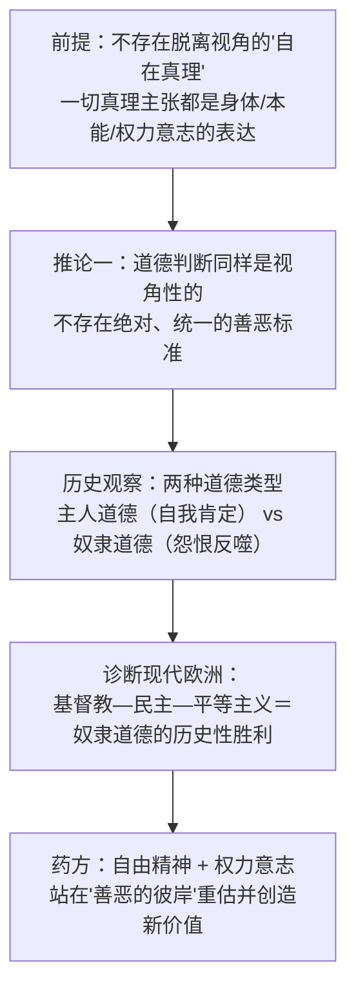
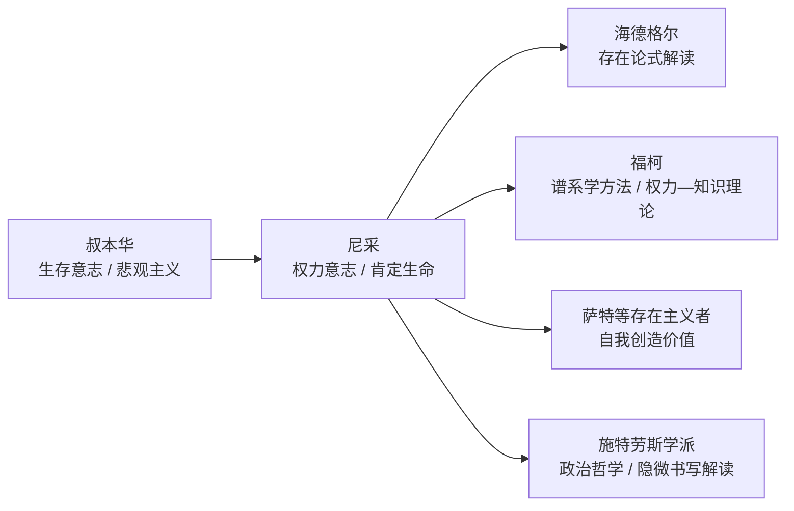

## 《善恶的彼岸》读书笔记 
  
### 作者  
digoal  
  
### 日期  
2026-06-19  
  
### 标签  
读书笔记 , 善恶的彼岸  
  
----  
  
## 背景 
  
  

---
书名: 《善恶的彼岸》  
作者: [德] 尼采  
译者: 赵千帆  
出版社: 商务印书馆  
出版年份: 2015-12  
页数: 313  
丛书: 汉译世界学术名著丛书·哲学  
笔记日期: 2026-06-19  
豆瓣链接: https://book.douban.com/subject/26663535/  
豆瓣评分: 暂未能从豆瓣页面直接抓取确切分数（页面有反爬限制），据其他售书平台显示该版本评分约 9.1，仅供参考  
标签: [尼采, 道德哲学, 权力意志, 主奴道德, 视角主义, 德国哲学]  
---

  

> **一句话**：尼采举起一把哲学的锤子，敲开两千年道德传统的地基，邀请还能站立的"自由精神"走到善恶之外，去重新创造属于未来的价值。  
> **适合谁读**：对道德判断背后的心理动机、权力与历史起源感兴趣，能接受格言体、非系统化阅读节奏，且不害怕被冒犯既有道德直觉的读者。  
> **阅读难度**：⭐⭐⭐⭐☆（4/5）  
> **推荐指数**：⭐⭐⭐⭐☆（4/5）  
  
---

## 一、时代坐标：这本书从哪里来？

1886年，尼采42岁，已经是一个被欧洲学术界遗忘的人。七年前他因严重的头痛、胃病和近乎失明而辞去巴塞尔大学的教职，此后十年一直在尼斯、热那亚、西尔斯-马利亚等地辗转养病，几乎与家人、学界断绝往来。1882年，他与才华横溢的莎乐美（Lou Salomé）经历了一段炽热而失败的感情，这段挫折让他更深地退入孤独。1883至1885年间，他写下了《查拉图斯特拉如是说》四卷，自认为这是足以"开天辟地"的著作，却几乎无人问津——最后一部甚至只印了几十本送人。

正是在这种几近被世界遗忘的处境里，尼采决定换一种方式重新说一遍同样的话：不再用先知寓言式的诗体，而是用更具论辩性、更容易被"读懂"（也更容易被攻击）的哲学语言。《善恶的彼岸》于1885年夏动笔，1886年冬完成，因为前作惨淡的销量，他甚至需要自己出钱印刷出版。副标题"一种未来哲学的序曲"，点出了它的位置：不是终点，而是为日后更系统的《强力意志》计划清理地基的"拆除工程"。

```
1876左右  与瓦格纳决裂 ── 思想独立的起点
    │
1879   因病辞去巴塞尔教职 ── 开始十年漂泊养病
    │
1882   与莎乐美感情破裂 ── 个人生活跌入孤独
    │
1883–1885  《查拉图斯特拉如是说》── 诗化表达，反响惨淡
    │
1885夏–1886冬 动笔并完成《善恶的彼岸》── 改用论辩体"翻译"同一套思想
    │
1886   自费出版 ── 副标题"一种未来哲学的序曲"
    │
1887   《论道德的谱系》── 回应批评，系统化"主奴道德"论证
    │
1889   都灵街头精神崩溃 ── 此后再未写作
```

---

## 二、核心命题：作者在说什么？

### 观点一：哲学家自称的"真理"，多半是伪装的偏见
尼采开篇就质问：两千年来的哲学家自称在追求客观真理，可他们的体系往往和自己的人格、欲望、恐惧高度吻合——这不太像是巧合。他提出一种"视角主义"：人不可能站在身体、立场、利益之外去认识世界，一切"真理"主张其实都是某种特定视角的产物。哲学家的工作，与其说是发现真理，不如说是为自己内心已经确定的东西寻找论证。

### 观点二：道德不是一种，而是两种——主人道德与奴隶道德
在第五章"道德的自然史"里，尼采提出全书最具冲击力的论断：历史上存在两种根本对立的价值评判方式。"主人道德"由强者、贵族自发创造，"好"等同于强健、高贵、自我肯定；"奴隶道德"则由被压抑者出于怨恨而发明，他们把强者重新定义为"恶"，把自己的软弱、谦卑、忍耐包装成"善"。尼采认为，现代欧洲的基督教与民主平等思想，正是这场"奴隶道德"历史性胜利的延续。

### 观点三：驱动生命的根本力量是"权力意志"
尼采用"权力意志"（Wille zur Macht）取代叔本华的"求生存意志"——生命的根本驱动不是单纯地活下去，而是自我扩张、自我克服、不断创造和超越自身。在他看来，真正的"未来哲学家"不该只是认识世界的旁观者，而应是敢于"立法"的人：他们的创造本身就是对价值秩序的重新书写。

---

## 三、论证地图：作者怎么说服你的？



这本书几乎没有统计数据，因为它本质上是一部格言体哲学著作，而非经验研究。尼采的论证方式主要靠两种手法：一是心理学式的"揣测"，反复猜测对手（哲学家、基督徒、民主派、英国功利主义者）观点背后真正的心理动机；二是历史谱系式的追溯，把一种道德观念还原到它最初产生的社会处境中去。第四章"箴言和间奏曲"则干脆放弃了论证，只留下一两句话的断言，逼着读者自己去补全逻辑链条。

这种写法的代价也很明显：尼采常常用"我猜""或许是因为"这样的措辞，把对方观点的真假问题，偷换成了对方动机的好坏问题——这在逻辑学上被称为"起源谬误"（用一个观点从哪里来，去判断它对不对，而不是检验它本身）。书中对女性、犹太人、英国人、德国人等群体的整体性论断，也明显带有19世纪欧洲知识分子的时代偏见，今天读需要带着历史眼光，而不能直接搬用。

---

## 四、前提假设与边界：什么情况下这不成立？

1. **存在一种"更高视角"能跳出一切视角去做判断。** 尼采主张一切真理都是视角性的，可他自己关于"权力意志""主奴道德"的论断，又像是站在某个更高、更真的位置上说出来的。如果一切都是视角，他的视角凭什么例外？这是视角主义哲学一直要面对的自我指涉难题，尼采在书中其实有所察觉，却没有彻底解开。

2. **人类社会必然、且应当分化为强者与弱者两个阵营。** 这个判断更像类比和直觉，而非严密论证。现代演化生物学与博弈论已经证明，互惠合作本身也可以是一种非常"强"的生存策略，并不只是弱者怨恨的产物——这削弱了"强弱二分"作为唯一解释框架的说服力。

3. **同情、平等、谦逊这些价值的根源只能是"怨恨"。** 尼采把现代道德的起源归结为单一心理动因，忽略了这些价值也可能来自真实的合作收益和共同体维系需要。一旦换一套更"平实"的演化或社会学解释框架，他的不少论断就会失去立足点。

---

## 五、思想谱系：这本书在哪个传统里？

尼采属于19世纪"生命哲学"传统，他既是叔本华的学生，又是其最彻底的反叛者：保留了"意志"作为世界根本驱动力的框架，却把叔本华悲观厌世的"求生存意志"，翻转成了肯定生命、不断自我超越的"权力意志"。



二十世纪，这本书的影响沿着两条几乎不相交的路径展开：一条是海德格尔将"权力意志"读成尼采形而上学的核心命题，影响了战后欧陆哲学对"存在"与"虚无主义"的讨论；另一条是福柯借用尼采的"谱系学"方法，去分析权力如何生产知识、塑造主体，深刻影响了后结构主义。还有一条更隐蔽的脉络，是以施特劳斯为代表的政治哲学解读，强调本书"显白与隐微"并存的写作策略，认为尼采在格言之间藏着一套关于政治与立法的隐秘论证。

---

## 六、我学到了什么？

读完最大的收获，是养成了一个习惯性的提问：一种道德判断在保护谁，又在压制谁？尼采教我把"这是不道德的"这类断言，往回拆解一层，去看它背后的利益结构和心理动机——哪怕最后我不同意他的具体结论，这个拆解动作本身已经很有用。

第二个收获，是意识到"同情""平等""谦逊"这些我从小被教育要珍视的美德，其实都有具体的历史起源，并不是天经地义、从天而降的。这不是说要否定它们，而是提醒自己：任何被继承下来的价值，都值得被重新审视、重新选择一次，而不是因为"大家都这么说"就默认接受。

第三个收获，恰恰是在批判尼采的过程中获得的："视角主义"提醒我警惕"我的看法就是真理"这种执念，但当我发现尼采自己也没能跳出这个陷阱时，反而更深地理解了这个工具的边界——读哲学最有趣的地方，就是可以拿作者自己的武器，回头检验作者本人。

---

## 七、举一反三：这个框架还能用在哪？

**职场与组织文化**：可以用"主奴道德"的视角去审视团队里被反复强调的"美德"——"无条件奉献""绝对服从"，到底是真正促进集体创造力的价值，还是管理者用来巩固自身权力、压制异议的话语包装。

**社交媒体上的道德义愤**：每一轮网络集体谴责风潮里，都可以追问一句：这是真实的正义关切，还是借助"集体道德优越感"来宣泄个体的无力感？尼采式的"怨恨"分析，能帮人在跟风之前先停一拍。

**个人自我评价**：用"权力意志"重新理解自己想变得更强、更优秀的欲望，不必因为这种野心而感到"政治不正确"的羞耻——但同时也要记住第四节里提到的边界：自我超越不能用来碾压他人正当的权利，这条线尼采本人并没有划得很清楚，需要读者自己补上。

---

## 八、批判与反思

我不同意尼采对"强者/弱者"二分的执着——它把丰富的人类合作史简化成了一场单向度的等级斗争，遮蔽了互惠与协作同样可以是一种"强"的生存策略。

时代已经变了的地方也很明显：书中关于女性、犹太人、英国人、德国人的大量整体性论断，带着浓厚的19世纪欧洲知识分子偏见，今天读必须放进具体历史语境，而不能直接当作普遍真理来用。

这本书最大的局限，在于它的格言体本身：警句式的写法极具煽动力，却天然缺乏系统论证，极易被断章取义——20世纪纳粹意识形态对尼采的扭曲挪用，就是一个惨痛的历史教训（尽管大多数严肃学者都认为这是对尼采思想的误读）。单独摘出某一句箴言去理解尼采，风险远大于收益。

---

## 九、金句与记忆点

> 以下几句格言在不同中文译本里措辞略有差异，这里选用流传较广的表述，并附上我自己的理解。

1. **"与怪物战斗的人，应当小心自己不要成为怪物；当你凝视深渊时，深渊也在凝视着你。"**（第四章，第146节）
   尼采对"以恶制恶"的警告：长期专注于对抗某种黑暗，本身就有被那种黑暗同化的风险。

2. **"真理是个女人。"**（序言开篇的著名隐喻）
   尼采用这个挑衅性的比喻嘲讽独断论哲学家：他们以为可以靠强行占有去获得真理，却恰恰因此与真理失之交臂。

3. **"常常谈论自己的人，往往只是为了隐藏自己。"**
   一句关于"自我暴露"心理学的犀利观察：过度的自我陈述，常常是一种障眼法。

4. **"所谓高贵的灵魂，即对自己怀有敬畏之心。"**
   呼应尼采对"自我立法"的强调——尊严不是别人给的评价，而是对自己设下标准。

5. **"出于爱所做的事，总是发生在善恶的彼岸。"**
   与书名直接呼应：尼采认为最强烈的生命冲动（爱、创造）本就溢出了寻常善恶评判的框架。

6. **主人道德 / 奴隶道德的二分**（核心概念而非直接引文）
   全书最具杠杆效应的一对概念：把"道德"从绝对真理，还原为不同生命类型自我评价的历史产物。

---

## 十、延伸阅读

1. **尼采《论道德的谱系》**——本书的直接姊妹篇，专门用三篇论文系统论证"主奴道德"与"怨恨"概念，是理解《善恶的彼岸》第五章最好的补充材料。
2. **尼采《查拉图斯特拉如是说》**——用诗性寓言语言表达同一套思想的"前传"，对照阅读能更直观感受尼采从诗体到论辩体的转换。
3. **朗佩特（Laurence Lampert）《尼采的使命——〈善恶的彼岸〉绎读》**——以施特劳斯学派视角逐节解读本书，强调其"显白与隐微"并存的政治哲学维度，适合想深挖文本结构的读者。
4. **福柯《尼采、谱系学、历史》**——展示尼采的谱系学方法如何被二十世纪思想家改造，用于分析权力与知识的共生关系。
5. **一部当代道德哲学导论（如桑德尔的相关著作）**——提供一个建立在"平等"与"程序正义"基础上的现代参照系，便于和尼采的精英主义道德观形成对照阅读。

---

*笔记写于 2026-06-19 | 基于公开资料与深度思考整理。书中涉及人名、年代等史实信息已尽量核实，个别细节（如具体出版细节）因年代久远、资料分散，建议读者交叉参考权威传记进一步确认。*
  
  
#### [PostgreSQL 解决方案集合](../201706/20170601_02.md "40cff096e9ed7122c512b35d8561d9c8")
  
  
#### [德哥 / digoal's Github - 公益是一辈子的事.](https://github.com/digoal/blog/blob/master/README.md "22709685feb7cab07d30f30387f0a9ae")
  
  
#### [About 德哥](https://github.com/digoal/blog/blob/master/me/readme.md "a37735981e7704886ffd590565582dd0")
  
  

  
