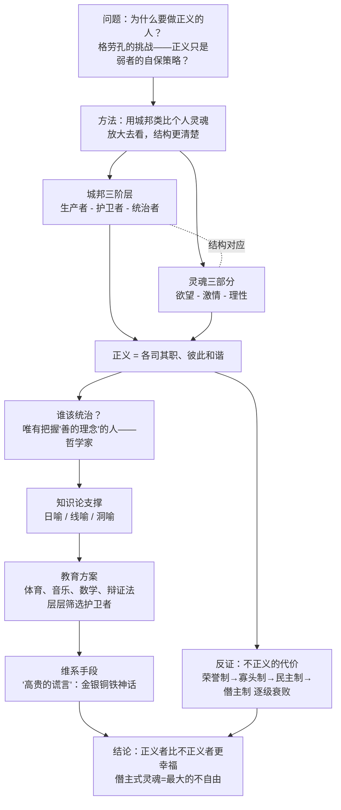
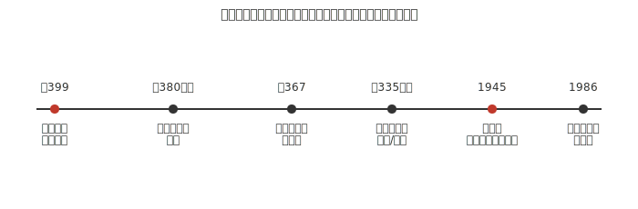

## 《理想国》读书笔记 
  
### 作者  
digoal  
  
### 日期  
2026-06-19  
  
### 标签  
读书笔记 , 理想国  
  
----  
  
## 背景 
  
  

---
书名: 《理想国》  
作者: [古希腊] 柏拉图（译者：郭斌和 / 张竹明）  
出版年份: 1986-8（商务印书馆·汉译世界学术名著丛书；原书约成于公元前380年前后）  
笔记日期: 2026-06-19  
豆瓣链接: https://book.douban.com/subject/1004821/  
豆瓣评分: 8.8（41685人评价）  
标签: [哲学, 政治哲学, 古希腊哲学, 西方哲学奠基之作, 经典]  
---  
  
  

> **一句话**：一本试图用"先把字放大去看清楚，再缩小回来读自己"的方式，回答"人为什么要做一个正义的人"的两千四百年老问题。  
> **适合谁读**：对政治哲学、教育、人性结构感兴趣的人；想理解西方"专家治理 vs 民主"之争源头的人；任何愿意花时间被苏格拉底反复"逼问"的人。  
> **阅读难度**：⭐⭐⭐⭐☆（对话体不难读，但论证层层嵌套，需要耐心跟苏格拉底绕远路）  
> **推荐指数**：⭐⭐⭐⭐⭐  
  
---

## 一、时代坐标：这本书从哪里来？

《理想国》写于雅典由盛转衰的伤口上。伯罗奔尼撒战争耗尽了"黄金时代"的余晖，雅典在战败与动荡中先后经历寡头复辟与民主反复，而公元前399年，民主政体的雅典法庭以"蛊惑青年、不敬城邦神"为名判处苏格拉底死刑——这件事对当时二十多岁的柏拉图是决定性的打击。他出身雅典名门，本有意从政，苏格拉底之死却让他对当时所见的每一种政体（贵族制、寡头制、民主制）都失去了信任。此后他游历多年，又三次远赴叙拉古，试图说服当地僭主以哲学治国，三次都以失败告终。《理想国》正写在这种"现实政治屡屡令人失望、却仍不甘心放弃政治"的心境里：它表面在问"什么是正义"，骨子里是在问——苏格拉底那样的人，为什么会被这样的城邦杀死？怎样的城邦，才配得上一个哲学家去治理？

---

## 二、核心命题：作者在说什么？

### 观点一：正义不是规则，而是"各司其职"的秩序

格劳孔向苏格拉底抛出一个尖锐的挑战：人做正义的事，会不会只是因为软弱、怕被报复，而不是因为正义本身值得追求？苏格拉底的回应方式很巧妙——他说个体的正义太小、太难看清，不如先去看"放大版"的正义，也就是一个城邦的正义。于是他构造了一个由生产者、护卫者（军人）、统治者三个阶层组成的城邦，并主张：正义就是每个阶层各守本分、不越界。再把这个结构"缩回"个人身上，对应灵魂中的欲望、激情、理性三部分——一个人正义，就是理性统御、激情辅助、欲望服从，三者各居其位、协调如一。这一步把"正义"从一种外在的行为规范，改写成了一种内在的结构性秩序问题，是全书最关键的方法论转折。

### 观点二：知识即德性，统治需要哲学家

柏拉图认为，凭经验、习俗、利益办事的统治者必然带来混乱，因为感官世界本身就是不可靠的"影子"，唯有通过理性把握"理念"——尤其是"善"本身——才算获得真知识。他借由日喻、线喻、洞喻三个层层递进的比喻论证这一点：太阳照亮可见世界，正如"善的理念"照亮可知世界；线段被分割为不同等级的认知层次；而最著名的洞穴比喻，则把人类大多数时候的认知状态比作被锁链困在洞穴里、只能看见墙上影子的囚徒。由此他得出一个在当时（也在今天）都极具冒犯性的结论：除非哲学家成为统治者，或者统治者真正研习哲学，否则城邦的祸患不会停止。

### 观点三：政体会按一种可预测的方式衰败

柏拉图描绘了理想政制如何依次堕落为荣誉政制、寡头政制、民主政制，最终滑向僭主政制——每一次堕落都对应着灵魂主导部分的退化：从理性，到血气与荣誉，到欲望的混乱争夺，最后到被最低劣欲望彻底奴役的僭主式灵魂。为了让设计好的城邦秩序能够维系下去，他还设计了一则"高贵的谎言"：让公民相信自己天生就被造物主分别掺入了金、银、铜铁，因而注定属于不同的阶层。这是全书最具争议、也最常被后人攻击的设计。

---

## 三、论证地图：作者怎么说服你的？

整部对话录的论证像一条不断"放大—缩小"往返的链条：从个体正义的疑问出发，绕道城邦，再绕回个体；中途又被"三次浪头"（妇女平等参政、共产共妻共子、哲学王统治）反复打断、反复重启。下面这张图大致还原了这条主线：

论证中最值得留意的是它的"数据"——柏拉图几乎不用经验事实，而是反复使用比喻和理想化模型（洞穴、太阳、线段、金银铜铁神话）。这种"以隐喻代证据"的方式极具说服力和文学感染力，但也意味着许多关键命题（比如"知识即德性"）更接近一种信念宣告，而不是经过实证检验的结论——这也正是后世批评者最常攻击的薄弱点。

---

## 四、前提假设与边界：什么情况下这不成立？

第一个隐含假设是"同构假设"：城邦的三阶层真的能和灵魂的三部分一一对应吗？这更像是一个极具启发性的类比，而未必是严格的逻辑证明，现代社会学、心理学未必接受这种简洁的对应关系。第二个假设是"知识即德性"：一个真正掌握真理的人，会自动按真理行事，不会被权力本身腐蚀。这忽略了权力对人的反向塑造作用——后世"权力导致腐败"的政治学常识，正是对这一假设最直接的反驳。第三个假设是一种"静态治理观"：柏拉图设想理想城邦一旦设计完成就应尽量保持不变，他对"变化"本身怀有戒心，这预设了存在一个一次性可以找到、并值得永久冻结的"正确答案"。在价值多元、社会快速变迁的今天，这种治理观的适用边界相当有限——作为对"正义本质""教育与权力关系"的哲学追问，《理想国》至今依然锋利；但作为可直接照搬的政治制度蓝图，它从未在现实中被证明可行，连柏拉图本人三次叙拉古之行的失败，都已经是最早的反例。

---

## 五、思想谱系：这本书在哪个传统里？

柏拉图接过了苏格拉底"不断诘问、自我省察"的精神，把它系统化为一整套形而上学—知识论—政治学的体系，由此被怀特海称为"西方哲学不过是对柏拉图的一系列注脚"。他最重要的学生亚里士多德在《政治学》中针锐反驳了财产共有制与理想城邦的不现实性，转向了更经验、更多元政体比较的研究路径，师徒二人的分歧成为西方政治哲学最早的一次"内部辩论"。20世纪，卡尔·波普尔在《开放社会及其敌人》中将矛头直指柏拉图，指责"哲人王"观念中潜藏着极权主义的逻辑根源；与此相对，列奥·施特劳斯及其后学则主张回到古典语境，认为"哲人王"更接近一种思想实验，本意是让权力服从理性而非鼓励现实集权。这场延续两千多年的"挺柏"与"反柏"之争，本身已经成为理解整个西方政治思想史的一条主线。
  
  
  
---

## 六、我学到了什么？

第一个收获，是重新理解"放大类推"这种思考方法本身的力量：把一个抽象到难以下手的伦理问题（什么是正义？）放大成一个可以被结构化设计的对象（一个城邦该怎么分工？），再缩回个人身上——这种"先放大再缩小"的迂回，本身比最终给出的答案更让我受用。第二个收获，是柏拉图把"专家治理"与"民主"之间的张力第一次摆到了台面上：让最懂的人做决定，听起来天经地义，可哲人王的逻辑放到今天，依然以技术官僚治理、央行独立性、甚至"AI价值对齐由谁定义"等各种形式反复出现——理想国提醒我，这条路径有多诱人，背后就藏着多大的风险。第三个收获，是洞穴比喻给我的一种持续的认知谦逊：我意识到自己很可能也生活在某个"洞穴"里，把习以为常的"影子"当作全部真实——这不是一次性获得的觉悟，而是需要反复提醒自己保持怀疑的姿态。

---

## 七、举一反三：这个框架还能用在哪？

"三阶层同构"的方法可以迁移到组织治理上：一个团队的"理性（战略层）—激情（中层管理）—欲望（基层执行）"是否各司其职、配合默契，往往就决定了这个组织的健康程度，这比单纯讨论"该不该加薪"更接近问题的根源。在个人决策层面，灵魂三分提示我们，内心的纠结往往不是单一动机在作怪，而是理性、血气（荣誉感/自尊）、欲望三方力量在博弈，理解这一点能帮助我们更精细地拆解自己的犹豫，而不是简单归因为"我意志力不够"。在公共议题上，每当看到"专家治理 vs 大众参与"的争论——疫情防控该听谁的、AI该由谁监管、央行决策该不该接受问责——理想国都提供了一个经典的思想起点：去追问权力与知识应该如何匹配，以及谁来决定"谁更懂"。

---

## 八、批判与反思

我最不能接受的，是理想国对诗人和虚构叙事的不信任，以及统治阶层可以使用"高贵的谎言"来维系秩序的设计——这正是波普尔批判的核心：一旦用"真理"之名去裁定谁该统治、谁该被统治，社会就很容易滑向排斥异见、压制多元的封闭状态。从今天回看，书中对妇女、奴隶的态度也清楚暴露了古典城邦的历史局限：女性可以担任护卫者这一点，在当时确实超前；但奴隶制度从未被柏拉图真正质疑过，这提醒我们经典著作的"超前"与"局限"往往同时存在，不该被简化为单一标签。不过把柏拉图直接等同于"极权主义先驱"也未必公允——施特劳斯学派的反驳值得认真对待：理想国更像是一次思想实验式的"极限测试"，目的是逼近"正义本身"的概念，而非一份现实政纲；柏拉图晚年转而写作更强调法治、更接近现实操作的《法律篇》，本身就说明他自己也意识到了"哲人王"理想难以落地。

---

## 九、金句与记忆点

1. **"正义即各司其职"**——全书正义观的核心浓缩，把伦理问题转化为结构问题。
2. **洞穴比喻**——人类认知从被锁链困住、只见影子，到走出洞穴、直面阳光的隐喻，是关于教育与启蒙最经典的意象。
3. **哲学家为王，或国王研习哲学**——知识与权力结合的理想模型，也是后世争议最大的命题。
4. **"高贵的谎言"（金银铜铁神话）**——用神话维系社会等级秩序的设计，是理想国最受争议的部分。
5. **灵魂三分：理性—激情—欲望**——后世许多心理结构理论（如本我/自我/超我）都能在这里找到古典先声。
6. **四种衰败政体**：荣誉制→寡头制→民主制→僭主制——一套对权力如何逐级堕落的预言式描述。
7. **诗人被逐出理想城邦**——艺术与真理、情感与理性之间的张力，由此开启了西方文艺理论最古老的一场争论。
8. **日喻、线喻、洞喻**——三个层层递进的比喻，构成柏拉图整套知识论体系的支架。

---

## 十、延伸阅读

1. **亚里士多德《政治学》**——理想国最直接的"回应者"，从经验和多元政体比较的角度反驳柏拉图的乌托邦设计，适合对照阅读，看师徒二人如何分道。
2. **卡尔·波普尔《开放社会及其敌人》（第一卷）**——20世纪对理想国最猛烈的政治学批判，能帮你理解这本书为何会被贴上"极权主义起源"的标签。
3. **柏拉图《法律篇》**——柏拉图晚年作品，代表他从"哲人王"理想转向"法治"现实的思想转变，是理解理想国局限性的最佳续篇。
4. **列奥·施特劳斯关于柏拉图政治哲学的研究**——古典政治哲学复兴学派对理想国更"同情式"的另一种解读路径，可与波普尔的批判形成对照。
5. **汉娜·阿伦特《人的境况》或《极权主义的起源》**——延伸思考"哲人王理想"与20世纪现实极权主义之间到底有怎样复杂、甚至矛盾的关系。

---

*笔记写于 2026-06-19 | 基于公开资料与深度思考整理*
  
  
#### [PostgreSQL 解决方案集合](../201706/20170601_02.md "40cff096e9ed7122c512b35d8561d9c8")
  
  
#### [德哥 / digoal's Github - 公益是一辈子的事.](https://github.com/digoal/blog/blob/master/README.md "22709685feb7cab07d30f30387f0a9ae")
  
  
#### [About 德哥](https://github.com/digoal/blog/blob/master/me/readme.md "a37735981e7704886ffd590565582dd0")
  
  

  
