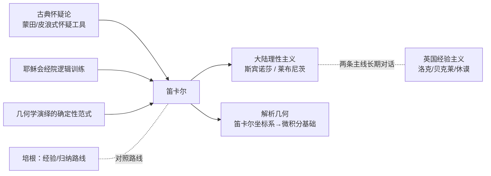

## 《谈谈方法》读书笔记 
  
### 作者  
digoal  
  
### 日期  
2026-06-20  
  
### 标签  
读书笔记 , 谈谈方法  
  
----  
  
## 背景 
  
  

---
书名: 《谈谈方法》  
作者: [法] 勒内·笛卡尔  
译者: 王太庆  
出版社: 商务印书馆  
出版年份: 2000-11  
丛书: 汉译世界学术名著丛书·哲学  
页数: 95  
定价: 13.00元  
笔记日期: 2026-06-20  
豆瓣链接: https://book.douban.com/subject/1071023/  
豆瓣评分: 8.7（6923人评价）  
标签: [哲学, 笛卡尔, 方法论, 西方哲学, 近代哲学, 法国]  
---

  

> **一句话**：笛卡尔用一本薄薄的"思想自传"告诉所有人——真理不需要仰仗权威，只需要经得起怀疑的拷问。  
> **适合谁读**：想搞清楚"现代科学方法到底从哪来"的人；对"如何正确思考"本身感兴趣的人；哲学入门读者  
> **阅读难度**：⭐⭐☆☆☆（全书不到百页，半自传体写法，是公认最好读的哲学经典之一）  
> **推荐指数**：⭐⭐⭐⭐⭐  
  
---

## 一、时代坐标：这本书从哪里来？

1633年，伽利略因为支持"地球绕太阳转"被罗马教会判罪监禁。这一年，笛卡尔已经写完了一部更野心勃勃的自然哲学大书《论世界》，准备出版。消息传来，他被吓住了，一度想把所有手稿付之一炬。最终他选择了一条更谨慎的路：把《论世界》压进抽屉（直到他死后27年才问世），转而用一种"以退为进"的方式重新出场——写三篇具体的科学论文（《光学》《气象学》《几何学》），再在前面加一篇不到百页的方法论引言，作为整本书的"说明书"。这就是1637年问世的《谈谈方法》，全名其实是《谈谈正确运用自己的理性在各门学问里寻求真理的方法》。

更值得注意的是一个容易被忽略的细节：这本书是用法语写的，不是当时学术界通用的拉丁文。笛卡尔出身耶稣会名校拉夫莱公学，受过最正统的经院哲学训练，却偏偏选择让普通识字的人也能读懂自己的思考过程。这个选择本身就是他方法论的一次示范——不预设"只有学者有资格谈真理"，先把权威的门槛踢开再说。

那是一个经院哲学（以亚里士多德—阿奎那体系为基础）仍然统治学术界、教会与新兴科学水火不容的时代。笛卡尔少年时亲眼见证了伽利略发明天文望远镜带来的轰动——月球表面凹凸不平、木星有卫星、太阳有黑子，这些发现彻底打碎了"肉眼可见即真理"的旧常识。他要解决的问题是：在教会的审视下、在经院哲学的废墟上，普通人到底能不能找到一种**不靠权威、不靠书本、只靠自己的理性**就能抵达的可靠知识？

```
1596 笛卡尔生于法国
  │
1616 拉夫莱公学毕业，获法学硕士
  │
1628 移居荷兰，开始系统研究自然哲学
  │
1633 伽利略受审 → 笛卡尔搁置《论世界》手稿
  │
1637 匿名出版《谈谈方法》（连同光学/气象学/几何学三篇附录）
  │
1641 《第一哲学沉思集》——把"我思故我在"的论证彻底展开
  │
1649 受瑞典女王克里斯蒂娜邀请赴斯德哥尔摩
  │
1650 病逝于斯德哥尔摩，享年54岁
```

---

## 二、核心命题：作者在说什么？

### 观点一：怀疑是清理地基的工具，不是目的本身

笛卡尔提出"普遍怀疑法"：把一切从小到大被告知、被教导、未经自己理性检验就接受下来的看法，统统先放到一边——不管它来自亚里士多德，还是来自教会。但要分清楚，他怀疑的目的不是停留在怀疑里（那是怀疑论者的做法），而是像盖房子前先把松软的沙土清空，直到挖到坚实的岩石为止。怀疑在他手里是一把铲子，不是一座牢笼。

### 观点二：我思故我在——废墟里挖出的第一块岩石

把所有能怀疑的东西都怀疑掉之后，笛卡尔发现还剩下一件事无法被怀疑："我正在怀疑"这件事本身正在发生。怀疑也是思考的一种，而思考的发生本身就需要一个在思考的"我"存在。这就是那句流传最广的哲学命题的由来——它不是一句励志口号，而是笛卡尔在彻底拆完整座知识大厦之后，找到的唯一一块无法再被拆掉的砖。

### 观点三：方法可以变成可执行的规则，不必依赖天才直觉

这是全书真正"方法论"意义上的核心：笛卡尔把"如何获得可靠知识"提炼成四条具体规则——不轻信任何未经自己彻底审视的东西；把复杂问题拆成尽可能小的部分；按由简到繁的顺序逐一解决；最后全面复查确保没有遗漏。换句话说，他想做的不是当一个聪明的天才，而是把"聪明"这件事变成一套人人可以照着执行的程序。这正是这本书被称为"近代科学方法宣言书"的原因。

---

## 三、论证地图：作者怎么说服你的？

```mermaid
flowchart TD
    A[经院权威 / 书本知识 / 童年偏见] -->|普遍怀疑法逐一剔除| B[只剩下可疑的废墟]
    B --> C[发现唯一无法怀疑的事实：怀疑/思考这件事正在发生]
    C --> D["我思故我在"：第一块不可动摇的基石]
    D --> E[追问：为什么"清楚分明的观念"就一定为真？]
    E --> F[引入一个不会欺骗人的上帝作为担保]
    F --> G[由此重新确认：物质世界、他人心灵确实存在]
    G --> H[提炼出四条方法规则：不轻信/分解/排序/复查]
    H --> I[应用到具体学科：光学、几何学、解剖学……]
```

这条逻辑链最精彩的地方在于**从怀疑到确定的反转**——他没有用更多证据去对抗怀疑，而是把怀疑本身变成了证据。但这条链也有一个明显的接口：从"我思"跳到"外部世界存在"，中间垫了一块"上帝不会欺骗我"的垫脚石。这块垫脚石撑得住吗？这正是后面要批判性审视的地方。

笛卡尔用的"案例"也很有意思：他几乎不引用任何前人的论述当证据，而是反复用几何学和数学作类比——因为在他看来，数学命题是当时唯一一种"人人靠自己理性推导、结论却完全一致"的知识，这正是他想要的范本。

---

## 四、前提假设与边界：什么情况下这不成立？

**假设一：存在一个不会欺骗人的上帝，担保"清楚分明的观念"必然为真。**
这是后来哲学史上著名的"笛卡尔循环"争议：他先用"清楚分明"的标准证明了上帝存在，又反过来用上帝的存在去担保"清楚分明的观念为真"——论证的起点和终点互相支撑，像是悬在空中。在今天高度世俗化的认识论里，几乎没有哲学家还愿意借助上帝来担保真理，这块地基在四百年后已经塌了一半。

**假设二：心灵和身体是两个完全独立、性质不同的实体（身心二元论）。**
神经科学家安东尼奥·达马西奥在《笛卡尔的错误》里用大量临床证据证明：人类的理性决策离不开身体情绪状态的参与，情绪不是"理性的杂音"，而是理性运转的一部分。笛卡尔把心和身切割开的那把刀，被现代脑科学证明切错了地方。

**假设三：任何复杂问题都可以被拆解成简单部分，解决完再综合复原。**
在牛顿力学式的"可分解世界"里，这套方法极其有效，三百年的近代科学几乎都是照这个方法走的。但碰到系统性、非线性、会"涌现"出新性质的复杂问题——生态系统、人体的整体机能、复杂的人工智能行为——简单部分相加并不等于整体。系统工程和复杂性科学的出现，正是对"化繁为简"这条规则边界的修正，而不是推翻。

---

## 五、思想谱系：这本书在哪个传统里？



笛卡尔不是凌空出现的——他把古典怀疑论的"工具"、经院哲学的"逻辑训练"和数学的"确定性范式"重新组装，造出了一套全新的认识论起点。同时代的伽桑狄、霍布斯当时就直接写信反驳过他（这些"反驳与答辩"后来被收进《第一哲学沉思集》），可见这套方法从一开始就不是"一锤定音"，而是被激烈辩论出来的。

往后看，他直接催生了斯宾诺莎和莱布尼茨的大陆理性主义传统；他在书的附录《几何学》里顺手提出的坐标系概念，成了牛顿、莱布尼茨发明微积分的基础工具。而他那套"四步法"，在20世纪中叶之前，几乎是西方科学研究（从机械学到人体解剖）的标准操作程序，直到系统工程在阿波罗登月这类复杂工程中出现，"分解-复原"的方法论才第一次被"综合性方法"部分接管。

---

## 六、我学到了什么？

读完最触动我的，是发现笛卡尔讲的"怀疑"和我们日常理解的"怀疑"完全不是一回事。我们习惯把怀疑当成一种消极、拖延、甚至有点丧的姿态——"这事儿我也不确定"。但笛卡尔的怀疑是主动的、有方向的，它的终点不是"无法确定"，而是"先清空再重建"。这让我意识到，怀疑本身可以是一种建设性的工具，而不只是逃避判断的借口。

第二个收获是关于方法论本身的价值。笛卡尔最大的贡献或许不是"我思故我在"这句名言，而是他证明了：**"如何获得知识"这件事是可以被拆解成步骤、可以被传授、可以被复制的**，不必依赖某个天才一闪而过的灵感。这其实是"科学"和"手艺"的分界线——手艺靠师傅带徒弟口传心授，科学靠把方法写下来，谁照做都能验证。

第三个收获有点反直觉：笛卡尔自己其实很清楚怀疑要留有边界。他在书里专门提出几条临时的行为准则——遵守本国的法律和习俗、坚持自己一旦做出的决定、尽量改变自己的欲望而不是改变世界。也就是说，他把彻底的怀疑限制在认识论层面，生活实践层面反而主张暂时随大流。一个发明了"普遍怀疑法"的人，自己却最先给这个方法设了刹车——这提醒我，方法论的创造者往往比后人更清楚它的适用边界，过度推广常常是后人干的事。

---

## 七、举一反三：这个框架还能用在哪？

**场景一：任务拆解与项目管理。** "把每个难题尽量分解成小部分，按由简到繁的顺序逐一解决"，这几乎就是工作分解结构（WBS）和敏捷迭代思维的雏形——遇到一个庞大模糊的任务时，先问"这件事能拆成哪几块最小的、可独立验证的部分"。

**场景二：批判性阅读和决策前的自我检验。** 在接受任何一个结论之前，先停下来问"这件事我是不是真的搞清楚了，还是只是因为别人都这么说"——这其实就是"不轻信"规则在日常判断里的应用，尤其适合用来对付信息过载时代的"听起来很对"的结论。

**场景三：知道什么时候该怀疑、什么时候该先搭好脚手架往前走。** 笛卡尔自己的做法很有参考价值：在认知建构（要不要相信某个理论/某种说法）上彻底怀疑，但在日常生活的运转（要不要遵守基本的社会约定）上先按现有规则往前走，不必同时把所有赖以生活的脚手架都拆掉。怀疑是有"使用场合"的工具，不是一种全天候开启的人格设定。

---

## 八、批判与反思

笛卡尔留给后人最大的麻烦，是那个"循环"——用清楚分明的标准证明上帝存在，再用上帝担保清楚分明的标准必然为真。这个逻辑缺口至今没有被真正补上，只是后来的哲学家大多绕开了"上帝担保"这条路，转而寻找别的真理标准。

身心二元论是另一处明显站不住的地方。把心灵和身体当成两种完全独立、互不渗透的实体，听起来很干净，但现代神经科学已经反复证明：情绪、身体感受和理性判断是缠在一起运作的，不存在一个脱离肉身、纯粹运算的"理性主体"。

最后，"化繁为简"这条核心方法规则本身也有边界。它在对付"可分解"的问题时威力巨大，三百年的近代科学几乎都建立在这个假设上；但面对生态、气候、人体免疫系统、复杂人工智能这类会"涌现"出整体性质的系统时，拆开再拼回去常常拼不出原来的样子。这不是笛卡尔的错——17世纪还没有"系统""涌现"这些概念——但今天再读这本书，需要带着这层认识去用它，而不是把它当成放之四海皆准的万能公式。

---

## 九、金句与记忆点

1. **"我思故我在"**——不是一句口号，而是笛卡尔在拆完整座知识大厦之后，找到的唯一一块拆不掉的砖。它的真正分量在于"怀疑本身证明了思考者的存在"，而不在于这四个字听起来多有哲理。

2. **怀疑是清理地基，不是推倒重来后什么都不剩。** 笛卡尔的怀疑始终指向重建，区别于把怀疑当终点的怀疑论者。

3. **方法论应该是"程序"，而不是"天赋"。** 这是全书最被低估的洞见——他想交给读者的不是结论，而是一套谁都能照着走的步骤。

4. **复杂问题先拆解，再按从简到繁的顺序解决。** 这条规则至今活在我们对付任何庞大任务的本能里，哪怕我们没读过这本书。

5. **怀疑可以分场合使用。** 笛卡尔在认识论上彻底怀疑，却在生活准则上主张暂时遵从社会习俗——这是一种很务实的"双轨制"智慧。

6. **真理不靠权威担保，靠理性自己审视。** 这条原则在17世纪是离经叛道的冒犯，在今天已经成了常识本身——常识背后往往藏着一次曾经惊天动地的思想革命。

---

## 十、延伸阅读

- **《第一哲学沉思集》（笛卡尔）**——把《谈谈方法》里点到为止的"我思故我在"论证彻底展开，是这本书的"详细版"，也是笛卡尔哲学体系真正的核心著作。
- **《新工具》（培根）**——经验主义路线的对照读物，看看同时代另一条"获得真理的方法"是怎么走的，理性主义和经验主义这场对话才算完整。
- **《笛卡尔的错误》（安东尼奥·达马西奥）**——现代神经科学对身心二元论最有力的反驳，建议作为本书的"解毒剂"对照阅读。
- **《指导心灵的规则》（笛卡尔）**——笛卡尔更早期、未完成的方法论手稿，能看到《谈谈方法》是怎么从粗坯打磨成成熟版本的。
- **《第一哲学沉思集》反驳与答辩部分**——伽桑狄、霍布斯等同时代哲学家对笛卡尔的直接质疑，提醒我们任何经典在诞生时都不是没有对手的。

---

*笔记写于 2026-06-20 | 基于公开资料与深度思考整理*
  
  
#### [PostgreSQL 解决方案集合](../201706/20170601_02.md "40cff096e9ed7122c512b35d8561d9c8")
  
  
#### [德哥 / digoal's Github - 公益是一辈子的事.](https://github.com/digoal/blog/blob/master/README.md "22709685feb7cab07d30f30387f0a9ae")
  
  
#### [About 德哥](https://github.com/digoal/blog/blob/master/me/readme.md "a37735981e7704886ffd590565582dd0")
  
  

  
