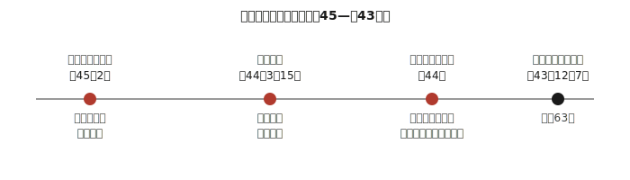
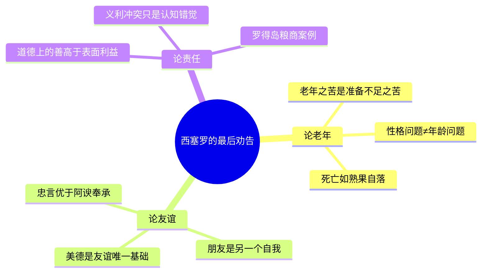

## 《论老年 论友谊 论责任》读书笔记 
  
### 作者  
digoal  
  
### 日期  
2026-06-20  
  
### 标签  
读书笔记 , 论老年 论友谊 论责任  
  
----  
  
## 背景 
  
  
  

---
书名: 《论老年 论友谊 论责任》  
作者: [古罗马] 西塞罗（Marcus Tullius Cicero）  
译者: 徐奕春  
出版社: 商务印书馆  
出版年份: 2003-12  
丛书: 汉译世界学术名著丛书·哲学  
原作名: Cato Maior de Senectute. Laelius de Amicitia. De officiis  
笔记日期: 2026-06-20  
豆瓣链接: https://book.douban.com/subject/1048529/  
豆瓣评分: 8.6（约400人评价）  
标签: [哲学, 古罗马, 西塞罗, 伦理学, 汉译世界学术名著丛书]  
---
  
  

> **一句话**：一个被时代抛弃的63岁老人，在女儿新丧、共和破灭、自己即将被杀的至暗时刻，写下三封信——分别回答了"如何变老""如何爱人""如何分辨该做的事"。  
> **适合谁读**：正在经历人生转折（中年危机、退休、丧失）的人；对"友谊到底是什么"感到困惑的人；面对"道德与利益冲突"的决策者；任何想读一点不那么晦涩的西方古典哲学的人。  
> **阅读难度**：⭐⭐⭐☆☆（对话体散文，没有艰深术语，但历史人物较多，需要一点耐心）  
> **推荐指数**：⭐⭐⭐⭐☆  
  
---

## 一、时代坐标：这本书从哪里来？

这三篇文章不是书斋里的从容之作，而是写在西塞罗人生最后两年的废墟之上。公元前45年初，他最疼爱的女儿图利娅难产去世，西塞罗一度几乎崩溃，靠埋头写作《安慰》排解悲痛。次年（前44年）3月，凯撒遇刺，西塞罗曾以为共和制有机会复活，结果迎来的是更混乱的权力真空——他作为元老院的老资历，却被新一代实权者彻底边缘化，"国家和朋友们不再需要他的服务"。

正是在这种被迫退出政坛、亲人新丧的双重打击下，他搬到塔斯库路姆乡间别业，把对政治的全部热情转移到写作上。短短一年内，他密集完成了《图斯库路姆论辩集》《论老年》《论友谊》《论神性》，以及生命最后阶段写给远在雅典求学的儿子小马尔库斯的《论责任》。几周后，前43年12月7日，他被安东尼派出的杀手追上并杀死。

了解这个背景，三本书的味道完全不同了：《论老年》里"老年人不必恐惧"的从容，其实是一个被迫"被退休"的政治家的自我说服；《论友谊》里对真诚友情的执着歌颂，背后是他亲眼见证的罗马政坛"今天的同盟、明天的仇敌"；《论责任》写给儿子的谆谆教诲，则几乎是一份提前写好的遗嘱。

  

---

## 二、核心命题：作者在说什么？

### 观点一：老年的苦，是没准备好的人生的苦（《论老年》）

西塞罗假借82岁高龄的老加图之口，逐一反驳"老年是不幸的"四条罪状——退出事业、体力衰弱、丧失享乐、临近死亡。他的反驳方式很有意思：他不否认这四件事会发生，而是把判断标准从"年龄"转移到"准备"。退出体力活动不等于退出一切事业，治国需要的恰恰是阅历和判断力；脾气古怪、爱钱吝啬，是性格问题而不是年龄问题，年轻时就刻薄的人，老了只会更刻薄；丧失感官享乐反而解放了理性思考；至于死亡，如果灵魂不灭，死亡是解脱，如果灵魂随身体消亡，死者本身也不会感到痛苦。整本《论老年》最锋利的一句潜台词是：**老年只是一面放大镜，照出你前半生到底活得怎么样**。

### 观点二：没有美德，就没有真友谊（《论友谊》）

这是三篇里最动人的一篇。西塞罗借莱利乌斯之口，借历史上传为典范的莱利乌斯与小西庇阿的友情，提出一个在当时罗马政坛堪称"反潮流"的观点：友谊不应该建立在利益交换上，而应该建立在彼此的美德之上。真正的朋友是"另一个自我"——你为他高兴，不是因为他能为你带来什么，而是单纯因为你认同他这个人。他甚至给出了具体的"操作守则"：不能要求朋友做不道德的事，也不能因为是朋友就替他做不道德的事；忠言比谄媚更值得珍惜；如果朋友变坏，应该体面地疏远，而不是同流合污或撕破脸成仇。

### 观点三：表面上"义利冲突"，其实是对"利"理解错了（《论责任》）

这是西塞罗最后、也最系统的一部伦理学著作，分三卷：第一卷讨论什么是"道德上的善"（义），第二卷讨论什么是"利"，第三卷专门处理二者看起来冲突的情况。他的核心论点是：**真正的利益，从不会和道德真正冲突**——如果一件事看起来对你有利却不道德，那说明你算的不是"真利"，而是被表面利益蒙蔽了。他举了一个经典案例：罗得岛遭遇饥荒，一名商人率先运粮抵达，他是否该告诉后续商人也快到了（这会让粮价下跌），还是隐瞒消息趁机卖高价？西塞罗的判断是：隐瞒信息谋取暴利，即便不违法，也违反了诚信原则，长远看这是损害自己的"真利"。

---

## 三、论证地图：作者怎么说服你的？

三篇文章共享同一个论证套路：**先把一个常见的"二元对立"拆开，再证明对立本身是虚假的**。老年 vs 幸福，友谊 vs 利益，道德 vs 利益——西塞罗在每一处都不是简单地选边站，而是重新定义其中一端（"老年的不幸其实是性格的不幸""真朋友不求回报恰恰是最大的回报""真利与义本不冲突"），从而消解掉表面上的矛盾。这是一种非常罗马式的论证风格：不追求形而上的纯粹推演，而是靠大量历史人物的真实案例（小西庇阿、加图、罗得岛商人）做归纳支撑，雄辩有力，但严格意义上的逻辑漏洞也藏在这里——用"重新定义"来化解矛盾，有时更像是修辞胜利，而非真正解决了价值冲突。

---

## 四、前提假设与边界：什么情况下这不成立？

西塞罗的整套劝慰建立在几个未被充分检验的前提上：

**假设一：灵魂可能不灭，理性主宰肉体。** 这是他化解死亡恐惧的关键支点。如果一个人根本不相信灵魂不灭、也不认同"理性高于感官"的价值排序，他那套"死亡不可怕"的论证就失去了立足点。

**假设二：友谊只能发生在地位、品行相近的"好人"之间。** 这其实悄悄排除了大量真实存在的复杂情感关系——师生、上下级、跨阶层互助，乃至当时被排除在"公民"范畴之外的女性和奴隶。西塞罗谈的是罗马元老院精英之间理想化的对等情谊，对不对等关系中的忠诚与依恋几乎没有解释力。

**假设三：个人是有闲、有产、有教养基础的成熟公民。** 《论老年》里那种"老年是收获季"的从容，前提是这个人年轻时就有条件去"耕种"——读书、从政、积累名望。对于一生为生存奔波、没有机会"修身养性"的普通人，这套安慰可能更像是精英的自我感动，而非普适的人生智慧。

这也是这本书最该被"带着批判去读"的地方：它的边界恰恰是罗马共和国晚期元老院阶层的边界。

---

## 五、思想谱系：这本书在哪个传统里？

西塞罗本人很少被认为是有原创体系的哲学家，他更像一位"翻译与综合者"：把柏拉图的理念论、亚里士多德的伦理学、斯多葛派（尤其是帕奈提乌斯已经失传的同名著作《论责任》）的自然法思想，揉进罗马人特有的实践气质——更关心"该怎么做"，而不是"什么是终极的善"这种纯抽象问题。

它的下游影响则相当绵长：文艺复兴时期，彼特拉克重新发现西塞罗的书信，一定程度上点燃了整个人文主义复兴；近代蒙田、培根各自写过《论友谊》，其中不少观点能直接追溯到西塞罗这篇；启蒙时代，洛克、休谟、孟德斯鸠都受过他政治哲学的影响；美国建国一代如亚当斯、汉密尔顿也常在自己的写作中引用《论责任》里"义利不冲突"的论证框架。可以说，西塞罗不是某个学派的创始人，而是希腊哲学进入西方近代政治伦理话语之前最重要的一个中转站。

---

## 六、我学到了什么？

读完最大的冲击，是意识到**"老年焦虑"本质上是"准备不足焦虑"的延迟显现**。我们今天讨论的"长期主义""延迟满足"，西塞罗在两千年前用"老年是收获季"这套说法早就讲过一遍——只是换了个场景。这让我开始重新审视自己现在的选择：哪些是"年轻时积累、老了兑现"的事，哪些只是"年轻时图快、老了买单"的事。

第二点收获是对友谊的重新校准。我们这个时代习惯把"人脈"等同于"朋友"，习惯用"有没有用"来筛选关系。西塞罗那句"友谊只能存在于好人之间"听起来理想化甚至有点不近人情，但它其实在提醒我：**任何建立在交换之上的关系，都经不起任何一方价值贬值的考验**——而这恰恰是很多关系破裂时让人措手不及的真正原因。

第三点是罗得岛商人的例子给我的判断框架："不违法"和"道德上正当"之间，永远有一段需要自己去丈量的距离。这个框架我现在会下意识地用在工作中的信息差决策上。

---

## 七、举一反三：这个框架还能用在哪？

**个人决策**：面对一个"短期看明显有利"的选择，可以问自己一句西塞罗式的问题——"这是真利，还是被表面利益蒙蔽的假利？"

**团队管理**：识别团队里哪些关系是"基于共同价值观"，哪些是"基于利益捆绑"。后者在利益消失的那一刻几乎必然瓦解，提前知道这一点，能让人在分配信任和责任时更清醒。

**商业与信息伦理**：罗得岛粮商的两难，在今天换了个外壳照样天天发生——卖方知道某个关键信息会影响买方决策却选择不说，法律上可能无可指摘，但用西塞罗的标准衡量，依然是在透支信任这项"真正的资本"。

---

## 八、批判与反思

我不完全同意西塞罗对"义利从不冲突"的处理方式。这个结论更像是一种漂亮的语言操作——把任何不道德却看起来有利的选择，事后重新定义为"非真利"，逻辑上确实自洽，但在真正陷入两难的处境里（比如对家人不忠却能造福更多人），这套框架的解释力会明显打折扣，因为它没有提供一个独立于结论的判断标准，更像是先有了"道德必须赢"的立场，再倒推论证。

时代局限也很明显。《论老年》和《论友谊》描绘的从容与理想，几乎只对应罗马元老院阶层这一小群人的生活条件；他笔下完全没有出现的奴隶、女性、底层平民，恰恰是当时罗马社会的大多数。

还有一点值得一提：西塞罗本人的从政经历，并不总是符合他笔下的理想——他在政治斗争中也有过摇摆和对权贵的依附。这提醒我们，读伦理学著作时，应该把"作者讲的道理"和"作者本人是否做到"分开评价，道理本身的价值不因作者的不完美而打折，但也不该因为作者的雄辩而被无条件接受。

---

## 九、金句与记忆点

1. **老年不是问题本身，没准备好的人生才是问题。** —— 西塞罗反驳"老年四苦"的核心逻辑，把矛头从年龄转向了此前的生活方式。
2. **脾气坏、爱钱，是性格的毛病，不是年龄的毛病。** —— 一句话拆穿了"倚老卖老""人老就该被原谅"的常见误区。
3. **死亡像树上熟透的果子，自然落下。** —— 西塞罗对死亡最著名的比喻，用自然节律取代了对死亡的恐惧叙事。
4. **真正的朋友，是你的另一个自我。** —— 友谊不是工具关系，而是一种认同与延伸。
5. **美德创造友谊，也维系友谊；没有美德，友谊只是空名。** —— 把友谊从利益交换里彻底拽了出来。
6. **忠言逆耳，却比阿谀奉承更值得珍惜。** —— 一条至今仍常被违背的交友准则。
7. **道德上的善，是最大的利；义利表面的冲突，是认知出了错。** —— 《论责任》全书的逻辑总纲。
8. **隐瞒于己有利、于人有损的信息，即使不违法，也不道德。** —— 罗得岛商人案例的判决，至今仍适用于信息不对称的交易场景。

---

## 十、延伸阅读

1. **塞涅卡《强者的温柔：致鲁基里乌斯的书信集》**——同属斯多葛传统，比西塞罗更直接地讨论如何面对衰老与死亡，可作为《论老年》的"进阶版"对照阅读。
2. **马可·奥勒留《沉思录》**——一位真正的罗马皇帝在权力顶峰写下的自我劝诫，与西塞罗"政治失意后转向哲学"形成有趣对照。
3. **蒙田《随笔集》（尤其《论友谊》一篇）**——近代欧洲对西塞罗友谊观最直接的回应与改写，能看到两千年后这个话题如何被重新讲述。
4. **普鲁塔克《希腊罗马名人传》**——补全小西庇阿、莱利乌斯、加图等人物的历史背景，让《论老年》《论友谊》里的"角色"立体起来。
5. **西塞罗《论义务》（王焕生译本）**——同一部De Officiis的另一个译本，可与徐奕春译本对读，体会不同译者对"义/利/责任"这套核心概念的不同处理。

---

*笔记写于 2026-06-20 | 基于公开资料与深度思考整理*
  
  
#### [PostgreSQL 解决方案集合](../201706/20170601_02.md "40cff096e9ed7122c512b35d8561d9c8")
  
  
#### [德哥 / digoal's Github - 公益是一辈子的事.](https://github.com/digoal/blog/blob/master/README.md "22709685feb7cab07d30f30387f0a9ae")
  
  
#### [About 德哥](https://github.com/digoal/blog/blob/master/me/readme.md "a37735981e7704886ffd590565582dd0")
  
  

  
