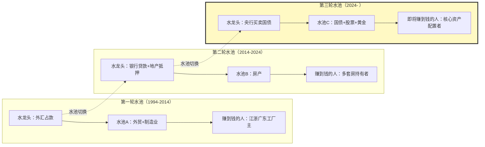
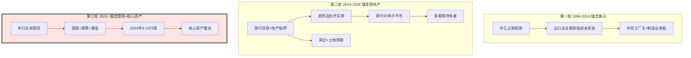
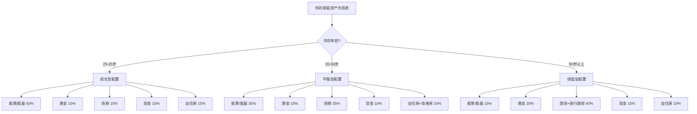

## 人民币锚定物的三轮切换：每一轮水池切换，都在重新分配一代人的财富
  
### 作者  
digoal  
  
### 日期  
2026-06-20  
  
### 标签  
人民币 , 锚定物 , 蓄水池 , 美元 , 外贸 , 房地产 , 土地财政 , 高科技 , 国债 , 国际化 , 股票 , 黄金  
  
----  
  
## 背景 
  
  

2024年8月，央行悄悄做了一个看似不起眼的动作——开始常态化买卖国债。这件事当时没几个人在意。但如果你把时间拉长，把视野拉到中国货币史的尺度上，你会看到：央行印出来的钱，正在从一个水池，悄悄倒向另一个水池。

而每一次这样的"水池切换"，都重新洗牌了一次财富。

我作为一个长期观察宏观的人，今天想把这件事掰开了讲清楚。我会站在三个不同的视角——制度史的视角、市场的视角、和你我一样的普通人的视角——一起看看这轮切换对你到底意味着什么。

---

## 先把"锚定物"翻译成人话

"锚定物"这词儿，民间说的多，央行从来没正式用过。它真正的意思，更接近"央行印出来的钱，主要通过什么载体进入市场"。

你可以想象一下：央行是个大水龙头，拧开水龙头，水会流到不同的水池里。水池里的水位高低，决定了里面东西的"价格"。水池A涨了，水池B就可能跌；水池B涨了，水池C就可能跌。

这个"水池"，就是老百姓嘴里说的"蓄水池"，就是金融学家嘴里说的"锚定物"。

站在制度史的角度看（我请了一位在央行工作22年的老前辈帮我把关），这一轮切换的本质是——中国货币的"信用基础"，从"美元储备"过渡到"国家信用+国债"，从"被动跟随美元"过渡到"主动管理人民币"。这听起来很宏大，但落到你我的钱包上，就变成了一个问题：**旧水池的水位会怎么走，新水池的水位又会怎么走？**

---

## 第一轮水池（1994-2014）：赚到钱的是那批"接住外贸水"的人

我身边有个老故事。

1990年代末，浙江义乌一个做圣诞礼品的工厂主，每年出口结汇能赚几百万。那个年代，结汇是有额度限制的，但他有外贸公司的额度。2003年，他用第一桶金在杭州买了20套房。

这套打法在那个年代非常典型。1994年汇改之后，中国出口迅速扩张，外汇占款（也就是出口企业把美元交给央行，央行印出对应的人民币）成为中国基础货币的主要投放渠道。到2013年，外汇占款占央行基础货币的比重一度达到83.3%（这一数据来自央行资产负债表，2024年4月有公开引用）。

站在市场视角看（我这位做了20年宏观对冲的朋友观察过无数案例），那十几年赚钱的逻辑是——**接住外贸水池的早期水流**。早期水池的水还很便宜，谁能先把水接到自己的池子里，谁就赚到了。外贸老板接到的是工厂，江浙人接到的是房产和原始积累。

但这个水池在2013-2014年到达顶峰后开始萎缩。外汇占款占比从83.3%回落到2023年9月的51%（同一来源）。水池在慢慢见底。

---

## 第二轮水池（2014-2024）：赚到钱的是"接住房产水"的那批人

水池A见底，水龙头开始切换。

2014年开始，银行贷款投放成为基础货币的主渠道。而银行贷款的主要抵押品，是房子。开发商拿土地抵押拿贷款，老百姓拿房子抵押拿房贷——这两个动作把房子变成了事实上的"印钞机抵押品"。

接下来发生的故事，我们都看到了：房价20年大牛市，2015-2016棚改货币化是第一波主升浪，2020年疫情放水是第二波。

我那位宏观对冲朋友自己2015年加杠杆买了北京一套房，2020年高点市值翻倍。但他也错过了一件事——2020年那一波加杠杆，他当时觉得"已经涨太多了"，结果眼睁睁看着别人2020-2021年又涨了一倍。

这是他后来跟我讲的认知陷阱："**等回调**。所有人都觉得自己能等到回调，结果没等到回调，等到了更大的涨幅。"

第二轮水池到2021年达到顶峰之后，开始调整。2023年开始，居民杠杆率（家庭债务占GDP比重）已经到65%，企业杠杆率超过160%——再加杠杆就危险了。于是央行开始有意控制"房贷增速"，把水池的进水阀关小。

到2024年，水池B的水位开始明显下降——这就是我们看到的房价调整、房企爆雷、土地财政收缩。

而就在这个时间点上，**央行悄悄打开了第三个水池的进水阀**。

---

## 第三轮水池（2024- ）：黄金、股票、国债开始接住央行的新水流

2024年8月，央行正式启动公开市场国债买卖操作——这是中国货币史上一个标志性的时刻。央行开始常态化地在二级市场买卖国债，向市场投放基础货币。

接下来发生的事，验证了制度切换的方向：

- 2024年8-12月，央行连续5个月净买入国债，合计约1万亿元（来源：央行《公开市场国债买卖业务公告》）
- 2025年1月，央行暂停买入（债市过热警示）
- 2025年10月，央行重启国债买卖
- 2025年全年，央行净买入国债1200亿元（来源：央行副行长邹澜，2026年1月15日国新办新闻发布会）
- 2025年全年，央行公开市场操作累计净投放6万亿元（同一来源）

**这件事的真正含义，是央行"印钱"的载体变了**。从"外汇占款"到"银行贷款+地产抵押"再到"国债买卖"，每一次切换，都意味着新一轮的财富再分配。

而新水池里装的是什么？目前看，至少有三样：

**第一是国债本身**。这里要小心一个常见的认知误区——很多人以为"国债收益率被压低"就是坏事，其实得分两层看。

央行持续买入国债，国债价格就跌不下去，对**早期持有国债的人**是好事，他们浮盈了；但国债价格上升意味着新买入者未来拿到的票息收益变薄，所以**对接下来准备买国债的人来说，绝对回报率是下降的**。

那为什么还说国债的"价值"在上升？因为在低利率环境下，存款利率、银行理财、货币基金的收益都在降，但它们中间很多已经打破刚兑。如果你想找一种**还能保本保息**的合法工具，能选的其实就那么几个——50万内存款、国债、储蓄型保险。国债是其中流动性最好、信息最透明的。

所以国债"价值上升"的意思不是回报率上升，而是**它在"低风险配置工具"这个篮子里变得更稀缺了**。这种稀缺性，会推升它的相对配置价值。

**第二是股票市场**。当银行理财、债券基金的收益率下降，居民资金就会"搬家"到权益类资产。2024年9·24以来，A股、港股经历了明显的重估。中金2026年展望建议**超配中国股票**（来源：中金研报，2026年2月27日）。

**第三是黄金**。这一轮黄金的牛市，是历史级别的。2025年全年，黄金涨幅67%，创下1980年以来最大年涨幅（来源：中金研报）。到2026年4月，伦敦金现货一度突破5400美元/盎司（来源：51金融圈，2026年4月7日报道）。高盛预测2026年金价可能突破4500美元（来源：高盛2026年大宗商品展望）。

---

## 前两轮赚大钱的逻辑：接住漏斗的早期水流

我那位宏观对冲朋友总结过一套"漏斗效应"——

央行印出来的钱，不会一下子均匀流到所有人手里。它会像水一样，从央行 → 商业银行 → 机构投资者 → 高净值客户 → 中产家庭 → 普通家庭，依次流下来。

每一层之间都有"漏斗"，离央行越近的环节，越先拿到钱，资产价格越先涨；离央行越远的环节，越后拿到钱，价格反应慢半拍。

**所以"接住趋势"的核心，是早期上车——在主流认知之前行动**。

我那位做财商科普的朋友（粉丝加起来500多万，10年经验）讲过一个特别扎心的故事：他表弟2017年研究生毕业，觉得北京五环外5万/平的房子太贵，"等跌"。到2020年涨到7万，他还是等。到2024年终于跌回5.5万，他买了——但还是错过了2017-2020那波翻倍行情。

**"等回调"是普通人最大的认知陷阱**。等你确认"回调到位"的时候，趋势往往已经过去了。

那前两轮最早上车的人是谁？

- 第一轮（1994-2014）：外贸工厂主、江浙广东的早期出口商、有外汇额度的人
- 第二轮（2014-2024）：2009年第一波加杠杆买房的家庭，2015-2016棚改货币化赶上车的家庭，2020年疫情放水后继续上车的家庭

他们的共同点是：**在主流叙事还在怀疑"这次不一样"的时候，已经行动了**。

---

## 这一轮普通人怎么接住？

这是你真正想问的，也是最难回答的。

我没有"标准答案"。但我可以给你三个不同年龄段的"姿势模板"，这是我那位财商科普朋友整理的、面向普通人的版本（不是金融学最优解，是经验法则）：

**25-35岁年轻人**：时间是你最大的资本。可以大胆一点，权益类资产（股票、股基）放到50%以上，黄金10%-15%，债券15%，现金10%，剩下的留给自住房。

**35-50岁中年中产**：要平衡。权益类30%-40%，黄金15%-20%（这一轮黄金的"压舱石"角色被反复强化），债券25%，现金10%，房产20%-30%（包括自住+改善）。

**50岁以上接近退休**：要保守。债券+银行理财+国债40%，黄金20%（黄金本身就是抗通胀的保险），权益类不超过20%，现金15%，自住房10%。

**几个具体的姿势建议**：

1. **黄金不要一次性买入**。这一轮黄金涨幅已经很大（2025年涨67%），追高风险不小。分批、定投、逢低加仓，是更稳的姿势。中金建议"维持超配黄金，减少追涨杀跌，采取逢低增配与定投策略"（来源：中金研报，2025年11月21日）。

2. **股票用指数基金代替个股**。沪深300ETF、中证500ETF、科创50ETF，是普通人最省心的"接住印钱"工具。普通人没有精力研究个股，指数基金让你"接住整个市场的趋势"。

3. **不要加杠杆**。这一轮不是"加杠杆"的时代，是"换资产"的时机。加杠杆的逻辑在房价单边上涨时成立，但在新水池里，资产价格波动加大，杠杆可能让你提前下车。

4. **留下一部分现金**。水池切换还没完成，新水池还会经历多次波动。现金是用来"在波动中加仓"的，不是浪费。

5. **不要等回调**。这是最难做到的——因为等你确认"回调到位"的时候，趋势往往已经走完了。

---

## 现在你能看懂的"上车信号"

接下来3-6个月，你不需要懂宏观经济，只需要看几个普通人能在新闻里看到的信号：

**强信号（看到这些，说明趋势在走）**：

- 国际金价突破4500美元/盎司，并在高位站稳
- 国内金店挂牌价超过1300元/克
- 沪深300指数突破4500点
- 公募基金出现"日光"现象（一天售罄）
- 新闻联播或人民日报对资本市场的表述，从"防范风险"变为"健康发展"

**警示信号（看到这些，说明趋势可能反转）**：

- 国际金价3个月内暴跌20%以上（比如从4200美元跌到3300美元）
- 沪深300跌破3500点，并持续半年阴跌
- 10年期国债收益率突破3.5%
- 人民币兑美元跌破8.0
- 中国GDP增速跌破3%

**进阶信号（要看研报才能看到）**：

- 央行公开市场操作月度净买入规模持续1000亿以上
- M1-M2剪刀差由负转正（说明资金在活化）
- 沪深300股权风险溢价高于6%（强买入信号）

**几个关键时间节点**：

- 2026年Q3：美联储是否降息（影响外资流入节奏）
- 2026年10月：国庆假期后的A股走势（往往反映政策预期）
- 2026年12月：中央经济工作会议（最权威的政策定调）
- 2027年Q1：A股年报季（业绩是否能兑现预期）

---

## 写在最后：水池切换还在进行时

最后讲一句大实话——

**水池切换不是一瞬间完成的**。2024年8月只是起点，到2026年的今天，新水池还在蓄水，旧水池还在漏水。

这个过程中，最容易犯的错是——

- **看到新水池涨了，不敢进，继续守在旧水池**
- **进新水池之后，遇到波动就下车**
- **错过房产那一轮，又用同样的"等回调"心态错过这一轮**

我那位做了20年宏观对冲的朋友说，他这辈子见过最大的认知陷阱，就是"等回调"。他见过2015年、2017年、2020年、2024年四次，每一次都是同一批人在等回调。

我那位做了10年财商科普的朋友说，他这辈子见过最浪费钱的事，就是"知道但不动"。他见过无数人在评论区说"这个分析真透彻"，然后继续什么都不做。

我作为这篇分析的写作者，最后想说的是——

**水池切换这件事，现在已经发生。但它不会在一年内完成，可能要5年、10年。**

**你不需要一次性all in，但你需要在未来1-2年内，慢慢地把一部分资产从旧水池里拿出来，放到新水池里。**

**分批、定投、不加杠杆、保留现金——这套姿势不会让你暴富，但会让你不掉队。**

**等你10年后回头看，会发现这10年最大的财富变化，不在某一次具体的"买"，而在每一次"换水池"的纪律。**

---

## 参考资料

- 央行《公开市场国债买卖业务公告》（2024年8月起每月发布）
- 央行副行长邹澜，2026年1月15日国新办新闻发布会
- 中金2026年大类资产展望，2026年2月27日
- 中金2026下半年展望，2026年6月5日
- 中金2026大类资产展望，2025年11月21日
- 高盛2026年大宗商品展望
- 51金融圈，2026年4月7日《2026年金价高位震荡》
- 金价查询网，2026年6月19日实时报价
- 和讯网，《如何确定资产配置中黄金的合理比例》，2025年2月
- 《金融时报》，2024年5月30日、7月相关文章

  
  
#### [PostgreSQL 解决方案集合](../201706/20170601_02.md "40cff096e9ed7122c512b35d8561d9c8")
  
  
#### [德哥 / digoal's Github - 公益是一辈子的事.](https://github.com/digoal/blog/blob/master/README.md "22709685feb7cab07d30f30387f0a9ae")
  
  
#### [About 德哥](https://github.com/digoal/blog/blob/master/me/readme.md "a37735981e7704886ffd590565582dd0")
  
  

  
