## 历史人物研究 | 秦始皇:一个 15 年而亡的"失败皇帝",怎么就成了 2200 年没人能颠覆的架构师
  
### 作者  
digoal  
  
### 日期  
2026-06-20  
  
### 标签  
秦始皇 , 秦制 , 底层操作系统 , 架构师 
  
----  
  
## 背景 
  

> 立场:这不是为"千古一帝"唱赞歌,也不是要给暴秦翻案。我打算把四位研究秦汉制度、比较文明、思想史、基础设施的学者请到一起,让每个专家只说最锋利的那一刀——然后我们一起把一个反常识的结论摆到你面前:秦始皇真正写进中华文明底层的,不是国土,而是一套"操作系统";而这套 OS 跑到了 2026 年的今天,你的个人所得税 App 都在用它的代码。

---

## 一、先把"教科书"那一套放下

大多数人对秦始皇的印象,还停留在两个画面里:一个是"六国归一、横扫八荒"的英雄叙事,一个是"焚书坑儒、孟姜女哭长城"的暴君叙事。但这两套叙事都把秦始皇个人化了——把一个 150 年的工程化制度实验,塞进了一个人的传记里。

我更喜欢从一个反常识的具体场景讲起。

2024 年夏天,湖南里耶古城 1 号井边上,考古工作者又把一批新释读完成的秦简交给历史学家。这批 2002 年出土、总数超过 3.6 万枚的简牍,记录的是一个叫"迁陵县"的边远小县在秦始皇二十五年到秦二世元年之间(公元前 222—前 209)的完整行政档案。里面有什么?有县廷下设的 10 个列曹(司空、田官、仓、少内……),有"积户"与"见户"的统计,有"贷钱 / 偿息"的借贷契约,有"邮行洞庭"的跨郡文书传递。

这批简最让我们这些后人脊背发凉的是它的细度。一个只有 152—191 户、约一千多人的特小型县,被设计出了远超唐代"上县仅 3 个机构"的科层结构。换句话说,**秦始皇和他的团队,不是在做"打天下"的草莽生意,而是在做一个"操作系统"**——把一个跨千万平方公里、跨几十种方言、跨几百个部族的大陆,用一套可替换、可考核的行政机器直接统治到乡里。

这就是为什么我会说"秦始皇个人是次要的"。他不是发明家,他是产品经理;他真正的贡献,是他和商鞅(变法奠基,前 356 年起)、李斯(制度落地)、尉缭子(军事制度)三代法家团队一起,用 150 年时间把"超大农业国如何治理"这个难题,做成了第一个可复制的工程化解答。

那这个解答到底留下了什么?四位专家会从四个完全不同的角度把它切开。

---

## 二、第一刀:制度史学者说,"秦制不是文化必然,是工具理性胜利"

我请的第一位学者是教了 30 年秦汉制度史的老先生。他开门见山就说了一句话,把"中国天生爱大一统"这种常见误解拆掉了一半:

> "把秦制说成'中国文化必然',是 20 世纪新清史搞出来的一个叙事陷阱。"

他告诉我一个很容易被忽略的事实:**汉初的 70 年(公元前 202—前 135),刘邦、惠帝、吕后、文帝、景帝,这些开国皇帝没有一个一开始就想全盘照搬秦制**。刘邦分封同姓王、异姓王,搞"郡国并行";惠帝、吕后、文帝搞"黄老无为、与民休息";这些都是有意识的"非秦方案"实验。结果呢?七国之乱(前 154)把"分封"打回去了,汉武帝元朔二年的"推恩令"(前 127)把王国实际降格到与郡平级,汉朝才真正"全境郡县化"。换句话说:**"汉承秦制"是一个被迫的选择,不是天然的继承**。

他特别强调一个反直觉的时间节点:**郡县制覆盖全中国的时间,严格说不是秦始皇那一年(前 221),而是汉武帝晚年(约前 110)**。中间这 110 年,秦汉两朝交替打过两次大辩论——"分封 vs 郡县"——最后是现实把皇帝们逼回了秦始皇的方案。

所以这位学者给出了一个相当冷峻的判断:**秦制的胜利,不是文化的胜利,是工具理性的胜利**。在公元前 3 世纪的技术条件下(没有铁路、电报、现代财政体系),要管一个跨 2000 公里、人口 2000 万到 4000 万的农业区,"郡县 + 文官 + 编户齐民"几乎是唯一可规模化的方案。这个判断建立在一个完整的前置条件上:

> *如果承认帝制是农业文明应对超大疆域治理的"次优解"之一,既不是最好,但在当时的工具条件下几乎是唯一可规模化的方案,那么秦制 DNA 的延续就有其内在逻辑——而"汉承秦制"正是这个逻辑被现实逼出来的必然。*

但这个判断也立在一个可被推翻的支点上:**如果里耶秦简、岳麓秦简、清华简的后续研究显示,秦代基层仍是贵族世袭治理而非流官任免,那"秦创文官郡县制"的论断就要重写,大部分功劳归汉**。这是他留给未来考古的"测试题"。

更狠的一刀在最后。这位学者冷不丁地补了一句:

> "你今天打电话报的'个人所得税',和你高考之后考公务员进的'省—市—县'四级行政体系,底层代码里,秦始皇和他的团队是最初的架构师。理解秦制,是理解当代中国治理的'历史底座'。"

这不是夸张。公元前 221 年的"皇帝—郡—县—乡—里"五级,到 2026 年变成了"中央—省—市—县—乡—村"六级——多了一级"市(地级)",其他四级几乎原样复制。2200 年里换了 30 多个朝代,这个"五到六级"的科层架构,只被局部改写过两次(王莽复古改制、民国废府存县),但每次都很快回到秦制的版本。

---

## 三、第二刀:比较文明史学者说,"秦不是'东方天才',是'东方唯一走通'"

第二位学者从北美某大学的比较早期帝国研究里飞回来,他要纠正一个更宏大的误读:"中国大一统是东方文明的特殊天才"。

他做了一张表,把秦汉与同期罗马共和国末期、波斯阿契美尼德王朝、孔雀王朝并排放在一起对比:

| 维度 | 秦汉(前 221—220) | 罗马共和—帝国(前 200—117) | 阿契美尼德波斯(前 550—330) | 孔雀王朝(前 322—185) |
|------|-------------------|----------------------------|------------------------------|------------------------|
| 疆域(峰值) | 约 360 万 km²(秦) | 约 50—500 万 km² | 约 550 万 km² | 约 500 万 km² |
| 行政层级 | 5 级(中央—郡—县—乡—亭—里) | 2 级(罗马—行省,行省内高度自治) | 国王—总督(总督下基本是部族) | 国王—总督—分区 |
| 文字统一性 | 高度统一(书同文) | 拉丁文只用于行政上层,地方通用希腊文等 | 阿拉米文通用,地方文字并用 | 婆罗米文地方化,无统一推普 |
| 跨区域整合 | 驰道 + 度量衡 + 货币 | 罗马法 + 拉丁公民权 | 王道 2500 km,效率高但控制浅 | 阿育王敕令石刻全国分发 |
| 军队性质 | 征兵制 | 职业军团(后期) | 波斯不死军为核心 | 战象 + 雇佣兵 |
| **崩溃后遗存** | **制度存续 2200 年** | 西罗马 476 亡,法统断 | 萨珊继承其外壳,后伊斯兰化 | 笈多复兴未继承其行政 |

这张表里能读出两个反常识的事实:

**第一,秦汉不是疆域最大的早期帝国**。阿契美尼德波斯、孔雀王朝、罗马帝国早期,谁的疆域都不比秦汉小;甚至在跨气候带、跨民族这两个指标上,波斯和罗马可能还更复杂。

**第二,秦汉是唯一一个把"流官 + 考核 + 文字统一 + 标准化度量衡"四件套全部落地到县级的早期帝国**。罗马有军团有法学家,行省总督却基本是元老们轮流去捞钱,任内不向中央负责;波斯有"皇家眼线"(希罗多德《历史》V, 35)、有统一贡赋体系,但行省总督基本是世袭或半独立;孔雀王朝有考底利耶的《政事论》(Arthashastra)那样的谍报—财政—官僚手册,但从未把"郡县制"贯彻到村一级。

**三巨头都卡在"总督制"就走不动了。** 秦为什么能走到底?这位学者给了一个反浪漫的答案:

> "秦不是'东方独有的天才',而是'东方唯一走通'的人。罗马有军团无文官、波斯有驿道无考核、孔雀有谍报无推普。三者卡在'总督制'就走不动了。秦走到底靠的是:地理屏障(喜马拉雅 / 草原)+ 连续文明(4000 年农耕) + 政治意志(商鞅—嬴政两代接力),三者缺一不可。"

他引用斯坦福的 Walter Scheidel 在 *Rome and China Compared*(2019)里的结论:秦汉与罗马在"应对蛮族压力"上都是失败者(都因游牧/蛮族压力而衰落),但在"国家延续性"上中国胜出,**主因不是制度优越,而是地理屏障与文化连续体**——汉字—儒生的连续体把 4000 年农耕人口的"经验数据"沉淀了下来,罗马没有这个连续体。

这是一个让人后背发凉的判断:如果 Scheidel 的框架是对的,**那"秦制 2200 年延续"这件事的功劳,要分给地理(喜马拉雅—欧亚草原的天然屏障)与文化连续体(4000 年农耕人口)**,而不全是秦始皇团队的制度设计。但反过来说——**能在地理和文化的双重约束下,做出"流官 + 考核 + 文字 + 度量衡"这套可执行方案的,仍然只有秦**。所以"秦是失败中的赢家"。

他还有另一把刀切到全球:**秦制不只是影响了中国,它还通过汉字圈输出到了东亚**。日本大化改新(645 AD)以唐律令为蓝本建立中央集权,新罗统一(660—935)实行"九州五小京"(明显是唐"道州县"的直接翻译),越南北属时期(公元前 111—公元 938)被直接郡县化 1000 多年。这些不是军事征服的副产品——日本、新罗、越南的精英是**主动选择**移植秦汉—隋唐制度,因为这套制度能让它们以更低的成本完成国家建构。

---

## 四、第三刀:思想史学者说,"秦始皇的真正遗产是统一了'用什么字思考'"

第三位学者是研究汉字文化圈思想史的专家。她要切的是最被低估的一层:**秦始皇的真正遗产,不是统一了国土,而是统一了"中国人用什么字思考"**。

她给了一个非常技术的判断:**汉字是象形-会意体系的语素文字,与拼音文字不同**。这个"不同"有一个被严重低估的功能性后果——**汉字天然可以"超越方言、跨地域表意"**。一个广东人、一个福建人、一个山东人,如果用普通话可能完全无法沟通;但只要他们写下来,用的是同一个"汉字",就能看懂对方的意思。

这套性质,拼音文字天然做不到。**这就是为什么同期希腊罗马没有形成"文字帝国"**——希腊语、拉丁语虽然跨地域传播,但没有形成"以文字统合政治认同"的传统。罗马帝国是"军事 + 拉丁语"双轮驱动,但拉丁语始终没能阻止帝国分裂。

她用一段话把这个判断说透:

> "拼音文字天然与方言绑定,无法承担'超越方言表意'的功能;汉字由于其'语素 + 象形'的特性,天然可以'表意而不发音'。日本、朝鲜、越南主动学习汉字,根本原因是经济学——这套文字让它们能以更低的成本完成国家建构。这就是为什么汉字圈的扩展不是'文化霸权',而是'低成本接入'的邀请。"

她也承认了硬币的另一面:**秦始皇的"书同文"是一把双刃剑**。一面是阳面——跨地域认同、东亚共同符号、低成本国家建构;另一面是阴面——压制思想、断裂先秦遗产。公元前 213 年的"非博士官所职,天下敢有藏《诗》《书》者,悉诣守尉杂烧之",和公元前 212 年的"坑杀 460 余名诸生",被很多思想史家(沟口雄三、史华慈等)视为**中国思想史的真正断裂点**——先秦那种"道术将为天下裂"的多元思想生态,从此再也没能完整回来。

她同时强调了一个重要的"修正":近半个世纪的出土简牍,正在改写"秦一举统一文字"的旧说法。1975 年湖北云梦睡虎地秦简(1155 枚,4 万余字)、1979 年四川青川木牍、2002 年湖南里耶秦简(3.6 万余枚),都显示**秦代基层文书写的是隶书而非小篆**——意味着"书同文"在执行层面允许"正体(小篆)+ 俗体(隶书)"双轨。何有祖 2024 年 8 月的《里耶秦简新研》(上海古籍出版社)进一步指出:**秦代地方行政文书仍然充满"地方性字形",书同文在迁陵县这种边远地区执行不彻底**。

这意味着我们不能把"书同文"浪漫化为"一夜之间天下一字",它是一个跨几十年的渐进过程——但**正是这种渐进,把"国家意志"和"共同文字"的绑定模式焊死了**,从此 2200 年没有真正解开。

她还点出了一个常被忽略的事实:**秦朝焚书坑儒的火,其实没有真正烧掉先秦典籍**。2013 年清华大学藏战国竹简陆续公布,其中部分篇目与传世本《诗》《书》内容高度重合,说明大量文本由"博士官"保留于宫中。所以"焚书"的真实破坏力,是**把典籍从民间收到官方图书馆**——它完成了"知识的国家化",而不仅仅是"知识的毁灭"。

---

## 五、第四刀:经济史学者说,"秦始皇的最大遗产是驰道 + 度量衡 + 秦半两这套'硬件 OS'"

第四位学者最接地气,他的开场白是:

> "郡县制是软件,驰道 + 度量衡 + 秦半两才是操作系统。没有这套 OS,郡县制跑不起来。"

他给了一个非常硬核的判断:**秦始皇留给我们后世的,不是"大一统"这个理念,而是"大一统"得以低成本维持的物理基础**。

为什么硬件比软件更难被替代?他给了一个经济史的逻辑:

> "制度可以推翻、可以改写,但已经修好的路、凿通的渠、烧制定型的衡器实物,会作为一种'沉淀成本'继续发挥作用。罗马帝国崩溃后,罗马大道作为物理实体仍在原地,服务中世纪欧洲整整一千年。秦帝国的崩溃没有让秦直道从地图上消失——它一直在那里,汉武帝的'封禅'走的就是秦直道,唐代它仍然在用。"

他给了一份相当完整的"秦代基础设施清单":

- **秦驰道**:公元前 220 年起修筑以咸阳为中心的放射状道路网,总里程估算约 6800 公里(部分估算上沿到 7000—9000 公里),路面宽度统一规定为"五十步"(约 65—70 米),中央"三丈"为皇帝专用御道。这是人类历史上第一个国家公路网。
- **秦直道**:公元前 212 年蒙恬主持修筑,起自咸阳(云阳),北抵九原(今包头),全长约 736 公里——中国最早的"高速公路",两千年里一直是华北通往蒙古高原的战略轴。
- **秦长城**:公元前 214 年蒙恬北击匈奴时"筑长城,因地形,用制险塞,起临洮,至辽东,延袤万余里"。国家文物局 2012 年公布的"长城资源调查"成果:历代长城总长 21196.18 公里,其中**明长城 8851.8 公里,秦汉及早期长城超过 1 万公里**——这条"国防廊带"后世汉、北魏、北齐、明反复加筑,**秦的地理廊带选择是后世 2000 年国防布局的底图**。
- **灵渠**:公元前 219 年始建,公元前 214 年凿成通航,全长 37.4 公里,沟通了长江水系(湘江)和珠江水系(漓江)——人类历史上第一座跨流域人工运河,2018 年 8 月入选世界灌溉工程遗产。
- **五尺道**:从四川通往云贵的栈道,公元前 246 年左右修筑,把巴蜀和云贵高原第一次连进中原王朝的版图。
- **秦半两钱**:公元前 221 年统一货币,圆形方孔,重约 7.8 克(半两)。这个形制**从公元前 221 年一直延续到 1912 年清末,整整 2130 年**——是人类历史上最稳定的工业设计之一。
- **度量衡**:从"秦权"(铜权、铁权)、"秦量"(铜方升、陶量)在陕西、河北、湖北、湖南、山东、江苏、四川等原六国地区的考古分布看,**秦的度量衡标准确实在秦代就实现了全国统一**。

他给了一个让经济史学者非常受用的判断:**货币与度量衡是市场整合的"接口协议"(interface protocol)。秦统一度量衡 + 秦半两,就是给前现代中国经济装了"USB 接口",后世两千年所有区域市场必须兼容这套接口**。多伦多大学的 Loren Brandt、复旦大学的 Debin Ma 等人 2014 年在 *Journal of Economic Literature* 上发表的论文,通过对清代粮价数据的计量分析,证明**统一度量衡区域的价格波动远小于异制区域**——价格一体化现象的前提,就是秦奠定的这套接口标准。

他同时也狠狠补了一刀:

> "秦始皇的硬遗产,是用数百万计的民夫生命换来的。本文强调其'长期正外部性',不意味着要美化其'短期暴力'。"

修秦直道"堑山堙谷",征发民夫数十万;修秦长城"暴师于外十余年",《史记》载"死者不可胜数";修驰道、灵渠同样是徭役重负。里耶秦简中"徭""戍"记录密集,反映秦代基层的徭役负担。**这是任何对秦制"效率"评价必须同时承认的另一面。**

---

## 六、把四把刀拼起来:秦始皇到底留给我们什么

四位学者各有锋利,但合起来指向一个共同的图景。我用一张图把他们的核心洞察画到一张图里,这样你一眼能看清:

```mermaid
flowchart TD
    A["秦始皇 + 商鞅—李斯—尉缭子<br/>150 年法家团队(前 356-前 207)"] --> B["双层 OS"]
    
    B --> C["软件层 (制度 DNA)<br/>— 秦汉制度史学者视角"]
    C --> C1["郡县制:中央—郡—县—乡—里 5 级"]
    C --> C2["文官制:流官 + 考核(上计)"]
    C --> C3["编户齐民:田亩赋税登记造册"]
    C --> C4["法制化:睡虎地秦简 1155 枚<br/>(1975 年湖北云梦出土)"]
    
    B --> D["硬件层 (基础设施 OS)<br/>— 经济史学者视角"]
    D --> D1["驰道 6800 km + 直道 736 km"]
    D --> D2["长城 5000+ km(秦段)"]
    D --> D3["灵渠 37.4 km + 五尺道"]
    D --> D4["秦半两 圆形方孔(2130 年稳定)"]
    D --> D5["度量衡统一(接口协议)"]
    
    B --> E["符号层 (文化 DNA)<br/>— 思想史学者视角"]
    E --> E1["书同文:小篆 + 隶书双轨"]
    E --> E2["焚书坑儒:知识国家化"]
    E --> E3["以法为教:官僚教育传统"]
    
    B --> F["全球比较视角<br/>— 比较文明史学者视角"]
    F --> F1["秦汉 vs 罗马/波斯/孔雀:<br/>唯一走通流官 + 文字 + 度量衡 4 件套"]
    F --> F2["地理屏障 + 文化连续体 = 2200 年延续"]
    F --> F3["汉字圈输出:日、朝、越主动移植"]
    
    B --> G["对后世的影响"]
    G --> G1["中国:省—市—县 4 级 / 公考 / 税赋"]
    G --> G2["东亚:日韩越郡县化 + 科举"]
    G --> G3["全球:法国 1790 省制 / 日本 1871 废藩置县 / 韦伯'合理化官僚制'原型"]
    G --> G4["代价:百万民夫生命 / 思想多样性压制 / 秦末汉初人口塌陷 25-50%"]
    
    style A fill:#ffe1e1,stroke:#c00,stroke-width:2px
    style B fill:#fff4e1,stroke:#a00,stroke-width:3px
    style C fill:#e1f0ff
    style D fill:#d9ffe2
    style E fill:#fff0d9
    style F fill:#f0d9ff
    style G fill:#d9d9d9
```

这张图能告诉你三件事:

**第一,秦始皇的真正遗产是一个"双层 OS"**——软件层(郡县制 + 文官 + 编户 + 法律) + 硬件层(驰道 + 长城 + 灵渠 + 度量衡 + 货币),两者耦合在一起才能跑。光有软件没有硬件,中央的命令到不了县;光有硬件没有软件,修了路也不知道派谁去管。

**第二,这套 OS 在两个维度上活了下来**——一个是时间维度(2200 年没被颠覆),一个是空间维度(汉字圈主动移植)。同期罗马/波斯/孔雀都只走到"总督制"就走不动了,秦汉是唯一一个把"流官 + 考核 + 文字 + 度量衡"四件套全部落地到县级的早期帝国。

**第三,这套 OS 也有它的代价**——百万民夫生命、思想多样性的压制、秦末汉初人口塌陷 25—50%(《汉书·食货志》)。这是任何对秦制"效率"的浪漫化评价必须同时承认的另一面。

---

## 七、一个"幸存者偏差"的自我提醒

讲了这么多"秦制 2200 年",我必须做一次自我提醒,避免你也跟着陷入浪漫化。

我们之所以觉得秦制"伟大",**是因为它成功了**。但同期有很多"非秦方案"被淘汰了——分封制、邦联制、贵族共和、城邦同盟,这些在春秋战国和希腊罗马都试过,都被历史淘汰了。**我们看到的"成功者",是历史筛选后的样本,不是"唯一可能的方案"**。

Walter Scheidel 的 *Rome and China Compared* 给了一个让人后背发凉的修正:**秦汉的 2200 年延续,主因可能不是制度优越,而是地理(喜马拉雅—欧亚草原的天然屏障)与文化连续体(4000 年农耕人口 + 汉字—儒生)**。如果这个判断成立,那"秦制优越论"就要打个大折扣——它能延续 2200 年,部分原因可能是"没有更优替代品",而不是"它本身最好"。

但反过来说:**能在地理和文化的双重约束下,做出"流官 + 考核 + 文字 + 度量衡"这套可执行方案的,仍然只有秦**。所以秦仍然是"失败中的赢家"。

另一个反方意见我必须摆出来:站在"小共同体自由"立场看(自由意志主义、无政府主义),秦制和罗马帝制一样都是"暴政",它的"高效"是用黔首的徭役、戍卒、白骨换来的。站在"被统治者主体性"立场看(底层史、后殖民史学),**秦朝 2000 万人口到汉初只剩 1000—1500 万,这个 25—50% 的人口塌陷是不能被"制度效率"掩盖的**。

所以我最后给秦制的评价,不是"伟大",也不是"暴虐",而是一个更冷静的判断:**秦始皇和他的团队,在公元前 3 世纪的物质条件下(铁器、文字、农业剩余、马政)做了一个工程化解答,这个解答在 2200 年里被反复复制、修补、沿用,直到 20 世纪才被部分解构。它不是中国文化"必然",也不是"最优解",而是"在所有可执行的方案中,被选中的那一个"**。

---

## 八、接下来 3-5 年,看什么会改写我们的理解

如果你看完上面这些,觉得"秦制这件事,我大概懂了"——那我要警告你:**我们其实还远没有懂**。里耶秦简出土 24 年,至今只刊布了 1.6 万余枚(总数 3.6 万余枚);岳麓秦简已出 3 卷,后续卷次仍在整理;清华简每一两年都会公布新的战国楚简释读。这些"未解密的档案"是**接下来 3-5 年最有可能改写我们理解"秦制"的数据源**。

我给你一个"看盘清单",每一条都是接下来 3-5 年必须重新评估的节点:

- **里耶秦简第三期整理报告**(预期 **2027 年**):如果公布"迁陵县以外是否还有新郡档案",那"秦制 = 中央 + 县级"的认知可能要被改写。
- **岳麓秦简第四卷、第五卷**(预期 **2027—2029 年**):如果出现"郡守任免条例"原文,那"秦代流官任免制"的证据链将彻底闭环。
- **北大—芝加哥大学"里耶秦简数字化"项目第二期释读**(预期 **2026—2028 年**):这是检验"秦代县以下治理"的关键窗口。
- **Scheidel 团队 *The Oxford Handbook of Comparative Ancient Empires* 第一卷**(预期 **2026 年**):会把波斯、孔雀、贵霜纳入对照,可能重新校准秦汉的"中心地位"。
- **清华简后续战国楚简释读**(持续到 **2030 年**):直接影响对"秦火"实际强度的评估。
- **国家文物局"早期长城"精细测量**(预期 **2026—2031 年**):可能修正"秦长城 5000+ 公里"这个数字,并检验"秦始皇连接各国旧长城"是否成立。
- **灵渠申遗后续考古研究**(预期 **2026—2030 年**):会重新评估"跨流域整合"的实际经济意义。
- **Brandt、Ma 等经济史团队的"古代帝国财政能力比较"数据集**(预期 **2025—2028 年**):会用统一指标量化秦汉—罗马—波斯—孔雀的"汲取能力"。

如果你不是研究者,你只需要知道一件事:**关于秦始皇的争论,远没有结束**。我们今天讲的"2200 年 OS",有可能在 2030 年被某个里耶秦简的新批次彻底改写——可能证实我们今天讲的,可能证伪我们今天讲的。

**这种"我们的理解还会变"的状态,本身就是秦制研究的乐趣,也是它的学术诚信所在。**

---

## 九、最后一个反问

秦始皇留给我们后世的,不是"千古一帝"的叙事,不是"焚书坑儒"的暴君叙事,而是一个**仍然在跑、仍然在被争论的操作系统**。

这套 OS 的代码里,既有"集中力量办大事"的工程化智慧,也有"焚书坑儒 + 百万徭役"的暴政成本;既有"汉字圈低成本接入"的文化引力,也有"思想多样性压制"的代价;既有"流官 + 考核 + 度量衡"的工具理性,也有"被地理想定 + 被文化绑定"的偶然。

**理解秦制,不是为了崇拜或批判它,而是为了看清我们今天活在什么样的"历史代码"里**。

你今天用的省—市—县四级制、你高考之后考的公务员、你每个月扣的个人所得税、你在小红书上打的每一个汉字——这些底层代码里,**秦始皇和他的团队是最初的架构师**。

至于这套代码是好是坏、值不值得保留、要不要重构——那是另一个更艰难的问题。

但至少,你现在可以更清楚地回答一个问题:**你活在谁的遗产里?**
   
  
#### [PostgreSQL 解决方案集合](../201706/20170601_02.md "40cff096e9ed7122c512b35d8561d9c8")
  
  
#### [德哥 / digoal's Github - 公益是一辈子的事.](https://github.com/digoal/blog/blob/master/README.md "22709685feb7cab07d30f30387f0a9ae")
  
  
#### [About 德哥](https://github.com/digoal/blog/blob/master/me/readme.md "a37735981e7704886ffd590565582dd0")
  
  

  
