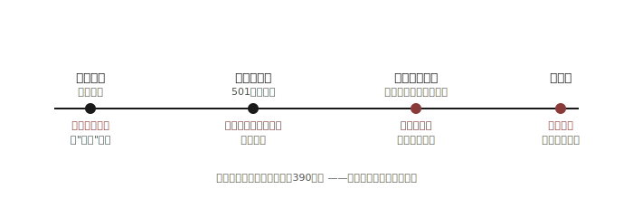
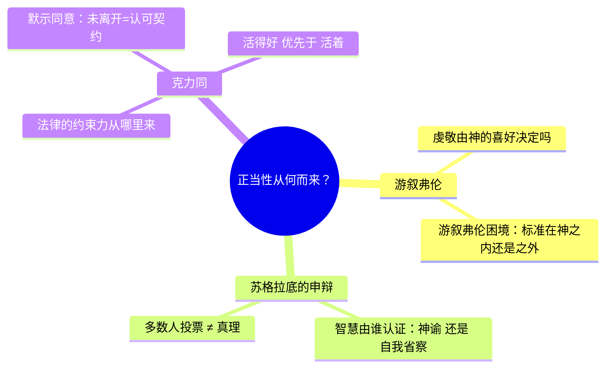
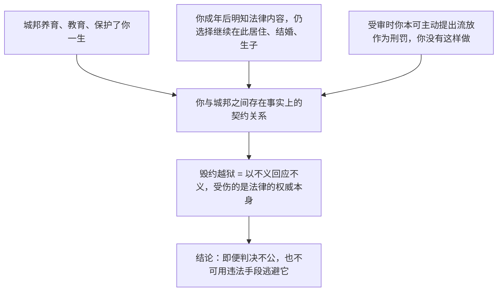

## 《游叙弗伦 苏格拉底的申辩 克力同》读书笔记 
  
### 作者  
digoal  
  
### 日期  
2026-06-20  
  
### 标签  
读书笔记 , 游叙弗伦 苏格拉底的申辩 克力同  
  
----  
  
## 背景 
  
  

---
书名: 《游叙弗伦 苏格拉底的申辩 克力同》  
作者: [古希腊] 柏拉图　译者：严群  
出版社: 商务印书馆（汉译世界学术名著丛书·哲学）  
出版年份: 1999-05  
笔记日期: 2026-06-20  
豆瓣链接: https://book.douban.com/subject/1053009/  
豆瓣评分: 9.3（同译本不同印次评分在8.8~9.3之间，以豆瓣实时数据为准）  
标签: [古希腊哲学, 柏拉图, 苏格拉底, 政治哲学, 伦理学, 法哲学]  
---

  

> **一句话**：一个七十岁的老人，用三场对话告诉雅典——也告诉两千四百年后的我们——"听谁的话"和"什么是对的"，从来不是同一个问题。  
> **适合谁读**：对"法律与道德的关系""权威从哪里来""如何理性地活着"感兴趣的人；想读柏拉图原典而非二手解读的哲学入门者；法学/政治学专业想理解西方"守法义务"思想源头的读者。  
> **阅读难度**：⭐⭐⭐☆☆（篇幅极短，但严群译笔偏文言，初读需要适应）  
> **推荐指数**：⭐⭐⭐⭐⭐（一百多页，承载了整个西方哲学史的起点事件，性价比极高）  
  
---

## 一、时代坐标：这本书从哪里来？

公元前399年春，七十岁的苏格拉底站上了雅典的法庭。控告他的三个人——诗人麦勒图斯、修辞家吕康、政治家安匿托士——给他安了两条罪状：不信城邦的神、败坏雅典青年。501人组成的陪审团投票，结果是一个相当微妙的比数：据后世史家考据，定罪票数仅以约六十票之差通过——只要再有三十来人改投，苏格拉底就会被无罪释放。但更耐人寻味的是，决定"是否判死刑"的第二轮投票，赞成死刑的票数反而比定罪票数更多——苏格拉底在量刑陈词里近乎挑衅地宣称自己该受的是奖赏而非惩罚，把原本摇摆的陪审员彻底推向了对立面。

这场审判发生在一个极不寻常的历史节点：雅典刚刚经历伯罗奔尼撒战争的惨败，又先后被"四百人会议"和"三十僭主"两次寡头政变折腾，民主制度刚刚艰难复辟，对任何可能动摇人心的"异见"都格外敏感。而苏格拉底偏偏是个一辈子追问"什么是真正的知识""谁有资格统治"的人，他公开质疑过雅典靠抽签选官的做法，身边又聚集了一批贵族青年——这些都让他成了民主派眼中现成的箭垒。

柏拉图是苏格拉底最亲近的学生，目睹老师之死后大约在公元前390年代写下了这组对话（据商务印书馆出版说明，约成于公元前392年前后），这是他早期作品中最重要的一组。这不只是一次悼亡，更是柏拉图一生主题——"哲学与城邦该如何相处"——的第一次正式发问。三篇对话恰好对应"苏格拉底之死"的三个时间切片：受审当天庭外偶遇（游叙弗伦）、庭审现场的自我辩护（申辩）、判决之后狱中等待行刑期间老友的最后劝说（克力同）。如果再加上记述刑前最后一夜与服毒过程的《斐多》（未收入本书），就是一组完整的"苏格拉底之死四部曲"。

  

---

## 二、核心命题：作者在说什么？

### 观点一：道德不能简单外包给"权威说了算"（游叙弗伦）

游叙弗伦正要去告自己的父亲杀人，并坚信这是"虔敬"之举。苏格拉底追问他：虔敬到底是什么？几轮交锋后，游叙弗伦给出一个看似稳妥的定义——"凡是神喜欢的就是虔敬的"。苏格拉底当场把它撕开了一道口子，留下了哲学史上著名的"游叙弗伦困境"：**虔敬的事是因为本身虔敬才被神喜欢，还是因为被神喜欢才成为虔敬？** 这两个选项看似一样，实则截然不同——前者意味着善恶有独立于权威意志的标准，后者意味着善恶纯粹是权威一时的好恶。这个困境后来被改写成"上帝命令理论"的核心难题，至今仍是元伦理学绕不开的考题。

### 观点二：真正的智慧，是知道自己的无知（申辩）

苏格拉底讲了一件改变他一生的事：少年好友凯勒丰去德尔斐神庙问"是否有人比苏格拉底更有智慧"，神谕说没有。苏格拉底不信，跑去逐一拜访政客、诗人、工匠这些"专家"，发现他们都自以为知，其实不知；而他自己唯一的优势，是清楚知道自己不知道。由此他把"提醒每一个人省察自己的生活"当成神交给他的使命，宁可一贫如洗、四处招恨也不肯放弃。**"未经省察的人生不值得过"**正是出自这里——这不是一句心灵鸡汤，是他用生命兑现的一句承诺。

### 观点三："活得好"比"活着"更重要（克力同）

老友克力同买通了狱卒，劝苏格拉底连夜逃往外邦。苏格拉底却借虚拟"雅典法律"之口反问自己：你是雅典法律养大、教育、护佑的，一生受益于此邦，从未远走他乡，这难道不是一种默认的契约？如果你觉得判决不公，你本可以在受审时选择流放，你没有选；现在用违法越狱的方式逃跑，伤害的不是判错你的几个法官，而是法律制度本身——这是用一个不义去回应另一个不义。**生活得好，远比单纯地活着更重要**——这是全书最掷地有声的一句判断。

---

## 三、论证地图：作者怎么说服你的？

三篇对话表面讲的是三件不同的事（虔敬、申辩、守法），但内核是同一个问题：**正当性从哪里来？** 是来自权威（神/法律/多数人）的意志，还是来自某种独立存在、可以被理性检验的标准？

《克力同》里最精密的一段，是苏格拉底借"法律"之口展开的连环推理，可以拆成这样一条逻辑链：

这套推理的力量在于类比的生动——把法律比作父母，把公民身份比作受教育的子女，情感上很有说服力。但它的薄弱处也恰恰在于这个类比本身：父母是具体的人，会犯错也会被追责；而"法律"作为一个抽象整体，被苏格拉底塑造成了一个几乎不会出错、不可辜负的角色。这一点，在下一节会具体展开。

---

## 四、前提假设与边界：什么情况下这不成立？

**假设一：道德必须有一个外在于权威意志的客观根据。** 游叙弗伦困境之所以成立，前提是"虔敬"或"善"确实存在某种独立标准。如果一个人本身就是道德相对主义者或虚无主义者，认为善恶根本就是权威说了算、没有第三种答案，那么这个"困境"对他而言根本不构成困境——这恰恰说明了苏格拉底的追问预设了一种他自己想要捍卫的理性主义立场，而非中立陈述。

**假设二："未离开"等于"默示同意"。** 克力同篇里最关键也最脆弱的一环，就是把"你一直留在雅典"等同于"你同意了雅典的全部法律和判决"。这套说法对古代的小型城邦或许还算合理——城邦数量有限，迁居成本相对可控；但放到今天，一个人没有移民他国，更多是因为现实壁垒（签证、语言、家庭、经济），而非对所在国一切法律的真心认可。这正是后世洛克、卢梭把"社会契约论"精细化时必须正面解决、而苏格拉底并未处理的难题。

**边界：这套论证只在"程序公正、结果错误"的情形下站得住。** 苏格拉底自己承认审判程序合乎规矩，他反对的只是判决结果。这意味着《克力同》给出的"不可越狱"结论，并不能简单推广为"任何情况下都不能违抗国家"——如果程序本身就不公正（比如内定结果、剥夺辩护权），这套论证的根基就不再成立。后人把苏格拉底塑造成"绝对守法"的象征，其实是一种危险的简化阅读。

---

## 五、思想谱系：这本书在哪个传统里？

苏格拉底的"诘问法"（不断追问定义、用对方自己的话逼出矛盾）直接孕育了柏拉图的理念论，又间接催生了亚里士多德的逻辑学——这是西方理性主义最早的源头之一。与他同台的，还有一群以辩论求胜、不求真理的"智者派"，苏格拉底始终与他们划清界限：智者教人如何赢，他只关心如何对。

《克力同》里那个"默示同意"的雏形，往下看是社会契约论的远祖，遥遥呼应一千多年后霍布斯、洛克、卢梭对"国家凭什么管我"这一问题的系统回答。往上看，则和《申辩》构成一组耐人寻味的张力：在《申辩》里，苏格拉底公开宣称即使法庭命令他停止哲学探究，他也绝不会服从；但在《克力同》里，他又坚持绝不能用违法手段逃避判决。后来梭罗、马丁·路德·金等人讲的"公民不服从"，其实更接近《申辩》里"拒绝放弃使命"的那一面，而非《克力同》里"绝不越狱"的那一面——同一个苏格拉底，被后人各取所需地引用了两千多年。

---

## 六、我学到了什么？

第一个收获，是重新理解了"提问"的分量。苏格拉底从没有直接告诉游叙弗伦"虔敬到底是什么"，他做的只是一次次把对方自己的定义摆回到对方面前，让矛盾自己浮现出来。这让我想到自己平时讨论问题时，太急于给出结论，反而很少花时间先把概念本身定义清楚——很多争论根本不是观点之争，而是各自心里那个词的含义不一样。

第二个收获，是"未经省察的人生不值得过"这句话的重量。第一次读到它常被当作励志金句来引用，但放回原文语境，会发现这是一个人用生命兑现的承诺：他完全可以认罪悔过换一条命，他没有。这逼着我去想，自己嘴上认同的那些"信念"，有多少经得起类似的代价测试。

第三个收获，是看清了"守法"与"正义"原来是两件可以脱钩的事。苏格拉底没有教我"要听政府的话"，他教我的是：在服从任何规则之前，先想清楚这条规则的正当性到底来自哪里——是来自它本身合理，还是仅仅来自"它是规则"这件事本身。这个区分，看似抽象，其实每天都在发生。

---

## 七、举一反三：这个框架还能用在哪？

**"游叙弗伦式追问"用在职场决策上**：当有人说"这是行业惯例"或"领导要求的"，可以追问一句——这件事是因为本身合理才被这样要求，还是因为被要求了才显得合理？这能帮你快速分辨一项规定是"实质正当"还是"权威正当"，两者需要完全不同的应对策略。

**"克力同式契约审视"用在评估任何群体规则上**：加入一个公司、一个社群、一个平台之前，先想清楚这套规则的正当性来源是什么——是程序公正产生的、是历史惯例延续下来的、还是单纯多数人同意的？想清楚来源，才能想清楚自己服从的边界在哪里，以及在什么情况下"退出"比"忍受"更合理。

**苏格拉底诘问法用在自我反思上**：可以定期挑出自己最确信的三个判断，各自写一个反例去检验它，看它是否还站得住——这正是苏格拉底逼问游叙弗伦的那套方法，用在自己身上同样有效。

---

## 八、批判与反思

我并不完全认同《克力同》的论证。"默示同意"作为说服力的根基，在现代国家面前比在古代小城邦面前要脆弱得多——没有人能真正"离开"全球化体系下纵横交错的国籍与法律网络，这个假设本身需要远比苏格拉底给出的更复杂的辩护，而他显然没有处理这一层。

更尖锐的反思来自美国左翼记者I.F.斯东晚年写的《苏格拉底的审判》：他怀疑柏拉图笔下那个"温和理性、为捍卫真理慷慨赴死"的苏格拉底，其实是一次精心的形象包装——历史上的苏格拉底很可能真正反对的不是"这一次不公正的审判"，而是雅典民主制本身（他公开嘲讽过抽签选官的做法），他身边聚集的也多是反民主的贵族青年。这提醒我们一个常被忽略的事实：**我们读到的"苏格拉底"，永远是柏拉图的苏格拉底**，这就是哲学史上著名的"苏格拉底问题"——历史本人与文学形象之间，隔着一层永远无法完全揭开的纱。

另一个局限是，三篇对话全都遵循柏拉图早期作品"破而不立"的风格：游叙弗伦被问得哑口无言、转身溜走，但全书始终没有给出一个完整、正面的"虔敬"定义。习惯了"读完就该有答案"的现代读者，初读很容易感到一种意犹未尽的落空——但这恰恰是苏格拉底式哲学的本意：留下问题，比急着给出答案更重要。

---

## 九、金句与记忆点

1. **"我自知一无所知"**——苏格拉底自称的全部智慧，不在"知道什么"，而在清楚地知道自己不知道什么。
2. **"未经省察的人生不值得过"**——把理性反思当作生活的必需品，而不是可有可无的点缀。
3. **"活得好，比单纯活着更重要"**——出自克力同篇，质量优先于长度的生命观。
4. **游叙弗伦困境**——"虔敬之事是因本身虔敬而被神喜欢，还是因被神喜欢才成为虔敬？"——任何把道德标准外包给权威的理论，都躲不开这一问。
5. **"我宁可被冤判而死，也不愿用卑劣手段苟活"**——概括苏格拉底面对死刑时拒绝讨饶、拒绝逃亡的姿态。
6. **"以不义回应不义，伤害的终究是规则本身"**——克力同篇反对越狱的伦理底线。
7. **"我去死，你们去活，谁的去路更好，只有神知道"**——申辩篇结尾，一种谦逊又坦然的不确定，而非英雄式的自信宣言。
8. **"多数人的意见，既不能使人明智，也不能使人愚昧，多是出于一时冲动"**——苏格拉底对"人多即真理"这一假设最直接的质疑。

---

## 十、延伸阅读

1. **《斐多》（柏拉图）**——苏格拉底服毒前最后一夜的对话，讨论灵魂是否不死，是这组对话最自然的续篇，补完"苏格拉底之死"的完整图景。
2. **《苏格拉底的审判》（I.F.斯东）**——从"反苏格拉底"的立场出发，质疑柏拉图笔下形象的真实性，提供一个极有价值的对冲视角。
3. **《回忆苏格拉底》（色诺芬）**——苏格拉底另一位亲传弟子笔下更"平实"、更不哲学化的苏格拉底形象，适合和柏拉图的版本对照阅读，体会"苏格拉底问题"。
4. **《会饮篇》（柏拉图）**——同样的对话体、同样的主角，但主题转向爱欲与美，可以看到柏拉图笔下苏格拉底更丰富的一面。
5. **《理想国》（柏拉图）**——苏格拉底诘问法如何从"破"走向"立"，发展成柏拉图自己完整的政治哲学与理念论体系，是理解这组早期对话之后续走向的必读之作。

---

*笔记写于 2026-06-20 | 基于公开资料与深度思考整理*
  
  
#### [PostgreSQL 解决方案集合](../201706/20170601_02.md "40cff096e9ed7122c512b35d8561d9c8")
  
  
#### [德哥 / digoal's Github - 公益是一辈子的事.](https://github.com/digoal/blog/blob/master/README.md "22709685feb7cab07d30f30387f0a9ae")
  
  
#### [About 德哥](https://github.com/digoal/blog/blob/master/me/readme.md "a37735981e7704886ffd590565582dd0")
  
  

  
