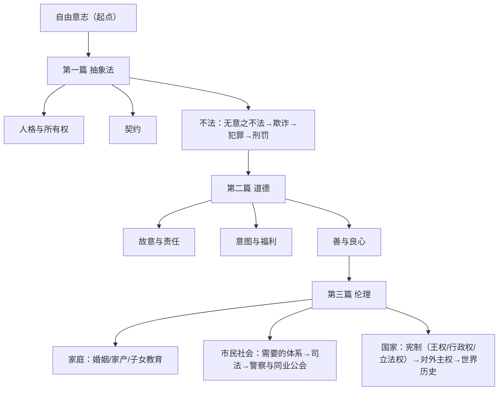
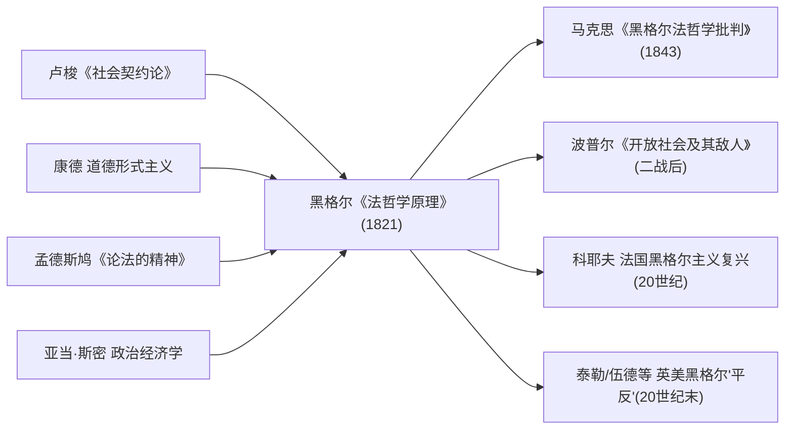

## 《法哲学原理, 自然法和国家学纲要》读书笔记 
  
### 作者  
digoal  
  
### 日期  
2026-06-20  
  
### 标签  
读书笔记 , 法哲学原理 , 自然法和国家学纲要  
  
----  
  
## 背景 
  
  

---
书名: 《法哲学原理》（或自然法和国家学纲要）  
作者: [德] 黑格尔  
译者: 范扬 / 张企泰  
出版社: 商务印书馆  
出版年份: 1961-6  
笔记日期: 2026-06-20  
豆瓣链接: https://book.douban.com/subject/1039771/  
标签: [哲学, 政治哲学, 法哲学, 德国古典哲学, 黑格尔, 国家理论]  
---

  

> **一句话**：自由不是"想干什么就干什么"，而是要在所有权、契约、良心、家庭、市民社会和国家这一整套客观制度里，把自己一步步"做实"。  
> **适合谁读**：哲学/政治学/法学专业的学生和研究者；对"自由如何落地为制度"这个问题有耐心、想啃硬骨头的严肃读者。不建议作为黑格尔的入门读物。  
> **阅读难度**：⭐⭐⭐⭐⭐（5/5，德国古典哲学行话密度极高，建议配合导读）  
> **推荐指数**：⭐⭐⭐⭐☆（4/5，绕不开的经典，但需要带着批判意识去读）  
  
---

## 一、时代坐标：这本书从哪里来？

1820年完稿、扉页标注1821年出版的《法哲学原理》，是黑格尔在柏林大学讲授"自然法与国家学"课程时使用的讲义底本。此时的黑格尔已经50岁，刚刚结束在纽伦堡、海德堡的辗转任教，终于在普鲁士王室的邀请下登上柏林大学的讲席，几年后还会被选为校长——他不再是耶拿时期那个旁观时代风暴的青年哲人，而是某种程度上的"体制内"思想家。

这本书背后的历史压力是双重的。一重是法国大革命和拿破仑战争留下的余震：1806年，名义上存续了近千年的神圣罗马帝国在拿破仑的兵威下解体，德意志各邦的贵族和知识界陷入对"无政府状态"的深切恐惧，法国大革命造成的社会混乱促使黑格尔着重寻求自由意志与社会秩序的统一。另一重是更具体的政治审查压力：1819年的"卡尔斯巴德决议"加强了对大学和言论的管控，据中国社会科学网刊载的研究，黑格尔甚至被迫撤回已经提交的初稿做大幅修改，书中大量看似离题的批注，其实是在同时回应卢梭的社会契约论、康德的形式主义伦理学、历史法学派代表萨维尼、以及哈勒的反理性国家观——这是一份写给"战后重建期"的德国精英、教他们如何理性地理解国家的教材。

所以,这本书要解决的问题从来不是抽象的"什么是正义"，而是非常具体的：在大革命已经证明"从头推翻一切重新设计"会失败、旧式君主专制又已经证明无法持续的历史时刻，一个现代国家究竟应该如何被理性地组织起来？

---

## 二、核心命题：作者在说什么？

### 命题一：自由不是"任性"，而是在客观制度中的自我实现

黑格尔对"自由"的定义,是全书最具颠覆性的起点。他不否定"想干什么就干什么"也是一种自由（他称之为"任性"），但认为这只是自由的最低、最空洞的形态。真正的自由意志,必须通过外部的所有权、契约去客观化自己,再通过内心的良心去反思自己,最后在家庭、市民社会、国家这些"伦理"实体中找到自己真正的栖身之所。换句话说,自由不是消除约束,而是在恰当的约束结构里认出自己——这恰恰是对洛克式"自由即免于他人干涉"和卢梭式"自由即服从自己立的法"这两条启蒙路线的同时改写。

### 命题二：国家不是契约的产物，而是伦理理念的最高现实

这是全书最具争议、也最容易被误读的命题。黑格尔明确反对把国家理解为一群原子化个人为了保护私利而签订的契约——在他看来,这种契约论思路把国家降格成了市民社会的延伸,本质上还是"任性"的逻辑,无法说明国家为什么能够要求个体为公共事务牺牲。国家之所以高于家庭和市民社会，是因为只有在国家中，个体的特殊利益才能与普遍利益真正统一,而不再是市民社会里那种靠警察和同业公会勉强维持的、脆弱的统一。

### 命题三："凡是合乎理性的东西就是现实的"——一句常被断章取义的序言名言

黑格尔在序言里抛出的这句话，长期被简化为"现状即合理"，成为他被扣上"为普鲁士专制辩护"帽子的最直接证据。但更细读的话，黑格尔区分的是表面经验意义上偶然存在的事物（Dasein）和真正实现了自身概念、具有内在必然性的"现实"（Wirklichkeit）——按这个区分，很多看似存在的东西（比如他举例的某种偶然的国家形态）其实并不"现实"，因为它并未真正实现理性。这并不能完全洗清这句话的保守色彩，但至少说明问题比"为现状辩护"复杂得多，这也是后世围绕这句话打了一百多年笔仗的原因。

---

## 三、论证地图：作者怎么说服你的？

黑格尔几乎不使用统计数据或具体历史案例去做经验论证（这点和孟德斯鸠《论法的精神》式的比较政治学完全不同）。他的方法是一种"概念的自我运动"：从一个范畴内部暴露出的矛盾，辩证地"逼出"下一个更高、更具体的范畴。整本书的骨架可以画成这样一张图：

这条链路的说服力来自它的"层层升级感"：抽象法阶段的自由意志只活在外部物品里，一旦遇到犯罪和惩罚就暴露出自己的脆弱（一个人的所有权可以被偷走、被毁坏）；于是自由意志退回内心，变成道德——但道德又有自己的软肋，黑格尔特别警告"良心"如果不接受任何外在客观标准的约束，很容易滑向他所说的"恶"（一种以"我的良心觉得对就是对"为名的自我膨胀）；只有进入家庭、市民社会、国家这套客观伦理秩序，自由才算真正"落了地"。

但论证漏洞也恰恰出现在最后一跳——从市民社会到国家。黑格尔花了大量篇幅描述市民社会内部的"需要的体系"（劳动分工、财富分化）、司法和"警察与同业公会"这套中介机制，承认市民社会会不断生产贫困和分裂；可一旦讨论到国家，他笔锋一转，开始为君主制、世袭长子继承制、按等级划分的议会代表制做辩护，逻辑链条明显比前面松了很多。这正是后来马克思抓住不放的破绽：与其说黑格尔是从概念推出了普鲁士式的国家制度，不如说他是先把普鲁士现实"塞进"了辩证法的外壳。

---

## 四、前提假设与边界：什么情况下这不成立？

**假设一：历史本身有一个朝向自由的、内在必然的理性方向。** 这是黑格尔整套体系（也包括他的历史哲学）的底层信念——历史不是偶然事件的堆积,而是"自由"这个理念不断自我实现的过程。在经历了两次世界大战、极权主义、以及后现代思想对"宏大叙事"的普遍怀疑之后，今天很难再无条件接受这种历史目的论。哪怕是后来试图复活这一框架的福山"历史终结论"，也在21世纪的现实面前显得相当脆弱。

**假设二：国家可以是真正"普遍利益"的承担者，而不只是特殊利益的伪装。** 黑格尔承认市民社会内部充满阶层分化和利益冲突，却假设这些冲突一旦进入国家层面就能被理性地调和。马克思的反驳直指这里：现实中的国家（尤其是黑格尔身处的普鲁士官僚国家）恰恰是某个等级、某种特殊利益用"普遍性"的名义包装自己的工具。这个假设在任何存在结构性阶级分化或既得利益集团的社会里都需要被打上问号。

**假设三：同业公会、等级这类中介组织能够把个体的特殊性和社会的普遍性缝合起来。** 黑格尔体系里，家庭之后的"第二个基础"就是等级和同业公会，正是它们让市民社会不至于彻底原子化、彼此为战。这个假设在工业行会、传统手工业还相对稳固的19世纪初有一定现实基础，但放到今天高度流动、平台化、零工经济盛行、传统行会几乎消失的社会里，这套"中介结构"基本上已经失去了它原来的现实承载——这也是这本书最明显过时的地方之一。

---

## 五、思想谱系：这本书在哪个传统里？

黑格尔站在德国古典哲学这条线的末端（康德—费希特—谢林—黑格尔），但他对"法"和"国家"的处理方式，是在跟整个启蒙政治哲学传统对话甚至对抗：他既要消化康德的道德形式主义、又要拒绝卢梭式的社会契约论，同时也在吸收孟德斯鸠的政体类型学和亚当·斯密的政治经济学（市民社会里"需要的体系"明显带着英国古典经济学的痕迹）。

这本书之后的命运几乎是一部"黑格尔政治哲学接受史"的缩影：马克思把矛头对准书中第261至313节关于国家的论述，写出《黑格尔法哲学批判》，提出黑格尔把现实"头足倒置"地塞进了思辨逻辑；二战之后，流亡哲学家波普尔在《开放社会及其敌人》里，把黑格尔和柏拉图并列为通向现代极权主义的关键环节；而到了20世纪后期，查尔斯·泰勒、阿维纳瑞、艾伦·伍德等英美学者又反过来为黑格尔"平反"，强调他书中其实包含立宪君主制、出版自由、陪审团等相当克制的自由主义元素，认为波普尔式的"极权主义"标签本身是一种历史性的误读。一本书能在两百年里被同时读成"专制辩护书"和"宪政自由主义文本"，这本身就很说明它的论证留有多大的解释空间。

---

## 六、我学到了什么？

第一个收获，是黑格尔逼着我重新检查"自由"这个词的用法。我以前默认的自由观大体是"消极自由"——别人不干涉我，我就自由了。读完才意识到，这个定义对"我该如何与他人、与制度共处"这件事几乎没有任何解释力：一个完全没有约束的人，反而最容易陷入黑格尔说的"任性"，被自己的冲动牵着走。把自由理解为"在恰当的制度结构里认出并实现自己"，这个框架本身比我原来的版本更有解释力，哪怕我并不打算接受黑格尔关于"国家"是那个唯一恰当结构的结论。

第二个收获，是看清楚了"辩证法"作为一种论证工具的真正风险。黑格尔的体系读起来非常自洽，每一步都"看起来"是逻辑必然的——但当我对照马克思的批评去读伦理篇的国家部分，才发现这种自洽感很容易掩盖一个事实：作者其实是先有了想要的结论（君主立宪、等级议会），再去给它套上一层"概念自我运动"的外壳。这不只是黑格尔的问题，而是任何"体系性论证"都要警惕的陷阱——逻辑的严密性，和论证的可靠性，是两件事。

第三个收获，是重新理解了"中介组织"在现代社会里的位置。黑格尔把家庭之后的第二级伦理实体放在同业公会和等级，而不是直接跳到国家——这提醒我，一个健康的社会结构需要在"原子化个体"和"庞大国家"之间有一层中间组织（行会、社团、社区），去消化个体的特殊利益。今天讨论平台经济里零工劳动者缺乏组织化议价能力的问题时，黑格尔两百年前的这个洞察反而显得相当超前。

---

## 七、举一反三：这个框架还能用在哪？

黑格尔"从抽象到具体"的方法论——任何一个原则只有经过层层制度化的检验，才能算真正落地——可以迁移到很多今天的讨论里：

**公司治理与ESG讨论**：一个"股东利益最大化"的抽象原则（类似黑格尔的"抽象法"阶段），如果没有进一步嵌入到具体的治理结构（董事会制衡、信息披露、利益相关方机制），很容易在现实中沦为对短期任性行为的纵容，这跟黑格尔批评"抽象法"必然滑向不法的逻辑结构高度相似。

**行业协会与零工经济治理**：黑格尔强调同业公会是连接个体利益和社会普遍利益的关键中介。今天平台经济下外卖骑手、网约车司机等群体缺乏类似的组织化中介，正是黑格尔意义上"市民社会"缺了一环——这给思考新业态劳动者权益保护提供了一个现成的结构性视角。

**宪制设计讨论**：黑格尔对君主、贵族、人民三个要素如何"理性地合作且相互包容"的论述（哪怕结论本身已经过时），其方法——任何单一权力主体都不能独占"普遍性"的代表权——仍然是理解分权制衡、混合政体设计的一个有用的分析起点。

---

## 八、批判与反思

我不同意的地方很直接：把君主制、世袭继承制度说成是"理性"在国家篇章里的必然展开，这一步的论证强度明显撑不住前面几百节那么严密的辩证推进，更像是一种政治立场的"事后包装"。马克思的批评在这一点上是有力的——黑格尔确实存在把普鲁士现实当作理念的"现成答案"去反向论证的问题。

时代已经变了的地方也很明显：黑格尔依赖的"等级—同业公会"这套中介结构，在今天高度流动、个体化、平台化的社会里基本已经瓦解；他对"世界历史"自带方向性的乐观，在经历20世纪的灾难之后也很难再被照单全收。

这本书的局限性，归根结底在于它太想"一次性"地把自由、伦理和国家缝合进一个无矛盾的体系——而现代政治生活里最真实的部分，恰恰是这些价值之间持续的、不会被一次性"扬弃"掉的张力。黑格尔的体系越完整，对这种持续张力的容纳空间反而越小。

---

## 九、金句与记忆点

1. **"密涅瓦的猫头鹰要等黄昏到来，才会起飞。"**——序言里最著名的隐喻：哲学的反思总是滞后于现实的发生，思想只能解释已经成熟的世界，不能预先为尚未到来的未来立法。

2. **"凡是合乎理性的东西就是现实的。"**——全书最具争议的一句，关键在于黑格尔区分了"偶然存在"与"真正现实"，但这区分本身又给了这句话足够大的解释弹性，导致它被左右两边各自征用了一百多年。

3. **"自由意志只有作为客观的东西才是现实的。"**——这是对全书核心命题最浓缩的概括：自由必须客观化，停留在主观意愿层面的自由,在黑格尔看来还不算真正的自由。

4. **"国家是伦理理念的现实。"**——黑格尔对国家的定位，直接区别于社会契约论把国家当作工具性安排的思路。

5. **同业公会与等级**——黑格尔没有把这个概念写成一句格言，但作为一个记忆点：他认为市民社会的自我瓦解倾向，恰恰要靠这类中介组织去缝合,这是理解他"伦理"概念最被低估的一块。

6. **"理性的狡计"**（虽然更常出现在他的历史哲学论述中，但贯穿了《法哲学原理》第三篇"世界历史"一节）——历史的进步往往借助个人或民族并不自知的私欲来实现自己，行动者本身可能从未意识到自己正在被"用来"实现某个更大的历史目的。

---

## 十、延伸阅读

1. **卡尔·马克思《黑格尔法哲学批判》**——针对本书国家篇章最直接、最锋利的反题，理解黑格尔政治哲学绕不开的"正反合"下半场。
2. **卡尔·波普尔《开放社会及其敌人》（下卷）**——20世纪把黑格尔打成"极权主义教父"的源头文本，即便观点本身极具争议，也是绕不开的论战背景。
3. **高兆明《黑格尔法哲学原理导读》**——国内系统讲解本书的专门导读，适合在啃原典之前先搭一个框架。
4. **黑格尔《精神现象学》或《小逻辑》（《哲学全书》第一部分）**——理解《法哲学原理》背后那套"客观精神"框架的逻辑学根基，没有这层底座，法哲学的很多论证会显得突兀。
5. **查尔斯·泰勒相关黑格尔研究**——英美学界为黑格尔"去妖魔化"的代表性思路，提供一种更宽容、更宪政自由主义式的解读，可以和波普尔的批判对照着读。

---

*笔记写于 2026-06-20 | 基于公开资料与深度思考整理。豆瓣页面的实时评分因站点屏蔽自动访问未能直接抓取，文中相关数据均以检索到的公开学术与百科资料为准。*
  
  
#### [PostgreSQL 解决方案集合](../201706/20170601_02.md "40cff096e9ed7122c512b35d8561d9c8")
  
  
#### [德哥 / digoal's Github - 公益是一辈子的事.](https://github.com/digoal/blog/blob/master/README.md "22709685feb7cab07d30f30387f0a9ae")
  
  
#### [About 德哥](https://github.com/digoal/blog/blob/master/me/readme.md "a37735981e7704886ffd590565582dd0")
  
  

  
