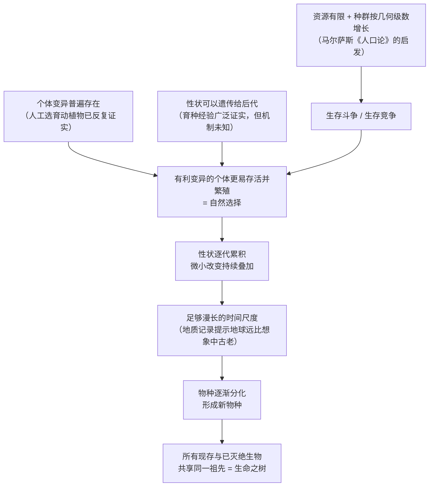
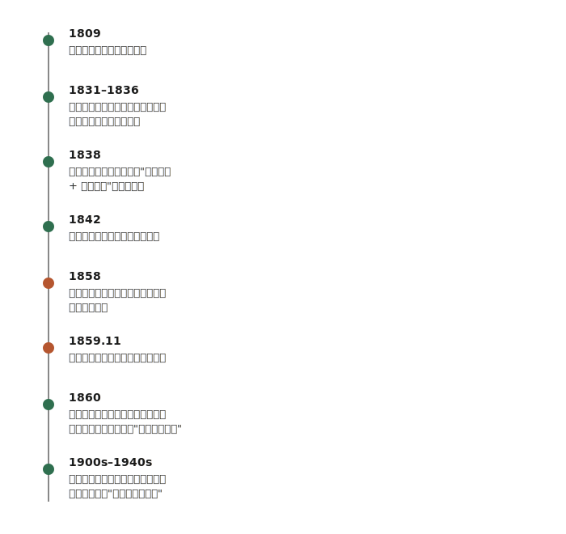

## 《物种起源》读书笔记 
  
### 作者  
digoal  
  
### 日期  
2026-06-20  
  
### 标签  
读书笔记 , 物种起源  
  
----  
  
## 背景 
  
  

---
书名: 《物种起源》  
作者: [英] 查尔斯·达尔文（周建人 / 叶笃庄 / 方宗熙 译）  
出版年份: 原著 1859 年；本笔记依据 1995-06 商务印书馆"汉译世界学术名著丛书"版（ISBN 9787100012065）  
笔记日期: 2026-06-20  
豆瓣链接: https://book.douban.com/subject/1071384/  
豆瓣评分: 8.6（2000+ 人评价）  
标签: [进化论, 生物学, 自然科学, 经典, 哲学, 科学史]  
---

  

> **一句话**：达尔文用近二十年攒下的证据，和一种"把自己的弱点说成证据"的论辩智慧，把"生命从哪里来"这个神学问题，变成了一个可以靠观察和逻辑去回答的科学问题。  
> **适合谁读**：对"人到底是怎么来的"抱有好奇心的人；想看一流科学家如何在证据并不完美的情况下，依然说服整个世界的人；只在"优胜劣汰"四个字层面理解过"进化论"、想搞清楚背后到底发生了什么的人。  
> **阅读难度**：⭐⭐⭐⭐☆（4/5。维多利亚时代的英文即便译成中文，句子依然绵长，案例堆叠密度很高，需要耐心）  
> **推荐指数**：⭐⭐⭐⭐⭐  
  
---

## 一、时代坐标：这本书从哪里来？

1859 年的英国，"上帝六天造物、物种从被创造出来就一成不变"几乎是公共常识，质疑它在当时近乎冒犯。达尔文本人也是在这套常识里长大的——他先学医，后入剑桥学神学，22 岁才作为博物学家登上贝格尔号军舰，开始一场五年的环球科学考察。正是在南美洲的地质剖面和加拉帕戈斯群岛的雀鸟与陆龟身上，他看到了让自己困惑的东西：同一片大陆上，现存动物和已灭绝化石之间存在某种说不清的"亲缘"；不同小岛上的同类生物又会出现细微而稳定的差异。

回到英国后，达尔文把这份困惑压了二十年。1838 年，他读到马尔萨斯《人口论》——人口按几何级数增长、粮食按算术级数增长，资源永远跟不上繁殖——这个模型给了他关键的拼图：如果把"人口"换成"任何物种"，"生存斗争"就是自然界的常态。他在 1842 年就写出了完整提纲，却一直没有发表。直到 1858 年，年轻的博物学家华莱士从马来群岛寄来一篇论文，提出的机制和他几乎一致。两人在伦敦林奈学会联合宣读论文后，达尔文才在第二年仓促赶出了这部原本计划写成数千页巨著的"摘要"。换句话说，这本书的诞生时机，一半是二十年的蓄力，一半是被同行"逼"出来的。

---

## 二、核心命题：作者在说什么？

### 观点一：物种不是被分别创造的，而是从共同祖先演化而来

所有现存与已灭绝的生物，都可以追溯到极少数甚至单一的祖先，像一棵不断分枝、又不断有枝条枯萎的大树——这就是达尔文著名的"生命之树"比喻。这一观点直接否定了"物种不变论"，也是全书最具颠覆性的部分：它意味着人类自身也必然在这棵树上,只是达尔文在正文里非常克制地没有把这句话挑明说。

### 观点二：自然选择是演化的主要驱动机制

个体之间普遍存在微小变异，这些变异可以遗传；而资源永远有限，于是产生生存斗争；在斗争中，碰巧更适应环境的变异个体更容易存活并留下后代，这种优势经过千万代累积，就足以让物种发生根本性的改变。达尔文称之为"自然选择"，并特别强调它和人类养鸽、育种时的"人工选择"是同一种逻辑，只是选择者换成了无意识的自然环境。

### 观点三：自然法则本身足以解释生命的全部复杂性

这是一个隐藏在前两点背后、却更具方法论意义的立场：眼睛的精巧、本能的复杂、物种的地理分布、胚胎发育中的相似性——这些过去被当作"神迹证据"的现象，达尔文逐一证明都可以用同一套自然机制来解释，不需要额外引入"设计者"。这种"用一个机制统一解释一切"的野心,放在今天看依然惊人。

---

## 三、论证地图：作者怎么说服你的？

达尔文自己把这本书称为"一部长篇的论辩"，他的论证素材主要来自三处：贝格尔号航行五年积累的地质与动植物标本、英国养鸽人和育种者的实践经验、以及他和全球同行长期通信换来的标本与观察记录。他甚至花了八年时间专门研究藤壶，只是为了让自己有资格在分类学上"有发言权"。

最值得称道的是他的论证策略：把别人用来攻击他的弱点，反过来变成证据。批评者质问——如果演化是真的，为什么化石里找不到那么多"过渡形态"？达尔文的回答是：地质记录本身就是一部支离破碎、缺了大半页的史书,找不到不代表不存在。然后他反手用"地质记录不完整"去解决另一个更棘手的问题——演化需要的时间从哪来？答案是,正因为记录残缺，我们低估了地球历史的真实长度，时间远比想象中充裕。这种"坦然承认无知、再把无知本身变成论据"的写法,与其说是科学论证,不如说更接近一场极其克制而高明的辩论。

---

## 四、前提假设与边界：什么情况下这不成立？

第一个假设是"变异可遗传"，但达尔文完全不知道遗传的物理机制——孟德尔的遗传定律虽然 1865 年就已发表，却被学界忽视了近三十五年，达尔文终其一生都没等到这块拼图。这是全书最大的"黑箱"，也是他晚年自己都承认"自然选择学说基础并不牢靠"的根源。第二个假设是"地球历史足够漫长"，这一假设当时正面遭到物理学家开尔文男爵基于热力学计算的强烈挑战（他认为地球年龄远不够演化发生），要等到 20 世纪放射性测年法出现，这个假设才被真正坐实。第三个假设是"演化是连续渐进的"——达尔文反复强调"自然不能飞跃"，这一渐进论假设在 20 世纪后期遭到古尔德等人提出的"间断平衡"理论修正：演化速率并非匀速，往往是长期停滞与短期剧变交替。

也就是说，这本书的核心结论——演化真实发生、自然选择是主要机制——经过了一个半世纪的检验依然站得住，但支撑它的具体细节（遗传机制、时间尺度、演化节奏）几乎全部需要后人补全或修正。这恰恰说明了一个好理论的样子：核心框架正确，留出的空白由后人填满。

---

## 五、思想谱系：这本书在哪个传统里？
  
  
  
达尔文的思想资源很清晰：地质学家莱尔的"均变论"教会他"缓慢的力量经过足够长的时间也能造出宏大结果"；马尔萨斯的人口模型给了他"生存斗争"的数学直觉；而他和法国学者拉马克的"用进废退说"恰恰是对照组——拉马克认为生物会主动适应环境并把"获得性状"遗传下去,达尔文则坚持变异是先天、随机产生的,选择只是被动筛选,这个分歧在今天的分子生物学框架里基本以达尔文一方胜出告终（尽管表观遗传学的一些发现让这场争论有了新的微妙余地）。

这本书出版后最戏剧化的延伸,是 1860 年的牛津论战:年轻的赫胥黎自称"达尔文的斗犬",在公众场合与牛津主教正面交锋,把进化论从一本书的内容,变成了一场公共舆论事件。再往后看,这本书的遗产是双面的——它催生了 20 世纪与孟德尔遗传学结合而成的"现代综合进化论",也间接催生了斯宾塞提出、却被滥用进种族政策和优生学的"社会达尔文主义"，后者完全偏离了达尔文本人的初衷，却也提醒我们：一个解释力极强的科学隐喻一旦流入公共话语，作者就再也无法收回它的使用权。

---

## 六、我学到了什么？

第一个真正击中我的地方，是达尔文处理"无知"的方式。他没有等到证据齐全才发表,而是把每一个证据缺口都坦白写出来,再说明为什么这个缺口不足以推翻整个框架。这和我们今天习惯的"做完所有实验再发论文"的科研文化很不一样,却可能才是面对复杂系统时更诚实的态度——很多时候,你永远等不到"证据齐全"的那一天。

第二个收获,是重新理解了"自然选择"这个词。我过去下意识把它和"弱肉强食、你死我活"绑在一起,但读完才发现,达尔文用"生存斗争"这个词,更多是一种隐喻式的表达,涵盖的是个体和环境、个体和同类之间各种形式的竞争与依存关系,而不是字面意义上的厮杀。后来"适者生存"这个更具煽动性的说法,其实是斯宾塞造出来的,达尔文是在后续版本里才借用过来。一个理论被简化成一句口号之后,往往已经离它本来的样子很远了。

第三个收获,是看到了一个伟大理论"留白"的力量。达尔文不知道遗传机制是什么,他坦然承认这一点,却依然把整体框架立住了。一个理论不需要解释一切细节才算成立,只需要把核心机制说对,剩下的留给后人去填——这对我理解任何一种"框架性思考"都有启发。

---

## 七、举一反三：这个框架还能用在哪？

"个体变异 + 选择压力 + 长时间累积"这套框架,本质上是一种通用的演化算法,可以迁移到很多非生物领域。比如产品迭代：一个团队不断小范围试错(变异),市场反馈决定哪些版本活下来(选择压力),长期坚持下来的产品形态往往不是一次设计出来的,而是无数次小修小改的累积结果。比如个人习惯的养成：每天的微小选择本身造不成什么差别,但放在足够长的时间尺度上叠加,就能塑造出截然不同的人。再比如一个领域的知识演进：科学共同体里不断有新的观点变异产生,经过同行评审和实验检验的"选择压力",留下来的理论被反复使用、巩固,被证伪的逐渐消失——这本身就是一种知识的"自然选择"。这套框架最有用的地方,恰恰在于它不依赖某个"设计者"的全局规划,而是相信微小、局部、持续的调整,长期来看可以产生出谁都没有提前设计过的复杂结构。

---

## 八、批判与反思

我不完全认同的地方,是这本书对"生存斗争"这个隐喻的使用代价。达尔文本意是用一个相对中性的术语描述自然界的资源竞争,但这个词一旦流传开,极容易被简化为"弱肉强食天经地义",并被后来的社会达尔文主义者拿去为殖民、种族歧视和优生学辩护——这不是达尔文的错,但也提醒我们,任何强解释力的隐喻在传播过程中都会被各取所需地误读，作者的"本意"管不住语言的"后效"。

时代变化最明显的地方,是这本书完全是在"遗传是黑箱"的前提下写成的。今天我们已经知道 DNA、基因、突变的分子机制,达尔文当年只能依赖大量的间接观察去拼出一个轮廓。这并不削弱他的成就——反而让人更敬佩他在信息如此有限的情况下,依然能把核心框架立得这么准。

这本书的局限性,更多体现在它解释力的边界上。比如蜜蜂、蚂蚁这类"利他行为"在达尔文原始的"个体生存竞争"框架里其实不太好解释——一只工蜂放弃自己的繁殖机会去帮助蜂群,这种行为要等到 20 世纪"亲缘选择""自私的基因"等理论补完才说得通。达尔文本人也专门讨论过这个"难题",但没有真正解决它。

---

## 九、金句与记忆点

1. **"生命之树"** ——用一棵不断分枝、又不断有枝条枯萎的大树,比喻所有生物共享同一祖先的演化关系,是全书最广为流传的意象。
2. **"一部长篇的论辩"** ——达尔文自己对这本书的定位,提醒我们这本书不是单一实验的报告,而是一整条证据链的累积说服。
3. **"自然不能飞跃"** ——他反复强调的渐进论原则:自然选择只能通过无数微小的连续步骤起作用,无法一步跨到复杂结构。
4. **"缠结河岸"** ——书末的著名段落,用河岸上彼此纠缠生长的植物、鸟类、昆虫、蚯蚓所构成的繁茂景象,表达"看似混乱的生命世界背后其实有自然法则在运作"的恢宏感受。
5. **人工选择 = 自然选择的入门钥匙** ——他用人类几千年驯化动植物的经验,作为读者理解"无意识的自然如何'选择'"的桥梁,是全书最巧妙的类比设计。
6. **"适者生存"其实不是达尔文发明的** ——这个更具传播力的说法出自斯宾塞,达尔文在后续版本中才借用过来,但两者常被混为一谈。
7. **地质记录是"一部支离破碎的史书"** ——他用这句话同时解决了两个难题:为什么找不到那么多过渡化石,以及演化需要的时间从哪里来。
8. **诚实面对无知,但向神创论开战** ——这是不少读者对达尔文写作态度的总结:他从不掩饰证据的不完整,却始终坚定地拒绝用"神迹"去填补空白。

---

## 十、延伸阅读

- **《物种起源》苗德岁译本**（译林出版社）——古生物学家亲自翻译并撰写导读,专业背景让一些晦涩的生物学论证更容易消化,可以和这本商务印书馆的经典译本对照着读。
- **《盲眼钟表匠》理查德·道金斯** ——直接回应"生物的精巧设计是否需要设计者"这一问题,是对达尔文核心论证在现代语境下最有力的延展。
- **《自私的基因》理查德·道金斯** ——把自然选择的作用单位下沉到基因层面,补全了达尔文原始框架里"利他行为"解释不力的缺口。
- **《人口论》托马斯·马尔萨斯** ——读懂这本书,才能真正理解达尔文"生存斗争"概念最初的数学直觉来自哪里。
- **《达尔文传》珍妮特·布朗（Janet Browne）** ——两卷本权威传记,呈现达尔文从环球考察的青年到迟疑二十年才发表理论的复杂心路历程。

---

*笔记写于 2026-06-20 | 基于公开资料与深度思考整理*
  
  
#### [PostgreSQL 解决方案集合](../201706/20170601_02.md "40cff096e9ed7122c512b35d8561d9c8")
  
  
#### [德哥 / digoal's Github - 公益是一辈子的事.](https://github.com/digoal/blog/blob/master/README.md "22709685feb7cab07d30f30387f0a9ae")
  
  
#### [About 德哥](https://github.com/digoal/blog/blob/master/me/readme.md "a37735981e7704886ffd590565582dd0")
  
  

  
