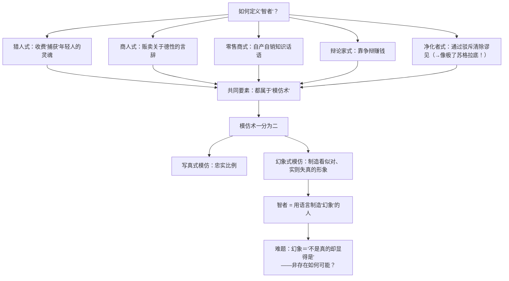
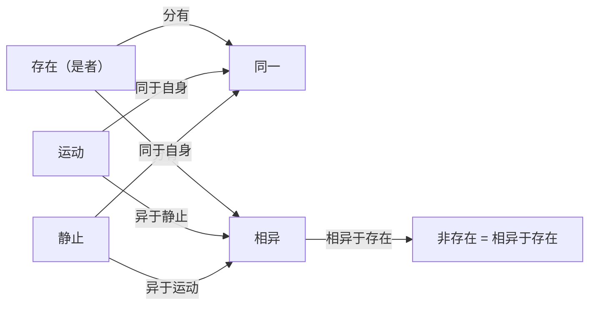

## 《智者》读书笔记 
  
### 作者  
digoal  
  
### 日期  
2026-06-20  
  
### 标签  
读书笔记 , 智者  
  
----  
  
## 背景 
  
  

---
书名: 《智者》  
作者: [古希腊] 柏拉图  
译者: 詹文杰  
出版社: 商务印书馆  
出版年份: 2012-10  
丛书: 汉译世界学术名著丛书·哲学  
豆瓣链接: https://book.douban.com/subject/6974378/ （同一译本2011年初版条目，2012年为重印本）  
豆瓣评分: 8.9（172人评价，2011年初版条目数据）  
标签: [哲学, 古希腊哲学, 柏拉图, 形而上学, 西方哲学经典]  
笔记日期: 2026-06-20  
---

  

> **一句话**：为了说清楚"假话"为什么可能存在，柏拉图"弑父"般地推翻了老师辈巴门尼德"非存在绝对不可说"的禁令，从此哲学才有了谈论虚假、幻象与模仿的资格。  
> **适合谁读**：已经读过《理想国》《会饮》《斐多》等柏拉图中期对话，想往"硬核形而上学"再进一步的进阶读者；不建议作为西方哲学入门书。  
> **阅读难度**：⭐⭐⭐⭐⭐（5/5，柏拉图最艰涩的对话录之一）  
> **推荐指数**：⭐⭐⭐⭐☆（4/5，烧脑但回报极高）  
  
---  

## 一、时代坐标：这本书从哪里来？

《智者》是柏拉图晚年的作品，写作时间大致在他经历了三次西西里之行的政治幻灭之后。柏拉图早年怀着"哲学王治国"的理想三下叙拉古，试图教化僭主，结果一再被驱逐甚至被扣留，现实政治的失败让他把全部精力收回到雅典城外的学园里做纯粹的概念工作。《智者》正属于这一批"退而著述"的晚期对话——和《巴门尼德篇》《泰阿泰德》《政治家》《斐勒布》同属一组，标志着柏拉图思想从"理念论"的早期版本转向更精密的"通种论"。

更深的问题意识，其实早在苏格拉底之死那里就埋下了。苏格拉底被雅典民主政权以"蛊惑青年、不敬神明"的罪名处死，而控告他的逻辑，某种程度上正是把他和当时那批收费授徒、教人辩论术的职业教师——"智者"（如普罗泰戈拉、高尔吉亚）——混为一谈。柏拉图一生都在做一件事：把苏格拉底（真正爱智慧的人）和智者（只是看起来有智慧的人）划清界限。《智者》就是这场"划界工程"的正面攻坚：它不再满足于讲故事式地嘲讽智者，而是要用最严格的逻辑方法，给"智者"下一个经得起推敲的定义。

有意思的是，这篇对话在剧情上紧接《泰阿泰德》的"第二天"，但主角换成了一位沉默寡言的"爱利亚客人"（来自巴门尼德、芝诺的故乡爱利亚），苏格拉底全程几乎只是旁听者。这个安排本身就是个信号：柏拉图要借一位忠于爱利亚学派方法、却敢于挑战爱利亚学派教条的人物，去完成一次思想史上著名的"弑父"——亲手推翻巴门尼德"非存在不可说、不可想"的核心命题。

---

## 二、核心命题：作者在说什么？

### 命题一：智者是"语言中的幻象制造者"

全书用了六到七轮"划分法"（diairesis）层层逼近"智者"的定义：先把他比作猎人（靠收费"捕获"年轻人）、商人（贩卖关于德性的言辞）、零售商、辩论家，乃至第六种定义——一个通过反复辩驳、清除谬见来"净化灵魂"的人，这一版定义和苏格拉底本人惊人地相似，让人意识到智者与哲人之间的界限有多么微妙。最终，柏拉图把这些定义归入"模仿术"，又把模仿术劈成两支：忠实呈现比例的"写真式模仿"，和故意制造视觉/语言偏差以"看起来对"的"幻象式模仿"。智者，就落在后一支：他不传授真知识，只生产关于一切事物的、足以以假乱真的言辞图像。

### 命题二："非存在"不是虚无，而是"相异"

但这个定义立刻撞上一个逻辑陷阱：要说智者"制造虚假的东西"，就必须承认"非存在"以某种方式"存在"，否则虚假、错误、幻象统统无法被谈论——这正是巴门尼德当年极力禁止的"非是者是"。柏拉图的解法是：非存在不是绝对的虚无（不是"无"本身），而只是"与存在不同"，即"相异"。某物"不是"另一物，仅仅意味着它和那物"相异"，并不意味着它什么都不是。这一步看似简单,却把希腊哲学从巴门尼德式的"存在的牢笼"里解放了出来。

### 命题三：通种论——五个最普遍的"种"彼此交织

为了给上述论证打地基，柏拉图引入了"存在""运动""静止""同一""相异"五个最普遍的范畴（通种），论证它们之间既相互区别又相互交织、彼此分有。这套"通种论"被后世普遍视为亚里士多德《范畴篇》、乃至康德范畴表的远祖。

---

## 三、论证地图：作者怎么说服你的？

解决这个难题，柏拉图调用的关键数据不是经验证据，而是纯粹的概念分析——他重新审视"存在""运动""静止""同一""相异"五个范畴如何两两相通：

这套论证最精彩也最危险的地方在于：它完全靠概念之间的逻辑关系自我支撑，没有任何经验案例或数据佐证。柏拉图举的"例子"也几乎都是高度抽象的（运动、静止本身），这既是它的力量（普适、严密），也是它的软肋（一旦概念边界本身可疑，整套大厦就会跟着摇晃）。

---

## 四、前提假设与边界：什么情况下这不成立？

第一个隐含假设是"概念有客观且固定的边界，可以被精确切割成互不重叠的类"。划分法的全部说服力都建立在这一点上。但如果某个概念本身是连续谱（比如"专家"和"非专家"之间往往没有清晰分割线），划分法就容易制造武断的二分。

第二个假设是"存在可以脱离时间和生灭来谈论"——这是理念论一脉相承的立场。这与后来怀特海等过程哲学、强调"存在即过程"的本体论是正面冲突的；如果你接受一切实在本质上都是流变的，柏拉图这里对"静止的存在"的执着就会显得格格不入。

第三个假设是"逻各斯（言说/逻辑）能够可靠地对应实在"，即概念分析穷尽真理是可能的。这一假设在二十世纪遭到了维特根斯坦"家族相似性"理论和海德格尔对"逻各斯中心主义"的双重质疑。

适用边界：这本书提供的更多是一种"方法论的礄石"——把一个笼统的词层层拆解、逐一排除歧义路径的分析精神——而不是某个具体的"智者定义"本身可以原样套用到今天。脱离了"概念有本质待发现"这个预设,划分法依然是一种有效的思维训练，但不该被当成发现唯一正确答案的万能工具。

---

## 五、思想谱系：这本书在哪个传统里？

向上看，《智者》直接承接巴门尼德、芝诺的爱利亚学派——尤其是巴门尼德那首关于"存在"的教谕诗，以及《巴门尼德篇》里已经预演过的"一与多"难题；《智者》里那场"巨人与神的战争"（唯物论者只承认可触摸之物存在，理念论者只承认不变的理念存在），正是柏拉图试图调和这两大阵营而提出"存在即拥有施加/承受作用的能力（dynamis）"这一新标准的关键场景，后世"存在即权能"的形而上学思路即源于此。

向下看，亚里士多德《范畴篇》对"是"的多重划分明显受惠于《智者》的通种论；二十世纪，海德格尔对这篇对话情有独钟——他不仅在1924—1925年专门开课逐字逐句讲解《智者篇》，《存在与时间》开篇也直接引用了柏拉图"争夺存在的巨人大战"这一意象，作为重新挑起"存在问题"的入口。可以说，没有《智者》对"非存在"的松绑，海德格尔式的存在论追问在希腊文本里都找不到立足点。

而在汉语学界，本书译者詹文杰本人的博士论文及专著《真假之辨：柏拉图〈智者〉研究》，正是围绕这本对话展开的——他特别关注"to be"在汉语中几乎找不到一个词能同时承担其多重功能这一翻译困境，这也是中文世界理解《智者》绕不开的一道坎。

---

## 六、我学到了什么？

读完最大的触动，是意识到"下定义"从来不是中立的技术活，而是一种带着立场的切割行为——柏拉图划出"智者"的边界，同时也在划出"谁有资格被称为爱智慧的人"。这让我重新审视生活里那些看似客观的"定义之争"：争论"什么算专业""什么算原创"，往往本质上是在争夺谁被允许站在知识的那一侧。

第二个收获是对"虚假"的理解被重塑了。柏拉图说非存在不是纯粹的"无"，而是"相异"，这个洞见帮我想清楚了很多日常困惑：网络上大量以假乱真的信息，往往不是凭空捏造，而是某种"错位的相似"——和真相足够像，却在关键处岔开了方向。这比简单地说"它是假的"更精确,也更有操作性：要识破它，得去找那个具体的"相异点"，而不是笼统地喊"造假"。

第三个收获，是对"弑父"这件事本身的重新理解。爱利亚客人必须忍痛背叛巴门尼德才能继续前进，这提醒我：对任何思想权威（哪怕是自己最敬重的老师）保持忠诚的同时,也要给自己留出"必要时背叛"的空间，否则思想会被孝心绑死。

---

## 七、举一反三：这个框架还能用在哪？

最直接的迁移场景，是辨别"看起来像专家"和"真的是专家"——智者的形象（用流畅、自信、足以服人的言辞制造知识的幻觉，却没有真正的内容支撑）和今天很多自媒体"伪科普"、AI生成的似是而非的长篇大论几乎是同一种结构。用柏拉图的划分法去拆解："这个说法是基于对事实的把握,还是仅仅模仿了'专业表达'的腔调？"是一个很实用的过滤器。

第二个场景是产品/内容评审：一个方案"看起来很完整"，未必意味着它内部逻辑真的自洽——可以借鉴"写真式模仿/幻象式模仿"的区分，去检验某个汇报、某份报告是忠实反映了事实比例，还是为了视觉/叙事效果做了夸张变形。

第三个场景是自我表达的反思：写作或发言前问自己一句"我现在是在传达我真正理解的东西，还是在表演一个听起来很懂的样子？"——这正是《智者》留给每一个使用语言的人的提醒。

---

## 八、批判与反思

最大的局限在于,全书建立在一种强本质主义的概念观之上：相信每个概念背后都有唯一、固定、可被穷尽的本质。维特根斯坦后来用"游戏"这个概念证明,很多日常词汇靠的是"家族相似性"而非共同本质，这对柏拉图式划分法构成了根本挑战——不是所有概念都经得起这种"非此即彼"的连续切割。

其次,柏拉图把"智者"塑造成几乎纯粹的反派形象，这带有明显的论战性简化。历史上的普罗泰戈拉、高尔吉亚在伦理学、语言学甚至教育理念上都有真实的建设性贡献（比如普罗泰戈拉对"人是万物的尺度"的论述，本身包含了对认知相对性的严肃思考），柏拉图的描绘更像是一场精心设计的"贴标签"。

最后要承认的是可读性问题：这本书几乎没有《会饮》《斐多》式的戏剧温度和人物魅力，通篇是高度技术化的概念辨析，连不少读过古希腊文原文的研究者都坦言"读得云里雾里"。如果你期待的是柏拉图式的文学享受，这本书可能会让你失望；它更适合带着"我要做一次硬核逻辑训练"的心态去读。

时代变了的地方：今天我们更习惯用语用学、语境主义的方式处理"真假"问题（一句话在什么语境下算真），而不是去追问"非存在的存在论地位"这种纯形而上学问题。但柏拉图提出的底层难题——"如何在不预设'纯粹虚无'的前提下解释虚假为何可能"——在现代逻辑学处理否定性存在命题时，依然能找到技术对应,并没有真正过时,只是换了一套语言在讨论。

---

## 九、金句与记忆点

1. **"弑父"**——爱利亚客人为了讲清楚"虚假"为何可能，必须推翻自己老师辈巴门尼德"非存在绝对不可说"的教条，思想史上最著名的"忤逆"之一。
2. **"巨人与神的战争"**——唯物论者（只信可触摸之物）与理念论者（只信不变理念）关于何为"存在"的隐喻性对峙。
3. **"存在即权能"**——能够施加作用于他物、或被他物作用，就是"存在"的判定标准，后世形而上学的重要源头。
4. **"非存在即相异"**——所谓不存在，不是绝对的虚无，只是"与存在不同"。
5. **"通种论"**——存在、运动、静止、同一、相异，五个最普遍的范畴彼此交织、互相分有。
6. **"智者是幻象的制造者"**——他生产的是"看起来像知识"的言辞图像，而非知识本身。
7. 据豆瓣读者摘录，书中那段关于"净化灵魂"的论述提到：真正的辩驳要让人先因羞愧而放下成见，才可能腾出空间接纳新的学问——这句话把"苏格拉底式反驳"的教育学意义说得相当透彻。

---

## 十、延伸阅读

1. **《泰阿泰德》**（詹文杰译，商务印书馆）——剧情上紧接的"前一日"对话，讨论"什么是知识"，是理解《智者》问题背景的必读前篇。
2. **《巴门尼德篇》**（陈康译，商务印书馆）——《智者》挑战的理论前提（"一与多"、存在论难题）在此篇已初现雏形。
3. **《政治家》**（洪涛译，上海人民出版社）——划分法三部曲的下一站,延续同样的方法去定义"政治家"。
4. **詹文杰《真假之辨：柏拉图〈智者〉研究》**（江苏人民出版社）——译者本人的博士论文专著，对本书的逐段研究比一般导读深得多。
5. **海德格尔《柏拉图的〈智者〉》**（熊林译，商务印书馆）——20世纪最重要的哲学家对这篇对话逐字逐句的细读，《存在与时间》的隐秘起点。

---

*笔记写于 2026-06-20 | 基于公开资料与深度思考整理*
  
  
#### [PostgreSQL 解决方案集合](../201706/20170601_02.md "40cff096e9ed7122c512b35d8561d9c8")
  
  
#### [德哥 / digoal's Github - 公益是一辈子的事.](https://github.com/digoal/blog/blob/master/README.md "22709685feb7cab07d30f30387f0a9ae")
  
  
#### [About 德哥](https://github.com/digoal/blog/blob/master/me/readme.md "a37735981e7704886ffd590565582dd0")
  
  

  
