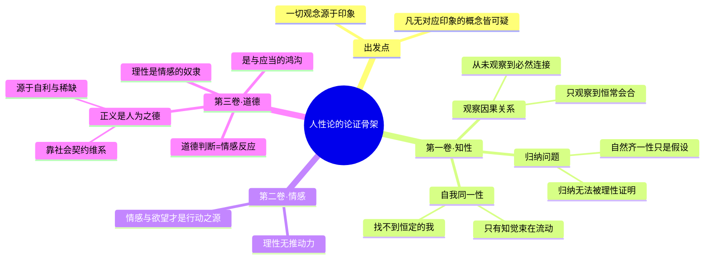

## 《人性论》读书笔记 
  
### 作者  
digoal  
  
### 日期  
2026-06-21  
  
### 标签  
读书笔记 , 人性论  
  
----  
  
## 背景 
  
  

---
书名: 《人性论（全两册）》  
作者: 大卫·休谟  
译者: 关文运  
出版年份: 1980  
出版社: 商务印书馆  
笔记日期: 2026-06-21  
豆瓣链接: https://book.douban.com/works/1036566  
豆瓣评分: 8.6  
标签: [哲学, 经验主义, 认识论, 伦理学, 西方哲学]  
---

  

> **一句话**：一个二十多岁的年轻人，用一把怀疑论的扫帚，把理性从哲学的王座上扫了下来，让位给了情感、习惯和想象力。  
> **适合谁读**：对"我们到底能不能真正知道任何事"感到好奇的人；不满足于"道德来自理性"这种说法的人；以及愿意花点力气啃一本写得并不轻松的经典的人。  
> **阅读难度**：⭐⭐⭐⭐☆（4/5星，关文运译本本身也有"信达雅"中"达"略欠的问题，需要耐心）  
> **推荐指数**：⭐⭐⭐⭐⭐  
  
---

## 一、时代坐标：这本书从哪里来？

休谟动笔写《人性论》时，年纪轻得有点离谱——21岁开始构思，25岁左右定稿，1739到1740年分三卷出版，那年他还不到30岁。他自己后来回忆，18岁那年一种"新的思想景致"向他敞开，于是一头扎进哲学，连家人以为他在埋头研究法律典籍时，他其实在偷偷读西塞罗和维吉尔。为了把这部书写完，他甚至搬去法国，在兰斯待了一年，又在笛卡尔的母校——安茹拉弗莱什的耶稣会学院附近住了两年，靠着那里藏书丰富的图书馆，过着"极其简朴的生活"，只为保住写作的独立性。

这是一个属于洛克和贝克莱之后、康德和卢梭之前的空当时刻。英国经验主义已经走了两步：洛克说一切知识来自经验，贝克莱说物质实体本身也靠不住。休谟要走的，是第三步、也是最狠的一步——他要问：如果一切真的都来自经验，那连"因果关系"这种我们以为理所当然的东西，凭什么成立？连"自我"这个我们以为最确凿无疑的东西，又凭什么存在？

更关键的是他给自己定的任务：不是写一本"形而上学"，而是要把牛顿式的实验方法，搬到"精神科学"（即关于人的心灵、情感和道德的研究）里去。书的副标题就是"在精神科学中采用实验推理方法的一个尝试"。他相信，一切科学最终都和人性有关，所以必须先把人性这门"科学的科学"研究透，其他学问才有地基。

讽刺的是，这本他倾注全部青春写成的书，出版后几乎无人问津。休谟后来自嘲，这本书"一出版就死掉了，甚至没能在狂热分子中激起一句抱怨"。他花了好几年试图用一本精简的《人性论摘要》来挽救它的命运，依然没有成功。真正让这套思想被重新认识，是几十年后康德的一句话——他说，正是休谟把他"从独断论的迷梦中惊醒"。一本生前的"死胎"，后来变成了整个西方近代哲学绕不开的分水岭。

---

## 二、核心命题：作者在说什么？

全书分三卷：第一卷"论知性"（认识论）、第二卷"论情感"、第三卷"论道德"。三卷看似主题不同，其实共享同一套底层方法论：一切观念都可以还原为感官印象，凡是找不到对应印象的概念，都值得怀疑。

### 观点一：因果关系不是"看见"的，是"习惯"出来的

我们以为自己能"看到"原因如何导致结果，但休谟说，你打开任何一次因果事件，看到的永远只是两件事先后发生、反复在一起出现，你从来没有真正观察到那个连接它们的"必然性"本身。我们之所以坚信"火必然导致热"，不是因为理性证明了它们之间有逻辑必然性，而是因为我们看过太多次火和热同时出现，心灵养成了一种习惯性的联想，于是一看到火就自动"期待"热的出现。换句话说：**因果关系的客观必然性，从未被经验本身证实过；我们感觉到的那种"必然"，其实是心灵自己的习惯投射到了外部世界。**

这个推论后来被称为"休谟问题"：归纳推理（从过去推断未来）本身既不能靠演证（逻辑必然性）证明，也不能靠经验证明（因为那会陷入循环论证——用归纳去证明归纳）。这一刀砍下去，整个科学知识赖以建立的"自然齐一性假设"瞬间悬空。

### 观点二：自我不是一个东西，而是一束知觉

笛卡尔说"我思故我在"，预设了一个稳定、统一、持续存在的"我"。休谟翻遍自己的内心，却说他从未"抓住"过这样一个东西——他能找到的，永远只是这一刻的冷或热、这一刻的爱或恨、这一刻的某个具体知觉。没有任何一种知觉之外、之下存在着一个"纯粹的自我"。于是他提出了后来被称为"知觉束理论（bundle theory）"的主张：**所谓自我，不过是一系列以极快速度互相接续、处于永远流动状态的知觉的集合体，根本没有一个恒定不变的核心。**

### 观点三：理性是、并且应该是情感的奴隶

这是全书最有挑衅性的一句话。休谟认为，理性本身完全没有推动行动的能力——它只能告诉你"手段是否能达成目的"，却永远无法替你设定"目的"本身。决定你要不要去做一件事的，从来不是冷静的推理，而是欲望和情感。所以道德判断的根源也不可能来自理性，而是来自一种特殊的情感反应：当我们旁观某个行为，心里生出赞许或反感，那就是道德判断的全部基础。**由此他还顺手扔出了"是与应当"的著名断层：从纯粹的事实陈述（"是"），永远推不出价值判断（"应当"）。**这条"休谟的断头台"，至今仍是伦理学绕不过去的关卡。

---

## 三、论证地图：作者怎么说服你的？

休谟的论证方式很有意思：他几乎不靠"宏大理论"，而是靠一连串极其朴素的内省实验——"你自己去找找看，能不能在心里抓住那个连接原因和结果的'必然性'？""你自己去内省一下，能不能找到那个独立于知觉之外的'自我'？"这种"请你亲自检查一下经验"的写法，正是他所谓"实验推理方法"的体现：不靠先验的形而上学断言，而是不断把读者拉回到自己的感官和反思中去验证。

但这种论证方式也有明显的代价：因为高度依赖内省，整本书的说服力很大程度上取决于读者愿不愿意承认"我也确实找不到那个必然性/自我"。如果有人坚持说"我就是能直觉到因果的必然联系"，休谟的论证就很难再往下推进——这也是后来很多批评者攻击的薄弱点。

---

## 四、前提假设与边界：什么情况下这不成立？

休谟的整套论证，建立在几个不太显眼、却至关重要的前提之上：

**前提一：一切观念都必须能还原为某个感官印象。** 这是他著名的"摹本原则（copy principle）"。如果这个前提不成立——比如，如果心灵真的存在一些不来自感官经验的先天结构（这正是康德后来的反击方向，他认为时间、空间、因果性是心灵认识世界的先天形式而非经验归纳的结果）——休谟对因果观念和自我的整套解构就会松动。

**前提二：内省能够穷尽对"自我"的全部考察。** 休谟假设，如果一个东西真实存在，内省应该能"碰到"它。可是这本身预设了一种相当狭隘的"存在=可被知觉"的标准。如果自我是某种结构性的、而非内容性的东西（类似后来康德所说的"先验统觉的统一性"——不是一个被感知的对象，而是知觉得以被组织起来的那个条件本身），那么"找不到自我的知觉"就不能证明"自我不存在"。

**前提三：道德判断必须有一个统一的心理机制来解释。** 休谟把道德感还原为情感反应，这个框架对解释"我们为什么会对残忍行为感到反感"很有说服力，但对解释"为什么不同文化、不同时代的人，道德直觉会系统性地分化甚至冲突"则解释力有限——如果道德纯粹是情感投射，为什么人类社会还能在跨文化层面上，对某些核心规范（如不可滥杀无辜）达成相当一致的共识？这暗示道德判断里可能还有某种休谟没有充分讨论的结构性成分。

这本书的边界，其实正好对应它最激进的地方：**它擅长拆解"我们自以为理所当然知道的东西到底有没有根据"，却不太擅长重建一套替代性的、积极的知识理论。**休谟自己后来也承认，写到第一卷结尾时，他陷入了近乎精神错乱的怀疑论低谷——彻底的怀疑主义如果被推到极致，连日常生活都无法进行下去。他最终靠"习惯是人生的伟大指南"这句话，给自己也给读者找了一个实践上的出路：我们不必、也不能在哲学上彻底解决这些怀疑，但生活照样可以继续。

---

## 五、思想谱系：这本书在哪个传统里？

休谟站在英国经验主义这条线的末端——洛克说一切知识来自经验、否定天赋观念；贝克莱进一步说连物质实体本身也不过是被感知的观念集合；休谟则把这把怀疑论的刀，挥向了因果关系和自我本身，把经验主义推到了它逻辑上最彻底、也最危险的尽头。

这本书的回响，比它出版时的寂静响亮得多：

- **对康德**：休谟对因果必然性的质疑，直接刺激康德写出《纯粹理性批判》，试图用"先天综合判断"重新为科学知识打地基。康德那句"从独断论的迷梦中惊醒"，说的就是被休谟问题逼出来的危机感。
- **对边沁与功利主义**：休谟用快乐与痛苦来解释道德价值的思路，被边沁继承并系统化为功利主义。
- **对逻辑实证主义**：休谟那句"凡找不到对应事实或逻辑必然性的命题都可以付之一炬"，几乎是二十世纪逻辑实证主义"可证实性原则"的预演，艾耶尔自己也承认这一点。
- **对当代人格同一性研究**：休谟的"知觉束理论"在二十世纪后期被德里克·帕菲特重新激活，成为还原主义自我观的经典源头，至今仍是脑科学、心灵哲学讨论"自我是否是一种构造"时绕不开的起点。

---

## 六、我学到了什么？

第一个收获，是对"理所当然"这个词重新产生了警觉。读之前我从未怀疑过"因果关系是客观存在的"，读完之后我才意识到，我对因果性的信心，本质上和巴甫洛夫的狗对铃声的反应没有本质区别——都是反复联想训练出来的一种心理习惯，只不过我们给这种习惯加上了"理性""规律"这样体面的名字。这不是说因果关系不可信，而是提醒我：**很多我以为是"逻辑必然"的东西，其实只是"心理习惯被包装成了逻辑"。**

第二个收获，是"理性是情感的奴隶"这句话彻底改变了我看待说服和决策的方式。过去我习惯假设，说服一个人靠的是更好的论证；读完才意识到，论证只能帮人厘清"手段是否有效"，却很少能凭空创造"想要做这件事"的动力。这解释了为什么很多明明逻辑完美的劝说会失败——它打中的是理性，没打中的是情感这个真正的发动机。

第三个收获，是对"自我"这个概念的松动。休谟说自我不过是一束流动的知觉，第一次读到的时候有点冲击：我习惯把"我"当作一个稳定的内核，但休谟的内省实验逼我去真的检查一下——我所谓的"我"，是不是真的只是此刻这个念头、上一刻那个情绪、再上一刻那个记忆的拼接？这种松动并不是让人虚无，而是让人对"自我会变化、自我可以被重新叙述"这件事，多了一点接纳。

---

## 七、举一反三：这个框架还能用在哪？

**休谟的"摹本原则"可以变成一个日常的思维清洁工具**：每当遇到一个听起来很有分量的抽象概念（比如"国家利益""企业文化""命运"），不妨问一句——这个概念对应的具体经验是什么？如果完全找不到对应的具体事实或感受，它很可能只是一个被反复使用、却从未被真正检验过的空泛词汇。

**"理性是情感的奴隶"可以用在沟通和管理场景里**：如果想说服一个团队改变方向，纯粹罗列数据和逻辑往往效果有限，因为理性只负责"怎么做"，不负责"想不想做"。真正起作用的，往往是先触动对方的情感动机（恐惧、荣誉感、归属感），再用理性去校准路径。

**"因果习惯"的洞察可以用在投资和预测场景里**：很多人对"过去涨过的资产未来还会涨"的信念，本质上和休谟说的"因果习惯"是同一种心理机制——重复出现的联想被误认成了必然规律。意识到这一点，至少可以提醒自己，对历史规律的信心需要打一个折扣。

---

## 八、批判与反思

我并不完全认同休谟把道德判断完全还原为情感反应这一步。如果道德纯粹是情感的产物，那道德进步（比如废除奴隶制、扩大平等权利）就很难解释——情感本身似乎并不天然朝着"更包容"的方向演化，反而常常需要理性反思去对抗当下的情感直觉（比如对陌生群体的本能戒备）。休谟自己后来也引入了"普遍观念（general point of view）"来补救这个问题，承认道德判断需要某种超越个人狭隘情感的校正机制——但这个补救本身已经悄悄借用了理性的力量，多少削弱了"理性纯粹是奴隶"这句话的彻底性。

时代变了的地方也很明显：休谟写作时，"实验推理方法"还是一个全新的、需要被论证合法性的方法论；而在今天，认知科学、行为经济学、神经科学已经用大量实证数据，部分验证了休谟当年纯靠内省猜中的很多直觉（比如情感先于理性介入决策、习惯主导归纳推理），这让《人性论》读起来有一种奇特的"超前预言"感，但也意味着它在经验细节上已经被更精确的当代研究部分取代——你今天读这本书，收获的更多是方法论和问题意识，而不是具体的心理学结论。

这本书的局限，还在于它对"社会和制度如何反过来塑造情感和习惯"几乎没有展开。休谟把正义和财产权解释为基于自利和稀缺的"人为之德"，洞察力很强，但对制度、权力结构如何反向训练人的道德直觉，讨论得相对单薄——这一块后来更多是被卢梭、马克思这条线接了过去。

---

## 九、金句与记忆点

1. **"理性是、并且也应该是情感的奴隶，除了服务和服从情感之外，再不能有任何其他的职务。"**
   —— 全书最具冲击力的一句，颠倒了理性主义传统里"理性统治情感"的默认排序。

2. **"习惯是人生的伟大指南。"**
   —— 怀疑论走到尽头后，休谟给生活找的一个实践性出路：哲学上无法证明的事，习惯依然能让我们正常生活下去。

3. **"我总不能抓住一个没有知觉的我自己，而且我也不能观察到任何事物，只能观察到一个知觉。"**
   —— 知觉束理论的核心表述，"自我"被拆解成了流动知觉的集合。

4. **关于因果观念**：必然联系从未被直接观察到，我们看到的永远只是事件的"恒常会合"。
   —— 这是"休谟问题"的种子，后来催生了康德的整套先验哲学回应。

5. **"是"与"应当"之间存在一道无法直接跨越的鸿沟。**
   —— 后世称为"休谟的断头台"，至今是元伦理学绕不开的起点。

6. **关于稀缺与正义**：如果一切东西都无限丰裕，就不会有自私、不公道、财产权，也不会有伦理学。
   —— 把正义的起源，从天赋的道德法则，拉回到资源稀缺这一极朴素的现实条件。

7. **休谟自评写作经历**：这本书"一出版就死掉了，甚至没能在狂热分子中激起一句抱怨"。
   —— 提醒每一个曾经被自己心血之作的冷遇打击过的人：伟大有时候需要几十年才被认出来。

---

## 十、延伸阅读

- **《人类理智研究》（休谟）**——休谟自己对《人性论》第一卷的精简改写版，文风更流畅，适合作为正式啃《人性论》之前的热身读物。
- **《纯粹理性批判》（康德）**——理解休谟问题之后最值得读的回应之作，看康德如何试图用先验哲学重新为因果性和科学知识打地基。
- **《道德原则研究》（休谟）**——休谟晚年对第三卷道德论述的改写本，他自己认为这是写得最好的一本，逻辑更紧凑。
- **《理与人》（德里克·帕菲特）**——当代哲学家对"知觉束理论"的延续和发展，把人格同一性问题推进到了关于死亡、利己主义和未来世代伦理的全新讨论。
- **《人类理解论》（洛克）**——理解休谟整套经验主义出发点之前更值得先垫底的一本，能看清休谟到底在洛克的基础上往前推进了多远。

---

*笔记写于 2026-06-21 | 基于公开资料与深度思考整理*
  
  
#### [PostgreSQL 解决方案集合](../201706/20170601_02.md "40cff096e9ed7122c512b35d8561d9c8")
  
  
#### [德哥 / digoal's Github - 公益是一辈子的事.](https://github.com/digoal/blog/blob/master/README.md "22709685feb7cab07d30f30387f0a9ae")
  
  
#### [About 德哥](https://github.com/digoal/blog/blob/master/me/readme.md "a37735981e7704886ffd590565582dd0")
  
  

  
