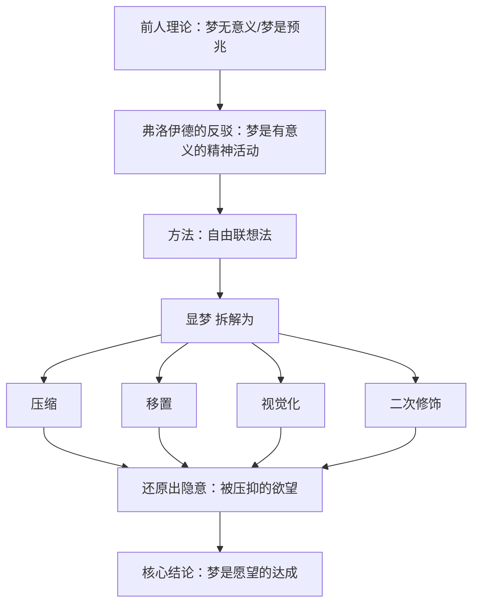

## 《释梦》读书笔记 
  
### 作者  
digoal  
  
### 日期  
2026-06-21  
  
### 标签  
读书笔记 , 释梦  
  
----  
  
## 背景 
  
  


---
书名: 《释梦》  
作者: [奥] 西格蒙德·弗洛伊德  
译者: 孙名之  
出版社: 商务印书馆  
出版年份: 1996-12（原作 Die Traumdeutung，1900）  
笔记日期: 2026-06-21  
丛书: 汉译世界学术名著丛书·哲学  
豆瓣评分: 8.5（弗洛伊德文集参考分）  
标签: [心理学, 精神分析, 弗洛伊德, 哲学, 潜意识]  
---

  

> **一句话**：弗洛伊德用六百多页的篇幅证明了一件事——你以为最荒诞不经的梦，其实是你最不敢承认的欲望，换了一身行头来见你。  
> **适合谁读**：对潜意识、自我认知感兴趣的人，文学/艺术研究者，以及想知道精神分析"原版长什么样"而不是只听过"俄狄浦斯情结"这个梗的人。  
> **阅读难度**：⭐⭐⭐⭐☆（4/5，案例堆叠、行文迂回，需要耐心）  
> **推荐指数**：⭐⭐⭐⭐☆（思想史地位无可替代，但作为"科学著作"要带着批判性眼光读）  
  
---

## 一、时代坐标：这本书从哪里来？

1900年（实际1899年11月出版，出版商把日期提前到了新世纪），维也纳。这是一个被冯特创立的实验心理学几乎没有触碰、被宗教解梦和民间迷信统治了几千年的领域——"梦"。在弗洛伊德之前，学界对梦的态度基本是两种：不屑一顾（认为是肉体感觉的随机噪音），或者交给占星术和民俗去解释。

弗洛伊德写这本书的导火索很私人：1896年10月，他的父亲去世，这份悲痛促使他在已有的理论研究和医疗实践基础上，于1897年开始进行一场漫长的自我分析。他把自己的梦也当作研究材料，这也是为什么全书读起来常常带有一种自传性的喃喃自语感——这既是它的魅力，也是它"难读"的原因之一。

更值得记住的是它的命运反转：德文初版只印了600册，六年后才卖出351本，前十年几乎无人问津，1908年才出第二版；而弗洛伊德在维也纳大学开课，台下一度只有三个听众。一本后来被称为"改变人类思想史"的书，刚出生时近乎默默无闻。这个反差本身就是个值得记住的故事：思想的影响力和它诞生时的声量，常常完全不成比例。

```
1895年《癔症研究》（精神分析诞生）
        ↓
1896年 父亲去世 → 开始自我分析
        ↓
1897-1899年 收集梦例、构建理论
        ↓
1899年11月《释梦》出版（标注1900年）
        ↓
头十年：默默无闻，仅卖出几百册
        ↓
1908年后：声名渐起，奠定精神分析理论基石
```

---

## 二、核心命题：作者在说什么？

### 观点一：梦是愿望的达成（Wish-fulfillment）
这是全书的总纲。弗洛伊德认为，再荒诞、再痛苦、再"反愿望"的梦，剥开层层伪装之后，底层动机都是某种愿望的满足——只是这个愿望往往是清醒时的"自我"不愿承认、甚至意识不到的。

### 观点二：梦有"显梦"与"隐意"两层结构
你记得的梦境画面（显梦）只是表层，真正的心理动机（隐意/潜意识欲望）被压抑机制改装、伪装、移置之后才浮现出来。释梦的工作，就是从显梦反推隐意。

### 观点三：梦的工作机制——压缩、移置、视觉化、二次修饰
弗洛伊德提出了一整套"翻译"机制：压缩（多个想法合并成一个意象）、移置（情感强度从重要对象转移到次要对象）、视觉化（抽象想法转成具体画面）、二次修饰（醒来后给梦境强行编一个看似合理的故事）。这套机制后来被认为是他对人类心理"防御与伪装"机制最具洞察力的部分。

---

## 三、论证地图：作者怎么说服你的？

弗洛伊德的论证方式很特别：他几乎没有完整解析过任何一个梦例到底——"释梦的实验性实践是弗洛伊德最有价值的贡献，也是精神分析理论的第一支柱，但很遗憾他几乎没有在这本书中完整地解释过一个梦"。取而代之的是大量的"联想法"：让梦者（包括自己）对梦境意象自由联想，再用已知的人生经历去拼接、还原"真实"含义。



这种论证方式的问题在书出版一百多年后被反复指出：很多梦例的解释都依赖于已经知道病人本身的人生经历，与其说是释梦帮助了理解病人，不如说梦例本身只是用来佐证病人心理问题的素材，论证带有循环论证的味道。一位豆瓣读者的体会很有代表性：第一章读完会觉得这套联想方式很不可靠，但读到后面，怀疑感会消失——换句话说，这套理论不具备可证伪性，但它确实是自洽的。"自洽但不可证伪"，恰恰是这本书最大的魅力，也是它最大的方法论隐患。

---

## 四、前提假设与边界：什么情况下这不成立？

**假设一：所有梦都有意义，都可以追溯到一个具体愿望。**
这是全书的地基，但弗洛伊德为了让理论"自洽"，发明了大量补丁概念（反向形成、压抑的对立面、升华……），使得无论出现什么样的反例，都能被纳入既有解释框架，这正是后来批评者攻击其"不可证伪"的核心理由。

**假设二：自由联想能够还原真实的潜意识内容。**
但联想本身是被分析师引导、被语境塑造的，这个还原过程缺乏外部校验手段——你没有办法证明"还原出来的"就是"真实存在的"，所有这一切都只发生在脑子里，甚至发生在我们自己意识不到的潜意识中，没有办法证明也没有办法证伪。

**假设三：性本能是绝大多数压抑欲望的根源。**
这一假设在今天的精神分析内部就已经被大幅修正（荣格、阿德勒、客体关系学派都各自走出了不同方向），更不用说现代神经科学。

**今天它还成立吗？** 哲学家波普尔的批评今天仍被反复引用：同样一种现象，可以被精神分析的两套相反机制各自解释——压抑可以解释施暴，升华可以解释救人——这种"怎么都能自圆其说"的解释力，恰恰是波普尔认为它丧失可证伪性、不能算作科学理论的核心证据。神经科学领域后来发展出的"激活-综合假说"等理论，也对"梦必然源于压抑欲望"提出了直接挑战，认为梦更可能是大脑随机神经活动被皮层强行叙事化的产物。

---

## 五、思想谱系：这本书在哪个传统里？

弗洛伊德的特殊之处在于，他几乎是从心理学体系之外凭空搭建了一整套概念系统：《释梦》问世时，冯特创立的学院派心理学才不到二十年历史，影响甚微，弗洛伊德写这本书之前几乎没和他们接触过，完全在主流心理学体系之外建立起一套用来解释潜意识和梦境的概念体系。这意味着他不是"心理学传统"里长出来的果实，而是一个用医生的临床直觉、哲学家的思辨野心和文学家的叙事天赋拼出来的独立体系。

它的影响脉络呈放射状：往学术方向，分裂出荣格的分析心理学、阿德勒的个体心理学，乃至后来的客体关系学派、拉康的结构主义精神分析；往文化方向，超现实主义代表人物安德烈·布雷东对弗洛伊德极为仰慕，1921年还专程去维也纳拜访他，尽管弗洛伊德本人对超现实主义艺术其实并不感冒，达达主义、超现实主义都把"潜意识自由联想"当作创作方法论的源头。

```
冯特实验心理学（主流，弗洛伊德几乎不在其内）

弗洛伊德《释梦》(1900) —— 独立建构的潜意识体系
        │
   ┌────┼────┬───────────┐
   ↓    ↓    ↓           ↓
 荣格  阿德勒 拉康/客体关系  超现实主义/达达主义艺术
（分析  （个体  （结构主义     （布雷东等，潜意识
 心理学）心理学）精神分析）     自由联想入画）
```

---

## 六、我学到了什么？

**第一，"显与隐"的思维框架，比"梦是愿望达成"这个具体结论更有用。** 不管你信不信弗洛伊德对梦境内容的具体解读，"表面行为/言语 vs. 背后的真实动机"这个二层结构，是一个极其好用的观察工具——可以用在分析自己的口误、临时改变主意、甚至无意识的拖延上。

**第二，一本"自洽但不可证伪"的书，依然可以是伟大的书。** 这件事让我重新思考"伟大"和"正确"的关系。弗洛伊德可能没有给出科学意义上严谨的"梦的理论"，但他给出了一种重新看待自己内心的语言和姿态——这种价值不完全靠"可证伪性"来衡量。

**第三，思想的影响力和它诞生时的待遇没有必然关系。** 前十年只卖出几百本的书，最终被列为改变人类思想史的三大经典之一。这提醒我对任何"暂时冷门"或"暂时被嘲笑"的想法都保留一点耐心和谦逊。

---

## 七、举一反三：这个框架还能用在哪？

**1. 解读组织/团队中的"言外之意"。** 一句会议发言背后，往往藏着没说出口的诉求或顾虑——用"显意/隐意"框架去听一场会议，常常能听出比字面意思更多的信息。

**2. 自我反思中的"为什么我突然在意这件小事"。** 当你发现自己对一件看起来无关紧要的小事反应过激，可以问一句：这是不是某种更深层、被压抑情绪的"移置"？情绪强度有没有从真正的源头转移到了一个安全的替代对象上？

**3. 内容创作/营销中的"自由联想"方法。** 超现实主义艺术家把自由联想当作创作起点，这套"不预先设定逻辑、先让意象自然涌现，再回头梳理意义"的方法，对打破思维定式、产出非常规创意点子依然有效。

---

## 八、批判与反思

**我不同意的地方：** 把"性本能"作为几乎所有压抑欲望的统一解释，在今天看明显过度简化了。人类动机的多样性——归属感、控制感、自我实现——并不都能被还原为性欲的伪装形式，这一点连精神分析内部（阿德勒强调权力、自卑情结）都很快出现了分歧。

**时代已经变了的地方：** 神经科学的发展提供了完全不同的梦境解释路径——梦更可能与记忆整合、情绪调节、随机神经放电的皮层叙事化有关，而不必然指向被压抑的童年欲望。波普尔的批评点出了这本书最根本的方法论问题：弗洛伊德的理论看上去能解释任何发生在它所涉及领域内的事物，而一个真正的科学理论，如果它是错的，应该总能被想象出某种证伪它的实验结果。

**局限性：** 弗洛伊德几乎全部的素材来自精神病患者的自述与他本人的梦境，研究方法本身比较片面，主要依据精神病人的梦境自述，而忽略了实验方法，样本的代表性和获取方式都很难支撑起一个普适的"梦的理论"。

---

## 九、金句与记忆点

1. **"梦是愿望的达成。"** —— 全书最浓缩的一句概括，是整套理论的总开关。
2. **"释梦的互补技法：一是尽量唤起梦者的联想，直到由替代物追溯至本源；二是运用知识，还原各个意象的含义。"** —— 这是弗洛伊德给出的方法论，也是后来一切"自由联想式"解读方法的源头。
3. **"梦的工作是对思想进行加工，是梦唯一的本质特质。"** —— 提醒我们：重要的不是梦境内容本身，而是"加工"这个动作背后的机制。
4. **"思想表面上能解释一切的力量，恰恰是它最值得怀疑的地方。"**（波普尔对精神分析的总结性批评）—— 一句话点破了这类"万能理论"共同的陷阱。
5. **"释梦的实践，是精神分析理论的第一支柱。"**（后世学者评价）—— 提醒读者：这本书的价值不在于解开了某个具体梦境的谜底，而在于它开创了一整套观察潜意识的方法路径。

---

## 十、延伸阅读

1. **《精神分析引论》（弗洛伊德）** —— 比《释梦》更体系化、更易读，是弗洛伊德在维也纳大学的讲稿整理，适合作为补充或者前置阅读。
2. **《猜想与反驳》（卡尔·波普尔）** —— 理解"精神分析为何被称为伪科学"绕不开的一本书，是对《释梦》方法论最有力的外部挑战。
3. **《狼人的故事：弗洛伊德心理治疗案例三种》** —— 比《释梦》更完整地呈现了案例分析过程，适合觉得《释梦》"举例太碎、解析不完整"的读者。
4. **荣格《人及其象征》** —— 弗洛伊德潜意识理论的"分支路线"，提供了一个不把一切都归于性本能的替代框架。
5. **《梦：进化、神经科学与意义》等现代睡眠科学读物** —— 用来对照一百多年后，神经科学如何重新理解"我们为什么会做梦"这个问题。

---

*笔记写于 2026-06-21 | 基于公开资料与深度思考整理*
  
  
#### [PostgreSQL 解决方案集合](../201706/20170601_02.md "40cff096e9ed7122c512b35d8561d9c8")
  
  
#### [德哥 / digoal's Github - 公益是一辈子的事.](https://github.com/digoal/blog/blob/master/README.md "22709685feb7cab07d30f30387f0a9ae")
  
  
#### [About 德哥](https://github.com/digoal/blog/blob/master/me/readme.md "a37735981e7704886ffd590565582dd0")
  
  

  
