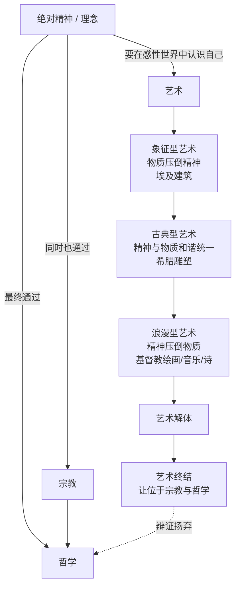

## 《美学》读书笔记 
  
### 作者  
digoal  
  
### 日期  
2026-06-21  
  
### 标签  
读书笔记 , 美学  
  
----  
  
## 背景 
  
  


---
书名: 《美学（第一卷）》  
作者: [德] 黑格尔（Hegel G.W.F.）  
译者: 朱光潜  
出版年份: 1997-2（商务印书馆版，原讲稿1835年由霍托整理出版）  
笔记日期: 2026-06-21  
豆瓣链接: https://book.douban.com/subject/1082457/  
丛书: 汉译世界学术名著丛书·哲学  
标签: [哲学, 美学, 德国古典哲学, 艺术理论, 黑格尔]  
---

  

> **一句话**：美不是一种感觉上的偏好，而是"理念"穿上感性外衣，第一次在世界上露面的那个瞬间。  
> **适合谁读**：对"艺术到底在表达什么"感兴趣的人；想搞懂西方美学史绕不开的一座大山的人；做内容、设计、创作却始终说不清自己作品"内核"是什么的人。  
> **阅读难度**：⭐⭐⭐⭐☆（4/5，黑格尔式长句+概念体系，但朱光潜的译文已经是最友好的版本之一）  
> **推荐指数**：⭐⭐⭐⭐⭐  
  
---

## 一、时代坐标：这本书从哪里来？

这不是一本"写"出来的书，而是一本"讲"出来的书。1820 年代，黑格尔已经是柏林大学的校长，他在那里连续四次开设美学讲座（1820/21、1823、1826、1828/29）。1831 年他猝然去世于霍乱，这些讲稿和学生笔记由他的学生霍托（Hotho）整理编订，1835 到 1838 年间分三卷出版，这才有了我们今天读到的《美学》。换句话说，眼前这部"巨著"其实是一份被精心打磨过的课堂记录——这也解释了为什么它读起来像一场层层递进的演讲，而不是一篇严谨的论文：黑格尔会反复回到同一个论点，从不同角度敲打它，直到听众（读者）彻底信服。

时代背景上，这是德国古典哲学的收官时刻。康德在《判断力批判》里把"美"安放在主观的、不涉及概念的"无目的的目的性"判断中；席勒、谢林沿着这条路继续往前走，试图用美去调和感性与理性的分裂。黑格尔站在他们所有人的肩膀上，但又对这条路线本身不满意——他认为前人把美学变成了一门关于"我们怎么感觉美"的心理学，而真正该问的是"美到底是什么"。于是他做了一件极具野心的事：把美学重新锚定在他自己庞大的哲学体系（逻辑学—自然哲学—精神哲学）里，让"美"成为"绝对精神"自我认识链条上的一环。

朱光潜先生翻译这套书堪称中国学术史上的一段佳话。据记载，周恩来总理曾评价，翻译黑格尔《美学》这样的经典，只有朱光潜先生才能"胜任愉快"。第一卷最早由人民文学出版社 1958 年出版，全三卷（四册）历经二十余年，直到 1982 年才全部出齐——这本身也是一部"理念在感性世界中艰难显现"的真实故事。

```
1770 黑格尔出生
   │
1820s 柏林大学四次美学讲座
   │
1831 黑格尔去世（霍乱）
   │
1835-1838 霍托整理出版《美学》三卷
   │
1958 朱光潜译本第一卷出版（人民文学出版社）
   │
1979-1982 商务印书馆全三卷四册出齐
```

---

## 二、核心命题：作者在说什么？

### 命题一：美是理念的感性显现

这是整本书的发动机，也是黑格尔留给后世最著名的一句话。黑格尔的原话是：当"真"——也就是符合自身本质的"理念"——以一种和它的外在形象直接统一的方式呈现在意识面前时，理念就不仅是真的，而且是美的，美因此可以定义为理念的感性显现。

通俗地说：理念是"内核"（可以理解成事物的本质、规律、精神性的真理），感性显现是"外形"（可以被看见、听见、触摸到的具体形象）。当这个内核找到了一个恰到好处的外形来表现自己——不多不少、不偏不倚——美就发生了。一座金字塔之所以让人感到神秘而非"美"，是因为它的物质形式还压不住、也撑不满它要表达的内在意义；而一座古希腊神庙的人体雕像之所以"美"，是因为精神内容和感性形式达到了近乎完美的契合。

### 命题二：艺术美高于自然美

这一点在今天的直觉看来相当反常——我们通常觉得壮丽的自然风光比任何人造物都更"美"。但黑格尔斩钉截铁地说，艺术美高于自然美，因为艺术美是由心灵产生和再生的美，心灵和它的产品比自然和它的现象高多少，艺术美也就比自然美高多少。

他的逻辑是：自然美是"无意识"的美，一朵花美得纯属偶然，它不知道自己美；而艺术美是心灵有意识地创造出来的美，是精神为了表达自己而主动塑造的形象。在黑格尔的体系里，"有意识的精神活动"天然高于"无意识的自然存在"，所以哪怕自然风光再壮丽，也比不上一首三流的诗——这是黑格尔哲学体系里"精神高于自然"这条总原则在美学领域的具体落地。

### 命题三：艺术经历象征型、古典型、浪漫型三个阶段，并终将"让位"于哲学

黑格尔把全部人类艺术史，按"理念"与"感性形象"之间关系的紧张程度，划分为三个历史阶段：

- **象征型艺术**（以古埃及建筑、印度神话艺术为代表）：内容（理念）还很模糊、抽象，找不到恰当的形式，只能用巨大、神秘的物质形式去"暗示"一种朦胧的意义——黑格尔说这是"艺术前的艺术"，物质压倒精神。
- **古典型艺术**（以古希腊雕塑为代表）：内容第一次找到了恰如其分的形式——人体。神被想象成完美的人的形象，精神和物质在这里达到了黑格尔认为艺术史上最和谐的统一，这是艺术的"理想"高峰。
- **浪漫型艺术**（基督教文化下的绘画、音乐、诗）：精神的内容变得太深邃、太内在（比如灵魂、信仰、爱），任何感性形式都已经盛不下它，于是精神开始"压倒"物质，浪漫型艺术打破了形式和内容的协调，在更高的阶段上又回到了形式和内容的失调。

而这条路走到头，就是黑格尔最具争议的论断——所谓"艺术终结论"。他并不是说艺术会"死掉"、不再被创作，而是说当精神发展到最高阶段，艺术最终要让位于哲学，因为艺术只能用具体的、特殊的感性形象去表达真理，而哲学可以用纯粹概念去把握普遍性，在普遍性占统治地位的领域，哲学远胜于艺术。

---

## 三、论证地图：作者怎么说服你的？

黑格尔不是靠举一堆案例来"归纳"出结论，而是靠一种近乎数学推导的"辩证演绎"：先确立一个最高的逻辑起点（理念/绝对精神），再一步步看着这个起点如何"必然地"展开成具体的艺术史。这也是为什么读这本书会有一种"在看一台精密仪器自动运转"的感觉——每一步都被宣称是"逻辑必然"，而不是"恰好如此"。



在论证方式上，黑格尔的"证据"主要有两类：一是对哲学史的批判性清算——他几乎逐一点名批驳了柏拉图的模仿说、英国经验派的快感说、康德的主观判断说，目的是把所有"前辈答案"清扫干净，为自己的"理念说"腾出唯一正确答案的位置；二是对具体艺术门类和作品（建筑、雕塑、绘画、音乐、诗）的大量例证，用以"验证"他的三阶段框架，比如金字塔对应象征型、希腊神像对应古典型。

这种论证方式的优点是体系极其完整、层层咬合，一旦接受第一块多米诺骨牌（"美是理念的感性显现"），后面几乎所有结论都顺势而下。但它的代价也在这里：黑格尔经常是先有结论（三阶段必然演进到哲学），再去历史里"找"恰好符合这个结论的材料，而不那么符合的现象（比如音乐在浪漫型里地位的安放、东方艺术被简单归为"低级阶段"）就容易显得勉强甚至带有偏见。

---

## 四、前提假设与边界：什么情况下这不成立？

黑格尔整个体系能站得住，依赖几个未被充分论证、却被当作不言自明的前提：

**假设一：存在一个单一、统一、有方向性的"绝对精神"在历史中自我实现。** 这是整套黑格尔哲学的地基——历史不是杂乱的事件堆积，而是精神朝着自我认识不断"上升"的过程。这个假设在今天的多元历史观、后现代史学看来很难成立：我们更倾向于认为历史是多线并进、充满偶然和断裂的，未必有一个统一的"目的"在背后牵引。一旦抽掉这个假设，黑格尔"艺术必然经历三阶段并最终让位哲学"的结论就失去了逻辑必然性，只剩下"对欧洲艺术史的一种归纳性描述"。

**假设二：精神天然高于自然、内在天然高于外在。** "艺术美高于自然美"这个判断，完全建立在"有意识的创造高于无意识的存在"这条价值排序上。如果你不接受这个排序——比如生态美学、东方道家美学就倾向于认为"自然天成"恰恰是美的最高标准——那么这个命题的说服力会大幅下降。

**假设三："理念"最终只能通过欧洲艺术史（尤其是古希腊和基督教艺术）来完整展现。** 这是黑格尔体系里最受后世诟病的一点：他把古埃及、印度、中国艺术统统归入"象征型"（最低阶段），把古希腊视为"理想"高峰，把基督教文化视为最高的浪漫型。这种安排带有明显的欧洲中心论色彩，今天看，这更像是"用一个普遍理论的外壳，包装了一种特定文化的自我中心叙事"。

边界在哪里？黑格尔的框架在解释"为什么某一类艺术在特定历史阶段会繁荣"（比如为什么希腊盛产雕塑、中世纪盛产宗教绘画）时仍然极具启发性；但一旦把它当作判断"哪种艺术更高级"的价值标尺，或者用来预测艺术的未来（比如说"绘画会让位于音乐，音乐会让位于诗，最后艺术整体让位于哲学"），就会显得武断而不再可信——20 世纪以来现代艺术的爆炸式多元发展，本身就是对"艺术终结论"最有力的反例。

---

## 五、思想谱系：这本书在哪个传统里？

黑格尔站在一条清晰的德国古典哲学美学链条的终点：

```
柏拉图（理念论：美是理念的模仿，艺术是模仿的模仿，地位低）
        │
康德（《判断力批判》：美是主观的、无目的的目的性判断，连接感性与理性）
        │
席勒 / 谢林（用美去调和自由与必然、主体与客体）
        │
黑格尔（美是理念的感性显现：把美学重新客观化、体系化、历史化）
```

黑格尔对康德最不满的地方，正是康德把"美"锁在了主观感受里——黑格尔要把美拉回到"客观真理"的领域，让美学第一次拥有了真正的"历史维度"：不同时代有不同的"理念发展阶段"，因而必然产生不同的艺术形态。这是黑格尔留给美学史最大的方法论遗产——朱光潜先生本人就高度评价这一点，认为黑格尔对美学最重要的贡献在于把辩证发展的道理应用到了美学里，替美学建立了一个历史观点。

往后看，这本书的影响力是地震级的。马克思、恩格斯虽然颠倒了黑格尔的唯心主义体系，却继承了他"艺术与历史阶段相对应"的方法论，间接塑造了后来的马克思主义文艺理论。恩格斯曾在私人通信中力荐这本书，称黑格尔不仅是富于创造性的天才，而且是学识渊博的人物，在每一个领域都起了划时代的作用。20 世纪，黑格尔的"艺术终结论"还直接催生了一场跨越一个半世纪的论战，美国哲学家阿瑟·丹托在《艺术的终结》里重新激活了这个命题，引发当代艺术哲学持续至今的讨论。

而在中国，这本书走过了一条特别的路：朱光潜的翻译几乎是单枪匹马地把黑格尔美学"嵌入"了中国现代美学的知识结构，朱译本直接奠定了黑格尔美学在现代中国文艺学建构过程中的重要地位，此后几十年中国美学界关于"美的本质"的大讨论，几乎都绕不开黑格尔这个参照系。

---

## 六、我学到了什么？

**第一个收获："美"原来可以不是一种感觉，而是一种关系。** 在读这本书之前，我下意识地把"美"等同于"我感觉舒服/震撼/愉悦"，这其实是康德式的、停留在主观感受层面的理解。黑格尔逼着我换一个视角看：美是"内容"和"形式"两者之间达到契合时所发生的事件，跟"我喜不喜欢"没有必然关系。这个转换很有用——它让我意识到，评价一件作品"美不美"，其实可以拆解成更具体的问题：它想表达的东西（内容）和它呈现的方式（形式）之间，是不是匹配的？

**第二个收获：所有体系性的强解释力，都伴随着相应的盲区。** 黑格尔这套"三阶段必然演进"的框架解释力极强，几乎可以把整个艺术史塞进一个模型里。但正因为它"什么都能解释"，我也学会了警惕——一个理论框架越是号称能解释一切历史现象，越值得追问它是不是在"用结论裁剪材料"。这不只是读黑格尔的教训，也是读任何宏大叙事（无论是历史决定论、技术决定论还是商业理论）时该有的警觉。

**第三个收获："终结论"未必是悲观的，而可能是一种"功能转移"的描述。** 一开始我以为"艺术终结论"在说艺术会消亡，后来发现黑格尔真正的意思更接近于"艺术不再是人类认识真理的最高方式了，但艺术本身不会停止"。这提醒我，看任何"某个事物要终结/过时"的论断时，先要分清楚：终结的是这个事物本身，还是它曾经承担的某种特定功能？很多时候后者被替代，前者依然蓬勃。

---

## 七、举一反三：这个框架还能用在哪？

黑格尔"内容与形式契合度"这个核心方法论，其实可以迁移到很多和"创作"相关的场景：

**产品设计**：一个产品的"美"，往往不在于材质多高级、界面多炫，而在于它的功能定位（内容）和它呈现给用户的形式之间是不是高度契合。一个极简主义产品如果背后的逻辑就是极简，会让人觉得"对"；如果产品其实功能很复杂却硬要做成极简界面，就会出现黑格尔意义上的"形式压不住内容"的失调感——这正是很多被吐槽"好看却难用"产品的根本问题。

**内容创作 / 写作**：判断一篇文章好不好，可以套用黑格尔的诊断方式——先问"这篇文章真正想表达的核心理念是什么"，再问"它选用的文体、结构、语言风格，是不是恰好能撑得起这个理念"。一篇深刻的思考用了过于轻佣的网络体写出来，或者一个轻松的话题被裹上厚重的学术腔，都是"内容与形式"错位的具体例子。

**组织管理**：一个公司的文化理念（内容）和它实际的制度、流程、空间设计（形式）之间是否一致，也可以用这个框架去诊断——很多企业文化"墙上喊得震天响，制度上完全相反"的现象，本质上就是黑格尔会称之为"丑"的那种内容形式撕裂。

---

## 八、批判与反思

**我不同意的地方：** 黑格尔把"艺术美高于自然美"作为不可动摇的前提，这个判断在今天看明显站不住——它建立在"精神活动天然高于自然存在"这种等级化的世界观上，而当代生态思想、东方美学传统恰恰提供了相反的资源：未经人为雕琢的"天然"，本身就可能是一种更高的美学理想。把所有自然美都判定为"低于"人造的艺术美，多少带有一种人类（精神）中心主义的傲慢。

**哪里时代已经变了：** 黑格尔的三阶段史观把欧洲艺术（尤其古希腊与基督教）摆在演进的顶端，把其他文明的艺术形态笼统归入"低级的象征型"，这在今天的全球化、多元文化视角下显得明显过时甚至带有偏见。20 世纪以来艺术的发展路径也彻底打破了他"浪漫型之后必然走向终结"的预测——从抽象表现主义到数字艺术、AI 生成艺术，艺术不仅没有"让位"给哲学，反而持续以哲学完全无法替代的方式制造新的感性经验。这恰恰说明，黑格尔低估了"感性形式本身"在人类精神生活中的不可替代性。

**这本书的局限性：** 整本书建立在一个极其宏大但本身从未被真正证明的形而上学假设之上——存在一个统一的、有方向的"绝对精神"。一旦读者不接受这个出发点，整座精心搭建的逻辑大厦就会变成一套"自我封闭、自我证成"的体系：它能完美地解释它自己框定的现象，但对框架之外的新现象往往缺乏弹性。

---

## 九、金句与记忆点

1. **"美是理念的感性显现。"**——全书的核心命题，理解了这句话，就掌握了打开整本书的钥匙：美既不纯粹是"客观规律"，也不纯粹是"主观感觉"，而是二者在感性形象中达成的统一。

2. **"艺术美高于自然美。"**——黑格尔最反直觉的判断之一，背后是他"精神高于自然"的总体哲学立场，值得带着批判眼光去理解，而非全盘接受。

3. **"理念在感性世界里实现自己。"**——可以理解为黑格尔美学的一句"行动口号"：抽象的真理必须找到具体的形式才能被"看见"，这也是为什么哲学需要艺术（在还没找到纯粹概念之前）。

4. **"美就它是真的而言，也是美的；但说理念是美的，须是理念与它的外在显现处于直接统一。"**——精确表达了"美 = 真 + 直接的感性统一"，是命题一的更严密版本。

5. **"艺术对我们现代人来说，就其最高功能而言已经过去了。"**——这是"艺术终结论"最常被引用、也最容易被误读的一句话——重点在"最高功能"，不是"艺术本身"。

6. **"艺术不是为一小撮有文化修养的关在小圈子里的学者，而是为全国的人民大众。"**——黑格尔少见的、带有平民主义色彩的论断，他奉劝那些抱怨听众趣味低劣的人不必趾高气扬，这一立场在当时颇具进步性。

7. **"象征型艺术是物质压倒精神，浪漫型艺术是精神压倒物质，只有古典型艺术，二者才真正和谐统一。"**——三阶段论的精炼总结，是理解整部《美学》历史框架的核心口诀。

---

## 十、延伸阅读

1. **《判断力批判》（康德）**——理解黑格尔美学绕不开的"靶子"，康德把美安放在主观判断力里，黑格尔正是要反驳并超越这条路线，对照读能看清两人分歧的真正起点。

2. **《艺术的终结》（阿瑟·丹托）**——20 世纪重新激活"艺术终结论"的关键文本，用波普艺术（如沃霍尔的布里洛盒子）重新讨论黑格尔命题在当代艺术语境下的意义，是黑格尔这本书最重要的"后续辩论"。

3. **《西方美学史》（朱光潜）**——译者本人对整部西方美学史的梳理，其中对黑格尔有专门的章节评述，可以帮助把《美学》放回更大的脉络里理解，也能看到朱光潜自己的取舍与判断。

4. **《美学理论》（阿多诺）**——20 世纪法兰克福学派对黑格尔体系性美学的反思与对抗，阿多诺反对任何把艺术装进单一历史必然性框架的尝试，是对黑格尔式体系美学最深刻的批判性回应之一，常被并列为西方艺术史学领域两本必读之作。

5. **《黑格尔与艺术难题》（薛华）**——国内研究黑格尔美学的重要专著，集中处理"艺术终结论"等争议命题，适合想进一步深挖中文学术语境下黑格尔美学讨论的读者。

---

*笔记写于 2026-06-21 | 基于公开资料、学术论述与深度思考整理*
  
  
#### [PostgreSQL 解决方案集合](../201706/20170601_02.md "40cff096e9ed7122c512b35d8561d9c8")
  
  
#### [德哥 / digoal's Github - 公益是一辈子的事.](https://github.com/digoal/blog/blob/master/README.md "22709685feb7cab07d30f30387f0a9ae")
  
  
#### [About 德哥](https://github.com/digoal/blog/blob/master/me/readme.md "a37735981e7704886ffd590565582dd0")
  
  

  
