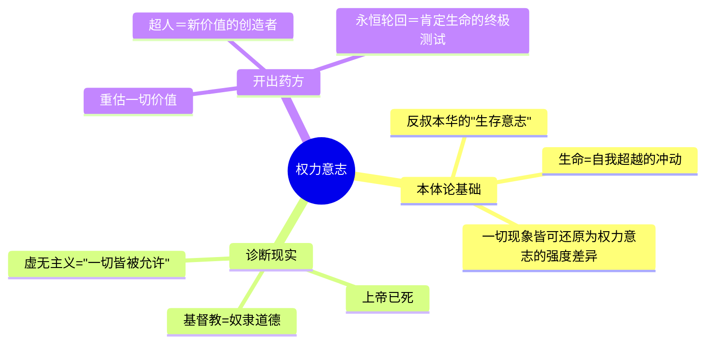

## 《权力意志：1885-1889年遗稿》读书笔记 
  
### 作者  
digoal  
  
### 日期  
2026-06-21  
  
### 标签  
读书笔记 , 权力意志：1885-1889年遗稿  
  
----  
  
## 背景 
  
  


---
书名: 《权力意志：1885-1889年遗稿》  
作者: 尼采  
译者: 孙周兴  
出版年份: 2007-2  
出版社: 商务印书馆  
笔记日期: 2026-06-21  
丛书: 汉译世界学术名著丛书·哲学  
标签: [尼采, 权力意志, 德国哲学, 唯意志论, 遗稿, 虚无主义]  
---

  

> **一句话**：这本书最大的秘密不是"权力意志是什么"，而是"《权力意志》这本书根本不存在"——你手里拿的，是一具被两个外行拼装起来的尼采思想骷髇，孙周兴这个译本的价值恰恰在于尽量把骷髇还原成散落的真骸骨。  
> **适合谁读**：对尼采感兴趣、但还没决定要不要啃"原典"的人；以及任何想搞清楚"二手尼采"和"一手尼采"区别的人。  
> **阅读难度**：⭐⭐⭐⭐⭐（1480页格言体残篇，没有目录式的论证链条，读起来像在沙滩上捡贝壳）  
> **推荐指数**：⭐⭐⭐⭐☆（思想密度极高，但必须先了解它的"案底"才能正确使用它）  
  
---

## 一、时代坐标：这本书从哪里来？

1885到1889年，是尼采一生创作力最旺盛、身体却同时在加速崩溃的四年。他刚写完《查拉图斯特拉如是说》，提出了"超人"和"永恒轮回"两个核心构想，却觉得这些还只是诗意的宣言，没有给出一套系统的哲学论证。于是他开始计划一部真正的"主要著作"，书名几次更换，最后定为《权力意志：重估一切价值的尝试》。他在《论道德的谱系》末尾公开预告："我在准备一部著作。"

但这部书，他从未写完，甚至可以说从未真正动笔系统写作——他做的，是在四年里写满了上百本笔记本的格言、提纲、自我辩论和反复修改的标题草案。1888年，他的身心状态急剧恶化，思想却异常迸发，写作速度快到惊人；1889年1月3日，他在都灵街头抱住一匹被虐待的马昏厥过去，从此精神失常，再未恢复。

他死后，这部"未完成的主要著作"成了一座金矿。他的妹妹伊丽莎白·福尔斯特-尼采联合尼采的音乐家朋友彼得·加斯特，从遗稿中挑选、拼接、删改了374条残篇中的270条，编成一本书，定名《权力意志》，1901年初版，1906年扩充再版。这本书后来被纳粹理论家鲍姆勒奉为"尼采哲学的主要著作"，也是二十世纪上半叶"尼采=法西斯先驱"这一污名的主要来源。

二战后，意大利学者乔尔乔·科利和马志诺·蒙提那里重新查阅魏玛档案馆的全部手稿，发现伊丽莎白和加斯特编的版本问题极大：尼采原本编号的374条笔记里，104条根本没被收入；剩下270条里，137条被删去标题、删去整句、甚至打乱了尼采自己标定的四部结构。蒙提那里因此做出了一个石破天惊的结论——尼采从未完成过一部叫《权力意志》的书，这个所谓的"主要著作"，就组织结构而言根本不是尼采写的。

孙周兴这个商务印书馆译本，正是依据科利/蒙提那里考订研究版《尼采全集》第12、13卷译出——也就是说，它不再使用伊丽莎白和加斯特的"伪结构"，而是**严格按照写作时间顺序**，原样呈现尼采1885年秋到1889年初的全部残篇。换句话说，你拿到的不是一部"伪经"，而是一部去伪存真之后的"思想现场记录"。

---

## 二、核心命题：作者在说什么？

### 观点一：世界的本质不是"求生存"，而是"求强力"

尼采的老师叔本华认为，万物的本质是"生存意志"——活下去、不被消灭，是第一驱动力。尼采反对这个前提：求生存只是权力意志最低限度、最贫乏的表现形式，真正驱动一切生命现象的，是**求扩张、求支配、求自我提升的意志**。一棵树不只是想活着，它想长得比邻树更高、更茂盛、争夺更多阳光。一个人不只是想温饱，他想征服、创造、留下印记。"权力意志"不是政治学意义上的权力欲，而是一种本体论层面的、贯穿有机界乃至整个宇宙的根本动力。

### 观点二："上帝已死"之后，必须重估一切价值

基督教道德体系给了西方两千年一套现成的善恶标准：谦卑、怜悯、自我克制是善，强力、骄傲、自我肯定是恶。尼采称这是"奴隶道德"——是弱者出于对强者的怨恨而发明的一套精神武器，目的是把强者拉低到自己的水平。当"上帝已死"——也就是这套超验的价值担保已经失效——人类却还在用基督教的尺子量自己，结果就是"虚无主义"：什么都不再真实，什么都被允许，意义的地基彻底悬空。尼采认为唯一的出路是"重估一切价值"：不是发明新的绝对真理，而是承认一切价值都是被创造出来的，然后由"高贵的人"重新以生命力为标准去创造价值。

### 观点三：永恒轮回是对生命的终极肯定测试

如果世界没有目的、没有终点，一切事件都将在无限的时间里**完全相同地无限次重演**——这是尼采设想的一个思想实验，也是他自称最深刻的洞见。它的作用不是一个物理学假说，而是一把伦理学的尺子：如果你知道此刻的每一个选择都将被你自己无限次重新经历，你是否还愿意如此选择、如此生活？能够对这个问题斩钉截铁地说"愿意"的人，才是真正肯定生命、超越虚无主义的人——也就是"超人"的雏形。

---

## 三、论证地图：作者怎么"说服"你的？

需要先说明：这不是一部线性论证的书，尼采用的是格言、警句、自我辩驳的方式层层推进，没有起承转合的论文结构。下面这张图展示的是三个核心概念之间的**逻辑依附关系**，而不是原书的章节顺序（原书按写作时间排列，本来就没有"章节论证"）。



**关键论证方式的评价**：尼采几乎不使用经验数据或系统逻辑推演，他依赖的是谱系学方法——追问一个道德概念"是怎么从哪里来的"，以揭穿其背后的心理动机（比如怜悯背后藏着怨恨）。这种方法极具洞察力，却也带有明显的过度简化风险：把复杂的道德现象一律归因于"强者/弱者"的权力博弈，容易陷入循环论证——任何道德立场都可以被反过来说成是"权力意志的表现"，这恰恰削弱了理论本身的可检验性。

---

## 四、前提假设与边界：什么情况下这不成立？

**假设一：权力意志是可以"还原"一切生命现象的单一原理。** 这是一种典型的还原论假设，把审美、道德、知识、生物演化全部归结为同一种力量的不同表现。今天的演化生物学、神经科学都不会接受如此单一的解释框架——合作、互惠、亲缘选择同样是演化中的真实力量，并非全是伪装的权力博弈。

**假设二："强者"与"弱者"的道德划分是客观且稳定的。** 尼采的论证里隐含一种贵族式的价值排序：谁能创造、谁能自我超越、谁就是"高贵"。但"强"与"弱"在他的文本里常常滑动——有时指生理上的强健，有时指精神上的创造力，有时又近乎指社会等级。这种概念上的弹性，正是后来纳粹理论家能够"挪用"权力意志去为种族优越论站台的破绽所在，尽管那是对尼采思想的粗暴歪曲。

**适用边界**：这套思想最有力的地方在于诊断——揭示价值判断背后的心理与历史动机；最薄弱的地方在于建构——一旦试图把"权力意志"变成一套可操作的政治或伦理纲领，就极容易被简化、被滑向危险方向。这也是为什么孙周兴等学者反复强调，必须把这部"遗稿"当作尼采**思考过程中的草稿**，而不是定论性的体系来读。

---

## 五、思想谱系：这本书在哪个传统里？

尼采的直接出发点是叔本华的"生命意志"哲学，但他把叔本华那种"意志带来痛苦、应该被否定"的悲观结论，彻底翻转为"意志应该被肯定、被强化"的乐观结论。同时，他深受达尔文进化论的时代氛围影响，但又明确反对"适应环境、求生存"式的庸俗社会达尔文主义，主张"求强力"高于"求生存"。

往后看，权力意志深刻影响了海德格尔——海德格尔晚年专门写了四卷本《尼采》讲稿，把权力意志解读为西方形而上学"在场"传统的最后一次、也是最极端的一次完成形态；它也影响了福柯的"权力—知识"谱系学，以及德勒兹对"差异与重复"的哲学建构。在思想史的脉络里，《权力意志》既是叔本华生命哲学的反叛性继承，也是二十世纪"后形而上学"思潮（存在主义、解构主义、后结构主义）共同的思想母床。

```
叔本华（生存意志，悲观）
        ↓ 反转
尼采（权力意志，肯定）
        ↓ 分流
海德格尔（形而上学的完成）   福柯（权力谱系学）   德勒兹（差异哲学）
```

---

## 六、我学到了什么？

第一个收获是关于"读什么"本身的警觉：在打开这本书之前，我以为自己要读的是尼采"写的"一本书，读完才意识到自己其实是在读一份案卷——一份关于谁有权代表一个死去的天才说话的案卷。这提醒我，任何"遗稿合集""精选集""未发表手稿"在打开之前，都值得先问一句：编者是谁，编选标准是什么，这个标准服务于谁的利益。

第二个收获是对"权力意志"这个概念本身的重新定位。我过去对它的印象停留在通俗读物里那种"强者通吃""弱肉强食"的庸俗版本，读了原始残篇才发现尼采真正关心的问题更细腻——他在反复推敲的，其实是"创造力从哪里来""一个人凭什么说自己的价值判断有效"这类问题，权力意志更像是一种**对生命力强度的本体论描述**，而不是一套行动指南。

第三个收获是看到了"虚无主义"这个诊断的现代性——尼采说的"一切皆被允许"，放在今天信息过载、价值多元到近乎无所适从的时代，反而显得格外贴切。我们今天面对的"意义稀薄感"，某种程度上正是尼采当年诊断的那种"上帝已死之后的真空"的延续，只是换了一身互联网时代的外衣。

---

## 七、举一反三：这个框架还能用在哪？

**谱系学方法**可以迁移到对任何"看似天经地义"的观念做溯源拆解：比如审视一个行业里"勤奋=美德"的话语，可以追问这套话语最早是谁提出的、服务于谁的利益，会不会本身就是一种被包装过的权力关系。

**"重估一切价值"的姿态**适用于个人重大转型期——当外部赋予的成功标准（学历、职位、收入）突然失效或不再令人信服时，与其急着寻找新的外部标准替代旧标准，不如先做一次彻底的清空，问自己"如果没有任何人在看，我会如何给事物排序"。

**永恒轮回的思想实验**可以作为一种决策检验工具：面对一个艰难选择时，不妨问自己——如果这个选择会被无限次重复经历，我是否依然会做出同样的选择？这比单纯问"我现在想不想做"更能逼近一个人真正的价值排序。

---

## 八、批判与反思

我不同意尼采把道德现象一律归因为权力关系的还原论冲动——这套方法论有很强的解释力，但解释力强到"什么都能解释"的程度时，往往意味着它已经丧失了被反驳的可能性，这是谱系学方法的通病。

时代已经变了的地方在于：尼采写作的语境是十九世纪欧洲基督教道德的全面松动，他的论敌是一个具体而强大的宗教—道德霸权。今天多元文化、多元信仰共存的世界里，"重估一切价值"所要对抗的敌人已经不是单一的宗教道德体系，而是更分散、更隐蔽的消费主义、算法推荐塑造出来的价值排序——尼采式的"贵族式重估"在这种语境下，需要被重新翻译，而不能照搬。

这本书最大的局限性，恰恰不在尼采本人，而在它的传播史：一百多年来，绝大多数人（包括我自己曾经）对"权力意志"的理解，都是经过伊丽莎白和加斯特那个被歪曲过的版本，再经过纳粹的挪用，再经过流行文化的进一步稀释，层层失真之后才传到我们手上。读孙周兴这个按时间顺序还原的版本，某种意义上是一次"考古式的纠错"。

---

## 九、金句与记忆点

1. **"上帝死了，但人类的习性使然，也许还要经历几千年的洞穴时间，洞穴中还会显现他的影子。"** —— 上帝之死不是一个事件，而是一个需要漫长时间才能被真正消化的心理过程，今天许多看似"无神论"的价值判断里，其实还藏着宗教式的绝对道德残影。

2. **"没有真理，只有解释。"** —— 尼采反对存在一种脱离视角的客观真理，所有认知都带着特定立场的"透视"，这一观点后来直接启发了后结构主义的"视角主义"。

3. **"成为你自己。"** —— 这句看似励志口号的话，在尼采的语境里其实极为严苛：它要求一个人不靠任何外部权威的认可，自己承担起创造价值的全部责任。

4. **权力意志即生命本身。** —— 这不是一句政治宣言，而是一个本体论判断：生命现象的统一解释原则就是求强力、求扩张的内在冲动。

5. **奴隶道德起于怨恨（Ressentiment）。** —— 怜悯、谦卑这些被基督教推崇的美德，在尼采的谱系学考察里，被还原为弱者对强者无法直接反抗、转而在精神上贬低对方的心理策略。

6. **"那杆秤——你要把它放在哪里？"**（大意） —— 尼采反复追问任何道德判断背后"衡量的标准是谁定的"，这是他谱系学方法的核心驱动问题。

7. **蒙提那里的判语**："为了在'权力意志'中建构一个尼采的体系而挑选文本……必须完完全全归咎于两个哲学（和语文学上）的废物。" —— 这句学术界对伊丽莎白与加斯特的严厉评价，恰恰提醒我们这部"遗稿"本身的特殊性质。

---

## 十、延伸阅读

1. **《查拉图斯特拉如是说》（尼采）** —— 权力意志、超人、永恒轮回这三个核心概念最早以文学—诗化的形式出现的地方，读《权力意志》之前最好先读这本，能获得情感与意象上的直觉支撑。

2. **《论道德的谱系》（尼采）** —— 系统阐述"奴隶道德/主人道德"区分与怨恨心理的专著，是理解《权力意志》中道德批判部分的最佳配套读物。

3. **《尼采》四卷本（海德格尔）** —— 二十世纪对权力意志最重要的哲学性解读，把它放进整个西方形而上学史的脉络中重新审视，对理解这一概念的思想史地位极有帮助。

4. **《尼采：生命的肯定者》或同类尼采传记** —— 了解伊丽莎白·福尔斯特-尼采如何介入尼采档案与遗产管理、以及这场编纂争议的完整人物史背景，有助于理解为什么"读哪个版本"如此重要。

5. **《道德的谱系学》方法相关的福柯著作（如《尼采、谱系学、历史》）** —— 看尼采的方法论如何被二十世纪法国理论家重新激活、用于权力与知识关系的分析。

---

*笔记写于 2026-06-21 | 基于公开资料与深度思考整理*
  
  
#### [PostgreSQL 解决方案集合](../201706/20170601_02.md "40cff096e9ed7122c512b35d8561d9c8")
  
  
#### [德哥 / digoal's Github - 公益是一辈子的事.](https://github.com/digoal/blog/blob/master/README.md "22709685feb7cab07d30f30387f0a9ae")
  
  
#### [About 德哥](https://github.com/digoal/blog/blob/master/me/readme.md "a37735981e7704886ffd590565582dd0")
  
  

  
