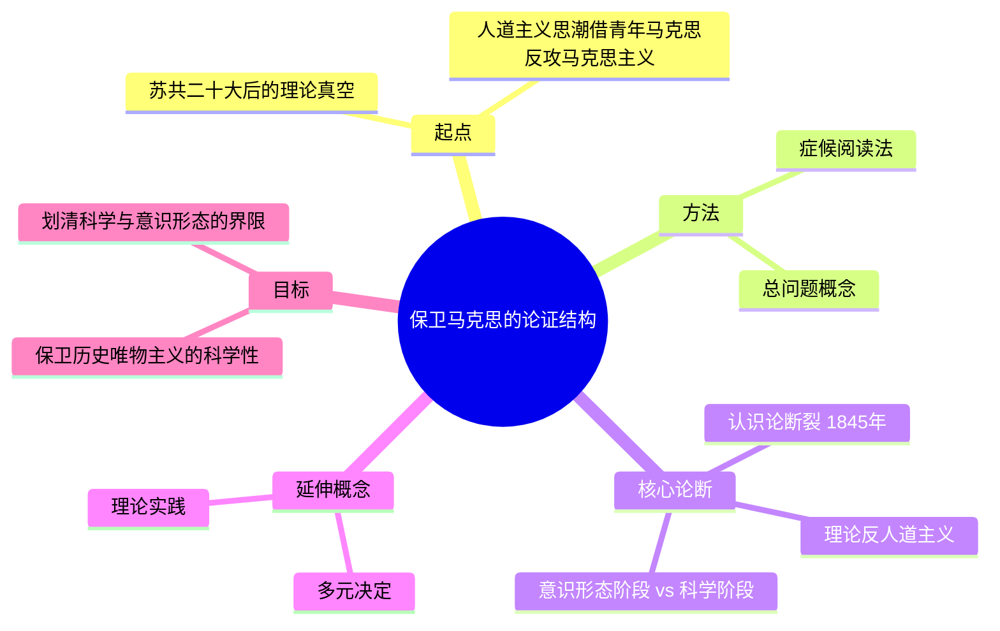

## 《保卫马克思》读书笔记 
  
### 作者  
digoal  
  
### 日期  
2026-06-21  
  
### 标签  
读书笔记 , 保卫马克思  
  
----  
  
## 背景 
  
  


---
书名: 《保卫马克思》  
作者: [法] 路易·阿尔都塞  
译者: 顾良  
出版社: 商务印书馆  
出版年份: 2010-10（原作 Pour Marx, 1965）  
笔记日期: 2026-06-21  
丛书: 汉译世界学术名著丛书·哲学  
标签: [西方马克思主义, 结构主义, 阿尔都塞, 认识论断裂, 反人道主义]  
---

  

> **一句话**：阿尔都塞不是在讲"马克思说了什么"，而是在讲"马克思是怎么把自己和过去的自己决裂开的"——这是一本教你识别"思想分期"的方法论之书。  
> **适合谁读**：对马克思主义理论史、结构主义、意识形态批判感兴趣的人；想理解"科学"与"意识形态"边界问题的人；做思想史/学术史研究的人。  
> **阅读难度**：⭐⭐⭐⭐☆（4/5，概念密集，需要一点哲学训练）  
> **推荐指数**：⭐⭐⭐⭐☆  
  
---

## 一、时代坐标：这本书从哪里来？

1956年，苏共二十大，赫鲁晓夫把斯大林从神坛上拉下来。紧接着波兹南事件、匈牙利事件、中苏关系恶化——整个国际共产主义运动像是被人当众揭了一次底。这对全世界的共产党知识分子是一次精神地震：原来"正确"了几十年的东西，可能从根上就是错的。

法国共产党人面对的问题更尖锐：怎么解释斯大林的错误，同时不否定马克思主义本身？当时流行的答案是——回到青年马克思，回到他写《1844年经济学哲学手稿》时那个充满人道主义热情的形象，用"人道主义"去清洗斯大林主义留下的污渍。萨特在《辩证理性批判》（1960）里喊出"马克思主义是我们时代不可超越的哲学"，把存在、主体性、自由这些字眼重新塞回马克思主义的核心。

阿尔都塞反对这条路。在他看来，这是一种"投降"：只要承认马克思主义是某种人道主义，就已经在理论上向攻击者让步了。1960到1965年间，他陆续写了一系列论文，去做一件看起来很学究、但其实极具政治火药味的事——重新去读马克思的原始文本，划一条"科学"与"意识形态"之间的分界线。这些文章在1965年被收进一本书，题为《保卫马克思》（Pour Marx）。

这本书出版后，连续再版十次，把阿尔都塞从一个高师里默默无闻的助教，变成了整个巴黎知识界绕不开的名字。它和同年出版的《读〈资本论〉》一起，成了"结构主义马克思主义"的奠基性文本。

```
1956 苏共二十大（揭露斯大林）
        ↓
意识形态真空 + 人道主义思潮兴起（萨特等）
        ↓
阿尔都塞：1960-1965 连续撰文反击
        ↓
1965《保卫马克思》出版 → 巴黎知识界"思想炸弹"
```

---

## 二、核心命题：作者在说什么？

### 观点一：马克思的思想里有一条"认识论断裂"

阿尔都塞最具冲击力的论断是：马克思的思想分成两个根本不同、互不相通的阶段。1845年之前（以《1844年经济学哲学手稿》为代表）的马克思，骨子里还是费尔巴哈式的人本主义者，用的是"异化""类存在""主谓颠倒"这些黑格尔-费尔巴哈传下来的词汇，属于"意识形态"阶段。1845年之后（从《德意志意识形态》开始），马克思彻底换了一套"总问题"（problématique）——不再问"人的本质是什么"，而是问"社会构成的客观结构和规律是什么"——由此进入"科学"阶段。

这两个阶段之间不是渐进演化，而是"断裂"：旧的问题框架被整体抛弃，新的问题框架不是从旧的里面"长出来"的，而是另起炉灶。

### 观点二：马克思主义是"理论上的反人道主义"

如果科学阶段的马克思已经抛弃了人本主义的总问题，那么"马克思主义是一种人道主义"这句话，在阿尔都塞看来根本是个范畴错误——不是说马克思主义反对关爱人、反对人的解放，而是说在严格的理论结构里，"人"不是一个科学概念，而是一个意识形态概念。历史不是"人"创造的，而是生产关系、阶级斗争这些结构性力量运作的产物。"人道主义"挂在嘴上没问题，但它解释不了任何东西，反而会模糊真正的科学问题。

### 观点三：矛盾是"多元决定"的，不是单一决定的

阿尔都塞批评把马克思辩证法简化成"经济基础决定上层建筑"这种粗暴公式（他称之为"经济主义"），也批评黑格尔式的"一元决定"——以为所有矛盾归根结底是一个本质的不同表现形式。他提出"多元决定"（surdétermination）：每一个具体的历史时刻，矛盾都是由经济、政治、意识形态等多重力量同时作用、相互融合甚至相互掩盖而成的，没有一个孤立的"主要矛盾"可以脱离其他矛盾单独发挥作用。

---

## 三、论证地图：作者怎么说服你的？

阿尔都塞的核心方法是"症候阅读法"（lecture symptomale）——不是去找文本里明说了什么，而是去找文本的沉默、空白和言外之意，看一个理论"必然不出现"的东西是什么。他用这套方法去重新读马克思，从马克思自己1859年那句"把我们从前的哲学信仰清算一下"里，读出了"断裂"的自我承认。



这套论证最有力的地方，是它提供了一种"读法"——遇到任何理论文本，都可以问：它的总问题是什么？它默认排除了什么问题？但也正因为这种读法弹性极大，"断裂发生在哪一年"几乎可以由阐释者自己说了算，证据的硬度其实没有它听起来那么强。阿尔都塞自己后来也承认，这部分论证带有"理性主义"的色彩——把一场理论史的争论，几乎处理成了纯粹的逻辑问题，淡化了它背后真实的阶级斗争和政治历史。

---

## 四、前提假设与边界：什么情况下这不成立？

**假设一：理论史可以像科学史一样划分出清晰的"科学"与"意识形态"。** 这套区分借用了法国科学认识论（巴什拉的"认识论断裂"概念本来是讲自然科学发展的）。把它平移到社会思想史上是否合适，本身存疑——社会理论的"科学性"标准远不如自然科学清晰，阿尔都塞自己后期也反思了这一点。

**假设二："青年马克思"和"成熟马克思"之间真的存在不可通约的断裂。** 后来不少马克思主义研究者（包括一些坚定的马克思主义者）反驳说，马克思早期对异化、人的本质的关注，和后期对剩余价值、阶级斗争的分析,其实是连续而非断裂的——是同一个历史唯物主义问题在不同阶段的展开,而非两套互斥的理论体系。

**假设三："理论实践"可以相对独立于阶级斗争的具体历史进程而展开。** 阿尔都塞自己在《关于"真正人道主义"的补记》里检讨过这一点——他把"断裂"主要处理成理论内部的事情，而低估了它同时也是一场与资产阶级意识形态决裂的实践问题、政治问题。这意味着他的论证在最强的版本里，容易滑向一种"纯理论"的自我封闭。

---

## 五、思想谱系：这本书在哪个传统里？

阿尔都塞的工具箱很杂：法国科学认识论传统（巴什拉）给了他"认识论断裂"；结构主义（列维-斯特劳斯）给了他对"结构"高于"主体"的偏好；斯宾诺莎哲学给了他对"实体的内在因"、反对超验主体的兴趣；精神分析（拉康）给了他"症候阅读"的灵感。同时，他对萨特存在主义式马克思主义保持着明确的敌意——萨特强调的主体、自由、实践，正是阿尔都塞想要从马克思主义里清除出去的"意识形态残余"。

值得一提的是，阿尔都塞对毛泽东《矛盾论》的阅读给了他很大启发——尤其是"主要矛盾与次要矛盾"的区分，被他改写、提炼成了"多元决定"这个更抽象的理论工具。

```
巴什拉(认识论断裂) ──┐
列维-斯特劳斯(结构主义) ─┼──→ 阿尔都塞《保卫马克思》──→ 巴利巴尔、福柯、齐泽克等后续发展
斯宾诺莎(反主体哲学) ──┤                         (意识形态理论 / 反人道主义脉络)
毛泽东(矛盾论) ──────┘
```

后来福柯对权力的去主体化分析、阿尔都塞自己更出名的"意识形态国家机器"理论（质询/主体化），以及拉克劳和墨菲对"多元决定"的后马克思主义改造，都能在这本书里找到最初的种子。

---

## 六、我学到了什么？

第一，**"科学"和"立场"经常是被混在一起说的，值得拆开来看**。阿尔都塞反对的不是"关心人"，而是用"人道主义"这个标签去回避真正的结构性分析——这提醒我，当一个理论或一种说法听起来道德上无可指责时，恰恰要多问一句：它解释了什么，还是只是表达了一种态度？

第二，**"断裂"是一种很有用、但也很危险的叙事工具**。把一个人或一个理论的发展，切成"不成熟/成熟"两段，会让叙述变得干净有力，但也容易遮蔽真实的连续性和复杂性。读这本书时我时常提醒自己：阿尔都塞讲得越自信，越要多问一句"证据有多硬"。

第三，**"总问题"这个概念本身是一把好用的分析刀**。它教我去问：一段论述背后，默认排除了哪些可能的问题？很多争论之所以谈不拢，不是因为答案不同，而是因为提问的框架本身已经不一样了。

---

## 七、举一反三：这个框架还能用在哪？

**职场和组织分析**：当一个团队/公司说"我们要更有人情味"时，可以追问这是不是在用"人道主义"式的口号，回避真正该解决的结构问题（激励机制、权责划分）。

**舆论和公共讨论**：识别一场争论里隐含的"总问题"差异——比如关于"内卷"的讨论，有人在问"个人该怎么办"，有人在问"结构性原因是什么"，这是两套不同的问题式，互相说服不了对方很正常。

**个人成长叙事**：警惕"我以前不成熟，现在脱胎换骨了"这种"断裂式"自我叙述——它讲故事很有力，但常常掩盖了真实存在的连续性，甚至可能让人忽视过去经验里仍然有价值的部分。

---

## 八、批判与反思

我不完全认同阿尔都塞把"人道主义"一棍子打死的处理方式。他说得对的是：单靠"人道主义"无法替代结构性分析；但他低估了一点——理论的科学性和理论的伦理关怀,未必是非此即彼的关系。把"人"从理论核心位置移走,在批判抽象人性论时是有力的,但也带来了后来不少批评者指出的危险：当理论完全用结构和功能去解释一切,个体的能动性、责任、苦难就很容易在"科学"的名义下被悬置。

另外,"认识论断裂"具体发生在哪一年、哪一篇文献,这件事的论证强度其实没有阿尔都塞表达得那么坚硬。后来不少学者(包括一些非常认真的马克思主义研究者)指出,马克思1844年和1867年的思想之间存在大量连续性证据,断裂论某种程度上是一种"为了论战需要而做的简化"。阿尔都塞晚年自己也承认了这本书里"理性主义的错误"——把一场实践性、政治性的斗争,过度处理成了一场纯粹的理论清算。

时代局限也很明显：这本书是冷战格局、苏共二十大余震、法共内部理论真空这个特定历史时刻里写出来的"战斗文本"。脱离那个语境,书中一些"划界限"式的急迫感,放到今天读会显得有些用力过猛。

---

## 九、金句与记忆点

1. **"认识论断裂"**——指马克思思想中1845年前后两个根本不同的阶段，断裂前是意识形态阶段，断裂后是科学阶段。这是全书最核心、也最具争议的概念。

2. **"总问题"（problématique）**——一套理论提问时所依赖的、往往隐而不显的整体框架；理解一个理论，要先理解它的"总问题"，而不是只看它的具体答案。

3. **"症候阅读法"**——不只读文本说了什么，更要读文本的沉默处、空白处，发现它"必然不出现"却又暗示存在的东西。

4. **"理论反人道主义"**——不是反对人文关怀，而是说在马克思主义的科学理论结构里，"人"不是一个能解释历史的科学概念。

5. **"多元决定"（surdétermination）**——历史事件是由经济、政治、意识形态等多重矛盾相互融合、相互掩盖而共同决定的，不存在脱离具体语境的单一"主要矛盾"。

6. **"理论实践"**——理论生产本身就是一种实践活动，有自己的对象、工具和生产过程，不是对现实的被动反映。

7. **"由于斯大林，我们受到了第一次冲击……由于他的逝世和苏共二十大，我们受到了第二次冲击。"**——阿尔都塞在序言里对自己所处理论处境的概括，道出了全书的现实紧迫感。

---

## 十、延伸阅读

1. **《读〈资本论〉》（路易·阿尔都塞 等）**——与本书同年出版的"姊妹篇"，更系统地展开了对《资本论》的结构主义解读，是理解阿尔都塞方法论的必读续篇。

2. **《保卫马克思》之后的《自我批评论文集》**——阿尔都塞对自己"理论主义""理性主义错误"的反思，是理解他思想演变绕不开的文本。

3. **路易·阿尔都塞《论再生产》**——更晚期的作品，提出了著名的"意识形态国家机器"理论，可以看作本书"反人道主义""总问题"思路的延续和深化。

4. **E.P.汤普森《理论的贫困》**——英国马克思主义历史学家对阿尔都塞最尖锐的批评文本之一，提供了完全相反的立场，适合对照阅读、训练批判性思维。

5. **佩里·安德森《西方马克思主义探讨》**——把阿尔都塞放进整个西方马克思主义思想史的脉络里去理解，能帮你看清他在这条谱系里的位置和独特性。

---

*笔记写于 2026-06-21 | 基于公开资料与深度思考整理*
  
  
#### [PostgreSQL 解决方案集合](../201706/20170601_02.md "40cff096e9ed7122c512b35d8561d9c8")
  
  
#### [德哥 / digoal's Github - 公益是一辈子的事.](https://github.com/digoal/blog/blob/master/README.md "22709685feb7cab07d30f30387f0a9ae")
  
  
#### [About 德哥](https://github.com/digoal/blog/blob/master/me/readme.md "a37735981e7704886ffd590565582dd0")
  
  

  
