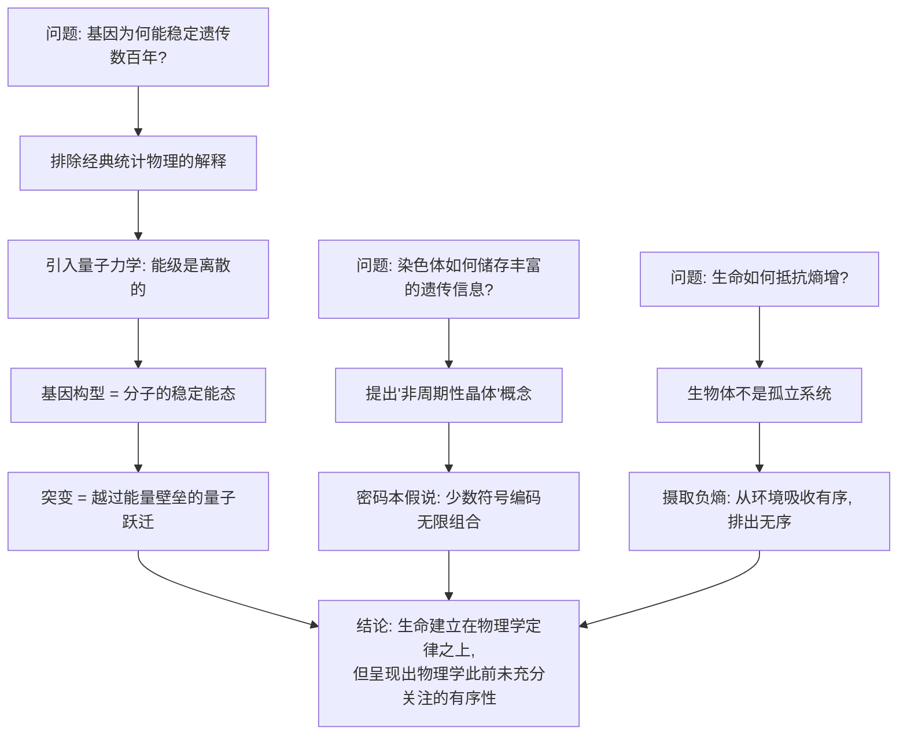

## 《生命是什么——活细胞的物理观》读书笔记 
  
### 作者  
digoal  
  
### 日期  
2026-06-21  
  
### 标签  
读书笔记 , 生命是什么——活细胞的物理观  
  
----  
  
## 背景 
  
  


---
书名: 《生命是什么——活细胞的物理观》  
作者: [奥] 埃尔温·薛定谔（Erwin Schrödinger）  
译者: 张卜天  
出版社: 商务印书馆  
出版年份: 2018-10  
丛书: 汉译世界学术名著丛书·哲学  
页数: 97  
定价: 18.00  
笔记日期: 2026-06-21  
---
  
  

> **一句话**：一个量子力学的奠基人，用物理学家的脑子去啃生物学的骨头，啃出了分子生物学的开端。  
> **适合谁读**：对"生命是不是纯粹的化学反应"这个问题感到好奇的人，无论你是文科生还是理科生。  
> **阅读难度**：⭐⭐⭐☆☆（1-5星）  
> **推荐指数**：⭐⭐⭐⭐☆  
  
---
  
## 一、时代坐标：这本书从哪里来？

1943年2月，欧洲正笼罩在战火里。一位55岁的奥地利物理学家，因为反对纳粹而流亡到爱尔兰都柏林，受当地圣三一学院邀请，做了一系列公开演讲。这个人就是埃尔温·薛定谔——量子力学的奠基人之一，那只"既死又活的猫"的发明者。

他演讲的题目朴素到近乎天真：生命是什么。

这个问题的提出本身就很奇怪。薛定谔不是生物学家，他这辈子除了对视觉生理学有点零星兴趣，基本没碰过生物学。但恰恰是这种"外行"的天真，让他敢于问出生物学家因为太熟悉细节而不会问的问题：为什么基因这么小的一团原子，却能在几百年里稳定地把某种遗传性状一代代传下去，不被原子世界无时无刻的热运动搞乱？

当时的生物学正处在一个尴尬的十字路口：摩尔根的果蝇实验已经把基因定位到了染色体上的"大分子"，但没人知道这个分子到底是什么、靠什么机制保持稳定。物理学家和化学家相信，分子世界的一切都受统计规律支配——温度、压力这些宏观现象，本质上是无数分子随机运动的平均结果。可如果分子行为是统计性的、随机的，那一个基因为什么能几百年不出错？

薛定谔把这个问题从生物学的语言翻译成了物理学的语言，然后试着用量子力学去回答。这场演讲后来被整理成书，1944年出版，书名就是《生命是什么？》。它直接影响了后来发现DNA双螺旋结构的沃森和克里克——克里克后来写信给薛定谔说，他们"都受到了您那本小书的影响"。

一本不到十万字的小书，由一个外行物理学家写的"科普读物"，竟然成了一门新学科——分子生物学——的助产士。这件事本身，就值得琢磨。

---

## 二、核心命题：作者在说什么？

### 观点一：基因的稳定性，需要量子力学来解释

经典物理学解释分子行为，靠的是统计规律：原子数量越多，统计结果越稳定，这就是为什么气体的温度、压强这些宏观量很可靠。但基因这种东西，根据当时的实验估算，可能只由约1000个原子构成。这个数字小到统计规律根本不该起作用——按理说，基因应该经常因为热运动的随机扰动而"出错"，可现实中它却能维持几百年不变。

薛定谔的解答是：基因的稳定性不能靠统计平均来解释，而要靠量子力学里"能级"的离散性来解释。分子中的原子排列方式不是连续可变的，而是落在几个离散的、稳定的"构型"（能态）上，要从一个构型跳到另一个构型（也就是突变），需要越过一个能量壁垒——这个壁垒足够高，所以在正常的热扰动下，基因构型极难自发改变。这就是为什么基因可以保持稳定，又偶尔会突变。

### 观点二：染色体是一种"非周期性晶体"

薛定谔造了一个词来形容染色体纤丝：非周期性晶体（aperiodic crystal）。普通晶体靠简单重复的结构单元堆叠出稳定性，比如盐的晶格，无聊但稳定。而染色体不能是这种无聊的重复结构，因为遗传信息显然极其丰富、极其多样——它必须像一份"密码本"，用为数不多的几种"原子排列方式"组合出几乎无限的变化，去编码一个生物体发育、运作所需的全部指令。

这个概念，在DNA双螺旋结构和遗传密码被发现之前整整十年，就已经精准地预言了基因的本质：信息储存在一个不重复但又稳定的分子结构里。

### 观点三：生命以负熵为生

这是全书最出名、也最常被误读的一句话。热力学第二定律说，孤立系统的熵（混乱程度）总是趋于增加，最终走向"热寂"——彻底的均匀、死寂、没有任何差异。生物体作为一个物理系统，按理说也该这样腐坏下去。但活的有机体却能维持甚至增加自身的有序性，似乎"违背"了熵增定律。

薛定谔指出，这并不是真的违背了热力学第二定律——生物体不是孤立系统，它通过不断从环境中摄取"负熵"（也就是从环境中吸收高度有序的物质和能量，比如食物中的化学能，再向环境排出更混乱、更无序的废物和热量）来维持自身的低熵状态。生命，本质上是一台靠吃负熵活着的机器。

---

## 三、论证地图：作者怎么说服你的？



薛定谔的论证方式有一个鲜明特点：他几乎不依赖具体的生物学实验数据自己原创，而是站在物理学的高度，对已有的遗传学实验结果（主要是德尔布吕克关于基因大小和突变率的估算）做"第二层"的理论解释。这种做法的好处是视角新颖、逻辑严密；代价是，他对生物学细节的把握确实显得粗糙，后来不少生物学家批评他对染色体结构的描述过于简化，甚至有事实性错误。

但论证的力量恰恰不在于细节的精确，而在于提出了一个全新的提问方式：能不能用物理学的语言，把"遗传稳定性"这个生物学问题，转化成一个可以被物理定律回答的问题？这一步"转译"，比任何具体答案都更重要。

---

## 四、前提假设与边界：什么情况下这不成立？

**假设一：基因的稳定性主要靠量子能级的离散性维持。**
这个假设在分子生物学发展起来之后基本被证实是对的方向——DNA双螺旋确实靠化学键的稳定构型来储存信息，碱基配对确实有离散性。但薛定谔当时完全不知道DNA的存在，他设想的"非周期性晶体"更接近蛋白质，而不是核酸。方向对了，具体载体猜错了。

**假设二：生命现象可以完全还原为物理定律，不需要任何"生命力"之类的特殊原理。**
薛定谔本人是一个坚定的还原论者，他明确反对"活力论"（vitalism，即认为生命需要某种特殊的非物理力量）。这个立场在今天的生物学界基本是主流共识，但"完全还原"在多大程度上能解释意识、自由意志等问题，仍然是悬而未决的哲学争论——薛定谔自己在书的后记里也专门讨论了决定论与自由意志的张力，并没有给出一个干净的答案。

**假设边界：这本书的解释力，集中在"分子层面的遗传稳定性"这个具体问题上。**
一旦超出这个范围，比如去解释生命的起源、意识的本质、生态系统的演化，这套框架的解释力就会迅速衰减。薛定谔自己其实很清楚这一点，他在书里反复强调，自己只是提出一个"工作假说"，供生物学家去检验，而不是给出终极答案。

---

## 五、思想谱系：这本书在哪个传统里？

薛定谔的思想来源相当庞杂。他年轻时深受叔本华影响，对东方哲学（尤其是吠檀多哲学中"个体意识与宇宙意识同一"的观念）有持久的兴趣，这种哲学背景让他天然倾向于用一种统一的、跨学科的眼光看世界——这也是他在序言里直接表态的："我们从先辈那里继承了对一种统一的、无所不包的知识的殷切追求"。

在科学传统上，他站在玻尔兹曼统计物理学和量子力学的交汇点上，把热力学第二定律和量子能级理论这两套此前互不相关的工具，第一次系统地用来解释一个生物学问题。这种"用物理学殖民生物学"的姿态，后来被称为"量子生物学"的开端。

往后看，这本书直接催生了一批物理学家"叛逃"去研究生物——包括克里克（本来是物理学背景）。它和后来的分子生物学革命之间，是一种"提出正确问题、激发跨界研究"的关系，而不是"提供正确答案"的关系。

```
叔本华哲学 + 统计物理学 + 量子力学
              ↓
      《生命是什么》(1944)
              ↓
   激发沃森、克里克等人投身遗传学研究
              ↓
   1953年 DNA双螺旋结构发现
              ↓
        分子生物学诞生
```

---

## 六、我学到了什么？

第一，**"非周期性晶体"这个概念本身就是一种思维方法的示范**：当你描述一个新现象时，不必发明全新的词汇体系，而是可以通过给已有概念加一个修饰词、制造一种"悖论式的组合"（晶体本应是周期性的，这里却是非周期性的），就能精确地指向一个此前没有名字的东西。这种"反义词修饰"的造词法，在很多领域的理论创新里都能看到影子。

第二，**外行的天真有时候是一种特殊的竞争优势**。薛定谔之所以能问出"基因为什么这么稳定"这种听起来很基础的问题，恰恰是因为他没有被生物学的细节训练"驯化"。专家容易把问题问得太具体、太技术化，反而错过最根本的那个奇怪之处。这提醒我，跨界思考的价值，常常不在于带去新答案，而在于带去一个领域内的人已经"看不见"的基础问题。

第三，**"生命以负熵为生"这句话，比我想象的更精确，也更容易被滥用**。很多人把这句话当成一种文学修辞，用来形容人要"积极向上、对抗混乱"。但薛定谔说的其实是一个很具体的热力学命题：生物体维持低熵状态，靠的是不断与环境进行物质和能量交换，本质上和一台靠燃料运转的发动机没有什么神秘的区别。把这句话浪漫化，恰恰丢掉了它最有力的部分——它消解了生命的神秘性,而不是增加了神秘性。

---

## 七、举一反三：这个框架还能用在哪？

**1. 评估一个系统的"稳定性来源"。**
不管是评估一家公司的组织韧性、一个观点在舆论场里能不能站得住，还是判断一项制度安排能不能持久，都可以问薛定谔式的问题：这个系统的稳定性，是靠"数量大、平均掉了"（统计稳定），还是靠"结构本身有能量壁垒，不容易被随机扰动推倒"（结构稳定）？前者经不起单点冲击，后者更耐造。

**2. 识别"负熵摄入"型的可持续模式。**
任何想长期维持有序状态（无论是个人的专注力、团队的执行力，还是一个产品的用户体验）的系统，都需要持续从外部摄入"负熵"——清晰的信息、有效的反馈、新鲜的资源投入，同时要主动排出内部产生的"熵"（混乱、噪音、低效流程）。一个组织如果只顾着内部消耗、不对外摄取负熵，迟早会熵增到失序。

**3. 用"外行视角"对自己熟悉的领域做一次陌生化提问。**
试着像薛定谔那样，对自己最熟悉的工作领域问一个"听起来太基础"的问题——往往会发现，那个看似幼稚的问题，恰恰是专家们因为太熟悉而从未真正回答过的。

---

## 八、批判与反思

薛定谔对生物学细节的把握，确实不算严谨。比如他对染色体结构的描述、对蛋白质和遗传物质关系的猜测，事后证明方向部分错误（他更倾向于认为遗传物质是蛋白质而非核酸，尽管艾弗里当时已经开始积累DNA是遗传物质的证据）。一些生物学家批评这本书"用漂亮的物理学语言包装了并不新颖、甚至有些过时的生物学认识"。

更根本的批评在于：薛定谔关于"量子跃迁解释基因突变"的设想，虽然方向直觉正确，但他给出的具体机制（能级壁垒）和后来真正被实验证实的分子机制（DNA复制错误、碱基互变异构等）之间，差距相当大。这本书的价值,更多在于"问题意识"和"跨界激励",而不在于具体科学内容的准确性。

另外，今天重读这本书，会发现它对"生命=信息"这个观念的强调，在某种程度上预演了后来信息论、控制论介入生物学的整个潮流——但薛定谔本人并没有用"信息"这个词的现代含义（香农的信息论在1948年才正式发表，比这本书晚了四年）。这提醒我们，思想的"预言性"常常是后人回溯赋予的——薛定谔在写这本书时，未必意识到自己正在预演一场信息论革命，他只是在尽力用手头最好的物理学工具（量子力学和热力学）解决眼前这个具体的遗传学谜题。

---

## 九、金句与记忆点

1. **"生命似乎是物质的有序和有规律的行为，它不是完全基于从有序到无序的倾向，而是部分基于得到保持的现存秩序。"**
   ——这是全书最精炼的论点：生命不是热力学第二定律的例外，而是它的一种特殊的、局部的对抗者。

2. **"非周期性晶体"**
   ——一个用矛盾修饰法造出的术语，精准描述了遗传物质既稳定又信息丰富的双重属性，是这本书最有预见性的概念创新。

3. **"生命以负熵为生"**
   ——最常被引用，也最容易被误读的一句。本意是热力学层面的物质能量交换,而不是励志格言。

4. **"我们从先辈那里继承了对一种统一的、无所不包的知识的殷切追求。"**
   ——薛定谔在序言里写下的学术理想，解释了他为什么一个物理学家敢于跨界写生物学，也呼应了"university"这个词原本想表达的"普遍知识"理想。

5. **基因大小约为原子的1000倍**
   ——德尔布吕克的实验估算，是全书论证的起点：一个由这么少原子构成的结构，凭什么能稳定地传递几百年？

---

## 十、延伸阅读

1. **《双螺旋》（詹姆斯·沃森）**——直接受《生命是什么》激励而走上遗传学研究道路的沃森，亲述DNA结构发现的全过程，是这本书"后续故事"的最佳读物。

2. **《熵：一种新的世界观》（杰里米·里夫金）**——如果想更系统地理解"熵"这个概念在物理学之外的延伸应用（经济、社会、生态），可以作为对照阅读，但要注意区分严谨的热力学含义和通俗化引申之间的差别。

3. **《自私的基因》（理查德·道金斯）**——从另一个角度（演化论而非物理学）讨论"基因为什么能稳定复制"这个相邻问题，可以和薛定谔的物理学视角做一次有趣的对比。

4. **《时间之箭》（彼得·柯文尼、罗杰·海菲尔德）**——更详细地讨论热力学第二定律、熵增和时间方向性问题，适合想深挖"负熵"概念物理学背景的读者。

5. **《混沌：开创新科学》（詹姆斯·格雷克）**——了解20世纪后半叶物理学如何继续从"有序与无序"的视角介入对复杂系统（包括生命系统）的理解，是薛定谔问题意识的某种延续。

---

*笔记写于 2026-06-21 | 基于公开资料与深度思考整理*
  
  
#### [PostgreSQL 解决方案集合](../201706/20170601_02.md "40cff096e9ed7122c512b35d8561d9c8")
  
  
#### [德哥 / digoal's Github - 公益是一辈子的事.](https://github.com/digoal/blog/blob/master/README.md "22709685feb7cab07d30f30387f0a9ae")
  
  
#### [About 德哥](https://github.com/digoal/blog/blob/master/me/readme.md "a37735981e7704886ffd590565582dd0")
  
  

  
