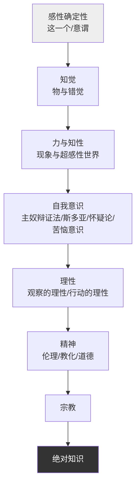

## 《精神现象学（上卷）》读书笔记 
  
### 作者  
digoal  
  
### 日期  
2026-06-21  
  
### 标签  
读书笔记 , 精神现象学（上卷）  
  
----  
  
## 背景 
  
  


---
书名: 《精神现象学（上卷）》  
作者: 黑格尔（译者：贺麟 / 王玖兴）  
出版年份: 1979  
笔记日期: 2026-06-21  
豆瓣链接: https://book.douban.com/subject/1012380/  
豆瓣评分: 9.1（1149人评价）  
标签: [德国古典哲学, 黑格尔, 辩证法, 西方哲学经典, 认识论]  
---

  

> **一句话**：这是一部关于"意识如何一步步认识到自己就是全部真理"的成长史，黑格尔把它叫做"一架梯子"——从最幼稚的感觉，爬到最高的"绝对知识"。  
> **适合谁读**：对哲学史、辩证法、马克思思想源头、或"自我意识如何形成"感兴趣的严肃读者，建议有一定康德哲学基础再来啃。  
> **阅读难度**：⭐⭐⭐⭐⭐（5星，公认的西方哲学"天书"之一）  
> **推荐指数**：⭐⭐⭐⭐⭐  
  
---

## 一、时代坐标：这本书从哪里来？

1806年10月，拿破仑的军队逼近耶拿，黑格尔正在城里赶完这部书的最后几页。据黑格尔在给朋友的信中描述了他对拿破仑的印象，称这位"骑在马背上巡城"的帝王是"世界精神"本身，独立于此却触及整个世界并拥有它。几乎是在炮火声中，黑格尔交出了他人生第一部、也是后来被公认为最具原创性的哲学著作。

往前看，这是康德哲学革命之后德国唯心论的下一站。康德说"我们只能认识现象，无法认识自在之物"，费希特、谢林想办法把这道鸿沟填平，而黑格尔把人类意识发展分为意识、自我意识、理性、精神、绝对精神五个阶段，体现出他的整体观和伟大的历史感。换句话说，前人在静态地争论"我们能不能认识真理"，黑格尔则把这个问题改写成了一个动态的、历史性的过程：真理不是一开始就摆在那里等你发现的答案，而是意识在不断犯错、不断自我否定中"长出来"的东西。

更关键的是，这本书在黑格尔自己的哲学体系里有一个尴尬又重要的位置。马克思曾指出，《精神现象学》是黑格尔哲学的"真正诞生地和秘密"——也就是说，黑格尔后来那套看起来无比严密、从《逻辑学》开端的体系，其实最初的灵感和论证方式都来自这本"不那么体系化"的处女作，但黑格尔后来却把这本书降格为整个体系里一个不起眼的环节，仿佛想抹去自己思想的"出身"。

```
康德：现象 vs 自在之物（鸿沟无法跨越）
        ↓
费希特/谢林：尝试用"自我"统一主客体
        ↓
黑格尔《精神现象学》(1807)：
   真理不是静态的答案，而是意识自我否定、
   自我超越的历史性运动过程
        ↓
后续：《逻辑学》→《哲学全书》→黑格尔体系
```

---

## 二、核心命题：作者在说什么？

黑格尔在序言里给出一句最著名的纲领："实体在本质上即是主体"——但这句话翻译成人话，其实是在讲三件事。

### 观点一：真理不是结果，是过程

我们习惯认为，真理是一个固定的答案，找到了就完事了。黑格尔说不对——真理是一条"经验之路"，是意识不断地拿自己的认识去检验对象、发现矛盾、修正自己，再重新出发的运动。书的副标题"意识的经验科学"说的就是这个：不是描述世界本身是什么，而是描述**意识认识世界、同时也在认识自己**的全过程。

### 观点二：每一次"认识失败"都是必要的台阶

全书从最朴素的"感性确定性"（"这是个桌子"这种最简单的指认）开始，一路爬到"绝对知识"。黑格尔把这六大部分概括为意识、自我意识、理性、精神、宗教、绝对知识，是一个从低级认识向高级认识、最后到达"绝对概念"的逐步上升过程。每一个阶段看似是"对的"，但走到底总会撞上自己的矛盾，于是被下一个阶段"扬弃"（既否定又保留）。黑格尔的洞见是：这些"错误"不是弯路，而是通往真理唯一可能的路——你不可能跳过感性认识直接抓住绝对知识，正如你不可能跳过青春期直接成为成熟的成年人。

### 观点三：主奴辩证法——承认才是自我意识的真相

上卷里最广为流传、影响最大的部分，是"自我意识"章里的"主奴辩证法"。两个自我意识相遇，都想证明自己是独立的、不依赖他者的，于是爆发一场"赌上性命的生死斗争"。一开始本质性确实在主人这一边，但因为只知道消极享受的主人所接受的承认只是来自没有独立人格的奴隶，他的自身确定性反而消失了；而奴隶却在劳动造物的过程中直观到了自己自在的本质，获得了曾经丧失的独立性。结论极其反直觉：表面上的胜利者（主人）其实困在了自己的胜利里，而表面上的失败者（奴隶）通过劳动反而获得了真正的自我确证。这一节后来被马克思、科耶夫、福山反复借用，几乎成了理解"承认""劳动""阶级"的思想母版。

---

## 三、论证地图：作者怎么说服你的？

黑格尔的论证方式很特殊：他几乎不直接说"我反对谁"，而是把具体的历史人物、思潮藏在抽象描述背后让你自己去猜。我们在读《精神现象学》时会发现一个特点，就是全篇几乎没有一个人名和地名，没有一个具体的历史事实；黑格尔明明在批判法国大革命、批判康德，有时也讲十字军，征引歌德的诗句，但他不点名也不说明出处。这也是为什么这本书读起来像天书——你要先有西方文化的背景知识，才能"破译"他在说什么。



每一站的剧情几乎是同一个模板的重复：意识碰到一个他者，一开始总想不费力气直接扬弃他者，发现行不通，于是真正走向他者，发现了他者与自己的某种同一性之后，才真正扬弃他者回到自身之内，再进入下一个层次发现新的他者。黑格尔不靠举具体的统计数据或案例说服你，他靠的是一种"逼出矛盾"的逻辑表演：把你以为天经地义的概念，推到极致，让它自己撕裂出反面。这种论证方式的代价是极度抽象，优点是一旦你跟上了，会有一种"亲眼看见思想自己运动"的震撼感。

---

## 四、前提假设与边界：什么情况下这不成立？

黑格尔这套"梯子"成立，至少依赖三个隐含假设：

**假设一：历史和逻辑是统一的。** 黑格尔相信，人类精神在历史中实际走过的阶段，正好对应着逻辑上必然的发展顺序——意识"必须"先经历感性确定性，再到知觉，再到知性……这预设了历史本身有一种理性的、必然的方向。但20世纪以后，这个假设遭到了猛烈质疑：波普尔在《开放社会及其敌人》中批判历史主义的目的论，即历史发展有必然性、根据普遍规律发展、人的主观意志不起作用，批判对象正包括黑格尔。如果历史并不存在这种单线的、必然走向"绝对知识"的进程，那么黑格尔整本书的骨架就会松动。

**假设二："精神"可以脱离具体的历史人物和阶级而被抽象讨论。** 马克思后来从《精神现象学》出发，却反过来批判它：黑格尔不是从活生生的生活现实出发的，他描述的不过是他头脑中的意识，是哲学家的、抽象的自我意识。这意味着，如果你不接受"纯粹意识"可以作为历史的真正主体（而不是真实的人、真实的阶级关系），那么黑格尔的整个叙事就需要被"倒过来读"——这正是马克思《1844年经济学哲学手稿》做的事。

**假设三：存在一个终点（绝对知识），意识的运动最终会"完成"。** 这是这本书最具争议的地方：如果历史/认识的运动是开放的、永无止境的，那么"绝对知识"作为终点的设定就显得是一种独断。这也是为什么后来克尔凯郭尔、存在主义者会强调"个体的有限性和未完成性"，作为对黑格尔体系化冲动的反弹。

---

## 五、思想谱系：这本书在哪个传统里？

往上看，黑格尔是康德－费希特－谢林这条德国唯心论谱系的终点和集大成者；往下看，这部书影响了存在主义、共产主义、法西斯主义、上帝之死神学及历史虚无主义的发展，也因此饱受毁誉——光是这一句评价，就能感受到这本书思想能量的巨大与危险并存。

```
康德（现象/自在之物的鸿沟）
   ↓
费希特、谢林（自我哲学的尝试）
   ↓
黑格尔《精神现象学》(1807)
   ↓        ↓           ↓
马克思     存在主义      科耶夫/福山
(劳动/异化)  (个体的有限性)  (历史终结论/承认的政治)
   ↓
20世纪政治哲学、社会理论（哈贝马斯的"交谈伦理"等）
```

主奴辩证法那一节，后来被法国哲学家科耶夫重新诠释，进而影响了萨特的存在主义、福山的"历史终结论"；而"相互承认"的主题，又被布兰顿等分析哲学家用实用主义语义学的方式重新激活，布兰顿通过黑格尔进一步从交谈的社会维度即"相互承认"、历史维度即"回忆理性"两方面深化了对"交谈性"的认识。一本两百多年前的书，至今仍在被各路思想家反复"开采"，这本身就很说明它的密度有多高。

---

## 六、我学到了什么？

**第一，"失败"本身可能就是认识的一部分，不是认识的反面。** 我们通常把"搞错了"看作需要消除的噪音，但黑格尔让我意识到，很多深刻的理解，恰恰是先经历一个看似合理、最后却自我崩塌的阶段才能达到的。这跟"快速找到正确答案"的现代效率思维完全是两套逻辑，但对理解一个人或一个观念的真正成长过程，黑格尔的视角反而更真实。

**第二，主奴辩证法彻底改写了我对"权力"和"独立性"的直觉。** 在读这一节之前，我会本能地认为：占据支配地位的人就是更自由、更独立的人。但黑格尔指出，主人的"自由"建立在一个没有独立人格的他者的承认之上，这种承认本身毫无价值，于是主人反而困在了一个空洞的位置上；而被支配的一方在劳动中触碰到了真实的对象世界，反而生长出了真正的独立性。这提醒我，在评价任何"看起来强势"的位置时，要多问一句：这种强势的"被承认"，来自一个有独立判断力的对方吗？

**第三，"我即我们，我们即我"这句话，比我想象的更难，也更重要。** 黑格尔认为自我意识必须在与他人的相互承认中才能完成自己，单靠内省是不可能真正认识自己的。这跟很多东方哲学里"反求诸己"的路径形成了有趣的张力——黑格尔说，你必须真的走向他者、冒着风险与他者打交道，才能真正回到自己。

---

## 七、举一反三：这个框架还能用在哪？

**1. 个人成长/学习的"阶段性自我否定"模型。** 任何一个领域的深入学习，几乎都会经历"以为自己懂了→撞上矛盾→真正理解→进入下一层又发现新的无知"的循环。用黑格尔的眼光看，每一次"以为懂了又被打回"，恰恰是认识在向前推进的标志，而不是能力不足的证明。

**2. 团队/组织里的"承认"问题。** 主奴辩证法可以迁移到任何权力不对等的关系里：管理者如果只能从缺乏独立判断力、纯粹服从的下属那里获得"被认可"的满足，这种满足其实是空的；真正稳固的领导力，反而建立在与有独立思考能力、敢于挑战自己的人之间的相互承认上。

**3. 理解任何"非黑即白"的论战。** 黑格尔式的辩证思维提醒我们，很多争论中互相对立的两种立场，往往各自代表了真理的一个片面环节，真正的出路常常不是选边站，而是看清两者各自的局限，再找到能把双方都"扬弃"进去的更高层视角。

---

## 八、批判与反思

**我不完全同意的地方：** 黑格尔预设历史/意识的发展存在一个必然的、单一方向的"梯子"，这个假设在今天看是很难成立的。当代历史学和社会理论更倾向于承认历史进程中存在大量偶然性、多线并行的可能路径，而不是一条注定要走向"绝对知识"的单行道。波普尔指出，黑格尔将历史与自由联系起来、强调人类终将走向自由是其进步的一面，但他同时在整体论框架下提出国家是个人实现自由的保障、个人必须服从国家，这又是其保守的一面——这种张力在我看来至今没有被很好地化解。

**时代已经变了的地方：** 黑格尔写作时几乎不点名引用，依赖一套只有"有教养的欧洲基督教文化背景的人"才能读懂的暗语系统。这种写法在他那个时代是一种深刻的修辞策略，但放到今天的全球化、多元文化语境里，反而成了这本书最大的阅读门槛——它假设了一种几乎不存在的、统一的"文化共识读者"。

**这本书的局限：** 它对"精神"的描述始终停留在抽象层面，几乎不涉及具体的经济关系、阶级冲突、性别结构。这也正是马克思后来"倒转"黑格尔的出发点——把抽象的"精神运动"还原为具体的、物质性的生产关系运动。如果只读《精神现象学》而不接触它之后引发的这些批判性回应，很容易把黑格尔的体系当成一种封闭的、不可质疑的终极答案，而这恰恰违背了黑格尔自己强调的"运动""否定性"精神。

---

## 九、金句与记忆点

1. **"实体在本质上即是主体。"** —— 这是全书最核心的纲领，意思是：真理不是一个等在那里被认识的死的对象，而是一个能动地认识自己的过程。

2. **"我的《精神现象学》就是人们从最低级的认识抓住绝对概念的梯子。"**（黑格尔自己的概括）—— 把整本书定位为一架"通天梯"，每一级台阶都不能跳过。

3. **主奴辩证法揭示：绝对的独立性，只能实现于平等独立的自我意识之间的相互承认。**（据后续解读者概括）—— 真正的自由不是压倒别人，而是被一个同样自由的人所承认。

4. **"我即我们，我们即我。"** —— 自我意识的真理不在孤立的个体内部，而在主体间的相互关系中。

5. **"意识的翻转"（Umkehrung des Bewusstseins）**——这个概念诠释了意识辩证运动的核心内涵，海德格尔将其形容为"意识的经验的基本特征"——意识每一次以为认清了对象，最后都会发现其实是认清了自己。

6. **马克思的评价："黑格尔哲学的真正起源和秘密。"** —— 一句话点出了这本书在黑格尔体系内部的尴尬地位：是源头，却被后来的体系所掩盖。

7. **"哀怨意识"（苦恼意识）**——一种把自己的独立本质交给一个外在的、持久不变者（如上帝），却又投身现世劳动和享受、为自己渺小生活自怨自艾的意识形态——读起来像是在描述很多现代人的精神困境。

---

## 十、延伸阅读

1. **黑格尔《小逻辑》**（贺麟译）—— 黑格尔体系的正式起点，如果觉得《精神现象学》太"野生"，《小逻辑》提供了更系统化的概念框架。
2. **马克思《1844年经济学哲学手稿》**—— 马克思如何"倒转"黑格尔，把抽象的精神运动还原为劳动与异化的具体历史，是理解黑格尔被如何接受/批判的关键文本。
3. **科耶夫《黑格尔导读》**—— 法国战后一代思想家理解黑格尔的入口，将黑格尔哲学发挥为主人-奴隶的辩证法、历史的终结与人的自由的实现三大主题，深刻影响了萨特、拉康、福山。
4. **波普尔《开放社会及其敌人》**—— 想看一份最尖锐的反方意见，了解"历史主义"框架可能带来的政治危险，这本书是绕不开的对照读物。
5. **黑格尔《精神现象学》先刚译本**（人民出版社，2013）—— 这是基于黑格尔德语原文、历时八年完成的新译本，相比贺王译本在准确性与可读性上都有改进，适合在读完这本"老前辈译本"之后，做交叉对照阅读。

---

*笔记写于 2026-06-21 | 基于公开资料与深度思考整理*
  
  
#### [PostgreSQL 解决方案集合](../201706/20170601_02.md "40cff096e9ed7122c512b35d8561d9c8")
  
  
#### [德哥 / digoal's Github - 公益是一辈子的事.](https://github.com/digoal/blog/blob/master/README.md "22709685feb7cab07d30f30387f0a9ae")
  
  
#### [About 德哥](https://github.com/digoal/blog/blob/master/me/readme.md "a37735981e7704886ffd590565582dd0")
  
  

  
