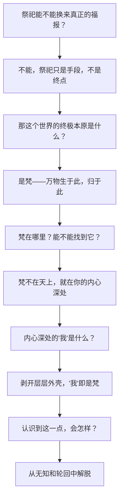

## 《奥义书》读书笔记 
  
### 作者  
digoal  
  
### 日期  
2026-06-21  
  
### 标签  
读书笔记 , 奥义书  
  
----  
  
## 背景 
  
  


---
书名: 《奥义书》  
作者: 古印度先哲（佚名，多人集体创作） / 黄宝生 译  
出版年份: 2012-12  
笔记日期: 2026-06-21  
豆瓣链接: https://book.douban.com/subject/21256236/  
豆瓣评分: 9.1  
标签: [印度哲学, 宗教经典, 汉译世界学术名著丛书, 梵文]  
---

  

> **一句话**：一群两千五六百年前的古印度人，在森林里追问"我是谁、世界从哪儿来"，追到底发现——答案不在外面，就是"我"自己。  
> **适合谁读**：对"自我是什么"这个问题睡不着的人，对印度哲学、佛教源头、叔本华尼采的思想资源感兴趣的人，以及单纯想找一本能让你慢下来的古老智慧文本的人。  
> **阅读难度**：⭐⭐⭐⭐☆（4/5，黄宝生译本已经是同类译本里最好懂的，但概念体系仍需要耐心）  
> **推荐指数**：⭐⭐⭐⭐⭐  
  
---

## 一、时代坐标：这本书从哪里来？

公元前十五世纪到前十世纪之间，雅利安人从中亚迁入印度河—恒河平原，带来了《吠陀》——一套向自然神祈祷求福的颂诗集。火神、雷神、太阳神、黎明女神，各司其职，人们靠献祭和咒语跟它们做交易：你保我五谷丰登，我给你供品和颂歌。这是一个"靠神办事"的时代。

但事情慢慢起了变化。到公元前八世纪前后，一批婆罗门祭司和苦修者开始不满足于"献祭换福报"这套交易逻辑。他们躲进森林，坐在导师身旁（"奥义书"梵文 Upaniṣad 的本意正是"近坐"，引申为秘传、密授），不再问"该向哪个神献祭"，而是问一个更根本的问题：**这一切祭祀、神祇、生死轮回背后，到底有没有一个统一的、终极的东西？**

这就是奥义书诞生的现场。它不是某一个人一次性写成的书，而是数百年间多位无名先哲思考的合集，现存公认最早、最重要的十三种"原始奥义书"，前五种是散文体，成书约在佛陀（约公元前566—前486）之前；后几种以诗体为主，延续到公元前一世纪左右。换句话说，**奥义书的写作时间跨度，恰好横跨了佛教诞生的前夜**——这不是巧合，佛陀本人就是在这套问题意识的土壤里长大的，"业""轮回""解脱"这些词，奥义书比佛教说得更早。

它要解决的问题很朴素也很宏大：人为什么要受苦、要轮回？有没有办法跳出这个循环？答案如果不在外部的神那里，那会在哪里？

---

## 二、核心命题：作者在说什么？

### 观点一：世界的本原是"梵"（Brahman）

吠陀时代相信众神主宰世界；到了奥义书，神祇退场，一个更抽象的概念登场——梵。梵不是某个神，而是宇宙万物从中生出、靠它维系、最终又回归其中的那个"终极存在"。《大森林奥义书》有个生动的比喻：一切气息、一切世界、一切众生，都从这个本原中"涌现"出来，就像蜘蛛沿着自己吐的丝向上爬，又像火星从火堆里往外飞溅——万物是梵向外的"溅射"，不是另造的东西。

### 观点二："自我"（Ātman）即是梵——梵我合一

这是奥义书最核心、也最颠覆的一击：你以为"自我"只是住在你这具身体里的小小灵魂，但奥义书说，这个"自我"往深处剥，剥到底，跟那个创造宇宙的"梵"是**同一个东西**。《歌者奥义书》说得直白："这是我内心的自我，它就是梵。"打个比方就像瓶子里的空气和瓶子外的大气——形式上被瓶壁分隔成"里"和"外"，性质上其实毫无分别，只要打破瓶子（也就是破除"我执"的幻觉），里外便当即合一。

### 观点三：无知（摩耶之幻）是痛苦的根源，认知梵我合一即是解脱

奥义书认为，人之所以陷在生死轮回（业报循环）的苦海里，根源不是做错了哪件具体的事，而是**认知上的错觉**：把"小我"当成跟"大梵"截然不同、互相分离的东西。这种错觉（摩耶，māyā）让人执着于肉体、欲望和具体的行为后果，于是欲望生意愿，意愿生行为，行为生结果，结果再生欲望，循环不息。而一旦真正"知道"梵我同一这件事——不是嘴上说说，是体证——人就从这个循环里解脱出来了。知识，在这里不是信息，是救赎本身。

---

## 三、论证地图：作者怎么说服你的？

奥义书不是用逻辑证明，而是用比喻、对话和反复诘问层层逼近答案。它最爱用的招数，是把一个抽象问题，拆成一连串具体到近乎天真的小问题，一步步往后退，直到退无可退：



最典型的例子是《歌者奥义书》里那个"盐溶于水"的实验：父亲让儿子把一块盐丢进水里，过一夜，再让他从水里"捞出"那块盐——当然捞不出来，但喝一口水，处处都是咸的。父亲借此告诉儿子：梵也是这样，渗透在万物之中，看不见摸不着，但无处不在，你的"自我"也是如此被梵浸透的。这种论证方式不靠演绎推理，靠的是**可感的类比**——用日常经验（盐、火星、蜘蛛丝）去逼近一个超验的概念，这恰恰是奥义书区别于后来印度六派哲学严密论证体系的地方：它更像诗与哲学的混血，逻辑链条松散，但意象的穿透力极强。

评价：这种论证方式的代价是"可证伪性"几乎为零——你无法用经验反驳"梵渗透万物"这句话，它本身就被设计成了一个不可辩驳的信念框架。豆瓣上有读者犀利地指出，奥义书的说服力不靠理性分析，而靠一种"具现"的力量，这话说得很准——它打动人，不是因为论证滴水不漏，而是因为比喻足够生动、重复足够虔诚。

---

## 四、前提假设与边界：什么情况下这不成立？

### 假设一：存在一个永恒不变的"自我"（有我论）

整套梵我合一的体系，建立在"人确实有一个恒常不变的内核自我"这个前提之上。但这个前提后来被佛教正面挑战——佛教讲"诸法无我"，认为根本不存在这样一个恒常实体，痴迷于寻找它本身就是执念的来源。同一片土壤里长出的两套体系，对"解脱"开出了完全相反的药方：奥义书说"找到真我"，佛教说"看破无我"。今天如果你信奉某种现代心理学里"找到真实自我"式的成长叙事，其实正站在奥义书这一侧；如果你更认同"自我是流动的叙事建构"，则更接近佛教的立场。

### 假设二：知识本身具有解脱的力量

奥义书反复强调，"认识"梵我合一这件事，本身就足以带来解脱，不需要靠外在的善行或仪式去换。这在当时是一次巨大的解放——把解脱的钥匙从婆罗门垂直垂直垂下来的祭祀仪式，转移到了个人的内在体证上。但这个假设也意味着：解脱是**精英化**的，它要求长期的冥想训练、识字能力、脱产修行的条件，这恰恰是大多数普通人（尤其是低种姓）不具备的。

### 假设三：种姓制度的合理性预设

这是这本书最值得警惕的一面。奥义书诞生于婆罗门祭司阶层内部，部分文本（如《大森林奥义书》）明确把"梵我合一"的资格，跟婆罗门、刹帝利两个高种姓绑定，宣称首陀罗（最低种姓）不配与梵结合。换句话说，一套看似超越功利、追求终极真理的哲学，骨子里仍然为种姓特权提供了形而上学的背书。读这本书时，这一点不该被那些优美的比喻和宏大的宇宙论遮蔽过去——**思想的深刻和它的社会功能可以是两件事**。

---

## 五、思想谱系：这本书在哪个传统里？

奥义书上承《吠陀》本集和《梵书》的祭祀传统，下启印度教吠檀多哲学体系——"吠檀多"（Vedānta）这个词本身就是"吠陀的终末"，指的正是奥义书。九世纪的商羯罗据此发展出影响深远的"不二论"，把梵我合一推到了哲学体系的极致；同时，它也是佛教概念体系的近邻和对话者，"轮回""业""解脱"这些核心词汇，佛教接过来重新填充了内容（用"无我"取代"有我"，用"缘起"取代"梵"）。

更出人意料的是它在西方的回响：十九世纪初，奥义书经波斯文转译成拉丁文流入欧洲，德国哲学家叔本华读到后近乎痴迷，称这是他"生的安慰，也是死的安慰"，并在《作为意志和表象的世界》序言里预言梵文典籍对西方思想的冲击将不亚于文艺复兴。尼采也深受影响。可以说，奥义书是少数真正打穿了东西方哲学壁垒、让两个完全不同传统的思想者产生共鸣的古老文本之一——这跟它论证方式的"诗性"特质或许有关：逻辑系统可以被翻译误读，但一个关于"我即一切"的震撼意象，跨语言也能直击人心。

它也常被拿来和中国的《道德经》《论语》对照——豆瓣上不少读者提到三本书"隐隐约约传递着某种共性"，都是早期轴心时代对终极秩序的追问，但奥义书的路径更偏向形而上学的本体论建构，而《道德经》更偏向"无为"的实践智慧，《论语》则几乎不碰这类终极问题，专注人伦秩序——三者站在同一个历史断层期，却走向了三个方向。

```
吠陀本集(颂神诗) → 梵书(祭祀仪轨、生主创世) → 奥义书(梵我合一)
                                                  │
                              ┌───────────────────┼───────────────────┐
                              ↓                   ↓                   ↓
                        吠檀多哲学            佛教(无我/缘起)        西方哲学
                      (商羯罗不二论)         (重新诠释轮回/解脱)   (叔本华/尼采)
```

---

## 六、我学到了什么？

**第一，"内求"和"外求"是两种根本不同的解决问题路径，奥义书选择了一条极端的内求之路。** 现代人遇到困境，习惯往外找答案——换工作、换城市、找方法论。奥义书提供的是一种反直觉的提醒：有些问题（尤其是"我为什么痛苦""活着的意义是什么"这类问题）外部世界给不出答案，因为问题本身问错了方向——不是"世界怎样才能让我满意"，而是"我以为的'我'，本身是不是一个误解"。这不是鸡汤式的"做自己"，而是更激进的"你以为的那个'自己'压根不存在，存在的是别的东西"。

**第二，最朴素的比喻往往比最严密的论证更有穿透力。** 盐溶于水、蜘蛛吐丝、火星飞溅——这些意象比任何逻辑推导都更让人"懂了"。这提醒我，向别人解释一个抽象概念时，找一个对的类比，胜过十页推理。

**第三，一套思想体系的"深刻"和它的"正义"是两个可以分离的维度，必须分别检验。** 奥义书的宇宙论极其深邃，但它对种姓制度的背书，是这套深邃宇宙论附带的、不那么光彩的社会功能。读古代经典时，"被这套思想打动"和"全盘接受它嵌入的社会秩序"，应该是两件可以分开做的事——这个分离能力，本身就是读古书该练的功夫。

---

## 七、举一反三：这个框架还能用在哪？

**"梵我合一"的方法论，可以提炼成一种通用的思维动作：当一个二元对立看起来无法调和时，先怀疑这个对立本身是不是一个认知层面的幻觉。** 这个动作至少可以用在三个场景：

1. **职场里的"个人利益 vs 团队利益"对立**：很多内耗来自把两者当成天然冲突的零和博弈，而真正资深的协作者往往能找到让两者重合的那个更高层面的"梵"（比如共同的客户价值）。

2. **亲密关系里的"独立 vs 依赖"焦虑**：很多人困在"我要保持自我"和"我想和对方融合"这两极之间反复拉扯，奥义书式的提问会反问：你以为的"独立的自我"，本身边界是不是被你高估了？

3. **个人成长里的"接纳现状 vs 追求改变"的矛盾**：奥义书的解脱逻辑提示，有些改变不需要往外用力，而是先看清"我以为必须改变的那个东西"本身的真实样貌——有时候问题消解于认知的更新，而不是行动的加码。

---

## 八、批判与反思

哪里我不同意？**奥义书把"认知"和"解脱"画上等号，这个等号打得太满。** 知道梵我合一是一件事，活出来是另一件事——它低估了认知到行为之间那条巨大的鸿沟，这也是后来印度教和佛教都要补充大量"修行方法论"（瑜伽、戒律、禅修）的原因：光"懂了"显然不够。

哪里时代已经变了？**它对种姓的态度，今天读起来是刺眼的。** 一套号称揭示宇宙终极真理的哲学，骨子里却替等级制度盖了一个形而上学的橡皮章，这提醒我们：任何声称"超越世俗、直指终极"的思想体系，都该被反问一句——它实际上巩固了谁的位置。

这本书的局限性在哪里？**它没有提供一套可检验的方法去"证实"梵我合一，全靠比喻和信念的反复加固。** 这对追求确定性、可验证性的现代理性来说，是一个先天的短板——但反过来说，这恰恰也是它两千多年来没有过时的原因：它从一开始就不是在回答一个科学问题，而是在回答一个意义问题，而意义问题，从来不靠"证明"来解决。

---

## 九、金句与记忆点

1. **"这是我内心的自我，它就是梵。"**（《歌者奥义书》）——梵我合一的核心命题，一句话定调全书。

2. **盐溶于水的比喻**——父亲让儿子从水里捞出溶化的盐，捞不出来，却处处都咸：抽象本原渗透万物却无形可见，这是奥义书最有名的"教学现场"。

3. **蜘蛛吐丝、火星飞溅的创世比喻**——万物不是被另造出来的，而是本原向外的自然"溅射"，这个意象比"创世神造物"更接近一种生成论而非制造论的宇宙观。

4. **梵不可见、不可闻、不可说，却又是宇宙间的一切**——这种"否定式描述"（说它不是什么，而不说它是什么）后来被佛教、神秘主义文学广泛借用，是描述终极实在的一种通用语法。

5. **叔本华那句近乎告白的评价**——他称研读奥义书是自己"生的安慰，也是死的安慰"，这或许是西方哲学史上一个东方文本获得过的最私人化、最热烈的致敬。

6. **欲望—意愿—行为—结果的因果链**（《大森林奥义书》）——这条朴素的因果链，比后来佛教的"十二因缘"简化得多，但内核已经在了，是理解"业"这个概念最好的入门句子。

7. **"始终生活在无知之中，却自认是智者和学者，愚人们徘徊在歧路，犹如盲人引导盲人。"**（《伽陀奥义书》，被许多读者认为是十三种奥义书里文学性最强的一种）——这句话放在任何时代的"信息过载却思考贫乏"语境里，都还在生效。

---

## 十、延伸阅读

1. **《薄伽梵歌》**——奥义书思想的"通俗版续集"，把梵我合一的哲学嵌进了一个具体的战场对话故事里，比奥义书更有叙事性，是进入印度哲学的另一个友好入口。

2. **《佛本生故事选》/原始佛教经典（黄宝生、郭良鋆译）**——读完奥义书的"有我论"，再去看佛教如何针对性地提出"无我论"，两者放在一起读，能更清楚地看到印度思想史上这次关键的分叉。

3. **叔本华《作为意志和表象的世界》**——想看一个西方哲学家如何把奥义书的"意志/摩耶"框架嫁接进德国哲学体系，这本书是绕不开的案例。

4. **《道德经》**——同处轴心时代、同样追问终极秩序的另一种东方智慧文本，适合和奥义书对照阅读，体会"形而上学建构"和"无为实践智慧"两条不同的路径。

5. **黄宝生《梵学论集》**——译者本人关于梵语文学、印度哲学、中印文化比较的论文合集，想了解黄宝生如何理解自己一生研究的对象，这本书是一个直接窗口。

---

*笔记写于 2026-06-21 | 基于公开资料与深度思考整理*
  
  
#### [PostgreSQL 解决方案集合](../201706/20170601_02.md "40cff096e9ed7122c512b35d8561d9c8")
  
  
#### [德哥 / digoal's Github - 公益是一辈子的事.](https://github.com/digoal/blog/blob/master/README.md "22709685feb7cab07d30f30387f0a9ae")
  
  
#### [About 德哥](https://github.com/digoal/blog/blob/master/me/readme.md "a37735981e7704886ffd590565582dd0")
  
  

  
