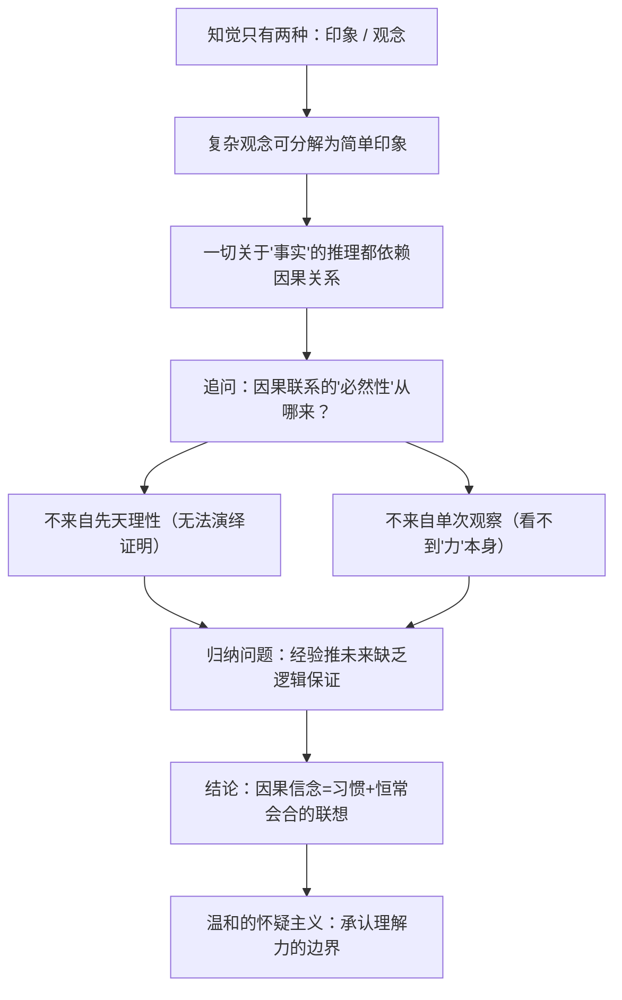

## 《人类理解研究》读书笔记 
  
### 作者  
digoal  
  
### 日期  
2026-06-22  
  
### 标签  
读书笔记 , 人类理解研究  
  
----  
  
## 背景 
  
  


---
书名: 《人类理解研究》  
作者: [英] 大卫·休谟  
译者: 关文运  
出版社: 商务印书馆  
出版年份: 1997-05（原作1748年）  
笔记日期: 2026-06-21  
豆瓣链接: https://book.douban.com/subject/1915608/  
豆瓣评分: 8.9（976人评价）  
标签: [哲学, 经验论, 怀疑论, 西方哲学, 汉译世界学术名著丛书]  
---

  

> **一句话**：一本145页的小册子，把"太阳明天还会升起"这种天经地义的常识，硬生生问出了一道两百多年都没人能彻底解开的题。  
> **适合谁读**：对"我们到底是怎么知道事情的"感到好奇的人；想搞懂"科学到底有没有铁一般的根据"的人；准备啃康德但还没找到入口的人。  
> **阅读难度**：⭐⭐⭐☆☆（1-5星）  
> **推荐指数**：⭐⭐⭐⭐⭐  
  
---

## 一、时代坐标：这本书从哪里来？

1748年，休谟37岁。九年前，28岁的他写出了野心勃勃的巨著《人性论》，自信会"震动整个学术界"，结果却"未曾激起一声咆哮，甚至连低声细语都没有"——这本书几乎无人问津。休谟后来在自传里说得很苦：这是"一本死产的作品"。

但他没有放弃，而是反思问题出在表达方式上：《人性论》写得太密、太年轻气盛。于是他用十年时间磨练文笔，靠写历史、政治、宗教方面的随笔成了畅销作家，然后把《人性论》第一卷里关于"知识论"的核心内容，重新拆解、打磨、提炼，写成了更精炼锋利的《人类理解研究》休谟意识到问题可能不是出在他的主张本身，而在于他表达自己的方式，之后他把《人性论》当中的核心想法重新整理加工，出版了《人类理解研究》。这一次，他成功了——也成了哲学史上少有的靠哲学写作"发财致富"的人休谟也成了少有的靠哲学写作发财致富的人。

那是一个理性主义思潮高歌猛进的年代：笛卡尔、莱布尼茨这些大陆哲学家热衷于构建宏大的演绎体系，仿佛靠纯粹理性就能推导出整个世界的真相。休谟所在的苏格兰启蒙运动则走了另一条路：不预设任何"显然如此"的大前提，老老实实从观察和经验出发，效仿牛顿研究自然世界的方式，去研究人的心灵本身。这本书，正是这场"思维实验"最锋利的产物。

```
1739 《人性论》出版 ——「死产」
        ↓ 十年打磨文笔
1748 《人类理解研究》出版 ——「大获成功」
        ↓ 二十余年后
1770s 康德读到休谟 ——「从独断论的瞌睡中惊醒」
        ↓
1781 康德《纯粹理性批判》——回应"休谟问题"
```

---

## 二、核心命题：作者在说什么？

### 观点一：你所有的"观念"，都是"印象"的复制品

休谟把人的全部心理内容分成两类：**印象**（impression，感官给的直接、鲜活的感受）和**观念**（idea，对印象的回忆、加工、重组，相对暗淡模糊）。听起来像是常识，但他由此抛出一个杀招：任何一个观念，如果你说不出它对应着哪个原始印象，那它就是空洞的、该被怀疑的。这一招后来被逻辑实证主义者直接继承，成了他们判定"形而上学命题无意义"的武器。

### 观点二：因果关系，不是理性发现的，是习惯造出来的

这是全书真正的爆点。我们都相信"敲打火石会出火星""松手球会落地"，理所当然以为这是"理性"看出了事物之间必然的因果联系。休谟逼问：你究竟在哪个事件本身里，**看到**了那个"必然导致"的力量？答案是看不到——你只看到一件事之后总是跟着另一件事，仅此而已虽然我们能观察到一件事物随着另一件事物而来，我们并不能观察到任何两件事物之间的关联，我们只能得知某些事物总是会连结在一起。所谓"因果"，其实只是大脑在反复看到 A、B 接连出现后，养成的一种心理联想习惯，被我们错当成了客观世界里的铁律我们之所以相信因果关系并非因为因果关系是自然的本质，而是因为我们所养成的心理习惯和人性所造成的。

### 观点三：归纳推理，从来没有被理性证明过——这是"休谟问题"

由观点二自然推出一个更可怕的结论：我们用过去的经验去预测未来（"太阳过去每天升起，所以明天还会升起"），这个推理本身没有逻辑上的必然性支撑，它依赖一个根本无法被证明的假设——"未来会和过去相似"。这就是后世所说的"归纳问题"，被公认为休谟留下的、迄今哲学界仍在争论的最大难题之一休谟问题涉及的是"关于事实与实际存在的推理"的问题，特别是关于因果联系的问题，这一问题通常亦称"归纳问题"。

---

## 三、论证地图：作者怎么说服你的？

休谟的论证路径异常清晰、层层递进，像在拆一台精密的钟：



论证武器主要是**思想实验**而非数据：比如著名的"想象一个从未见过雪的人，能否仅凭概念推出雪是白的、冷的"——用来证明观念必须有印象来源；又如"想象台球相撞"——用来逐帧拆解我们到底"看到"了什么、"没看到"什么。这种举重若轻的例证方式，正是休谟文风被后人称道之处休谟少有地能把深刻的哲学思想和漂亮的散文体结合到一起。

全书最辣的一节是关于"神迹"的讨论：休谟提出一条判断准则——**一个明智的人应该按证据的强弱来调整自己的信念**，神迹之所以难以采信，是因为"自然规律被打破"这件事本身的不可能性，总是远远大于任何目击者作证可能出错的概率。这一节直接把怀疑主义的刀锋指向了宗教神学，也是当年这本书引发争议的重灾区。

---

## 四、前提假设与边界：什么情况下这不成立？

休谟的整套论证，建立在几个关键前提之上：

1. **"一切知识必须能追溯到感官印象"**——这套"印象-观念"的二元划分本身，把数学和逻辑这类不依赖经验、纯靠概念关系成立的"观念关系"知识单独摘出来，没有受到怀疑论冲击，这也是后来逻辑实证主义"分析-综合"二分法的直接来源。但20世纪的奎因等人已经对这种干净的二分提出过质疑——经验和概念的边界，可能远没有休谟想的那么清晰。

2. **"因果关系=恒常会合+心理习惯"是完整解释**——这个假设把"为什么我们相信因果"和"因果关系到底是不是客观存在的"两个问题，悄悄合并成了一个问题。后世科学哲学家（包括波普尔）一直在争论：就算休谟说的心理机制是对的，也不能简单推出"客观世界里就真的不存在因果必然性"，这是认识论结论被拿去做了本体论结论。

3. **"温和怀疑主义"能落地为一种可生活的态度**——休谟自己也承认，怀疑论的结论一旦走出书房，回到日常生活，几乎没人真的会因为"归纳没有逻辑证明"就不敢出门过马路。这恰恰说明他的怀疑论更像是一种**理论上的诚实**，而不是一种**行动指南**——这也是他自己反复强调的：怀疑主义只能温和地"限制"理解力的滥用，不能、也不该取消正常生活。

适用边界：这本书的力量在认识论层面（我们凭什么相信、凭什么知道），如果直接拿去否定科学方法本身的实用性，就走偏了——休谟本人也从未否认科学方法"管用"，他否认的只是这种"管用"背后有理性可以证明的必然性保证。

---

## 五、思想谱系：这本书在哪个传统里？

休谟站在洛克的经验论肩膀上，把"知识来自经验、没有天赋观念"这条线推到了它逻辑上能走到的最远处，比洛克和贝克莱都更彻底、更不留情面。他自己称这套方法为"人性的科学"，希望像牛顿研究自然定律一样，用观察实验的精神去研究心灵本身休谟认为在这个过程中，我们可以找出人类理解能力所遵循的规律和法则，就像牛顿为自然世界的运行给出的三大定律一样。

往后看，这本书的影响力呈一种奇特的"延迟引爆"：休谟生前作为哲学家并不算特别走红（人们更熟悉"历史学家休谟"），直到康德公开承认是休谟把他从"独断论的瞌睡"中惊醒，才让这本小册子的地位陡然抬升随着德国哲学家伊曼努尔·康德夸赞道是休谟让他从"教条式的噩梦"中觉醒，休谟的哲学著作开始获得大众的注意。这场"惊醒"直接催生了康德的《纯粹理性批判》——康德毕生想做的一件事，就是回答休谟提出的因果性难题，既要保住科学知识的客观必然性，又不至于退回到休谟式的彻底怀疑康德将因果联结的概念归诸我们的"习惯"，是以一种主观的必然性混充了客观的必然性，最终会使一切形而上学都不再可能，恰恰是这一点把他从"独断的瞌睡"中唤醒。

```
洛克（经验来源说）
   ↓
贝克莱（彻底主观唯心化）
   ↓
休谟《人类理解研究》（怀疑论的顶点）
   ↓ 直接刺激
康德《纯粹理性批判》（先验综合判断救场）
   ↓ 远期回响
逻辑实证主义 / 分析哲学（20世纪）
```

20世纪的逻辑实证主义者（如艾耶尔）几乎把休谟当作精神先驱，认为他率先划清了"有意义的命题"和"形而上学空谈"之间的界限艾耶尔断言，休谟的意思是，除了形式的分析命题和经验的事实命题，其他一切形而上学命题都是没有意义的。罗素、波普尔等人也都在不同程度上把休谟视为自己思想谱系里绕不开的一站。

---

## 六、我学到了什么？

第一，**"理所当然"是最值得怀疑的东西**。休谟教会我的最直接的一课，是把"因为一直这样，所以以后也会这样"这句几乎支撑了我全部日常判断的话，单独拎出来检查一遍——结果发现它从来没有真正被证明过，我们只是因为它"管用"才继续信它。这不是让人变得犬儒或者瘫痪，而是让人对自己"确信"的东西多一分清醒的谦逊。

第二，**习惯不是理性的反面，而是理性的地基**。这点和我原来对"理性"的浪漫想象正好相反——我以前以为理性是凌驾于习惯之上的，读完才意识到，连"科学方法"本身能够运转，靠的也是一种被反复验证、被信任的习惯，而不是某种凌空蹈虚的纯逻辑证明。这反倒让我对"经验"这个词多了一份尊重。

第三，**怀疑论可以是一种建设性的姿态，而不只是拆台**。休谟自己也说，温和的怀疑主义不是要瘫痪生活，而是要让我们在每一次"我确定"之前，先问一句"我凭什么确定"。这种"先问凭什么"的习惯，比这本书里任何一个具体结论都更值得带走。

---

## 七、举一反三：这个框架还能用在哪？

1. **审视数据驱动的决策**：当我们说"过去三年用户增长曲线如此，所以未来也会这样"，本质上就是在做休谟式的归纳推断——这提醒我们，任何基于历史数据的预测模型，都隐含着"未来会和过去相似"这一未经证明的假设，遇到结构性变化时（黑天鹅事件），这套假设最先失效。

2. **拆解"相关性"和"因果性"**：休谟对因果关系的解剖，正是今天数据分析里"相关不等于因果"这条戒律的哲学源头。看到两个变量总是一起变化，先别急着断言谁导致了谁，先问：我看到的，到底是"恒常会合"还是"必然联系"？

3. **对专家观点、权威结论保持"温和怀疑"**：休谟在"神迹"一节给出的判断准则——按证据强弱调整信念，而不是按权威或惯性调整——可以迁移到对任何"非凡声明"的评估上：声明越反常，需要的证据强度也应该越高。

---

## 八、批判与反思

哪里我不完全同意：休谟把"因果关系的客观必然性"和"我们对因果关系的主观信念"处理得有点过于干脆——他几乎是直接用心理学解释代替了形而上学问题，但这其实回避了一个更深的问题：就算我们对因果的"信念"来自习惯，这并不能反过来证明世界上"真的没有"客观的因果结构，只能说明我们没法用纯理性证明它。把"我们无法证明X"偷换成"X可能不存在"，是这本书里我觉得最值得商榷的一步跳跃。

哪里时代已经变了：休谟写作时，统计学、概率论还远未成熟，他面对的归纳问题是"全有或全无"式的——要么必然，要么纯属心理习惯。今天我们有了贝叶斯推理这套工具，可以用"概率更新"的方式给归纳推理一个不那么悬空的数学地基（虽然这套地基本身要不要预设一些先验，仍然能追溯回休谟式的怀疑）。

这本书的局限性：它解构的力道远大于建构的力道。读完你会清楚地知道"为什么我们的确信没有铁证"，但休谟并没有给出一个能替代旧有信念体系、让人安心生活下去的新框架——这也是后来康德要花一整本《纯粹理性批判》去补的窟窿。

---

## 九、金句与记忆点

1. **"一个明智的人是根据证据的强弱来调整他的信念的。"** —— 这是全书"神迹"一节给出的判断准则，朴素却极其有用：信念的强度，应该和支持它的证据成比例，不该多一分，也不该少一分。

2. **"我们能观察到一件事物随着另一件事物而来，但我们并不能观察到任何两件事物之间的关联。"**虽然我们能观察到一件事物随着另一件事物而来，我们并不能观察到任何两件事物之间的关联 —— 整本书的核弹头，一句话拆穿"因果"这个我们最不假思索使用的概念。

3. **"如果哲学家们在人们理解能力和范围之内来讨论问题，就会免除许多烦恼，得到幸福。"**休谟还进一步指出，如果哲学家们在人们理解能力和范围之内来讨论问题，就会免除许多烦恼，得到幸福 —— 与其说是悲观的怀疑，不如说是一种"量力而行"的智慧。

4. **"一切哲学的结果只是使我们把人类的盲目和弱点发现出来。"**一切哲学的结果只是使我们把人类的盲目和弱点发现出来，我们每一次转折都会看到它们——虽然我们竭力想逃脱这种观察 —— 休谟式谦逊的浓缩表达。

5. **"凡不包含数量推理和经验事实推理的书，里面只有诡辩和幻想。"**除了包含着数和量方面的推理，以及包含着关于实在事实和存在任何经验的推论的书籍，其余的书籍所包含的没有别的，只有诡辩和幻想 —— 全书结尾那句广为流传的"烈火说"的核心论断，划清了休谟眼中"有意义的知识"的边界。

6. **"一个合理的推理者，应该永久保有某种程度的怀疑、谨慎和谦恭。"**一个合理的推理者在一切考察和断言中应该永久保有某种程度的怀疑、谨慎、和谦恭 —— "温和怀疑主义"的人格画像，值得抄在笔记本第一页。

---

## 十、延伸阅读

1. **《人性论》（休谟）**——这本书的"未删减重型加长版"，想看休谟最初、最野心勃勃的论证全貌，建议读完《人类理解研究》后再回头啃这本。

2. **《纯粹理性批判》（康德）**——如果你被休谟的归纳问题"吓"住了，康德这本就是西方哲学史上对此最重磅的回应，试图既保住科学的客观性，又不否认休谟提出的真问题。

3. **《人类理解论》（洛克）**——休谟经验论的直接来源，读这本能更清楚地看到休谟到底在哪一步比洛克"走得更远"。

4. **《哲学与自然之镜》（理查德·罗蒂）**——20世纪对经验论传统的一次系统性反思，能帮助理解休谟问题在当代哲学里余波的走向。

5. **《思考，快与慢》（丹尼尔·卡尼曼）**——如果觉得休谟讲的"习惯造成的因果信念"有点抽象，这本心理学经典会用大量真实实验，让你直观感受到"系统1"是怎么靠联想习惯而不是理性在做判断的。

---

*笔记写于 2026-06-21 | 基于公开资料与深度思考整理*
  
  
#### [PostgreSQL 解决方案集合](../201706/20170601_02.md "40cff096e9ed7122c512b35d8561d9c8")
  
  
#### [德哥 / digoal's Github - 公益是一辈子的事.](https://github.com/digoal/blog/blob/master/README.md "22709685feb7cab07d30f30387f0a9ae")
  
  
#### [About 德哥](https://github.com/digoal/blog/blob/master/me/readme.md "a37735981e7704886ffd590565582dd0")
  
  

  
