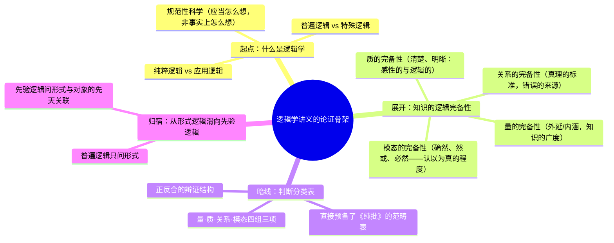

## 《逻辑学讲义》读书笔记 
  
### 作者  
digoal  
  
### 日期  
2026-06-22  
  
### 标签  
读书笔记 , 逻辑学讲义  
  
----  
  
## 背景 
  
  


---
书名: 《逻辑学讲义》  
作者: （德）伊曼努尔·康德  
译者: 许景行  
出版社: 商务印书馆  
出版年份: 2010-10（原书首版于1800年，由耶舍编订）  
笔记日期: 2026-06-21  
豆瓣链接: https://book.douban.com/subject/4202381/  
豆瓣评分: 9.1（544人评价）  
标签: [康德, 逻辑学, 西方哲学, 汉译世界学术名著丛书, 先验逻辑]  
---

  

> **一句话**：这是康德留给世人的一份"教学遗产"——表面上是一本逻辑学教科书，骨子里却是打开《纯粹理性批判》的一把钥匙。  
> **适合谁读**：想真正搞懂康德"范畴表""先验逻辑"从哪里来的人，以及对"思维的规则"本身感兴趣的人。  
> **阅读难度**：⭐⭐⭐⭐☆（4/5星，导言极为艰深，正文相对友好）  
> **推荐指数**：⭐⭐⭐⭐☆（4/5星，专业但不冷门，是理解康德体系的高性价比入口）  
  
---

## 一、时代坐标：这本书从哪里来？

1800年，76岁的康德已经垂垂老矣，记忆力和精力急剧衰退，《纯粹理性批判》（1781）、《实践理性批判》（1788）、《判断力批判》（1790）三大批判早已问世，他的哲学体系已经基本完工。这一年，他委托自己的学生耶舍（Gottlob Benjamin Jäsche）把他三十多年讲课用的笔记和提纲整理成一本逻辑学教材，以"康德逻辑学"之名出版。这就是后世所称的《耶舍逻辑》（Jäsche Logic），也就是这本《逻辑学讲义》的原本。

康德从1755年留校任教起，几乎每年都要开"逻辑学"这门必修课——这是当时普鲁士大学钦定的课程，教材用的是沃尔夫学派的格奥尔格·弗里德里希·迈尔（G. F. Meier）所著的逻辑学课本。但康德这个人不太"听话"：他一边照着教材讲，一边不停地"夹带私货"——这里说一句"这个地方不对"，那里说一句"这样讲不行"，把自己正在酝酿的先验哲学悄悄塞进了传统逻辑学的外壳里（中文互联网上有学者形象地把这个过程概括为"夹带"）。所以，与其说这是一本沃尔夫派的逻辑教科书，不如说是康德借着教书的机会，几十年如一日地打磨自己逻辑观的思想试验场。

这本书要解决的问题，说到底就是一句话：**思维要正确，到底需要遵守什么样的规则？这些规则凭什么是"必然"的？**

这个问题看似朴素，却是整个康德哲学的起点——因为《纯粹理性批判》里那张著名的"范畴表"，正是从这门课上反复讲述的判断分类法中提炼出来的。理解了《逻辑学讲义》，你才能看清"范畴是怎么从天上掉下来的"这个老问题，原来根本不是凭空臆造，而是康德几十年逻辑教学的自然结晶。

```
1755年起：康德开始讲授逻辑学（沿用沃尔夫学派迈尔教材）
        ↓
教学中不断"批注"、偷换传统逻辑学的内核
        ↓
1770s-1790s：先验逻辑思想逐渐成型，融入逻辑课讲义
        ↓
1781-1790：三大批判先后问世，体系基本完成
        ↓
1800年：垂暮之年，委托学生耶舍整理讲义，出版《逻辑学讲义》
```

---

## 二、核心命题：康德在说什么？

### 观点一：逻辑学不研究"我们实际怎么想"，而研究"我们应当怎么想"

康德给逻辑下的定义非常关键：逻辑学不是一门描述人类实际思维过程的心理学，而是一门规定知性和理性应当如何正确运用的**先天科学**。换句话说，逻辑学关心的不是"人脑事实上是怎么运转的"，而是"正确的思维，无论是谁，必须遵守哪些规则"。这一区分看似简单，实际上是给逻辑学划定了一条"规范性"而非"描述性"的边界——逻辑学是规则，不是事实报告。这条边界后来贯穿了整个分析哲学传统对"心理主义"逻辑观的批判。

### 观点二：从"普遍逻辑"到"先验逻辑"，是康德对传统逻辑的根本性改造

康德把逻辑学切成了几层：先分"普遍逻辑"（管一般而言正确思维的形式，不问思维的具体内容是什么）与"特殊逻辑"（针对特定学科的思维规则）；普遍逻辑内部又分"纯粹逻辑"（不掺杂经验心理因素的纯粹形式规则）与"应用逻辑"（考虑了人的实际认知条件，比如注意力、错误的来源等）。这本《逻辑学讲义》主要讲的是"纯粹的普遍逻辑"。但有意思的是，康德在讲这套传统框架的同时，又不断地往里面塞入他在《纯粹理性批判》中才系统展开的"先验逻辑"的影子——先验逻辑不只关心思维的形式，还关心这些形式如何与对象（经验）先天地发生关系。可以说，普遍逻辑教你"怎么不出错"，先验逻辑教你"知识凭什么能扩展、能成立"。这本讲义就是从前者悄悄滑向后者的过渡地带。

### 观点三：判断分类表里多出来的"模态"，是康德留给逻辑学史最特殊的遗产

传统逻辑（亚里士多德以来）对判断的分类一般落在"量""质""关系"三个维度上。康德在这之外又独立增设了第四个维度——"模态"（判断是确然的、然或的，还是必然的）。这看似只是多加了一类，实际意义深远：它意味着判断不仅有内容上的真假对错，还有"认识主体对这个判断的确信程度"这一额外的、不依附于内容本身的维度。这第四类范畴后来直接搬进了《纯粹理性批判》的范畴表，成为康德整个先验哲学大厦的一块结构性基石。更进一步，康德把判断表里每一类的三项都按照"正、反、合"的方式来解说，这种三元辩证结构，被后世普遍认为是黑格尔辩证法的直接思想源头之一。

---

## 三、论证地图：康德怎么把逻辑学讲成了认识论？

康德这本书的论证路径，本质上是一条"由浅入深、由形式到先验"的坡道：先讲什么是知识的"逻辑完备性"（在量、质、关系、模态四个维度上知识应该满足什么条件），再一步步把"形式上正确"这件事，引向"这种正确性凭什么能保证我们认识到真实的对象"这件更深的问题。



康德用的"案例"并不多，更多是概念辨析式的论证——比如反复区分"感性的清楚"与"逻辑的清楚"、"分析的明晰"与"综合的明晰"。这种写法的代价是阅读门槛高、教科书气息浓；但好处是论证极为细密——豆瓣上不少读者评价它"条分缕析"，这恰恰是因为康德把逻辑学当成了"界定规则有效性范围"的工程，而不是简单罗列规则。这种"先问范围再问内容"的方法论本身，也是康德整个批判哲学的一贯做法（先问"理性能认识什么、不能认识什么"，再讨论具体认识）。

值得留意的一个论证漏洞（也是后人批评最多的地方）：导言部分篇幅几乎占了全书的一半，这种比例失衡恰恰说明康德更在乎"框架问题"而非"内容堆砌"——但对普通读者而言，这也意味着真正"干货"很晚才登场，阅读节奏前重后轻。

---

## 四、前提假设与边界：什么情况下这本书的"权威性"会打折扣？

这本书最特殊也最容易被忽略的一点是：**它不是康德自己动笔写的书，而是学生耶舍依据康德的课堂笔记和讲稿整理而成**，只是出版前经过康德本人审定。这个"审定"环节支撑了它的权威性，但也留下了三个值得警惕的前提假设：

**假设一：耶舍的整理忠实反映了康德晚年的真实想法。**
学术界（特别是西方康德学界）对此长期存疑。学者特里·博斯韦尔（Terry Boswell）早在1988年就专门撰文质疑《耶舍逻辑》的文本权威性，指出耶舍的文本与康德留存的手写笔记之间存在不少差异。近年学者陆楚（Huaping Lu-Adler）等人进一步指出，《耶舍逻辑》里很多细节缺乏独立、确凿的旁证支撑——也就是说，跟康德其他逻辑讲稿的学生笔录（如《布隆伯格逻辑》《维也纳逻辑》《多纳-翁德拉肯逻辑》等）对照后，存在出入。换句话说，我们今天读到的《逻辑学讲义》，未必百分之百是"康德说的话"，而更可能是"康德教学思想经过整理、压缩、甚至重新组织后的版本"。

**假设二：康德当年确实仔细审定、把关了出版前的文本。**
但据康德学界的考据，耶舍在编订过程中与康德本人的实际沟通其实相当有限，序言里甚至出现了一处史实性的小错误（误以为康德从1765年才开始用迈尔的教材，实际上康德从教学生涯一开始就在用）。这说明耶舍对康德教学史的还原本身就不算特别精确，"康德亲自审定"这个说法的含金量可能要打一些折扣。

**假设三：这本书足以代表康德"成熟期"的逻辑学思想。**
这一假设在今天依然大体成立——因为它确实融合了康德数十年讲课积累的思考，尤其是判断表和模态范畴这些核心创见，与《纯粹理性批判》高度吻合，互为印证。但如果你想做严格的康德逻辑学文献学研究，单靠这一本书是不够的，还需要参照那些更接近"第一手"的学生课堂笔录原稿。

**适用边界**：作为"理解康德先验哲学从哪里来"的入门读物和参照系，这本书的价值毋庸置疑；但作为"康德逻辑学定本"来逐字逐句地做文本考据，则需要打上一个学术上的问号。

---

## 五、思想谱系：这本书站在哪条传统的延长线上？

往前看，康德的直接教学背景是沃尔夫学派的理性主义逻辑传统（迈尔教材），他借着讲课的机会，一点点"偷换"了这套教材的内核——这意味着这本书本身就是"破"与"立"同时进行的产物：表面上沿用传统的判断分类框架，骨子里却在悄悄塞入"先验逻辑"这一全新维度。

往后看，影响有两条线特别清晰：

一是**对黑格尔辩证法的奠基性影响**。康德把判断表的每一类范畴都按"正、反、合"方式说明，这种三元结构常被视为黑格尔正题—反题—合题辩证法的直接思想前身。

二是**对20世纪分析哲学与逻辑哲学讨论的间接影响**。康德把逻辑明确界定为"规范性的、关于思维应当如何"的科学，而非心理学式的"思维事实上如何运作"的科学——这个区分构成了后来逻辑学反对"心理主义"的早期论据之一，弗雷格、胡塞尔对心理主义逻辑观的批判，都能在这个区分里找到回响。

与同时代相比，黑格尔后来写出了篇幅浩大的《逻辑学》（也就是常说的"大逻辑"和"小逻辑"），同样试图把逻辑学和形而上学打通，但走的是完全相反的路：康德是把逻辑限定在"思维形式"的范围内，再用"先验逻辑"小心翼翼地架一道桥通向经验对象；黑格尔则索性把逻辑本身等同于存在论，让概念自己运动、自己展开为整个世界。某种意义上，《逻辑学讲义》的克制和谨慎，恰恰反衬出黑格尔体系的野心有多大。

```
沃尔夫学派理性主义逻辑(迈尔教材)
            ↓ 借讲课偷换内核
    康德《逻辑学讲义》/《纯批》先验逻辑
            ↓                    ↓
  黑格尔辩证法(正反合扩张为整个体系)   反心理主义逻辑观(弗雷格、胡塞尔)
```

---

## 六、我学到了什么？

**第一，"范畴表不是拍脑袋想出来的"。** 在读《纯粹理性批判》时，范畴表常给人一种"为什么恰好是这十二个、恰好分这四组"的突兀感，仿佛是康德硬凹出来的体系强迫症。读完这本讲义才明白：那张表的雏形，是康德几十年逻辑课堂上反复打磨、教学相长的产物，量、质、关系、模态四组划分，本身就来自传统逻辑学对判断的分类法，只是被康德重新激活、赋予了先验的意义。这让我对"体系性"这件事多了一分敬意——好的体系往往不是凌空虚构，而是长期实践的提炼和压缩。

**第二，"规范"与"描述"的区分，比想象中更重要。** 康德反复强调逻辑学讲的是"应当怎么想"而不是"事实上怎么想"，这条看似简单的边界，其实可以迁移到很多领域：心理学告诉你人实际怎么决策（往往是有偏差、走捷径的），但伦理学、逻辑学、方法论告诉你"应当"怎么决策。混淆这两者，是很多日常争论里最容易踩的坑——比如把"大多数人都这么做"当成"这么做是对的"的理由。

**第三，权威文本未必等于"作者亲笔"，这提醒我读经典要多一份审慎。** 这本书是学生整理、作者审定的产物，这种"二手却经过把关"的特殊地位，让我意识到很多被我们当作"某某人的代表作"的文本，背后其实有复杂的成书过程（口述记录、学生笔记、后人编订）。读经典时多问一句"这文本是怎么来的"，常常能避免把后人的整理误当成作者百分百原话的风险。

---

## 七、举一反三：这个框架还能用在哪？

康德这种"先界定规则的有效范围，再讨论具体规则能做什么、不能做什么"的方法论，其实是一个非常通用的思维工具：

**场景一：制定团队规章或产品规则时。** 与其一上来就罗列具体条款，先问一句"这套规则适用的边界在哪里、对谁有效、在什么情况下会失效"，往往能避免规则本身的内部矛盾或过度泛化——这正是康德式"先验逻辑"思路的现实版本：不只关心规则的形式，还要关心规则与它要管辖的对象之间是否真的能对得上。

**场景二：判断一个论证或一份数据报告是否可靠时。** 可以套用康德"逻辑完备性"的四个维度自检：这个论证在"量"上覆盖面够不够（外延/内涵）？在"质"上够不够清楚（区分了表面相关和真实因果吗）？在"关系"上有没有循环论证或证据不足？在"模态"上，结论到底是"确定无疑"还是"只是一种可能性"，有没有被悄悄夸大确信程度？

**场景三：评估一份"经典文本"或"权威观点"时。** 像本书这样追问"这份文本到底是谁写的、经过了几层转手、权威性建立在什么基础上"，是一种值得养成的习惯——无论是读古代经典、企业创始人语录，还是网络上流传的"专家说"，都可以先做一次"文本来源体检"。

---

## 八、批判与反思

**我不完全同意的地方**：康德把逻辑学严格限定为"纯形式、不问内容"的学科，这个立场在数理逻辑、符号逻辑高度发展之后的今天，已经显得相对保守——现代逻辑学（包括康德这本书里萌芽却未充分展开的"模态"维度）后来发展出了独立而庄严的模态逻辑体系，远比康德当年设想的丰富复杂。今天再读这本书，更像是在看一座"逻辑学博物馆"，而不是逻辑学的最新地图。

**时代已经变了的地方**：康德写这本书时，逻辑学还基本是哲学系内部的"思维训练"工具，今天的逻辑学早已分化为数理逻辑、计算机科学的基础理论、语言哲学的分析工具等多个高度专业化的分支。康德式的"用自然语言条分缕析地辨析概念"的写法，放在今天的逻辑学专业训练里已经相当边缘——这也是不少读者抱怨"逻辑学讲义不像在教逻辑"的原因：它教的其实是康德式的概念哲学，而不是我们今天理解的"形式推理技巧"。

**这本书的局限性**：最大的局限恰恰是开篇就提到的成书方式——经由学生整理、作者审定但深度参与有限，导致文本权威性始终存在争议，也使得很多细节的措辞、举例究竟多大程度上是"康德原话"，难以彻底坐实。这意味着任何依赖这本书做精细文本考证（比如逐字逐句分析某个术语康德到底是怎么定义的）的研究，都需要格外谨慎，最好同时参照其他几份学生课堂笔录加以交叉验证。

---

## 九、金句与记忆点

1. **"逻辑学讲的是知性应当怎么思维，不是知性事实上怎么思维。"**
 解析：这是全书的方法论根基——逻辑学是规范性科学，不是心理学式的事实描述。一句话划清了"对错"与"常见与否"的界限。

2. **判断表的四个维度：量、质、关系、模态。**
 解析：前三个继承自传统逻辑，"模态"是康德的独创增补，后来直接进入《纯粹理性批判》的范畴表，是整本书留给哲学史最重要的"硬通货"。

3. **"每一位哲学思想家都是在别人工作的废墟上写出他自己的著作的，但没有一部作品达到了所有部分都固定不移的境地。"**
 解析（据豆瓣读者摘录）：康德借此说明哲学没有"可以直接传授的现成体系"，只能靠不断重新论证。这句话也可以读作康德对自己"逻辑学讲义"这本书地位的一种谦逊提醒——它本身也只是一座未完工的废墟。

4. **判断表每一类的三项均以"正、反、合"方式说明。**
 解析：这是康德留给黑格尔的隐性遗产——三元辩证结构最早在这里以"判断分类"的低调形式出现，后来在黑格尔手中膨胀成了整个哲学体系的运动法则。

5. **绝不能把假言判断和选言判断仅仅看作直言判断的"不同装束"，认为它们可以还原为直言判断。**
 解析：康德在这里特别强调三种判断形式（直言、假言、选言）各有独立地位，不能互相化简。这提醒我们：有些看似"形式不同但本质一样"的东西，背后其实有不可忽视的结构差异——化简有时候是偷懒，不是简化。

6. **逻辑的"明晰"分为"分析的明晰"与"综合的明晰"。**
 解析：分析的明晰是把已经隐含在概念里的东西讲清楚；综合的明晰则是通过添加新内容让概念变得更清楚。这组区分如果迁移到写作和表达上：有时候"讲清楚"是去掉冗余，有时候"讲清楚"反而是补充必要的背景信息——方向是相反的。

---

## 十、延伸阅读

1. **《纯粹理性批判》（邓晓芒译，杨祖陶校）**——读完《逻辑学讲义》之后再回头看"先验分析论"中的范畴表，会有一种"原来如此"的豁然贯通感，这本书是理解康德体系绕不开的正主。

2. **《纯粹理性批判》英译本配套的《Lectures on Logic》（剑桥版康德全集，含Blomberg Logic、Vienna Logic、Dohna-Wundlacken Logic与Jäsche Logic四种学生笔录）**——如果想做更严谨的文本对照，这是西方康德学界公认的标准参照本，能直接看到《耶舍逻辑》与康德其他课堂笔录之间的差异。

3. **黑格尔《小逻辑》**——同样叫"逻辑学"，但走的是和康德完全相反的路：把逻辑学直接等同于存在论。两本书对照读，能更清楚地看出康德的克制与黑格尔的野心分别长什么样。

4. **维特根斯坦《逻辑哲学论》**——豆瓣"逻辑学入门书单"里常和这本书并列推荐，代表了20世纪分析哲学对"逻辑究竟是什么"这一问题的全新回答，可以作为康德式逻辑观的一个对照参考。

5. **彼得·斯特劳森《意义的限度》（The Bounds of Sense）**——一部专门重构和批判性梳理康德《纯粹理性批判》论证结构的英语学界经典，适合在读完逻辑学讲义、对康德体系有了基本框架后，进一步检验和质疑这套体系的内部逻辑。

---

*笔记写于 2026-06-21 | 基于豆瓣资料、学术文献与公开书评整理*
  
  
#### [PostgreSQL 解决方案集合](../201706/20170601_02.md "40cff096e9ed7122c512b35d8561d9c8")
  
  
#### [德哥 / digoal's Github - 公益是一辈子的事.](https://github.com/digoal/blog/blob/master/README.md "22709685feb7cab07d30f30387f0a9ae")
  
  
#### [About 德哥](https://github.com/digoal/blog/blob/master/me/readme.md "a37735981e7704886ffd590565582dd0")
  
  

  
