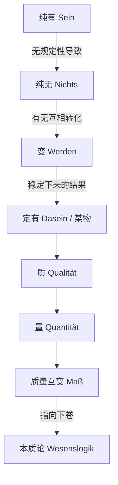

## 《逻辑学（上卷）（大逻辑）》读书笔记 
  
### 作者  
digoal  
  
### 日期  
2026-06-22  
  
### 标签  
读书笔记 , 逻辑学（上卷）（大逻辑）  
  
----  
  
## 背景 
  
  

---
书名: 《逻辑学（上卷）》（大逻辑）  
作者: 黑格尔（G.W.F. Hegel）  
译者: 杨一之  
出版年份: 2001-01  
笔记日期: 2026-06-21  
豆瓣链接: https://book.douban.com/subject/1050527/  
豆瓣评分: 9.0（354人评价）  
标签: [德国古典哲学, 辩证法, 形而上学, 黑格尔, 西方哲学]  
---
  
  

> **一句话**：黑格尔想做一件几乎不可能的事——不借助任何前提，让"纯粹的思想"自己运动起来，自己推导出整个世界的范畴体系。  
> **适合谁读**：对"概念是怎么来的"这个问题感到好奇的人；想理解马克思辩证法源头的人；愿意花时间啃硬骨头、不怕烧脑的哲学爱好者。  
> **阅读难度**：⭐⭐⭐⭐⭐（5星，公认西方哲学中最难读的文本之一）  
> **推荐指数**：⭐⭐⭐⭐☆  
  
---

## 一、时代坐标：这本书从哪里来？

1807年，黑格尔出版《精神现象学》后不久，拿破仑的军队席卷德意志，耶拿大学因为战争陷入凋敝，他被迫离开教职，先去班贝格当了一家亲法报纸的编辑。1808年，在朋友尼特哈默的帮助下，他被任命为纽伦堡一所中学的校长，并在这段时间里写出了他的第二部重要著作《逻辑学》。

这是一个很值得注意的细节：一部被后人视为西方哲学史上最艰深的文本，竟诞生于一位中学校长的案头，而且他当时甚至要把这套逼仄的逻辑学讲给中学生听。1812年到1816年，《逻辑学》分三册陆续问世，黑格尔本人后来还着手修订，但只完成了第一编"有论"的部分——这也是为什么我们今天读到的上卷"有论"，是黑格尔晚年反复打磨过的版本，而下卷"本质论"和"概念论"则保留着更早期的形态。

更宏观地看，这本书是德国古典哲学这场接力赛的"最后一棒"。黑格尔认为，始于康德并在他自己哲学中达到顶峰的德国唯心主义，最重要的成就是论证了现实是由思想塑造的，思想与存在最终是同一件事。康德划出了"现象"与"自在之物"的界限，费希特、谢林想办法去填补这条裂缝，而黑格尔要做的，是彻底取消这条裂缝——他要证明，逻辑学不只是研究"我们怎么推理"的工具学科，而就是"上帝创造世界之前的永恒本质的展开"。这是一句极其狂妄的话，但理解了这句话，才能理解整本书为什么要从"纯有"这个看起来空无一物的概念开始。

```
精神现象学（1807）：意识如何一步步走到"绝对知识"的门口
        ↓
逻辑学（1812-1816）：站在门口之后，思想本身如何展开自己
        ↓
哲学全书 / 法哲学原理（1817、1821）：逻辑学的结构如何落实到自然与社会
```

---

## 二、核心命题：作者在说什么？

### 观点一：逻辑学必须"无前提"地开始

黑格尔对传统形式逻辑最大的不满，是它从不追问自己的开端，总是把"开端问题"甩给经验命题或自明的公理，到了某个大前提就停下来，把这部分交给非逻辑的东西做主。他要写一部彻彻底底没有任何预设的逻辑学：不预设方法，不预设术语，甚至不预设"这门学问到底在研究什么对象"。这就决定了整本书的起点必须是最贫乏、最无规定性的东西——"纯有"。

### 观点二："有"等于"无"：辩证法的第一次现身

这是全书最著名也最容易被误读的论断。黑格尔说："有，纯有，没有任何更进一步的规定。有在无规定的直接性中，只是与它自身相同，对内对外都没有差异。有是纯粹的无规定性和空……有，这个无规定的直接的东西，实际上就是无，比无不多也不少"。

这不是在玩文字游戏，而是在做一件很认真的事：如果"有"真的什么规定都没有，那么你没法把它和"无"区分开来——两者在思维中"指向"的内容完全一样，都是空。但"有"和"无"又显然不是同一个词，于是思维被迫往前走一步，进入第三个范畴——"变"（Becoming）。"有"消逝为"无"，"无"又生成为"有"，这个不断转化的过程本身，才是第一个稳定下来的、有内容的范畴。

### 观点三：辩证法不是技巧，是事物自身的运动

很多人把黑格尔的辩证法理解成"正题—反题—合题"的套公式，但这恰恰是他最反对的读法。黑格尔认为，事物自己运动、自己造成自己，是一切哲学、逻辑、认识乃至整个宇宙之所以可能的基本前提，列宁对这一点评价很高。换句话说，矛盾不是人强加给概念的分析工具，而是概念自身内部本来就蕴含的张力——逼着它必须向更高的、更具体的形态过渡。

---

## 三、论证地图：作者怎么说服你的？

黑格尔的论证方式和一般哲学书完全不同：他不举经验案例，不引用数据，而是让每一个范畴自己"暴露"出内部的矛盾，从而"逼"出下一个范畴。这是一种纯粹概念内部的自我推进，类似于一套自动运转的逻辑机器。



这张图只覆盖了上卷"有论"的主干（"有—无—变"→"定有"→"质"→"量"→"度"）。值得留意的是，黑格尔在这部分集中讨论了质与量、质变与量变的互相转化，批判了传统形而上学把质和量截然割裂开的做法，这被后来的马克思主义哲学称为"有论"中最重大的合理内核。

这种论证方式的优点和风险是一体两面的：优点是体系极其严密，每一步过渡都"内在必然"；风险是，黑格尔经常依靠德语词本身的双关或词源关联来制造"必然性"——比如"Aufhebung"（扬弃）同时有"取消"和"保存"两层意思，这个双关在汉语和英语里都很难还原，读者很容易觉得论证是靠文字游戏撑起来的，而不是靠逻辑必然性。

---

## 四、前提假设与边界：什么情况下这不成立？

**假设一：思维结构和存在结构是同一个结构。** 这是整本书的地基——逻辑学研究的范畴不只是"我们怎么想"，也是"世界本来怎样"。如果你不接受"思维等同于存在"这个唯心主义前提，那么后面几百页层层推导出的范畴体系，对你而言就只是一套精巧但与实在无关的概念游戏。

**假设二：纯粹概念可以脱离一切经验内容自己运动。** 黑格尔坚持逻辑学"无前提"，但分析哲学传统对此提出了尖锐质疑：罗素和摩尔都认为黑格尔的逻辑学是陈旧的、不符合现代逻辑理论的，罗素将逻辑视为哲学的本质，他的新逻辑拒绝预先规定世界是什么，而是自由设想世界可能是什么。换句话说，二十世纪的逻辑学已经走向了形式化、多元化，黑格尔那种"靠概念自己生出下一个概念"的做法，在现代逻辑的标准下很难被承认是"逻辑学"，更像是一种披着逻辑外衣的形而上学。

**假设三："否定之否定"必然带来进步。** 黑格尔相信每一次矛盾的解决都是一次提升，螺旋式上升。但这只是一种乐观的预设——矛盾解决后未必总是"更高"，也可能只是"换了一种方式停滞"。这个假设在用辩证法去解释历史和社会现实时尤其危险，容易变成"凡是发生的都有其合理性"的保守辩护。

这本书的边界很清楚：它是在**纯粹思维**这个高度抽象的层面上展开的体系建构，一旦你想把它直接套用到具体的经验世界、社会历史，就需要黑格尔自己在《法哲学原理》《历史哲学讲演录》里做的"二次转译"工作，而这个转译本身又会引入新的、未必同样严密的假设。

---

## 五、思想谱系：这本书在哪个传统里？

```
柏拉图/亚里士多德（范畴、辩证法的古老源头）
        ↓
康德（先验范畴论，划出现象与自在之物的界限）
        ↓
费希特、谢林（试图弥合康德的二元论裂缝）
        ↓
黑格尔《逻辑学》（取消裂缝：思维=存在，建立完整范畴体系）
        ↓        ↘
  克尔凯郭尔、马克思    20世纪存在主义、法兰克福学派
  （倒转/批判性继承）         （重新解读《精神现象学》）
```

这本书的下游影响极为庞大且充满张力。马克思在《资本论》第二版跋中说，辩证法在其合理形态上是批判的和革命的，它从不断运动和暂时性的角度理解每一种既成的形式，绝不崇拜任何东西；马克思要做的，就是剥去黑格尔辩证法的神秘外壳，取出其中"否定性"这个合理内核。列宁则给出了一句非常有名的悖论式评价："在黑格尔的这部最唯心的著作中，唯心主义最少，唯物主义最多。‘矛盾’，然而是事实！"这句话精准地点出了这本书的奇特位置——一部用最唯心的语言写成的书，却在客观上揭示出现实世界充满矛盾、不断运动这个唯物主义者也认可的事实。

另一条线索是分析哲学的彻底反叛。罗素和摩尔作为"屠龙之士"，从极端整体论和内在关系论两个方向突破新黑格尔主义，共同奠定了分析哲学全面否定传统形而上学的基调。这场反叛持续了大半个世纪，直到经历了波普尔那一代人的误解后，黑格尔主义才从20世纪60年代开始复兴，影响延伸到萨特、阿伦特等一大批思想家。

---

## 六、我学到了什么？

**第一，"空"和"满"在逻辑的最高处是相通的。** 黑格尔从"纯有"开始，而不是从某个具体的、有内容的概念开始，这件事本身就给我很大的启发：很多时候我们以为"越具体越扎实"，但真正的起点往往恰恰是最抽象、最贫乏的那一点——因为只有在那一点上，才不携带任何未经检验的预设。这和做研究、做产品时"先把假设清空再出发"的思路是相通的。

**第二，矛盾不是错误，而是发展的动力源。** 这听起来像句口号，但黑格尔真正让我感受到的是：当一个概念（或一个系统、一个组织）内部出现明显的张力时，那往往不是需要"修补掩盖"的缺陷，而是它正在向更高形态过渡的信号。简单粗暴地消除矛盾，反而可能扼杀了发展的契机。

**第三，体系的严密性是有代价的。** 读这本书最大的冲击，反而来自它的"反面教训"：黑格尔为了维持体系的完全自洽，不惜依赖语言的双关、词源的巧合来制造"逻辑必然性"。这提醒我，任何号称"无懈可击"的宏大体系，都值得多问一句：这种严密究竟来自现实本身的结构，还是来自论证者对语言/工具的选择性使用？

---

## 七、举一反三：这个框架还能用在哪？

1. **复盘一个项目或组织的发展史时**，不妨试着用"内部矛盾驱动跃迁"的视角去看：当前的瓶颈，是不是恰恰预示着下一阶段的形态？而不是简单地把瓶颈当作要"消灭"的敌人。

2. **审视任何一套"自洽到无法反驳"的理论框架**（无论是管理学模型还是阴谋论）时，可以学黑格尔的对手们那样追问：这个体系的严密性，是建立在现实的结构上，还是建立在它自己设定的术语和起点上？这是检验一切"无所不包"理论的有效方法。

3. **思考"概念如何随时间获得更丰富的内涵"**：黑格尔式的"扬弃"——既取消又保留——提供了一种理解知识积累的方式：新的理解不是推翻旧理解，而是把旧理解中真实的部分保存进一个更完整的框架里。这对理解学科史、技术迭代史都有启发。

---

## 八、批判与反思

我并不完全同意黑格尔"思维等同于存在"的核心预设。这个预设让他的整套体系读起来气势恢宏、自圆其说，但代价是它把经验世界的偶然性、不可还原的物质性都收编进了"概念自己运动"的叙事里。波普尔的批评虽然措辞极为尖锐，他直接把同一哲学称为最荒谬的理论之一，认为它甚至没有把要回答的问题表达清楚，但这个批评背后有一个值得认真对待的问题：当一个理论体系能够把"任何反例都解释为辩证发展的一个环节"时，它和不可证伪的理论之间的界限在哪里？

时代也确实已经变了。黑格尔写作时，现代形式逻辑、符号逻辑还没有诞生，他批评的"形式逻辑"还停留在亚里士多德式的三段论阶段。今天再去苛责他"逻辑学不够形式化"，其实有点时代错位；但反过来说，这也意味着今天再读《逻辑学》，更应该把它当作一部**思辨形而上学的巨著**，而不是一部能和现代数理逻辑平行比较的"逻辑学教材"——书名本身在今天容易造成误导。

这本书最大的局限，或许在于它本质上是一个"封闭体系"：黑格尔预设了概念发展终将回归"绝对理念"，一切矛盾终将得到和解。这种乐观的终结论，在经历了二十世纪的历史灾难之后，读起来总让人多一分警惕。

---

## 九、金句与记忆点

1. "有，纯有，没有任何更进一步的规定……有，这个无规定的直接的东西，实际上就是无，比无不多也不少。"
   —— 全书的起点，也是最容易被嘲笑的一句话。理解它需要先放下"有和无是日常意义上对立"的直觉。

2. "逻辑是上帝的思维。"
   —— 黑格尔对《逻辑学》全书雄心最直白的表述：逻辑学不是工具学科，而是世界创生之前的蓝图本身。

3. "在黑格尔的这部最唯心的著作中，唯心主义最少，唯物主义最多。‘矛盾’，然而是事实！"（列宁）
   —— 一句悖论式的赞美，点出了这本"最唯心"的书里藏着的"最唯物"的洞见：矛盾、运动是客观事实。

4. "辩证法……从不断的运动中，因而也是从它的暂时性方面去理解……它是批判的和革命的。"（马克思）
   —— 马克思对黑格尔辩证法"剥壳取核"之后留下的精华版本。

5. "事物自己运动、万物自己造成自己。"
   —— 这是理解辩证法不是"套公式"而是"事物内在张力"的关键钥匙。

---

## 十、延伸阅读

1. **《小逻辑》（黑格尔，贺麟译）**——黑格尔晚年为《哲学全书》写的精简版逻辑学讲义，篇幅小得多，适合在啃"大逻辑"之前先建立整体框架感。

2. **《精神现象学》（黑格尔）**——黑格尔自己说《逻辑学》是这本书的"续篇"，理解意识如何一步步走到"绝对知识"门口，能更好理解《逻辑学》为何要从那个看似奇怪的起点开始。

3. **《资本论》（马克思）**——想看辩证法被"倒转过来"用在具体经济、历史分析上是什么效果，这是最好的范例，尤其是其中关于商品、价值形式的论述。

4. **《开放社会及其敌人》（卡尔·波普尔）**——站在对立面读黑格尔，理解二十世纪分析哲学/科学哲学传统为什么对黑格尔体系如此警惕，有助于建立批判性的阅读距离。

5. **《逻辑学Ⅰ》（黑格尔，先刚译，2019年新译本）**——如果觉得杨一之的译本年代较早、术语习惯（如"有""无""变"）和今天的学术语境略有距离，可以对照先刚的新译本（采用"是""不""变"等译法），两版对读能帮助厘清不少术语争议。

---

*笔记写于 2026-06-21 | 基于公开资料与深度思考整理*
  
  
#### [PostgreSQL 解决方案集合](../201706/20170601_02.md "40cff096e9ed7122c512b35d8561d9c8")
  
  
#### [德哥 / digoal's Github - 公益是一辈子的事.](https://github.com/digoal/blog/blob/master/README.md "22709685feb7cab07d30f30387f0a9ae")
  
  
#### [About 德哥](https://github.com/digoal/blog/blob/master/me/readme.md "a37735981e7704886ffd590565582dd0")
  
  

  
