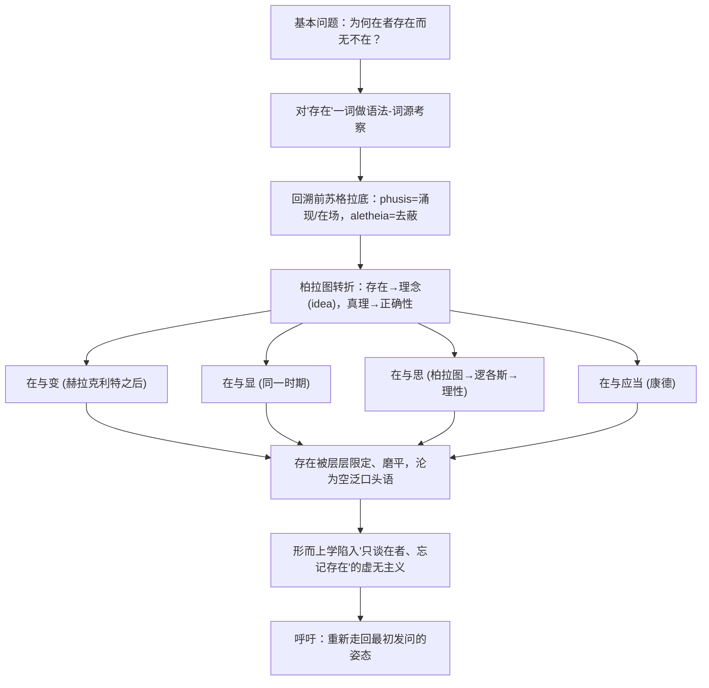

## 《形而上学导论》读书笔记 
  
### 作者  
digoal  
  
### 日期  
2026-06-22  
  
### 标签  
读书笔记 , 形而上学导论  
  
----  
  
## 背景 
  
  


---
书名: 《形而上学导论》  
作者: 马丁·海德格尔（译者：熊伟 / 王庆节）  
出版年份: 1996（商务印书馆，"汉译世界学术名著丛书·哲学"）  
原作名: Einführung in die Metaphysik（1935年讲稿，1953年成书出版）  
笔记日期: 2026-06-21  
豆瓣链接: https://book.douban.com/subject/1439792/  
豆瓣评分: 未能精确核实具体分数（该译本长期被收入多个"哲学必读"豆列，关注度很高，但评价两极分化明显）  
标签: [海德格尔, 存在论, 西方哲学, 现象学, 形而上学批判]  
---

  

> **一句话**：这是一场把"存在"这个我们最熟悉、却最说不清楚的词，重新逼回到陌生与惊异之中的发问练习。  
> **适合谁读**：对"为什么有东西存在而不是什么都没有"这类问题睡不着觉的人；想搞懂海德格尔从《存在与时间》到后期"转向"之间发生了什么的读者；能忍受语源学考据和不给出最终答案的读者。  
> **阅读难度**：⭐⭐⭐⭐☆（4/5）  
> **推荐指数**：⭐⭐⭐⭐☆（4/5，但附带一个绕不开的政治污点）  
  
---
  
## 一、时代坐标：这本书从哪里来？

这本书的身世比内容更耸动。它的底本是海德格尔1935年夏季学期在弗莱堡大学开的一门课，那时希特勒已经掌权两年。更要命的是，讲这门课的人，前一年刚刚卸任弗莱堡大学校长——而他在1933年就职校长时发表的《德国大学的自我主张》，是公开为纳粹背书的演讲，他本人也在1933年5月加入了纳粹党。1934年因为在大学治理方向上和纳粹官僚发生分歧，他辞去校长职务，但党籍一直保留。1935年这门课，正是他卸任校长后不久、试图把"存在问题"重新讲清楚的尝试。

讲稿一直没有出版，直到1953年才以《形而上学导论》之名印行。出版时，书里那句"今天到处兜售的、被冒充为'国家社会主义哲学'的东西，同这个运动（亦即同全球技术与现代人之相遇）的内在真理与伟大性毫无关系"引发了巨大争议——括号里的注解是1953年补加的，但"内在真理与伟大性"这个说法到底有没有篡改、海德格尔晚年是否在为自己"洗白"，至今仍是学界吵不完的官司。换句话说，这本书既是一部哲学经典，也是一份政治自辩状，两者纠缠在一起，没法干净地切开。

放在海德格尔自己的思想轨迹里看，这本书还有另一层坐标意义：他早期的《存在与时间》（1927）是从"此在"（Dasein，人这种特殊的存在者）出发去追问存在的意义；而《形而上学导论》标志着重心开始从"此在"转向"存在"本身——这通常被视为海德格尔从"前期"走向"后期"的一个枢轴点。书中尼采的分量明显加重，而《存在与时间》里那个核心的"时间"主题反倒被悄悄搁置了。

---

## 二、核心命题：作者在说什么？

### 命题一：哲学的起点不是答案，而是一个让人浑身不自在的问题

全书开篇就是那个被谢林、后来又被海德格尔在1929年的演讲《什么是形而上学？》里提出过的问题："究竟为什么在者存在，而无反倒不在？"这不是一道可以靠逻辑推导解出的题，而是一种"发问的姿态"：一旦你真的被这个问题击中，你会发现日常生活里那种"反正东西就摆在那儿"的笨实感突然松动了——存在不再是不言自明的背景，而变成了一桩值得惊讶的事情。海德格尔要做的，不是回答这个问题，而是让读者重新具备提出这个问题的能力。

### 命题二："存在"被悄悄等同于"在者"，这是西方哲学两千多年的健忘症

海德格尔认为，自柏拉图以降，西方人一直在谈论"存在着的东西"（在者），却早已遗忘了"存在"本身和"在者"并不是一回事——前者是后者得以显现的那个"打开"的状态，而不是另一个更高级的"东西"。他追溯古希腊语"phusis"（自然、涌现）一词，指出希腊人最初体验到的"存在"是一种"涌现出来并持留在场"的动态过程，就像橡树从橡子里展开自身、站立出来、持续在场——存在即"在场"本身，真理（aletheia）即"去蔽"、显现。但从柏拉图把存在固定为永恒不变的"理念"（idea）开始，存在被偷换成了某种静态的"什么"，真理也从"去蔽"退化为命题与对象的"符合"（正确性）。这一步偷换，海德格尔认为正是整部西方形而上学走偏的起点。

### 命题三："存在"被四重历史性的"限定"逐步缩窄、磨平了它本来的锐度

海德格尔梳理了西方思想史上四次给"存在"打折扣的关键分裂：
- **在与变**（Sein und Werden）：赫拉克利特时代，"存在"被从"生成变化"中切割出来，变成与流变对立的、静止的东西；
- **在与显**（Sein und Schein）：与此同时，"存在"也被从"表象/显现"中切割出来，仿佛存在是隐藏在表象背后的"真本体"；
- **在与思**（Sein und Denken）：到柏拉图，"存在"变成了"逻各斯"所说出的"理念"，逻各斯本是古希腊城邦中规范众声喧哗的"言说规则"，最后却演变成纯粹理性的判断；
- **在与应当**（Sein und Sollen）：到康德，"应当"作为高于"存在"的价值标准被树立起来——存在被降格为"实然"，必须由外在的"应然"来赋予意义。

四次切割叠加之后，"存在"这个词彻底变成了一个空泛、被用滥了的"老生常谈"，反而是这种"空泛"和"理所当然"，才让形而上学忘记了去追问它。

---

## 三、论证地图：作者怎么说服你的？

海德格尔的论证方式不是逻辑链条式的"前提—结论"，而更像一次层层剥皮的语文学考古：先从"存在"这个词的语法切入（它是动词还是名词？不定式背后藏着什么预设？），再深入它的词源（"是"在不同印欧语系里的演变轨迹），然后回到前柏拉图时期重新聆听赫拉克利特、巴门尼德留下的残篇，借此反衬出柏拉图以降的形而上学传统到底"丢"了什么。整本书几乎是一场"语言考古 + 历史还原"的双线作业。



这套论证里最具代表性的"案例"不是数据，而是词源——比如他从希腊语"phusis"硬是反推出一种与现代"物理学"截然不同的存在体验。这种做法的说服力，完全建立在你是否接受"词源能揭示思想本质"这一前提之上：对古典语文学家来说，这是严谨的考据；对分析哲学背景的读者来说，这很容易被批评为"词源谬误"（认定一个词最古老的含义就是它最"真"的含义，这在逻辑上并不必然成立）。

---

## 四、前提假设与边界：什么情况下这不成立？

- **假设一：存在一个"原初的"、未被污染的希腊存在体验，后来被历史性地"遗忘"了。** 这个叙事本身带有一种"黄金时代—堕落史"的浪漫主义结构。如果你不接受"历史是一个不断遗忘真理的过程"这个前提，整本书的批判力道会大打折扣。
- **假设二：词源学等于哲学论证。** 海德格尔大量依赖古希腊语词的"原意"来支撑论点，但语言学界普遍认为，一个词在使用中的语义演变，不能简单倒推出它"应该"承载的哲学真理。
- **假设三：1935年那句关于纳粹"内在真理与伟大性"的话，可以用"对抗全球技术"这一更宏大的哲学叙事来重新解释、洗清政治色彩。** 这是全书最脆弱也最危险的一环——把一句具体历史语境下、面对纳粹听众讲出的话，事后用哲学话语包装成"反技术批判"，这种"事后重新定调"本身就构成了对历史责任的回避。多位研究者（包括对海德格尔持温和态度的学者）都指出，1953年出版时对原讲稿做过的修改本身就证据确凿，足以让这种自我辩护站不住脚。

这本书的适用边界很清楚：它对"重新激活存在之问"这件事极具启发性，但它不是一部可以脱离作者政治污点单独评价的"纯哲学文本"——读这本书，绕不开同时读他的历史。

---

## 五、思想谱系：这本书在哪个传统里？

海德格尔的根脉扎在现象学（胡塞尔的学生）与前苏格拉底哲学（赫拉克利特、巴门尼德）之间，同时与尼采展开了一场贯穿全书的隐性对话——尼采对"虚无主义"的诊断，被海德格尔吸收并改造成了自己对"存在被遗忘"的叙述框架。往前看，这本书延续了《存在与时间》提出的存在论问题，但把发问的重心从"此在"挪向了"存在"本身，为后期那些关于语言、艺术、技术的写作（如《林中路》《技术的追问》）铺好了路。往后看，这本书对"逻各斯中心主义"、对"在场形而上学"的批判，直接启发了德里达的解构主义——德里达后来对"在场"概念的拆解，几乎可以视为对海德格尔这部讲稿的一次再批判。

```
赫拉克利特/巴门尼德（前苏格拉底）
        │  （海德格尔试图"回到"的源头）
        ▼
柏拉图/亚里士多德 ──→ 整个西方形而上学传统（被批判的对象）
        │
        ▼
尼采（虚无主义诊断） ──→ 海德格尔（存在之被遗忘）
        │
        ├──→ 后期海德格尔：语言、艺术、技术批判
        └──→ 德里达：解构主义对"在场"的再批判
```

---

## 六、我学到了什么？

第一个收获，是重新理解了"提问"本身的分量。我们习惯把哲学问题当成需要被"解决"的难题，海德格尔提醒我，有些问题的价值恰恰在于让你"卡住"——那种突然意识到"东西怎么会存在"的眩晕感，比任何答案都更接近哲学的起点。这种"让自己重新陌生化"的能力，我觉得在任何领域的深度思考里都稀缺。

第二个收获，是看清了语言对思维的塑形力量。海德格尔反复强调，西方人天生用一套带有"是/存在"动词的语言去思考，这套语法本身就预先决定了我们能问出什么样的问题——这对我是一个提醒：很多我以为"理所当然"的概念框架，其实是语言和历史留给我的隐形预设，值得时常拿出来检查。

第三个收获，也是最沉重的一个：这本书逼着我直面"伟大的思想"和"恶劣的政治选择"可以共存于同一个人身上，而且这种共存不是巧合，是有内在关联的——海德格尔对"民族""命运""决断"这些词的哲学化使用，和他对纳粹的"哲学化辩护"用的是同一套修辞资源。这让我对"只看思想、不看人"的阅读方式更加警惕。

---

## 七、举一反三：这个框架还能用在哪？

海德格尔这种"回到词的源头，检查我们以为理所当然的概念到底预设了什么"的方法论，其实是一种通用的"概念考古术"，可以迁移到很多场景：

1. **产品/商业概念的祛魅**：当一个行业里所有人都在用"颠覆""赋能""生态"这类被用滥的词时，去追问这个词最初指的是什么具体的事，往往能戳破集体性的话语泡沫。
2. **跨文化沟通**：海德格尔提到中文里没有西方那个"to be"动词，所以"存在"对中国人而言首先是一个语法/语言问题——这提醒我们，很多"放之四海而皆准"的概念框架，其实深深嵌在某一种语言的语法结构里，搬到另一种语言时需要格外小心。
3. **审视自己专业领域里的"基本问题"**：每个学科都有一套"理所当然"到没人再追问的基础设定（比如经济学里的"理性人"），用海德格尔的方式去问"这个设定最初是怎么来的、它遗忘了什么"，常常能打开新的思考空间。

---

## 八、批判与反思

我不同意的地方主要有两点。一是这本书的论证方式高度依赖一种"我说了算"的语文学直觉——海德格尔常常先断言某个希腊词的"本真含义"，再据此推导出整部哲学史的走偏，但这种倒推本身缺乏可验证的方法论约束，读起来更像是一种诗性的断言，而不是严谨的论证。二是前面提到的政治自辩问题：把1935年那句具体的、面向纳粹听众的政治表态，包装进一套关于"技术与现代性"的宏大哲学叙事里，这种"提升维度"式的辩护，本质上回避了具体的历史责任，我认为这是这本书最大的伦理瑕疵。

时代已经变了的地方：海德格尔笃信存在着一种"西方的命运"，一种民族性的精神决断时刻——这种带有强烈民族主义和总体性历史观色彩的思维方式，在经历了二十世纪的灾难之后，今天的读者很难再不带警惕地接受。

这本书的局限性，归根结底在于它的"诗性"既是魅力所在，也是危险所在：它拒绝清晰的论证义务，用晦涩、近乎神谕式的语言去谈论"存在"，这给了它启发性，但也给了误读和滥用（包括海德格尔自己的政治滥用）以巨大的空间。

---

## 九、金句与记忆点

1. **"究竟为什么在者存在，而无反倒不在？"** —— 全书的发问起点，提醒我们存在本身可以是一件值得惊异的事，而不是默认的背景。
2. **"存在"被等同于"在者"，是哲学最大的健忘症** —— 海德格尔批评西方形而上学始终在谈论"什么东西存在"，却忘了去问"存在"这件事本身意味着什么。
3. **phusis（涌现）作为存在的源初经验** —— 一棵橡树从种子里展开、站立、持续在场，这是海德格尔理解"存在"最朴素也最生动的范本。
4. **"在与变""在与显""在与思""在与应当"四重历史性限定** —— 一份可以拿来检验任何"被用滥的概念"是如何一步步被切割磨平的诊断清单。
5. **逻各斯：从"讯问"到"理性的说出"** —— 一个词如何从苏格拉底之前那种开放的"发问/言说"，逐渐被收编为后来"合乎理性范畴的判断"，本身就是一部微缩的西方理性史。
6. **"把存在忘得精光，只和在者打交道——这是虚无主义"** —— 海德格尔对现代性危机的诊断，也是他理解尼采"虚无主义"的关键钥匙。
7. **"内在真理与伟大性"的括号注解** —— 一句被反复争论的话，提醒读者：哲学文本从来不是脱离历史语境的纯粹真理容器。

---

## 十、延伸阅读

1. **《存在与时间》（海德格尔）**——这本书的"前传"，从"此在"出发追问存在意义，是理解《形而上学导论》转折点位置的必读背景。
2. **《林中路》（海德格尔）**——后期海德格尔关于艺术、语言、真理的论文集，可以看到本书埋下的种子如何长成。
3. **格雷戈里·弗里德 / 理查德·波特英译本导言（Introduction to Metaphysics, Yale University Press 新译本）**——目前公认更贴近德文原意、且附有详尽政治语境注释的英译本，弥补中译本在历史背景说明上的不足。
4. **理查德·沃林《海德格尔争论》（The Heidegger Controversy）**——一部围绕海德格尔与纳粹关系的核心文献合集，适合想搞清楚"内在真理与伟大性"争议来龙去脉的读者。
5. **维克多·法里亚斯《海德格尔与纳粹主义》**——立场更激进、批判性更强的传记式研究，可以与海德格尔本人及其支持者的辩护形成对照阅读。

---

*笔记写于 2026-06-21 | 基于公开资料与深度思考整理*
  
  
#### [PostgreSQL 解决方案集合](../201706/20170601_02.md "40cff096e9ed7122c512b35d8561d9c8")
  
  
#### [德哥 / digoal's Github - 公益是一辈子的事.](https://github.com/digoal/blog/blob/master/README.md "22709685feb7cab07d30f30387f0a9ae")
  
  
#### [About 德哥](https://github.com/digoal/blog/blob/master/me/readme.md "a37735981e7704886ffd590565582dd0")
  
  

  
