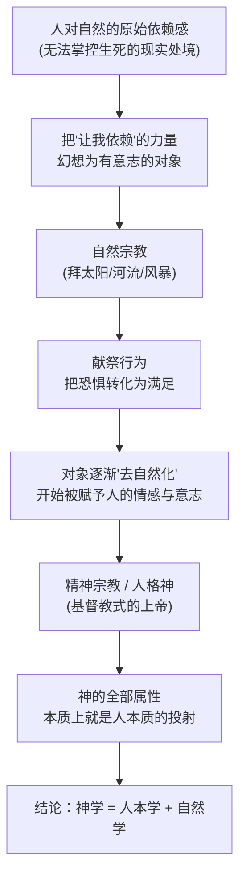

## 《宗教的本质》读书笔记 
  
### 作者  
digoal  
  
### 日期  
2026-06-22  
  
### 标签  
读书笔记 , 宗教的本质  
  
----  
  
## 背景 
  
  


---
书名: 《宗教的本质》  
作者: [德] 路德维希·费尔巴哈  
译者: 王太庆  
出版社: 商务印书馆  
出版年份: 2010-10-1  
丛书: 汉译世界学术名著丛书·哲学  
页数: 75  
笔记日期: 2026-06-22  
ISBN: 9787100068925  
---
  
  

> **一句话**：上帝不是别的，就是人把自己对自然的依赖感，连同自己的全部本质，一起投射出去之后,反过来跪拜的那个影子。  
> **适合谁读**：对"宗教到底是怎么来的"这个问题感到好奇的人；想理解马克思"宗教是人民的鸦片"这句话从哪来的人；任何怀疑论者、人本主义者，或者只是单纯想看一位19世纪德国哲学家如何把上帝"还原"成人的读者。  
> **阅读难度**：⭐⭐⭐☆☆（薄，但论证密度很高，需要一点耐心）  
> **推荐指数**：⭐⭐⭐⭐☆  
  
---

## 一、时代坐标：这本书从哪里来？

1841年，费尔巴哈出版《基督教的本质》，一书引爆德国思想界——恩格斯后来回忆说，"这部书的解放作用，只有亲身体会过的人才能想象到。那时大家都很兴奋，我们一时都成为费尔巴哈派了。"这本书的唯物主义和无神论思想，以及对宗教和唯心主义的批判方法，曾经对马克思产生了极大的影响。但《基督教的本质》也招来大量批评，神学家和正统信徒指责费尔巴哈把宗教简化成了一种"心理幻觉"，根本没说清楚宗教最初到底从哪儿冒出来的。

《宗教的本质》（1845）正是为了回应这些批评而写的"补课之作"。费尔巴哈在书中除了继续强调宗教是人的本质的异化这一观点，还进一步提出宗教是自然界异化的结果——他分别论述了宗教的基础、自然宗教、自然宗教向精神宗教的过渡，以及一般宗教的本质，明确提出"神学就是人本学和自然学"的论点。

换句话说：上一本书讲"上帝是人的镜子"，这一本要往前再追一步——在人造出"人格化的神"之前，宗教最早的胚芽究竟是什么？费尔巴哈的答案是：**自然**。人类最早跪拜的不是耶和华，而是太阳、河流、风暴——是那个让你活、也能让你死的、巨大而陌生的自然界。

这本书写于德国古典哲学的尾声、马克思主义即将破土的前夜。路德维希·费尔巴哈（1804－1872）被视为德国古典哲学和马克思主义哲学之间的桥梁，其哲学深刻影响了包括马克思、恩格斯、瓦格纳和尼采等几代思想家，他哲学中的唯物主义更被看作是马克思唯物主义的理论来源。读这本薄薄的小书，某种意义上就是站在思想史的一个枢纽点上，看着"神"如何一步步被拉下天空、摔回人间。

---

## 二、核心命题：作者在说什么？

### 观点一：宗教的最初根源不是"信仰"，而是"依赖感"

费尔巴哈一上来就拒绝了一个常见误解：以为宗教是人天生自带的某种神圣本能。他说，如果"宗教"指的是"相信真有一个人格神"，那这话是错的；但如果说宗教不过是依赖感——是人若没有一个异于自己的东西可以依靠，就不能存在、也不可能存在的那种感觉——这句话就是对的，这种关系就像光对眼睛、空气对肺、食物对胃那样密切。

也就是说，宗教感的起点不是"我相信神存在"这样一个判断，而是一种更原始的生理-心理体验：**我活着，但我活着的条件根本不在我自己手里**。

### 观点二：这种依赖的对象，最初就是"自然"，不是别的

那么人依赖的到底是什么？费尔巴哈给出一个朴素却极有力量的答案：那个不依靠人、不具备人的特征的实体，真正说来不是别的，就是自然；人的依赖感是宗教的本质，而这种依赖感所指向、人也确实仰赖着的对象，就是自然界本身。

太阳升起、雨水降落、季节轮回——这些不由人决定却决定着人死活的力量，构成了最古老的"神性"。费尔巴哈由此提出一个颠覆性的排序：**自然宗教先于人格神宗教**。基督教里那位有意志、有情感、会发怒也会怜悯的上帝，是后来才被"加工"出来的，最早的"神"只是赤裸裸的自然力本身。

### 观点三：献祭，是依赖感转化为满足感的关键机制

如果只有依赖和恐惧，宗教不会持续——人还需要某种"安心"的出口。费尔巴哈分析"献祭"这个行为时指出，人之所以要献祭，是因为这个动作完成了一次心理转化：从惊恐到满足、从需求到享受的转化——人为了安慰自己的良心，也为了安慰那个在他想象中被自己劫掠过的对象，便裁减一下自己的享受，把劫夺来的东西送还一部分回去。献祭表面上是"还债"，实质上是人在依赖感和恐惧感之中，主动制造出一份"心安"。

而最终，费尔巴哈点出了整本书最关键的一句话：自然的神性固然是一切宗教的基础，但人的神性才是宗教的最终目的——宗教的真正去处，是人的自我完善。自然宗教只是起点，宗教真正要走向的，是人崇拜被自己美化、放大、神圣化了的"人性"。

---

## 三、论证地图：作者怎么说服你的？



这条逻辑链最值得注意的是 D→E 这一步：从"怕自然"到"信一个有人格的神"，中间的桥梁是**幻想**。费尔巴哈反复强调，神的种种"限制"——例如全知却仍有所"不知"、全能却仍要"立约"——这些限制只是想象或幻想上的限制，并非真正的限制，因为它们恰恰是以人的本质为根据、建立在人这种"事物的本性"之上的。换句话说：神身上每一处看似神秘的矛盾，拆开来看都是人自己性格的某个侧面在"投影"。

费尔巴哈论证方式的特点是**几乎不依赖文献考据，而依赖语言分析和心理还原**——他常常从一个具体的宗教行为（祈祷、献祭、节日）出发，逆推出它背后必须具备的心理动机。这种方法直观、犀利，但也带来一个问题：他描述的"原始人心理"在多大程度上是史实，多大程度上是他自己时代理性主义的想象重构？这是后面要谈的局限。

---

## 四、前提假设与边界：什么情况下这不成立？

费尔巴哈的论证，至少依赖三个隐含假设：

**假设一：人的"依赖感"在所有文化里都指向同一种心理机制。** 费尔巴哈把不同民族五花八门的自然崇拜，统一归结为同一种"依赖—恐惧—满足"的心理结构。但人类学后来的研究显示，不同社会的宗教实践动机要复杂得多，远不止"怕自然"这一条线——亲属关系、权力结构、集体认同同样是关键变量。

**假设二："自然宗教"必然先于"人格神宗教"，是一种单向的历史进程。** 这其实是19世纪典型的进化论式历史观——把宗教史想象成一条从低级到高级、从蒙昧到文明的直线。今天的宗教学和考古学已经不太接受这种简单的单线进化叙事，很多复杂宗教形式(包括泛灵论、祖先崇拜)与自然崇拜是并存而非递进的。

**假设三：把"神的属性"还原为"人的属性的投射"，逻辑上是充分的。** 费尔巴哈的方法本质上是一种"投射论"，即先假定神身上的一切特征都"必定"来自人，然后逐一对应解释。但这个方法本身带有一定的循环论证色彩：它的解释力来自前提，而不是来自独立证据。一个虔诚的信徒完全可以反过来说——正因为人是按"神的形象"造的，所以人才会在自己身上看到那些属性的影子。投射论无法单凭自身就排除这种"反向"的可能性。

**适用边界**：费尔巴哈这套理论，作为一种**宗教心理学的起源假说**依然极具启发性、也依然被后来的精神分析(弗洛伊德)、人文主义心理学吸收；但作为一种**宗教史的实证理论**，它的解释力是有限的，更适合当作一种"思想实验"而非"历史定论"来读。

---

## 五、思想谱系：这本书在哪个传统里？

```
斯宾诺莎(泛神论：神即自然)
        ↓
黑格尔(绝对精神的自我异化与外化)
        ↓
费尔巴哈《基督教的本质》(1841)
   ——上帝是人的本质的异化
        ↓
费尔巴哈《宗教的本质》(1845)
   ——补上"自然异化"这一环
        ↓
   ┌────┴────┐
   ↓         ↓
马克思/恩格斯      尼采/弗洛伊德
(异化理论→        (宗教的心理学
 劳动异化、         起源、投射机制)
 阶级批判)
```

很明显，费尔巴哈受到斯宾诺莎泛神论的启发——把"神"还原为"自然"，正是斯宾诺莎"神即自然"命题的一个唯物主义、人本学版本。而在他自己的哲学体系内部，费尔巴哈是黑格尔之后第一个在哲学人本学意义上继续使用"异化"概念的人——只不过在他这里，异化不再是黑格尔用来构筑体系的逻辑工具，而变成了宗教批判的武器：他不再讲抽象自我意识的异化，而讲"人的本质"的异化。

这条思路直接影响了青年马克思。在《黑格尔法哲学批判》中，马克思仍受费尔巴哈影响，把市民社会、国家等社会形式看作"人的本质的实现"或"客观化"，把建立在私有制基础上的政治国家视为人的本质的异化；而在随后的《巴黎手稿》里，马克思首次系统提出了"异化劳动"思想——异化理论的隐性前提，正是预设一个永恒不变的人之本性，当现实与之相悖时，便构成异化状态，异化的扬弃也就是人向本来面目的复归。可以说，没有费尔巴哈把"异化"从黑格尔的精神领域拉回到"人的本质"这个层面，马克思后来把异化进一步拉回到"劳动"和"生产关系"这个层面，这条思想链条就接不上。

而往另一个方向看，费尔巴哈这种"把神还原成人的投射"的方法，也为后来弗洛伊德式的宗教心理学（把宗教信仰解释为幼年依赖父亲的心理延伸）打开了大门——豆瓣一位读者就提到，在《宗教的本质》中能看到费尔巴哈从精神病理学的角度分析宗教，这种视角在将近一个世纪之后的弗洛姆的社会心理学理论中，依然能看到对宗教现象的回响。

---

## 六、我学到了什么？

**第一，"依赖"比"信仰"更原始。** 我过去理解宗教，习惯性地从"信不信"切入——信徒和无神论者的区分点在于"是否相信神存在"。但费尔巴哈提醒我，在"信不信"这个理性判断之前，还有一层更底层的体验：人活在自己不能完全掌控的条件之中，这种处境本身就会自动生产出某种"依赖—敬畏—祈求"的心理结构，不管你最终往哪个方向去解释它。这让我重新理解了为什么"无神论者"也常常会有近似宗教感的体验——面对大海、面对星空、面对一场无法挽回的疾病时的那种敬畏与无力，其实和古人面对暴风雨时的心理机制，本质上是同一回事。

**第二，"献祭"这个动作背后藏着一种极朴素的心理智慧。** 费尔巴哈对献祭的分析让我意外——他没有简单地说"献祭是迷信"，而是指出它解决了一个真实的心理问题：当你从自然(或他人)那里"拿"了东西却感到不安时，"还回去一点"能让你把惊恐重新调成满足。这其实是一种古老的"心理对冲"机制，今天我们说的"还人情"、"做点善事抵消负罪感"，本质上跟它是一脉相承的。

**第三，"投射论"是一把双刃剑，用好了是洞见，用过头了是教条。** 费尔巴哈把神的一切属性都解释成人的属性的投射，第一次读到时会有一种"原来如此"的解谜快感。但细想就会发现，这套方法论本身预设了答案——它先假定"神=人的投射"，再去对号入座地解释每一个神学概念。这提醒我，任何一种"还原论"式的解释(把A还原成B)在带来洞察力的同时，也很容易变成一种万能钳子，把所有问题都拧成同一种形状。

---

## 七、举一反三：这个框架还能用在哪？

费尔巴哈这套"从依赖感出发，追问真正被依赖的对象是什么"的分析方法，其实是一种相当通用的**还原分析框架**：

**场景一：分析职场中的"权威崇拜"。** 我们对某些上级、专家、KOL的盲目信服，往往可以用类似的方法拆解——先问"我真正依赖的是什么"，常常会发现，我们崇拜的不是那个人本身，而是他身上代表的某种我们自己缺乏、又渴望拥有的能力或资源(信息、资本、话语权)。看清这一点之后，"崇拜"往往会变成更冷静的"借力"。

**场景二：理解品牌崇拜与消费主义。** 很多奢侈品、明星IP之所以被赋予近乎"神圣"的光环，本质上也是一种现代版的"投射"——消费者把自己渴望的身份、阶层、自我形象，投射到一个符号上，然后反过来对这个符号产生敬畏和依赖。理解这个机制，能帮助我们更清醒地看待自己的购买冲动从何而来。

**场景三：自我反思中的"完美主义"陷阱。** 费尔巴哈说，"自然的神性是宗教的基础，人的神性才是宗教的目的"——这句话稍微挪用一下：很多人对"理想中的自己"的苛求，某种程度上也是把自己内心真实拥有、却被压抑或否认的某些特质，投射成了一个遥不可及的"完美他者"，然后反过来用这个标准折磨自己。看穿投射的机制，是放过自己的第一步。

---

## 八、批判与反思

**我不完全同意的地方：把宗教史简化为一条"自然崇拜→人格神崇拜"的单行线。** 这是19世纪理性主义/进化论思维方式的典型产物，今天看来过于线性。人类宗教实践的多样性——萨满教、祖先崇拜、图腾崇拜——远不能被塞进一条直线的进化序列里。

**时代已经变了的地方：费尔巴哈的"唯物主义"是不彻底的，缺少社会实践的维度。** 后来的批评者(包括马克思自己在《关于费尔巴哈的提纲》中)指出了这一点：费尔巴哈割裂了人与人的关系和人与自然的关系——在他看来，人与自然的关系，跟动物与自然的关系在实践层面并无本质区别；一旦离开了现实的实践关系，人与人之间的关系在他那里就只剩下抽象的精神内容，因此他只是一个"半截子的唯物主义者"，他的异化理论也只能停留在对宗教的批判之中,对现实的生活世界缺乏理论穿透力。也就是说，费尔巴哈解构了"神"，却没有进一步解构"人"背后的社会、经济关系——这正是马克思接下来要做的事。

**这本书的局限性：篇幅极薄，论证密度很高，但缺少跨文化的实证支撑。** 全书75页，更像是一篇高度浓缩的哲学论证，而不是一部严谨的宗教学/人类学研究。费尔巴哈对"原始人心理"的描述，更多是哲学式的推演，而非田野调查或文献考据的产物——读者需要清楚地意识到，这是一部**哲学论证之作**，不是历史或人类学的实证著作。

---

## 九、金句与记忆点

1. **"自然的神性诚然是宗教的、并且是一切宗教的基础，但是人的神性则是宗教的最终目的。"**
   → 全书最关键的一句，点明了费尔巴哈整个理论的方向：宗教从崇拜自然出发,最终走向崇拜被神圣化的人性本身。

2. **"宗教的对象只是一个心情的实体，想象的实体，幻想的实体。"** 
   → 这是对宗教对象本体地位最直接的否定：神不是独立存在的客体，而是人的心理活动的产物。

3. **"神学之秘密是人本学，属神的本质之秘密，就是属人的本质。"** 
   → 整本书可以浓缩成这一句，也是费尔巴哈最广为人知的论断。

4. **"对象所加于他的威力，其实就是他自己的本质的威力。"** 
   → 解释了为什么人会对自己创造出的"神"感到敬畏——因为那个威力本来就是人自己的力量,只是被异化、外化成了一个独立的对象。

5. **"人为了安慰自己的良心……于是裁减一下自己的享受,把他所盗窃来的财物送还一点给对象。"**（关于献祭）
   → 把"献祭"这个看似神圣的仪式,还原成了一次极朴素的心理"还债"行为。

6. **"宗教把人的力量、属性、本质规定从人里面抽出来,将它们神化为独立的存在者。"** 
   → 这是"异化"概念在宗教批判中最直白的表述。

---

## 十、延伸阅读

1. **《基督教的本质》(费尔巴哈)** —— 本书的"前作"，更系统地展开了"上帝是人的本质的异化"这一核心论点，建议与本书对照读，理解费尔巴哈思想的完整闭环。

2. **《1844年经济学哲学手稿》(马克思)** —— 看费尔巴哈的"人的本质异化"理论，如何被马克思进一步拉到"劳动异化"和阶级关系的层面，是理解从费尔巴哈到马克思这条思想链条的关键文本。

3. **《路德维希·费尔巴哈和德国古典哲学的终结》(恩格斯)** —— 恩格斯对费尔巴哈哲学最权威的总结与批判，能帮你看清费尔巴哈在唯物主义和唯心主义之间那个"半截子"的尴尬位置。

4. **《一种幻觉的未来》(弗洛伊德)** —— 把费尔巴哈式的"投射论"进一步发展为精神分析式的宗教起源理论，读完这本书会更清楚地看到费尔巴哈思想的回响。

5. **《宗教生活的基本形式》(涂尔干)** —— 从社会学(而非心理学)的角度重新解释宗教起源，提供一个和费尔巴哈完全不同、但同样经典的"还原论"视角，适合做对照阅读。

---

*笔记写于 2026-06-22 | 基于公开资料与深度思考整理*
  
  
#### [PostgreSQL 解决方案集合](../201706/20170601_02.md "40cff096e9ed7122c512b35d8561d9c8")
  
  
#### [德哥 / digoal's Github - 公益是一辈子的事.](https://github.com/digoal/blog/blob/master/README.md "22709685feb7cab07d30f30387f0a9ae")
  
  
#### [About 德哥](https://github.com/digoal/blog/blob/master/me/readme.md "a37735981e7704886ffd590565582dd0")
  
  

  
