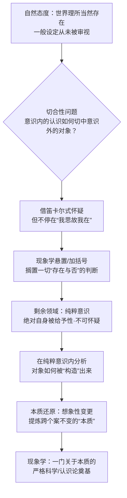

## 《现象学的观念》读书笔记 
  
### 作者  
digoal  
  
### 日期  
2026-06-22  
  
### 标签  
读书笔记 , 现象学的观念  
  
----  
  
## 背景 
  
  

---
书名: 《现象学的观念》  
作者: [德] 埃德蒙德·胡塞尔  
译者: 倪梁康  
出版社: 商务印书馆  
出版年份: 2018-12  
丛书: 汉译世界学术名著丛书·哲学  
豆瓣链接: https://book.douban.com/subject/30279070/  
豆瓣评分: 9.4（242人评价）  
标签: [现象学, 胡塞尔, 认识论, 西方哲学, 德国哲学]  
笔记日期: 2026-06-22  
---

  

> **一句话**：一本只有138页的小书，却记录了胡塞尔一生思想的"第二次转折"——他用五次课的时间，把"我怎么能确定我认识到的就是对的"这个老问题，从心理学的泥潭里拽出来，亲手搭出一座通往"纯粹意识"的桥。  
> **适合谁读**：想真正搞懂现象学"是怎么开始的"，又不想一上来就啃《逻辑研究》或《观念I》大部头的人；对"我们如何确知自己认识对了"这个问题本身感兴趣的人。  
> **阅读难度**：⭐⭐⭐⭐☆（术语密度高，建议搭配导读）  
> **推荐指数**：⭐⭐⭐⭐☆  
  
---

## 一、时代坐标：这本书从哪里来？

1907年的胡塞尔，处境有点尴尬。他在哥廷根大学已经任教六年，学生很喜欢他，"哥廷根现象学小组"也已初步聚集，但他在同事中并不受欢迎，教育部一度建议提拔他做正式教授，校方却把这个提议自己搁置了——他在那里一共做了十四年"私讲师"。比职位更折磨他的，是思想上的焦虑：1906年他在私人笔记里写道，自己必须为"理性批判"这个任务给出一个交代，否则不能算真正的哲学家。

往前看，是更长的一段积怨。胡塞尔最早是数学博士出身，1891年写了一本想用心理学给算术奠基的《算术哲学》，被弗雷格写书评狠狠批评了一通——说他把客观的数学内容"心理学化"了。这一棍子打得很重，胡塞尔此后用十年时间转向反心理主义，写出了《逻辑研究》（1900–1901），第一卷专门清算"心理主义"，认为把逻辑规律混同于心理规律，最终只会滑向相对主义。

但《逻辑研究》解决了"逻辑不是心理学"的问题，却没有正面回答一个更根本的问题：意识里发生的认识行为，怎么能够确知自己抓住了在意识之外的那个对象？这就是1907年这五次哥廷根讲座要解决的事——它们后来被认为是胡塞尔"第一次系统阐明现象学基本思想"的文本，也是他从早期"描述心理学"真正迈向"超越论现象学"的转折点。

<svg viewBox="0 0 700 200" xmlns="http://www.w3.org/2000/svg" font-family="sans-serif">
  <line x1="40" y1="100" x2="660" y2="100" stroke="#333" stroke-width="2"/>
  <!-- 1891 -->
  <circle cx="80" cy="100" r="5" fill="#333"/>
  <text x="80" y="80" font-size="12" text-anchor="middle">1891</text>
  <text x="80" y="125" font-size="11" text-anchor="middle">《算术哲学》</text>
  <text x="80" y="140" font-size="11" text-anchor="middle">遭弗雷格批评</text>
  <!-- 1900 -->
  <circle cx="230" cy="100" r="5" fill="#333"/>
  <text x="230" y="80" font-size="12" text-anchor="middle">1900–01</text>
  <text x="230" y="125" font-size="11" text-anchor="middle">《逻辑研究》</text>
  <text x="230" y="140" font-size="11" text-anchor="middle">清算心理主义</text>
  <!-- 1906 -->
  <circle cx="400" cy="100" r="5" fill="#333"/>
  <text x="400" y="80" font-size="12" text-anchor="middle">1906</text>
  <text x="400" y="125" font-size="11" text-anchor="middle">私人笔记</text>
  <text x="400" y="140" font-size="11" text-anchor="middle">"理性批判"的焦虑</text>
  <!-- 1907 -->
  <circle cx="560" cy="100" r="7" fill="#b03a2e"/>
  <text x="560" y="80" font-size="13" text-anchor="middle" font-weight="bold">1907</text>
  <text x="560" y="125" font-size="11" text-anchor="middle" font-weight="bold">五次哥廷根讲座</text>
  <text x="560" y="140" font-size="11" text-anchor="middle">《现象学的观念》</text>
  <!-- 1913 -->
  <circle cx="630" cy="100" r="5" fill="#333"/>
  <text x="630" y="80" font-size="12" text-anchor="middle">1913</text>
  <text x="630" y="125" font-size="11" text-anchor="middle">《观念I》</text>
  <text x="630" y="140" font-size="11" text-anchor="middle">体系化</text>
</svg>

---

## 二、核心命题：胡塞尔到底在说什么？

### 命题一：认识论的死结——"切合性问题"
认识行为发生在我的意识里，是一桩"心理事实"；但我所认识的对象（比如一道数学算式所表达的真理）却不内在于我的心灵。一个在心里、一个在心外，二者凭什么能够"切合"？胡塞尔认为，这才是认识论真正的起点问题，而不是先去问"世界是否存在"这种形而上学问题。传统哲学要么绕开它（自然科学直接假定能认识），要么用怀疑论否定它（休谟式的不可知）。胡塞尔的策略是：先把这个问题"悬置"起来，回到能够自身确证的领域重新出发。

### 命题二：解法——现象学的悬置（加括号）
胡塞尔说，日常生活和自然科学都活在一种"自然态度"里：默认外部世界、他人、过去未来都"理所当然地在那里"，这是一种从未被审视过的"一般设定"。他借用了笛卡尔式怀疑的形式，但走得更彻底：不是去怀疑这个世界是否真的存在，而是干脆把"它存在与否"这个判断整个搁置、加上括号，既不肯定也不否定。剩下来的，是那个无论世界存在与否都依然成立的领域——纯粹意识本身，以及意识体验在被体验当下"绝对自身被给予"的确定性。这就是现象学还原。

### 命题三：从个别到普遍——本质直观
单靠悬置只能拿到一个个孤零零的意识体验，还不能构成"科学"。胡塞尔于是提出第二重还原：对一个具体的意识体验做"想象性变更"——设想它在各种可能的变体下，哪些东西始终不变。这个不变的核心，就是这类体验的"本质"。本质不是靠归纳统计很多案例得出的经验规律，而是靠直观直接"看"到的——这就是后来现象学最有名也最容易被误解的方法：本质直观。

---

## 三、论证地图：胡塞尔怎么把你说服的？

胡塞尔在这五讲里几乎没有引用什么外部数据或案例，他用的是一个反复出现的"思想实验"：拿一段数学演算举例——演算的过程是我心里发生的具体心理活动，但"2+2=4"这个真理本身却不会因为我不去想它就不存在。这个例子很巧妙，因为它直接把"心理事实"和"观念对象"的区别摆在你面前，逼着你承认确实存在两种完全不同性质的东西。但这个论证方式也有代价：它高度依赖直观说服力，缺乏经验数据的检验，读者只能靠"自己想一遍"来判断胡塞尔说得对不对——这也是为什么现象学常被批评为"自我封闭"的方法。

---

## 四、前提假设与边界：什么情况下这套说法会失效？

**假设一：意识体验在被体验当下，其存在是绝对不可怀疑的。**
胡塞尔继承了笛卡尔"我思"的确定性，但想把它扩展成整套方法论的地基。这个假设今天受到的最大挑战，来自对"内省可靠性"本身的怀疑——认知科学的研究反复显示，人对自己心理状态的报告常常并不准确。如果"自身被给予性"本身就不那么干净，整座大厦的基石就会松动。

**假设二：存在一种"无前提性"的纯粹描述，可以剥离一切历史、文化、语言的预设。**
这正是海德格尔后来最锋利的质疑：人从来不是悬空地"看"世界，而是早已被抛入一个有历史、有他人、有上手工具的"世界之中"（在世）。胡塞尔想悬置一切存在设定，但悬置这件事本身，也是用某种语言、某种历史处境中的概念完成的——这个"纯粹"也许从未真正纯粹过。

**假设三：本质可以脱离经验归纳，被直观直接把握，并具有普遍必然性。**
这个假设让胡塞尔的现象学带上了一点柏拉图主义的影子——本质仿佛是独立悬置在某个观念领域里、等着被"看见"的对象。胡塞尔自己后来也承认，这种"还原"的表述方式容易被误读为"剔除超越、剩下内在"的简单二分。如果你不接受存在这样一个独立的"本质领域"，本质直观这套方法的说服力就会大打折扣。

**适用边界**：这本书提供的是一种**方法论态度**——遇到争议先悬置存在判断、回到直接经验描述——这个态度在哲学反思、批判性思考里依然很有效；但如果指望靠"纯粹意识"独立地为整个科学和世界重新奠基，这个野心本身在今天的哲学界已经很少有人会原样接受。

---

## 五、思想谱系：这本书站在哪条河流上？

胡塞尔的现象学不是凌空出现的。往上游看，布伦塔诺的"意向性"理论（意识总是"关于"某个对象的）是直接的思想源头；弗雷格对《算术哲学》的批评，则是促使他彻底转向反心理主义的外部刺激；笛卡尔的怀疑方法，给了他悬置的形式；康德对"认识何以可能"的先验追问，给了他问题意识——但他拒绝康德式的形式先验框架，坚持要靠"直观"而不是"概念建构"去把握这些先天结构。

往同一时代看，新康德主义的马堡学派、巴登学派也在做"认识论奠基"这件事，但路数偏向逻辑构造；胡塞尔的现象学路数偏向直观描述，二者在20世纪初哲学界形成了一种隐性的对话和竞争。

往下游看，这本书埋下的种子在他身后开出了完全不同方向的花：海德格尔从这里出发，却把重心从"意识"挪到了"存在"和"此在"，写出《存在与时间》；萨特、梅洛-庞蒂把现象学方法用到了自由、身体和知觉上，催生了法国存在主义；社会学家舒茨把"生活世界"概念引入社会理论。可以说，胡塞尔在这五讲里画的那条起跑线，后来被几代最重要的欧陆哲学家在完全不同的方向上反复改写。

---

## 六、我学到了什么？

**收获一："悬置"不是怀疑，而是一种思维的"暂停键"。** 胡塞尔教我的不是怀疑论，而是区分"它存在不存在"和"它在我的经验里如何显现"这两个完全不同的问题。遇到一个争议性的判断时，先别急着站队判断真假，而是先把这个判断本身搁起来，专注去描述"这件事到底是怎么呈现在我（或对方）的经验里的"——这本身就是一种很值得练习的思维姿态。

**收获二："面向事情本身"提醒我，大多数争论的根源不是论证不严谨，而是预设没被审查。** 我们几乎从不审视自己一上来就默认的那些"自然态度"——比如默认"客观世界就在那里"。胡塞尔逼着读者去问：这个默认本身，凭什么成立？这种追问的姿态，对日常思考里那些"想当然"的前提，是一种很好的清场动作。

**收获三：本质直观让我意识到，"提炼共性"未必只能靠统计归纳。** 也可以靠对一个具体案例做"如果去掉这个特征它还是不是它"的想象性追问，去逼近一个东西真正不可或缺的核心。这其实跟产品设计、创意提炼里"找本质特征"的直觉做法暗中相通——只是胡塞尔把它哲学化、严格化了。

---

## 七、举一反三：这套方法还能用在哪？

**场景一：产品/概念设计中的"变更测试"。** 想象去掉某个属性后，这个东西是否还成立、还是不是"它"？通过这种想象性的增删，可以更精确地找到一个产品或概念里真正不可替代的核心特征，而不是被表面的、可有可无的细节带偏。

**场景二：分歧讨论中的"先悬置，后描述"。** 遇到立场对立的争论，先不急着判断谁对谁错，而是各自把"事情在我这里是怎么显现的"讲清楚——很多时候争论的火气来自"我以为你否定了事实"，而实际上只是经验描述的角度不同。

**场景三：复盘与自我反思中区分"我以为发生了什么"与"我实际经验到了什么"。** 自然态度下的素朴判断（"他肯定是针对我"）和现象学式的经验描述（"我听到这句话时感觉被针对"）之间的缝隙，往往正是认知偏差和情绪误判的发生地。

---

## 八、批判与反思

**我不完全同意的地方**：胡塞尔对"纯粹意识"自身确定性的强调，有把认识论问题"私有化"的风险。他似乎把意识设想成一个可以脱离身体、语言、历史去孤立审视的领域。但后期维特根斯坦和海德格尔都提示我们：意义和理解从来嵌在公共的语言实践与历史处境之中，所谓"纯粹"的描述，也许只是另一种隐蔽的理论建构，而不是真正的"无前提"。

**时代已经变了的地方**：胡塞尔写这部讲稿时，带着20世纪初那种对"科学"近乎信仰般的乐观——他真心想把哲学变成像数学一样"严格的科学"。这种科学主义式的雄心，在今天看来未免乐观了一些；现象学后来的发展（海德格尔的存在论转向、梅洛-庞蒂的身体现象学）某种程度上正是对这份雄心的一次次修正和降温。

**这本书的局限**：作为五次课的讲稿，论证推进很快，许多关键概念（比如"意向性构造"具体是怎么运作的）只是点到，并未展开，初学者很容易在密集的术语里迷失方向——这也是为什么豆瓣上不少书评都建议搭配倪梁康的《胡塞尔现象学概念通释》之类的工具书一起读。

---

## 九、金句与记忆点

1. **切合性问题**——认识行为如何切中认识对象。这是整本书一切方法的出发点：所有后续的"悬置""还原""直观"，都是为了重新回答这一个问题。
2. **自然态度的一般设定**——我们对"世界存在"这件事，从来没有真正审视过，只是默认接受。胡塞尔要我们第一次正视这个从未被审视的默认。
3. **现象学的悬置/加括号**——不是否定外部世界，而是暂时不使用"它存在/不存在"这个判断，把判断本身先挂起来。
4. **纯粹意识的绝对自身被给予性**——意识体验在被体验的当下，对自身的显现是不可置疑的，这是整套方法的"阿基米德点"。
5. **本质直观/想象性变更**——通过设想一个案例在各种可能情况下哪些东西始终不变，来直接"看见"跨越具体案例的本质结构。
6. **双重还原**——先验还原剥离"存在"判断、留下纯粹意识；本质还原从个别意识体验中提炼出普遍结构，二者合起来才构成现象学方法的完整步骤。
7. **面向事情本身**——日后整个现象学运动的口号：拒绝从既有理论体系出发解释经验，要求一切判断都回到直接经验中重新核实。

---

## 十、延伸阅读

1. **《逻辑研究》（胡塞尔）**——本书思想的更详尽前史，尤其是对心理主义的系统清算，理解《现象学的观念》之前胡塞尔走了多远的路，绕不开这本书。
2. **《纯粹现象学和现象学哲学的观念》（"观念I"，胡塞尔）**——本书思想的成熟与系统化版本，把这里的悬置和本质直观方法铺展成一整套体系。
3. **《现象学入门》（丹·扎哈维）**——现代视角的简明导读，能补上本书因为是讲稿而省略的很多铺垫，适合先读这本再读胡塞尔原著。
4. **《存在与时间》（海德格尔）**——对胡塞尔现象学最重要也最锋利的修正，把"意识优先"扭转为"存在/此在优先"，对照阅读极具启发性。
5. **《胡塞尔现象学概念通释》（倪梁康）**——工具书性质，遇到正文里没解释的术语时随时可查，很多豆瓣书评也是靠它来"破译"这本书的。

---

*笔记写于 2026-06-22 | 基于公开资料（豆瓣、学术论文、维基百科等）与深度思考整理*
  
  
#### [PostgreSQL 解决方案集合](../201706/20170601_02.md "40cff096e9ed7122c512b35d8561d9c8")
  
  
#### [德哥 / digoal's Github - 公益是一辈子的事.](https://github.com/digoal/blog/blob/master/README.md "22709685feb7cab07d30f30387f0a9ae")
  
  
#### [About 德哥](https://github.com/digoal/blog/blob/master/me/readme.md "a37735981e7704886ffd590565582dd0")
  
  

  
