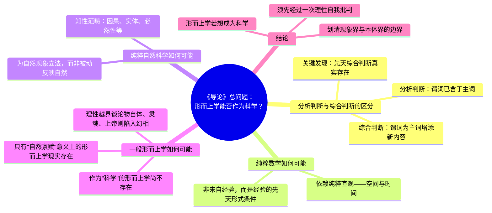

## 《任何一种能够作为科学出现的未来形而上学导论》读书笔记 
  
### 作者  
digoal  
  
### 日期  
2026-06-22  
  
### 标签  
读书笔记 , 任何一种能够作为科学出现的未来形而上学导论  
  
----  
  
## 背景 
  
  


---
书名: 《任何一种能够作为科学出现的未来形而上学导论》  
作者: [德] 康德  
译者: 庞景仁  
出版社: 商务印书馆  
出版年份: 1997-4  
笔记日期: 2026-06-22  
豆瓣链接: https://book.douban.com/subject/1652617/  
丛书: 汉译世界学术名著丛书·哲学  
标签: [康德, 德国古典哲学, 认识论, 形而上学, 哲学经典]  
---

  

> **一句话**：这是康德写给"普通聪明人"的《纯粹理性批判》压缩版，目的只有一个——证明形而上学要么彻底改造成一门"科学"，要么干脆别再混下去了。  
> **适合谁读**：想啃《纯粹理性批判》又怕被劝退的人；对"我们到底能不能认识世界本身"这个问题感兴趣的人。  
> **阅读难度**：⭐⭐⭐⭐☆（1-5星，比《纯批》友好很多，但仍需要一点耐心）  
> **推荐指数**：⭐⭐⭐⭐⭐  
  
---

## 一、时代坐标：这本书从哪里来？

1781年，康德憋了十几年、用四五个月集中写完的《纯粹理性批判》出版了。结果呢——几乎无人理睬，少数读了的人也普遍觉得看不懂、甚至把康德的立场和贝克莱的"一切都是观念"的唯心论混为一谈。这对一个已经五十七岁、等了大半生才把体系交出来的哲学家来说，是相当难堪的。

康德自己说得很坦白：促使他走上这条路的，是大卫·休谟多年前的提醒打破了他的"独断论迷梦"，给了他在思辨哲学领域完全不同的方向。休谟当年的怀疑论几乎把形而上学逼到了死角——因果关系这种我们天天在用、却说不出"为什么必然如此"的概念，到底有没有理性根据？在康德看来，旧形而上学的家族——理性论的独断者们和经验论的怀疑者们——吵了一百多年，谁也没把这个问题说清楚。

于是1783年，康德把《纯批》的核心论证重新组织了一遍，换了一套更"平易"的讲法，取名《导论》。维基百科的介绍说得很直接：这本书是康德在《纯粹理性批判》出版两年后写的一本短篇著作，可以看作《纯批》的缩写和补充说明，并且因为对前书受到的负面评价感到不满，康德特意在其中加入了为自己辩护的内容。换句话说，这不是一本平心静气写出来的导论，而是一份带着委屈和不服气写出来的"申诉状"。他甚至在前言里明白写道，这本小书不是给学生看的，是给"未来的教师"看的——他对读者的期待值，从一开始就不低。

```
1770年代  休谟的因果怀疑论传入 → 打断康德"独断论迷梦"
    ↓
1781年    《纯粹理性批判》出版（综合法，体系庞大，几乎无人读懂）
    ↓
1781-83年 各路评论将康德误读为"贝克莱式唯心论者"
    ↓
1783年    《未来形而上学导论》问世（分析法，篇幅小，附带反驳与辩护）
    ↓
1787年    《纯粹理性批判》第二版（吸收《导论》中的部分修正）
```

---

## 二、核心命题：康德在说什么？

整本书其实只问了一个看似学究、实则要命的问题：**形而上学有没有可能成为一门"科学"？** 在康德眼里，数学和物理学早就是科学了——它们有公认的方法、能不断积累、后人能在前人基础上继续往前走。可是形而上学呢？两千年了，还在原地打转，连"什么算是形而上学的对象"都没吵明白。康德要做的，是先别急着造一套形而上学体系，而是回头检查一下：人类的理性这个"工具"本身，能不能胜任这项工作。

### 命题一：知识分两种，只有"先天综合判断"才是形而上学真正的家底

康德把判断分成"分析判断"（谓词早就包含在主词里，比如"三角形有三条边"，纯粹靠逻辑就能确定）和"综合判断"（谓词给主词添了新东西，比如"物体有重量"，得靠经验或别的途径才能知道）。麻烦的是，形而上学想说的那些话——"every事件必有原因""灵魂是单一的"——既不是单靠分析就能得出的废话，又不能靠经验去验证（因为它们要管的是一切可能经验，经验本身验证不了"一切"）。这种既扩展知识、又不依赖经验的判断，康德叫它"先天综合判断"。整本《导论》的总问题，其实就是从这一句话拆出来的：**先天综合判断是如何可能的？**

### 命题二：哥白尼式倒转——不是认识去迎合对象，而是对象要迎合认识

如果知识必须完全跟着对象走，那休谟说得对，因果性这种"必然联系"压根无法证明，因为我们永远只看到事件接连发生，从没"看见"过必然性本身。康德的解法是把因果关系倒过来想：不是我们的认识去符合一个独立于我们的对象，而是对象之所以能被我们认识，恰恰是因为它已经被纳入了我们认知结构（空间、时间、因果范畴）所能处理的形式里。简单说就是人类为自然界设立法则，而不是自然界单方面规定我们能知道什么。这就是后人津津乐道的"哥白尼式革命"——天文学家发现不是太阳绕地球转，而是地球绕太阳转；康德则发现不是认知绕对象转，而是对象（作为现象）要绕认知结构转。

### 命题三：纯粹数学和纯粹自然科学的成功，证明了先天综合判断确实"现实存在"——但形而上学还没轮到

康德论证的策略很巧妙：他不直接空对空地问"先天综合判断可能吗"，而是先指出数学和物理学里早就有大量先天综合判断在正常运作（比如几何学的命题、"每个变化都有原因"这类自然科学的基本法则），这些学科已经是事实上存在并且管用的科学。既然事实已经摆在那儿，问题就从"是否可能"变成了"它们何以可能"——这是一条更容易走的"分析"路径：从已经现实的知识倒推它的条件。最后再问：形而上学能不能照着同样的条件去运作？答案是：可以，但前提是它必须老老实实地把自己关在"可能经验的范围之内"，一旦越界去谈论上帝、灵魂不死、宇宙整体这些超出经验的对象，先天综合判断的资格证就立刻失效。

---

## 三、论证地图：康德怎么说服你的？



这条逻辑链最有意思的地方在于它的"由实推可能"的倒推策略：康德不是先证明先天综合判断在逻辑上无矛盾，再说它存在；而是反过来，先指出几何学、算术、牛顿物理学这些先天综合判断的"产品"已经摆在那里且行之有效，再回头去问这些产品是怎么造出来的。这种从"既成事实"出发倒推"可能性条件"的论证方式，后来被哲学界称为"先验论证"，而康德自己在写《导论》时，还对这套论证的具体内容做了进一步修改，把"客观有效性"等同于"普遍必然性"，以此解释主观的逻辑条件如何能为经验判断带来客观有效性——这是一处康德自己也在不断打磨、不完全满意的关键环节。

代表性的案例是几何学：欧几里得几何的每一条命题，都不是靠观察大量三角形归纳出来的（那样得到的只是"或然"的概率，不是"必然"），却又确确实实在描述真实空间——康德的解释是，空间本身就是我们感性直观的先天形式，几何学描述的正是这个形式本身的结构，所以它既是先天的（不依赖个别经验）又是综合的（真的在告诉我们空间里会发生什么）。这个例子放在18世纪非常有说服力，但也埋下了后来最大的一个雷——下一节会讲到。

---

## 四、前提假设与边界：什么情况下这套论证会失灵？

**假设一：欧几里得几何是空间唯一可能的先天结构。** 康德整套"纯粹数学如何可能"的论证，几乎是把欧氏几何的必然性当成不言自明的出发点。但19世纪非欧几何（黎曼几何、罗巴切夫斯基几何）的出现，以及20世纪爱因斯坦广义相对论用弯曲空间描述引力，都说明空间的几何结构其实是经验上可以变化、需要物理学去检验的，并不是康德设想的那种纯粹先天、唯一确定的直观形式。这一假设的松动，直接削弱了他"数学先天综合判断"论证的说服力。

**假设二：知性范畴（因果、实体等）是固定不变、人类共有的一套先验结构。** 康德设想这套范畴是普遍且永恒的认知装置，每个理性存在者都共享同一套。但后来的人类学、认知科学、不同文化的语言学研究都提出过疑问：因果性、实体性这些概念在不同文化、不同认知发展阶段是否真的完全一致？如果不一致，那"普遍必然性"这块地基就要打个问号。

**适用边界：** 康德这套论证最稳固的地方，是它对"理性不能僭越经验去谈论上帝、灵魂、宇宙整体"的批判——这部分至今仍是对独断形而上学（以及各种"用理性证明上帝存在"的尝试）最有力的解毒剂。但它对"数学和自然科学的先天基础具体是什么"的具体回答，已经被后续的科学进展部分超越。读这本书时，最好把"批判精神"和"具体答案"分开看：前者历久弥新，后者带着18世纪的时代局限。

---

## 五、思想谱系：这本书在哪个传统里？

```
理性论（笛卡尔、莱布尼茨、沃尔夫）：理性可以靠纯粹推理把握世界本质
            ＋
经验论（洛克、贝克莱、休谟）：一切知识源于经验，休谟把因果性逼到怀疑论死角
            ↓
        康德的"哥白尼式革命"
   （既不全盘相信理性，也不全盘倒向经验，而是先批判认知能力本身）
            ↓
   ┌────────────┬─────────────┐
费希特、谢林、黑格尔     新康德主义（柯亨、那托尔普）
（把"自我"或"绝对精神"   （把康德重新解读为
推到本体论核心，          认识论/科学方法论奠基人）
走向德国唯心论体系）
            ↓
       现象学（胡塞尔）与海德格尔
   （围绕"《纯批》到底是认识论还是
    形而上学奠基"展开长期争论）
```

康德自己反复强调他既不站理性论，也不站经验论，而是要"审判"理性本身的能力边界——这也是为什么这本书会被后人称为哲学史上一次真正的范式转移。从新康德主义到分析哲学，主流一度倾向于把《纯粹理性批判》读成一部认识论著作，但也有像海德格尔那样的解读者坚持它本质上是一部为形而上学奠基的著作，这场争论一直延续到20世纪——海德格尔与卡西尔在达沃斯论坛上的那次著名争论，根源都能追溯到《导论》里提出的这同一个问题。

---

## 六、我学到了什么？

第一个收获是重新理解了"先验"和"先天"这两个词不是玄学口号，而是在解决一个非常具体的工程问题：怎么解释"必然性"从哪儿来。我们今天习惯用统计、概率去谈"规律"，但康德提醒我，统计规律永远只能说"迄今为止都是这样"，说不出"必然如此"——这中间那道缝，正是休谟怀疑论最锋利的地方，也是康德整本书想填的洞。读完之后，我对自己平时随口说"这是因果关系"这句话，多了一层警觉：我到底是在描述经验里反复出现的模式，还是真的在断言一种逃不掉的必然？

第二个收获是看到了一种很特别的论证姿态——"先从既成事实倒推条件"，而不是从零开始凭空证明。康德不去空谈"先天综合判断在理论上是否可能"，而是直接指出数学和物理学已经摆在那里、正常运转，再去问"它们何以可能"。这种"不从零证明，先承认现成的成就，再倒推支撑它的条件"的思路，其实在很多领域都有可借鉴的地方——比如分析一个组织为什么能运转良好，不一定要先建一套完美理论，先看它已经做对了什么，再倒推背后的结构性原因，往往更靠谱。

第三个收获，是对"划界"这件事本身有了更深的敬意。康德这本书表面在谈形而上学，骨子里在做一件更朴素的事：给"理性能管的范围"画一条线，线内尽情驰骋，线外就要老实承认"我不知道"。这种克制——明明渴望知道灵魂是否不死、上帝是否存在，却坚持说"这些问题超出了可能经验，理性给不出确定答案"——在一个总爱用"科学"或"理性"去给一切下断言的时代，反而显得格外珍贵。

---

## 七、举一反三：这个框架还能用在哪？

**应用一：评估任何一门"新兴学科"是否够得上"科学"的资格。** 康德的标准不是"听起来高深"，而是"有没有公认的方法、能不能持续积累知识、后人能否在前人基础上继续推进"。今天遇到一些打着"心理学""经济学""管理学"旗号却各说各话、缺乏可证伪标准的领域时，可以借这套尺子问一句：它到底有没有真正成为一门"科学"，还是仍停留在各派"独断"互相对峙的阶段？

**应用二：区分"我们认知结构强加的"和"对象本身固有的"。** 在做产品设计、市场研究甚至人际沟通时，经常会把"我看到的模式"误当成"事物本来就是这样"。康德的提醒是：很多我们以为是"客观规律"的东西，其实混杂着我们认知/工具/语言本身的结构性影响。比如做用户调研时，问卷的设计方式（认知工具）会直接塑造出我们看到的"用户偏好"（现象），这未必等于用户内心真实想要的（物自体意义上的真实需求）。

**应用三："从既成事实倒推条件"的分析方法。** 遇到一个已经运转良好但说不清原理的系统（一家成功公司、一段稳定的关系、一套有效的工作流程），不必先建立宏大理论再去验证，可以先承认"它确实在正常运作"这一事实，再倒推支撑它运作的关键条件——这往往比从零假设、从头论证效率更高。

---

## 八、批判与反思

**我不完全同意的地方：** 康德把"先验范畴"说成是全人类共有、固定不变的一套认知装置，这个说法在今天看来过于刚性。认知科学和跨文化研究都表明，人类对因果、实体、数量等基本概念的把握，存在发展阶段差异和文化差异，并不是一套"出厂自带、永不升级"的固件。康德当年没有这些经验材料可参考，这不是他的错，但今天再读，需要带着这层认识上的更新去理解他的论证。

**时代已经变了的地方：** 康德把欧几里得几何当成空间唯一可能的先天形式，这个前提已经被现代物理学（尤其是相对论）彻底动摇。这意味着他论证"纯粹数学如何可能"的具体内容，今天已经不能直接照搬，但他提出问题的方式——"为什么数学命题既是必然的又能描述真实世界"——这个问题本身依然成立，只是答案需要重新去找。

**这本书的局限性：** 作为一本"为自己辩护"而写的书，《导论》在论证密度上不如《纯批》系统完整，有些地方读起来更像是反驳批评者的论辩文，而非平心静气的体系建构。如果只读《导论》而完全不接触《纯批》原文，容易把康德的立场简化成几句口号（"物自体不可知"之类），错失他论证中真正精细的部分。

---

## 九、金句与记忆点

1. **"正是大卫·休谟之提醒在多年前首度打断了我独断的瞌睡。"**——康德自述思想转折的起点，提醒我们：再庞大的体系，背后往往也是被一个具体的质疑刺痛之后才逼出来的。

2. **"人类为自然界设立法则。"**（哥白尼式革命的精炼表达）——认知不是被动接收世界，而是主动赋予世界以可被理解的形式。

3. **"形而上学在某个地方是可能的吗？"**——全书的总问题，看似学究，实际是在问：人类的好奇心有没有边界，边界在哪儿。

4. **先天综合判断**——既不靠经验验证，又能扩展知识的判断；理解了这个概念，就抓住了整本书的钥匙。

5. **"分析方法依靠人们已经知道的东西，从那里出发追溯到还不知道的源泉。"**——康德对自己写作方法的自我说明，也是一种值得借用的思考策略：从已知倒推条件，比从零证明往往更高效。

6. **现象与物自体的区分**——我们能认识的永远是"对我们呈现的样子"（现象），至于"事物本身到底是什么"（物自体），理性给不出答案。这条界线，是康德留给后世最持久的遗产之一。

7. **"形而上学的源泉不可能是经验性的。"**——形而上学一旦想靠经验材料证明自己，就已经在概念上自相矛盾，这正是康德对旧形而上学最致命的一击。

---

## 十、延伸阅读

1. **《纯粹理性批判》（康德）**——《导论》的"母本"，如果对某个论证细节意犹未尽，最终还是要回到这里。建议先读《导论》打底，再啃《纯批》会顺很多。

2. **《人性论》（休谟）**——理解康德为什么会被"惊醒"，最好先看看休谟到底说了什么、怀疑论究竟逼到了什么程度。

3. **《道德形而上学的奠基》（康德）**——如果对康德如何处理"理性在实践领域（道德）能做什么"感兴趣，这本书是顺着《导论》最后关于"理性的实践应用"那条线索往下走的自然延伸。

4. **《康德与形而上学问题》（卡西尔）**——围绕《纯批》到底是认识论还是形而上学奠基这场争论的重要文献，可以和海德格尔的《康德与形而上学问题》（即"康德书"）对照着读。

5. **《什么是形而上学》（海德格尔）**——从另一个方向接着问康德留下的那个问题：如果理性管不到的地方理性就该沉默，那这片"沉默的领域"本身又该如何对待？

---

*笔记写于 2026-06-22 | 基于公开学术资料、豆瓣书评与中文哲学界相关论述，结合深度思考整理*
  
  
#### [PostgreSQL 解决方案集合](../201706/20170601_02.md "40cff096e9ed7122c512b35d8561d9c8")
  
  
#### [德哥 / digoal's Github - 公益是一辈子的事.](https://github.com/digoal/blog/blob/master/README.md "22709685feb7cab07d30f30387f0a9ae")
  
  
#### [About 德哥](https://github.com/digoal/blog/blob/master/me/readme.md "a37735981e7704886ffd590565582dd0")
  
  

  
