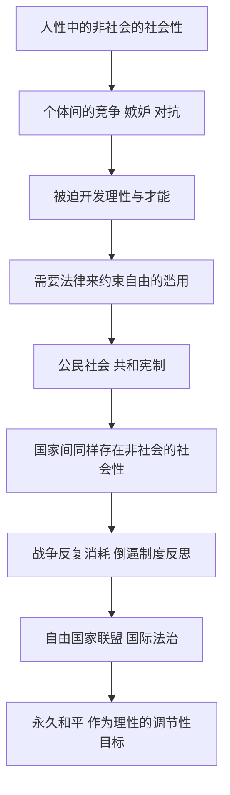

## 《历史理性批判文集》读书笔记 
  
### 作者  
digoal  
  
### 日期  
2026-06-22  
  
### 标签  
读书笔记 , 历史理性批判文集  
  
----  
  
## 背景 
  
  


---
书名: 《历史理性批判文集》  
作者: [德]康德  
译者: 何兆武  
出版社: 商务印书馆  
出版年份: 1990  
丛书: 汉译世界学术名著丛书·哲学  
笔记日期: 2026-06-22  
豆瓣链接: https://book.douban.com/subject/1455362/  
标签: [康德, 历史哲学, 启蒙运动, 政治哲学, 德国古典哲学]  
---

  

> **一句话**：康德用"非社会的社会性"这一个矛盾的概念，解释了人类历史如何在战争、纷争与自私自利的夹缝里，被一只看不见的"自然之手"推向法治与永久和平。  
> **适合谁读**：想搞懂"历史到底有没有方向"这个大问题的人；对启蒙运动、世界主义、国际法治感兴趣的读者；正在读康德三大批判、想找一个相对好读的"侧门"进入康德思想的人。  
> **阅读难度**：⭐⭐⭐⭐☆（不需要先读三大批判，但句子长、概念密度高）  
> **推荐指数**：⭐⭐⭐⭐☆  
  
---

## 一、时代坐标：这本书从哪里来？

这本书不是康德一次性写成的专著，而是何兆武先生从康德 1784 至 1797 年间（也就是康德 60 岁到 73 岁）撰写的八篇论文中编译出来的合集。这个时间点很关键：康德在 1770 年代后期转入"批判哲学"时期，先后写出《纯粹理性批判》《实践理性批判》《判断力批判》这"三大批判"，把认识论、伦理学、美学都重新打了地基。等到这三大批判基本完成，康德把目光转向了政治和历史——后人把这部分称为康德的"第四批判"。

时代背景也很重要：18 世纪末的德国，相比英国、法国仍然分裂、落后，市民阶级力量薄弱，没有能力像法国那样发动一场真正的政治革命。于是，正如后世评论者所说，"在法国发生政治革命的同时，德国发生了哲学革命"——这场哲学革命正是由康德开启的。康德 65 岁那年，法国大革命爆发了。他没有上街，却用笔在思考同一个问题：历史是不是真的有一个方向？人类的自由、纷争和苦难，最终会通向哪里？

```
1755          1770s              1784-1785            1789       1795        1797
星云说          批判哲学           《普遍历史观念》       法国大革命   《永久和平论》  《重提…改善》
(自然哲学)      时期开始           《什么是启蒙运动》                 (国际法治构想)   (晚年总结)
                                  《人类历史起源臆测》
```

## 二、核心命题：作者在说什么？

### 观点一：人类历史的发动机，是"非社会的社会性"

康德提出一个看似矛盾的概念：人既有强烈的合群倾向（想进入社会、被同类认可），又有强烈的自私倾向（想按自己的意愿支配一切，与他人对立）。这两种倾向缠绕在一起，被他称为"非社会的社会性"。听起来像个悖论，但康德的洞察是：恰恰是这种内在的张力——竞争、嫉妒、贪婪、权力欲——逼着人类去开发自己的全部才能，逼着懒散的人去耕作、去发明、去建立法律。如果人类天性像羊群一样彼此相安无事，文明根本不会出现。历史的进步，不是靠人性中善良的一面推动的，而是靠人性中那股"不那么体面"的张力硬逼出来的。

### 观点二：启蒙就是敢于公开运用自己的理性

在《答复这个问题："什么是启蒙运动？"》里，康德给出了那句流传至今的定义：启蒙就是人类脱离自己加于自己的不成熟状态，敢于独立思考。他区分了理性的"公开运用"和"私下运用"：一个人在自己的职务岗位上（军官、税吏、神职人员）必须服从、必须照章办事，这是私下运用；但同一个人作为面向全体公众发言的学者，应该永远拥有公开质疑、公开论辩的自由。康德认为，只要保住这一条自由，社会迟早会自己启蒙自己；而一旦连这条自由都被剥夺，再多的"思考多少都行，但要服从"式的恩赐自由，也只是镀金的笼子。

### 观点三：永久和平不能靠善意，要靠制度设计

到了晚年的《永久和平论》，康德把同一套逻辑用在了国家之间的关系上。国家和国家之间，正如个人和个人之间一样，处在一种"非社会的社会性"中——既互相依赖贸易往来，又随时可能开战。康德的结论很现实主义：不能指望君主或政治家变得善良，而要建立一套类似国内法治的国际架构（自由国家组成的联盟、世界公民权），用制度而不是道德感化，去把战争的代价提得足够高，让和平成为理性算计下的最优解。

## 三、论证地图：作者怎么说服你的？



康德几乎没有使用统计数据，他的"证据"主要是对历史现象的哲学式归纳：希腊—罗马—近代欧洲国家宪法演进的大致脈络、启蒙运动中言论自由斗争的实例（如伏尔泰、卢梭遭受迫害）、以及他自己身处的普鲁士腓特烈大王统治下"思考多少都行，但要服从"的现实样本。这种论证方式的特点是：解释力很强、画面感很强，但严格来说不是经验科学意义上的"证明"，而更接近于一种"提供一条指导线索"的哲学假设——康德自己其实也承认这一点。

## 四、前提假设与边界：什么情况下这不成立？

- **假设一：自然背后有一个隐藏的"计划"。** 康德的整套历史哲学建立在一种"目的论自然观"之上——大自然在杂乱无章的人类行为背后，安排了一个合乎规律的总体方向。这个假设既不能被经验证实，也不能被经验否证，康德称之为一种"调节性"的理念，而不是一个客观事实。如果不接受这个预设，整套论证的说服力会大打折扣。
- **假设二：理性终将驯服人性中的恶，而不会被恶吞没。** 20 世纪的两次世界大战、极权主义的兴起，对这个假设构成了沉重的反例——"非社会的社会性"有时驱动的不是进步，而是彻底的毁灭。
- **假设三：公开运用理性本身具有自我纠错的力量。** 这依赖于一个现实条件：必须存在一个相对自由、相对多元的公共讨论空间。在没有出版自由、信息被严格管控的环境里，"公众会自己启蒙自己"这句话就缺乏现实基础。

适用边界：这本书更适合被当作一种"思考历史的方法论"来读，而不是一份对历史走向的可靠预测。它提供的是一个乐观但留有余地的框架——乐观在于相信进步有方向，留有余地在于康德反复强调，这只是一个让我们"有理由抱有希望"的理念，而不是"历史无论如何都会变好"的保证。

## 五、思想谱系：这本书在哪个传统里？

康德上承卢梭：卢梭看到了文明的代价（不平等、异化），康德则把这种张力进一步抽象为"非社会的社会性"，但他反对卢梭那种"文明即倒退"的悲观调子，坚持认为代价是必要的、长期看是值得的。

康德下启黑格尔：黑格尔后来提出"世界历史是自由意识不断进步的过程"，明显延续了康德"历史有方向"的思路，但黑格尔批评康德的哲学始终停留在主观、应然的层面（"应该如此"），没有真正进入客观的、制度化的"伦理"领域——这构成了康德与黑格尔之间最经典的一场思想接力与争论。

再往后，康德的"世界公民""自由国家联盟"等构想，也被普遍认为是后来国际法、国际联盟、联合国，以及罗尔斯"万民法"、哈贝马斯公共领域理论的一个重要思想源头。

```
卢梭（文明的代价，悲观）
   │
   ▼
康德（非社会的社会性，谨慎乐观）── 启蒙观、世界公民、永久和平
   │
   ▼
黑格尔（世界历史即自由意识的进步，批评康德停留于主观应然）
   │
   ▼
现代国际法 / 世界主义理论（万民法、公共领域理论）
```

## 六、我学到了什么？

第一个收获，是"矛盾本身可以是动力"这个思路。我们通常习惯把矛盾、冲突当作需要消灭的"问题"，但康德提醒我，有些矛盾其实是发展的发动机——消灭了矛盾，可能同时也消灭了进步的动力。这让我想起很多组织管理的现实：部门之间的良性竞争、产品团队内部不同声音的拉扯，往往比表面的"一团和气"更能催生好结果。

第二个收获，是重新理解了"公开运用理性"和"私下运用理性"的区分。我以前以为言论自由就是一个笼统的"想说什么就说什么"，读完才意识到康德的区分更精细：一个人在岗位上服从规则是合理的，但同一个人作为公共讨论的参与者，必须保留公开质疑、公开论辩的权利。这两者并不矛盾，反而是社会能持续自我修正的前提。

第三个收获，是看到了"理想主义"和"现实主义"在康德身上是怎么共存的。他谈永久和平,不是靠喊口号、靠期待人性变善，而是非常冷静地去设计一套让背叛和战争代价高昂的制度架构。这种"用制度而不是用道德感化去兜底理想"的思路，比我原本设想的康德要"硬核"得多。

## 七、举一反三：这个框架还能用在哪？

"非社会的社会性"这个框架，可以迁移到很多需要解释"对立反而催生进步"的场景：比如市场经济里企业间的竞争压力倒逼技术创新；比如开源社区里不同利益方的分歧反而推动了更稳健的技术标准；比如学术界的论战往往比一团和气的"互相肯定"更能推进认知边界。

"公开运用理性"这个区分，也可以用来理解今天的网络公共讨论空间：一个组织内部的员工在专业岗位上需要服从流程，但作为公共领域的参与者（比如在社交媒体上），理应保留更大的质疑和表达空间——区分这两种角色，能帮我们更清楚地判断"什么时候该服从，什么时候该坚持说出不同意见"。

"用制度兜底理想，而不是靠道德期待"这个思路，也适用在团队协作设计上：与其期待所有人都"自觉、有契约精神"，更可靠的方式是设计出让违背承诺的代价足够高的机制。

## 八、批判与反思

我不完全同意康德对历史的乐观预设。20 世纪的两次世界大战、极权主义的兴起，是对"理性终将驯服恶"这个假设最沉重的反驳——历史并没有像康德期待的那样,呈现出一条单调上升的曲线。后来的历史学界、尤其是后现代史学，普遍对这种"宏大叙事"式的历史哲学保持警惕，认为它容易简化历史的偶然性和复杂性,把杂乱的人类行为硬塞进一个事先设定好的"剧本"里。

我也认为康德的理性主义有些过于乐观,低估了非理性力量——民族主义情绪、宗教狂热、群体心理——在历史中的破坏性。他设想"公众会自己启蒙自己",但现实中,公众同样可能被煽动着集体走向反启蒙。

另外，这套理论带着鲜明的欧洲中心视角：康德笔下"合乎规律地进步"的国家宪法演进,几乎完全以欧洲历史为参照系，对欧洲之外的历史经验关注有限,这是写作时代留下的局限,今天读起来需要带着批判性的距离。

## 九、金句与记忆点

1. **"要有勇气运用你自己的理智！"**（出自《什么是启蒙运动》）——康德给启蒙下的定义浓缩成了一句口号：成熟，从敢于自己思考开始。
2. **"非社会的社会性"**——人既想合群又想对抗，这股张力才是文明的发动机，而不是天生的善良。
3. **"公开运用理性的自由"**——作为学者面向公众发言时的质疑权利，是社会能持续自我修正的关键阀门。
4. **"思考多少都行，但是要服从"**——康德引用腓特烈大王的这句话，点出了"恩赐式自由"和真正自由之间的微妙边界。
5. **"大自然的隐藏计划"**——历史看似杂乱，但康德相信背后有一条理性能勾画出的总体方向，这是一个"调节性"的理念，而非可验证的事实。
6. **"永久和平不能靠善意，要靠制度"**——这是康德晚年政治哲学最现实主义的一笔，也是后世国际法治构想的雏形。

## 十、延伸阅读

1. **《永久和平论》单行本**（康德）——如果只想深入读懂这本合集里分量最重的一篇，可以找单行本配合详细注释阅读。
2. **《纯粹理性批判》**（康德，邓晓芒译）——理解康德整套"批判哲学"思维方式的根基,读完会更明白历史理性批判为何被称为"第四批判"。
3. **《社会契约论》**（卢梭，何兆武译）——理解康德"非社会的社会性"思路的直接思想源头。
4. **《精神现象学》或黑格尔历史哲学相关导读**——看黑格尔如何接过康德"历史有方向"这个接力棒，并提出批评。
5. **《历史的终结与最后的人》**（福山）——一本现代版的"历史有方向"论争，可以和康德的乐观历史观做对照阅读。

---

*笔记写于 2026-06-22 | 基于公开资料与深度思考整理*
  
  
#### [PostgreSQL 解决方案集合](../201706/20170601_02.md "40cff096e9ed7122c512b35d8561d9c8")
  
  
#### [德哥 / digoal's Github - 公益是一辈子的事.](https://github.com/digoal/blog/blob/master/README.md "22709685feb7cab07d30f30387f0a9ae")
  
  
#### [About 德哥](https://github.com/digoal/blog/blob/master/me/readme.md "a37735981e7704886ffd590565582dd0")
  
  

  
