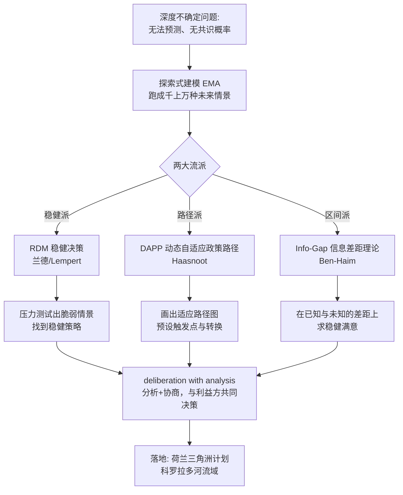

## 《深度不确定性下的决策：从理论到实践》读书笔记 
  
### 作者  
digoal  
  
### 日期  
2026-06-22  
  
### 标签  
读书笔记 , 深度不确定性下的决策：从理论到实践  
  
----  
  
## 背景 
  
  


---
书名: 《Decision Making under Deep Uncertainty: From Theory to Practice》（深度不确定性下的决策：从理论到实践）  
作者: Vincent A. W. J. Marchau、Warren E. Walker、Pieter J. T. M. Bloemen、Steven W. Popper（主编）  
出版年份: 2019  
笔记日期: 2026-06-22  
豆瓣评分: 暂无（Amazon 4.5/5，约293人评价；Springer 截至2021年逾92.6万次访问、600+次引用）  
标签: [决策科学, 不确定性, 公共政策, 气候适应, 系统工程]  
来源: 网络搜索（Springer 开放获取页面 + 中英文书评）  
---
  
> **核心一句话**：当未来无法预测时，别再去赌哪个预测对——去设计一个无论哪种未来发生都还过得去、并且能边走边改的计划。  
> **适合谁读**：做长期规划的人——政策制定者、城市规划师、水利/气候/能源工程师、企业战略与风控人员，以及任何要为「20年后」拍板的人。  
> **阅读难度**：⭐⭐⭐⭐☆（学术文集，方法论密集，但案例丰富）  
> **推荐指数**：⭐⭐⭐⭐☆（领域奠基之作，且完全开放获取免费下载）  
  
---

> ⚠️ **素材说明**：本书为小众学术文集，中文长篇书评极少。本笔记基于 Springer 官方简介、各章摘要、王绍光等学者的相关论述及英文资料综合整理，核心方法论判断基于公开学术内容。豆瓣暂无评分。

---

## 一、时代坐标：这本书从哪里来？

20 世纪的规划方法有一个共同信仰：**先预测，再行动**（predict-then-act）。盖大坝先预测百年洪水位，修电网先预测三十年用电量，做投资先预测利率走势。这套逻辑在世界变化缓慢时很管用。

但进入 21 世纪，气候变化、技术颠覆、金融海啸、全球疫情接连出现——它们的共同点是：**你连未来有哪些可能性、各自概率多大都说不清**。传统的「概率 × 收益」期望值计算彻底失灵，因为概率本身就是编出来的。

这本书诞生于一个学术共同体——**DMDU Society（深度不确定性决策学会）** 。它由兰德公司（RAND）、荷兰代尔夫特理工、乌得勒支大学等机构的学者组成，多年来各自发展出应对深度不确定性的方法。2019 年，四位主编把这些分散的「门派」第一次系统地汇编到一本书里，并且做成**开放获取（免费下载）** ——这本身就是一个声明：这套方法太重要，不该被付费墙挡住。

它要解决的问题只有一句话：**当预测不再可靠，规划该怎么做？**

```
20世纪范式                    21世纪困境
─────────────              ─────────────
预测未来 → 优化方案     →    未来不可预测，优化无从谈起
单一最优解                    最优解可能是最脆弱的
一次决策，长期执行            决策必须能随信息更新而调整
```

---

## 二、核心命题：作者在说什么？

### 命题一：「深度不确定」是一种独立的、需要专门对待的决策环境

本书最重要的概念贡献，是把不确定性**分层**。借用拉姆斯菲尔德那个著名的说法，可以排成一个谱系（中国学者王绍光在解读新冠决策时也用了几乎相同的分类）：

| 决策环境 | 认识论状态 | 对应的「网红概念」 |
|---|---|---|
| 确定性 | 已知的已知 | 灰犀牛（可预见、大概率） |
| 一般不确定 | 已知的未知 | 黑天鹅（知道有未知，能估概率） |
| **深度不确定** | **未知的未知** | 王绍光所谓「天外来物」 |

**关键洞见**：深度不确定 ≠ 不确定性更大。它是**性质不同**——你不仅不知道会发生什么，甚至**对「会发生什么的概率分布」都没有共识**，对「用哪个模型描述系统」「该优化什么目标」都没有共识。在这种情况下，任何基于单一预测的方案都是赌博。

### 命题二：把目标从「最优」换成「稳健」

传统决策追求 **optimal（最优）** ：在预测的未来下表现最好。本书主张追求 **robust（稳健）** ：在 **大量不同的、说不准的未来下都表现得「足够好」** 。

这是一次根本的价值排序翻转——你主动放弃「赌对了能拿满分」的方案，换一个「无论怎样都不会考砸」的方案。用一句话概括：**不要最大化期望收益，要最小化「后悔」** 。

### 命题三：好计划是「活的」——能适应、可调整

本书反复强调 **adaptive（自适应）** 规划：不要一次性把未来 30 年的动作全定死，而是**设计一条带「岔路口」的路径**。先走稳健的第一步，同时预先设定好「触发信号」（signposts/triggers）——一旦监测到某个临界点被突破，就切换到预备好的 Plan B。

这其实就是把中国人熟悉的「**摸着石头过河**」做成了一套有数学、有模型、有监测指标的严谨方法论。

---

## 三、论证地图：作者怎么说服你的？

本书不是一家之言，而是把五种成熟方法摆出来、配真实案例验证。这是它最有说服力的地方——**理论 + 工具 + 实战缺一不可**。



**几个关键论据，以及我对其可信度的判断：**

- **荷兰三角洲计划（Delta Programme）** （可信度：高）。这是全书的「皇冠案例」。荷兰把 DAPP 方法写进了国家级的防洪与水安全规划——面对海平面上升幅度的深度不确定，他们不赌某个具体数值，而是设定一系列适应路径和触发阈值，海平面到哪一步就启动哪一档措施。这是真金白银的国家实践，不是纸上谈兵。

- **科罗拉多河流域水资源管理**（可信度：高）。兰德用 RDM 帮七个州协作识别供水脆弱性。这个案例的价值在于展示了「**分析如何帮助本来吵不拢的利益方达成共识**」——稳健决策不只是技术，更是协商工具。

- **碳税与技术补贴组合**（可信度：中）。书中用 RDM 演示如何为减排找一个稳健的政策工具组合。方法演示清晰，但政策落地受政治因素影响极大，模型能做的有限。

**论证的诚实之处**：本书没有兜售「银弹」。它专门探讨了这些方法在实践中的**障碍与推动因素（barriers and enablers）** ——比如组织惯性、决策者对「不给确定答案」的不适应。这种自我批判让它更可信。

---

## 四、前提假设与边界：什么情况下这不成立？

任何方法论都有它的「使用说明书边界」。我梳理出三个隐含假设：

**假设一：你能建出一个「够用」的系统模型，并能跑大量模拟。**
RDM、EMA 的核心是「跑成千上万种未来情景」。这要求你有可计算的模型和算力。
→ **今天是否成立**：部分成立。水利、气候、能源这类有物理规律的系统适用；但社会、地缘政治这类系统连模型都搭不出来，方法就难落地。

**假设二：决策可以「分步走」、留得住后悔药。**
自适应路径的前提是：你能先走一步、观察、再调整。
→ **今天是否成立**：不总成立。很多重大决策是**一次性、不可逆**的（要不要打仗、要不要上某项不可撤销的技术）。一旦没有「下一步」，自适应规划就失去了用武之地。

**假设三：有一个理性的、愿意协商的决策环境。**
「deliberation with analysis（分析+协商）」假设各方愿意基于证据共同审议。
→ **今天是否成立**：理想化。现实中决策常被权力、选票、短期政绩绑架，分析报告常常只是事后背书。

**适用边界**：这套方法最适合**长周期、可分步、有模型、多方需协商**的问题（基础设施、气候适应、水资源）；对**短平快、不可逆、高度政治化**的决策，价值会大打折扣。

---

## 五、思想谱系：这本书在哪个传统里？

```
赫伯特·西蒙「有限理性」「满意而非最优」
        │
        ▼
情景规划（Shell, 1970s）+ 兰德的系统分析传统
        │
        ├──→ 假设导向规划（Dewar, Assumption-Based Planning）
        ├──→ 探索式建模 EMA（Bankes）
        ▼
┌──────────────────────────────────────┐
│  DMDU（本书，2019）：把诸流派整合成体系   │
└──────────────────────────────────────┘
        │
        ▼
应用到气候适应、水管理、国家长期规划……
```

它的思想根在**西蒙的「满意原则」** （人不可能最优，只能满意）和**情景规划传统**（壳牌公司用情景而非预测做战略）。本书把这些零散的智慧，连同兰德公司几十年的系统分析方法，焊接成一套**有名字、有步骤、有工具、可教学**的学科。

与同时代思想的对话很有意思：它和塔勒布的**《黑天鹅》《反脆弱》** 站在同一战壕——都反对「预测崇拜」。但路数不同：塔勒布偏哲学、偏「拥抱波动」；本书偏工程、偏「系统地设计稳健与适应」。可以说，**塔勒布提出了问题的诗意，本书给出了问题的工程学**。

---

## 六、我学到了什么？

读这本书最大的冲击，是它逼我承认一件我一直在逃避的事：**我对「预测」的依赖，本质上是对「掌控感」的贪恋**。我们总想要一个确定的答案，哪怕那个答案是假的。

三个真正改变我的收获：

**① 不确定性是分层的，而不是一个程度问题。**
以前我以为「不确定」就是「风险大一点」，多留点余量就行。但「已知的未知」和「未知的未知」是两种世界——前者可以买保险、算概率，后者连概率都是幻觉。这个区分改变了我看问题的方式：**遇到难题先问一句「我现在到底处在哪一层？」** ——如果是深度不确定，那再精致的预测模型都是自欺。

**② 「稳健」可能是比「最优」更高级的智慧。**
这个框架给了我一个可操作的工具：判断一件事时，别只问「最好情况能拿多少」，要问「**最坏情况下我还活得下去吗**」。最优解往往是最脆弱的——它只在某个特定未来成立。稳健解放弃了一部分上限，换来了所有情境下的下限。这几乎是一种人生哲学。

**③ 最难的部分：怎么知道「该调整了」？**
自适应规划听起来美好，但我最大的疑惑是——**触发点（signpost）怎么定？** 定早了瞎折腾，定晚了来不及。书里给了原则，但具体阈值高度依赖领域知识和判断力。这恰恰说明：方法论能帮你搭框架，但**最关键的那个判断，仍然要靠人**。这让我对「方法万能论」保持警惕。

合上书我才意识到，这套来自荷兰水利工程师和兰德分析师的方法，骨子里讲的是一种谦逊：**承认自己不知道，然后认真地为「不知道」做准备。**

---

## 七、举一反三：这个框架还能用在哪？

核心方法论迁移的公式是 `[方法] + [新场景] = [洞察]`：

- **「稳健而非最优」+ 个人职业选择 = 别选那种「只有风口在才值钱」的技能，要选风停了也饿不死的能力组合。**
- **「自适应路径」+ 创业 = 别一上来 all in 赌一个终局，先做能验证、可掉头的最小一步，预设好「数据到什么程度就转型/止损」的触发线。**
- **「不确定性分层」+ 个人理财 = 先分清你面对的是「已知波动」（可配置对冲）还是「深度不确定」（黑天鹅/天外来物，只能留足够现金缓冲，别用杠杆）。**
- **「探索式建模」+ 产品决策 = 别只规划「用户会这样用」的理想剧本，主动跑一遍「如果用户完全不按预期来」的几十种情景，找出无论如何都不会崩的设计。**

一句话：**这套方法是给「赌不起又躲不掉」的长期决策准备的。**

---

## 八、批判与反思

**作者认为「稳健决策能帮各方达成共识」，但我不完全认同。** 科罗拉多河案例确实漂亮，但它成立的隐含前提是各方都愿意坐下来看分析。现实中很多冲突的根源不是「信息不足」而是「利益对立」——再稳健的模型也化解不了「你多用水我就少用水」的零和。把政治问题当技术问题解，是这类工程学方法的通病。

**这套方法有「专家依赖」和「黑箱」风险。** 跑上万种情景、建复杂模型，普通公众和很多决策者根本看不懂。当方法越精密，**它就越容易变成少数技术官僚垄断话语权的工具**——「模型说该这样」可能成为新的不容置疑的权威，而模型的假设是谁定的？这是本书谈「协商」时没有充分回答的。

**时代变了的一点**：本书 2019 年成稿，彼时大模型 AI 尚未爆发。今天 AI 既是更强的「探索式建模」工具（能跑更多情景），又制造了全新的深度不确定性（AI 自身的影响无法预测）。这本书的方法论框架依然成立，但它面对的「不确定性清单」已经更长了。

**最后一点保留**：方法论再好，也救不了「不想被救」的决策者。书里花大篇幅讲落地障碍，恰恰暴露了一个尴尬——**最需要这套方法的人，往往是最抗拒「不给确定答案」的人**。

---

## 九、金句与记忆点

1. **「不是去做更好的预测，而是去做更好的决策。」** （RDM 的灵魂——computation not to predict, but to decide）放弃预测崇拜，是这套方法的起点。

2. **「深度不确定 = 对未来的概率分布和系统模型都没有共识。」** 这是全书最该背下来的定义，它划清了「风险」和「真正的未知」的界。

3. **「最优解常常是最脆弱的解。」** 因为最优只在一个特定未来成立，未来一变它就崩。

4. **「我们无法引导风向，但可以调转船帆。」** （王绍光引用的英谚，恰是自适应规划的精神）应对深度不确定，靠的不是预知风向，而是随时能掉头的能力。

5. **「摸着石头过河」是深度不确定下的理性策略，而非权宜之计。** 本书等于给这句中国老话颁发了一张学术认证。

6. **「Deliberation with analysis」——分析与协商并重。** 好决策不只是算出来的，是算出来再吵出来的。

7. **「信号桩（signpost）与触发点（trigger）」** ：自适应计划的关键零件——预先约定好「看到什么信号，就启动什么行动」。

---

## 十、延伸阅读

1. **《黑天鹅》/《反脆弱》（纳西姆·塔勒布）** —— 与本书同一战壕的「反预测」哲学，塔勒布管态度，本书管方法，配合读完整。

2. **《灰犀牛》（米歇尔·渥克）** —— 讲「确定性条件下的决策」，正好补齐不确定性谱系的另一端，和本书的分层框架对照看特别清晰。

3. **王绍光《加强深度不确定条件下的决策研究》** —— 用 DMDU 框架解读新冠决策的中文文献，是把这套西方方法论接入中国治理语境的绝佳样本。

4. **赫伯特·西蒙《管理行为》** —— 「有限理性」与「满意原则」的源头，本书价值排序的思想祖宗。

5. **本书 Springer 开放获取版** —— 强烈建议直接下原书（免费）。理论章节难啃，但案例章节（荷兰三角洲、科罗拉多河）即使跳读也极有启发。

---

*笔记写于 2026-06-22 | 基于公开资料与深度思考整理*
  
  
#### [PostgreSQL 解决方案集合](../201706/20170601_02.md "40cff096e9ed7122c512b35d8561d9c8")
  
  
#### [德哥 / digoal's Github - 公益是一辈子的事.](https://github.com/digoal/blog/blob/master/README.md "22709685feb7cab07d30f30387f0a9ae")
  
  
#### [About 德哥](https://github.com/digoal/blog/blob/master/me/readme.md "a37735981e7704886ffd590565582dd0")
  
  

  
