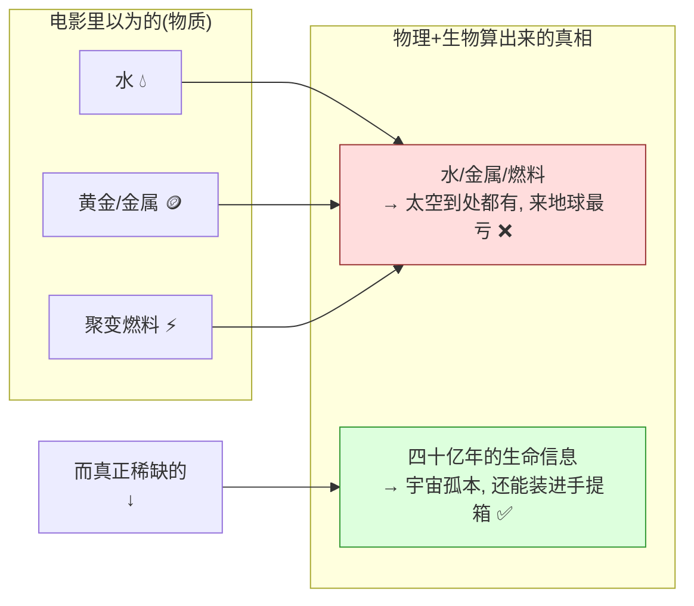

## 德说-第493期, 如果外星人真的来了, 他们会抢走我们的水和黄金吗?
  
### 作者  
digoal  
  
### 日期  
2026-06-22  
  
### 标签  
外星人 , 来干什么
  
----  
  
## 背景  
如果外星人真的来了, 他们会抢走我们的水和黄金吗?

这是一个被问错的问题, 普通人真正该盯的东西到底是什么? 
  
先说结论:  
  
外星人最不缺的就是水、金属、能源(太空到处都是, 来地球反而最贵); 他们若有所图, 唯一稀缺的是地球四十亿年演化攒下、无法重造的生命信息。而普通人想受益, 别幻想跟外星人贸易——历史证明那轮不到你——要盯的是这场冲击逼出来的各国科技军备竞赛的民用外溢, 就像手机摄像头和互联网当年从太空竞赛、冷战里"漏"出来一样。  
  
下面来看看论证过程.  
  
## 先泼一盆冷水: 电影骗了你

几乎每一部外星人入侵电影都有同一个桥段——他们来抽干我们的海洋, 或者来抢我们的稀有金属, 或者干脆把人类当原料。我第一次认真琢磨这个问题时, 也是顺着这个思路想的。但当我把它拆给几个不同领域的脑子去算, 算出来的结论让我自己都愣了一下:

**一个能跨越几光年飞到这里的文明, 最不可能稀罕的, 恰恰是水、金属和能源。**

为什么? 跟我走一遍, 这背后其实是一道很硬的物理题, 一段很扎心的历史, 和一条很现实的"普通人发财路"——只不过那条路, 跟外星人没多大关系。

## 第一层: 站在物理的角度, 地表物质是全太阳系最贵的东西

我先请教了一位行星科学家。他早年是"小行星采矿一定赚钱"的鼓吹者, 后来眼看着 Planetary Resources、Deep Space Industries 这两家明星公司在 2018、2019 年前后一个接一个倒闭, 彻底变成了冷静派。他的口头禅是: "先算引力井, 再谈生意。"

他给我算了两笔账。

第一笔是**宇宙里到底有什么**。我们觉得珍贵的东西, 在宇宙尺度上一点都不珍贵。整个宇宙的普通物质里, 大约 75% 的质量是氢, 24% 是氦, 这两样加起来占了约 99%(这是俄勒冈州立大学化学教授 May Nyman 在 Live Science 2017 年一篇科普里讲大爆炸核合成时给的口径, 也是教科书的通识)。如果外星人要的是聚变燃料, 每一片星云、每一颗像木星那样的气态巨行星, 氢和它的同位素都管够。他们犯得着飞到地球的海里来舀水吗?

第二笔账更狠, 叫**引力井**。地球的质量, 决定了你想把 1 公斤东西从地面送上天, 得克服大约每秒 11.2 公里逃逸速度量级的能量门槛。这意味着, 同样一块金属, 如果它本来就待在小行星上、几乎"飘"在太阳的浅坑里, 取它的成本比从地球地表"抠"出来再运走低一个数量级。

把这两笔账放一起, 一个反直觉的结论就冒出来了: **对一个已经在太空里活动的文明, 地球表面的物质是全太阳系最贵的物质, 不是最便宜的。** 你要金属? 小行星带里那颗叫"灵神星"(16 Psyche)的家伙, 光金属就被 NASA 的首席研究员估到过 10^19 美元这种天文数字的量级(她和 NASA 后来都强调, 这只是"假设全运回且价格不变"的纸面数, 真运回来地球金属价格会瞬间崩盘)。可这恰恰说明: 太空里的金属是论"整颗星"称的, 谁还会专程下到地球的矿坑里去捡那点零头?

最有意思的是, 这道理连我们人类自己都已经算明白了——上面那两家采矿公司倒闭, 倒闭的原因就是"把太空物质运回地球引力井底部去卖, 怎么算都亏"。一个比我们高级的文明, 只会比我们算得更精, 不会更糊涂。

所以第一层的结论是: 如果外星人来了, 把"抢水、抢金子、抢燃料"这些选项, 基本可以一个一个划掉。

（这里我得诚实交代一句: 这整套推理有个隐藏的前提——我们假设外星人也跟我们一样, 受引力和元素丰度的支配, 也得"算运输的账"。这是个拟人化的假设。万一人家掌握了我们完全无法想象的物理, 这本账就全作废了。这一点我不藏着。）

## 第二层: 那他们到底可能要什么? 一样你绝对想不到的东西

物质这条路被堵死了, 那还剩什么? 我又去问了一位在 SETI 圈子里泡了二十年的天体生物学家。她的回答让我起了一身鸡皮疙瘩:

**地球上唯一无法在别处廉价复制的资源, 是四十亿年演化攒下来的那套"活的信息"。**

她是这么讲的: 元素受守恒和丰度的支配, 你要多少有多少; 可信息不一样, 信息和"产生它的那段历史"死死绑在一起。地球生物圈, 就是一台跑了大约 40 亿年、从来没有重启过的超级计算机, 它"算"出了光合作用、固氮酶、核糖体、免疫系统、神经系统……数以亿计的分子级解决方案。这套方案库最要命的一点是: **就算你有无限的能量和物质, 你也没法"快进"把它重新算一遍。** 演化生物学家古尔德有个著名的思想实验叫"重放生命的磁带"——把演化从头再跑一次, 结果几乎不可能和现在一样。

换句话说, 一颗灵神星的金属再值钱, 那也是"论斤称"的、宇宙里到处都有的东西; 而你脚下随便一克泥土里的微生物基因多样性, 是这颗星球四十亿年实验的独一份结晶, 在已知宇宙里没有第二份拷贝。

而且——这是最妙的地方——**信息恰好能绕开那个要命的引力井。** 为什么? 因为信息可以被压缩进质量近乎为零的载体里。这不是空想: DNA 本身就是人类已知密度最高、最持久的存储介质(Nature Reviews Genetics 2019 年有一篇系统综述专门讲这个), 微软和华盛顿大学的团队早在 2018 年就实测过, 在 1300 万条 DNA 短链里存下 35 个文件、超过 200 MB 的数据, 还能一个不错地读出来(Organick 等人, Nature Biotechnology 2018)。把整个地球生物圈的"设计蓝图"压进一个手提箱大小的样本带走, 物理上完全做得到。

你不信这套逻辑? 那看看我们人类自己在干什么: 挪威斯瓦尔巴的全球种子库(2008 年启用)在囤上百万份种子, "地球生物基因组计划"立志要把全球约 150 万种真核生物全部测序存档。我们自己就在拼命地把生物信息抢救成可备份、可复制的形式——我们早就用行动投了票: **生物的信息, 比生物所含的那点物质值钱得多。** 一个更高级的文明, 只会比我们更懂这个道理。

（同样诚实交代: "外星人会觉得我们这套生命信息有价值"是个乐观假设。也可能人家早就用计算穷举了所有可能的生命方案, 对地球这一套毫无兴趣。这条我也不藏。）

## 把前两层连起来: 价值排序被彻底翻转了

到这里, 两位专家其实合力干了一件事——把普通人脑子里那张"地球资源价值表"整个倒了过来。我画给你看:

一句话: **他们大概率不缺原子, 缺的是地球这套没法重造的生命设计图。**

## 第三层: 就算我说中了, "普通人受益"也是个危险的幻想

讲到这, 你可能已经在盘算: 那我们是不是能拿这套宝贵的生命信息, 跟外星人做笔大买卖, 发一笔横财?

打住。这正是我请来一位经济史学家的原因——他专门研究人类历史上那些力量悬殊的文明接触, 而他要做的就是把这个幻想戳破。

他的话很不中听但很实在: **人类历史上, 每一次力量极度悬殊的接触, 弱势那一方的普通人, 在接触的当下几乎从来没"受益"过。** 道理很硬核——做买卖能双赢, 前提是双方都有讨价还价的本钱和退出的选项。可当一方先进到你完全无法理解、也无法拒绝时, "贸易"就退化成了"单方面拿取", 弱势方根本拿不到好处的分成。这不是谁坏, 是议价结构决定的。

他甩给我三个真实的历史案例, 一个比一个清醒:

- **接触的当下, 是灾难, 不是发财。** 哥伦布大交换里, 旧大陆的病菌传进美洲, 多数学者估计接触后一两个世纪内, 美洲原住民人口因疾病、战争、奴役下降了约 80%–90%(Nunn & Qian 在 Journal of Economic Perspectives 2010 年的综述)。"先进文明到来"对当地普通人的直接后果, 不是暴富, 是近乎灭绝。
- **真有好处, 也是"意外飘来的", 不是对方恩赐的。** 还是那场大交换, 美洲的马铃薯传到了欧亚。Nunn 和 Qian 另一篇发在 Quarterly Journal of Economics(2011)的量化研究估计, 光是马铃薯的引入, 就能解释 1700 到 1900 年间旧大陆人口增长的约四分之一。但接住这个好处的欧亚农民, 根本不是大交换的发起者, 他们只是被动地接住了一个高产作物。 **好处是外溢, 不是交易。**
- **唯一能主动抓住的正道, 是拼命学。** 19 世纪的明治日本被西方的炮舰逼到墙角, 它没等任何"恩赐", 而是派岩仓使节团(1871–1873)满世界考察、高薪请外国专家、再迅速国产化, 几十年里从被叩关的弱国变成工业强国。这是历史上弱势方把悬殊接触转化成自身收益的最成功案例, 而它的全部秘诀就俩字: **苦学。**

他还补了一刀, 专门针对"普通人"这三个字: 历史上, 接触的红利总是先落进"中间人"的口袋——翻译、口岸商人、能跟强势方搭上话的精英。真正的普通农民、工人, 往往是最晚、最少分到, 甚至是先替所有人扛下冲击的那一档。所以"普通人受益"这个说法本身就得打个折。

## 第四层: 那普通人到底有没有指望? 有, 但要盯对地方

如果故事到这就结束, 那也太丧了。好在我请的最后一位——一位研究"通用技术"和公共研发外溢的创新经济学家——给出了那条窄窄的、但真实存在的出路。

他的核心观点接着经济史学家往下说: 既然跟外星人直接做买卖轮不到你, 那普通人真正能接住的红利, **不来自外星人, 来自地球各国为了不被甩开、被吓出来的那场科技军备竞赛。**

他管这个机制叫"外溢"。当一项技术为了某个天大的目标被国家不计成本地猛推时, 它会顺手突破一批底层能力——材料、计算、能源、通信——而这些能力没法被发起者独占, 会"漏"到整个经济里, 最后变成消费品, 落到普通人手上。他给的证据是我们自己刚走过的路:

- 你手机里那颗摄像头, 用的 CMOS 图像传感器, 源头能追到 NASA 喷气推进实验室的研发; 整个阿波罗计划这种"被苏联吓出来的"国家工程, 据 NASA 自己的 *Spinoff* 刊物(从 1976 年办到现在)统计, 已经衍生出两千多项商业化民用技术。
- 你此刻上网用的互联网, 前身是美国国防部 DARPA 在冷战背景下砸钱搞的 ARPANET(1969 年首次联通)。它不是哪家公司为赚钱发明的, 是国家为战略目的砸出来、再外溢成全民基础设施的。

把他的机制画出来, 你就知道该盯哪了:

注意那行警告: **红利的源头是这场冲击逼出来的"我们自己的研发", 不是外星人递过来的东西。普通人该盯的不是飞船的舱门, 是各国的科研预算表。**

但他也老实说了两条限制, 跟经济史学家的冷水是一脉相承的: 第一, 这套"竞争—市场—外溢"的机制, 前提是接触之后人类社会还能正常运转、还有竞争的动机——要是人类被瞬间统一管控或直接抹掉, 这机制就不存在了。第二, 外溢这东西, 时间和人群上都极不均匀: 它先惠及科研发达、产业完整地区的人, 再慢慢扩散; 同一个国家里, 高技能的人先接住新机会, 低技能的人可能先被旧产业的崩塌砸到。它是"统计意义上的、长期的、不均的"好处, 不是天降甘霖人人有份。而且历史经验是, 从"国家开始砸钱"到"第一批民用产品落地", 通常要 10 到 20 年。普通人要发这笔财, 得有耐心, 也得有本事站对位置。

## 所以, 如果有一天真的抬头看见了飞船, 你该盯什么?

我不打算给你一个"综上所述"的空洞总结。我给你一张可以直接拿去用的**看盘清单**——这四样东西, 哪一样开始动, 就说明前面那套推演正在变成现实。这其实就是四位专家各自"用来验证自己有没有判断对"的信号, 我替你拧成了一份:

1. **看物质的流向, 别看物质本身。** 真有太空经济活动时, 物质应该永远是"从小行星、月球这种浅引力井, 流向需要它的地方", 而**绝不会**是"把地球地表的大宗物质往外运去卖"。哪天你看到后者, 说明行星科学家那套引力井逻辑错了, 整个故事得重写。

2. **看人类自己往哪儿砸钱保命。** 盯主要国家的"生物信息保存"投入——基因测序、冷冻基因库、生物多样性数字化——是不是持续压过"挖矿采油"。如果是, 说明"信息比物质值钱"这个判断, 连我们自己都在用真金白银投票。

3. **看红利的分配顺序, 验证历史规律还灵不灵。** 任何好处下来, 是不是仍然遵循"中间人、精英先得, 普通人后得且少得"的老规律。如果哪天普通人开始普遍、即时地受益, 那是天大的好消息——它意味着这次接触打破了人类几千年的历史惯性。

4. **看三盏研发的灯, 它们是普通人红利的真正前哨。** 第一盏: 主要国家的研发占 GDP 比重、航天和基础科学预算有没有跳升; 第二盏: 有没有冒出新的"曼哈顿工程""阿波罗计划"级别的国家级大科学项目; 第三盏: 再过些年, 有没有新的"Spinoff 式"民用技术从这些项目里溢出来。这三盏灯依次亮起, 就是你的红利正在路上的实锤——而它要走完全程, 得用上一两代人的时间。

说到底, 这个问题最反直觉的地方在于: **外星人来不来、要什么, 你我都管不着; 但"人类被狠狠刺激一下之后会爆发出多大的自我升级", 这件事的红利, 历史已经反复证明是真的、是能落到普通人头上的——只不过它姓"人类", 不姓"外星"。** 与其幻想跟天外来客做买卖, 不如记住明治日本那两个字: 苦学。能接住下一波技术浪潮的, 从来都是早就准备好了的人。
  
  
#### [PostgreSQL 解决方案集合](../201706/20170601_02.md "40cff096e9ed7122c512b35d8561d9c8")
  
  
#### [德哥 / digoal's Github - 公益是一辈子的事.](https://github.com/digoal/blog/blob/master/README.md "22709685feb7cab07d30f30387f0a9ae")
  
  
#### [About 德哥](https://github.com/digoal/blog/blob/master/me/readme.md "a37735981e7704886ffd590565582dd0")
  
  

  
